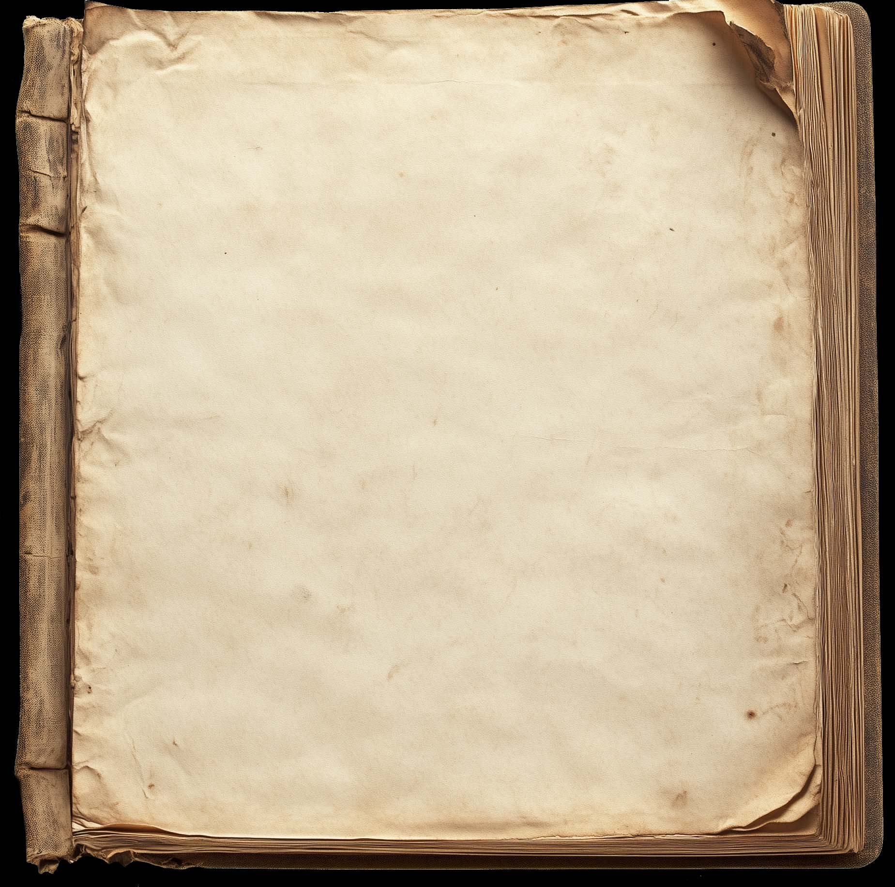
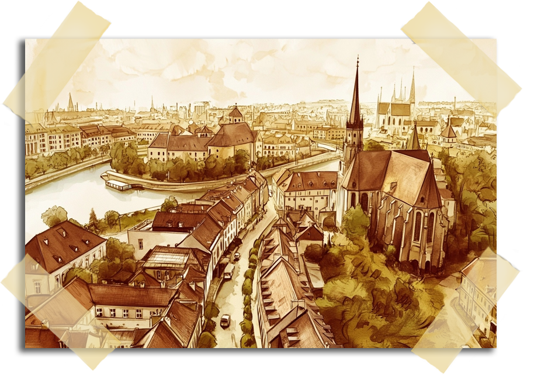
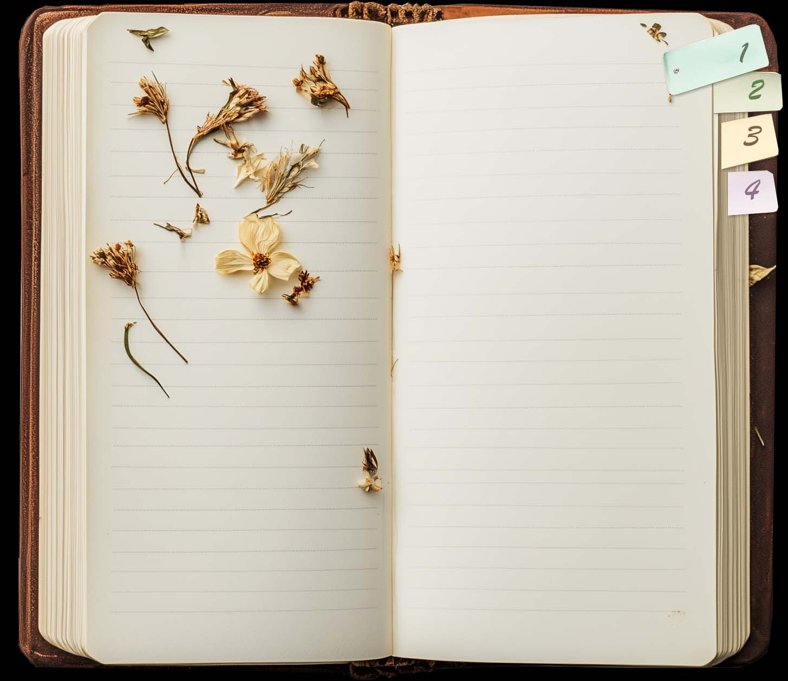
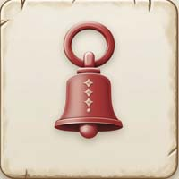
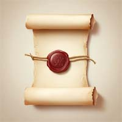
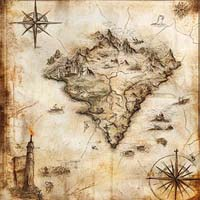
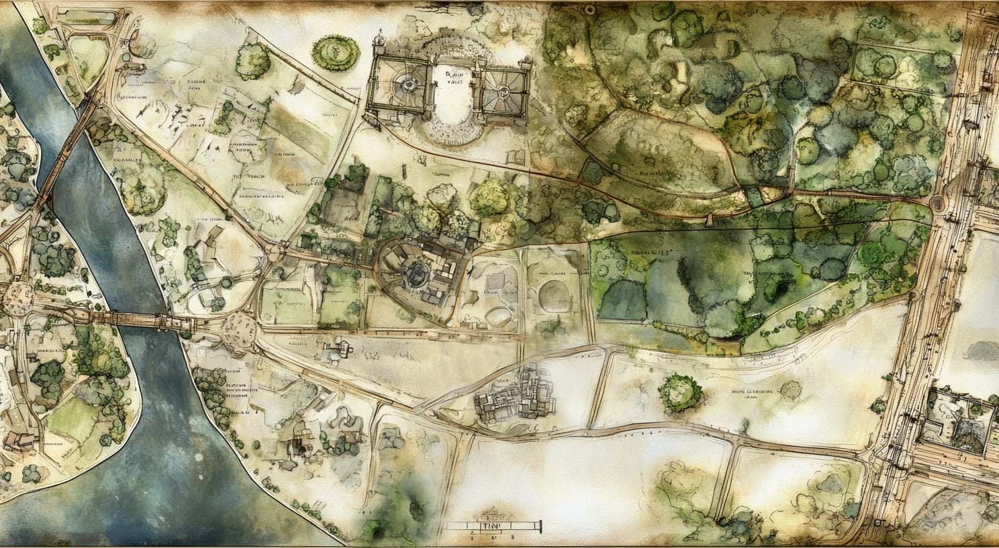
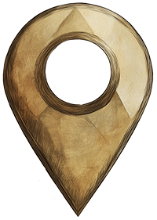
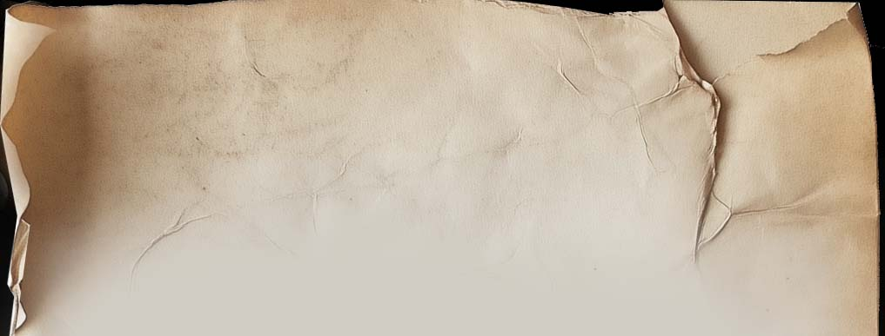
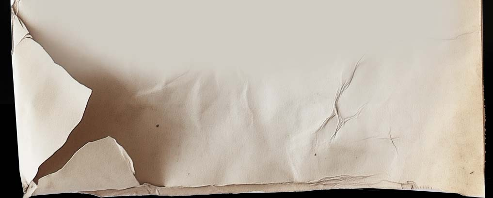

# Wroclaw Interactive Tour - Full Context

# Wroclaw Interactive Tour - Full Project Context

## 📍 О проекте

Интерактивный тур по острову Тумский (Wroclaw, Poland) - веб-приложение для виртуальной экскурсии с использованием панорамных изображений, геометок, квестов и мультиязычной поддержки.

## 🏗️ Архитектура

- **Тип:** Статический SPA (Single Page Application)
- **Framework:** Vanilla JavaScript ES6+ (без внешних фреймворков)
- **Routing:** iframe-based navigation через SPAManager
- **Localization:** 7 языков (ru, pl, en, de, cs, be, uk)
- **Hosting:** Static hosting (GitHub Pages / Netlify / Vercel)

## 📚 Ключевая документация

Перед работой с кодом **обязательно прочитай:**

1. **AGENTS.md** - Инструкции для AI-агентов, паттерны разработки
2. **ARCHITECTURE.md** - Архитектурные решения, WHY & HOW
3. **BACKLOG.md** - SINGLE SOURCE OF TRUTH для задач и статусов
4. **README.md** - User-facing документация

## 🎯 Текущий статус

**Phase:** Development - Content & Localization
**Completion:** ~75% MVP features

### ✅ Completed:
- SPA Navigation System
- GeoMarker System (universal handler)
- Music System (5 tracks)
- i18n Localization (7 languages)
- Quest Marker System
- Responsive Design
- Custom Cursors

### 🚧 In Progress:
- Content completion (24 tumski pages)
- Full localization (all 7 languages)
- Performance optimization

## 🔑 Ключевые модули

- `spa_integration.js` - SPA система
- `tumski_cathedral_handler.js` - Универсальный обработчик геометок
- `quest_marker_handler.js` - Квест маркеры
- `i18n.js` - Система локализации
- `map_modal.js` - Модальные окна карты
- `common_tumski.js` - Общая логика страниц

## 📂 Структура страниц

- 50+ HTML страниц локаций:
  - tumski*.html (24 страницы острова)
  - dwor*.html (13 дворов)
  - ogrod*.html (11 садов)
  - katedra_*.html (2 собора)

---

**🤖 Для AI-агентов:**
- Всегда читай AGENTS.md перед началом работы
- Проверяй BACKLOG.md для текущих задач
- Следуй модульной архитектуре (ES6 modules)
- Обновляй документацию после изменений


## Оглавление файлов

- [.ctxignore](#.ctxignore)
- [.cursor/rules/mcp.mdc](#.cursor-rules-mcp.mdc)
- [.DS_Store](#.ds_store)
- [.llm/intro.md](#.llm-intro.md)
- [.migrationignore](#.migrationignore)
- [AGENTS.md](#agents.md)
- [ARCHITECTURE.md](#architecture.md)
- [arrow_handlers.js](#arrow_handlers.js)
- [AUDIO_VISIBILITY_README.md](#audio_visibility_readme.md)
- [audio_visibility_test.html](#audio_visibility_test.html)
- [background_music111.js](#background_music111.js)
- [BACKLOG.md](#backlog.md)
- [book_paths.js](#book_paths.js)
- [CACHING.md](#caching.md)
- [CLAUDE.md](#claude.md)
- [comment_logs.sh](#comment_logs.sh)
- [common_buttons.js](#common_buttons.js)
- [common_tumski.css](#common_tumski.css)
- [common_tumski.js](#common_tumski.js)
- [common.js](#common.js)
- [debug_styles.html](#debug_styles.html)
- [DEVELOPMENT_PLAN_TEMPLATE.md](#development_plan_template.md)
- [dwor01.css](#dwor01.css)
- [dwor01.html](#dwor01.html)
- [dwor02.css](#dwor02.css)
- [dwor02.html](#dwor02.html)
- [dwor03.css](#dwor03.css)
- [dwor03.html](#dwor03.html)
- [dwor04.css](#dwor04.css)
- [dwor04.html](#dwor04.html)
- [dwor05.css](#dwor05.css)
- [dwor05.html](#dwor05.html)
- [dwor06.css](#dwor06.css)
- [dwor06.html](#dwor06.html)
- [dwor07.css](#dwor07.css)
- [dwor07.html](#dwor07.html)
- [dwor08.css](#dwor08.css)
- [dwor08.html](#dwor08.html)
- [dwor09.css](#dwor09.css)
- [dwor09.html](#dwor09.html)
- [dwor10.css](#dwor10.css)
- [dwor10.html](#dwor10.html)
- [dwor11.css](#dwor11.css)
- [dwor11.html](#dwor11.html)
- [dwor12.css](#dwor12.css)
- [dwor12.html](#dwor12.html)
- [dwor13.css](#dwor13.css)
- [dwor13.html](#dwor13.html)
- [i18n.js](#i18n.js)
- [iframe_music_disable.js](#iframe_music_disable.js)
- [index.html](#index.html)
- [init-project.sh](#init-project.sh)
- [init-starter.zip](#init-starter.zip)
- [katedra_01.html](#katedra_01.html)
- [katedra_panorama.html](#katedra_panorama.html)
- [language_menu.js](#language_menu.js)
- [locales/.DS_Store](#locales-.ds_store)
- [locales/be/translation.json](#locales-be-translation.json)
- [locales/be/translations.json](#locales-be-translations.json)
- [locales/cs/translation.json](#locales-cs-translation.json)
- [locales/cs/translations.json](#locales-cs-translations.json)
- [locales/de/translation.json](#locales-de-translation.json)
- [locales/de/translations.json](#locales-de-translations.json)
- [locales/en/translation.json](#locales-en-translation.json)
- [locales/en/translations.json](#locales-en-translations.json)
- [locales/pl/translation.json](#locales-pl-translation.json)
- [locales/pl/translations.json](#locales-pl-translations.json)
- [locales/ru/.DS_Store](#locales-ru-.ds_store)
- [locales/ru/translation.json](#locales-ru-translation.json)
- [locales/ru/translations.json](#locales-ru-translations.json)
- [locales/uk/translation.json](#locales-uk-translation.json)
- [locales/uk/translations.json](#locales-uk-translations.json)
- [map_modal.js](#map_modal.js)
- [map_points.js](#map_points.js)
- [MIGRATION.md](#migration.md)
- [ogrod02_handler.js](#ogrod02_handler.js)
- [ogrod02.css](#ogrod02.css)
- [ogrod02.html](#ogrod02.html)
- [ogrod03.css](#ogrod03.css)
- [ogrod03.html](#ogrod03.html)
- [ogrod04.css](#ogrod04.css)
- [ogrod04.html](#ogrod04.html)
- [ogrod05.css](#ogrod05.css)
- [ogrod05.html](#ogrod05.html)
- [ogrod06.css](#ogrod06.css)
- [ogrod06.html](#ogrod06.html)
- [ogrod07.css](#ogrod07.css)
- [ogrod07.html](#ogrod07.html)
- [ogrod08.css](#ogrod08.css)
- [ogrod08.html](#ogrod08.html)
- [ogrod09.css](#ogrod09.css)
- [ogrod09.html](#ogrod09.html)
- [ogrod12.css](#ogrod12.css)
- [ogrod12.html](#ogrod12.html)
- [ogrod13.css](#ogrod13.css)
- [ogrod13.html](#ogrod13.html)
- [panorama.html](#panorama.html)
- [pk01.css](#pk01.css)
- [pk01.html](#pk01.html)
- [pk02.css](#pk02.css)
- [pk02.html](#pk02.html)
- [PLAN_TEMPLATE.md](#plan_template.md)
- [PROCESS.md](#process.md)
- [PROJECT_INTAKE.md](#project_intake.md)
- [PROJECT_RULES.md](#project_rules.md)
- [PROJECT_SNAPSHOT.md](#project_snapshot.md)
- [quest_marker_handler.js](#quest_marker_handler.js)
- [QUICK_RULES.md](#quick_rules.md)
- [quick_test.html](#quick_test.html)
- [README.md](#readme.md)
- [REFACTORING_README.md](#refactoring_readme.md)
- [right_arrow_handler.js](#right_arrow_handler.js)
- [script.js](#script.js)
- [SECURITY.md](#security.md)
- [spa_integration.js](#spa_integration.js)
- [SPA_README.md](#spa_readme.md)
- [styles.css](#styles.css)
- [sunset_parallax copy.js](#sunset_parallax-copy.js)
- [sunset_parallax.html](#sunset_parallax.html)
- [sunset_parallax.js](#sunset_parallax.js)
- [TABLET_POSITIONING_README.md](#tablet_positioning_readme.md)
- [TESTING_INSTRUCTIONS.md](#testing_instructions.md)
- [town_music_handler.js](#town_music_handler.js)
- [tumski_cathedral_handler.js](#tumski_cathedral_handler.js)
- [tumski_init.js](#tumski_init.js)
- [tumski_page_common.js](#tumski_page_common.js)
- [tumski.css](#tumski.css)
- [tumski.html](#tumski.html)
- [tumski02.css](#tumski02.css)
- [tumski02.html](#tumski02.html)
- [tumski03.css](#tumski03.css)
- [tumski03.html](#tumski03.html)
- [tumski04.css](#tumski04.css)
- [tumski04.html](#tumski04.html)
- [tumski05.css](#tumski05.css)
- [tumski05.html](#tumski05.html)
- [tumski06.css](#tumski06.css)
- [tumski06.html](#tumski06.html)
- [tumski07.css](#tumski07.css)
- [tumski07.html](#tumski07.html)
- [tumski08.css](#tumski08.css)
- [tumski08.html](#tumski08.html)
- [tumski09.css](#tumski09.css)
- [tumski09.html](#tumski09.html)
- [tumski10.css](#tumski10.css)
- [tumski10.html](#tumski10.html)
- [tumski11.css](#tumski11.css)
- [tumski11.html](#tumski11.html)
- [tumski12.css](#tumski12.css)
- [tumski12.html](#tumski12.html)
- [tumski13.css](#tumski13.css)
- [tumski13.html](#tumski13.html)
- [tumski14.css](#tumski14.css)
- [tumski14.html](#tumski14.html)
- [tumski15.css](#tumski15.css)
- [tumski15.html](#tumski15.html)
- [tumski16.css](#tumski16.css)
- [tumski16.html](#tumski16.html)
- [tumski17.css](#tumski17.css)
- [tumski17.html](#tumski17.html)
- [tumski18.css](#tumski18.css)
- [tumski18.html](#tumski18.html)
- [tumski19.css](#tumski19.css)
- [tumski19.html](#tumski19.html)
- [tumski20.css](#tumski20.css)
- [tumski20.html](#tumski20.html)
- [tumski21.css](#tumski21.css)
- [tumski21.html](#tumski21.html)
- [tumski22.css](#tumski22.css)
- [tumski22.html](#tumski22.html)
- [tumski23.css](#tumski23.css)
- [tumski23.html](#tumski23.html)
- [tumski24.css](#tumski24.css)
- [tumski24.html](#tumski24.html)
- [visibility_audio_manager.js](#visibility_audio_manager.js)
- [WORKFLOW.md](#workflow.md)

---

## .ctxignore
<a id=".ctxignore"></a>

```
# Медиа файлы (большие)
media/**
*.jpg
*.png
*.mp3
*.wav
*.mp4
*.psd
*.mp4

# Утилиты
tools/**

# Шаблоны документации
Init/**

# Бэкапы
*.backup
*.new

# Выходной файл
project-context.md


```

## .cursor/rules/mcp.mdc
<a id=".cursor-rules-mcp.mdc"></a>

```

```

## .DS_Store
<a id=".ds_store"></a>

> Пропущен бинарный файл (18.0 KB). Добавь вручную при необходимости.

## .llm/intro.md
<a id=".llm-intro.md"></a>

```markdown
# Wroclaw Interactive Tour - Full Project Context

## 📍 О проекте

Интерактивный тур по острову Тумский (Wroclaw, Poland) - веб-приложение для виртуальной экскурсии с использованием панорамных изображений, геометок, квестов и мультиязычной поддержки.

## 🏗️ Архитектура

- **Тип:** Статический SPA (Single Page Application)
- **Framework:** Vanilla JavaScript ES6+ (без внешних фреймворков)
- **Routing:** iframe-based navigation через SPAManager
- **Localization:** 7 языков (ru, pl, en, de, cs, be, uk)
- **Hosting:** Static hosting (GitHub Pages / Netlify / Vercel)

## 📚 Ключевая документация

Перед работой с кодом **обязательно прочитай:**

1. **AGENTS.md** - Инструкции для AI-агентов, паттерны разработки
2. **ARCHITECTURE.md** - Архитектурные решения, WHY & HOW
3. **BACKLOG.md** - SINGLE SOURCE OF TRUTH для задач и статусов
4. **README.md** - User-facing документация

## 🎯 Текущий статус

**Phase:** Development - Content & Localization
**Completion:** ~75% MVP features

### ✅ Completed:
- SPA Navigation System
- GeoMarker System (universal handler)
- Music System (5 tracks)
- i18n Localization (7 languages)
- Quest Marker System
- Responsive Design
- Custom Cursors

### 🚧 In Progress:
- Content completion (24 tumski pages)
- Full localization (all 7 languages)
- Performance optimization

## 🔑 Ключевые модули

- `spa_integration.js` - SPA система
- `tumski_cathedral_handler.js` - Универсальный обработчик геометок
- `quest_marker_handler.js` - Квест маркеры
- `i18n.js` - Система локализации
- `map_modal.js` - Модальные окна карты
- `common_tumski.js` - Общая логика страниц

## 📂 Структура страниц

- 50+ HTML страниц локаций:
  - tumski*.html (24 страницы острова)
  - dwor*.html (13 дворов)
  - ogrod*.html (11 садов)
  - katedra_*.html (2 собора)

---

**🤖 Для AI-агентов:**
- Всегда читай AGENTS.md перед началом работы
- Проверяй BACKLOG.md для текущих задач
- Следуй модульной архитектуре (ES6 modules)
- Обновляй документацию после изменений


```

## .migrationignore
<a id=".migrationignore"></a>

```
# .migrationignore
#
# Исключить файлы и папки из процесса миграции на Claude Code Starter framework
# Синтаксис аналогичен .gitignore
#
# Используйте этот файл чтобы исключить:
# - Справочные статьи и обучающие материалы
# - Временные заметки и записи встреч
# - Исследовательские документы
# - Любые файлы, которые НЕ являются мета-документацией проекта

# ============================================
# Справочные материалы и статьи
# ============================================

# Папки со статьями
docs/articles/
docs/references/
docs/research/
references/
articles/

# Обучающие материалы
docs/tutorials/
docs/guides/
learn/

# Примеры кода (если это не часть документации проекта)
docs/examples/
examples/

# ============================================
# Временные заметки и записи
# ============================================

# Записи встреч (по паттерну)
notes/meeting-*.md
notes/standup-*.md
meeting-notes/

# Временные заметки
notes/brainstorm*.md
notes/temp*.md
notes/scratch*.md
temp/
scratch/

# Заметки с датами в названии
notes/*-2024-*.md
notes/*-2025-*.md

# ============================================
# Исследования и эксперименты
# ============================================

research/
experiments/
docs/research/
notes/research/

# ============================================
# Архивные документы
# ============================================

# Старые версии документации
docs/old/
docs/archive/
docs/deprecated/
archive/
old/

# Документы с версиями в названии
docs/*-v1.md
docs/*-old.md
docs/*-deprecated.md

# ============================================
# Специфичные файлы
# ============================================

# Конкретные файлы для исключения (примеры)
# docs/how-jwt-works.md
# notes/personal-notes.md
# TODO-2023.md

# ============================================
# Файлы по расширению
# ============================================

# Бинарные файлы (обычно не мета-документация)
*.pdf
*.doc
*.docx
*.xls
*.xlsx
*.ppt
*.pptx

# Изображения (диаграммы оставляем, но большие изображения исключаем)
# *.png
# *.jpg
# *.jpeg
# *.gif

# ============================================
# Системные файлы и временные
# ============================================

# macOS
.DS_Store

# Windows
Thumbs.db

# Editors
.vscode/
.idea/

# ============================================
# Примечания по использованию
# ============================================

# Паттерны:
# - `folder/` - исключить всю папку
# - `*.ext` - исключить все файлы с расширением
# - `name-*.md` - исключить файлы по паттерну
# - `path/to/file.md` - исключить конкретный файл
# - `**/folder/` - исключить папку в любом месте

# Негативные паттерны (НЕ исключать):
# - `!important.md` - НЕ исключать этот файл, даже если он попадает под другой паттерн

# Комментарии:
# - Начинаются с `#`
# - Пустые строки игнорируются

# ============================================
# Рекомендации
# ============================================

# ✅ ИСКЛЮЧАТЬ:
# - Справочные статьи (не о вашем проекте)
# - Временные заметки
# - Записи встреч
# - Исследовательские документы
# - Обучающие материалы

# ❌ НЕ ИСКЛЮЧАТЬ:
# - Документацию вашего проекта
# - Архитектурные решения
# - Требования к проекту
# - TODO списки и backlog
# - Workflow и процессы разработки

# ============================================
# После создания .migrationignore
# ============================================

# 1. Скопируйте этот файл: cp .migrationignore.example .migrationignore
# 2. Отредактируйте под ваш проект
# 3. Запустите /migrate
# 4. AI автоматически учтет исключения
# 5. Проверьте MIGRATION_REPORT.md секцию "Excluded Files"

```

## AGENTS.md
<a id="agents.md"></a>

```markdown
# AI Agent Instructions

**Project:** [PROJECT_NAME]
**Purpose:** Meta-instructions for effective AI-assisted development
**Created:** [DATE]
**Last Updated:** [DATE]

> **Note:** This file is optimized for AI assistants (Claude Code, Cursor, Copilot, etc.) working with this codebase.

---

## 🎯 Quick Start for AI Agents

### Required Reading (in order):
1. **SECURITY.md** - Security requirements and practices (READ FIRST!)
2. **ARCHITECTURE.md** - System architecture and technical decisions
3. **BACKLOG.md** - Current implementation status and roadmap (SINGLE SOURCE OF TRUTH)
4. **README.md** - User-facing project information
5. **WORKFLOW.md** - Development processes and sprint workflow

### ⚠️ SINGLE SOURCE OF TRUTH:
**BACKLOG.md** is the ONLY authoritative source for:
- Current implementation status
- Feature priorities
- Development roadmap

### Key Files Quick Reference:
\`\`\`bash
# Architecture & Planning
ARCHITECTURE.md                # System design and patterns
BACKLOG.md                     # Implementation status (SINGLE SOURCE OF TRUTH)
WORKFLOW.md                    # Development processes
README.md                      # User-facing documentation
CLAUDE.md                      # Auto-loaded context for Claude Code

# Core Application
[ЗАПОЛНИТЬ: основные файлы проекта]
# Например:
# src/store/useStore.ts        # State management
# src/lib/api.ts               # API service
# src/components/Main.tsx      # Main component

# Configuration
Makefile                       # Standard commands (make dev, make build, etc)
.env.example                   # Environment variables template
.claude/commands/              # Custom slash commands for Claude Code
.claude/settings.json          # Claude Code permissions
.claudeignore                  # Files to ignore in AI context
\`\`\`

### 📦 Standard Commands (Makefile):
Проект использует Makefile для стандартизации команд:

\`\`\`bash
# Development
make dev          # Запустить development сервер
make build        # Собрать для production
make start        # Запустить production сервер

# Quality Checks
make lint         # Проверить код линтером
make fix-lint     # Автоматически исправить линтер
make typecheck    # Проверить TypeScript типы
make test         # Запустить тесты
make test-watch   # Тесты в watch режиме

# Security & Dependencies
make security     # npm audit проверка
make security-fix # Автоматически исправить уязвимости
make audit        # Полная проверка (lint+typecheck+test+security)

# Database (когда будет использоваться)
make db-migrate   # Применить миграции БД
make db-reset     # Сбросить БД
make db-seed      # Заполнить тестовыми данными

# Utility
make install      # Установить зависимости
make clean        # Очистить build артефакты
make reinstall    # Переустановить зависимости
make doctor       # Диагностика окружения
make help         # Показать все команды

# Pre-commit/push checks
make pre-commit   # lint + typecheck
make pre-push     # audit + build
\`\`\`

**ВАЖНО:** Всегда используй `make <command>` вместо прямого `npm run <command>`
- Makefile контролирует что именно запускается
- Проще для Claude Code автоматизировать (через .claude/settings.json)
- Единообразие команд между проектами

---

## 📚 Technology Stack

### Frontend
[ЗАПОЛНИТЬ: Frontend технологии]
\`\`\`
- Framework: [React/Vue/Angular/Next.js/etc]
- Language: [TypeScript/JavaScript]
- State Management: [Redux/Zustand/Context/etc]
- Styling: [Tailwind/CSS Modules/Styled Components/etc]
- Build Tool: [Vite/Webpack/Next.js/etc]
\`\`\`

### Backend & Infrastructure
[ЗАПОЛНИТЬ: Backend технологии]
\`\`\`
- Database: [PostgreSQL/MySQL/MongoDB/etc]
- Authentication: [Supabase Auth/Auth0/Firebase/etc]
- API: [REST/GraphQL/tRPC/etc]
- Hosting: [Vercel/AWS/etc]
\`\`\`

### Key Dependencies
\`\`\`json
{
  "[ЗАПОЛНИТЬ]": "версия и назначение",
}
\`\`\`

---

## 🚫 NEVER DO

### Code & Architecture
- ❌ **[ЗАПОЛНИТЬ: специфичные для проекта правила]**
- ❌ **Update database structure** without migration script
- ❌ **Use `any` type** without explicit justification (TypeScript projects)
- ❌ **Create multiple components in one file** (если используется компонентный подход)
- ❌ **Duplicate API calls** (especially in polling loops)
- ❌ **Ignore security best practices** (SQL injection, XSS, CSRF)

### Process & Documentation
- ❌ **Skip documentation updates** after sprint completion
- ❌ **Modify BACKLOG.md** without completing actual implementation
- ❌ **Create commits** without meaningful messages
- ❌ **Update dependencies** without testing
- ❌ **Push to main/master** without review (if team workflow requires it)

### 🔐 Security (CRITICAL - READ SECURITY.md FIRST!)

**📖 ПОЛНАЯ ПОЛИТИКА БЕЗОПАСНОСТИ:** SECURITY.md

**ДО начала любой задачи с кодом:**
1. Прочитай SECURITY.md → Stage 1 (Planning)
2. Следуй чеклистам для текущей стадии
3. В случае сомнений → `/security` для audit

**Ключевые принципы (все детали в SECURITY.md):**
- 🔐 Secrets management → SECURITY.md "Environment Variables"
- 🔐 Input validation → SECURITY.md Stage 3
- 🔐 SQL injection prevention → SECURITY.md "Database Security"
- 🔐 XSS prevention → SECURITY.md "Output Sanitization"

**AGENTS.md содержит только project-specific security patterns!**
См. "Project Security Patterns" section ниже для специфичных правил этого проекта.

---

## ✅ ALWAYS DO

### Before Making Changes
- ✅ **Read ARCHITECTURE.md** for architectural decisions
- ✅ **Check BACKLOG.md** for current status
- ✅ **Review related documentation** before making changes
- ✅ **Test in development** environment first

### During Development
- ✅ **Use existing patterns** from codebase
- ✅ **Follow TypeScript strict mode** (type everything properly)
- ✅ **Write migration scripts** for database changes
- ✅ **Update types** after schema changes
- ✅ **Test thoroughly** before marking tasks as complete
- ✅ **Use TodoWrite tool** to track progress

### 🔐 Security (Every Single Time)

**📖 ИСПОЛЬЗУЙ CHECKLISTS ИЗ SECURITY.md:**
- См. SECURITY.md → Stage-specific checklists
- См. SECURITY.md → "Security Requirements by Stage"

**Быстрая проверка:**
\`\`\`bash
/security  # Запустить AI-guided security audit
make security  # npm audit проверка
\`\`\`

### After Completion
- ✅ **Update BACKLOG.md** with implementation status
- ✅ **Update ARCHITECTURE.md** if architectural changes made
- ✅ **Update AGENTS.md** if new patterns/rules discovered
- ✅ **Update README.md** if user-facing changes
- ✅ **Create meaningful git commit** (see WORKFLOW.md for template)
- ✅ **Mark all TodoWrite tasks** as completed

---

## 🔧 Standard Workflows

### Database Changes
\`\`\`
1. Analysis → Read current database schema/documentation
2. Planning → Create migration script
3. Testing → Apply migration in development
4. Type Update → Update TypeScript types (if applicable)
5. Documentation → Update ARCHITECTURE.md or database docs
6. Code → Implement feature using new schema
7. Sprint Completion → Update BACKLOG.md and AGENTS.md
\`\`\`

### New Feature Development
\`\`\`
1. Read ARCHITECTURE.md (understand patterns)
2. Check BACKLOG.md (current status)
3. Plan with TodoWrite tool
4. Implement following existing patterns
5. Test thoroughly
6. Update documentation (BACKLOG.md, AGENTS.md, README.md)
7. Create sprint completion commit
\`\`\`

### Bug Fix
\`\`\`
1. Diagnose root cause
2. Check if similar issue exists in AGENTS.md "Common Issues"
3. Fix following existing patterns
4. Test fix
5. Add to "Common Issues" section if applicable
6. Update version in README.md if necessary
\`\`\`

### 🔐 Security Review (Before Every Deploy)

**📖 ИСПОЛЬЗУЙ CHECKLIST ИЗ SECURITY.md:**
- См. SECURITY.md → Stage 5 (Pre-Deployment)
- См. SECURITY.md → "Security Sign-Off Template"

**Или используй автоматизацию:**
\`\`\`bash
/security  # Запустить AI-guided security audit
\`\`\`

---

## 🏗️ Architectural Patterns

[ЗАПОЛНИТЬ: Специфичные для проекта архитектурные решения]

### Примеры паттернов для заполнения:

#### State Management Pattern
**Decision:** [Redux/Zustand/Context/etc]
**Reason:**
- [Причина 1]
- [Причина 2]

**Example:**
\`\`\`typescript
// Пример использования
\`\`\`

#### API Integration Pattern
**Decision:** [Как организованы API запросы]
**Reason:**
- [Причина 1]

#### File/Data Structure Pattern
**Decision:** [Как организованы данные]
**Reason:**
- [Причина 1]

---

## 🔐 Project Security Patterns

> **Важно:** Этот раздел для СПЕЦИФИЧНЫХ для ЭТОГО проекта security patterns.
> Общие правила безопасности см. SECURITY.md

[ЗАПОЛНИТЬ по мере разработки проекта]

### Pattern 1: [Project-Specific Security Rule]
[Описание специфичного для проекта security pattern]

**Template:**
\`\`\`markdown
### Pattern N: [Name]
**Context:** [When this applies]
**Rule:** [What to do]
**Reason:** [Why this is important for THIS project]
**Example:**
[Code example]
\`\`\`

---

## 🐛 Common Issues & Solutions

[ЗАПОЛНИТЬ по мере обнаружения проблем]

### Issue: [Название проблемы]
**Symptom:** [Описание симптома]
**Root Cause:** [Причина]
**Solution:** [Решение]
**File:** [Где исправлять]

### Template для добавления:
\`\`\`markdown
### Issue: [Название]
**Symptom:** [Что видит пользователь/разработчик]
**Root Cause:** [Почему происходит]
**Solution:** [Как исправить]
**File:** [Где находится код]
\`\`\`

---

## 📋 Task Checklists

### Adding New Feature
- [ ] Read ARCHITECTURE.md and BACKLOG.md
- [ ] Create TodoWrite task list
- [ ] Implement following existing patterns
- [ ] Write/update tests
- [ ] Update TypeScript types (if applicable)
- [ ] Update UI components
- [ ] Update BACKLOG.md status
- [ ] Update ARCHITECTURE.md (if architectural changes)
- [ ] Update README.md (if user-facing changes)
- [ ] Create sprint completion commit

### Database Schema Change
- [ ] Create migration script
- [ ] Test in development environment
- [ ] Update TypeScript types/interfaces
- [ ] Update database documentation
- [ ] Update related code
- [ ] Test all affected features
- [ ] Update ARCHITECTURE.md
- [ ] Update BACKLOG.md status
- [ ] Create sprint completion commit

### Bug Fix
- [ ] Reproduce and document bug
- [ ] Identify root cause
- [ ] Implement fix
- [ ] Test fix thoroughly
- [ ] Check for similar issues elsewhere
- [ ] Add to "Common Issues" (if applicable)
- [ ] Update BACKLOG.md (if tracked)
- [ ] Create fix commit

---

## 🎯 Custom Slash Commands

Проект включает кастомные slash-команды для автоматизации типичных задач:

### Основные команды:
- `/security` - провести security audit (см. SECURITY.md)
- `/test` - написать тесты для кода
- `/feature` - спланировать и реализовать новую фичу
- `/review` - провести code review последних изменений
- `/optimize` - оптимизировать производительность кода
- `/refactor` - помочь с рефакторингом кода
- `/explain` - объяснить как работает код
- `/fix` - найти и исправить баг

### Новые команды для workflow:
- `/commit` - создать git commit с правильным сообщением
  - Анализирует изменения
  - Проверяет на секреты
  - Создает осмысленное сообщение (why, not what)
  - Добавляет Co-Authored-By: Claude

- `/pr` - создать Pull Request
  - Анализирует ВСЕ коммиты (не только последний!)
  - Создает детальное описание
  - Включает test plan и checklist
  - Использует gh CLI

- `/migrate` - создать database migration
  - Анализирует текущую схему
  - Создает безопасную миграцию
  - Обновляет TypeScript types
  - Настраивает RLS policies

**Использование:**
\`\`\`bash
# В Claude Code просто набери:
/commit
/pr
/migrate
\`\`\`

---

## 🚀 Release Management (для claude-code-starter проекта)

> **⚠️ ВАЖНО:** Эта секция применяется **ТОЛЬКО для проекта claude-code-starter**
> НЕ применяй эти правила к пользовательским проектам!

### Проактивный Release Checking

**Контекст:** Когда работаешь с `claude-code-starter` фреймворком (путь `/Users/alexeykrolmini/Downloads/Code/Project_init`), ты ДОЛЖЕН автоматически предлагать создание релиза после существенных изменений.

**Почему это важно:**
\`\`\`
Смысл фреймворка - помогать другим проектам ничего не упускать.
Мы сами не должны забывать обновлять README и CHANGELOG!
("Сапожник без сапог" проблема)
\`\`\`

### Определение "Существенные Изменения"

**Существенными считаются:**

1. **Новые фичи:**
   - Новые slash-команды добавлены в `.claude/commands/`
   - Новые секции в шаблонах (Init/, init_eng/)
   - Новые протоколы (например, Cold Start Protocol)
   - Новые файлы документации

2. **Исправления багов:**
   - Исправлены критические ошибки в командах
   - Исправлены ошибки в логике миграции
   - Исправлены ошибки в шаблонах

3. **Улучшения документации:**
   - Добавлены существенные секции в README
   - Добавлены новые best practices
   - Добавлены примеры использования

**НЕ существенными считаются:**
- Опечатки (typos)
- Форматирование без изменения содержания
- Комментарии в коде
- Мелкие правки текста

### Правила Проактивного Предложения

**После коммита существенных изменений:**

1. **Проанализируй последние коммиты:**
   \`\`\`bash
   git log --oneline -n 5
   \`\`\`

2. **Оцени существенность:**
   - IF новые файлы в .claude/commands/ → Существенно
   - IF изменения в Init/ шаблонах → Существенно
   - IF новые секции в README → Существенно
   - IF bugfixes в командах → Существенно

3. **Автоматически предложи релиз:**
   \`\`\`
   ✅ Изменения закоммичены.

   🎯 Обнаружены существенные изменения:
   - [список изменений]

   💡 Рекомендуется создать релиз для обновления CHANGELOG и README.

   Создать релиз?
   1. Patch (X.X.N) - bugfixes, documentation
   2. Minor (X.N.0) - new features
   3. Major (N.0.0) - breaking changes

   Выберите [1/2/3] или "skip":
   \`\`\`

4. **IF пользователь выбрал 1/2/3:**
   - Запусти `/release` автоматически
   - Передай выбранный тип релиза

5. **IF пользователь выбрал "skip":**
   - Не предлагай повторно в этой сессии
   - Но предложи снова в следующей сессии если релиз не создан

### Slash-команда `/release`

**Назначение:** Автоматизирует процесс создания релиза

**Что делает:**
1. Анализирует изменения с последнего релиза
2. Определяет тип релиза (patch/minor/major)
3. Обновляет версию в README.md и README_RU.md
4. Создает запись в CHANGELOG.md
5. Пересобирает zip-архивы (init-starter.zip, init-starter-en.zip)
6. Создает release commit
7. Пушит на GitHub
8. Опционально создает GitHub Release

**Использование:**
\`\`\`bash
/release
\`\`\`

**Когда использовать:**
- После завершения новой фичи
- После исправления критического бага
- После существенных изменений в документации
- Перед анонсированием обновлений

### Проверка Релиза В "Cold Start"

**При перезагрузке сессии (Cold Start):**

1. **Прочитай первые 20 строк README.md**
   \`\`\`bash
   head -n 20 README.md
   \`\`\`

2. **Извлеки текущую версию:**
   \`\`\`markdown
   []
   \`\`\`

3. **Проверь последний коммит:**
   \`\`\`bash
   git log -1 --oneline
   \`\`\`

4. **IF последний коммит НЕ "chore: Release v..." AND есть новые коммиты:**
   \`\`\`bash
   git log --oneline --grep="chore: Release" -1  # последний релиз
   git log <last-release>..HEAD --oneline        # коммиты после релиза
   \`\`\`

5. **IF найдены существенные изменения без релиза:**
   - Предложи создать релиз (см. шаблон выше)
   - НО только один раз, не при каждом сообщении

### Интеграция с TodoWrite

**Если работаешь над фичей/багфиксом:**

1. Добавь в todo list:
   \`\`\`
   - Implement feature X
   - Test feature X
   - Update documentation
   - Create release  # ← Добавляй автоматически для существенных изменений
   \`\`\`

2. После завершения всех задач → автоматически предложи `/release`

### Примеры

**Пример 1: Новая команда добавлена**
\`\`\`
✅ Создана новая slash-команда /release

🎯 Это существенное изменение:
- Добавлен Init/.claude/commands/release.md
- Добавлен init_eng/.claude/commands/release.md
- Обновлены AGENTS.md и WORKFLOW.md

💡 Рекомендуется создать Minor релиз (новая фича).

Создать релиз 1.3.0? [y/n]
\`\`\`

**Пример 2: Критический багфикс**
\`\`\`
✅ Исправлена критическая ошибка в /migrate команде

🎯 Это существенное изменение:
- Исправлены 8 багов в migrate.md
- Обновлена логика архивирования

💡 Рекомендуется создать Patch релиз.

Создать релиз 1.2.6? [y/n]
\`\`\`

### ⚠️ КРИТИЧНО: После КАЖДОГО Коммита

**ОБЯЗАТЕЛЬНО после создания ЛЮБОГО коммита:**

1. **Проверь README.md и README_RU.md:**
   - [ ] Список фич отражает изменения
   - [ ] Количество шаблонов точное (например: "14 шаблонов" если добавили 3 файла)
   - [ ] Версия в badge актуальна (если релиз)
   - [ ] Cold Start Protocol описание актуально (% экономии токенов)
   - [ ] Таблица "What's in Init/" содержит все новые файлы

2. **Проверь CHANGELOG.md:**
   - [ ] Добавлена запись для текущей версии
   - [ ] Описаны все существенные изменения
   - [ ] Указано количество измененных строк/файлов
   - [ ] Добавлен раздел "Why This Matters"

**Почему это КРИТИЧНО:**
\`\`\`
Смысл фреймворка - помогать другим проектам ничего не упускать.
Мы сами НЕ ДОЛЖНЫ забывать обновлять README и CHANGELOG!
("Сапожник без сапог" проблема v2.0)
\`\`\`

**Пример того, что забыли в v1.4.0:**
- ❌ README говорил "11 шаблонов" вместо "14 шаблонов"
- ❌ Features list говорил "60% экономия" вместо "85% экономия (5x дешевле!)"
- ❌ Не упомянули PROJECT_SNAPSHOT.md и модульный фокус в features

**Как проверить:**
\`\`\`bash
# После каждого коммита:
git diff HEAD~1 README.md       # Проверить что README обновлен
git diff HEAD~1 CHANGELOG.md    # Проверить что CHANGELOG обновлен
\`\`\`

**Правило для AI:**
После КАЖДОГО коммита AI ДОЛЖЕН:
1. Прочитать README.md (features section, file count)
2. Прочитать CHANGELOG.md (последняя версия)
3. Проверить соответствие с коммитом
4. Если несоответствие → немедленно исправить

---

### Checklist Перед Релизом

Перед запуском `/release` убедись:
- [ ] Все изменения закоммичены
- [ ] Working directory чист
- [ ] Протестированы новые фичи
- [ ] Документация обновлена
- [ ] **README.md и CHANGELOG.md проверены (см. выше)**
- [ ] Нет конфликтов в git

---

## 🔍 Debugging Quick Reference

### [ЗАПОЛНИТЬ: Специфичные команды для отладки]

\`\`\`bash
# Database debugging
[команды для проверки БД]

# API debugging
[команды для проверки API]

# State debugging
[команды для проверки состояния]
\`\`\`

---

## 📊 Performance Guidelines

### [ЗАПОЛНИТЬ: Специфичные для проекта]

**API Optimization:**
- [Правило 1]
- [Правило 2]

**Database Performance:**
- [Правило 1]
- [Правило 2]

**Frontend Performance:**
- [Правило 1]
- [Правило 2]

---

## 🚀 Code Templates

### [ЗАПОЛНИТЬ: Шаблоны кода для проекта]

#### New Component Template
\`\`\`typescript
// Пример шаблона компонента
\`\`\`

#### New API Route Template
\`\`\`typescript
// Пример шаблона API route
\`\`\`

#### New Service Method Template
\`\`\`typescript
// Пример шаблона метода сервиса
\`\`\`

---

## 📝 Sprint Workflow

See **WORKFLOW.md** for detailed sprint processes, including:
- Sprint structure and phases
- Completion checklists
- Commit message templates
- Documentation update requirements

**Key Rule:** NEVER end a sprint without updating all relevant documentation files.

---

## 📋 Где брать чек-листы и задачи

**КРИТИЧНО для AI:**

**Когда пользователь спрашивает:**
- "Покажи чек-лист для текущего этапа"
- "Что осталось сделать?"
- "Какие задачи в Sprint 1?"
- "Дай план работы"

**✅ ПРАВИЛЬНО:**
1. Читай **BACKLOG.md** → там детальный план с чек-листами
2. Показывай статусы: ✅ DONE / 🚧 IN PROGRESS / ⏳ TODO
3. BACKLOG.md = single source of truth для задач
4. Если нужны архитектурные справки → тогда ARCHITECTURE.md

**❌ НЕПРАВИЛЬНО:**
- ❌ Не читай ARCHITECTURE.md для оперативных чек-листов
- ❌ ARCHITECTURE.md = справка о WHY (технологии, принципы), не про WHAT делать сейчас
- ❌ Не генерируй чек-лист "из головы" если есть BACKLOG.md
- ❌ Не пытайся извлечь задачи из разделов "Phase 1, Phase 2" в ARCHITECTURE.md

**Почему это важно:**
Если детальные задачи хранятся в ARCHITECTURE.md, AI может пропустить вложенные пункты
из-за большого размера файла. BACKLOG.md = structured task list, AI читает все пункты.

**Пример правильного ответа:**
\`\`\`
Пользователь: "Покажи что осталось сделать в Sprint 1"

AI Response:
1. ✅ Читаю BACKLOG.md...
2. Показываю секцию "Sprint 1" с чек-листами
3. Объясняю статусы каждой задачи
4. Если нужны детали реализации → смотрю в ARCHITECTURE.md
\`\`\`

**Исключение:**
Если BACKLOG.md пуст/не заполнен → можно использовать общий план
из ARCHITECTURE.md как fallback, но предложи пользователю создать BACKLOG.md
с детальными задачами.

---

## 🔄 Version History

- **[DATE]:** Initial template created
- [Добавляйте записи по мере развития проекта]

---

## 📝 Notes for Customization

Когда заполняете этот файл для конкретного проекта:

1. **Замените [ЗАПОЛНИТЬ]** на актуальную информацию
2. **Удалите эту секцию** после заполнения
3. **Добавляйте новые секции** по мере необходимости
4. **Обновляйте** после каждого спринта
5. **Документируйте паттерны** которые появляются в проекте
6. **Добавляйте в Common Issues** решенные проблемы

---

*This file should be updated after every sprint completion*
*Goal: Maintain living documentation for effective AI-assisted development*
*Compatible with: Claude Code, Cursor, GitHub Copilot, and other AI coding assistants*

```

## ARCHITECTURE.md
<a id="architecture.md"></a>

```markdown
# Project Architecture

**Project:** Wroclaw - Interactive Tumski Island Tour
**Version:** 0.1.0
**Last Updated:** 2025-01-11

---

> **🏗️ Authoritative Source:** This is the SINGLE SOURCE OF TRUTH for:
> - WHY we chose specific technologies (technology choices, design principles)
> - HOW the system is structured (modules, layers, components)
> - Modularity philosophy and patterns
> - Design principles and architecture patterns
>
> **⚠️ NOT for operational checklists:**
> ❌ Don't store detailed implementation tasks here (→ BACKLOG.md)
> ❌ Don't store sprint checklists here (→ BACKLOG.md)
> ❌ Don't store "Phase 1: do X, Y, Z" task lists here (→ BACKLOG.md)
>
> **This file = Reference (WHY & HOW)**
> **BACKLOG.md = Action Plan (WHAT to do now)**
>
> Other files (CLAUDE.md, PROJECT_INTAKE.md) link here, don't duplicate.

## 📊 Technology Stack

### Frontend
\`\`\`
- Framework: Vanilla JavaScript (ES6+ modules) - без фреймворков
- Language: JavaScript (ES6+)
- Build Tool: Нет (статический сайт, direct HTML/CSS/JS)
- State Management: localStorage для настроек пользователя (язык, звук)
- UI/CSS: Plain CSS с модульной структурой
- Icons: Custom PNG иконки (media/)
- Routing: SPA system через iframe и history API
\`\`\`

**Почему Vanilla JS:**
- ✅ Минимальные зависимости (быстрая загрузка)
- ✅ Полный контроль над производительностью
- ✅ Простота поддержки и понимания кода
- ✅ Не требует сборки (прямая работа с файлами)
- ✅ Легко расширять новыми модулями

### Backend & Infrastructure
\`\`\`
- Database: Нет (данные в JSON файлах локализации)
- Authentication: Нет (публичный проект)
- API Type: Нет API (статический контент)
- File Storage: Локальная файловая система (media/)
- Hosting: Static hosting (Netlify / GitHub Pages / Vercel)
\`\`\`

**Почему статический сайт:**
- ✅ Быстрая загрузка без сервера
- ✅ Бесплатный хостинг на GitHub Pages/Netlify
- ✅ Нет проблем с масштабированием
- ✅ Простота деплоя (push в git)
- ✅ Безопасность (нет серверной логики)

### Key Dependencies
\`\`\`json
{
  "Нет внешних зависимостей": "Проект использует только нативные веб-технологии"
}
\`\`\`

**Внешние ресурсы:**
- Google Fonts: Marck Script, Roboto (для типографики)
- Все остальное самодостаточно

---

## 🗂️ Project Structure

\`\`\`
Wroclaw/
├── index.html               # SPA главная страница (SPAManager)
├── tumski.html             # Основная страница локации 1
├── tumski02.html - tumski24.html  # 23 дополнительные локации
├── dwor*.html              # Страницы дворов (13 страниц)
├── ogrod*.html             # Страницы садов (11 страниц)
├── katedra_*.html          # Страницы собора (2 страницы)
│
├── styles.css              # Общие стили
├── common_tumski.css       # Общие стили для tumski страниц
├── tumski*.css             # Специфичные стили для каждой страницы
├── common_buttons.js       # Общие функции кнопок
│
├── spa_integration.js      # SPA интеграция для совместимости
├── common_tumski.js        # Общая логика tumski страниц (ES6 module)
├── tumski_cathedral_handler.js  # Универсальный обработчик геометок (ES6 module)
├── quest_marker_handler.js # Обработчик квест-маркеров (ES6 module)
├── i18n.js                 # Система локализации
├── map_modal.js            # Модальные окна для геометок
├── language_menu.js        # Меню переключения языка
├── arrow_handlers.js        # Обработчики навигационных стрелок
├── book_paths.js           # Обработчики книжных зон
├── map_points.js           # Инициализация точек на карте
├── visibility_audio_manager.js  # Управление видимостью аудио
│
├── locales/                # Локализация (7 языков)
│   ├── ru/
│   │   └── translations.json
│   ├── pl/, en/, de/, cs/, be/, uk/  # Остальные языки
│
├── media/                  # Медиа файлы
│   ├── tumski/            # Изображения локаций
│   ├── book/               # Изображения книжных зон
│   ├── zwyki/              # Аудио треки (town, birds, kostel, hang, quest)
│   ├── *.wav               # Звуковые эффекты
│   └── *.png               # Иконки и курсоры
│
└── Init/                   # Документация фреймворка
    ├── CLAUDE.md
    ├── PROJECT_INTAKE.md
    └── ...
\`\`\`

---

## 🏗️ Core Architecture Decisions

### 1. SPA Architecture через iframe

**Decision:** Использование iframe для загрузки страниц внутри index.html вместо полной замены DOM

**Reasoning:**
- ✅ Полная изоляция страниц (не конфликтуют стили/скрипты)
- ✅ Простота реализации (каждая страница независима)
- ✅ Кэширование страниц в браузере
- ✅ Сохранение состояния каждой страницы

**Alternatives considered:**
- ❌ Полная замена DOM через fetch/innerHTML - сложнее управление состоянием, конфликты скриптов
- ❌ React/Vue роутинг - избыточно для статического контента, требует сборку

**Implementation:**
\`\`\`javascript
// index.html содержит SPAManager
class SPAManager {
  async loadPage(pageName) {
    const iframe = document.createElement('iframe');
    iframe.src = `${pageName}?t=${timestamp}`;
    // iframe загружается и встраивается в SPA контейнер
  }
}
\`\`\`

### 1.1. Маркеры посещённых страниц на карте

**Decision:** Сохраняем факт первого посещения страницы и показываем на карте кликабельную метку в координатах точки страницы. Клик по метке переносит пользователя на соответствующую страницу.

**Reasoning:**
- ✅ Быстрая визуальная навигация по уже открытым локациям
- ✅ Прогресс пользователя виден прямо на карте
- ✅ Минимальные зависимости: хранение в `localStorage`

**Implementation:**
- Сохранение: при инициализации страницы считываем `data-map-point` у `.image-container` и сохраняем `{ page, point, title }` в `localStorage.visitedPages`.
- Отрисовка: при открытии карты (`map_modal.js`) создаём слой `#visited-markers-layer` и для каждой посещённой страницы ставим `.visited-marker` в координатах точки (`getMapPointCoords`).
- Навигация: по клику — `SPAManager.loadPage(page)` если доступен, иначе `location.href = page`.
- Адаптация: проценты для desktop, пересчёт в пиксели для mobile, обновление позиций на `resize`.

**Locations:**
- `map_modal.js` — сохранение посещения, рендер и позиционирование маркеров, переход по клику.
- `map_points.js` — источник координат точек.


### 2. ES6 Modules для модульной архитектуры

**Decision:** Использование ES6 import/export для разделения логики на модули

**Reasoning:**
- ✅ Явные зависимости между модулями
- ✅ Изоляция кода (нет глобальных переменных)
- ✅ Динамическая загрузка модулей (lazy loading)
- ✅ Поддержка нативно в современных браузерах

**Alternatives considered:**
- ❌ Global functions/objects - конфликты имен, сложно отслеживать зависимости
- ❌ CommonJS require - требует сборку

### 3. Универсальный обработчик геометок

**Decision:** Один `tumski_cathedral_handler.js` обрабатывает все геометки через универсальную функцию `setupUniversalGeoMarker()`

**Reasoning:**
- ✅ Единая логика для всех геометок (DRY принцип)
- ✅ Простое добавление новых геометок (вызов одной функции)
- ✅ Централизованное исправление багов
- ✅ Меньше дублирования кода

**Alternatives considered:**
- ❌ Отдельный обработчик для каждой геометки - дублирование кода, сложнее поддержка
- ❌ Инлайн обработчики в HTML - сложнее управлять, нет переиспользования

**Implementation:**
\`\`\`javascript
// common_tumski.js
import { setupUniversalGeoMarker } from './tumski_cathedral_handler.js';

geometries.forEach(geometry => {
  setupUniversalGeoMarker({
    markerId: 'tumski_cathedral',
    i18nKey: 'tumski_cathedral'
  });
});
\`\`\`

---

### Template для новых решений:

\`\`\`markdown
### N. [Название решения]

**Decision:** [Краткое описание решения]
**Reasoning:**
- ✅ [Преимущество 1]
- ✅ [Преимущество 2]

**Alternatives considered:**
- ❌ [Отвергнутая альтернатива] - [причина]

**Data structure/Implementation:**
[Код или структура данных]
\`\`\`

---

## 🔧 Key Services & Components

### [Сервис/Компонент #1]
**Purpose:** [Назначение]
**Location:** `[путь к файлу]`

**Key methods/features:**
\`\`\`typescript
- method1() → описание
- method2() → описание
- feature1 → описание
\`\`\`

**Architectural features:**
- [Особенность 1]
- [Особенность 2]

**Example usage:**
\`\`\`typescript
// Пример использования
\`\`\`

---

### Template для документирования сервисов:

\`\`\`markdown
### [Service Name]
**Purpose:** [Что делает]
**Location:** `[file path]`

**Key methods:**
- method() → [описание]

**Features:**
- [Особенность]

**Example:**
[код]
\`\`\`

---

## 📡 Data Flow & Integration Patterns

### 1. [User Flow #1 - например "User Login"]
\`\`\`
User Action →
├── Step 1
├── Step 2
├── Step 3
└── Final Result
\`\`\`

**Detailed flow:**
1. [Шаг 1 детально]
2. [Шаг 2 детально]
3. [Шаг 3 детально]

### 2. [User Flow #2]
\`\`\`
[Диаграмма потока]
\`\`\`

---

### Template для документирования потоков:

\`\`\`markdown
### N. [Flow Name]
[ASCII диаграмма]

**Detailed:**
1. [Шаг]
2. [Шаг]
\`\`\`

---

## 🎯 Development Standards

### Code Organization
- [ЗАПОЛНИТЬ: стандарты организации кода]
- **1 component = 1 file** (если применимо)
- **Services in lib/** for reusability
- **TypeScript strict mode** - no `any` (except justified exceptions)
- **Naming:** [соглашения по именованию]

### Database Patterns
[ЗАПОЛНИТЬ: если есть база данных]
- **Primary Keys:** [UUID/Auto-increment/etc]
- **Relationships:** [как организованы связи]
- **Migrations:** [как применяются миграции]
- **Security:** [RLS/Permissions/etc]

### Error Handling
- **Try/catch** in async functions
- **User-friendly** error messages (на русском/английском)
- **Console logging** for debugging
- **Fallback states** in UI

### Performance Optimizations
- [ЗАПОЛНИТЬ: специфичные для проекта оптимизации]
- **[Оптимизация 1]**
- **[Оптимизация 2]**
- **[Оптимизация 3]**

---

## 🧩 Module Architecture

> **Философия:** Модульная архитектура - основа эффективной разработки с ИИ-агентами

### Зачем нужна модульность?

**Критические преимущества для работы с ИИ:**

1. **Экономия токенов и денег**
   - ИИ загружает только нужный модуль (100-200 строк)
   - Вместо всего проекта (1000+ строк)
   - Запросы выполняются быстрее и дешевле

2. **Простота разработки и тестирования**
   - Каждый модуль = отдельная задача
   - Легко проверить работу модуля изолированно
   - ИИ лучше понимает узкие задачи

3. **Параллельная работа**
   - Можно разрабатывать разные модули одновременно
   - Ускоряет итерацию

4. **Управляемость проекта**
   - Легко найти и исправить ошибки
   - Понятная структура для команды
   - Простое добавление новых функций

### Принцип модульности

**Приложение = Набор маленьких кубиков (LEGO)**

\`\`\`
┌─────────────────────────────────────────────┐
│           Приложение                        │
├─────────────────────────────────────────────┤
│  ┌──────────┐  ┌──────────┐  ┌──────────┐ │
│  │   Auth   │  │ Database │  │   API    │ │
│  │  Module  │  │  Module  │  │  Module  │ │
│  └──────────┘  └──────────┘  └──────────┘ │
│                                             │
│  ┌──────────┐  ┌──────────┐  ┌──────────┐ │
│  │  Screen  │  │  Screen  │  │  Screen  │ │
│  │    1     │  │    2     │  │    3     │ │
│  └──────────┘  └──────────┘  └──────────┘ │
│                                             │
│  ┌──────────┐  ┌──────────┐                │
│  │ Business │  │ Business │                │
│  │  Logic 1 │  │  Logic 2 │                │
│  └──────────┘  └──────────┘                │
└─────────────────────────────────────────────┘
\`\`\`

Каждый модуль:
- Решает **одну узкую задачу**
- Имеет **чёткий вход и выход**
- Работает как **"черный ящик"** для других модулей
- Может быть **протестирован отдельно**

---

### Типичные модули проекта

[ЗАПОЛНИТЬ по мере разработки, но вот типичная структура:]

#### 1. Модуль аутентификации
**Purpose:** Регистрация, вход, восстановление пароля
**Location:** `src/lib/auth/` или `src/features/auth/`
**Независимость:** Полностью самостоятельный, не зависит от бизнес-логики
**Интеграция:** Через Auth Provider или Context

**Компоненты:**
- LoginForm
- RegisterForm
- PasswordResetForm
- AuthProvider

---

#### 2. Модуль базы данных
**Purpose:** Работа с базой данных
**Location:** `src/lib/db/` или `src/lib/supabase/`
**Независимость:** Изолированная работа с БД
**Интеграция:** Через клиент (Supabase/Firebase/Prisma)

**Функции:**
- Подключение к БД
- CRUD операции
- Queries и mutations

---

#### 3. Модули экранов/страниц
**Purpose:** Отдельный экран = отдельный модуль
**Location:** `src/pages/` или `src/app/`
**Независимость:** Каждая страница независима

**Примеры:**
- HomePage
- DashboardPage
- SettingsPage
- ProfilePage

---

#### 4. Модули бизнес-логики
**Purpose:** Уникальная логика вашего приложения
**Location:** `src/features/` или `src/lib/business/`

**Примеры:**
- PaymentProcessor
- BookingSystem
- RatingCalculator
- NotificationManager

---

#### 5. Backend/API модуль
**Purpose:** Связь между фронтендом и базой данных
**Location:** `src/app/api/` или `src/lib/api/`
**Независимость:** Самостоятельный слой между UI и DB

**Функции:**
- API routes/endpoints
- Business logic на сервере
- Валидация данных

---

### Процесс разработки по модулям

**Последовательность (рекомендуется):**

1. **База данных** → Схема, таблицы, связи
2. **Аутентификация** → Регистрация, вход
3. **Backend/API** → Эндпоинты для работы с данными
4. **Экраны по одному** → HomePage → Dashboard → Settings...
5. **Бизнес-логика** → Уникальные функции вашего приложения

**Правило:** Один модуль → Тестирование → Следующий модуль

---

### Пример модуля (Документация)

### [Module Name - например "User Authentication"]
**Purpose:** [Что делает модуль]

**Location:** `[путь к файлам модуля]`

**Components:**
- `Component1.tsx` - [описание]
- `Component2.tsx` - [описание]
- `service.ts` - [логика модуля]

**Dependencies:**
- [Внешние зависимости: библиотеки, сервисы]

**Integration with other modules:**
- [Как этот модуль взаимодействует с другими]

**Input/Output:**
\`\`\`typescript
// Вход
interface ModuleInput {
  // ...
}

// Выход
interface ModuleOutput {
  // ...
}
\`\`\`

**Example usage:**
\`\`\`typescript
// Пример использования модуля
import { useAuth } from './auth-module';

const { user, login, logout } = useAuth();
\`\`\`

**Testing:**
- [Как тестируется модуль]

---

### Ваши модули проекта

[ЗАПОЛНИТЬ по мере разработки - добавляйте каждый модуль сюда]

#### Module 1: [Name]
[Документация]

#### Module 2: [Name]
[Документация]

---

## 🗄️ Database Schema

[ЗАПОЛНИТЬ: структура базы данных]

### Tables Overview
\`\`\`
[table_name_1]
├── id: uuid (PK)
├── field1: type
└── field2: type

[table_name_2]
├── id: uuid (PK)
└── foreign_key: uuid (FK → table_name_1)
\`\`\`

### Relationships
- [Описание связей между таблицами]

### Indexes
- [Какие индексы созданы и зачем]

### Security
- [RLS policies или другие меры безопасности]

---

## 🔐 Security Architecture

[ЗАПОЛНИТЬ: меры безопасности]

### Authentication
- **Method:** [OAuth/JWT/Session/etc]
- **Provider:** [Auth0/Supabase/Custom/etc]
- **Flow:** [Описание процесса аутентификации]

### Authorization
- **Model:** [RBAC/ABAC/Custom/etc]
- **Implementation:** [Как проверяются права доступа]

### Data Protection
- **At Rest:** [Шифрование данных]
- **In Transit:** [HTTPS/TLS]
- **API Keys:** [Как хранятся]
- **Sensitive Data:** [Как обрабатываются]

### Security Headers
\`\`\`javascript
// Пример настройки security headers
\`\`\`

---

## 🚀 Deployment Architecture

[ЗАПОЛНИТЬ: архитектура деплоя]

### Environments
- **Development:** [localhost/dev server]
- **Staging:** [URL/описание]
- **Production:** [URL/описание]

### CI/CD Pipeline
\`\`\`
[Описание процесса деплоя]
Code → Tests → Build → Deploy
\`\`\`

### Environment Variables
\`\`\`env
# Required
VAR_NAME=description

# Optional
OPTIONAL_VAR=description
\`\`\`

---

## 📊 State Management Architecture

[ЗАПОЛНИТЬ: как организовано управление состоянием]

### Global State
\`\`\`typescript
// Структура глобального состояния
interface AppState {
  [ЗАПОЛНИТЬ]
}
\`\`\`

### Local State
[Когда использовать локальное состояние]

### State Update Patterns
\`\`\`typescript
// Примеры паттернов обновления состояния
\`\`\`

---

## 🔄 Evolution & Migration Strategy

### Approach to Changes
1. **Document decision** in this file
2. **Database changes** → Create migration script
3. **Backward compatibility** when possible
4. **Feature flags** for experimental functionality

### Migration Pattern
\`\`\`
Planning → Implementation → Testing → Documentation → Deployment
    ↓           ↓              ↓           ↓            ↓
ARCHITECTURE  Code+Tests    Manual QA   Update docs   Git push
\`\`\`

### Version History
- **[VERSION]** - [DATE] - [Changes summary]
- [Добавляйте по мере развития]

---

## 🧪 Module Testing - Изолированное тестирование

> **Зачем:** Каждый модуль должен работать независимо от остальных. Это экономит время и токены при разработке с AI.

### Принцип модульного тестирования:

**❌ Плохо:**
\`\`\`
Тестирую весь проект сразу →
Непонятно где ошибка →
AI загружает весь код →
Долго, дорого
\`\`\`

**✅ Хорошо:**
\`\`\`
Тестирую один модуль →
Ошибка локализована →
AI видит только 1 модуль →
Быстро, дёшево
\`\`\`

### Как тестировать модуль изолированно:

#### Шаг 1: Создать тестовую страницу

\`\`\`typescript
// src/test/[ModuleName]Test.tsx
import { [ModuleName] } from '../modules/[module-name]/[ModuleName]';

function [ModuleName]Test() {
  return (
    <div className="p-8">
      <h1>Testing: [ModuleName]</h1>
      <[ModuleName] />
    </div>
  );
}

export default [ModuleName]Test;
\`\`\`

#### Шаг 2: Временно подключить в App

\`\`\`typescript
// src/App.tsx (временно)
import [ModuleName]Test from './test/[ModuleName]Test';

function App() {
  return <[ModuleName]Test />;
}
\`\`\`

#### Шаг 3: Проверить функциональность

**Чеклист для тестирования модуля:**
- [ ] Модуль отображается без ошибок
- [ ] Основной функционал работает
- [ ] Edge cases обработаны
- [ ] Error states показываются правильно
- [ ] Loading states работают
- [ ] UI responsive (если применимо)

#### Шаг 4: Вернуть App к исходному виду

После тестирования:
- Восстановить `App.tsx`
- Удалить test файл или оставить для документации
- Сделать commit с результатами

### Критерии готовности модуля:

Модуль считается **готовым** когда:

#### Базовые критерии:
- [ ] Все файлы модуля созданы (component, hook, types)
- [ ] Код компилируется без ошибок TypeScript
- [ ] Нет ESLint warnings (или обоснованы)
- [ ] Модуль протестирован изолированно

#### Функциональные критерии:
- [ ] Основной функционал реализован
- [ ] Edge cases обработаны
- [ ] Error handling добавлен
- [ ] Loading states реализованы
- [ ] Валидация данных работает

#### Документация:
- [ ] Интерфейс модуля задокументирован
- [ ] Зависимости указаны
- [ ] Примеры использования есть (если нужно)

#### Мета-файлы:
- [ ] BACKLOG.md — задачи отмечены ✅
- [ ] PROJECT_SNAPSHOT.md — модуль добавлен
- [ ] PROCESS.md — чеклист выполнен

### Граф зависимостей модулей:

**Важно:** Разрабатывай модули в правильном порядке!

\`\`\`
Независимые модули (сначала):
├─ UI Components (Button, Input, etc.)
├─ Utility Modules (encryption, validation)
└─ API Clients (без UI)

Зависимые модули (потом):
├─ Feature Modules
│   └─ depends on: UI Components, Utilities
└─ Integration Modules
    └─ depends on: Feature Modules
\`\`\`

**Как определить порядок:**
1. Нарисуй граф зависимостей
2. Начни с модулей без входящих стрелок
3. Переходи к следующему уровню только после готовности предыдущего

### Экономия токенов через модульное тестирование:

**Пример:** Проект с 5 модулями

**Без изоляции:**
\`\`\`
Тестируешь весь проект:
→ AI читает все 5 модулей (2000 строк)
→ ~8000 токенов × 3 итерации = 24k токенов
→ Стоимость: ~$0.24
\`\`\`

**С изоляцией:**
\`\`\`
Тестируешь каждый модуль отдельно:
→ AI читает 1 модуль (400 строк)
→ ~1500 токенов × 3 итерации × 5 модулей = 22.5k токенов
→ НО! Меньше итераций (быстрее находишь баги)
→ Реально: ~1500 × 2 × 5 = 15k токенов
→ Стоимость: ~$0.15

Экономия: ~40%! + Быстрее разработка!
\`\`\`

### Template для документирования тестов:

\`\`\`markdown
## Тестирование [Module Name]

### Тест 1: [Название функциональности]
- **Действие:** [что делаем]
- **Ожидаемый результат:** [что должно произойти]
- **Статус:** [x] Passed / [ ] Failed
- **Баги:** [если найдены]

### Тест 2: [Edge case]
- **Действие:** [что делаем]
- **Ожидаемый результат:** [что должно произойти]
- **Статус:** [x] Passed / [ ] Failed

### Итог:
- ✅ Модуль готов к интеграции
- ⏸️ Требуются доработки: [список]
\`\`\`

---

## 📚 Related Documentation

- **BACKLOG.md** - Current implementation status and roadmap
- **PROJECT_SNAPSHOT.md** - Current project state snapshot
- **PROCESS.md** - Documentation update process after each phase
- **DEVELOPMENT_PLAN_TEMPLATE.md** - Planning methodology
- **AGENTS.md** - AI assistant working instructions
- **WORKFLOW.md** - Development processes and sprint workflow
- **README.md** - User-facing project information

---

## 📝 Architecture Decision Records (ADR)

[Опционально: для документирования важных архитектурных решений]

### ADR-001: [Decision Title]
**Date:** [DATE]
**Status:** [Accepted/Deprecated/Superseded]
**Context:** [Почему нужно было принять решение]
**Decision:** [Что решили]
**Consequences:** [К чему это привело]

---

## 🎨 Design Patterns Used

[ЗАПОЛНИТЬ: какие паттерны проектирования используются]

- **[Pattern Name]** - [Где используется и зачем]
- Примеры:
  - **Repository Pattern** - в `lib/repositories/`
  - **Factory Pattern** - в `lib/factories/`
  - **Observer Pattern** - в state management

---

## 📝 Notes for Customization

Когда заполняете этот файл для конкретного проекта:

1. **Замените все [ЗАПОЛНИТЬ]** на актуальную информацию
2. **Удалите секции** которые не применимы к вашему проекту
3. **Добавьте новые секции** специфичные для вашего проекта
4. **Обновляйте документ** при каждом архитектурном изменении
5. **Используйте диаграммы** где нужно (Mermaid/ASCII)
6. **Удалите эту секцию** после первичного заполнения

---

*This document maintained in current state for effective development*
*Last updated: [DATE]*

```

## arrow_handlers.js
<a id="arrow_handlers.js"></a>

```javascript
/**
 * Определяет, является ли устройство тач-устройством на основе CSS-медиа-запросов
 * @returns {boolean} true если устройство поддерживает hover и fine pointer (десктоп), false если тач-устройство
 */
function isDesktopDevice() {
    return window.matchMedia('(hover: hover) and (pointer: fine)').matches;
}

/**
 * Скрывает все курсоры на странице, добавляя класс hide-cursors
 */
function hideAllCursors() {
    document.querySelectorAll('.custom-cursor, .custom-cursor-area, .custom-cursor-prosto, .custom-cursor-prostoarea, .custom-cursor-prosto-left, .custom-cursor-prosto-leftarea, .custom-cursor-back, .custom-cursor-backarea, .custom-cursor-left, .custom-cursor-leftarea, .custom-cursor-up, .custom-cursor-uparea').forEach(element => {
        element.classList.add('hide-cursors');
    });
}

/**
 * Проверяет, включен ли звук
 * @returns {boolean} true если звук включен, false если выключен
 */
function isSoundEnabled() {
    const soundMuted = localStorage.getItem('soundMuted');
    // По умолчанию звук включен (если значение не установлено или 'false')
    return soundMuted !== 'true';
}

/**
 * Настраивает обработчик для стрелки вправо
 * @param {HTMLElement} cursor - Элемент курсора
 * @param {HTMLElement} cursorArea - Область курсора
 * @param {HTMLAudioElement} stepSound - Звук шага
 */
function setupRightArrowHandler(cursor, cursorArea, stepSound, onRightClick) {
    // Используем CSS-медиа-запросы для определения типа устройства
    const isMobile = !isDesktopDevice();
    
    if (!isMobile) {
        // Обработчик движения мыши над областью курсора
        cursorArea.addEventListener('mousemove', function(e) {
            const rect = this.getBoundingClientRect();
            if (e.clientX >= rect.left && e.clientX <= rect.right &&
                e.clientY >= rect.top && e.clientY <= rect.bottom) {
                cursor.style.opacity = '1';
                cursor.style.left = e.clientX - 32 + 'px';
                cursor.style.top = e.clientY - 32 + 'px';
            } else {
                cursor.style.opacity = '0';
            }
        });

        // Обработчик движения мыши по всему документу
        document.addEventListener('mousemove', function(e) {
            const rect = cursorArea.getBoundingClientRect();
            if (!(e.clientX >= rect.left && e.clientX <= rect.right &&
                e.clientY >= rect.top && e.clientY <= rect.bottom)) {
                cursor.style.opacity = '0';
            }
        });

        // Скрываем курсор при уходе мыши из области
        cursorArea.addEventListener('mouseleave', function() {
            cursor.style.opacity = '0';
        });
    } else {
        // Для мобильных устройств показываем курсор всегда
        cursor.style.opacity = '1';
        cursor.style.display = 'block';
        cursorArea.style.pointerEvents = 'auto';
        cursorArea.style.opacity = '1';
        cursorArea.style.display = 'block';
        
    }

    // Обработчик клика по стрелке вправо (работает и на десктопе, и на мобильных)
    cursorArea.addEventListener('click', function(e) {
        e.preventDefault();
        hideAllCursors();
        if (stepSound && isSoundEnabled()) {
            stepSound.currentTime = 0;
            stepSound.play();
        }
        setTimeout(() => {
            if (onRightClick && typeof onRightClick === 'function') {
                onRightClick();
            } else {
                // Fallback: используем атрибут data-prev-page или переходим на index.html
                const prevPage = cursor.getAttribute('data-prev-page');
                if (prevPage) {
                    window.location.href = prevPage;
                } else {
                    window.location.href = 'index.html';
                }
            }
        }, 300);
    });
    
    // Добавляем обработчик касания для мобильных устройств
    if (isMobile) {
        cursorArea.addEventListener('touchstart', function(e) {
            e.preventDefault();
            cursor.style.opacity = '1';
        });
        
        cursorArea.addEventListener('touchend', function(e) {
            e.preventDefault();
            hideAllCursors();
            if (stepSound && isSoundEnabled()) {
                stepSound.currentTime = 0;
                stepSound.play();
            }
            setTimeout(() => {
                if (onRightClick && typeof onRightClick === 'function') {
                    onRightClick();
                } else {
                    // Fallback: используем атрибут data-prev-page или переходим на index.html
                    const prevPage = cursor.getAttribute('data-prev-page');
                    if (prevPage) {
                        window.location.href = prevPage;
                    } else {
                        window.location.href = 'index.html';
                    }
                }
            }, 300);
        });
    }
}

/**
 * Настраивает обработчик для стрелки прямо
 * @param {HTMLElement} cursorProsto - Элемент курсора прямо
 * @param {HTMLElement} cursorProstoArea - Область курсора прямо
 * @param {HTMLAudioElement} stepSound - Звук шага
 * @param {Function} onForwardClick - Callback-функция для обработки клика
 */
function setupForwardArrowHandler(cursorProsto, cursorProstoArea, stepSound, onForwardClick) {
    // Проверяем наличие необходимых элементов
    if (!cursorProsto || !cursorProstoArea) {
        return;
    }

    // Используем CSS-медиа-запросы для определения типа устройства
    const isMobile = !isDesktopDevice();
    
    if (!isMobile) {
        // Обработчик движения мыши над областью курсора
        cursorProstoArea.addEventListener('mousemove', function(e) {
            const rect = this.getBoundingClientRect();
            if (e.clientX >= rect.left && e.clientX <= rect.right &&
                e.clientY >= rect.top && e.clientY <= rect.bottom) {
                cursorProsto.style.opacity = '1';
                cursorProsto.style.left = e.clientX - 32 + 'px';
                cursorProsto.style.top = e.clientY - 32 + 'px';
            } else {
                cursorProsto.style.opacity = '0';
            }
        });

        // Обработчик движения мыши по всему документу
        document.addEventListener('mousemove', function(e) {
            const rect = cursorProstoArea.getBoundingClientRect();
            if (!(e.clientX >= rect.left && e.clientX <= rect.right &&
                e.clientY >= rect.top && e.clientY <= rect.bottom)) {
                cursorProsto.style.opacity = '0';
            }
        });

        // Скрываем курсор при уходе мыши из области
        cursorProstoArea.addEventListener('mouseleave', function() {
            cursorProsto.style.opacity = '0';
        });
    } else {
        // Для мобильных устройств показываем курсор всегда
        cursorProsto.style.opacity = '1';
        cursorProsto.style.display = 'block';
        cursorProstoArea.style.pointerEvents = 'auto';
        cursorProstoArea.style.opacity = '1';
        cursorProstoArea.style.display = 'block';
        
    }

    // Обработчик клика по стрелке прямо
    cursorProstoArea.addEventListener('click', function(e) {
    // console.log('🟡 Клик по стрелке прямо - обработчик из arrow_handlers.js запущен');
        e.preventDefault();
        e.stopPropagation();

        try {
    // console.log('🟡 Скрываем все курсоры');
            hideAllCursors();
            
            if (stepSound && isSoundEnabled()) {
    // console.log('🟡 Воспроизводим звук шага');
                stepSound.currentTime = 0;
                stepSound.play();
            }
            
            // Получаем элементы для анимации
    // console.log('🟡 Ищем элементы для анимации...');
            const imageContainer = document.querySelector('.image-container');
            const currentImage = document.querySelector('.image');
            const nextImageContainer = document.querySelector('.next-image-container');
            
    // console.log('🟡 Найденные элементы:', {
    //     imageContainer: !!imageContainer,
    //     currentImage: !!currentImage,
    //     nextImageContainer: !!nextImageContainer
    // });
            
            if (!imageContainer || !currentImage || !nextImageContainer) {
                console.error('❌ Не все элементы найдены, прерываем выполнение');
                return;
            }

            // Определяем следующую страницу и загружаем соответствующее изображение
            const nextPage = cursorProsto.getAttribute('data-next-page');
    // console.log('🟡 Следующая страница:', nextPage);

    // console.log('🟡 Запускаем анимацию перехода');
            // Сначала запускаем анимацию перехода
            imageContainer.style.animationPlayState = 'paused';
            
    // console.log('🟡 Применяем стандартную анимацию зума');
            imageContainer.classList.add('zoom-transition');
            
            if (nextPage === 'tumski03.html') {
                // Для tumski03.html загружаем соответствующее изображение
                if (isMobile) {
                    // В мобильной версии загружаем изображение, вписанное по высоте
                    nextImageContainer.style.backgroundImage = 'url("media/tumski/tumski_03.jpg")';
                    nextImageContainer.style.backgroundPosition = 'left top';
                    nextImageContainer.style.backgroundSize = 'auto 100%';
    // console.log('🟡 Мобильная версия: загружено изображение tumski_03.jpg, вписанное по высоте');
                } else {
                    // В десктопной версии загружаем полное изображение
                    nextImageContainer.style.backgroundImage = 'url("media/tumski/tumski_03.jpg")';
                    nextImageContainer.style.backgroundPosition = 'center center';
                    nextImageContainer.style.backgroundSize = 'contain';
    // console.log('🟡 Десктопная версия: загружено полное изображение tumski_03.jpg');
                }
            } else if (nextPage === 'tumski_02.html') {
                // Для tumski_02.html загружаем соответствующее изображение
                if (isMobile) {
                    // В мобильной версии загружаем изображение, вписанное по высоте
                    nextImageContainer.style.backgroundImage = 'url("media/tumski/tumski_02.jpg")';
                    nextImageContainer.style.backgroundPosition = 'left top';
                    nextImageContainer.style.backgroundSize = 'auto 100%';
    // console.log('🟡 Мобильная версия: загружено изображение tumski_02.jpg, вписанное по высоте');
                } else {
                    nextImageContainer.style.backgroundImage = 'url("media/tumski/tumski_02.jpg")';
                    nextImageContainer.style.backgroundPosition = 'center center';
                    nextImageContainer.style.backgroundSize = 'contain';
    // console.log('🟡 Десктопная версия: загружено полное изображение tumski_02.jpg');
                }
            } else if (nextPage === 'tumski04.html') {
                // Для tumski04.html загружаем соответствующее изображение
                if (isMobile) {
                    // В мобильной версии загружаем изображение, вписанное по высоте
                    nextImageContainer.style.backgroundImage = 'url("media/tumski/tumski_04.jpg")';
                    nextImageContainer.style.backgroundPosition = 'left top';
                    nextImageContainer.style.backgroundSize = 'auto 100%';
    // console.log('🟡 Мобильная версия: загружено изображение tumski_04.jpg, вписанное по высоте');
                } else {
                    // В десктопной версии загружаем полное изображение
                    nextImageContainer.style.backgroundImage = 'url("media/tumski/tumski_04.jpg")';
                    nextImageContainer.style.backgroundPosition = 'center center';
                    nextImageContainer.style.backgroundSize = 'contain';
    // console.log('🟡 Десктопная версия: загружено полное изображение tumski_04.jpg');
                }
            } else if (nextPage === 'tumski05.html') {
                // Для tumski05.html загружаем соответствующее изображение
                if (isMobile) {
                    // В мобильной версии загружаем изображение, вписанное по высоте
                    nextImageContainer.style.backgroundImage = 'url("media/tumski/tumski_05.jpg")';
                    nextImageContainer.style.backgroundPosition = 'left top';
                    nextImageContainer.style.backgroundSize = 'auto 100%';
    // console.log('🟡 Мобильная версия: загружено изображение tumski_05.jpg, вписанное по высоте');
                } else {
                    // В десктопной версии загружаем полное изображение
                    nextImageContainer.style.backgroundImage = 'url("media/tumski/tumski_05.jpg")';
                    nextImageContainer.style.backgroundPosition = 'center center';
                    nextImageContainer.style.backgroundSize = 'contain';
    // console.log('🟡 Десктопная версия: загружено полное изображение tumski_05.jpg');
                }
            } else if (nextPage === 'tumski14.html') {
                // Для tumski14.html загружаем соответствующее изображение
                if (isMobile) {
                    // В мобильной версии загружаем изображение, вписанное по высоте
                    nextImageContainer.style.backgroundImage = 'url("media/tumski/tumski_14.jpg")';
                    nextImageContainer.style.backgroundPosition = 'left top';
                    nextImageContainer.style.backgroundSize = 'auto 100%';
    // console.log('🟡 Мобильная версия: загружено изображение tumski_14.jpg, вписанное по высоте');
                } else {
                    // В десктопной версии загружаем полное изображение
                    nextImageContainer.style.backgroundImage = 'url("media/tumski/tumski_14.jpg")';
                    nextImageContainer.style.backgroundPosition = 'center center';
                    nextImageContainer.style.backgroundSize = 'contain';
    // console.log('🟡 Десктопная версия: загружено полное изображение tumski_14.jpg');
                }
            } else if (nextPage === 'tumski08.html') {
                // Для tumski08.html загружаем соответствующее изображение с эффектом разворота
                if (isMobile) {
                    // В мобильной версии загружаем изображение, вписанное по высоте
                    nextImageContainer.style.backgroundImage = 'url("media/tumski/tumski_08.jpg")';
                    nextImageContainer.style.backgroundPosition = 'left top';
                    nextImageContainer.style.backgroundSize = 'auto 100%';
    // console.log('🟡 Мобильная версия: загружено изображение tumski_08.jpg, вписанное по высоте');
                } else {
                    // В десктопной версии загружаем полное изображение
                    nextImageContainer.style.backgroundImage = 'url("media/tumski/tumski_08.jpg")';
                    nextImageContainer.style.backgroundPosition = 'center center';
                    nextImageContainer.style.backgroundSize = 'contain';
    // console.log('🟡 Десктопная версия: загружено полное изображение tumski_08.jpg');
                }
            } else if (nextPage === 'tumski22.html') {
                // Для tumski22.html загружаем соответствующее изображение
                if (isMobile) {
                    // В мобильной версии загружаем изображение, вписанное по высоте
                    nextImageContainer.style.backgroundImage = 'url("media/tumski/tumski_22.jpg")';
                    nextImageContainer.style.backgroundPosition = 'left top';
                    nextImageContainer.style.backgroundSize = 'auto 100%';
    // console.log('🟡 Мобильная версия: загружено изображение tumski_22.jpg, вписанное по высоте');
                } else {
                    // В десктопной версии загружаем полное изображение
                    nextImageContainer.style.backgroundImage = 'url("media/tumski/tumski_22.jpg")';
                    nextImageContainer.style.backgroundPosition = 'center center';
                    nextImageContainer.style.backgroundSize = 'contain';
    // console.log('🟡 Десктопная версия: загружено полное изображение tumski_22.jpg');
                }
            } else if (nextPage === 'tumski07.html') {
                // Для tumski07.html (переход с pk02.html или tumski08.html) загружаем tumski_07.jpg
                if (isMobile) {
                    // В мобильной версии загружаем изображение, вписанное по высоте
                    nextImageContainer.style.backgroundImage = 'url("media/tumski/tumski_07.jpg")';
                    nextImageContainer.style.backgroundPosition = 'left top';
                    nextImageContainer.style.backgroundSize = 'auto 100%';
    // console.log('🟡 Мобильная версия: загружено изображение tumski_07.jpg, вписанное по высоте');
                } else {
                    // В десктопной версии загружаем полное изображение
                    nextImageContainer.style.backgroundImage = 'url("media/tumski/tumski_07.jpg")';
                    nextImageContainer.style.backgroundPosition = 'center center';
                    nextImageContainer.style.backgroundSize = 'contain';
    // console.log('🟡 Десктопная версия: загружено полное изображение tumski_07.jpg');
                }
            }
            
    // console.log('🟡 Сразу начинаем плавно показывать next-image-container');
            // Сразу начинаем плавно показывать следующее изображение
            nextImageContainer.style.opacity = '1';
            
    // console.log('🟡 Запускаем таймер для перехода на следующую страницу через 1500мс');
            // Через 1500мс (время анимации) переходим на следующую страницу
            setTimeout(() => {
    // console.log('🟡 Таймер сработал, вызываем onForwardClick callback');
                if (typeof onForwardClick === 'function') {
                    onForwardClick();
                } else {
                    console.warn('⚠️ onForwardClick не является функцией');
                }
            }, 1500);
            
        } catch (error) {
            console.error('❌ Ошибка при обработке клика по стрелке прямо:', error);
        }
    });
    
    // Добавляем обработчик касания для мобильных устройств
    if (isMobile) {
        cursorProstoArea.addEventListener('touchstart', function(e) {
            e.preventDefault();
            cursorProsto.style.opacity = '1';
        });
        
        cursorProstoArea.addEventListener('touchend', function(e) {
            e.preventDefault();
            e.stopPropagation();
            
            try {
    // console.log('🟡 Касание по стрелке прямо - обработчик из arrow_handlers.js запущен');
                hideAllCursors();
                
                if (stepSound && isSoundEnabled()) {
                    stepSound.currentTime = 0;
                    stepSound.play();
                }
                
                // Получаем элементы для анимации
                const imageContainer = document.querySelector('.image-container');
                const currentImage = document.querySelector('.image');
                const nextImageContainer = document.querySelector('.next-image-container');
                
                            if (!imageContainer || !currentImage || !nextImageContainer) {
                    console.error('❌ Не все элементы найдены, прерываем выполнение');
                return;
            }

                // Определяем следующую страницу и загружаем соответствующее изображение
                const nextPage = cursorProsto.getAttribute('data-next-page');
    // console.log('🟡 Следующая страница (touchend):', nextPage);

    // console.log('🟡 Запускаем анимацию перехода');
                // Сначала запускаем анимацию перехода
                imageContainer.style.animationPlayState = 'paused';
                
    // console.log('🟡 Применяем стандартную анимацию зума (touchend)');
                imageContainer.classList.add('zoom-transition');
                
                if (nextPage === 'tumski03.html') {
                    // Для tumski03.html загружаем соответствующее изображение
                    if (isMobile) {
                        // В мобильной версии загружаем изображение, вписанное по высоте
                        nextImageContainer.style.backgroundImage = 'url("media/tumski/tumski_03.jpg")';
                        nextImageContainer.style.backgroundPosition = 'left top';
                        nextImageContainer.style.backgroundSize = 'auto 100%';
    // console.log('🟡 Мобильная версия (touchend): загружено изображение tumski_03.jpg, вписанное по высоте');
                    } else {
                        // В десктопной версии загружаем полное изображение
                        nextImageContainer.style.backgroundImage = 'url("media/tumski/tumski_03.jpg")';
                        nextImageContainer.style.backgroundPosition = 'center center';
                        nextImageContainer.style.backgroundSize = 'contain';
    // console.log('🟡 Десктопная версия (touchend): загружено полное изображение tumski_03.jpg');
                    }
                } else if (nextPage === 'tumski_02.html') {
                    // Для tumski_02.html загружаем соответствующее изображение
                    if (isMobile) {
                        // В мобильной версии загружаем изображение, вписанное по высоте
                        nextImageContainer.style.backgroundImage = 'url("media/tumski/tumski_02.jpg")';
                        nextImageContainer.style.backgroundPosition = 'left top';
                        nextImageContainer.style.backgroundSize = 'auto 100%';
    // console.log('🟡 Мобильная версия (touchend): загружено изображение tumski_02.jpg, вписанное по высоте');
                    } else {
                        nextImageContainer.style.backgroundImage = 'url("media/tumski/tumski_02.jpg")';
                        nextImageContainer.style.backgroundPosition = 'center center';
                        nextImageContainer.style.backgroundSize = 'contain';
    // console.log('🟡 Десктопная версия (touchend): загружено полное изображение tumski_02.jpg');
                    }
                } else if (nextPage === 'tumski04.html') {
                    // Для tumski04.html загружаем соответствующее изображение
                    if (isMobile) {
                        // В мобильной версии загружаем изображение, вписанное по высоте
                        nextImageContainer.style.backgroundImage = 'url("media/tumski/tumski_04.jpg")';
                        nextImageContainer.style.backgroundPosition = 'left top';
                        nextImageContainer.style.backgroundSize = 'auto 100%';
    // console.log('🟡 Мобильная версия (touchend): загружено изображение tumski_04.jpg, вписанное по высоте');
                    } else {
                        // В десктопной версии загружаем полное изображение
                        nextImageContainer.style.backgroundImage = 'url("media/tumski/tumski_04.jpg")';
                        nextImageContainer.style.backgroundPosition = 'center center';
                        nextImageContainer.style.backgroundSize = 'contain';
    // console.log('🟡 Десктопная версия (touchend): загружено полное изображение tumski_04.jpg');
                    }
                } else if (nextPage === 'tumski05.html') {
                    // Для tumski05.html загружаем соответствующее изображение
                    if (isMobile) {
                        // В мобильной версии загружаем изображение, вписанное по высоте
                        nextImageContainer.style.backgroundImage = 'url("media/tumski/tumski_05.jpg")';
                        nextImageContainer.style.backgroundPosition = 'left top';
                        nextImageContainer.style.backgroundSize = 'auto 100%';
    // console.log('🟡 Мобильная версия (touchend): загружено изображение tumski_05.jpg, вписанное по высоте');
                    } else {
                        // В десктопной версии загружаем полное изображение
                        nextImageContainer.style.backgroundImage = 'url("media/tumski/tumski_05.jpg")';
                        nextImageContainer.style.backgroundPosition = 'center center';
                        nextImageContainer.style.backgroundSize = 'contain';
    // console.log('🟡 Десктопная версия (touchend): загружено полное изображение tumski_05.jpg');
                    }
                } else if (nextPage === 'tumski08.html') {
                    // Для tumski08.html загружаем соответствующее изображение с эффектом разворота
                    if (isMobile) {
                        // В мобильной версии загружаем изображение, вписанное по высоте
                        nextImageContainer.style.backgroundImage = 'url("media/tumski/tumski_08.jpg")';
                        nextImageContainer.style.backgroundPosition = 'left top';
                        nextImageContainer.style.backgroundSize = 'auto 100%';
    // console.log('🟡 Мобильная версия (touchend): загружено изображение tumski_08.jpg, вписанное по высоте');
                    } else {
                        // В десктопной версии загружаем полное изображение
                        nextImageContainer.style.backgroundImage = 'url("media/tumski/tumski_08.jpg")';
                        nextImageContainer.style.backgroundPosition = 'center center';
                        nextImageContainer.style.backgroundSize = 'contain';
    // console.log('🟡 Десктопная версия (touchend): загружено полное изображение tumski_08.jpg');
                    }
                } else if (nextPage === 'tumski22.html') {
                    // Для tumski22.html загружаем соответствующее изображение
                    if (isMobile) {
                        // В мобильной версии загружаем изображение, вписанное по высоте
                        nextImageContainer.style.backgroundImage = 'url("media/tumski/tumski_22.jpg")';
                        nextImageContainer.style.backgroundPosition = 'left top';
                        nextImageContainer.style.backgroundSize = 'auto 100%';
    // console.log('🟡 Мобильная версия (touchend): загружено изображение tumski_22.jpg, вписанное по высоте');
                    } else {
                        // В десктопной версии загружаем полное изображение
                        nextImageContainer.style.backgroundImage = 'url("media/tumski/tumski_22.jpg")';
                        nextImageContainer.style.backgroundPosition = 'center center';
                        nextImageContainer.style.backgroundSize = 'contain';
    // console.log('🟡 Десктопная версия (touchend): загружено полное изображение tumski_22.jpg');
                    }
                } else if (nextPage === 'tumski07.html') {
                    // Для tumski07.html (переход с pk02.html или tumski08.html) загружаем tumski_07.jpg
                    if (isMobile) {
                        // В мобильной версии загружаем изображение, вписанное по высоте
                        nextImageContainer.style.backgroundImage = 'url("media/tumski/tumski_07.jpg")';
                        nextImageContainer.style.backgroundPosition = 'left top';
                        nextImageContainer.style.backgroundSize = 'auto 100%';
    // console.log('🟡 Мобильная версия (touchend): загружено изображение tumski_07.jpg, вписанное по высоте');
                    } else {
                        // В десктопной версии загружаем полное изображение
                        nextImageContainer.style.backgroundImage = 'url("media/tumski/tumski_07.jpg")';
                        nextImageContainer.style.backgroundPosition = 'center center';
                        nextImageContainer.style.backgroundSize = 'contain';
    // console.log('🟡 Десктопная версия (touchend): загружено полное изображение tumski_07.jpg');
                    }
                }
                
    // console.log('🟡 Сразу начинаем плавно показывать next-image-container');
                // Сразу начинаем плавно показывать следующее изображение
                nextImageContainer.style.opacity = '1';
                
    // console.log('🟡 Запускаем таймер для перехода на следующую страницу через 1500мс');
                // Через 1500мс (время анимации) переходим на следующую страницу
                setTimeout(() => {
    // console.log('🟡 Таймер сработал, вызываем onForwardClick callback');
                    if (typeof onForwardClick === 'function') {
                        onForwardClick();
                    } else {
                        console.warn('⚠️ onForwardClick не является функцией');
                    }
                }, 1500);
                
                    } catch (error) {
                console.error('❌ Ошибка при обработке касания по стрелке прямо:', error);
        }
        });
    }
}

/**
 * Настраивает обработчик для стрелки влево
 * @param {HTMLElement} cursorLeft - Элемент курсора влево
 * @param {HTMLElement} cursorLeftArea - Область курсора влево
 * @param {HTMLAudioElement} stepSound - Звук шага
 * @param {Function} onLeftClick - Callback-функция для обработки клика
 */
function setupLeftArrowHandler(cursorLeft, cursorLeftArea, stepSound, onLeftClick) {
    // Используем CSS-медиа-запросы для определения типа устройства
    const isMobile = !isDesktopDevice();
    
    if (!isMobile) {
    // console.log('🟡 Настройка обработчиков для десктопной версии стрелки влево');
        
        // Обработчик движения мыши над областью курсора
        cursorLeftArea.addEventListener('mousemove', function(e) {
            const rect = this.getBoundingClientRect();
    // console.log('🟡 Движение мыши над областью стрелки влево:', {
    //     mouseX: e.clientX,
    //     mouseY: e.clientY,
    //     area: {
    //         left: rect.left,
    //         right: rect.right,
    //         top: rect.top,
    //         bottom: rect.bottom
    //     }
    // });
            
            if (e.clientX >= rect.left && e.clientX <= rect.right &&
                e.clientY >= rect.top && e.clientY <= rect.bottom) {
                cursorLeft.style.opacity = '1';
                cursorLeft.style.left = e.clientX - 32 + 'px';
                cursorLeft.style.top = e.clientY - 32 + 'px';
                cursorLeft.style.display = 'block';
                cursorLeft.style.visibility = 'visible';
                cursorLeft.style.pointerEvents = 'auto';
            } else {
                cursorLeft.style.opacity = '0';
            }
        });

        // Глобальный обработчик движения мыши
        const mouseMoveHandler = function(e) {
            const rect = cursorLeftArea.getBoundingClientRect();
            if (!(e.clientX >= rect.left && e.clientX <= rect.right &&
                e.clientY >= rect.top && e.clientY <= rect.bottom)) {
                cursorLeft.style.opacity = '0';
            }
        };
        
        document.addEventListener('mousemove', mouseMoveHandler);

        // Скрываем курсор при уходе мыши из области
        cursorLeftArea.addEventListener('mouseleave', function() {
            cursorLeft.style.opacity = '0';
        });

        // Очистка обработчиков при уничтожении
        window.addEventListener('unload', function() {
            document.removeEventListener('mousemove', mouseMoveHandler);
        });
    } else {
        // Для мобильных устройств показываем курсор всегда
        cursorLeft.style.opacity = '1';
        cursorLeft.style.display = 'block';
        cursorLeftArea.style.pointerEvents = 'auto';
        cursorLeftArea.style.opacity = '1';
        cursorLeftArea.style.display = 'block';
    }

    // Обработчик клика по стрелке влево
    cursorLeftArea.addEventListener('click', function(e) {
        e.preventDefault();
        hideAllCursors();
        if (stepSound && isSoundEnabled()) {
            stepSound.currentTime = 0;
            stepSound.play();
        }
        setTimeout(() => {
            if (onLeftClick && typeof onLeftClick === 'function') {
                onLeftClick();
            } else {
                // Fallback: используем атрибут data-next-page или переходим на index.html
                const nextPage = cursorLeft.getAttribute('data-next-page');
                if (nextPage) {
                    window.location.href = nextPage;
                } else {
                    window.location.href = 'index.html';
                }
            }
        }, 300);
    });
    
    // Добавляем обработчик касания для мобильных устройств
    if (isMobile) {
        cursorLeftArea.addEventListener('touchstart', function(e) {
            e.preventDefault();
            cursorLeft.style.opacity = '1';
        });
        
        cursorLeftArea.addEventListener('touchend', function(e) {
            e.preventDefault();
            hideAllCursors();
            if (stepSound) {
                stepSound.currentTime = 0;
                stepSound.play();
            }
            setTimeout(() => {
                if (onLeftClick && typeof onLeftClick === 'function') {
                    onLeftClick();
                } else {
                    // Fallback: используем атрибут data-next-page или переходим на index.html
                    const nextPage = cursorLeft.getAttribute('data-next-page');
                    if (nextPage) {
                        window.location.href = nextPage;
                    } else {
                        window.location.href = 'index.html';
                    }
                }
            }, 300);
        });
    }
}

/**
 * Настраивает обработчик для стрелки назад
 * @param {HTMLElement} cursorBack - Элемент курсора назад
 * @param {HTMLElement} cursorBackArea - Область курсора назад
 * @param {HTMLAudioElement} stepSound - Звук шага
 * @param {Function} onBackClick - Callback-функция для обработки клика
 */
function setupBackArrowHandler(cursorBack, cursorBackArea, stepSound, onBackClick) {
    // Используем CSS-медиа-запросы для определения типа устройства
    const isMobile = !isDesktopDevice();
    
    // Обработчик движения мыши над областью курсора (только для десктопа)
    cursorBackArea.addEventListener('mousemove', function(e) {
        // На мобильных устройствах отключаем mouse события
        if (isMobile) {
            return;
        }
        
        const rect = this.getBoundingClientRect();
        
        if (e.clientX >= rect.left && e.clientX <= rect.right &&
            e.clientY >= rect.top && e.clientY <= rect.bottom) {
            cursorBack.style.opacity = '1';
            cursorBack.style.left = e.clientX - 32 + 'px';
            cursorBack.style.top = e.clientY - 32 + 'px';
        } else {
            cursorBack.style.opacity = '0';
        }
    });

    // Обработчик движения мыши по всему документу (только для десктопа)
    document.addEventListener('mousemove', function(e) {
        // На мобильных устройствах отключаем mouse события
        if (isMobile) {
            return;
        }
        
        const rect = cursorBackArea.getBoundingClientRect();
        if (!(e.clientX >= rect.left && e.clientX <= rect.right &&
            e.clientY >= rect.top && e.clientY <= rect.bottom)) {
            cursorBack.style.opacity = '0';
        }
    });

    // Скрываем курсор при уходе мыши из области (только для десктопа)
    cursorBackArea.addEventListener('mouseleave', function() {
        // На мобильных устройствах отключаем mouse события
        if (isMobile) {
            return;
        }
        
        cursorBack.style.opacity = '0';
    });

    // Обработчик клика по стрелке назад (только для десктопа)
    cursorBackArea.addEventListener('click', function(e) {
        // На мобильных устройствах отключаем click событие
        if (isMobile) {
            return;
        }
        
        hideAllCursors();
        if (stepSound && isSoundEnabled()) {
            stepSound.currentTime = 0;
            stepSound.play();
        }
        
        setTimeout(() => {
            onBackClick();
        }, 300);
    });

    // Обработчик touch по стрелке назад (мобильные устройства)
    cursorBackArea.addEventListener('touchend', function(e) {
        e.preventDefault(); // Предотвращаем стандартное поведение
        hideAllCursors();
        if (stepSound && isSoundEnabled()) {
            stepSound.currentTime = 0;
            stepSound.play();
        }
        
        setTimeout(() => {
            onBackClick();
        }, 300);
    });

    cursorBack.addEventListener('touchend', function(e) {
        e.preventDefault(); // Предотвращаем стандартное поведение
        hideAllCursors();
        if (stepSound && isSoundEnabled()) {
            stepSound.currentTime = 0;
            stepSound.play();
        }
        
        setTimeout(() => {
            onBackClick();
        }, 300);
    });
}

/**
 * Настраивает обработчик для стрелки прямо влево
 * @param {HTMLElement} cursorProstoLeft - Элемент курсора прямо влево
 * @param {HTMLElement} cursorProstoLeftArea - Область курсора прямо влево
 * @param {HTMLAudioElement} stepSound - Звук шага
 * @param {Function} onForwardLeftClick - Callback-функция для обработки клика
 */
function setupForwardLeftArrowHandler(cursorProstoLeft, cursorProstoLeftArea, stepSound, onForwardLeftClick) {
    // Проверяем наличие необходимых элементов
    if (!cursorProstoLeft || !cursorProstoLeftArea) {
        return;
    }

    // Используем CSS-медиа-запросы для определения типа устройства
    const isMobile = !isDesktopDevice();
    
    if (!isMobile) {
        // Обработчик движения мыши над областью курсора
        cursorProstoLeftArea.addEventListener('mousemove', function(e) {
            const rect = this.getBoundingClientRect();
            if (e.clientX >= rect.left && e.clientX <= rect.right &&
                e.clientY >= rect.top && e.clientY <= rect.bottom) {
                cursorProstoLeft.style.opacity = '1';
                cursorProstoLeft.style.left = e.clientX - 32 + 'px';
                cursorProstoLeft.style.top = e.clientY - 32 + 'px';
            } else {
                cursorProstoLeft.style.opacity = '0';
            }
        });

        // Обработчик движения мыши по всему документу
        document.addEventListener('mousemove', function(e) {
            const rect = cursorProstoLeftArea.getBoundingClientRect();
            if (!(e.clientX >= rect.left && e.clientX <= rect.right &&
                e.clientY >= rect.top && e.clientY <= rect.bottom)) {
                cursorProstoLeft.style.opacity = '0';
            }
        });

        // Скрываем курсор при уходе мыши из области
        cursorProstoLeftArea.addEventListener('mouseleave', function() {
            cursorProstoLeft.style.opacity = '0';
        });
    } else {
        // Для мобильных устройств показываем курсор всегда
        cursorProstoLeft.style.opacity = '1';
        cursorProstoLeft.style.display = 'block';
        cursorProstoLeftArea.style.pointerEvents = 'auto';
        cursorProstoLeftArea.style.opacity = '1';
        cursorProstoLeftArea.style.display = 'block';
    }

    // Обработчик клика по стрелке прямо влево
    cursorProstoLeftArea.addEventListener('click', function(e) {
    // console.log('🟡 Клик по стрелке прямо влево - обработчик из arrow_handlers.js запущен');
        e.preventDefault();
        e.stopPropagation();

        try {
    // console.log('🟡 Скрываем все курсоры');
            hideAllCursors();
            
            if (stepSound && isSoundEnabled()) {
    // console.log('🟡 Воспроизводим звук шага');
                stepSound.currentTime = 0;
                stepSound.play();
            }
            
            // Получаем элементы для анимации
    // console.log('🟡 Ищем элементы для анимации...');
            const imageContainer = document.querySelector('.image-container');
            const currentImage = document.querySelector('.image');
            const nextImageContainer = document.querySelector('.next-image-container');
            
    // console.log('🟡 Найденные элементы:', {
    //     imageContainer: !!imageContainer,
    //     currentImage: !!currentImage,
    //     nextImageContainer: !!nextImageContainer
    // });
            
            if (!imageContainer || !currentImage || !nextImageContainer) {
                console.error('❌ Не все элементы найдены, прерываем выполнение');
                return;
            }

    // console.log('🟡 Запускаем анимацию перехода (zoom-transition)');
            // Сначала запускаем анимацию перехода
            imageContainer.style.animationPlayState = 'paused';
            imageContainer.classList.add('zoom-transition');
            
            // Определяем следующую страницу и загружаем соответствующее изображение
            const nextPage = cursorProstoLeft.getAttribute('data-next-page');
    // console.log('🟡 Следующая страница:', nextPage);
            
            if (nextPage === 'pk01.html') {
                // Для pk01.html загружаем соответствующее изображение
                if (isMobile) {
                    // В мобильной версии загружаем изображение, вписанное по высоте
                    nextImageContainer.style.backgroundImage = 'url("media/tumski/pk_01.jpg")';
                    nextImageContainer.style.backgroundPosition = 'left top';
                    nextImageContainer.style.backgroundSize = 'auto 100%';
    // console.log('🟡 Мобильная версия: загружено изображение pk_01.jpg, вписанное по высоте');
                } else {
                    // В десктопной версии загружаем полное изображение
                    nextImageContainer.style.backgroundImage = 'url("media/tumski/pk_01.jpg")';
                    nextImageContainer.style.backgroundPosition = 'center center';
                    nextImageContainer.style.backgroundSize = 'contain';
    // console.log('🟡 Десктопная версия: загружено полное изображение pk_01.jpg');
                }
            } else if (nextPage === 'ogrod08.html') {
                // Для ogrod08.html загружаем соответствующее изображение
                if (isMobile) {
                    // В мобильной версии загружаем изображение, вписанное по высоте
                    nextImageContainer.style.backgroundImage = 'url("media/tumski/ogrud_08.jpg")';
                    nextImageContainer.style.backgroundPosition = 'left top';
                    nextImageContainer.style.backgroundSize = 'auto 100%';
    // console.log('🟡 Мобильная версия: загружено изображение ogrud_08.jpg, вписанное по высоте');
                } else {
                    // В десктопной версии загружаем полное изображение
                    nextImageContainer.style.backgroundImage = 'url("media/tumski/ogrud_08.jpg")';
                    nextImageContainer.style.backgroundPosition = 'center center';
                    nextImageContainer.style.backgroundSize = 'contain';
    // console.log('🟡 Десктопная версия: загружено полное изображение ogrud_08.jpg');
                }
            } else if (nextPage === 'tumski15.html') {
                // Для tumski15.html загружаем соответствующее изображение
                if (isMobile) {
                    // В мобильной версии загружаем изображение, вписанное по высоте
                    nextImageContainer.style.backgroundImage = 'url("media/tumski/tumski_15.jpg")';
                    nextImageContainer.style.backgroundPosition = 'left top';
                    nextImageContainer.style.backgroundSize = 'auto 100%';
    // console.log('🟡 Мобильная версия: загружено изображение tumski_15.jpg, вписанное по высоте');
                } else {
                    // В десктопной версии загружаем полное изображение
                    nextImageContainer.style.backgroundImage = 'url("media/tumski/tumski_15.jpg")';
                    nextImageContainer.style.backgroundPosition = 'center center';
                    nextImageContainer.style.backgroundSize = 'contain';
    // console.log('🟡 Десктопная версия: загружено полное изображение tumski_15.jpg');
                }
            } else if (nextPage === 'dwor01.html') {
                // Для dwor01.html (переход с pk02.html) загружаем dwor_01.jpg (по требованию)
                if (isMobile) {
                    // В мобильной версии загружаем изображение, вписанное по высоте
                    nextImageContainer.style.backgroundImage = 'url("media/tumski/dwor_01.jpg")';
                    nextImageContainer.style.backgroundPosition = 'left top';
                    nextImageContainer.style.backgroundSize = 'auto 100%';
    // console.log('🟡 Мобильная версия: загружено изображение dwor_01.jpg, вписанное по высоте');
                } else {
                    // В десктопной версии загружаем полное изображение
                    nextImageContainer.style.backgroundImage = 'url("media/tumski/dwor_01.jpg")';
                    nextImageContainer.style.backgroundPosition = 'center center';
                    nextImageContainer.style.backgroundSize = 'contain';
    // console.log('🟡 Десктопная версия: загружено полное изображение dwor_01.jpg');
                }
            } else if (nextPage === 'tumski09.html') {
                // Для tumski09.html (переход с tumski08.html) загружаем tumski_09.jpg
                if (isMobile) {
                    // В мобильной версии загружаем изображение, вписанное по высоте
                    nextImageContainer.style.backgroundImage = 'url("media/tumski/tumski_09.jpg")';
                    nextImageContainer.style.backgroundPosition = 'left top';
                    nextImageContainer.style.backgroundSize = 'auto 100%';
    // console.log('🟡 Мобильная версия: загружено изображение tumski_09.jpg, вписанное по высоте');
                } else {
                    // В десктопной версии загружаем полное изображение
                    nextImageContainer.style.backgroundImage = 'url("media/tumski/tumski_09.jpg")';
                    nextImageContainer.style.backgroundPosition = 'center center';
                    nextImageContainer.style.backgroundSize = 'contain';
    // console.log('🟡 Десктопная версия: загружено полное изображение tumski_09.jpg');
                }
            }
            
    // console.log('🟡 Сразу начинаем плавно показывать next-image-container');
            // Сразу начинаем плавно показывать следующее изображение
            nextImageContainer.style.opacity = '1';
            
    // console.log('🟡 Запускаем таймер для перехода на следующую страницу через 1500мс');
            // Через 1500мс (время анимации) переходим на следующую страницу
            setTimeout(() => {
    // console.log('🟡 Таймер сработал, вызываем onForwardLeftClick callback');
                if (typeof onForwardLeftClick === 'function') {
                    onForwardLeftClick();
                } else {
                    console.warn('⚠️ onForwardLeftClick не является функцией');
                }
            }, 1500);
            
        } catch (error) {
            console.error('❌ Ошибка при обработке клика по стрелке прямо влево:', error);
        }
    });
    
    // Добавляем обработчик касания для мобильных устройств
    if (isMobile) {
        cursorProstoLeftArea.addEventListener('touchstart', function(e) {
            e.preventDefault();
            cursorProstoLeft.style.opacity = '1';
            // Предзагрузка изображения на касание для pk02 -> dwor01
            try {
                const nextImageContainer = document.querySelector('.next-image-container');
                if (nextImageContainer) {
                    const nextPage = cursorProstoLeft.getAttribute('data-next-page');
                    const currentPage = window.location.pathname.split('/').pop() || 'index.html';
                    if (currentPage === 'pk02.html' && nextPage === 'dwor01.html') {
                        nextImageContainer.style.backgroundImage = 'url("media/tumski/dwor_01.jpg")';
                        nextImageContainer.style.backgroundPosition = 'left top';
                        nextImageContainer.style.backgroundSize = 'auto 100%';
                        nextImageContainer.style.display = 'block';
    // console.log('🖼️ Предзагрузка (touchstart) dwor_01.jpg для стрелки прямо влево на pk02.html');
                    }
                }
            } catch (_) {}
        });
        
        cursorProstoLeftArea.addEventListener('touchend', function(e) {
            e.preventDefault();
            e.stopPropagation();
            
            try {
    // console.log('🟡 Касание по стрелке прямо влево - обработчик из arrow_handlers.js запущен');
                hideAllCursors();
                
                if (stepSound && isSoundEnabled()) {
                    stepSound.currentTime = 0;
                    stepSound.play();
                }
                
                // Получаем элементы для анимации
                const imageContainer = document.querySelector('.image-container');
                const currentImage = document.querySelector('.image');
                const nextImageContainer = document.querySelector('.next-image-container');
                
                if (!imageContainer || !currentImage || !nextImageContainer) {
                    console.error('❌ Не все элементы найдены, прерываем выполнение');
                    return;
                }

    // console.log('🟡 Запускаем анимацию перехода (zoom-transition)');
                // Сначала запускаем анимацию перехода
                imageContainer.style.animationPlayState = 'paused';
                imageContainer.classList.add('zoom-transition');
                
                // Определяем следующую страницу и загружаем соответствующее изображение
                const nextPage = cursorProstoLeft.getAttribute('data-next-page');
    // console.log('🟡 Следующая страница (touchend):', nextPage);
                
                if (nextPage === 'pk01.html') {
                    // Для pk01.html загружаем соответствующее изображение
                    if (isMobile) {
                        // В мобильной версии загружаем изображение, вписанное по высоте
                        nextImageContainer.style.backgroundImage = 'url("media/tumski/pk_01.jpg")';
                        nextImageContainer.style.backgroundPosition = 'left top';
                        nextImageContainer.style.backgroundSize = 'auto 100%';
    // console.log('🟡 Мобильная версия (touchend): загружено изображение pk_01.jpg, вписанное по высоте');
                    } else {
                        // В десктопной версии загружаем полное изображение
                        nextImageContainer.style.backgroundImage = 'url("media/tumski/pk_01.jpg")';
                        nextImageContainer.style.backgroundPosition = 'center center';
                        nextImageContainer.style.backgroundSize = 'contain';
    // console.log('🟡 Десктопная версия (touchend): загружено полное изображение pk_01.jpg');
                    }
                } else if (nextPage === 'ogrod08.html') {
                    // Для ogrod08.html загружаем соответствующее изображение
                    if (isMobile) {
                        // В мобильной версии загружаем изображение, вписанное по высоте
                        nextImageContainer.style.backgroundImage = 'url("media/tumski/ogrud_08.jpg")';
                        nextImageContainer.style.backgroundPosition = 'left top';
                        nextImageContainer.style.backgroundSize = 'auto 100%';
    // console.log('🟡 Мобильная версия (touchend): загружено изображение ogrud_08.jpg, вписанное по высоте');
                    } else {
                        // В десктопной версии загружаем полное изображение
                        nextImageContainer.style.backgroundImage = 'url("media/tumski/ogrud_08.jpg")';
                        nextImageContainer.style.backgroundPosition = 'center center';
                        nextImageContainer.style.backgroundSize = 'contain';
    // console.log('🟡 Десктопная версия (touchend): загружено полное изображение ogrud_08.jpg');
                    }
                } else if (nextPage === 'tumski15.html') {
                    // Для tumski15.html загружаем соответствующее изображение
                    if (isMobile) {
                        // В мобильной версии загружаем изображение, вписанное по высоте
                        nextImageContainer.style.backgroundImage = 'url("media/tumski/tumski_15.jpg")';
                        nextImageContainer.style.backgroundPosition = 'left top';
                        nextImageContainer.style.backgroundSize = 'auto 100%';
    // console.log('🟡 Мобильная версия (touchend): загружено изображение tumski_15.jpg, вписанное по высоте');
                    } else {
                        // В десктопной версии загружаем полное изображение
                        nextImageContainer.style.backgroundImage = 'url("media/tumski/tumski_15.jpg")';
                        nextImageContainer.style.backgroundPosition = 'center center';
                        nextImageContainer.style.backgroundSize = 'contain';
    // console.log('🟡 Десктопная версия (touchend): загружено полное изображение tumski_15.jpg');
                    }
                } else if (nextPage === 'dwor01.html') {
                    // Для dwor01.html (переход с pk02.html) загружаем dwor_01.jpg
                    if (isMobile) {
                        // В мобильной версии загружаем изображение, вписанное по высоте
                        nextImageContainer.style.backgroundImage = 'url("media/tumski/dwor_01.jpg")';
                        nextImageContainer.style.backgroundPosition = 'left top';
                        nextImageContainer.style.backgroundSize = 'auto 100%';
    // console.log('🟡 Мобильная версия (touchend): загружено изображение dwor_01.jpg, вписанное по высоте');
                    } else {
                        // В десктопной версии загружаем полное изображение
                        nextImageContainer.style.backgroundImage = 'url("media/tumski/dwor_01.jpg")';
                        nextImageContainer.style.backgroundPosition = 'center center';
                        nextImageContainer.style.backgroundSize = 'contain';
    // console.log('🟡 Десктопная версия (touchend): загружено полное изображение dwor_01.jpg');
                    }
                } else if (nextPage === 'tumski09.html') {
                    // Для tumski09.html (переход с tumski08.html) загружаем tumski_09.jpg
                    if (isMobile) {
                        // В мобильной версии загружаем изображение, вписанное по высоте
                        nextImageContainer.style.backgroundImage = 'url("media/tumski/tumski_09.jpg")';
                        nextImageContainer.style.backgroundPosition = 'left top';
                        nextImageContainer.style.backgroundSize = 'auto 100%';
    // console.log('🟡 Мобильная версия (touchend): загружено изображение tumski_09.jpg, вписанное по высоте');
                    } else {
                        // В десктопной версии загружаем полное изображение
                        nextImageContainer.style.backgroundImage = 'url("media/tumski/tumski_09.jpg")';
                        nextImageContainer.style.backgroundPosition = 'center center';
                        nextImageContainer.style.backgroundSize = 'contain';
    // console.log('🟡 Десктопная версия (touchend): загружено полное изображение tumski_09.jpg');
                    }
                }
                
    // console.log('🟡 Сразу начинаем плавно показывать next-image-container');
                // Сразу начинаем плавно показывать следующее изображение
                nextImageContainer.style.opacity = '1';
                
    // console.log('🟡 Запускаем таймер для перехода на следующую страницу через 1500мс');
                // Через 1500мс (время анимации) переходим на следующую страницу
                setTimeout(() => {
    // console.log('🟡 Таймер сработал, вызываем onForwardLeftClick callback');
                    if (typeof onForwardLeftClick === 'function') {
                        onForwardLeftClick();
                    } else {
                        console.warn('⚠️ onForwardLeftClick не является функцией');
                    }
                }, 1500);
                
            } catch (error) {
                console.error('❌ Ошибка при обработке касания по стрелке прямо влево:', error);
            }
        });
    }
}

/**
 * Настраивает обработчик для стрелки вверх
 * @param {HTMLElement} cursor - Элемент курсора
 * @param {HTMLElement} cursorArea - Область курсора
 * @param {HTMLAudioElement} stepSound - Звук шага
 */
function setupUpArrowHandler(cursor, cursorArea, stepSound) {
    // Используем CSS-медиа-запросы для определения типа устройства
    const isMobile = !isDesktopDevice();
    
    if (!isMobile) {
        // Обработчик движения мыши над областью курсора
        cursorArea.addEventListener('mousemove', function(e) {
            const rect = this.getBoundingClientRect();
            if (e.clientX >= rect.left && e.clientX <= rect.right &&
                e.clientY >= rect.top && e.clientY <= rect.bottom) {
                cursor.style.opacity = '1';
                cursor.style.left = e.clientX - 32 + 'px';
                cursor.style.top = e.clientY - 32 + 'px';
            } else {
                cursor.style.opacity = '0';
            }
        });

        // Обработчик движения мыши по всему документу
        document.addEventListener('mousemove', function(e) {
            const rect = cursorArea.getBoundingClientRect();
            if (!(e.clientX >= rect.left && e.clientX <= rect.right &&
                e.clientY >= rect.top && e.clientY <= rect.bottom)) {
                cursor.style.opacity = '0';
            }
        });

        // Скрываем курсор при уходе мыши из области
        cursorArea.addEventListener('mouseleave', function() {
            cursor.style.opacity = '0';
        });
    } else {
        // Для мобильных устройств показываем курсор всегда
        cursor.style.opacity = '1';
        cursor.style.display = 'block';
        cursorArea.style.pointerEvents = 'auto';
        cursorArea.style.opacity = '1';
        cursorArea.style.display = 'block';
    }

    // Обработчик клика по стрелке вверх
    cursorArea.addEventListener('click', function(e) {
        e.preventDefault();
        hideAllCursors();
        if (stepSound && isSoundEnabled()) {
            stepSound.currentTime = 0;
            stepSound.play();
        }
        
        const nextPage = cursor.getAttribute('data-next-page');
        if (nextPage) {
            setTimeout(() => {
                window.location.href = nextPage;
            }, 300);
        }
    });
}

// Экспортируем функции в глобальную область видимости
window.isDesktopDevice = isDesktopDevice;
window.setupRightArrowHandler = setupRightArrowHandler;
window.setupForwardArrowHandler = setupForwardArrowHandler;
window.setupForwardLeftArrowHandler = setupForwardLeftArrowHandler;
window.setupBackArrowHandler = setupBackArrowHandler;
window.setupLeftArrowHandler = setupLeftArrowHandler;
window.setupUpArrowHandler = setupUpArrowHandler;
window.hideAllCursors = hideAllCursors;

/* Функция для принудительного обновления mapMarks (аналогично hideAllCursors)
function updateMapMarksVisibility() {
    // Используем CSS-медиа-запросы для определения типа устройства
    const isMobile = !isDesktopDevice();
    
    const mapMarks = document.querySelectorAll('.map-mark');
    const mapMarkAreas = document.querySelectorAll('.map-mark-area');
    const paperaImages = document.querySelectorAll('.papera-image');
    const tumskiTexts = document.querySelectorAll('.tumski-text');
    
    mapMarks.forEach(mark => {
        if (isMobile) {
            mark.style.opacity = '1';
            mark.style.display = 'block';
            mark.style.pointerEvents = 'auto';
            mark.style.visibility = 'visible';
        } else {
            mark.style.opacity = '0';
            mark.style.display = 'block';
            mark.style.visibility = 'visible';
        }
    });

    mapMarkAreas.forEach(area => {
        if (isMobile) {
            area.style.pointerEvents = 'auto';
            area.style.opacity = '1';
            area.style.display = 'block';
            area.style.visibility = 'visible';
        }
    });

    paperaImages.forEach(img => {
        if (isMobile) {
            img.style.opacity = '1';
            img.style.display = 'block';
            img.style.pointerEvents = 'auto';
            img.style.visibility = 'visible';
        } else {
            img.style.opacity = '0';
            img.style.display = 'block';
            img.style.visibility = 'visible';
        }
    });

    tumskiTexts.forEach(text => {
        if (isMobile) {
            text.style.opacity = '1';
            text.style.display = 'block';
            text.style.pointerEvents = 'auto';
            text.style.visibility = 'visible';
        } else {
            text.style.opacity = '0';
            text.style.display = 'block';
            text.style.visibility = 'visible';
        }
    });
}

window.updateMapMarksVisibility = updateMapMarksVisibility; */

// Обработчик изменения размера окна для корректной работы на мобильных устройствах
window.addEventListener('resize', function() {
    // Используем CSS-медиа-запросы для определения типа устройства
    const isMobile = !isDesktopDevice();
    
    const cursors = document.querySelectorAll('.custom-cursor, .custom-cursor-prosto, .custom-cursor-prosto-left, .custom-cursor-left, .custom-cursor-up');
    const cursorAreas = document.querySelectorAll('.custom-cursor-area, .custom-cursor-prostoarea, .custom-cursor-prosto-leftarea, .custom-cursor-leftarea, .custom-cursor-uparea');
    
    cursors.forEach(cursor => {
        if (isMobile) {
            cursor.style.opacity = '1';
            cursor.style.display = 'block';
        } else {
            cursor.style.opacity = '0';
        }
    });

    cursorAreas.forEach(area => {
        if (isMobile) {
            area.style.pointerEvents = 'auto';
            area.style.opacity = '1';
            area.style.display = 'block';
        }
    });

    // Обработка mapMarks для корректной работы на мобильных устройствах
    updateMapMarksVisibility();
}); 
```

## AUDIO_VISIBILITY_README.md
<a id="audio_visibility_readme.md"></a>

```markdown
# 🎵 Управление аудио при видимости страницы

## Описание
Новый функционал автоматически ставит на паузу все аудио элементы при сворачивании браузера или переключении на другую вкладку, и возобновляет их воспроизведение при возвращении к странице.

## Файлы
- `visibility_audio_manager.js` - основной модуль управления
- `audio_visibility_test.html` - тестовая страница для проверки функционала

## Как работает

### Автоматическое отслеживание
- Отслеживает событие `visibilitychange` для определения видимости страницы
- Отслеживает события `blur`/`focus` окна браузера
- Автоматически регистрирует все существующие аудио элементы при загрузке
- Отслеживает динамически добавляемые аудио элементы через MutationObserver

### Сохранение состояния
- При сворачивании: сохраняет текущее время воспроизведения каждого аудио
- При разворачивании: восстанавливает время и возобновляет воспроизведение

### Интеграция
- Интегрирован с `background_music111.js` для автоматической регистрации создаваемых аудио элементов
- Подключен к основным HTML файлам (`index.html`, `tumski.html`)

## Использование

### Автоматическое использование
Функционал работает автоматически после подключения скрипта. Никаких дополнительных действий не требуется.

### Ручная регистрация аудио элементов
\`\`\`javascript
// Регистрация аудио элемента
window.visibilityAudioManager.registerAudio(audioElement);

// Удаление из отслеживания
window.visibilityAudioManager.unregisterAudio(audioElement);
\`\`\`

### Тестирование
Откройте `audio_visibility_test.html` в браузере для тестирования функционала:
1. Запустите аудио
2. Сверните браузер или переключитесь на другую вкладку
3. Вернитесь обратно
4. Аудио должно автоматически возобновиться

## Поддерживаемые события
- `visibilitychange` - основное событие изменения видимости страницы
- `blur`/`focus` - дополнительные события для отслеживания фокуса окна
- `DOMContentLoaded` - автоматическая регистрация существующих аудио
- `MutationObserver` - отслеживание динамически добавляемых элементов

## Совместимость
- Работает во всех современных браузерах
- Поддерживает мобильные устройства
- Совместим с существующей системой управления аудио

## Логирование
Все действия логируются в консоль браузера с префиксом 🎵 для удобной отладки.

```

## audio_visibility_test.html
<a id="audio_visibility_test.html"></a>

```html
<!DOCTYPE html>
<html lang="ru">
<head>
    <meta charset="UTF-8">
    <meta name="viewport" content="width=device-width, initial-scale=1.0">
    <title>Тест управления аудио при видимости</title>
    <style>
        body {
            font-family: Arial, sans-serif;
            padding: 20px;
            background-color: #f0f0f0;
        }
        .container {
            max-width: 600px;
            margin: 0 auto;
            background: white;
            padding: 20px;
            border-radius: 10px;
            box-shadow: 0 2px 10px rgba(0,0,0,0.1);
        }
        .audio-controls {
            margin: 20px 0;
            text-align: center;
        }
        button {
            padding: 10px 20px;
            margin: 5px;
            border: none;
            border-radius: 5px;
            background-color: #007bff;
            color: white;
            cursor: pointer;
            font-size: 16px;
        }
        button:hover {
            background-color: #0056b3;
        }
        button:disabled {
            background-color: #ccc;
            cursor: not-allowed;
        }
        .status {
            margin: 20px 0;
            padding: 10px;
            border-radius: 5px;
            background-color: #e9ecef;
        }
        .log {
            background-color: #f8f9fa;
            border: 1px solid #dee2e6;
            border-radius: 5px;
            padding: 10px;
            height: 200px;
            overflow-y: auto;
            font-family: monospace;
            font-size: 12px;
        }
        audio {
            width: 100%;
            margin: 10px 0;
        }
    </style>
</head>
<body>
    <div class="container">
        <h1>🎵 Тест управления аудио при видимости страницы</h1>
        
        <div class="status">
            <strong>Статус страницы:</strong> <span id="visibilityStatus">Видимая</span><br>
            <strong>Количество аудио элементов:</strong> <span id="audioCount">0</span>
        </div>
        
        <div class="audio-controls">
            <button onclick="playAllAudio()">▶️ Воспроизвести все</button>
            <button onclick="pauseAllAudio()">⏸️ Пауза все</button>
            <button onclick="addNewAudio()">➕ Добавить аудио</button>
            <button onclick="addQuestAudio()">🎯 Добавить Quest музыку</button>
            <button onclick="registerQuestMusic()">🔗 Зарегистрировать Quest</button>
            <button onclick="clearLog()">🗑️ Очистить лог</button>
        </div>
        
        <div id="audioContainer">
            <!-- Аудио элементы будут добавляться сюда -->
        </div>
        
        <h3>📋 Лог событий:</h3>
        <div id="log" class="log"></div>
        
        <h3>ℹ️ Инструкции:</h3>
        <ul>
            <li>Нажмите "Воспроизвести все" чтобы запустить все аудио</li>
            <li>Сверните браузер или переключитесь на другую вкладку</li>
            <li>Вернитесь обратно - аудио должно автоматически возобновиться</li>
            <li>Следите за логом событий</li>
            <li><strong>Для тестирования Quest музыки:</strong> нажмите "🎯 Добавить Quest музыку" и "🔗 Зарегистрировать Quest"</li>
        </ul>
    </div>

    <!-- Подключаем наш менеджер видимости -->
    <script src="visibility_audio_manager.js"></script>
    
    <script>
        let audioCounter = 0;
        
        // Функция для логирования
        function log(message) {
            const logElement = document.getElementById('log');
            const timestamp = new Date().toLocaleTimeString();
            logElement.innerHTML += `[${timestamp}] ${message}<br>`;
            logElement.scrollTop = logElement.scrollHeight;
            console.log(message);
        }
        
        // Обновляем статус видимости
        function updateVisibilityStatus() {
            const statusElement = document.getElementById('visibilityStatus');
            const status = document.visibilityState;
            statusElement.textContent = status === 'visible' ? 'Видимая' : 'Скрытая';
            statusElement.style.color = status === 'visible' ? 'green' : 'red';
        }
        
        // Обновляем счетчик аудио элементов
        function updateAudioCount() {
            const countElement = document.getElementById('audioCount');
            const count = document.querySelectorAll('audio').length;
            countElement.textContent = count;
        }
        
        // Воспроизводим все аудио
        function playAllAudio() {
            const audioElements = document.querySelectorAll('audio');
            audioElements.forEach((audio, index) => {
                audio.play().then(() => {
                    log(`✅ Аудио ${index + 1} запущено`);
                }).catch(error => {
                    log(`❌ Ошибка запуска аудио ${index + 1}: ${error.message}`);
                });
            });
        }
        
        // Ставим все аудио на паузу
        function pauseAllAudio() {
            const audioElements = document.querySelectorAll('audio');
            audioElements.forEach((audio, index) => {
                audio.pause();
                log(`⏸️ Аудио ${index + 1} поставлено на паузу`);
            });
        }
        
        // Добавляем новое аудио
        function addNewAudio() {
            audioCounter++;
            const audioContainer = document.getElementById('audioContainer');
            
            const audioElement = document.createElement('audio');
            audioElement.id = `testAudio${audioCounter}`;
            audioElement.src = 'media/zwyki/town.mp3'; // Используем существующий файл
            audioElement.controls = true;
            audioElement.loop = true;
            audioElement.volume = 0.3;
            
            const label = document.createElement('label');
            label.textContent = `Аудио ${audioCounter}:`;
            label.style.display = 'block';
            label.style.marginTop = '10px';
            label.style.fontWeight = 'bold';
            
            audioContainer.appendChild(label);
            audioContainer.appendChild(audioElement);
            
            // Регистрируем новое аудио в менеджере
            if (window.visibilityAudioManager) {
                window.visibilityAudioManager.registerAudio(audioElement);
            }
            
            updateAudioCount();
            log(`➕ Добавлено новое аудио: testAudio${audioCounter}`);
        }
        
        // Добавляем Quest музыку
        function addQuestAudio() {
            audioCounter++;
            const audioContainer = document.getElementById('audioContainer');
            
            const audioElement = document.createElement('audio');
            audioElement.id = `questAudio${audioCounter}`;
            audioElement.src = 'media/zwyki/quest.mp3';
            audioElement.controls = true;
            audioElement.loop = true;
            audioElement.volume = 0.7;
            
            const label = document.createElement('label');
            label.textContent = `🎯 Quest Музыка ${audioCounter}:`;
            label.style.display = 'block';
            label.style.marginTop = '10px';
            label.style.fontWeight = 'bold';
            label.style.color = '#dc3545';
            
            audioContainer.appendChild(label);
            audioContainer.appendChild(audioElement);
            
            // Регистрируем новое аудио в менеджере
            if (window.visibilityAudioManager) {
                window.visibilityAudioManager.registerAudio(audioElement);
            }
            
            updateAudioCount();
            log(`🎯 Добавлена Quest музыка: questAudio${audioCounter}`);
        }
        
        // Принудительно регистрируем quest музыку
        function registerQuestMusic() {
            if (window.visibilityAudioManager) {
                const success = window.visibilityAudioManager.registerQuestMusic();
                if (success) {
                    log('🔗 Quest музыка успешно зарегистрирована');
                } else {
                    log('❌ Quest музыка не найдена (window.questMusic не существует)');
                }
            } else {
                log('❌ Менеджер видимости не загружен');
            }
        }
        
        // Очищаем лог
        function clearLog() {
            document.getElementById('log').innerHTML = '';
        }
        
        // Добавляем обработчики событий для отслеживания
        document.addEventListener('visibilitychange', () => {
            updateVisibilityStatus();
            log(`🔄 Изменение видимости: ${document.visibilityState}`);
        });
        
        window.addEventListener('blur', () => {
            log('👁️ Окно потеряло фокус');
        });
        
        window.addEventListener('focus', () => {
            log('👁️ Окно получило фокус');
        });
        
        // Инициализация
        document.addEventListener('DOMContentLoaded', () => {
            updateVisibilityStatus();
            updateAudioCount();
            log('🚀 Тестовая страница загружена');
            log('📝 Менеджер видимости аудио активен');
            
            // Добавляем одно тестовое аудио по умолчанию
            addNewAudio();
        });
    </script>
</body>
</html>

```

## background_music111.js
<a id="background_music111.js"></a>

```javascript
// Управление фоновым воспроизведением музыки и звуков на всех страницах
function ensureAudioElement(id, src, loop = false) {
    let audio = document.getElementById(id);
    if (!audio) {
        audio = document.createElement('audio');
        audio.id = id;
        audio.src = src;
        if (loop) audio.loop = true;
        // Добавляем атрибуты для лучшей совместимости с iOS
        audio.preload = 'auto';
        audio.playsInline = true;
        audio.webkitPlaysInline = true;
        document.body.appendChild(audio);
        
        // Регистрируем аудио элемент в менеджере видимости
        if (window.visibilityAudioManager) {
            window.visibilityAudioManager.registerAudio(audio);
        }
    }
    return audio;
}

// Определяем iOS устройство
function isIOS() {
    return /iPad|iPhone|iPod/.test(navigator.userAgent) || 
           (navigator.platform === 'MacIntel' && navigator.maxTouchPoints > 1);
}

// Определяем Chrome на iOS
function isIOSChrome() {
    return isIOS() && /CriOS/.test(navigator.userAgent);
}

// Создание прямого аудио элемента для iOS (вместо iframe)
function createDirectAudioElement() {
    if (window.directMusicAudio) {
        console.log('🎵 Прямой аудио элемент уже существует, возвращаем существующий');
        return window.directMusicAudio;
    }
    console.log('🎵 Создаем прямой аудио элемент для iOS');
    
    const audio = document.createElement('audio');
    audio.id = 'persistentMusic';
    audio.src = 'media/zwyki/town.mp3';
    audio.loop = true;
    audio.preload = 'auto';
    audio.playsInline = true;
    audio.webkitPlaysInline = true;
    audio.volume = 0.5;
    
    // Сохраняем состояние каждые 2 секунды
    setInterval(() => {
        localStorage.setItem('bgMusicTime', audio.currentTime);
        localStorage.setItem('bgMusicPaused', audio.paused ? '1' : '0');
    }, 2000);
    
    document.body.appendChild(audio);
    window.directMusicAudio = audio;
    
    // Регистрируем аудио элемент в менеджере видимости
    if (window.visibilityAudioManager) {
        window.visibilityAudioManager.registerAudio(audio);
    }
    
    console.log('🎵 Прямой аудио элемент создан и добавлен в DOM');
    return audio;
}

// Создание iframe для непрерывного воспроизведения музыки (для не-iOS устройств)
function createMusicIframe() {
    if (window.musicIframe) {
        console.log('🎵 iframe уже существует, возвращаем существующий');
        return window.musicIframe;
    }
    console.log('🎵 Создаем новый iframe для музыки');
    
    const iframe = document.createElement('iframe');
    iframe.style.display = 'none';
    iframe.style.position = 'fixed';
    iframe.style.top = '-9999px';
    iframe.style.left = '-9999px';
    iframe.style.width = '1px';
    iframe.style.height = '1px';
    iframe.style.border = 'none';
    
    // Создаем HTML для iframe с аудио
    const iframeHTML = `
        <!DOCTYPE html>
        <html>
        <head>
            <meta charset="UTF-8">
            <title>Music Player</title>
        </head>
        <body>
            <audio id="persistentMusic" src="media/zwyki/town.mp3" loop></audio>
            <script>
                const audio = document.getElementById('persistentMusic');
                audio.volume = 0.5;
                
                // Восстанавливаем состояние при загрузке
                const savedTime = localStorage.getItem('bgMusicTime');
                const savedPaused = localStorage.getItem('bgMusicPaused');
                console.log('🎵 iframe: восстановление состояния', { savedTime, savedPaused });
                
                if (savedTime) {
                    audio.addEventListener('loadedmetadata', () => {
                        audio.currentTime = parseFloat(savedTime);
                    });
                }
                
                // Автозапуск отключен - управляется через SPA
                console.log('🎵 iframe: автозапуск отключен - управляется через SPA');
                
                // Сохраняем состояние каждые 2 секунды
                setInterval(() => {
                    localStorage.setItem('bgMusicTime', audio.currentTime);
                    localStorage.setItem('bgMusicPaused', audio.paused ? '1' : '0');
                }, 2000);
                
                // API для управления из родительского окна
                window.musicAPI = {
                    play: () => {
                        console.log('🎵 iframe API: play вызван');
                        return audio.play();
                    },
                    pause: () => {
                        console.log('🎵 iframe API: pause вызван');
                        return audio.pause();
                    },
                    setVolume: (vol) => {
                        console.log('🎵 iframe API: setVolume', vol);
                        audio.volume = vol;
                    },
                    setMuted: (muted) => {
                        console.log('🎵 iframe API: setMuted', muted);
                        audio.muted = muted;
                    },
                    getCurrentTime: () => audio.currentTime,
                    setCurrentTime: (time) => { 
                        console.log('🎵 iframe API: setCurrentTime', time);
                        audio.currentTime = time; 
                    },
                    isPaused: () => audio.paused
                };
                console.log('🎵 iframe API создан');
            </script>
        </body>
        </html>
    `;
    
    document.body.appendChild(iframe);
    iframe.srcdoc = iframeHTML;
    
    window.musicIframe = iframe;
    console.log('🎵 iframe создан и добавлен в DOM');
    return iframe;
}

let mapSound = null;

// --- Сохранение и восстановление состояния фоновой музыки ---
function saveBackgroundMusicState() {
    const iframe = window.musicIframe;
    if (iframe && iframe.contentWindow && iframe.contentWindow.musicAPI) {
        try {
            const api = iframe.contentWindow.musicAPI;
            localStorage.setItem('bgMusicTime', String(api.getCurrentTime() || 0));
            localStorage.setItem('bgMusicPaused', api.isPaused() ? '1' : '0');
        } catch (_) {}
    }
}
window.saveBackgroundMusicState = saveBackgroundMusicState;

function getSavedBackgroundMusicState() {
    const timeStr = localStorage.getItem('bgMusicTime');
    const pausedStr = localStorage.getItem('bgMusicPaused');
    const time = timeStr != null ? parseFloat(timeStr) : NaN;
    const paused = pausedStr === '1';
    return { time, paused };
}

function restoreBackgroundMusicState(audio, isMuted) {
    const { time, paused } = getSavedBackgroundMusicState();

    // Отключаем автозапуск у возможного заранее созданного <audio autoplay>
    audio.autoplay = false;
    audio.removeAttribute('autoplay');
    audio.preload = 'auto';

    const setTime = () => {
        if (!isNaN(time) && isFinite(time)) {
            try { audio.currentTime = Math.max(0, time); } catch (_) {}
        }
    };

    if (audio.readyState >= 1) {
        setTime();
    } else {
        const onMeta = () => { setTime(); audio.removeEventListener('loadedmetadata', onMeta); };
        audio.addEventListener('loadedmetadata', onMeta, { once: true });
    }

    // Автозапуск отключен - управляется через SPA
    console.log('🎵 Прямой аудио элемент: автозапуск отключен - управляется через SPA');
    try { audio.pause(); } catch (_) {}
}

export function initBackgroundMusic() {
    console.log('🎵 Инициализация фоновой музыки...');
    console.log('🎵 Устройство:', { isIOS: isIOS(), isIOSChrome: isIOSChrome() });
    
    // Выбираем метод воспроизведения в зависимости от устройства
    let musicPlayer;
    if (isIOS()) {
        console.log('🎵 Используем прямой аудио элемент для iOS');
        musicPlayer = createDirectAudioElement();
    } else {
        console.log('🎵 Используем iframe для не-iOS устройств');
        musicPlayer = createMusicIframe();
    }
    
    const stepSound = ensureAudioElement('stepSound', 'media/step.wav');
    const musicHint = document.querySelector('#musicHint');
    const animationHint = document.querySelector('#animationHint');
    const soundMuted = localStorage.getItem('soundMuted');
    const isMuted = soundMuted === 'true';
    console.log('🎵 Состояние звука:', { isMuted, soundMuted, isSoundEnabled: soundMuted !== 'true' });

    // Устанавливаем громкость для всех звуков
    if (stepSound) stepSound.volume = 1.0; // Максимальная громкость для step.wav
    if (mapSound) mapSound.volume = 0.7;

    // Принудительно выставляем mute для всех аудио-элементов
    if (stepSound) stepSound.muted = isMuted;
    if (mapSound) mapSound.muted = isMuted;
    
    // Создаем универсальный API для управления музыкой
    const musicAPI = {
        play: () => {
            if (isIOS()) {
                return musicPlayer.play();
            } else {
                return musicPlayer.contentWindow.musicAPI.play();
            }
        },
        pause: () => {
            if (isIOS()) {
                return musicPlayer.pause();
            } else {
                return musicPlayer.contentWindow.musicAPI.pause();
            }
        },
        setVolume: (vol) => {
            if (isIOS()) {
                musicPlayer.volume = vol;
            } else {
                musicPlayer.contentWindow.musicAPI.setVolume(vol);
            }
        },
        setMuted: (muted) => {
            if (isIOS()) {
                musicPlayer.muted = muted;
            } else {
                musicPlayer.contentWindow.musicAPI.setMuted(muted);
            }
        },
        getCurrentTime: () => {
            if (isIOS()) {
                return musicPlayer.currentTime;
            } else {
                return musicPlayer.contentWindow.musicAPI.getCurrentTime();
            }
        },
        setCurrentTime: (time) => {
            if (isIOS()) {
                musicPlayer.currentTime = time;
            } else {
                musicPlayer.contentWindow.musicAPI.setCurrentTime(time);
            }
        },
        isPaused: () => {
            if (isIOS()) {
                return musicPlayer.paused;
            } else {
                return musicPlayer.contentWindow.musicAPI.isPaused();
            }
        },
        setSrc: (src) => {
            if (isIOS()) {
                musicPlayer.src = src;
                musicPlayer.load();
            } else {
                const audio = musicPlayer.contentDocument.getElementById('persistentMusic');
                if (audio) {
                    audio.src = src;
                    audio.load();
                }
            }
        }
    };
    
    // Добавляем глобальные функции для управления музыкой
    window.muteIframeMusic = () => {
        musicAPI.setMuted(true);
    };
    
    window.unmuteIframeMusic = () => {
        musicAPI.setMuted(false);
    };

    // Управляем музыкой через универсальный API
    const controlMusic = () => {
        console.log('🎵 controlMusic вызвана');
        
        // Проверяем, инициализирована ли SPA
        if (typeof window.spaMusicStopped === 'undefined') {
            console.log('🎵 SPA еще не инициализирована, ждем...');
            setTimeout(controlMusic, 100);
            return;
        }
        
        // Проверяем, не остановила ли SPA музыку для специальных страниц
        if (window.spaMusicStopped) {
            console.log('🎵 SPA остановила музыку для специальной страницы, не запускаем town.mp3');
            return;
        }
        
        // Для iOS проверяем готовность прямого аудио элемента
        if (isIOS()) {
            if (musicPlayer.readyState >= 1) {
                console.log('🎵 Прямой аудио элемент готов');
                musicAPI.setMuted(isMuted);
            } else {
                console.log('🎵 Прямой аудио элемент еще не готов, ждем...');
                setTimeout(controlMusic, 100);
                return;
            }
        } else {
            // Для не-iOS проверяем готовность iframe API
            if (musicPlayer.contentWindow && musicPlayer.contentWindow.musicAPI) {
                console.log('🎵 iframe API доступен');
                musicAPI.setMuted(isMuted);
            } else {
                console.log('🎵 iframe API не доступен, ждем...');
                setTimeout(controlMusic, 100);
                return;
            }
        }
        
        // Восстанавливаем состояние при обновлении страницы
        const savedTime = localStorage.getItem('bgMusicTime');
        const savedPaused = localStorage.getItem('bgMusicPaused');
        
        if (savedTime && !isNaN(parseFloat(savedTime))) {
            musicAPI.setCurrentTime(parseFloat(savedTime));
        }
        
        // Проверяем, нужно ли переключать музыку на основе текущей страницы
        const currentPage = window.location.pathname;
        let targetMusic = 'media/zwyki/town.mp3'; // По умолчанию
        
        // Определяем нужную музыку на основе страницы
        if (currentPage.includes('ogrod03.html') || 
            currentPage.includes('ogrod04.html') || 
            currentPage.includes('ogrod05.html') || 
            currentPage.includes('ogrod06.html') || 
            currentPage.includes('ogrod07.html') || 
            currentPage.includes('ogrod08.html') || 
            currentPage.includes('ogrod09.html')) {
            // Позволяем SPA управлять музыкой для ogrod страниц
            console.log('🎵 Позволяем SPA управлять музыкой (ogrod03-ogrod09)');
            return;
        } else if (currentPage.includes('tumski21.html')) {
            // Позволяем SPA управлять музыкой для tumski21
            console.log('🎵 Позволяем SPA управлять музыкой (tumski21)');
            return;
        } else if (currentPage.includes('tumski20.html')) {
            // Позволяем SPA управлять музыкой для tumski20
            console.log('🎵 Позволяем SPA управлять музыкой (tumski20)');
            return;
        } else if (currentPage.includes('tumski19.html')) {
            // Позволяем SPA управлять музыкой для tumski19
            console.log('🎵 Позволяем SPA управлять музыкой (tumski19)');
            return;
        } else {
            // Для всех остальных страниц используем town.mp3
            targetMusic = 'media/zwyki/town.mp3';
        }
        
        // Если нужно переключить музыку, делаем это
        if (targetMusic === '') {
            musicAPI.pause();
            console.log('🎵 Музыка отключена для текущей страницы');
        } else {
            const currentSrc = isIOS() ? musicPlayer.src : musicPlayer.contentDocument.getElementById('persistentMusic').src;
            if (!currentSrc.includes(targetMusic.split('/').pop())) {
                console.log('🎵 Переключаем музыку с', currentSrc, 'на', targetMusic);
                musicAPI.setSrc(targetMusic);
                return; // Выходим, чтобы не запускать старую музыку
            } else {
                console.log('🎵 Правильная музыка уже загружена:', targetMusic);
                // Если правильная музыка уже загружена, просто убеждаемся что она играет
                if (!isMuted && musicAPI.isPaused()) {
                    console.log('🎵 Возобновляем воспроизведение правильной музыки');
                    musicAPI.play().catch(console.log);
                }
                return; // Выходим, не нужно ничего больше делать
            }
        }
        
        // Всегда пытаемся запустить музыку, если не выключена и targetMusic не пустой
        if (!isMuted && targetMusic !== '') {
            console.log('🎵 Автозапуск отключен - управляется через SPA');
        } else {
            console.log('🎵 Музыка отключена (muted)');
        }
    };

    // Инициализируем музыку в зависимости от устройства
    if (isIOS()) {
        // Для iOS используем прямую инициализацию
        console.log('🎵 iOS: инициализируем прямой аудио элемент');
        musicPlayer.addEventListener('loadedmetadata', () => {
            console.log('🎵 iOS: метаданные загружены');
            controlMusic();
        });
        
        // Если метаданные уже загружены
        if (musicPlayer.readyState >= 1) {
            setTimeout(controlMusic, 100);
        }
    } else {
        // Для не-iOS используем iframe
        musicPlayer.addEventListener('load', () => {
            console.log('🎵 iframe загружен, ждем немного для инициализации API');
            setTimeout(() => {
                controlMusic();
            }, 100);
        });
        
        musicPlayer.addEventListener('error', (error) => {
            console.log('🎵 Ошибка загрузки iframe:', error);
        });
        
        if (musicPlayer.contentDocument && musicPlayer.contentDocument.readyState === 'complete') {
            console.log('🎵 iframe уже загружен, вызываем controlMusic');
            setTimeout(() => {
                controlMusic();
            }, 100);
        } else {
            console.log('🎵 iframe еще не загружен, ждем события load');
        }
        
        // Дополнительная проверка через 2 секунды на случай медленной загрузки
        setTimeout(() => {
            if (musicPlayer.contentWindow && musicPlayer.contentWindow.musicAPI) {
                console.log('🎵 Дополнительная проверка: iframe API доступен');
                controlMusic();
            } else {
                console.log('🎵 Дополнительная проверка: iframe API все еще недоступен');
            }
        }, 2000);
    }

    // Принудительный запуск музыки отключен - управляется через SPA
    console.log('🎵 Принудительный запуск музыки отключен - управляется через SPA');

    // Эмуляция клика отключена - управляется через SPA
    console.log('🎵 Эмуляция клика отключена - управляется через SPA');
    

    // Универсальный обработчик для воспроизведения звука (с учётом mute)
    function playSound(sound) {
        if (!isMuted && sound) {
            sound.currentTime = 0;
            sound.play();
        }
    }

    // Глобальный обработчик клика отключен - управляется через SPA
    console.log('🎵 Глобальный обработчик клика отключен - управляется через SPA');

    // Глобальные функции для воспроизведения шагов и карты
    window.playStepSound = () => playSound(stepSound);
    window.playMapSound = () => {
        if (!mapSound) {
            mapSound = ensureAudioElement('mapSound', 'media/zwyki/bb6f2b8ec908f28.mp3');
            mapSound.volume = 0.7;
            mapSound.muted = isMuted;
        }
        playSound(mapSound);
    };

    // Сохраняем состояние при сворачивании/уходе со страницы
    const saveIfHidden = () => { if (document.hidden) saveBackgroundMusicState(); };
    document.addEventListener('visibilitychange', saveIfHidden);
    window.addEventListener('pagehide', saveBackgroundMusicState);
    window.addEventListener('beforeunload', saveBackgroundMusicState);
}

// Функция для плавного переключения музыки без прерывания
function switchMusicSource(newSrc) {
    console.log('🎵 Переключение музыки на:', newSrc);
    
    try {
        // Сохраняем текущее состояние
        const isMuted = localStorage.getItem('soundMuted') === 'true';
        
        // Сначала останавливаем ВСЮ музыку
        console.log('🎵 Останавливаем всю музыку перед переключением');
        if (window.musicIframe && window.musicIframe.contentWindow && window.musicIframe.contentWindow.musicAPI) {
            window.musicIframe.contentWindow.musicAPI.pause();
        }
        if (window.directMusicAudio) {
            window.directMusicAudio.pause();
        }
        
        // Принудительно останавливаем все аудио элементы на странице
        const allAudioElements = document.querySelectorAll('audio');
        allAudioElements.forEach(audio => {
            audio.pause();
            audio.currentTime = 0;
        });
        
        // Также останавливаем аудио в iframe
        if (window.musicIframe && window.musicIframe.contentDocument) {
            const iframeAudioElements = window.musicIframe.contentDocument.querySelectorAll('audio');
            iframeAudioElements.forEach(audio => {
                audio.pause();
                audio.currentTime = 0;
            });
        }
        
        if (isIOS()) {
            // Для iOS используем прямой аудио элемент
            const audio = window.directMusicAudio;
            if (audio) {
                // Сначала ставим на паузу, чтобы избежать проигрывания старой музыки
                audio.pause();
                
                // Плавно переключаем на новый источник
                audio.src = newSrc;
                audio.load(); // Перезагружаем аудио с новым источником
                
                // Восстанавливаем состояние после загрузки
                audio.addEventListener('loadedmetadata', () => {
                    // Для разных музыкальных треков не восстанавливаем время, начинаем с начала
                    audio.currentTime = 0;
                    audio.muted = isMuted;
                    
                    // Увеличенная задержка перед воспроизведением, чтобы избежать проигрывания старой музыки
                    setTimeout(() => {
                        if (!isMuted) {
                            audio.play().catch(console.log);
                        }
                    }, 300);
                }, { once: true });
                
                console.log('🎵 Музыка переключена на', newSrc, 'без прерывания (iOS)');
            } else {
                console.log('🎵 Прямой аудио элемент не найден');
            }
        } else {
            // Для не-iOS используем iframe
            const musicIframe = window.musicIframe;
            if (musicIframe && musicIframe.contentWindow && musicIframe.contentWindow.musicAPI) {
                const api = musicIframe.contentWindow.musicAPI;
                
                // Сохраняем текущее состояние
                const isPaused = api.isPaused();
                
                // Обновляем источник музыки в iframe
                const audio = musicIframe.contentDocument.getElementById('persistentMusic');
                if (audio) {
                    // Сначала ставим на паузу, чтобы избежать проигрывания старой музыки
                    audio.pause();
                    
                    // Плавно переключаем на новый источник
                    audio.src = newSrc;
                    audio.load(); // Перезагружаем аудио с новым источником
                    
                    // Восстанавливаем состояние после загрузки
                    audio.addEventListener('loadedmetadata', () => {
                        // Для разных музыкальных треков не восстанавливаем время, начинаем с начала
                        audio.currentTime = 0;
                        audio.muted = isMuted;
                        
                        // Увеличенная задержка перед воспроизведением, чтобы избежать проигрывания старой музыки
                        setTimeout(() => {
                            if (!isPaused && !isMuted) {
                                audio.play().catch(console.log);
                            }
                        }, 300);
                    }, { once: true });
                    
                    console.log('🎵 Музыка переключена на', newSrc, 'без прерывания (iframe)');
                } else {
                    console.log('🎵 Аудио элемент не найден в iframe');
                }
            } else {
                console.log('🎵 iframe API недоступен для переключения музыки');
            }
        }
    } catch (error) {
        console.error('🎵 Ошибка при переключении музыки:', error);
    }
}

// Глобальная функция для переключения музыки
window.switchMusicSource = switchMusicSource;

// --- Глобальное сохранение состояния музыки при переходах ---
function globalMusicStateSaver(e) {
    let el = e.target;
    while (el && el !== document.body) {
        if (
            (el.tagName === 'A' && el.href) ||
            (el.tagName === 'BUTTON' && (el.type === 'submit' || el.type === 'button' || el.onclick)) ||
            (el.dataset && (el.dataset.prevPage || el.dataset.nextPage))
        ) {
            if (window.saveBackgroundMusicState) window.saveBackgroundMusicState();
            break;
        }
        el = el.parentElement;
    }
}
document.addEventListener('click', globalMusicStateSaver, true);

// --- Специальная обработка для iOS устройств отключена - управляется через SPA ---
console.log('🎵 iOS обработчики отключены - управляется через SPA'); 
```

## BACKLOG.md
<a id="backlog.md"></a>

```markdown
# Project Backlog

**Project:** Wroclaw - Interactive Tumski Island Tour
**Version:** 0.1.0
**Last Updated:** 2025-01-11

> **📋 Authoritative Source:** This is the SINGLE SOURCE OF TRUTH for:
> - ✅ **Detailed implementation plan** with checklists
> - ✅ **Current status** of all features (TODO/IN PROGRESS/DONE)
> - ✅ **Sprint roadmap** and task breakdown
>
> **⚠️ NOT in ARCHITECTURE.md:**
> ARCHITECTURE.md explains WHY (technology choices, design principles).
> THIS file contains WHAT to do (tasks, checklists, status).
>
> **For AI Agents:**
> When user asks for checklist or "what's next?" → Read THIS file, not ARCHITECTURE.md
>
> **📋 После завершения каждой фазы:**
> - Обнови этот файл согласно [`PROCESS.md`](./PROCESS.md)
> - Обнови [`PROJECT_SNAPSHOT.md`](./PROJECT_SNAPSHOT.md) с текущим прогрессом
> - См. [`DEVELOPMENT_PLAN_TEMPLATE.md`](./DEVELOPMENT_PLAN_TEMPLATE.md) для методологии планирования
>
> All AI agents and developers MUST check this file before starting work.

---

## 📊 Project Status Overview

**Current Phase:** Development - Content & Localization
**Active Sprint:** Phase 2
**Completion:** 75% of MVP features

### Quick Stats
- ✅ **Completed:** 7 core features
- 🚧 **In Progress:** 3 features (Content, Localization, Optimization)
- 📋 **Planned:** 5 features
- 🔴 **Blocked:** 0 features

---

## 🎯 MVP (Minimum Viable Product)

### Core Features Status

#### ✅ Completed Features

- [x] **SPA Navigation System** - Seamless navigation between pages via iframe
  - Implemented: 2024-12
  - Files: `index.html`, `spa_integration.js`
  - Notes: SPAManager class handles page loading and transitions

- [x] **GeoMarker System** - Clickable markers on map with modal windows
  - Implemented: 2024-12
  - Files: `tumski_cathedral_handler.js`, `map_modal.js`
  - Notes: Universal handler for all geo markers

- [x] **Music System** - Background music switching between locations
  - Implemented: 2024-12
  - Files: `index.html` (SPAManager music methods)
  - Notes: Supports 5 tracks (town, birds, kostel, hang, quest)

- [x] **i18n Localization** - Multi-language support (7 languages)
  - Implemented: 2024-12
  - Files: `i18n.js`, `locales/*/translations.json`
  - Notes: JSON-based translation system

- [x] **Quest Marker System** - Interactive quest points on map
  - Implemented: 2024-12
  - Files: `quest_marker_handler.js`
  - Notes: Separate handler for quest-specific markers

- [x] **Responsive Design** - Mobile and desktop support
  - Implemented: 2024-12
  - Files: All CSS files with media queries
  - Notes: Adaptive positioning via data-x-desktop/data-x-mobile attributes

- [x] **Custom Cursors** - Navigation arrows with custom cursors
  - Implemented: 2024-12
  - Files: `arrow_handlers.js`, CSS cursor styles
  - Notes: Custom PNG cursors for navigation

**Template:**
\`\`\`markdown
- [x] **Feature Name** - Description
  - Implemented: YYYY-MM-DD
  - Files: `path/to/file.ts`
  - Notes: Any notes
\`\`\`

---

#### 🚧 In Progress

- [ ] **Content Completion** - Fill all 24 tumski pages with full content
  - Status: 60% complete
  - Blocked by: None
  - ETA: 2025-01-20
  - Assignee: Content team / AI Agent
  - Notes: Some pages have placeholder content

- [ ] **Full Localization** - Complete translations for all 7 languages
  - Status: 70% complete
  - Blocked by: None
  - ETA: 2025-01-25
  - Assignee: Translators / AI Agent
  - Notes: ru - 100%, pl - 80%, en - 75%, others 60-70%

- [ ] **Performance Optimization** - Image optimization and lazy loading
  - Status: 30% complete
  - Blocked by: None
  - ETA: 2025-01-30
  - Assignee: Developer / AI Agent
  - Notes: Need to optimize large images in media/tumski/

**Template:**
\`\`\`markdown
- [ ] **Feature Name** - Description
  - Status: X% complete
  - Blocked by: None
  - ETA: YYYY-MM-DD
  - Assignee: Name
\`\`\`

---

#### 📋 Planned (High Priority)

1. [ ] **Missing GeoMarkers** - Add geo markers to pages that don't have them yet
   - Priority: High
   - Dependencies: Content Completion
   - Estimated effort: Medium (2-3 hours)
   - Notes: Check all tumski pages for missing markers

2. [ ] **Audio Unlock Improvement** - Better UX for audio unlock on mobile devices
   - Priority: Medium
   - Dependencies: None
   - Estimated effort: Small (1-2 hours)
   - Notes: Current implementation works but can be smoother

3. [ ] **Error Handling** - Better error handling for failed page loads
   - Priority: Medium
   - Dependencies: None
   - Estimated effort: Small (1 hour)
   - Notes: Add fallback UI for failed iframe loads

4. [ ] **Loading States** - Better loading indicators during page transitions
   - Priority: Low
   - Dependencies: None
   - Estimated effort: Small (1 hour)
   - Notes: Current overlay works, but can be enhanced

5. [ ] **Documentation** - Complete project documentation
   - Priority: High
   - Dependencies: None
   - Estimated effort: Medium (3-4 hours)
   - Notes: In progress (this file), needs completion

**Template:**
\`\`\`markdown
- [ ] **Feature Name** - Description
  - Priority: High
  - Dependencies: None
  - Estimated effort: Medium
\`\`\`

---

#### 🔴 Blocked

[ЗАПОЛНИТЬ - features that are blocked]

- [ ] **[Feature Name]** - [Description]
  - Blocked by: [Reason]
  - Action needed: [What needs to happen]
  - Owner: [Who needs to unblock]

---

## 🎨 UI/UX Improvements

[ЗАПОЛНИТЬ - UI/UX enhancements]

### Planned
- [ ] [UI improvement]
- [ ] [UX enhancement]

### Completed
- [x] [Completed UI change] - [DATE]

---

## 🐛 Known Issues

[ЗАПОЛНИТЬ - tracked bugs and issues]

### Critical (Fix ASAP)
- [ ] **[Bug Name]** - [Description]
  - Impact: [Who/what is affected]
  - Workaround: [Temporary solution if any]
  - Assignee: [Name]

### Medium Priority
- [ ] **[Bug Name]** - [Description]

### Low Priority
- [ ] **[Minor Issue]** - [Description]

**Template:**
\`\`\`markdown
- [ ] **Bug: Issue Name** - Description
  - Impact: Affects all users
  - Workaround: None
  - Assignee: Name
\`\`\`

---

## 🔧 Technical Debt

[ЗАПОЛНИТЬ - code quality improvements needed]

- [ ] **[Refactoring Task]** - [Description]
  - Reason: [Why it's needed]
  - Benefit: [What will improve]
  - Effort: [Estimated time]

- [ ] **[Optimization Task]** - [Description]

**Template:**
\`\`\`markdown
- [ ] **Refactor: Component Name** - Description
  - Reason: Current implementation is X
  - Benefit: Will improve Y
  - Effort: Medium (2-3 hours)
\`\`\`

---

## 📚 Documentation Tasks

[ЗАПОЛНИТЬ - documentation that needs to be created/updated]

- [ ] **[Doc Task]** - [Description]
  - File: [Which file needs update]
  - Type: [API docs/User guide/Architecture/etc]

---

## 🚀 Future Enhancements (Post-MVP)

[ЗАПОЛНИТЬ - features for future versions]

### v2.0 Ideas
- [ ] **[Feature]** - [Description]
- [ ] **[Feature]** - [Description]

### Nice to Have
- [ ] **[Enhancement]** - [Description]
- [ ] **[Enhancement]** - [Description]

---

## 📋 Sprint Planning

### Current Sprint: [Sprint Name/Number]
**Duration:** [Start Date] - [End Date]
**Goal:** [Sprint goal]

#### Sprint Backlog
- [ ] [Task 1]
- [ ] [Task 2]
- [ ] [Task 3]

#### Sprint Progress
- [X] tasks completed / [Y] total tasks
- On track: ✅ / ⚠️ At risk / 🔴 Behind schedule

---

### Sprint History

#### Sprint [N-1]: [Sprint Name]
**Completed:** [End Date]
**Goal:** [What was accomplished]
**Metrics:**
- ✅ [X] tasks completed
- ⏱️ [X] hours spent
- 🎯 [X]% goal achievement

---

## 🎯 Roadmap

### Q[N] YYYY
- [Major milestone 1]
- [Major milestone 2]

### Q[N+1] YYYY
- [Major milestone 3]

---

## 📊 Metrics & Analytics

[ЗАПОЛНИТЬ - key project metrics]

### Development Velocity
- **Average sprint velocity:** [X] tasks/sprint
- **Code quality:** [metrics if tracked]
- **Bug rate:** [X] bugs per feature

### User Metrics (if applicable)
- **Active users:** [number]
- **User satisfaction:** [score/feedback]

---

## 🔄 Change Log

### [VERSION] - [DATE]
**Added:**
- [New feature 1]
- [New feature 2]

**Changed:**
- [Change 1]

**Fixed:**
- [Bug fix 1]

**Removed:**
- [Deprecated feature]

---

### Template for Change Log Entry:
\`\`\`markdown
### [VERSION] - YYYY-MM-DD
**Added:**
- Feature description

**Changed:**
- What changed and why

**Fixed:**
- Bug description

**Removed:**
- What was removed (if applicable)
\`\`\`

---

## 📝 Decision Log

[ЗАПОЛНИТЬ - important decisions made during development]

### [DATE] - [Decision Title]
**Decision:** [What was decided]
**Reason:** [Why this decision was made]
**Impact:** [What this affects]
**Alternatives considered:** [Other options]

---

## 🎯 Priority Matrix

\`\`\`
High Impact, Quick Win → Do FIRST
│ - [Feature/Task]
│ - [Feature/Task]

High Impact, Long Term → Do SECOND
│ - [Feature/Task]

Low Impact, Quick Win → Do THIRD
│ - [Feature/Task]

Low Impact, Long Term → Do LAST (or never)
│ - [Feature/Task]
\`\`\`

---

## 📝 Notes & Reminders

[ЗАПОЛНИТЬ - important notes]

- **[Important Note]:** [Description]
- **Remember:** [Reminder]
- **Technical Constraint:** [Constraint description]

---

## 🔍 How to Use This Document

### For Developers
1. **Starting work?** → Check "In Progress" and "Planned" sections
2. **Completed feature?** → Move to "Completed" with date and notes
3. **Found bug?** → Add to "Known Issues" with details
4. **Sprint planning?** → Update "Sprint Planning" section

### For AI Agents
1. **Always read this file FIRST** before starting any work
2. **Check dependencies** before implementing features
3. **Update status** after completing tasks
4. **Add to "Common Issues"** in AGENTS.md if you solve a problem

### For Project Managers
1. **Weekly review** of all sections
2. **Update priorities** based on business needs
3. **Track metrics** in "Metrics & Analytics"
4. **Plan sprints** using "Sprint Planning"

---

## 📝 Maintenance Guidelines

**Update Frequency:**
- ✅ After every sprint completion
- ✅ When starting/completing features
- ✅ When bugs are found/fixed
- ✅ During sprint planning

**What to Update:**
- Move completed items to "Completed" section
- Update progress percentages
- Add new features/bugs as discovered
- Update roadmap quarterly

**Who Can Update:**
- Any team member working on the project
- AI agents after completing tasks
- Project lead during planning

---

*This is the SINGLE SOURCE OF TRUTH for project status*
*When in doubt, check this file first*
*Last updated: [DATE]*

```

## book_paths.js
<a id="book_paths.js"></a>

```javascript
// Пути к изображениям книг
const BOOK_PATHS = {
    BOOK_IMAGE: 'media/book/book.jpg',
    BOOK_IMAGE_02: 'media/book/book02.jpg',
    BOOK_IMAGE_13: 'media/book/book13.jpg',
    BOOK_IMAGE_22: 'media/book/book22.jpg',
    BOOK_IMAGE_31: 'media/book/book31.jpg',
    BOOK_IMAGE_32: 'media/book/book32.jpg',
    BOOK_IMAGE_42: 'media/book/book42.jpg',
    BOOK_IMAGE_41: 'media/book/book41.jpg'
};

// Отслеживание z-index для изображений (в диапазоне 3-9)
let currentMaxZIndex = 3;

// Флаг для отслеживания первого открытия
let isFirstOpen = true;

// Глобальная переменная для отслеживания активной геометки
window.activeGeoMarker = null;

// Функция для получения следующего z-index
function getNextZIndex() {
    currentMaxZIndex = currentMaxZIndex >= 9 ? 3 : currentMaxZIndex + 1;
    return currentMaxZIndex;
}

// Функция для последовательной подсветки зон
async function highlightZonesSequentially(zones, currentIndex) {
    if (!zones || zones.length === 0) {
        return;
    }

    if (currentIndex >= zones.length) {
        return;
    }

    const zone = zones[currentIndex];
    
    // Добавляем класс подсветки
    zone.classList.add('highlight');
    
    // Запускаем следующую зону через 1200мс (до того, как текущая погаснет)
    if (currentIndex < zones.length - 1) {
        setTimeout(() => {
            highlightZonesSequentially(zones, currentIndex + 1);
        }, 1200); // Следующая зона начнет подсвечиваться за 400мс до того, как текущая погаснет
    }
    
    // Убираем подсветку текущей зоны через 1600мс
    setTimeout(() => {
        zone.classList.remove('highlight');
    }, 1600);
}

// Экспортируем функцию для использования в HTML
window.showInitialHighlight = function() {
    
    // Принудительно открываем книгу на ZONE_1 при запуске подсветки
    if (window.forceOpenBookOnZone1) {
        window.forceOpenBookOnZone1();
    }
    
    // Получаем зоны в правильном порядке (1, 2, 3, 4)
    const zones = [];
    for (let i = 1; i <= 4; i++) {
        const zone = document.querySelector(`.right-zones .book-zone.zone-${i}`);
        if (zone) {
            zones.push(zone);
        }
    }
    
    if (zones.length === 0) {
        return;
    }

    // Сбрасываем все подсветки перед началом анимации
    zones.forEach(zone => {
        zone.classList.remove('highlight');
    });

    // Запускаем анимацию
    highlightZonesSequentially(zones, 0);
};

// Функция для адаптивного размера шрифта
function updateFontSizes() {
    const mostOverlay = document.querySelector('.most-overlay');
    if (!mostOverlay) return;
    
    const overlayWidth = mostOverlay.offsetWidth;
    const overlayHeight = mostOverlay.offsetHeight;
    const windowWidth = window.innerWidth;
    const windowHeight = window.innerHeight;
    
    // Определяем, мобильное ли устройство
    const isMobile = windowWidth <= 768;
    const isTablet = windowWidth > 768 && windowWidth <= 1024;
    
    let baseWidth, baseHeight, baseTitleSize, baseTextSize, baseSmallTextSize;
    
    if (isMobile) {
        // Для мобильных устройств
        baseWidth = 320;
        baseHeight = 568;
        baseTitleSize = 22;  // увеличено с 18
        baseTextSize = 16;   // увеличено с 14
        baseSmallTextSize = 14; // увеличено с 12
    } else if (isTablet) {
        // Для планшетов
        baseWidth = 768;
        baseHeight = 1024;
        baseTitleSize = 26;  // увеличено с 20
        baseTextSize = 18;   // увеличено с 15
        baseSmallTextSize = 16; // увеличено с 13
    } else {
        // Для десктопов
        baseWidth = 1200;
        baseHeight = 800;
        baseTitleSize = 28;  // увеличено с 24
        baseTextSize = 18;   // увеличено с 16
        baseSmallTextSize = 16; // увеличено с 14
    }
    
    // Коэффициенты масштабирования с более разумными ограничениями
    const widthScale = Math.min(overlayWidth / baseWidth, 1.2); // ограничиваем максимальное увеличение
    const heightScale = Math.min(overlayHeight / baseHeight, 1.2);
    const scale = Math.min(widthScale, heightScale);
    
    // Адаптивные размеры с учетом устройства и максимальными ограничениями
    const maxTitleSize = isMobile ? 24 : (isTablet ? 32 : 36);
    const maxTextSize = isMobile ? 20 : (isTablet ? 24 : 28);
    const maxSmallTextSize = isMobile ? 18 : (isTablet ? 22 : 24);
    
    const titleSize = Math.min(Math.max(baseTitleSize * scale, isMobile ? 16 : 18), maxTitleSize);
    const textSize = Math.min(Math.max(baseTextSize * scale, isMobile ? 12 : 14), maxTextSize);
    const smallTextSize = Math.min(Math.max(baseSmallTextSize * scale, isMobile ? 11 : 12), maxSmallTextSize);
    
    // Применяем стили ко всем текстовым элементам
    const titleElements = mostOverlay.querySelectorAll('.most-title');
    const textElements = mostOverlay.querySelectorAll('.most-description');
    const smallTextElements = mostOverlay.querySelectorAll('.most-small-text');
    
    titleElements.forEach(el => {
        el.style.fontSize = `${titleSize}px`;
        el.style.lineHeight = isMobile ? '1.2' : '1.4';
    });
    
    textElements.forEach(el => {
        el.style.fontSize = `${textSize}px`;
        el.style.lineHeight = isMobile ? '1.3' : '1.5';
    });
    
    smallTextElements.forEach(el => {
        el.style.fontSize = `${smallTextSize}px`;
        el.style.lineHeight = isMobile ? '1.2' : '1.4';
    });
    
    // Дополнительная адаптация для очень маленьких экранов
    if (windowWidth < 400) {
        titleElements.forEach(el => {
            el.style.fontSize = `${Math.max(titleSize * 0.9, 14)}px`;
        });
        textElements.forEach(el => {
            el.style.fontSize = `${Math.max(textSize * 0.9, 11)}px`;
        });
    }
    
    // Дополнительная адаптация для очень больших экранов (4K и выше)
    if (windowWidth > 1920) {
        const largeScreenScale = Math.min(1920 / windowWidth, 1);
        titleElements.forEach(el => {
            el.style.fontSize = `${Math.max(titleSize * largeScreenScale, 18)}px`;
        });
        textElements.forEach(el => {
            el.style.fontSize = `${Math.max(textSize * largeScreenScale, 14)}px`;
        });
        smallTextElements.forEach(el => {
            el.style.fontSize = `${Math.max(smallTextSize * largeScreenScale, 12)}px`;
        });
    }
}

// Функция для обновления текста в модальном окне
function updateModalText(zoneNumber) {
    // console.log('updateModalText вызвана с зоной:', zoneNumber);
    // console.log('Стек вызовов:', new Error().stack);
    
    let rightTextBlock = document.querySelector('.most-text-block-right');
    let leftTextBlock = document.querySelector('.most-text-block-left');
    
    // Если блоки не найдены, попробуем найти их в модальном окне
    if (!rightTextBlock || !leftTextBlock) {
        const mostOverlay = document.querySelector('.most-overlay');
        if (mostOverlay) {
            const rightBlock = mostOverlay.querySelector('.most-text-block-right');
            const leftBlock = mostOverlay.querySelector('.most-text-block-left');
            if (rightBlock) rightTextBlock = rightBlock;
            if (leftBlock) leftTextBlock = leftBlock;
        }
    }
    
    if (!rightTextBlock || !leftTextBlock) {
        // console.log('Текстовые блоки не найдены');
        // console.log('rightTextBlock:', rightTextBlock);
        // console.log('leftTextBlock:', leftTextBlock);
        return;
    }
    
    // console.log('Структура правого блока:', rightTextBlock.innerHTML);
    // console.log('Структура левого блока:', leftTextBlock.innerHTML);
    
    // Получаем текущий язык
    const currentLang = window.currentLanguage || 'pl';
    
    // Определяем, какая секция активна в зависимости от того, какая геометка была нажата
    let section = 'tumski_most'; // по умолчанию
    
    // Используем глобальную переменную для определения активной геометки
    if (window.activeGeoMarker) {
        // console.log('Активная геометка из глобальной переменной:', window.activeGeoMarker);
        
        if (window.activeGeoMarker === 'tumski_cathedral') {
            section = 'tumski_cathedral';
        } else if (window.activeGeoMarker === 'tumski_cathedral_2') {
            section = 'tumski_cathedral_2';
        } else if (window.activeGeoMarker === 'tumski_most') {
            section = 'tumski_most';
        } else if (window.activeGeoMarker === 'katedra_koscielna') {
            section = 'katedra_koscielna';
        } else if (window.activeGeoMarker === 'tumski') {
            section = 'tumski';
        } else if (window.activeGeoMarker === 'swieta_jadwiga') {
            section = 'swieta_jadwiga';
        } else if (window.activeGeoMarker === 'jan_nepomuk') {
            section = 'jan_nepomuk';
        } else if (window.activeGeoMarker === 'ogrod_papieski') {
            section = 'ogrod_papieski';
        } else if (window.activeGeoMarker === 'national_museum') {
            section = 'national_museum';
        } else if (window.activeGeoMarker === 'odra') {
            section = 'odra';
        } else if (window.activeGeoMarker === 'millennium_column') {
            section = 'millennium_column';
        } else if (window.activeGeoMarker === 'spiritual_seminary') {
            section = 'spiritual_seminary';
        } else if (window.activeGeoMarker === 'st_mary_church') {
            section = 'st_mary_church';
        } else if (window.activeGeoMarker === 'kleck_gate') {
            section = 'kleck_gate';
        }
    } else {
        // Fallback: проверяем DOM элементы
        const activeMarker = document.querySelector('.map-mark-area.active') || 
                            document.querySelector('.map-mark-area:hover') ||
                            document.querySelector('#tumski_most') ||
                            document.querySelector('#tumski_cathedral') ||
                            document.querySelector('#tumski_cathedral_2') ||
                            document.querySelector('#ogrod_papieski') ||
                            document.querySelector('#national_museum') ||
                            document.querySelector('#odra') ||
                            document.querySelector('#millennium_column') ||
                            document.querySelector('#spiritual_seminary') ||
                            document.querySelector('#st_mary_church') ||
                            document.querySelector('#kleck_gate');
        
        if (activeMarker) {
            const markerId = activeMarker.id || activeMarker.getAttribute('data-marker-id');
            // console.log('Активная геометка из DOM:', markerId);
            
            if (markerId === 'tumski_cathedral' || markerId === 'tumski_cathedral-text') {
                section = 'tumski_cathedral';
            } else if (markerId === 'tumski_cathedral_2' || markerId === 'tumski-cathedral-2-text') {
                section = 'tumski_cathedral_2';
            } else if (markerId === 'tumski_most' || markerId === 'tumski_most-text') {
                section = 'tumski_most';
            } else if (markerId === 'katedra_koscielna' || markerId === 'katedra_koscielna-text') {
                section = 'katedra_koscielna';
            } else if (markerId === 'tumski' || markerId === 'tumski-text') {
                section = 'tumski';
            } else if (markerId === 'swieta_jadwiga' || markerId === 'swieta_jadwiga-text') {
                section = 'swieta_jadwiga';
            } else if (markerId === 'jan_nepomuk' || markerId === 'jan-nepomuk-text' || markerId === 'jan_nepomuk-text') {
                section = 'jan_nepomuk';
            } else if (markerId === 'ogrod_papieski' || markerId === 'ogrod-papieski-text') {
                section = 'ogrod_papieski';
            } else if (markerId === 'national_museum' || markerId === 'national-museum-text') {
                section = 'national_museum';
            } else if (markerId === 'odra' || markerId === 'odra-text') {
                section = 'odra';
            } else if (markerId === 'millennium_column' || markerId === 'millennium-column-text') {
                section = 'millennium_column';
            } else if (markerId === 'spiritual_seminary' || markerId === 'spiritual-seminary-text') {
                section = 'spiritual_seminary';
            } else if (markerId === 'st_mary_church' || markerId === 'st-mary-church-text') {
                section = 'st_mary_church';
            } else if (markerId === 'kleck_gate' || markerId === 'kleck-gate-text') {
                section = 'kleck_gate';
            }
        }
    }
    
    // console.log('Используется секция переводов:', section);
    
    // Получаем переводы
    let translations = null;
    if (window.i18n && window.i18n.t) {
        // Получаем переводы через функцию t
        const testKey = 'tumski.title';
        const testTranslation = window.i18n.t(testKey);
        if (testTranslation !== testKey) {
            // Если переводы загружены, используем их
            translations = window.i18n.translations || {};
        }
    }
    
    // Если переводы не найдены, попробуем получить их напрямую
    if (!translations) {
        if (window.translations) {
            translations = window.translations;
        }
    }
    
    if (translations && translations[section] && translations[section].book02) {
        const bookData = translations[section].book02;
        // console.log('Найдены переводы для секции:', section, 'bookData:', bookData);
        
        // Обновляем правый текст
        const rightZoneKey = `zone${zoneNumber}`;
        // console.log('Ищем правый ключ:', rightZoneKey);
        if (bookData[rightZoneKey]) {
            const rightTitle = rightTextBlock.querySelector('.most-title');
            const rightText = rightTextBlock.querySelector('.most-description');
            
            // console.log('Элементы правого блока:', { rightTitle, rightText });
            // console.log('Обновляем правый текст:', bookData[rightZoneKey]);
            
            if (rightTitle) {
                rightTitle.innerHTML = bookData[rightZoneKey].title || '';
                // console.log('Правый заголовок обновлен:', rightTitle.innerHTML);
            } else {
                // console.log('Правый заголовок не найден');
            }
            
            if (rightText) {
                rightText.innerHTML = bookData[rightZoneKey].text || '';
                // console.log('Правый текст обновлен:', rightText.innerHTML);
            } else {
                // console.log('Правый текст не найден');
            }
        } else {
            // console.log('Правый ключ не найден:', rightZoneKey);
        }
        
        // Обновляем левый текст
        const leftZoneKey = `zone${zoneNumber}-2`;
        // console.log('Ищем левый ключ:', leftZoneKey);
        if (bookData[leftZoneKey]) {
            const leftTitle = leftTextBlock.querySelector('.most-title');
            const leftText = leftTextBlock.querySelector('.most-description');
            
            // console.log('Элементы левого блока:', { leftTitle, leftText });
            // console.log('Обновляем левый текст:', bookData[leftZoneKey]);
            
            if (leftTitle) {
                leftTitle.innerHTML = bookData[leftZoneKey].title || '';
                // console.log('Левый заголовок обновлен:', leftTitle.innerHTML);
            } else {
                // console.log('Левый заголовок не найден');
            }
            
            if (leftText) {
                leftText.innerHTML = bookData[leftZoneKey].text || '';
                // console.log('Левый текст обновлен:', leftText.innerHTML);
            } else {
                // console.log('Левый текст не найден');
            }
        } else {
            // console.log('Левый ключ не найден:', leftZoneKey);
        }
    } else {
        // console.log('Переводы не найдены. translations:', translations, 'section:', section);
    }
    
    // Обновляем размеры шрифтов после обновления текста
    setTimeout(() => {
        updateFontSizes();
    }, 50);
}

// Функция для принудительного открытия книги на ZONE_1 при открытии любой геометки
function forceOpenBookOnZone1() {
    // console.log('forceOpenBookOnZone1: Принудительно открываем книгу на ZONE_1');
    
    // Скрываем все изображения, чтобы показать базовое изображение книги
    const overlayImg = document.querySelector('.overlay-image');
    const additionalImg = document.querySelector('.additional-image');
    const book31Img = document.querySelector('.book-31-image');
    const book32Img = document.querySelector('.book-32-image');
    
    if (overlayImg) overlayImg.style.display = 'none';
    if (additionalImg) additionalImg.style.display = 'none';
    if (book31Img) {
        book31Img.style.display = 'none';
        book31Img.src = window.BookPaths.BOOK_IMAGE_31;
    }
    if (book32Img) book32Img.style.display = 'none';
    
    // Обновляем видимость зон - показываем только правые зоны, левые скрываем
    const rightZones = document.querySelector('.right-zones');
    const leftZones = document.querySelector('.left-zones');
    if (rightZones && leftZones) {
        updateZonesVisibility(rightZones, leftZones, [
            { side: 'right', numbers: [1, 2, 3, 4] }, // Справа видимы все зоны
            { side: 'left', numbers: [] }             // Слева все скрыты
        ]);
    }
    
    // Обновляем текст для зоны 1
    updateModalText(1);
    
    // console.log('forceOpenBookOnZone1: Книга открыта на ZONE_1');
}

// Функция для управления видимостью зон
function updateZonesVisibility(rightZones, leftZones, visibleZones) {
    // Скрываем все зоны
    const allZones = [...rightZones.children, ...leftZones.children];
    allZones.forEach(zone => {
        zone.style.display = 'none';
    });

    // Показываем нужные зоны
    visibleZones.forEach(({side, numbers}) => {
        const container = side === 'right' ? rightZones : leftZones;
        numbers.forEach(num => {
            const zone = container.querySelector(`.zone-${num}`);
            if (zone) {
                zone.style.display = 'block';
            }
        });
    });
}

// Настройки зон-кнопок
const BOOK_ZONES_CONFIG = {
    rightContainer: {
        top: '0',
        right: '0',
        width: '10%',
        height: '100%',
        position: 'absolute'
    },
    leftContainer: {
        top: '0',
        left: '0',
        width: '10%',
        height: '100%',
        position: 'absolute'
    },
    zones: {
        right: {
            ZONE_1: {
                top: '4%',
                height: '7%',
                onClick: (overlayImg, additionalImg, book31Img, book32Img, bookSound) => {
                    // Скрываем все изображения
                    if (overlayImg) overlayImg.style.display = 'none';
                    if (additionalImg) additionalImg.style.display = 'none';
                    if (book31Img) {
                        book31Img.style.display = 'none';
                        book31Img.src = window.BookPaths.BOOK_IMAGE_31;
                    }
                    if (book32Img) book32Img.style.display = 'none';


                    // Обновляем текст для зоны 1
                    updateModalText(1);

                    // Обновляем видимость зон
                    const rightZones = document.querySelector('.right-zones');
                    const leftZones = document.querySelector('.left-zones');
                    updateZonesVisibility(rightZones, leftZones, [
                        { side: 'right', numbers: [1, 2, 3, 4] }, // Справа видимы все
                        { side: 'left', numbers: [] }             // Слева все скрыты
                    ]);
                }
            },
            ZONE_2: {
                top: '11%',
                height: '7%',
                overlayImage: {
                    src: 'BOOK_IMAGE_13',
                    style: {
                        position: 'absolute',
                        top: '0',
                        left: '0',
                        height: '100%',
                        width: 'auto',
                        objectFit: 'contain',
                        display: 'none',
                        zIndex: 3
                    }
                },
                additionalImage: {
                    src: 'BOOK_IMAGE_22',
                    style: {
                        position: 'absolute',
                        top: '0',
                        right: '0',
                        height: 'auto',
                        maxHeight: '33%',
                        width: 'auto',
                        objectFit: 'contain',
                        display: 'none',
                        zIndex: 3
                    }
                },
                onClick: (overlayImg, additionalImg, book31Img, book32Img, bookSound) => {
                    // Сначала скрываем все изображения
                    if (overlayImg) overlayImg.style.display = 'none';
                    if (additionalImg) additionalImg.style.display = 'none';
                    if (book31Img) {
                        book31Img.style.display = 'none';
                        book31Img.src = window.BookPaths.BOOK_IMAGE_31;
                    }
                    if (book32Img) book32Img.style.display = 'none';

                    // Затем показываем только нужные
                    if (overlayImg) {
                        overlayImg.style.display = 'block';
                        // Применяем правильные стили для мобильных устройств
                        if (window.innerWidth <= 768) {
                            overlayImg.style.height = 'auto';
                            overlayImg.style.width = '100%';
                            overlayImg.style.maxHeight = '100vh';
                        } else {
                            overlayImg.style.height = '100%';
                            overlayImg.style.width = 'auto';
                            overlayImg.style.maxHeight = '';
                        }
                    }
                    if (additionalImg) {
                        additionalImg.src = window.BookPaths.BOOK_IMAGE_22;
                        additionalImg.style.display = 'block';
                    }
                    


                    // Обновляем текст для зоны 2
                    updateModalText(2);

                    // Обновляем видимость зон
                    const rightZones = document.querySelector('.right-zones');
                    const leftZones = document.querySelector('.left-zones');
                    updateZonesVisibility(rightZones, leftZones, [
                        { side: 'right', numbers: [1, 2, 3, 4] }, // Справа видимы все зоны на своих местах
                        { side: 'left', numbers: [1] }             // Слева видима только 1
                    ]);
                }
            },
            ZONE_3: {
                top: '18%',
                height: '7%',
                overlayImage: {
                    src: 'BOOK_IMAGE_13',
                    style: {
                        position: 'absolute',
                        top: '0',
                        left: '0',
                        height: '100%',
                        width: 'auto',
                        objectFit: 'contain',
                        display: 'none',
                        zIndex: 3
                    }
                },
                additionalImages: [
                    {
                        src: 'BOOK_IMAGE_31',
                        style: {
                            position: 'absolute',
                            top: '0',
                            left: '0',
                            height: 'auto',
                            maxHeight: '33%',
                            width: 'auto',
                            objectFit: 'contain',
                            display: 'none',
                            zIndex: 3
                        }
                    },
                    {
                        src: 'BOOK_IMAGE_32',
                        style: {
                            position: 'absolute',
                            top: '0',
                            right: '0',
                            height: 'auto',
                            maxHeight: '33%',
                            width: 'auto',
                            objectFit: 'contain',
                            display: 'none',
                            zIndex: 3
                        }
                    }
                ],
                onClick: (overlayImg, additionalImg, book31Img, book32Img, bookSound) => {
                    // Сначала скрываем все изображения
                    if (overlayImg) overlayImg.style.display = 'none';
                    if (additionalImg) {
                        additionalImg.style.display = 'none';
                        additionalImg.src = window.BookPaths.BOOK_IMAGE_22;
                    }
                    if (book31Img) {
                        book31Img.style.display = 'none';
                        book31Img.src = window.BookPaths.BOOK_IMAGE_31;
                    }

                    // Затем показываем только нужные
                    if (overlayImg) overlayImg.style.display = 'block';
                    if (book31Img) book31Img.style.display = 'block';
                    if (book32Img) book32Img.style.display = 'block';
                    


                    // Обновляем видимость зон
                    const rightZones = document.querySelector('.right-zones');
                    const leftZones = document.querySelector('.left-zones');
                    updateZonesVisibility(rightZones, leftZones, [
                        { side: 'right', numbers: [1, 2, 3, 4] }, // Справа видимы все зоны на своих местах
                        { side: 'left', numbers: [1, 2] }          // Слева видимы 1,2
                    ]);
                }
            },
            ZONE_4: {
                top: '25%',
                height: '7%',
                overlayImage: {
                    src: 'BOOK_IMAGE_13',
                    style: {
                        position: 'absolute',
                        top: '0',
                        left: '0',
                        height: '100%',
                        width: 'auto',
                        objectFit: 'contain',
                        display: 'none',
                        zIndex: 3
                    }
                },
                additionalImages: [
                    {
                        src: 'BOOK_IMAGE_41',
                        style: {
                            position: 'absolute',
                            top: '0',
                            left: '0',
                            height: 'auto',
                            maxHeight: '33%',
                            width: 'auto',
                            objectFit: 'contain',
                            display: 'none',
                            zIndex: 3
                        }
                    },
                    {
                        src: 'BOOK_IMAGE_42',
                        style: {
                            position: 'absolute',
                            top: '0',
                            right: '0',
                            height: 'auto',
                            maxHeight: '33%',
                            width: 'auto',
                            objectFit: 'contain',
                            display: 'none',
                            zIndex: 3
                        }
                    }
                ],
                onClick: (overlayImg, additionalImg, book31Img, book32Img, bookSound) => {
                    // Сначала скрываем все изображения
                    if (overlayImg) overlayImg.style.display = 'none';
                    if (additionalImg) additionalImg.style.display = 'none';
                    if (book31Img) book31Img.style.display = 'none';
                    if (book32Img) book32Img.style.display = 'none';

                    // Затем показываем только нужные
                    if (overlayImg) overlayImg.style.display = 'block';
                    if (book31Img) {
                        book31Img.src = window.BookPaths.BOOK_IMAGE_41;
                        book31Img.style.display = 'block';
                    }
                    if (additionalImg) {
                        additionalImg.src = window.BookPaths.BOOK_IMAGE_42;
                        additionalImg.style.display = 'block';
                    }
                    


                    // Обновляем видимость зон
                    const rightZones = document.querySelector('.right-zones');
                    const leftZones = document.querySelector('.left-zones');
                    updateZonesVisibility(rightZones, leftZones, [
                        { side: 'right', numbers: [1, 2, 3, 4] }, // Справа видимы все зоны на своих местах
                        { side: 'left', numbers: [1, 2, 3] }      // Слева видимы 1,2,3
                    ]);
                }
            }
        },
        left: {
            ZONE_1: {
                top: '4%',
                height: '7%',
                onClick: (overlayImg, additionalImg, book31Img, book32Img, bookSound) => {
                    // Скрываем все изображения
                    if (overlayImg) overlayImg.style.display = 'none';
                    if (additionalImg) additionalImg.style.display = 'none';
                    if (book31Img) {
                        book31Img.style.display = 'none';
                        book31Img.src = window.BookPaths.BOOK_IMAGE_31;
                    }
                    if (book32Img) book32Img.style.display = 'none';


                    // Обновляем текст для зоны 1
                    updateModalText(1);

                    // Обновляем видимость зон
                    const rightZones = document.querySelector('.right-zones');
                    const leftZones = document.querySelector('.left-zones');
                    updateZonesVisibility(rightZones, leftZones, [
                        { side: 'right', numbers: [1, 2, 3, 4] }, // Справа видимы все
                        { side: 'left', numbers: [] }             // Слева все скрыты
                    ]);
                }
            },
            ZONE_2: {
                top: '11%',
                height: '7%',
                overlayImage: {
                    src: 'BOOK_IMAGE_13',
                    style: {
                        position: 'absolute',
                        top: '0',
                        left: '0',
                        height: '100%',
                        width: 'auto',
                        objectFit: 'contain',
                        display: 'none',
                        zIndex: 3
                    }
                },
                additionalImage: {
                    src: 'BOOK_IMAGE_22',
                    style: {
                        position: 'absolute',
                        top: '0',
                        right: '0',
                        height: 'auto',
                        maxHeight: '33%',
                        width: 'auto',
                        objectFit: 'contain',
                        display: 'none',
                        zIndex: 3
                    }
                },
                onClick: (overlayImg, additionalImg, book31Img, book32Img, bookSound) => {
                    // Сначала скрываем все изображения
                    if (overlayImg) overlayImg.style.display = 'none';
                    if (additionalImg) additionalImg.style.display = 'none';
                    if (book31Img) {
                        book31Img.style.display = 'none';
                        book31Img.src = window.BookPaths.BOOK_IMAGE_31;
                    }
                    if (book32Img) book32Img.style.display = 'none';

                    // Затем показываем только нужные
                    if (overlayImg) overlayImg.style.display = 'block';
                    if (additionalImg) {
                        additionalImg.src = window.BookPaths.BOOK_IMAGE_22;
                        additionalImg.style.display = 'block';
                    }
                    


                    // Обновляем видимость зон
                    const rightZones = document.querySelector('.right-zones');
                    const leftZones = document.querySelector('.left-zones');
                    updateZonesVisibility(rightZones, leftZones, [
                        { side: 'right', numbers: [1, 2, 3, 4] }, // Справа видимы все зоны на своих местах
                        { side: 'left', numbers: [1] }             // Слева видима только 1
                    ]);
                }
            },
            ZONE_3: {
                top: '18%',
                height: '7%',
                overlayImage: {
                    src: 'BOOK_IMAGE_13',
                    style: {
                        position: 'absolute',
                        top: '0',
                        left: '0',
                        height: '100%',
                        width: 'auto',
                        objectFit: 'contain',
                        display: 'none',
                        zIndex: 3
                    }
                },
                additionalImages: [
                    {
                        src: 'BOOK_IMAGE_31',
                        style: {
                            position: 'absolute',
                            top: '0',
                            left: '0',
                            height: 'auto',
                            maxHeight: '33%',
                            width: 'auto',
                            objectFit: 'contain',
                            display: 'none',
                            zIndex: 3
                        }
                    },
                    {
                        src: 'BOOK_IMAGE_32',
                        style: {
                            position: 'absolute',
                            top: '0',
                            right: '0',
                            height: 'auto',
                            maxHeight: '33%',
                            width: 'auto',
                            objectFit: 'contain',
                            display: 'none',
                            zIndex: 3
                        }
                    }
                ],
                onClick: (overlayImg, additionalImg, book31Img, book32Img, bookSound) => {
                    // Сначала скрываем все изображения
                    if (overlayImg) overlayImg.style.display = 'none';
                    if (additionalImg) {
                        additionalImg.style.display = 'none';
                        additionalImg.src = window.BookPaths.BOOK_IMAGE_22;
                    }
                    if (book31Img) {
                        book31Img.style.display = 'none';
                        book31Img.src = window.BookPaths.BOOK_IMAGE_31;
                    }

                    // Затем показываем только нужные
                    if (overlayImg) overlayImg.style.display = 'block';
                    if (book31Img) book31Img.style.display = 'block';
                    if (book32Img) book32Img.style.display = 'block';
                    


                    // Обновляем видимость зон
                    const rightZones = document.querySelector('.right-zones');
                    const leftZones = document.querySelector('.left-zones');
                    updateZonesVisibility(rightZones, leftZones, [
                        { side: 'right', numbers: [1, 2, 3, 4] }, // Справа видимы все зоны на своих местах
                        { side: 'left', numbers: [1, 2] }          // Слева видимы 1,2
                    ]);
                }
            },
            ZONE_4: {
                top: '25%',
                height: '7%',
                overlayImage: {
                    src: 'BOOK_IMAGE_13',
                    style: {
                        position: 'absolute',
                        top: '0',
                        left: '0',
                        height: '100%',
                        width: 'auto',
                        objectFit: 'contain',
                        display: 'none',
                        zIndex: 3
                    }
                },
                additionalImages: [
                    {
                        src: 'BOOK_IMAGE_41',
                        style: {
                            position: 'absolute',
                            top: '0',
                            left: '0',
                            height: 'auto',
                            maxHeight: '33%',
                            width: 'auto',
                            objectFit: 'contain',
                            display: 'none',
                            zIndex: 3
                        }
                    },
                    {
                        src: 'BOOK_IMAGE_42',
                        style: {
                            position: 'absolute',
                            top: '0',
                            right: '0',
                            height: 'auto',
                            maxHeight: '33%',
                            width: 'auto',
                            objectFit: 'contain',
                            display: 'none',
                            zIndex: 3
                        }
                    }
                ],
                onClick: (overlayImg, additionalImg, book31Img, book32Img, bookSound) => {
                    // Сначала скрываем все изображения
                    if (overlayImg) overlayImg.style.display = 'none';
                    if (additionalImg) additionalImg.style.display = 'none';
                    if (book31Img) book31Img.style.display = 'none';
                    if (book32Img) book32Img.style.display = 'none';

                    // Затем показываем только нужные
                    if (overlayImg) overlayImg.style.display = 'block';
                    if (book31Img) {
                        book31Img.src = window.BookPaths.BOOK_IMAGE_41;
                        book31Img.style.display = 'block';
                    }
                    if (additionalImg) {
                        additionalImg.src = window.BookPaths.BOOK_IMAGE_42;
                        additionalImg.style.display = 'block';
                    }
                    


                    // Обновляем видимость зон
                    const rightZones = document.querySelector('.right-zones');
                    const leftZones = document.querySelector('.left-zones');
                    updateZonesVisibility(rightZones, leftZones, [
                        { side: 'right', numbers: [1, 2, 3, 4] }, // Справа видимы все зоны на своих местах
                        { side: 'left', numbers: [1, 2, 3] }      // Слева видимы 1,2,3
                    ]);
                }
            }
        }
    },
    styles: {
        container: {
            position: 'absolute',
            pointerEvents: 'none',
            zIndex: 10
        },
        zone: {
            position: 'absolute',
            width: '100%',
            backgroundColor: 'transparent',
            cursor: 'pointer',
            pointerEvents: 'auto',
            transition: 'background-color 0.3s ease',
            zIndex: 10
        },
        zoneHover: {
            backgroundColor: 'rgba(255, 255, 255, 0.3)'
        },
        zoneColors: {
            ZONE_1: 'rgba(255, 0, 0, 0.0)',
            ZONE_2: 'rgba(0, 0, 255, 0.0)',
            ZONE_3: 'rgba(255, 255, 0, 0.0)',
            ZONE_4: 'rgba(0, 255, 0, 0.0)'
        }
    }
};

// Конфигурация кнопок
const BUTTONS_CONFIG = {
    backLink: {
        style: {
            position: 'fixed',
            top: '20px',
            left: '20px',
            color: 'white',
            textDecoration: 'none',
            fontSize: '16px',
            zIndex: 1000,
            background: 'rgba(0, 0, 0, 0.7)',
            padding: '10px 20px',
            borderRadius: '4px',
            transition: 'background 0.3s ease'
        },
        hoverStyle: {
            background: 'rgba(0, 0, 0, 0.9)'
        }
    },
    closeButton: {
        style: {
            position: 'absolute',
            top: '20px',
            right: '20px',
            color: 'white',
            fontSize: '24px',
            cursor: 'pointer',
            background: 'rgba(0, 0, 0, 0.7)',
            border: '2px solid white',
            borderRadius: '50%',
            padding: '10px',
            zIndex: 1002,
            width: '40px',
            height: '40px',
            display: 'flex',
            alignItems: 'center',
            justifyContent: 'center',
            transition: 'all 0.3s ease'
        },
        hoverStyle: {
            background: 'rgba(0, 0, 0, 0.9)',
            transform: 'scale(1.1)'
        }
    },
    languageButton: {
        style: {
            background: 'none',
            border: 'none',
            cursor: 'pointer',
            padding: '0',
            position: 'relative'
        },
        iconStyle: {
            width: '32px',
            height: '32px',
            filter: 'drop-shadow(2px 2px 2px rgba(0, 0, 0, 0.5))',
            transition: 'transform 0.2s ease'
        },
        hoverStyle: {
            transform: 'scale(1.1)'
        }
    },
    languageDropdown: {
        style: {
            position: 'absolute',
            top: '100%',
            right: '0',
            background: 'rgba(255, 255, 255, 0.9)',
            borderRadius: '8px',
            padding: '8px 0',
            marginTop: '8px',
            boxShadow: '0 2px 10px rgba(0, 0, 0, 0.2)',
            display: 'none',
            flexDirection: 'column',
            minWidth: '100px'
        },
        optionStyle: {
            padding: '8px 16px',
            cursor: 'pointer',
            transition: 'background 0.2s ease',
            textAlign: 'center',
            color: '#333',
            textDecoration: 'none'
        },
        optionHoverStyle: {
            background: 'rgba(0, 0, 0, 0.1)'
        },
        optionActiveStyle: {
            fontWeight: 'bold',
            background: 'rgba(0, 0, 0, 0.05)'
        }
    }
};

// Экспортируем константы
window.BookPaths = BOOK_PATHS;
window.BookZonesConfig = BOOK_ZONES_CONFIG;
// Экспортируем конфигурацию кнопок
window.ButtonsConfig = BUTTONS_CONFIG;
// Экспортируем функцию обновления текста
window.updateModalText = updateModalText;
// Экспортируем функцию принудительного открытия на ZONE_1
window.forceOpenBookOnZone1 = forceOpenBookOnZone1;
// Экспортируем функцию обновления размеров шрифтов
window.updateFontSizes = updateFontSizes;

window.BookPaths.initBookHandlers = function() {
    // Установка путей к изображениям книг
    document.querySelector('.most-image').src = window.BookPaths.BOOK_IMAGE_02;

    // Принудительно открываем книгу на ZONE_1 при инициализации
    setTimeout(() => {
        forceOpenBookOnZone1();
    }, 100);

    // Инициализация дополнительных изображений
    const overlayImg = document.querySelector('.overlay-image');
    const additionalImg = document.querySelector('.additional-image');
    const book31Img = document.querySelector('.book-31-image');
    const book32Img = document.querySelector('.book-32-image');
    const config = window.BookZonesConfig;

    // Инициализация изображений для зоны 2
    if (config.zones.right.ZONE_2.overlayImage) {
        overlayImg.src = window.BookPaths[config.zones.right.ZONE_2.overlayImage.src];
        const overlayStyle = { ...config.zones.right.ZONE_2.overlayImage.style };
        
        // Для мобильных устройств изменяем стили
        if (window.innerWidth <= 768) {
            overlayStyle.height = 'auto';
            overlayStyle.width = '100%';
            overlayStyle.maxHeight = '100vh';
        }
        
        Object.assign(overlayImg.style, overlayStyle);
    }
    if (config.zones.right.ZONE_2.additionalImage) {
        additionalImg.src = window.BookPaths[config.zones.right.ZONE_2.additionalImage.src];
        Object.assign(additionalImg.style, config.zones.right.ZONE_2.additionalImage.style);
    }

    // Инициализация изображений для зоны 3
    const zone3Config = config.zones.right.ZONE_3;
    if (zone3Config.overlayImage) {
        overlayImg.src = window.BookPaths[zone3Config.overlayImage.src];
        Object.assign(overlayImg.style, zone3Config.overlayImage.style);
    }
    if (zone3Config.additionalImages) {
        book31Img.src = window.BookPaths[zone3Config.additionalImages[0].src];
        Object.assign(book31Img.style, zone3Config.additionalImages[0].style);
        book32Img.src = window.BookPaths[zone3Config.additionalImages[1].src];
        Object.assign(book32Img.style, zone3Config.additionalImages[1].style);
    }

    // Стили контейнеров зон
    const rightZones = document.querySelector('.right-zones');
    Object.assign(rightZones.style, config.rightContainer);
    Object.assign(rightZones.style, config.styles.container);
    const leftZones = document.querySelector('.left-zones');
    Object.assign(leftZones.style, config.leftContainer);
    Object.assign(leftZones.style, config.styles.container);

    // Функция для инициализации зон
    function setupZones(container, side) {
        container.querySelectorAll('.book-zone').forEach((zone, index) => {
            const zoneNumber = index + 1;
            const zoneConfig = config.zones[side][`ZONE_${zoneNumber}`];
            const zoneStyles = config.styles.zone;
            const zoneColor = config.styles.zoneColors[`ZONE_${zoneNumber}`];
            const bookSound = document.querySelector(`#bookSound${zoneNumber}`);
            Object.assign(zone.style, zoneStyles);
            zone.style.top = zoneConfig.top;
            zone.style.height = zoneConfig.height;
            zone.style.backgroundColor = zoneColor;
            zone.addEventListener('mouseenter', () => {
                zone.style.backgroundColor = config.styles.zoneHover.backgroundColor;
            });
            zone.addEventListener('mouseleave', () => {
                zone.style.backgroundColor = zoneColor;
            });
            zone.addEventListener('click', () => {
                if (zoneConfig.onClick) {
                    zoneConfig.onClick(overlayImg, additionalImg, book31Img, book32Img, bookSound);
                }
            });
        });
    }
    setupZones(rightZones, 'right');
    setupZones(leftZones, 'left');

    // Обработчик изменения размера окна для overlay-image
    function updateOverlayImageStyles() {
        const overlayImg = document.querySelector('.overlay-image');
        if (overlayImg && config.zones.right.ZONE_2.overlayImage) {
            const overlayStyle = { ...config.zones.right.ZONE_2.overlayImage.style };
            
            // Для мобильных устройств изменяем стили
            if (window.innerWidth <= 768) {
                overlayStyle.height = 'auto';
                overlayStyle.width = '100%';
                overlayStyle.maxHeight = '100vh';
            }
            
            Object.assign(overlayImg.style, overlayStyle);
        }
    }
    
    // Debounce функция для оптимизации производительности
    function debounce(func, wait) {
        let timeout;
        return function executedFunction(...args) {
            const later = () => {
                clearTimeout(timeout);
                func(...args);
            };
            clearTimeout(timeout);
            timeout = setTimeout(later, wait);
        };
    }
    
    // Обработчик изменения размера окна для адаптивных шрифтов
    function handleResize() {
        updateOverlayImageStyles();
        updateFontSizes();
    }
    
    // Создаем debounced версию обработчика
    const debouncedHandleResize = debounce(handleResize, 100);
    
    window.addEventListener('resize', debouncedHandleResize);

    // Обработчики для модалок и закрытия
    const bookOverlay = document.querySelector('.book-overlay');
    const mostOverlay = document.querySelector('.most-overlay');
    const closeButtons = document.querySelectorAll('.close-button');
    const container = document.querySelector('.image-container');
    closeButtons.forEach(button => {
        button.addEventListener('click', () => {
            // Сбрасываем активную геометку при закрытии
            window.activeGeoMarker = null;
            
            if (window.Common && typeof window.Common.resumeAnimation === 'function') {
                window.Common.resumeAnimation(bookOverlay, mostOverlay, container);
            }
            container.classList.remove('zoom-transition');
            container.style.animation = 'none';
            container.offsetHeight;
            container.style.animation = null;
        });
    });
    [bookOverlay, mostOverlay].forEach(overlay => {
        overlay.addEventListener('click', function(e) {
            if (e.target === overlay) {
                // Сбрасываем активную геометку при закрытии
                window.activeGeoMarker = null;
                
                if (window.Common && typeof window.Common.resumeAnimation === 'function') {
                    window.Common.resumeAnimation(bookOverlay, mostOverlay, container);
                }
                container.classList.remove('zoom-transition');
                container.style.animation = 'none';
                container.offsetHeight;
                container.style.animation = null;
            }
        });
    });
    
    // Добавляем обработчик для автоматического сброса к ZONE_1 при открытии модального окна
    if (mostOverlay) {
        const observer = new MutationObserver((mutations) => {
            mutations.forEach((mutation) => {
                if (mutation.type === 'attributes' && mutation.attributeName === 'style') {
                    const display = mostOverlay.style.display;
                    if (display === 'flex') {
                        // console.log('Модальное окно открыто, сбрасываем к ZONE_1');
                        // Небольшая задержка для корректного отображения
                        setTimeout(() => {
                            forceOpenBookOnZone1();
                            updateFontSizes(); // Обновляем размеры шрифтов при открытии
                        }, 50);
                    }
                }
            });
        });
        
        observer.observe(mostOverlay, {
            attributes: true,
            attributeFilter: ['style']
        });
    }

    // Скролл и индикатор
    const bookContent = document.querySelector('.book-content');
    const scrollIndicator = document.querySelector('.scroll-indicator');
    if (window.Common && typeof window.Common.setupScrollHandlers === 'function') {
        window.Common.setupScrollHandlers(bookContent, scrollIndicator);
    };

    // Функция для обновления всех зон с вызовом updateModalText
    function updateAllZonesWithText() {
        // console.log('updateAllZonesWithText вызвана');
        // Обновляем ZONE_3 в секции right
        const zone3Right = config.zones.right.ZONE_3;
        const originalOnClick3 = zone3Right.onClick;
        zone3Right.onClick = (overlayImg, additionalImg, book31Img, book32Img, bookSound) => {
            // console.log('ZONE_3 onClick вызван');
            originalOnClick3(overlayImg, additionalImg, book31Img, book32Img, bookSound);
            // console.log('Вызываем updateModalText(3)');
            updateModalText(3);
        };

        // Обновляем ZONE_4 в секции right
        const zone4Right = config.zones.right.ZONE_4;
        const originalOnClick4 = zone4Right.onClick;
        zone4Right.onClick = (overlayImg, additionalImg, book31Img, book32Img, bookSound) => {
            originalOnClick4(overlayImg, additionalImg, book31Img, book32Img, bookSound);
            updateModalText(4);
        };

        // Обновляем ZONE_2 в секции left
        const zone2Left = config.zones.left.ZONE_2;
        const originalOnClick2Left = zone2Left.onClick;
        zone2Left.onClick = (overlayImg, additionalImg, book31Img, book32Img, bookSound) => {
            originalOnClick2Left(overlayImg, additionalImg, book31Img, book32Img, bookSound);
            updateModalText(2);
        };

        // Обновляем ZONE_3 в секции left
        const zone3Left = config.zones.left.ZONE_3;
        const originalOnClick3Left = zone3Left.onClick;
        zone3Left.onClick = (overlayImg, additionalImg, book31Img, book32Img, bookSound) => {
            originalOnClick3Left(overlayImg, additionalImg, book31Img, book32Img, bookSound);
            updateModalText(3);
        };

        // Обновляем ZONE_4 в секции left
        const zone4Left = config.zones.left.ZONE_4;
        const originalOnClick4Left = zone4Left.onClick;
        zone4Left.onClick = (overlayImg, additionalImg, book31Img, book32Img, bookSound) => {
            originalOnClick4Left(overlayImg, additionalImg, book31Img, book32Img, bookSound);
            updateModalText(4);
        };
        
        // Обновляем ZONE_1 в обеих секциях, чтобы они сбрасывали к базовому состоянию
        const zone1Right = config.zones.right.ZONE_1;
        const originalOnClick1Right = zone1Right.onClick;
        zone1Right.onClick = (overlayImg, additionalImg, book31Img, book32Img, bookSound) => {
            originalOnClick1Right(overlayImg, additionalImg, book31Img, book32Img, bookSound);
            // При клике на ZONE_1 сбрасываем к базовому состоянию
            forceOpenBookOnZone1();
        };
        
        const zone1Left = config.zones.left.ZONE_1;
        const originalOnClick1Left = zone1Left.onClick;
        zone1Left.onClick = (overlayImg, additionalImg, book31Img, book32Img, bookSound) => {
            originalOnClick1Left(overlayImg, additionalImg, book31Img, book32Img, bookSound);
            // При клике на ZONE_1 сбрасываем к базовому состоянию
            forceOpenBookOnZone1();
        };
    }

    // Вызываем функцию обновления
    updateAllZonesWithText();
    
    // Инициализируем размеры шрифтов при загрузке
    setTimeout(() => {
        updateFontSizes();
    }, 200);
}; 
```

## CACHING.md
<a id="caching.md"></a>

```markdown
# Кеширование в Claude Code и работа с фреймворком

> Техническая документация о том, как работает кеш в Claude Code CLI и почему это не проблема для claude-code-starter

---

## 🤔 Исходная проблема

**Вопрос от пользователя:**

> Еще одна проблема с которой я столкнулся - Claude Code кеширует содержание файлов. И далеко не факт, что при обращении к одному и тому же файлу Claude Code будет обновлять информацию из этого файла. Даже при четком указании "это обновленный файл, читай его заново".

**Опасения:**
- CLAUDE.md загружается в контекст → кешируется
- Пользователь редактирует PROJECT_INTAKE.md
- AI читает PROJECT_INTAKE.md → получает старую версию из кеша?
- Даже явное "прочитай заново" не помогает?

---

## 🔍 Как работает кеширование в Claude Code

### 1. Prompt Caching (API level)

Claude API кеширует **префикс промпта**:
- System instructions (инструкции для AI)
- Контекст который загружается в начале сессии
- **Время жизни:** ~5 минут с последнего использования
- **Цель:** Экономия токенов и ускорение работы

### 2. Что кешируется в Claude Code

**Кешируется:**
- System prompts (встроенные инструкции AI)
- **CLAUDE.md** - автоматически загружается в начале сессии
- Контекст предыдущих сообщений в рамках сессии

**НЕ кешируется:**
- **Read tool results** - каждый вызов Read читает файл с диска заново
- User messages (новые сообщения пользователя)
- Tool calls (каждый вызов инструмента выполняется заново)

### 3. Важное уточнение

**Read tool всегда читает с диска!**

Если Read tool возвращает старую версию файла даже после явного "прочитай заново" - это **баг в Claude Code CLI**, а не нормальное поведение кеша.

**AI НЕ контролирует кеш напрямую.** Если такая проблема воспроизводится - нужно репортить в https://github.com/anthropics/claude-code/issues

---

## ✅ Почему это НЕ проблема для фреймворка

### Реальный workflow разработки

#### Фундаментальные файлы (кешируются в начале сессии):

| Файл | Частота изменений | Когда меняется |
|------|-------------------|----------------|
| `CLAUDE.md` | Раз в месяц | При обновлении фреймворка |
| `PROJECT_INTAKE.md` | Один раз → редко корректируется | Начало проекта, между спринтами |
| `SECURITY.md` | Стабильный | Редко, при изменении политики |
| `ARCHITECTURE.md` | Редко | Между спринтами, при архитектурных решениях |
| `BACKLOG.md` | После фич | После завершения модулей |

**Эти файлы редактируются когда:**
- ✅ Проект в покое (не идет активная разработка)
- ✅ Можно спокойно перезапустить `claude`
- ✅ Логично начать новую сессию с обновленным контекстом

#### Рабочие файлы (НЕ кешируются, читаются с диска):

- `src/components/Button.tsx` - меняется постоянно во время разработки
- `src/features/auth/login.ts` - активная разработка модуля
- `tests/auth.test.ts` - написание тестов
- Любые другие файлы проекта

**Эти файлы:**
- ✅ Read tool читает с диска каждый раз
- ✅ Всегда свежие данные
- ✅ Кеш не влияет на их чтение

---

## 🎯 Когда кеширование это ПРЕИМУЩЕСТВО

### Типичная сессия разработки модуля Auth:

\`\`\`
1. Запуск сессии
   → claude + start
   → CLAUDE.md загружен в контекст (кеш создан)
   → PROJECT_INTAKE.md прочитан
   → Контекст стабильный

2. Разработка auth/login.ts (2 часа работы)
   → Read tool всегда читает свежую версию файла
   → Правки, тесты, исправления
   → CLAUDE.md не меняется → кеш работает правильно
   → 💰 Экономит токены! (не загружаем CLAUDE.md каждый раз)

3. Модуль готов
   → /commit
   → Создан git commit

4. Обновление мета-файлов
   → Обновили BACKLOG.md (модуль Auth завершен)
   → exit (выход из claude)
   → claude + start (новая сессия)
   → Загружен обновленный BACKLOG.md
\`\`\`

### Экономия токенов

**Без кеша (каждое сообщение):**
\`\`\`
System prompt (5000 токенов) +
CLAUDE.md (2000 токенов) +
PROJECT_INTAKE.md (1500 токенов) +
User message (100 токенов) =
8600 токенов * 50 сообщений = 430,000 токенов
\`\`\`

**С кешем:**
\`\`\`
Первое сообщение: 8600 токенов (создается кеш)
Остальные 49 сообщений: 100 токенов каждое = 4,900 токенов
Итого: 13,500 токенов (экономия 97%!)
\`\`\`

---

## 📋 Best Practices: когда обновлять мета-файлы

### ✅ Хорошее время для обновления:

1. **После завершения модуля/фичи:**
   \`\`\`bash
   # Модуль готов
   /commit

   # Обновляем BACKLOG.md
   code BACKLOG.md  # отметить модуль как завершенный

   # Перезапускаем сессию
   exit
   claude
   start
   \`\`\`

2. **Между спринтами:**
   \`\`\`bash
   # Спринт завершен
   # Обновляем ARCHITECTURE.md, BACKLOG.md, AGENTS.md

   # Новый спринт - новая сессия
   claude
   start
   \`\`\`

3. **При архитектурных решениях:**
   \`\`\`bash
   # Приняли решение об архитектуре
   # Обновили ARCHITECTURE.md

   # Перезапускаем для нового контекста
   exit
   claude
   start
   \`\`\`

### ❌ Плохое время для обновления:

1. **В середине разработки модуля:**
   \`\`\`
   ❌ Разрабатываем auth/login.ts
   ❌ Обновили BACKLOG.md (зачем?)
   ❌ Продолжаем разработку
   → Кеш устарел, но функционально не мешает
   \`\`\`

2. **Между мелкими правками:**
   \`\`\`
   ❌ Написали функцию
   ❌ Обновили AGENTS.md
   ❌ Написали еще одну функцию
   ❌ Обновили AGENTS.md
   → Бессмысленная работа
   \`\`\`

---

## 🛠️ Workaround если нужно обновить мета-файл срочно

Если по какой-то причине нужно обновить BACKLOG.md / ARCHITECTURE.md в середине сессии:

### Вариант 1: Перезапуск сессии (рекомендуется)
\`\`\`bash
exit
claude
start
\`\`\`
**Плюсы:** Чистый контекст, гарантированно свежие данные
**Минусы:** Теряется история текущей сессии

### Вариант 2: Явное чтение через Bash
\`\`\`bash
cat BACKLOG.md
\`\`\`
**Плюсы:** Не теряется сессия
**Минусы:** Костыль, не добавляет в кеш

### Вариант 3: Явная инструкция AI
\`\`\`
Прочитай BACKLOG.md заново, я его только что обновил.
Используй Read tool для чтения свежей версии.
\`\`\`
**Плюсы:** Просто
**Минусы:** Зависит от того, слушает ли AI :)

---

## 🎓 Выводы

### Кеширование мета-файлов это правильно:

✅ **Стабильные файлы** - меняются редко
✅ **Экономит токены** - огромная экономия на длинных сессиях
✅ **Не мешает работе** - рабочие файлы всегда свежие
✅ **Соответствует workflow** - естественные точки обновления

### Проблемы нет!

Фреймворк спроектирован под этот workflow:
- Мета-файлы стабильны → кешируются правильно
- Код меняется постоянно → читается с диска всегда свежий
- Естественные точки обновления → перезапуск сессии логичен

### Если Read tool кеширует файлы которые меняются часто:

**Это баг Claude Code CLI!**

Репортить сюда: https://github.com/anthropics/claude-code/issues

Read tool должен читать с диска ВСЕГДА, кеширование префикса промпта не должно влиять на tool results.

---

## 📚 См. также

- **WORKFLOW.md** - процессы разработки и когда обновлять документацию
- **CLAUDE.md** - что загружается автоматически при старте
- **AGENTS.md** - паттерны работы с AI

---

*Документ создан на основе реального опыта использования фреймворка и технических ограничений Claude Code CLI.*

```

## CLAUDE.md
<a id="claude.md"></a>

```markdown
# Контекст проекта для Claude Code

> Этот файл автоматически загружается в контекст каждой сессии Claude Code

---

## 🤖 ВАЖНО ДЛЯ AI-АГЕНТА

**При ПЕРВОМ сообщении пользователя в новой сессии ОБЯЗАТЕЛЬНО:**

1. ✅ **Подтверди загрузку контекста:**
   \`\`\`
   ✅ CLAUDE.md загружен в контекст
   📂 Текущая директория: [показать pwd]
   \`\`\`

2. ✅ **Проактивно прочитай ключевые файлы:**
   - `PROJECT_INTAKE.md` - требования проекта
   - `BACKLOG.md` - статус реализации
   - `SECURITY.md` - правила безопасности
   - `README.md` и `spec.md` - если есть

3. ✅ **Краткий анализ + допущения:**
   - Что понял о проекте (2-3 предложения)
   - Какие мета-файлы отсутствуют (без паники)
   - Сделай допущения о проекте на основе кода

4. ✅ **Задай 2-3 КРИТИЧНЫХ вопроса:**
   - Критичный = влияет на следующие действия
   - Например: "Файл .env существует? Нужно проверить .gitignore"
   - Например: "Что хотите делать сейчас: документация или код?"

5. ⏸️ **ВАЖНО: Скажи явно:**
   \`\`\`
   ⏸️ Если сейчас не готовы отвечать - ничего страшного!
   Я буду использовать свои допущения, потом скорректируете.
   Просто напишите "дальше" или "продолжай" когда будете готовы.
   \`\`\`

6. ⏳ **ЖДАТЬ ответа пользователя!**
   - Не предлагай сразу варианты действий
   - Не перегружай информацией
   - Если пользователь скипает ответы → используй допущения и предложи их на утверждение

**НЕ жди пока пользователь попросит - будь ПРОАКТИВНЫМ, но БЕЗ информационной перегрузки!**

---

## 🔄 Протокол "Cold Start" (Перезагрузка сессии)

> **Цель:** Минимизировать токены при восстановлении контекста после перезапуска Claude Code

**При ПЕРВОМ сообщении после перезагрузки читать В ТАКОМ ПОРЯДКЕ:**

### Этап 1: Quick Status Check (~500 токенов) 🚀 НАЧНИ ЗДЕСЬ!

1. ✅ **Read PROJECT_SNAPSHOT.md (если существует)**
   - **ПРИОРИТЕТ #1** - этот файл даёт мгновенный обзор проекта!
   - Проверить: Текущую фазу, прогресс (%), статус модулей
   - Увидишь: что уже сделано, что в работе, что дальше

   **Если PROJECT_SNAPSHOT.md существует:**
   - Ты уже знаешь: Phase X (Y%), модуль Z в разработке
   - Переходи к Этапу 2-B (читай только текущую фазу!)

   **Если PROJECT_SNAPSHOT.md НЕ существует:**
   - Это нормально для новых проектов
   - Переходи к стандартному протоколу (Этап 1-B)

1-B. ✅ **Read PROJECT_INTAKE.md (first 20 lines)** (если нет SNAPSHOT)
   - Проверить: `Status`, `Migration Status`, Project Name, Elevator Pitch

   **Условия:**
   - IF `Status` = `"[TEMPLATE..."` → Проект новый, предложить заполнить
   - IF `Status` = `"✅ FILLED"` → Проект заполнен, читать дальше
   - IF `Migration Status` = `"✅ COMPLETED (date)"` → НЕ читать MIGRATION_REPORT.md
   - IF `Migration Status` = `"[NOT MIGRATED]"` → Нормально, проект не мигрировался

### Этап 2-A: Модульный фокус (~2-3k токенов) 🎯 ЭКОНОМИЯ 75%!

**Если PROJECT_SNAPSHOT.md показывает текущий модуль:**

2-A. ✅ **Читай ТОЛЬКО текущий модуль, НЕ весь проект!**

   **Пример:** SNAPSHOT говорит "Phase 3: Auth Module в работе"

   - Read BACKLOG.md → ТОЛЬКО секция Phase 3 (Auth Module)
   - Read ARCHITECTURE.md → ТОЛЬКО секция Auth Module
   - Read src/modules/auth/* → ТОЛЬКО файлы Auth Module

   **НЕ читай:**
   - ❌ Другие модули (Settings, Chat, etc.)
   - ❌ Весь BACKLOG.md
   - ❌ Всю ARCHITECTURE.md
   - ❌ Весь src/

   **Результат:** ~2-3k токенов вместо ~10k = **экономия 75%!** 🚀

### Этап 2-B: Context Loading (~5-7k токенов)

**Если PROJECT_SNAPSHOT.md не существует или нужен полный контекст:**

2-B. ✅ **IF Status = "✅ FILLED":**
   - Read full PROJECT_INTAKE.md (понять проект)
   - Read BACKLOG.md (текущие задачи и статус)
     - **BACKLOG.md = single source для чек-листов и задач**
     - Когда пользователь спросит "что делать?" → показывай из BACKLOG.md
     - ARCHITECTURE.md = справка WHY, BACKLOG.md = план WHAT

3. ⏸️ **IF user asks to write code:**
   - Read ARCHITECTURE.md (структура системы)
     - **Модульный фокус:** Читай ТОЛЬКО нужный модуль!
   - Read SECURITY.md (правила безопасности - КРИТИЧНО!)

### Этап 3: Never Unless Asked

4. ❌ **НЕ читать автоматически:**
   - MIGRATION_REPORT.md (только если пользователь спросит или откат)
   - WORKFLOW.md (только если пользователь спросит про процессы)
   - PROCESS.md (только если завершается фаза)
   - DEVELOPMENT_PLAN_TEMPLATE.md (только если планируется проект)
   - AGENTS.md (уже есть инструкции в этом файле)
   - archive/* (только по запросу)

### 💰 Экономия токенов:

#### Без оптимизации:
- **Старый способ:** ~15-20k токенов (~$0.15-0.20) - читаем всё подряд

#### С Cold Start Protocol:
- **С протоколом:** ~6-8k токенов (~$0.05-0.08) - читаем только нужное
- **Экономия:** ~60% токенов

#### С PROJECT_SNAPSHOT.md + Модульный фокус:
- **С SNAPSHOT + модули:** ~2-3k токенов (~$0.02-0.03) - читаем только текущий модуль!
- **Экономия:** ~85% токенов = **5x дешевле!** 🚀

**Пример:**
\`\`\`
Без оптимизации: 10 перезапусков × $0.15 = $1.50
С SNAPSHOT + модулями: 10 перезапусков × $0.03 = $0.30
---
Экономия: $1.20 = 80%! 💰
\`\`\`

---

## 🚀 Быстрый старт

### Первое что нужно прочитать:
1. **PROJECT_INTAKE.md** - ⭐ НАЧНИ ЗДЕСЬ - описание интерактивной экскурсии по Тумскому острову
2. **PROJECT_RULES.md** - 🎯 КРИТИЧНО для работы с кодом - правила проекта (tumski_cathedral_handler.js универсальный!)
3. **PROJECT_SNAPSHOT.md** - 📊 текущее состояние (75% готово, Phase 2 в работе)
4. **ARCHITECTURE.md** - SPA архитектура через iframe, ES6 модули
5. **BACKLOG.md** - SINGLE SOURCE OF TRUTH для статуса задач
6. **SECURITY.md** - 🔐 статический проект, минимальные требования безопасности

### Важные секции в PROJECT_INTAKE.md:
- **Проблема → Решение → Ценность** - понимание "зачем"
- **User Personas** - портреты пользователей для эмпатии
- **User Flows** - сценарии взаимодействия шаг за шагом
- **Уникальные vs Стандартные функции** - что писать, а что подключать готовым
- **Модульная структура** - критично для экономии токенов и денег!

---

## 📦 Bash-команды

### Основные команды через Makefile:
\`\`\`bash
make dev          # Запустить development сервер
make build        # Собрать проект для production
make test         # Запустить тесты
make lint         # Проверить код линтером
make typecheck    # TypeScript type checking
make security     # Проверить npm audit
\`\`\`

### Git команды:
\`\`\`bash
git status                    # Проверить статус
git diff                      # Посмотреть изменения
git log --oneline -n 10       # Последние 10 коммитов
gh pr create                  # Создать Pull Request
gh issue view <number>        # Посмотреть issue
\`\`\`

---

## 🎨 Кодстайл

### JavaScript:
- **ES6+ modules:** Использовать import/export для модулей
- **Примеры:**
  \`\`\`javascript
  import { setupUniversalGeoMarker } from './tumski_cathedral_handler.js';
  export async function initializeTumskiPage(options) { ... }
  \`\`\`
- **Vanilla JS:** Нет TypeScript, нет фреймворков
- **Проверка существования:** Всегда проверяй элементы перед использованием
  \`\`\`javascript
  if (element && typeof element.function === 'function') {
    element.function();
  }
  \`\`\`

### Именование:
- camelCase для переменных и функций
- PascalCase для компонентов и классов
- UPPER_SNAKE_CASE для констант
- Описательные имена (не сокращения)

### Файловая структура:
- Один компонент = один файл
- Группировать связанные файлы в папки
- index.ts для экспорта из папки

---

## 🔐 Безопасность (КРИТИЧНО!)

**📖 ПОЛНАЯ ПОЛИТИКА:** SECURITY.md

**⚠️ ВСЕГДА перед кодированием:**
1. Прочитай SECURITY.md полностью
2. Следуй чеклисту для текущей стадии разработки (SECURITY.md → Stage X)

**Ключевые правила (подробно в SECURITY.md):**
- ✅ Валидация входных данных → SECURITY.md Stage 3
- ✅ Секреты в .env → SECURITY.md "Secrets Management"
- ✅ Параметризованные запросы → SECURITY.md "SQL Injection Prevention"
- ❌ Никогда не hardcode секреты → SECURITY.md "NEVER DO" section
- ❌ Никогда не доверяй user input → SECURITY.md "Zero Trust"

**Для AI-агентов:** Запускай `/security` для автоматического audit

---

## 🏗️ Флоу работы

**📖 ПОЛНАЯ ДОКУМЕНТАЦИЯ:** WORKFLOW.md

**Быстрая навигация:**

### Перед началом задачи
→ См. WORKFLOW.md → "Sprint Start" section

### Во время разработки
→ См. WORKFLOW.md → "Implementation" section
→ См. AGENTS.md → Project-specific patterns

### После изменений
→ `make typecheck && make lint`

### Sprint завершение
→ См. WORKFLOW.md → "Sprint Completion Checklist" (29 пунктов!)
→ ⚠️ КРИТИЧНО: Не пропусти Security Requirements!

### Git workflow
→ См. WORKFLOW.md → "Git Workflow" section
→ Commit messages: См. WORKFLOW.md → "Commit Templates"

---

## 🔧 Настройка окружения

### Node.js и пакеты:
- Node.js версия: 18+ (проверь с `node --version`)
- Пакетный менеджер: npm (или pnpm/yarn)
- После git pull всегда: `npm install`

### Environment Variables:
- Копируй `.env.example` в `.env.local`
- НИКОГДА не коммить `.env` или `.env.local`
- Все секреты только в .env, не в коде!

### IDE настройки:
- Рекомендуется: VS Code или аналог
- TypeScript: strict mode включен
- ESLint: автофикс при сохранении
- Prettier: форматирование при сохранении

---

## 📋 Важные детали проекта Wroclaw

### Проект:
- **Тип:** Статический SPA сайт (Vanilla JS, ES6 modules)
- **Нет базы данных:** Данные в JSON файлах локализации
- **Нет API:** Полностью статический контент
- **State Management:** localStorage для языка и настроек звука

### Архитектура:
- **SPA система:** index.html с SPAManager, страницы загружаются в iframe
- **Модули:** ES6 import/export (common_tumski.js, tumski_cathedral_handler.js)
- **Геометки:** Универсальный обработчик через setupUniversalGeoMarker()
- **Локализация:** JSON файлы в locales/[lang]/translations.json

### Критичные правила (см. PROJECT_RULES.md):
- ❌ **НЕ изменять tumski_cathedral_handler.js** - он универсальный!
- ✅ Каждая страница = свой файл инициализации для геометок
- ✅ Добавление геометки: HTML + инициализация + переводы
- ✅ Логи отладки с эмодзи: 🟡 (инфо), ❌ (ошибка), ✅ (успех)

---

## 🐛 Отладка

### Типичные проблемы:

**Проблема:** TypeScript ошибки после git pull
**Решение:**
\`\`\`bash
npm install
npm run typecheck
\`\`\`

**Проблема:** Build fails
**Решение:**
\`\`\`bash
rm -rf .next node_modules
npm install
npm run build
\`\`\`

**Проблема:** Environment variables не работают
**Решение:**
- Проверь что .env.local существует
- Перезапусти dev сервер
- Проверь что переменные начинаются с NEXT_PUBLIC_ (для клиента)

---

## 🎯 Приоритеты

1. **Безопасность** - всегда на первом месте
2. **Документация** - обновляй при каждом спринте
3. **Тесты** - пиши тесты для критической логики
4. **Производительность** - оптимизируй узкие места
5. **UX** - думай о пользователе

---

## 📝 Slash-команды (Custom Commands)

Используй slash-команды для типичных задач:

- `/security` - провести security audit
- `/test` - написать тесты
- `/feature` - спланировать новую фичу
- `/review` - провести code review
- `/optimize` - оптимизировать производительность
- `/refactor` - провести рефакторинг
- `/explain` - объяснить код
- `/fix` - найти и исправить баг
- `/commit` - создать git commit
- `/pr` - создать Pull Request
- `/migrate` - миграция legacy проекта на фреймворк
- `/migrate-resolve` - интерактивное разрешение конфликтов миграции
- `/migrate-finalize` - финализация миграции
- `/migrate-rollback` - откатить миграцию
- `/db-migrate` - создать database migration
- `/release` - создать релиз фреймворка (только для claude-code-starter)

---

## ⚠️ Предупреждения

- НЕ удаляй существующую функциональность без явного указания
- НЕ меняй архитектурные решения без обсуждения
- НЕ коммить закомментированный код (удаляй)
- НЕ дублируй код - используй функции/компоненты
- НЕ игнорируй TypeScript ошибки - исправляй их

---

## 🔄 Интеграции

### GitHub:
- Используй `gh` CLI для работы с GitHub
- Issues, PRs, комментарии - всё через gh
- Автоматизируй рутину с помощью gh

### MCP серверы:
- [ЗАПОЛНИТЬ: список установленных MCP серверов]
- Используй MCP для расширенной функциональности

---

## 📚 Полезные ссылки

- **Документация проекта:** [URL]
- **API документация:** [URL]
- **Дизайн система:** [URL]
- **CI/CD:** [URL]

---

## 🎓 Для новых разработчиков

1. Начни с чтения PROJECT_INTAKE.md
2. Изучи ARCHITECTURE.md для понимания системы
3. Посмотри BACKLOG.md для текущих задач
4. Следуй WORKFLOW.md для процессов разработки
5. Используй AGENTS.md как справочник
6. Всегда читай SECURITY.md перед кодом!

---

*Этот файл обновляется по мере развития проекта*
*Используй клавишу `#` в Claude Code для быстрого добавления инструкций*

```

## comment_logs.sh
<a id="comment_logs.sh"></a>

```bash
#!/bin/bash

# Скрипт для комментирования всех console.log в файлах

# Находим все .js и .html файлы
find . -name "*.js" -o -name "*.html" | while read file; do
    if [ -f "$file" ]; then
        echo "Обрабатываем файл: $file"
        # Комментируем console.log (только те, что не закомментированы)
        sed -i '' 's/^[[:space:]]*console\.log(/    \/\/ console.log(/g' "$file"
        # Комментируем console.log в середине строки
        sed -i '' 's/console\.log(/\/\/ console.log(/g' "$file"
    fi
done

echo "Готово! Все console.log закомментированы."

```

## common_buttons.js
<a id="common_buttons.js"></a>

```javascript
// Общие стили кнопок
const COMMON_BUTTON_STYLES = {
    backLink: {
        style: {
            position: 'fixed',
            top: '20px',
            left: '20px',
            color: 'white',
            textDecoration: 'none',
            fontSize: '16px',
            zIndex: 1000,
            background: 'rgba(0, 0, 0, 0.7)',
            borderRadius: '4px',
            transition: 'background 0.3s ease'
        },
        hoverStyle: {
            background: 'rgba(0, 0, 0, 0.9)'
        }
    },
    closeButton: {
        style: {
            position: 'absolute',
            top: '20px',
            right: '20px',
            color: 'white',
            fontSize: '24px',
            cursor: 'pointer',
            background: 'rgba(0, 0, 0, 0.7)',
            border: '2px solid white',
            borderRadius: '50%',
            padding: '10px',
            zIndex: 1002,
            width: '40px',
            height: '40px',
            display: 'flex',
            alignItems: 'center',
            justifyContent: 'center',
            transition: 'all 0.3s ease'
        },
        hoverStyle: {
            background: 'rgba(0, 0, 0, 0.9)',
            transform: 'scale(1.1)'
        }
    }
};

// Функция для применения стилей к кнопкам
function applyCommonButtonStyles() {
    // Применяем стили к кнопке "Назад"
    const backLink = document.querySelector('.back-link');
    if (backLink) {
        Object.assign(backLink.style, COMMON_BUTTON_STYLES.backLink.style);
        backLink.addEventListener('mouseenter', () => {
            Object.assign(backLink.style, COMMON_BUTTON_STYLES.backLink.hoverStyle);
        });
        backLink.addEventListener('mouseleave', () => {
            Object.assign(backLink.style, COMMON_BUTTON_STYLES.backLink.style);
        });
    }

    // Применяем стили к кнопкам закрытия
    const closeButtons = document.querySelectorAll('.close-button');
    closeButtons.forEach(button => {
        Object.assign(button.style, COMMON_BUTTON_STYLES.closeButton.style);
        
        // Добавляем hover эффекты
        button.addEventListener('mouseenter', () => {
            Object.assign(button.style, COMMON_BUTTON_STYLES.closeButton.hoverStyle);
        });
        button.addEventListener('mouseleave', () => {
            Object.assign(button.style, COMMON_BUTTON_STYLES.closeButton.style);
        });
    });
}

// Экспортируем конфигурацию и функцию
window.CommonButtonStyles = COMMON_BUTTON_STYLES;
window.applyCommonButtonStyles = applyCommonButtonStyles; 
```

## common_tumski.css
<a id="common_tumski.css"></a>

```css
/* Общие CSS стили для всех tumski страниц */
/* Выносим дублирующийся код в отдельный файл */

/* ===== АНИМАЦИИ ===== */
@keyframes zoomForward {
    0% {
        transform: translateZ(0) scale(1) translate(0, 0);
    }
    100% {
        transform: translateZ(2000px) scale(2.5) translate(-35vw, -25vh);
    }
}

@-webkit-keyframes moveForward {
    from {
        -webkit-transform: translateZ(0px) translateX(0);
        transform: translateZ(0px) translateX(0);
    }
    to {
        -webkit-transform: translateZ(500px) translateX(0);
        transform: translateZ(500px) translateX(0);
    }
}

@keyframes moveForward {
    from {
        -webkit-transform: translateZ(0px) translateX(0);
        transform: translateZ(0px) translateX(0);
    }
    to {
        -webkit-transform: translateZ(500px) translateX(0);
        transform: translateZ(500px) translateX(0);
    }
}

/* 2D-версия анимации moveForward для старых планшетов */
@-webkit-keyframes moveForward-2d {
    from {
        -webkit-transform: scale(1) translateX(0);
        transform: scale(1) translateX(0);
    }
    to {
        -webkit-transform: scale(2.5) translateX(0);
        transform: scale(2.5) translateX(0);
    }
}

@keyframes moveForward-2d {
    from {
        -webkit-transform: scale(1) translateX(0);
        transform: scale(1) translateX(0);
    }
    to {
        -webkit-transform: scale(2.5) translateX(0);
        transform: scale(2.5) translateX(0);
    }
}

/* Класс для анимации перехода */
.zoom-transition {
    animation: zoomForward 1.5s ease-in forwards !important;
}

/* ===== ОСНОВНЫЕ ЭЛЕМЕНТЫ ===== */
.image {
    width: 100%;
    height: 100%;
    position: absolute;
    background-size: contain;
    background-repeat: no-repeat;
    background-position: center;
    background-color: black;
    transition: opacity 0.1s ease-in;
    backface-visibility: hidden;
    will-change: transform;
    transform-style: preserve-3d;
    transform: translateZ(0);
    overflow: hidden;
    display: block;
    pointer-events: none;
}

.next-image-container {
    width: 100%;
    height: 100%;
    position: absolute;
    top: 0;
    left: 0;
    background-size: contain;
    background-repeat: no-repeat;
    background-position: center;
    background-color: black;
    opacity: 0;
    transition: opacity 1.5s ease-in;
    z-index: 2;
    backface-visibility: hidden;
    will-change: transform;
    transform-style: preserve-3d;
    transform: translateZ(0);
    overflow: hidden;
    animation: moveForward 40s linear infinite;
}


/* ===== СТРЕЛКИ ===== */
/* Общие стили для всех стрелок */
.custom-cursor-area,
.custom-cursor-prostoarea,
.custom-cursor-prosto-leftarea,
.custom-cursor-backarea,
.custom-cursor-leftarea,
.custom-cursor-uparea {
    position: absolute;
    z-index: 999;
    cursor: none;
    transform-origin: center center;
    will-change: transform;
    transition: transform 0.3s ease-out;
}

/* Стрелка вправо */
.custom-cursor-area {
    right: auto;
    bottom: auto;
    width: 40%;
    height: 20%;
}

/* Стрелка прямо */
.custom-cursor-prostoarea {
    right: auto;
    bottom: auto;
    width: 40%;
    height: 15%;
}

/* Стрелка назад */
.custom-cursor-backarea {
    left: auto;
    bottom: auto;
    width: 60%;
    height: 25%;
}

/* Стрелка прямо влево */
.custom-cursor-prosto-leftarea {
    right: auto;
    bottom: auto;
    width: 40%;
    height: 15%;
}

/* Стрелка влево */
.custom-cursor-leftarea {
    position: absolute !important;
    z-index: 999 !important;
    cursor: none;
    display: block !important;
    visibility: visible !important;
    pointer-events: auto !important;
    left: auto;
    bottom: auto;
    width: 150px;
    height: 150px;
}

/* Стрелка вверх */
.custom-cursor-uparea {
    position: absolute;
    z-index: 999;
    cursor: none;
    top: 0;
    left: 50%;
    transform: translateX(-50%);
    width: 50%;
    height: 20%;
}

/* Иконки стрелок */
.custom-cursor,
.custom-cursor-prosto,
.custom-cursor-prosto-left,
.custom-cursor-back,
.custom-cursor-left,
.custom-cursor-up {
    width: 64px;
    height: 64px;
    position: absolute;
    background-size: contain;
    background-repeat: no-repeat;
    filter: drop-shadow(3px 3px 2px rgba(0, 0, 0, 0.7));
    opacity: 0;
    transition: opacity 0.3s ease;
    z-index: 1000;
    cursor: pointer;
    pointer-events: none;
    transform: translateX(-50%) translateY(-50%);
    left: 50%;
    top: 50%;
}

/* Источники изображений для стрелок */
.custom-cursor {
    background-image: url('media/strelka.png');
}

.custom-cursor-prosto {
    background-image: url('media/strelka_prosto.png');
}

.custom-cursor-prosto-left {
    background-image: url('media/strelka_prosto_l.png');
}

.custom-cursor-back {
    background-image: url('media/strelka_back.png');
}

.custom-cursor-left {
    background-image: url('media/strelka_rev.png');
}

.custom-cursor-up {
    background-image: url('media/strelka_v.png');
}

/* Показываем стрелки при наведении на область - теперь в медиа-запросах */

/* ===== ГЕОМЕТКИ ===== */
.map-mark-area {
    position: absolute !important;
    z-index: 10000;
    display: flex;
    align-items: center;
    gap: 10px;
    will-change: left, top, transform;
    transition: left 0.3s ease-out, top 0.3s ease-out;
    right: auto !important;
    top: auto !important;
    width: auto;
    height: auto;
    bottom: auto !important;
    left: auto !important;
    margin: 0 !important;
    padding: 0 !important;
    /* Позиционирование относительно .scene */
    pointer-events: auto;
    /* Принудительное создание GPU-слоя для старых iOS */
    transform: translateZ(0) !important;
}

.map-mark {
    position: absolute !important;
    z-index: 10000;
    /* Принудительное создание GPU-слоя для старых iOS */
    transform: translateZ(0) !important;
    will-change: transform !important;
}

/* Расширенная область вокруг геометки */
.map-mark::before {
    content: '';
    position: absolute;
    top: -50px;
    left: -50px;
    right: -50px;
    bottom: -50px;
    background: transparent;
    border-radius: 50%;
    pointer-events: auto;
    z-index: 9999;
}

.map-mark:hover::before {
    background: rgba(255, 255, 255, 0.05);
    transition: background 0.3s ease;
}

/* Стили для JavaScript-созданных расширенных областей */
.extended-hover-area {
    position: absolute !important;
    z-index: 9999 !important;
    pointer-events: auto !important;
}

/* Принудительное применение позиционирования через JS */
.map-mark-area[style*="left"], .map-mark-area[style*="top"] {
    position: absolute !important;
    left: var(--js-left, auto) !important;
    top: var(--js-top, auto) !important;
}

/* ===== БУМАГА И ТЕКСТ ===== */
.papera-image {
    width: 100%;
    height: auto;
    max-width: 280px;
    opacity: 1 !important;
    transition: opacity 0.3s ease;
    object-fit: contain;
    filter: drop-shadow(2px 2px 2px rgba(0, 0, 0, 0.3));
    display: block;
}

.content-wrapper {
    width: fit-content !important;
    min-width: fit-content !important;
    max-width: none !important;
    overflow: visible !important;
    height: 100% !important;
    min-height: 100% !important;
    display: flex !important;
    flex-direction: column !important;
    align-items: center !important;
    justify-content: center !important;
}

/* Показываем элементы при наведении - теперь в медиа-запросах */

/* Принудительно показываем papera-image - только если не определен тип ввода */
.papera-image:not([data-input-type]) {
    opacity: 1 !important;
    visibility: visible !important;
    width: 100% !important;
    height: 100% !important;
    min-width: 100% !important;
    min-height: 100% !important;
    margin: 0 !important;
    top: 0 !important;
    position: relative !important;
    flex-shrink: 0 !important;
    z-index: 1 !important;
    max-width: none !important;
    max-height: none !important;
    object-fit: cover !important;
}

/* Переопределяем базовые стили для десктопного режима */
html[data-input-type="desktop"] .papera-image {
    opacity: 0 !important;
    visibility: visible !important;
    width: 100% !important;
    height: 100% !important;
    min-width: 100% !important;
    min-height: 100% !important;
    margin: 0 !important;
    top: 0 !important;
    position: relative !important;
    flex-shrink: 0 !important;
    z-index: 1 !important;
    max-width: none !important;
    max-height: none !important;
    object-fit: cover !important;
    transition: opacity 0.3s ease !important;
}

html[data-input-type="desktop"] .tumski-text {
    opacity: 0 !important;
    visibility: visible !important;
    transition: opacity 0.3s ease !important;
}

html[data-input-type="desktop"] .map-mark {
    opacity: 0 !important;
    visibility: visible !important;
    transition: opacity 0.3s ease !important;
}

/* Переопределяем базовые стили стрелок для десктопного режима */
html[data-input-type="desktop"] .custom-cursor,
html[data-input-type="desktop"] .custom-cursor-prosto,
html[data-input-type="desktop"] .custom-cursor-prosto-left,
html[data-input-type="desktop"] .custom-cursor-back,
html[data-input-type="desktop"] .custom-cursor-left,
html[data-input-type="desktop"] .custom-cursor-up {
    width: 64px !important;
    height: 64px !important;
    position: absolute !important;
    background-size: contain !important;
    background-repeat: no-repeat !important;
    filter: drop-shadow(3px 3px 2px rgba(0, 0, 0, 0.7)) !important;
    opacity: 0 !important;
    transition: opacity 0.3s ease !important;
    z-index: 1000 !important;
    cursor: pointer !important;
    pointer-events: none !important;
    transform: translateX(-50%) translateY(-50%) !important;
    left: 50% !important;
    top: 50% !important;
}

/* ===== ОПРЕДЕЛЕНИЕ ТИПА ВВОДА ===== */
/* Десктопные устройства с hover и точным указателем */
@media (hover: hover) and (pointer: fine) {
    /* Элементы управления по наведению */
    .custom-cursor,
    .custom-cursor-prosto,
    .custom-cursor-prosto-left,
    .custom-cursor-back,
    .custom-cursor-left,
    .custom-cursor-up {
        opacity: 0;
        pointer-events: none;
    }
    
    .custom-cursor-area:hover .custom-cursor,
    .custom-cursor-prostoarea:hover .custom-cursor-prosto,
    .custom-cursor-prosto-leftarea:hover .custom-cursor-prosto-left,
    .custom-cursor-backarea:hover .custom-cursor-back,
    .custom-cursor-leftarea:hover .custom-cursor-left,
    .custom-cursor-uparea:hover .custom-cursor-up {
        opacity: 1 !important;
        pointer-events: auto;
    }
    
    /* Геометки по наведению */
    .map-mark-area:hover .papera-image,
    .map-mark-area:hover .tumski-text {
        opacity: 1 !important;
        visibility: visible !important;
    }
    
    .papera-image,
    .tumski-text {
        opacity: 0;
        transition: opacity 0.3s ease;
    }
}

/* Тач-устройства без hover или с грубым указателем */
@media (hover: none), (pointer: coarse) {
    /* Элементы управления всегда видны */
    .custom-cursor,
    .custom-cursor-prosto,
    .custom-cursor-prosto-left,
    .custom-cursor-back,
    .custom-cursor-left,
    .custom-cursor-up,
    .custom-cursor-area,
    .custom-cursor-prostoarea,
    .custom-cursor-prosto-leftarea,
    .custom-cursor-backarea,
    .custom-cursor-leftarea,
    .custom-cursor-uparea {
        opacity: 1 !important;
        display: block !important;
        pointer-events: auto !important;
        visibility: visible !important;
    }
    
    /* Геометки всегда видны и имеют приоритет над стрелками */
    .map-mark-area,
    .map-mark,
    .papera-image,
    .tumski-text {
        opacity: 1 !important;
        display: block !important;
        pointer-events: auto !important;
        visibility: visible !important;
    }
    
    /* Убираем эффекты наведения */
    .custom-cursor-area:hover .custom-cursor,
    .custom-cursor-prostoarea:hover .custom-cursor-prosto,
    .custom-cursor-prosto-leftarea:hover .custom-cursor-prosto-left,
    .custom-cursor-backarea:hover .custom-cursor-back,
    .custom-cursor-leftarea:hover .custom-cursor-left,
    .custom-cursor-uparea:hover .custom-cursor-up {
        opacity: 1 !important;
    }
}

/* Планшеты - приоритет геометок над стрелками */
@media (hover: none) and (pointer: coarse) and (min-width: 768px) {
    /* Принудительно устанавливаем низкий z-index для image-container на планшетах */
    .image-container {
        z-index: 1 !important;
    }
}

/* Отключаем анимацию moveForward на старых планшетах (iPad 5-9 поколения) */
@media screen and (-webkit-min-device-pixel-ratio: 1) and (min-width: 768px) and (max-width: 1024px),
       screen and (-webkit-min-device-pixel-ratio: 2) and (min-width: 768px) and (max-width: 1024px) {
    .image-container {
        -webkit-animation: none !important;
        animation: none !important;
        /* 2D-версия анимации moveForward для старых планшетов с вендорными префиксами */
        -webkit-animation: moveForward-2d 40s linear infinite;
        animation: moveForward-2d 40s linear infinite;
    }
}

/* Планшеты - приоритет геометок над стрелками (продолжение) */
@media (hover: none) and (pointer: coarse) and (min-width: 768px) {
    /* Геометки должны быть выше стрелок на планшетах */
    .map-mark-area {
        z-index: 10000 !important;
    }
    
    .map-mark {
        z-index: 10000 !important;
    }
    
    .map-mark::before {
        z-index: 9999 !important;
    }
    
    .extended-hover-area {
        z-index: 9999 !important;
    }
    
    /* Квест-геометки должны быть еще выше */
    .map-mark-area:has([data-quest-number]) {
        z-index: 10001 !important;
    }
    
    .map-mark-area:has([data-quest-number]) .map-mark {
        z-index: 10001 !important;
    }
    
    .map-mark-area:has([data-quest-number]) .map-mark::before {
        z-index: 10001 !important;
    }
    
    .map-mark-area:has([data-quest-number]) .extended-hover-area {
        z-index: 10001 !important;
    }
    
    /* Quest-marker-glow должен быть выше всех стрелок */
    .quest-marker-glow {
        z-index: 10001 !important;
    }
    
    .quest-marker-glow::after {
        z-index: 10001 !important;
    }
}

/* Экраны меньше или равные 2000px - считаем тач-устройствами */
@media (max-width: 1000px) {
    /* Принудительно устанавливаем низкий z-index для image-container на мобильных устройствах */
    .image-container {
        z-index: 1 !important;
    }
    
    /* Элементы управления всегда видны */
    .custom-cursor,
    .custom-cursor-prosto,
    .custom-cursor-prosto-left,
    .custom-cursor-back,
    .custom-cursor-left,
    .custom-cursor-up,
    .custom-cursor-area,
    .custom-cursor-prostoarea,
    .custom-cursor-prosto-leftarea,
    .custom-cursor-backarea,
    .custom-cursor-leftarea,
    .custom-cursor-uparea {
        opacity: 1 !important;
        display: block !important;
        pointer-events: auto !important;
        visibility: visible !important;
    }
    
    /* Геометки всегда видны и имеют приоритет над стрелками */
    .map-mark-area,
    .map-mark,
    .papera-image,
    .tumski-text {
        opacity: 1 !important;
        display: block !important;
        pointer-events: auto !important;
        visibility: visible !important;
    }
    
    /* Убираем эффекты наведения */
    .custom-cursor-area:hover .custom-cursor,
    .custom-cursor-prostoarea:hover .custom-cursor-prosto,
    .custom-cursor-prosto-leftarea:hover .custom-cursor-prosto-left,
    .custom-cursor-backarea:hover .custom-cursor-back,
    .custom-cursor-leftarea:hover .custom-cursor-left,
    .custom-cursor-uparea:hover .custom-cursor-up {
        opacity: 1 !important;
    }
    
    /* Геометки должны быть выше стрелок */
    .map-mark-area {
        z-index: 10002 !important;
    }
    
    .map-mark {
        z-index: 10002 !important;
    }
    
    .map-mark::before {
        z-index: 10001 !important;
    }
    
    .extended-hover-area {
        z-index: 10001 !important;
    }
    
    /* Квест-геометки должны быть еще выше */
    .map-mark-area:has([data-quest-number]) {
        z-index: 10003 !important;
    }
    
    .map-mark-area:has([data-quest-number]) .map-mark {
        z-index: 10003 !important;
    }
    
    .map-mark-area:has([data-quest-number]) .map-mark::before {
        z-index: 10002 !important;
    }
    
    .map-mark-area:has([data-quest-number]) .extended-hover-area {
        z-index: 10002 !important;
    }
    
    /* Quest-marker-glow должен быть выше всех стрелок */
    .quest-marker-glow {
        z-index: 10003 !important;
    }
    
    .quest-marker-glow::after {
        z-index: 10003 !important;
    }
}

/* Квест-геометки на всех устройствах должны быть выше стрелок */
.map-mark-area:has([data-quest-number]) {
    z-index: 10001 !important;
}

.map-mark-area:has([data-quest-number]) .map-mark {
    z-index: 10001 !important;
}

.map-mark-area:has([data-quest-number]) .map-mark::before {
    z-index: 10000 !important;
}

.map-mark-area:has([data-quest-number]) .extended-hover-area {
    z-index: 10000 !important;
}

/* Quest-marker-glow на всех устройствах должен быть выше стрелок */
.quest-marker-glow {
    z-index: 10001 !important;
}

.quest-marker-glow::after {
    z-index: 10001 !important;
}

/* ===== ПРИОРИТЕТ ПО DATA-АТРИБУТУ ===== */
/* Если JavaScript определил тип ввода, используем его */

/* ДЕСКТОПНЫЙ РЕЖИМ - элементы по наведению */
html[data-input-type="desktop"] .custom-cursor,
html[data-input-type="desktop"] .custom-cursor-prosto,
html[data-input-type="desktop"] .custom-cursor-prosto-left,
html[data-input-type="desktop"] .custom-cursor-back,
html[data-input-type="desktop"] .custom-cursor-left,
html[data-input-type="desktop"] .custom-cursor-up {
    opacity: 0 !important;
    pointer-events: none !important;
    display: block !important;
    visibility: visible !important;
}

/* Более специфичные селекторы для десктопного режима */
html[data-input-type="desktop"] .custom-cursor-area:hover .custom-cursor,
html[data-input-type="desktop"] .custom-cursor-prostoarea:hover .custom-cursor-prosto,
html[data-input-type="desktop"] .custom-cursor-prosto-leftarea:hover .custom-cursor-prosto-left,
html[data-input-type="desktop"] .custom-cursor-backarea:hover .custom-cursor-back,
html[data-input-type="desktop"] .custom-cursor-leftarea:hover .custom-cursor-left,
html[data-input-type="desktop"] .custom-cursor-uparea:hover .custom-cursor-up {
    opacity: 1 !important;
    pointer-events: auto !important;
}

/* Дополнительная специфичность для переопределения других правил */
html[data-input-type="desktop"] body .custom-cursor-area:hover .custom-cursor,
html[data-input-type="desktop"] body .custom-cursor-prostoarea:hover .custom-cursor-prosto,
html[data-input-type="desktop"] body .custom-cursor-prosto-leftarea:hover .custom-cursor-prosto-left,
html[data-input-type="desktop"] body .custom-cursor-backarea:hover .custom-cursor-back,
html[data-input-type="desktop"] body .custom-cursor-leftarea:hover .custom-cursor-left,
html[data-input-type="desktop"] body .custom-cursor-uparea:hover .custom-cursor-up {
    opacity: 1 !important;
    pointer-events: auto !important;
}

html[data-input-type="desktop"] .papera-image,
html[data-input-type="desktop"] .tumski-text {
    opacity: 0 !important;
    transition: opacity 0.3s ease !important;
    visibility: visible !important;
    display: block !important;
}

html[data-input-type="desktop"] .map-mark-area:hover .papera-image,
html[data-input-type="desktop"] .map-mark-area:hover .tumski-text,
html[data-input-type="desktop"] .map-mark-area:hover .map-mark {
    opacity: 1 !important;
    visibility: visible !important;
}

/* ТАЧ-РЕЖИМ - элементы всегда видны */
html[data-input-type="touch"] .custom-cursor,
html[data-input-type="touch"] .custom-cursor-prosto,
html[data-input-type="touch"] .custom-cursor-prosto-left,
html[data-input-type="touch"] .custom-cursor-back,
html[data-input-type="touch"] .custom-cursor-left,
html[data-input-type="touch"] .custom-cursor-up,
html[data-input-type="touch"] .custom-cursor-area,
html[data-input-type="touch"] .custom-cursor-prostoarea,
html[data-input-type="touch"] .custom-cursor-prosto-leftarea,
html[data-input-type="touch"] .custom-cursor-backarea,
html[data-input-type="touch"] .custom-cursor-leftarea,
html[data-input-type="touch"] .custom-cursor-uparea {
    opacity: 1 !important;
    display: block !important;
    pointer-events: auto !important;
    visibility: visible !important;
}

html[data-input-type="touch"] .map-mark-area,
html[data-input-type="touch"] .map-mark,
html[data-input-type="touch"] .papera-image,
html[data-input-type="touch"] .tumski-text {
    opacity: 1 !important;
    display: block !important;
    pointer-events: auto !important;
    visibility: visible !important;
}

/* ===== ДОПОЛНИТЕЛЬНЫЕ СТИЛИ ЧЕРЕЗ КЛАССЫ ===== */
/* Десктопный режим через классы */
.desktop-mode.custom-cursor,
.desktop-mode.custom-cursor-prosto,
.desktop-mode.custom-cursor-prosto-left,
.desktop-mode.custom-cursor-back,
.desktop-mode.custom-cursor-left,
.desktop-mode.custom-cursor-up {
    opacity: 0 !important;
    pointer-events: none !important;
}

.desktop-mode.papera-image,
.desktop-mode.tumski-text {
    opacity: 0 !important;
    transition: opacity 0.3s ease !important;
}

/* Тач-режим через классы */
.touch-mode.custom-cursor,
.touch-mode.custom-cursor-prosto,
.touch-mode.custom-cursor-prosto-left,
.touch-mode.custom-cursor-back,
.touch-mode.custom-cursor-left,
.touch-mode.custom-cursor-up {
    opacity: 1 !important;
    pointer-events: auto !important;
}

.touch-mode.papera-image,
.touch-mode.tumski-text {
    opacity: 1 !important;
}

/* ===== МОБИЛЬНЫЕ СТИЛИ (для обратной совместимости) ===== */
@media (max-width: 700px) {
    /* Геометки и стрелки */
    .map-mark-area, .custom-cursor-area, .custom-cursor-prostoarea, .custom-cursor-prosto-leftarea, .custom-cursor-backarea, .custom-cursor-leftarea, .custom-cursor-uparea {
        position: absolute !important;
        z-index: 998 !important;
        right: auto !important;
        bottom: auto !important;
        width: 80px !important;
        height: 80px !important;
        display: block !important;
        pointer-events: auto !important;
        opacity: 1 !important;
        top: unset !important;
        right: unset !important;
        left: unset !important;
        bottom: unset !important;
        transform: none !important;
        margin: 0 !important;
        padding: 0 !important;
    }
    
    .map-mark, .content-wrapper, .tumski-text {
        opacity: 1 !important;
        display: block !important;
        pointer-events: auto !important;
    }
    
    /* Скрыть подписи к геометкам */
    .tumski-text {
        display: none !important;
        width: 0 !important;
        height: 0 !important;
        padding: 0 !important;
        margin: 0 !important;
        overflow: hidden !important;
        opacity: 0 !important;
    }
    
    /* Адаптивные изображения papera */
    .papera-image {
        display: block !important;
        width: 100% !important;
        height: 100% !important;
        max-width: none !important;
        max-height: none !important;
        min-width: 100% !important;
        min-height: 100% !important;
        padding: 0 !important;
        margin: 0 !important;
        overflow: visible !important;
        opacity: 1 !important;
        visibility: visible !important;
        top: 0 !important;
        position: relative !important;
        flex-shrink: 0 !important;
        object-fit: cover !important;
    }
    
    /* Выравнивание текста */
    .tumski-text {
        position: absolute !important;
        top: 50% !important;
        left: 50% !important;
        transform: translate(-50%, -50%) !important;
        margin: 0 !important;
        flex-shrink: 0 !important;
        z-index: 2 !important;
    }
    
    /* Направление элементов */
    .content-wrapper {
        flex-direction: column !important;
        align-items: center !important;
        justify-content: center !important;
        height: 100% !important;
        min-height: 100% !important;
    }
    
    /* Расширенные области */
    .map-mark::before {
        top: -40px;
        left: -40px;
        right: -40px;
        bottom: -40px;
    }
    
    .extended-hover-area {
        top: -60px !important;
        left: -60px !important;
        right: -60px !important;
        bottom: -60px !important;
    }
    
    /* Стрелки всегда видимы */
    .custom-cursor,
    .custom-cursor-prosto,
    .custom-cursor-prosto-left,
    .custom-cursor-back,
    .custom-cursor-left,
    .custom-cursor-up,
    .custom-cursor-area,
    .custom-cursor-prosto-leftarea,
    .custom-cursor-backarea,
    .custom-cursor-leftarea,
    .custom-cursor-uparea,
    .custom-cursor-prostoarea {
        opacity: 1 !important;
        display: block !important;
        pointer-events: auto !important;
        visibility: visible !important;
        z-index: 9999 !important;
        position: absolute !important;
        width: 80px !important;
        height: 80px !important;
        transform: none !important;
        margin: 0 !important;
        padding: 0 !important;
    }
    
    /* Отдельные стили для стрелки влево */
    .custom-cursor-left {
        opacity: 1 !important;
        width: 64px !important;
        height: 64px !important;
        display: block !important;
        pointer-events: auto !important;
        visibility: visible !important;
        position: absolute !important;
        z-index: 9999 !important;
        transform: translate(-50%, -50%) !important;
        left: 50% !important;
        top: 50% !important;
    }
    
    .custom-cursor-leftarea {
        width: 50px !important;
        height: 50px !important;
        position: absolute !important;
        display: block !important;
        pointer-events: auto !important;
        visibility: visible !important;
        z-index: 9999 !important;
        transform: translate(-50%, -50%) !important;
        left: 50% !important;
        top: 50% !important;
    }
    
    /* Отдельные стили для стрелки назад */
    .custom-cursor-back {
        opacity: 1 !important;
        width: 64px !important;
        height: 64px !important;
        display: block !important;
        pointer-events: auto !important;
        visibility: visible !important;
        position: absolute !important;
        z-index: 9999 !important;
        transform: translate(-50%, -50%) !important;
        left: 50% !important;
        top: 50% !important;
    }
    
    .custom-cursor-backarea {
        width: 80px !important;
        height: 80px !important;
        position: absolute !important;
        display: block !important;
        pointer-events: auto !important;
        visibility: visible !important;
        z-index: 9999 !important;
        transform: translate(-50%, -50%) !important;
        left: 50% !important;
        top: 50% !important;
    }
    
    /* Отдельные стили для стрелки прямо влево */
    .custom-cursor-prosto-left {
        opacity: 1 !important;
        width: 64px !important;
        height: 64px !important;
        display: block !important;
        pointer-events: auto !important;
        visibility: visible !important;
        position: absolute !important;
        z-index: 9999 !important;
        transform: translate(-50%, -50%) !important;
        left: 50% !important;
        top: 50% !important;
    }
    
    .custom-cursor-prosto-leftarea {
        width: 80px !important;
        height: 80px !important;
        position: absolute !important;
        display: block !important;
        pointer-events: auto !important;
        visibility: visible !important;
        z-index: 9999 !important;
        transform: translate(-50%, -50%) !important;
        left: 50% !important;
        top: 50% !important;
    }
    
    /* Убрать эффекты наведения */
    .custom-cursor-area:hover .custom-cursor,
    .custom-cursor-prostoarea:hover .custom-cursor-prosto,
    .custom-cursor-prosto-leftarea:hover .custom-cursor-prosto-left,
    .custom-cursor-backarea:hover .custom-cursor-back,
    .custom-cursor-leftarea:hover .custom-cursor-left,
    .custom-cursor-uparea:hover .custom-cursor-up {
        opacity: 1 !important;
    }
    
    /* Базовые стили для мобильной версии */
    html, body {
        margin: 0;
        padding: 0;
        height: 100vh;
        overflow-x: auto;
        overscroll-behavior-x: contain;
    }
    
    .scene {
        height: 100vh;
    }
    
    .image-container {
        height: 100vh;
        animation: moveForward 40s linear infinite;
    }
    
    .zoom-transition {
        animation: zoomForward 1.5s ease-in forwards !important;
    }

    .image-scroll-wrapper {
        width: 100vw;
        height: 100vh;
        overflow-x: auto;
        overflow-y: hidden;
        -webkit-overflow-scrolling: touch;
        touch-action: pan-x;
        white-space: nowrap;
    }
    
    .image {
        width: 300vw;
        height: 100vh;
        background-size: auto 100%;
        background-repeat: no-repeat;
        background-position: left top;
        display: block;
        position: relative;
        transition: opacity 0.1s ease-in;
        backface-visibility: hidden;
        will-change: transform;
        transform-style: preserve-3d;
        transform: translateZ(0);
        pointer-events: auto !important;
    }
    
    .image::after {
        content: '';
        display: block;
        width: 300vw;
        height: 1px;
    }
    
    .next-image-container {
        pointer-events: none;
        background-size: auto 100% !important;
        background-position: left top !important;
        position: absolute !important;
        top: 0 !important;
        left: 0 !important;
        right: 0 !important;
        bottom: 0 !important;
        margin: 0 !important;
        padding: 0 !important;
    }
    
    /* Геометки всегда видимы */
    .map-mark {
        opacity: 1 !important;
        display: block !important;
        pointer-events: auto !important;
    }
    
    /* Скрываем content-wrapper для геометок */
    .map-mark-area .content-wrapper {
        display: none !important;
        opacity: 0 !important;
        visibility: hidden !important;
        width: 0 !important;
        height: 0 !important;
        overflow: hidden !important;
        pointer-events: none !important;
    }
}

/* ===== ПЛАНШЕТЫ ===== */
/* Медиа-запрос для планшетов: устройства с touch-интерфейсом и шириной от 768px */
@media (hover: none) and (pointer: coarse) and (min-width: 768px) {
    /* Кастомные курсоры для планшетов */
    [data-x-mobile] {
        position: absolute !important;
        z-index: 10;
    }
    
    /* Все геометки для планшетов (включая квест-геометки) */
    .map-mark[data-x-mobile] {
        position: absolute !important;
        z-index: 5;
    }
    
    /* Обеспечиваем видимость элементов на планшетах */
    .map-mark,
    .map-mark-area,
    [data-x-mobile] {
        opacity: 1 !important;
        display: block !important;
        pointer-events: auto !important;
        visibility: visible !important;
    }
}

```

## common_tumski.js
<a id="common_tumski.js"></a>

```javascript
// Общий JavaScript код для всех tumski страниц
// Выносим дублирующийся код в отдельный файл

/**
 * Проверяет, включен ли звук
 * @returns {boolean} true если звук включен, false если выключен
 */
function isSoundEnabled() {
    const soundMuted = localStorage.getItem('soundMuted');
    // По умолчанию звук включен (если значение не установлено или 'false')
    return soundMuted !== 'true';
}

// Функции позиционирования для планшетов перенесены в common.js

/**
 * Общая инициализация для всех tumski страниц
 * @param {Object} options - опции инициализации
 * @param {Array} options.geometries - массив геометок для инициализации
 * @param {Array} options.quests - массив квестов для инициализации
 * @param {Function} options.customInit - дополнительная инициализация
 */
export async function initializeTumskiPage(options = {}) {
    const { geometries = [], quests = [], customInit } = options;
    
    // 1. Загрузка переводов и обновление контента
    try {
        await window.i18n.loadTranslations();
        window.i18n.updatePageContent();
    } catch (error) {
        console.error('Ошибка загрузки переводов:', error);
    }

    // 2. Подключение обработчиков для геометок
    try {
        const [cathedralMod, questMod] = await Promise.all([
            import('./tumski_cathedral_handler.js'),
            import('./quest_marker_handler.js')
        ]);

        // Инициализация универсальных геометок
        if (cathedralMod && typeof cathedralMod.setupUniversalGeoMarker === 'function') {
            geometries.forEach(geometry => {
                cathedralMod.setupUniversalGeoMarker(geometry);
            });
        }

        // Инициализация квестов
        if (questMod && typeof questMod.setupQuestGeoMarker === 'function') {
            quests.forEach(quest => {
                const questElement = document.getElementById(quest.markerId);
                if (questElement) {
                    questMod.setupQuestGeoMarker({
                        markerId: quest.markerId,
                        questNumber: parseInt(questElement.getAttribute('data-quest-number')),
                        questImage: questElement.getAttribute('data-quest-image')
                    });
                    
                    // Добавляем эффект свечения для геометки квеста
                    addQuestGlowEffect(questElement);
                }
            });
        }
    } catch (error) {
        console.error('Ошибка инициализации геометок:', error);
    }

    // 3. Инициализация языкового меню (только в главном окне SPA)
    if (window.parent === window && window.LanguageMenu && typeof window.LanguageMenu.init === 'function' && !document.querySelector('.language-menu')) {
        window.LanguageMenu.init();
    }

    // 4. Инициализация модального окна карты (только в главном окне SPA)
    if (window.parent === window && window.MapModal && typeof window.MapModal.init === 'function' && !document.querySelector('.map-and-quest-buttons')) {
        window.MapModal.init();
    }

    // 5. Применение общих стилей кнопок
    if (typeof applyCommonButtonStyles === 'function') {
        applyCommonButtonStyles();
    }

    // 6. Фоновая музыка управляется через SPA
    // console.log('🎵 Фоновая музыка управляется через SPA');

    // 7. Инициализация логики книги
    if (window.BookPaths && typeof window.BookPaths.initBookHandlers === 'function') {
        window.BookPaths.initBookHandlers();
    }

    // 8. Вызов функции возврата картинки из зума по двойному клику
    if (typeof window.setupResetAnimation === 'function') {
        window.setupResetAnimation(document.querySelector('.image-container'));
    }

    // 9. После всех инициализаций вызываем перенос геометок и стрелок
    try {
        const cathedralMod = await import('./tumski_cathedral_handler.js');
        
        if (cathedralMod && typeof cathedralMod.moveMarkersAndCursors === 'function') {
            cathedralMod.moveMarkersAndCursors();
        }
        
        // Позиционируем геометки и стрелки
        if (cathedralMod && typeof cathedralMod.positionMarkersOnBg === 'function') {
            await positionMarkersWithRetry(cathedralMod);
        }
        
        // Настраиваем отслеживание зума для геометок
        if (cathedralMod && typeof cathedralMod.setupZoomTracking === 'function') {
            cathedralMod.setupZoomTracking();
        }
        
        // Растягиваем изображения papera по размеру текста
        if (cathedralMod && typeof cathedralMod.stretchPaperaToTextWidth === 'function') {
            await stretchPaperaWithRetry(cathedralMod);
        }
    } catch (error) {
        console.error('Ошибка позиционирования элементов:', error);
    }

    // 10. Принудительное применение стилей в зависимости от типа ввода
    const inputType = document.documentElement.getAttribute('data-input-type') || 'desktop';
    // console.log('Current input type:', inputType);
    
    // Применяем стили через общий скрипт определения типа ввода
    if (window.InputDetection && typeof window.InputDetection.applyInputMode === 'function') {
        setTimeout(() => {
            window.InputDetection.applyInputMode(inputType);
        }, 500);
    } else if (inputType === 'touch') {
        setTimeout(() => {
            applyMobileStyles();
        }, 1000);
    }

    // 11. Добавляем обработчик изменения размера окна с debouncing
    addResizeHandler();

    // 12. Добавляем обработчик события load для изображения
    addLoadHandler();

    // 13. Позиционирование для планшетов теперь обрабатывается в tumski_cathedral_handler.js

    // 14. Вызываем дополнительную инициализацию если предоставлена
    if (customInit && typeof customInit === 'function') {
        customInit();
    }
}

/**
 * Позиционирование геометок с повторными попытками  */
 
async function positionMarkersWithRetry(cathedralMod) {
    cathedralMod.positionMarkersOnBg();
    
    // Дополнительные вызовы для гарантии
    setTimeout(() => {
        cathedralMod.positionMarkersOnBg();
    }, 500);
    
    setTimeout(() => {
        cathedralMod.positionMarkersOnBg();
    }, 1000);
} 

/**
 * Растягивание papera с повторными попытками
 */
async function stretchPaperaWithRetry(cathedralMod) {
    // Устанавливаем источник изображения для всех элементов papera
    const paperaImages = document.querySelectorAll('.papera-image');
    paperaImages.forEach(img => {
        if (!img.src || img.src === '') {
            img.src = 'media/papera1.png';
        }
    });
    
    cathedralMod.stretchPaperaToTextWidth();
    
    // Повторные вызовы через задержку для гарантии
    setTimeout(() => {
        cathedralMod.stretchPaperaToTextWidth();
    }, 100);
    
    setTimeout(() => {
        cathedralMod.stretchPaperaToTextWidth();
    }, 500);
}

/**
 * Добавление эффекта свечения для квестов
 */
function addQuestGlowEffect(questElement) {
    try {
        const styleId = 'quest-marker-glow-styles';
        if (!document.getElementById(styleId)) {
            const style = document.createElement('style');
            style.id = styleId;
            style.textContent = `
                @keyframes markerGlowPulse {
                    0% { transform: scale(1); }
                    50% { transform: scale(1.04); }
                    100% { transform: scale(1); }
                }

                @keyframes markerHaloPulse {
                    0% { box-shadow: 0 0 14px rgba(139, 69, 19, 0.45), 0 0 26px rgba(139, 69, 19, 0.25); }
                    50% { box-shadow: 0 0 24px rgba(139, 69, 19, 0.85), 0 0 44px rgba(139, 69, 19, 0.55); }
                    100% { box-shadow: 0 0 14px rgba(139, 69, 19, 0.45), 0 0 26px rgba(139, 69, 19, 0.25); }
                }

                .quest-marker-glow {
                    position: relative;
                    animation: markerGlowPulse 1.8s ease-in-out infinite;
                    display: inline-block;
                    background-position: center center;
                    background-repeat: no-repeat;
                    background-size: contain;
                    z-index: 1002;
                }

                .quest-marker-glow::after {
                    content: '';
                    position: absolute;
                    top: 50%;
                    left: 50%;
                    width: calc(100% + 20px);
                    height: calc(100% + 20px);
                    transform: translate(-50%, -50%);
                    border-radius: 50%;
                    pointer-events: none;
                    animation: markerHaloPulse 1.8s ease-in-out infinite;
                    z-index: 1002;
                }

                @media (prefers-reduced-motion: reduce) {
                    .quest-marker-glow, .quest-marker-glow::after {
                        animation: none !important;
                    }
                }
            `;
            document.head.appendChild(style);
        }
        
        questElement.classList.add('quest-marker-glow');
    } catch (error) {
        console.error('Ошибка добавления эффекта свечения:', error);
    }
}

/**
 * Применение стилей для тач-устройств
 */
function applyMobileStyles() {
    const cursors = document.querySelectorAll('.custom-cursor, .custom-cursor-prosto, .custom-cursor-back, .custom-cursor-left, .custom-cursor-up, .custom-cursor-area, .custom-cursor-backarea, .custom-cursor-leftarea, .custom-cursor-uparea, .custom-cursor-prostoarea');
    cursors.forEach(cursor => {
        cursor.style.opacity = '1';
        cursor.style.display = 'block';
        cursor.style.pointerEvents = 'auto';
        cursor.style.visibility = 'visible';
        cursor.style.zIndex = '9999';
    });
    
    // Также показываем геометки для тач-устройств
    const markers = document.querySelectorAll('.map-mark-area, .map-mark, .papera-image, .tumski-text');
    markers.forEach(marker => {
        marker.style.opacity = '1';
        marker.style.display = 'block';
        marker.style.pointerEvents = 'auto';
        marker.style.visibility = 'visible';
    });
}

/**
 * Добавление обработчика изменения размера окна
 */
function addResizeHandler() {
    let resizeTimeout;
    window.addEventListener('resize', () => {
        clearTimeout(resizeTimeout);
        
        resizeTimeout = setTimeout(async () => {
            try {
                const cathedralMod = await import('./tumski_cathedral_handler.js');
                if (cathedralMod && typeof cathedralMod.positionMarkersOnBg === 'function') {
                    cathedralMod.positionMarkersOnBg();
                }
                
                // Позиционирование для планшетов теперь обрабатывается в tumski_cathedral_handler.js
                // Дополнительно позиционируем стрелки по центру областей для планшетов
                if (window.positionCursorsInCenterOfAreas && window.matchMedia('(hover: none) and (pointer: coarse) and (min-width: 768px)').matches) {
                    setTimeout(() => {
                        window.positionCursorsInCenterOfAreas();
                    }, 200);
                }
            } catch (error) {
                console.error('Ошибка обработки изменения размера:', error);
            }
        }, 100);
    });
}

/**
 * Добавление обработчика события load
 */
function addLoadHandler() {
    window.addEventListener('load', async () => {
        try {
            const cathedralMod = await import('./tumski_cathedral_handler.js');
            if (cathedralMod && typeof cathedralMod.positionMarkersOnBg === 'function') {
                setTimeout(() => {
                    cathedralMod.positionMarkersOnBg();
                }, 200);
            }
        } catch (error) {
            console.error('Ошибка обработки события load:', error);
        }
    });
}

/**
 * Инициализация обработчиков стрелок
 */
export async function initializeArrowHandlers(arrowConfigs = []) {
    try {
        const cathedralMod = await import('./tumski_cathedral_handler.js');
        const stepSound = cathedralMod.createStepSound ? cathedralMod.createStepSound() : null;
        
        arrowConfigs.forEach(config => {
            const { type, cursor, cursorArea, handlerType, callback } = config;
            
            if (cursor && cursorArea) {
                // Определяем тип ввода по data-атрибуту
                const inputType = document.documentElement.getAttribute('data-input-type') || 'desktop';
                
                if (inputType === 'touch') {
                    // Тач: клик только по самому изображению стрелки
                    const handleClick = (e) => {
                        if (e) {
                            e.preventDefault();
                            e.stopPropagation();
                        }
                        if (stepSound && isSoundEnabled()) {
                            stepSound.play().then(() => {
                                if (callback) callback();
                            }).catch(() => {
                                if (callback) callback();
                            });
                        } else {
                            if (callback) callback();
                        }
                    };

                    // Навешиваем только на сам элемент курсора (картинку стрелки)
                    cursor.addEventListener('click', handleClick);
                    cursor.addEventListener('touchend', handleClick);
                } else {
                    // Десктопные обработчики
                    if (typeof window[handlerType] === 'function') {
                        window[handlerType](cursor, cursorArea, stepSound, callback);
                    }
                }
            }
        });
    } catch (error) {
        console.error('Ошибка инициализации обработчиков стрелок:', error);
    }
}

```

## common.js
<a id="common.js"></a>

```javascript
// ===== ОБЩИЕ ФУНКЦИИ =====
// console.log('📦 common.js загружен');

/**
 * Проверяет, включен ли звук
 * @returns {boolean} true если звук включен, false если выключен
 */
function isSoundEnabled() {
    // Сначала проверяем состояние кнопки звука (приоритет)
    const soundButton = document.querySelector('.sound-menu-button');
    if (soundButton) {
        return !soundButton.classList.contains('muted');
    }
    
    // Если кнопка не найдена, проверяем localStorage
    const soundMuted = localStorage.getItem('soundMuted');
    // По умолчанию звук включен (если значение не установлено или 'false')
    return soundMuted !== 'true';
}

// Общие константы
const COMMON_ELEMENTS = {
    SCENE: '.scene',
    IMAGE_CONTAINER: '.image-container',
    NEXT_IMAGE_CONTAINER: '.next-image-container',
    IMAGE: '.image',
    CURSOR: '.custom-cursor',
    CURSOR_AREA: '.custom-cursor-area',
    CURSOR_PROSTO: '.custom-cursor-prosto',
    CURSOR_PROSTO_AREA: '.custom-cursor-prostoarea',
    CURSOR_BACK: '.custom-cursor-back',
    CURSOR_BACK_AREA: '.custom-cursor-backarea',
    BOOK_OVERLAY: '.book-overlay',
    MOST_OVERLAY: '.most-overlay',
    CLOSE_BUTTON: '.close-button',
    BOOK_CONTENT: '.book-content',
    SCROLL_INDICATOR: '.scroll-indicator',
    LANGUAGE_SWITCHER: '.language-switcher',
    LANGUAGE_BUTTON: '.language-button',
    LANGUAGE_DROPDOWN: '.language-dropdown',
    LANGUAGE_OPTION: '.language-option'
};

// Общие функции для работы с анимацией
function setupResetAnimation(container) {
    let doubleClickTimeout;
    
    // Добавляем обработчик двойного клика
    document.addEventListener('dblclick', function(e) {
        // Проверяем, что клик не по элементам управления
        if (!e.target.closest('.back-link') && 
            !e.target.closest('.language-switcher') && 
            !e.target.closest('.book-overlay') && 
            !e.target.closest('.most-overlay')) {
            
            // Предотвращаем множественные срабатывания
            clearTimeout(doubleClickTimeout);
            
            // Добавляем класс для сброса анимации
            container.classList.add('reset-animation');
            
            // Убираем класс через 100мс
            setTimeout(() => {
                container.classList.remove('reset-animation');
            }, 100);
            
            // Дополнительная защита: принудительно обновляем mapMarks после двойного тапа
            doubleClickTimeout = setTimeout(() => {
                if (window.updateMapMarksVisibility) {
                    // console.log('🔄 Принудительное обновление mapMarks после двойного тапа');
                    window.updateMapMarksVisibility();
                }
            }, 200);
        }
    });
}

// Общие функции для работы со стрелками
function setupRightArrowHandler(cursor, cursorArea, stepSound, nextPageCallback) {
    // Проверяем наличие необходимых элементов
    if (!cursor || !cursorArea) {
        return;
    }

    // Обработчик движения мыши над областью курсора
    cursorArea.addEventListener('mousemove', function(e) {
        const rect = this.getBoundingClientRect();
        if (e.clientX >= rect.left && e.clientX <= rect.right &&
            e.clientY >= rect.top && e.clientY <= rect.bottom) {
            cursor.style.opacity = '1';
            cursor.style.left = e.clientX - 32 + 'px';
            cursor.style.top = e.clientY - 32 + 'px';
        } else {
            cursor.style.opacity = '0';
        }
    });

    // Обработчик движения мыши по всему документу
    document.addEventListener('mousemove', function(e) {
        const rect = cursorArea.getBoundingClientRect();
        if (!(e.clientX >= rect.left && e.clientX <= rect.right &&
            e.clientY >= rect.top && e.clientY <= rect.bottom)) {
            cursor.style.opacity = '0';
        }
    });

    // Скрываем курсор при уходе мыши из области
    cursorArea.addEventListener('mouseleave', function() {
        cursor.style.opacity = '0';
    });

    // Обработчик клика по стрелке вправо
    cursorArea.addEventListener('click', function(e) {
        e.preventDefault();
        e.stopPropagation();

        try {
            hideAllCursors();
            
            if (stepSound && isSoundEnabled()) {
                stepSound.currentTime = 0;
                stepSound.play();
            }
            
            // Получаем элементы для анимации
            const imageContainer = document.querySelector('.image-container');
            const currentImage = document.querySelector('.image');
            const nextImageContainer = document.querySelector('.next-image-container-Right');
            


            if (!imageContainer || !currentImage || !nextImageContainer) {
                return;
            }

            // Показываем следующее изображение
            nextImageContainer.style.opacity = '1';
            
            // Запускаем анимацию перехода
            imageContainer.style.animationPlayState = 'paused';
            imageContainer.classList.add('zoom-transition-Right');
            
            // После завершения анимации переходим на следующую страницу
            setTimeout(() => {
                if (typeof nextPageCallback === 'function') {
                    nextPageCallback();
                }
            }, 1500);
            
        } catch (error) {
            // Ошибка при обработке клика
        }
    });
}


function setupBackArrowHandler(cursorBack, cursorBackArea, stepSound, prevPageCallback) {
    // Обработчик движения мыши над областью курсора
    cursorBackArea.addEventListener('mousemove', function(e) {
        const rect = this.getBoundingClientRect();
        if (e.clientX >= rect.left && e.clientX <= rect.right &&
            e.clientY >= rect.top && e.clientY <= rect.bottom) {
            cursorBack.style.opacity = '1';
            cursorBack.style.left = e.clientX - 32 + 'px';
            cursorBack.style.top = e.clientY - 32 + 'px';
        } else {
            cursorBack.style.opacity = '0';
        }
    });

    // Обработчик движения мыши по всему документу
    document.addEventListener('mousemove', function(e) {
        const rect = cursorBackArea.getBoundingClientRect();
        if (!(e.clientX >= rect.left && e.clientX <= rect.right &&
            e.clientY >= rect.top && e.clientY <= rect.bottom)) {
            cursorBack.style.opacity = '0';
        }
    });

    // Скрываем курсор при уходе мыши из области
    cursorBackArea.addEventListener('mouseleave', function() {
        cursorBack.style.opacity = '0';
    });

    // Обработчик клика по стрелке назад
    cursorBackArea.addEventListener('click', function() {
        hideAllCursors();
        if (stepSound && isSoundEnabled()) {
            stepSound.currentTime = 0;
            stepSound.play();
        }
        
        setTimeout(() => {
            if (typeof prevPageCallback === 'function') {
                prevPageCallback();
            }
        }, 300);
    });
}


// Общие функции для работы с книгой
function openBook(bookSound, bookOverlay, container, bookContent, toggleScrollIndicator) {
    
    if (window.playMapSound) window.playMapSound();
    
    // Воспроизводим звук открытия книги только если звук включен
    if (bookSound && isSoundEnabled()) {
        bookSound.currentTime = 0;
        bookSound.play().catch(/* console.log */);
    }
    
    bookOverlay.style.display = 'flex';
    container.style.animationPlayState = 'paused';
    bookContent.scrollTop = 0;
    setTimeout(toggleScrollIndicator, 100);
    
    // Отключаем language-menu при открытии модалки
    if (window.LanguageMenu && typeof window.LanguageMenu.disableMenu === 'function') {
        window.LanguageMenu.disableMenu();
    }
    
    // Добавляем смещение для мобильной версии
    if (window.innerWidth <= 768) {
        const bookContentArea = bookOverlay.querySelector('.book-content-area');
        if (bookContentArea) {
            bookContentArea.style.top = '1000px';
        }
    }
}

function openMost(bookSound, mostOverlay, container, mostTitle) {
    if (window.playMapSound) window.playMapSound();
    
    // Воспроизводим звук открытия книги только если звук включен
    if (bookSound && isSoundEnabled()) {
        bookSound.currentTime = 0;
        bookSound.play().catch(/* console.log */);
    }
    
    mostOverlay.style.display = 'flex';
    container.style.animationPlayState = 'paused';
    
    // Отключаем language-menu при открытии модалки
    if (window.LanguageMenu && typeof window.LanguageMenu.disableMenu === 'function') {
        window.LanguageMenu.disableMenu();
    }
}

function resumeAnimation(bookOverlay, mostOverlay, container) {
    bookOverlay.style.display = 'none';
    mostOverlay.style.display = 'none';
    container.style.animationPlayState = 'running';
    
    // Включаем language-menu при закрытии модалки
    if (window.LanguageMenu && typeof window.LanguageMenu.enableMenu === 'function') {
        window.LanguageMenu.enableMenu();
    }
    
    // Сбрасываем сдвиг для планшетов при закрытии модалки
    const isTablet = window.matchMedia('(hover: none) and (pointer: coarse) and (min-width: 768px)').matches;
    if (isTablet) {
        const closeButton = bookOverlay.querySelector('.close-button');
        const mapQuestButtons = document.querySelector('.map-and-quest-buttons');
        const languageMenu = document.querySelector('.language-menu');
        
        if (closeButton) {
            closeButton.style.transform = '';
        }
        if (mapQuestButtons) {
            // Сдвигаем меню вниз на половину высоты кнопки и оставляем в этом положении
            const buttonHeight = 70; // Высота кнопки (64px + отступы)
            const offset = buttonHeight / 2; // Половина высоты кнопки (35px)
            mapQuestButtons.style.transform = `translateY(${offset}px)`;
        }
        if (languageMenu) {
            // Сдвигаем language-menu вниз на половину высоты кнопки и оставляем в этом положении
            const buttonHeight = 70; // Высота кнопки (64px + отступы)
            const offset = buttonHeight / 2; // Половина высоты кнопки (35px)
            languageMenu.style.transform = `translateY(${offset}px)`;
        }
    }
}

// Общие функции для работы с языком
function toggleLanguageDropdown() {
    const dropdown = document.querySelector(COMMON_ELEMENTS.LANGUAGE_DROPDOWN);
    dropdown.classList.toggle('show');

    // Добавляем обработчик закрытия только один раз
    if (!toggleLanguageDropdown._handlerAdded) {
        document.addEventListener('click', function closeDropdown(e) {
            // Если клик вне language-switcher, закрываем меню
            if (!e.target.closest(COMMON_ELEMENTS.LANGUAGE_SWITCHER)) {
                dropdown.classList.remove('show');
            }
        });
        toggleLanguageDropdown._handlerAdded = true;
    }
}

async function changeLang(lang) {
    await window.i18n.changeLang(lang);
    document.querySelector(COMMON_ELEMENTS.LANGUAGE_DROPDOWN).classList.remove('show');
    this.updateActiveLanguage();

    // Обновляем текст подсказки на карте, если модалка открыта
    const mapModal = document.getElementById('map-modal');
    if (mapModal && mapModal.style.display === 'flex') {
        if (window.updateMapTooltipText) window.updateMapTooltipText();
    }
}

function updateActiveLanguage() {
    const currentLang = window.i18n.getCurrentLang();
    document.querySelectorAll(COMMON_ELEMENTS.LANGUAGE_OPTION).forEach(option => {
        option.classList.toggle('active', option.getAttribute('data-lang') === currentLang);
    });
}

// Общие функции для работы с прокруткой
function setupScrollHandlers(bookContent, scrollIndicator) {
    let autoScrollInterval;

    function toggleScrollIndicator() {
        if (bookContent.scrollHeight > bookContent.clientHeight) {
            scrollIndicator.style.display = 'block';
        } else {
            scrollIndicator.style.display = 'none';
        }
    }

    scrollIndicator.addEventListener('mouseenter', function() {
        bookContent.classList.add('show-scrollbar');
    });

    scrollIndicator.addEventListener('mouseleave', function() {
        if (!autoScrollInterval) {
            bookContent.classList.remove('show-scrollbar');
        }
    });

    scrollIndicator.addEventListener('click', function() {
        if (autoScrollInterval) {
            clearInterval(autoScrollInterval);
            autoScrollInterval = null;
            bookContent.classList.remove('show-scrollbar');
        } else {
            bookContent.classList.add('show-scrollbar');
            autoScrollInterval = setInterval(() => {
                if (bookContent.scrollTop + bookContent.clientHeight >= bookContent.scrollHeight) {
                    clearInterval(autoScrollInterval);
                    autoScrollInterval = null;
                    bookContent.classList.remove('show-scrollbar');
                    return;
                }
                bookContent.scrollTop += 1;
            }, 30);
        }
    });

    bookContent.addEventListener('wheel', function() {
        bookContent.classList.add('show-scrollbar');
        clearTimeout(this.scrollTimeout);
        this.scrollTimeout = setTimeout(() => {
            if (!autoScrollInterval) {
                bookContent.classList.remove('show-scrollbar');
            }
        }, 2000);
    });

    bookContent.addEventListener('scroll', function() {
        if (bookContent.scrollTop + bookContent.clientHeight >= bookContent.scrollHeight - 20) {
            scrollIndicator.style.display = 'none';
        }
    });

    bookContent.addEventListener('click', function() {
        if (autoScrollInterval) {
            clearInterval(autoScrollInterval);
            autoScrollInterval = null;
        }
    });

    return { toggleScrollIndicator };
}

// Функция для скрытия всех курсоров
function hideAllCursors() {
    document.querySelectorAll('.custom-cursor, .custom-cursor-area, .custom-cursor-prosto, .custom-cursor-prostoarea, .custom-cursor-back, .custom-cursor-backarea, .custom-cursor-up, .custom-cursor-uparea').forEach(element => {
        element.classList.add('hide-cursors');
    });
}

// Глобальная функция для обновления текста подсказки на карте
window.updateMapTooltipText = function() {
    const mapTooltip = document.getElementById('map-tooltip');
    if (mapTooltip && mapTooltip.style.display === 'block') {
        let tooltipText = 'Тумский мост';
        if (window.i18n && typeof window.i18n.t === 'function') {
            tooltipText = window.i18n.t('map.tumski_bridge');
        }
        mapTooltip.innerHTML = tooltipText;
    }
};

// Функция для обработки кликов по тексту и геометке "Тумский остров"
function setupTumskiIslandHandler(tumskiText, tumskiMark, bookSound, bookOverlay, container, bookContent, toggleScrollIndicator) {
    // Обработчик для текста "Тумский остров"
    if (tumskiText) {
        tumskiText.addEventListener('click', () => {
            openTumskiIslandBook(bookSound, bookOverlay, container, bookContent, toggleScrollIndicator);
        });
    }

    // Обработчик для геометки "Тумский остров"
    if (tumskiMark) {
        tumskiMark.addEventListener('click', () => {
            openTumskiIslandBook(bookSound, bookOverlay, container, bookContent, toggleScrollIndicator);
        });
    }
}

// Функция для открытия книги "Тумский остров"
function openTumskiIslandBook(bookSound, bookOverlay, container, bookContent, toggleScrollIndicator) {
    if (!bookOverlay.style.display || bookOverlay.style.display === 'none') {
        const bookTitle = bookOverlay.querySelector('.book-title');
        const bookText = bookOverlay.querySelector('.book-text');
        const bookImage = bookOverlay.querySelector('.book-image');
        // Устанавливаем изображение книги
        if (bookImage) {
            bookImage.src = 'media/book/book.jpg';
        }
        // Устанавливаем заголовок и текст из переводов
        if (window.i18n && typeof window.i18n.t === 'function') {
            const titleText = window.i18n.t('tumski.title');
            const descriptionText = window.i18n.t('tumski.description');
                    if (bookTitle) bookTitle.innerHTML = titleText;
        if (bookText) bookText.innerHTML = descriptionText;
        }
        Common.openBook(bookSound, bookOverlay, container, bookContent, toggleScrollIndicator);
    }
}

// Функция для обработки кликов по тексту и геометке "Тумский мост"
function setupTumskiMostHandler(tumskiMostText, tumskiMostMark, bookSound, mostOverlay, container, mostTitle) {
    if (tumskiMostText) {
        tumskiMostText.addEventListener('click', () => {
            openTumskiMostOverlay(bookSound, mostOverlay, container, mostTitle);
        });
    }
    if (tumskiMostMark) {
        tumskiMostMark.addEventListener('click', () => {
            openTumskiMostOverlay(bookSound, mostOverlay, container, mostTitle);
        });
    }
}

function openTumskiMostOverlay(bookSound, mostOverlay, container, mostTitle) {
    if (!mostOverlay.style.display || mostOverlay.style.display === 'none') {
        // Устанавливаем заголовок из переводов
        if (window.i18n && typeof window.i18n.t === 'function') {
            const titleText = window.i18n.t('tumski_most.title');
            if (mostTitle) mostTitle.innerHTML = titleText;
        }
        Common.openMost(bookSound, mostOverlay, container, mostTitle);
    }
}

// Обработчик сообщений от iframe для синхронизации локализации
window.addEventListener('message', (event) => {
    if (event.data && event.data.type === 'LANGUAGE_CHANGE_FROM_IFRAME') {
        // console.log('🌐 Получено сообщение о смене языка из iframe:', event.data.lang);
        
        // Обновляем локализацию в основном окне SPA
        if (window.i18n && typeof window.i18n.changeLang === 'function') {
            window.i18n.changeLang(event.data.lang);
        }
        
        // Специально обновляем кнопку разблокировки аудио
        const audioUnlockText = document.querySelector('.audio-unlock-text[data-i18n]');
        if (audioUnlockText && window.i18n && typeof window.i18n.t === 'function') {
            const newText = window.i18n.t('music.audio_unlock_text');
            audioUnlockText.innerHTML = newText;
            // console.log('🌐 Обновлен текст кнопки разблокировки аудио из iframe:', newText);
        }
    }
});

// Функции позиционирования для планшетов удалены - используется существующая логика в tumski_cathedral_handler.js

// Экспорт функций и констант
window.Common = {
    COMMON_ELEMENTS,
    setupResetAnimation,
    setupRightArrowHandler,
    setupBackArrowHandler,
    setupTumskiIslandHandler,
    setupTumskiMostHandler,
    openBook,
    openMost,
    resumeAnimation,
    toggleLanguageDropdown,
    changeLang,
    updateActiveLanguage,
    setupScrollHandlers,
    hideAllCursors
};

// Делаем функцию isSoundEnabled доступной глобально
window.isSoundEnabled = isSoundEnabled; 
```

## debug_styles.html
<a id="debug_styles.html"></a>

```html
<!DOCTYPE html>
<html lang="ru">
<head>
    <meta charset="UTF-8">
    <meta name="viewport" content="width=device-width, initial-scale=1.0">
    <title>Отладка стилей</title>
    <link rel="stylesheet" href="common_tumski.css">
    <link rel="stylesheet" href="input_compatibility.css">
    <style>
        body {
            font-family: Arial, sans-serif;
            margin: 20px;
            background: #f0f0f0;
        }
        
        .test-container {
            background: white;
            padding: 20px;
            border-radius: 10px;
            box-shadow: 0 2px 10px rgba(0,0,0,0.1);
            max-width: 800px;
            margin: 0 auto;
        }
        
        .test-area {
            position: relative;
            width: 400px;
            height: 300px;
            background: linear-gradient(45deg, #f0f0f0, #e0e0e0);
            border: 2px solid #ccc;
            margin: 20px auto;
            border-radius: 10px;
        }
        
        .custom-cursor {
            width: 64px;
            height: 64px;
            position: absolute;
            background: url('media/strelka.png') no-repeat center;
            background-size: contain;
            filter: drop-shadow(3px 3px 2px rgba(0, 0, 0, 0.7));
            opacity: 0;
            transition: opacity 0.3s ease;
            z-index: 1000;
            cursor: pointer;
            pointer-events: none;
            transform: translateX(-50%) translateY(-50%);
            left: 50%;
            top: 50%;
        }
        
        .custom-cursor-area {
            position: absolute;
            z-index: 999;
            cursor: none;
            transform-origin: center center;
            will-change: transform;
            transition: transform 0.3s ease-out;
            right: auto;
            bottom: auto;
            width: 40%;
            height: 20%;
            left: 30%;
            top: 40%;
            background: rgba(255, 0, 0, 0.1);
            border: 2px dashed red;
        }
        
        .papera-image {
            width: 100px;
            height: 100px;
            background: url('media/papera1.png') no-repeat center;
            background-size: contain;
            position: absolute;
            top: 20px;
            right: 20px;
            opacity: 0;
            transition: opacity 0.3s ease;
        }
        
        .map-mark-area {
            position: absolute;
            top: 20px;
            left: 20px;
            z-index: 998;
            display: flex;
            align-items: center;
            gap: 10px;
        }
        
        .map-mark {
            width: 50px;
            height: 50px;
            background: url('media/mapmark.png') no-repeat center;
            background-size: contain;
            position: relative;
        }
        
        .tumski-text {
            color: #333;
            font-weight: bold;
            opacity: 0;
            transition: opacity 0.3s ease;
        }
        
        .controls {
            margin: 20px 0;
            text-align: center;
        }
        
        .btn {
            background: #007bff;
            color: white;
            border: none;
            padding: 10px 20px;
            border-radius: 5px;
            cursor: pointer;
            margin: 5px;
        }
        
        .btn:hover {
            background: #0056b3;
        }
        
        .status {
            padding: 10px;
            margin: 10px 0;
            border-radius: 5px;
            font-weight: bold;
        }
        
        .desktop { background: #d4edda; color: #155724; }
        .touch { background: #f8d7da; color: #721c24; }
    </style>
    <script src="input_detection.js"></script>
</head>
<body>
    <div class="test-container">
        <h1>Отладка стилей определения типа ввода</h1>
        
        <div id="status" class="status">Определение...</div>
        
        <div class="controls">
            <button class="btn" onclick="forceDesktop()">Desktop режим</button>
            <button class="btn" onclick="forceTouch()">Touch режим</button>
            <button class="btn" onclick="reload()">Перезагрузить</button>
            <button class="btn" onclick="checkStyles()">Проверить стили</button>
        </div>
        
        <div class="test-area">
            <div class="custom-cursor-area">
                <div class="custom-cursor"></div>
            </div>
            
            <div class="map-mark-area">
                <div class="map-mark"></div>
                <div class="papera-image"></div>
                <div class="tumski-text">Тестовый текст</div>
            </div>
        </div>
        
        <div id="style-info" style="margin-top: 20px; padding: 10px; background: #f8f9fa; border-radius: 5px;">
            <h3>Информация о стилях:</h3>
            <div id="style-details"></div>
        </div>
    </div>

    <script>
        function updateStatus() {
            const inputType = document.documentElement.getAttribute('data-input-type');
            const statusEl = document.getElementById('status');
            
            if (inputType === 'desktop') {
                statusEl.textContent = 'Режим: DESKTOP (элементы по наведению)';
                statusEl.className = 'status desktop';
            } else if (inputType === 'touch') {
                statusEl.textContent = 'Режим: TOUCH (элементы всегда видны)';
                statusEl.className = 'status touch';
            } else {
                statusEl.textContent = 'Режим не определен';
                statusEl.className = 'status';
            }
        }
        
        function forceDesktop() {
            localStorage.setItem('input-type-override', 'desktop');
            location.reload();
        }
        
        function forceTouch() {
            localStorage.setItem('input-type-override', 'touch');
            location.reload();
        }
        
        function reload() {
            location.reload();
        }
        
        function checkStyles() {
            const cursor = document.querySelector('.custom-cursor');
            const papera = document.querySelector('.papera-image');
            const text = document.querySelector('.tumski-text');
            const inputType = document.documentElement.getAttribute('data-input-type');
            
            const info = {
                'Тип ввода': inputType,
                'Cursor opacity': cursor ? getComputedStyle(cursor).opacity : 'не найден',
                'Cursor pointer-events': cursor ? getComputedStyle(cursor).pointerEvents : 'не найден',
                'Papera opacity': papera ? getComputedStyle(papera).opacity : 'не найден',
                'Text opacity': text ? getComputedStyle(text).opacity : 'не найден',
                'Cursor display': cursor ? getComputedStyle(cursor).display : 'не найден',
                'Papera display': papera ? getComputedStyle(papera).display : 'не найден'
            };
            
            document.getElementById('style-details').innerHTML = Object.entries(info)
                .map(([key, value]) => `<strong>${key}:</strong> ${value}<br>`)
                .join('');
        }
        
        // Обновляем статус при загрузке
        window.addEventListener('load', () => {
            updateStatus();
            setTimeout(checkStyles, 200);
        });
        
        // Обновляем статус каждые 2 секунды
        setInterval(updateStatus, 2000);
    </script>
</body>
</html>

```

## DEVELOPMENT_PLAN_TEMPLATE.md
<a id="development_plan_template.md"></a>

```markdown
# DEVELOPMENT PLAN TEMPLATE — Методология планирования

> 📋 **Для чего:** Этот файл содержит рекомендации по планированию разработки модульного проекта
>
> **⚠️ ВАЖНО:** Это TEMPLATE (шаблон), а не конкретный план. Заполни его под свой проект!

---

## 🎯 Общая стратегия

### Принципы планирования:

1. **Bottom-up подход** — сначала независимые модули, затем зависимые, в конце интеграция
2. **Модульная разработка** — один модуль = один фокус = экономия токенов
3. **Тестирование на каждом этапе** — не переходить к следующему, пока текущий не работает
4. **Commit после каждого этапа** — сохранять прогресс
5. **Документирование по ходу** — обновлять BACKLOG.md и PROJECT_SNAPSHOT.md после каждой фазы

### Последовательность разработки:

\`\`\`
Phase 1: Foundation (Базовая инфраструктура)
  ↓ Независимые модули первыми
Phase 2: Core Modules (Независимые модули)
  ↓ Зависимые модули после
Phase 3: Dependent Modules (Зависимые модули)
  ↓ Интеграция в конце
Phase 4: Integration (Интеграция модулей)
  ↓ Полировка и деплой
Phase 5: Polish & Deploy (Доработка и деплой)
\`\`\`

---

## 🧩 Модульная архитектура — ключ к эффективности

### Почему модули критичны:

**❌ Проблема без модулей:**
\`\`\`
AI: "Окей, делаем проект..."
→ Загружает весь src/ (5000 строк)
→ Тратит ~10k токенов на чтение кода
→ Путается в зависимостях
→ Медленно, дорого, ошибки
\`\`\`

**✅ Решение через модули:**
\`\`\`
SNAPSHOT: "Сейчас работаем над Auth Module"
    ↓
BACKLOG: "Phase 3: Auth Module - tasks 1-5"
    ↓
ARCHITECTURE: "Auth Module = 3 файла, 200 строк, зависимости: Supabase"
    ↓
AI: Загружает ТОЛЬКО Auth Module
    ↓
Работа: ~1k токенов, фокус, быстро!
\`\`\`

**Экономия: ~90% токенов!** 🚀

---

## 📋 Template для планирования фаз

### Phase X: [Название фазы]

**Цель:** [Что должно быть готово после этой фазы]

**Модули:** [Список модулей, которые будут разрабатываться]

**Зависимости:** [От каких модулей/фаз зависит эта фаза]

**Задачи:**
1. [Задача 1 - конкретное действие]
2. [Задача 2 - конкретное действие]
3. [Задача 3 - конкретное действие]

**Критерии завершения:**
- [ ] Все задачи выполнены
- [ ] Код компилируется без ошибок
- [ ] Модуль протестирован изолированно
- [ ] Нет критичных TODOs в коде
- [ ] Метафайлы обновлены (BACKLOG, SNAPSHOT, CLAUDE)

**Примерное время:** ~[X] часов

**Commit message:**
\`\`\`bash
git commit -m "feat: complete Phase X - [краткое описание]"
\`\`\`

---

## 🧪 Как тестировать модуль изолированно

### Принцип:

Каждый модуль должен работать **независимо** от остальных.

### Пример: Auth Module

**1. Создать тестовую страницу:**

\`\`\`typescript
// src/test/AuthTest.tsx
import { AuthModule } from '../modules/auth/AuthModule';

function AuthTest() {
  return <AuthModule />;
}

export default AuthTest;
\`\`\`

**2. Временно подключить в App.tsx:**

\`\`\`typescript
// src/App.tsx
import AuthTest from './test/AuthTest';

function App() {
  return <AuthTest />;
}
\`\`\`

**3. Проверить функциональность:**
- [ ] Форма отображается
- [ ] Валидация работает
- [ ] Ошибки обрабатываются
- [ ] Success flow работает

**4. После тестирования:**
- Вернуть App.tsx к исходному виду
- Удалить test файл (или оставить для документации)
- Сделать commit

### Template для тестирования:

\`\`\`markdown
## Тестирование [Module Name]

### Тест 1: [Название]
- **Действие:** [что делаем]
- **Ожидаемый результат:** [что должно произойти]
- **Статус:** [ ] / [x]

### Тест 2: [Название]
- **Действие:** [что делаем]
- **Ожидаемый результат:** [что должно произойти]
- **Статус:** [ ] / [x]
\`\`\`

---

## 📊 Граф зависимостей модулей

### Порядок разработки:

\`\`\`
1. Независимые модули:
   ├─ Encryption Module (нет зависимостей)
   ├─ UI Components (нет зависимостей)
   └─ API Proxy Module (нет зависимостей)

2. Зависимые модули:
   ├─ Auth Module
   │   └─ depends on: Supabase, UI Components
   ├─ Settings Module
   │   └─ depends on: Auth, Encryption, UI Components
   └─ Chat Module
       └─ depends on: Auth, Settings, API Proxy

3. Интеграция:
   └─ App.tsx
       └─ собирает все модули вместе
\`\`\`

### Как определить порядок:

1. Нарисуй граф зависимостей
2. Начни с модулей без входящих стрелок (независимые)
3. Переходи к следующему уровню только после готовности предыдущего

---

## 🎯 Критерии готовности модуля

Модуль считается **готовым**, когда:

### Базовые критерии:
- [ ] Все файлы модуля созданы (component, hook, types)
- [ ] Код компилируется без ошибок TypeScript
- [ ] Нет ESLint warnings (или обоснованы)

### Функциональные критерии:
- [ ] Основной функционал работает
- [ ] Edge cases обработаны
- [ ] Error handling реализован
- [ ] Loading states добавлены

### Тестирование:
- [ ] Модуль протестирован изолированно
- [ ] Ручные тесты passed
- [ ] (Опционально) Unit tests написаны и passed

### Документация:
- [ ] Интерфейс модуля задокументирован в ARCHITECTURE.md
- [ ] Зависимости указаны
- [ ] Примеры использования добавлены (если нужно)

### Метафайлы:
- [ ] BACKLOG.md — задачи отмечены как ✅
- [ ] PROJECT_SNAPSHOT.md — модуль добавлен в структуру
- [ ] CLAUDE.md — статус обновлен

---

## 🔄 Workflow для каждой фазы

### 1. Планирование фазы

\`\`\`markdown
1. Прочитать BACKLOG.md → следующая фаза
2. Прочитать ARCHITECTURE.md → модули этой фазы
3. Определить зависимости
4. Оценить время
5. Создать чеклист задач
\`\`\`

### 2. Разработка фазы

\`\`\`markdown
1. Создать ветку (опционально):
   git checkout -b feature/phase-X

2. Для каждой задачи:
   - Реализовать
   - Протестировать
   - Отметить в TodoWrite

3. После последней задачи:
   - Финальное тестирование фазы
   - Проверить критерии завершения
\`\`\`

### 3. Завершение фазы

\`\`\`markdown
1. Обновить метафайлы (см. PROCESS.md):
   - BACKLOG.md
   - PROJECT_SNAPSHOT.md
   - CLAUDE.md

2. Commit:
   git add .
   git commit -m "feat: complete Phase X - [описание]"

3. (Опционально) Merge ветки:
   git checkout main
   git merge feature/phase-X

4. Спросить пользователя:
   "Фаза X завершена. Переходим к Phase X+1?"
\`\`\`

---

## 💰 Экономия токенов через модульный подход

### Пример расчёта:

**Проект: Chat App с 4 модулями**

#### Без модульного подхода:
\`\`\`
AI читает весь src/:
- Auth (500 строк)
- Settings (400 строк)
- Chat (800 строк)
- Encryption (300 строк)
---
Итого: 2000 строк ≈ 8000 токенов
Цена: ~$0.08 за каждый запрос
\`\`\`

#### С модульным подходом:
\`\`\`
Phase 2: Работаем над Auth Module
AI читает только Auth:
- Auth (500 строк)
---
Итого: 500 строк ≈ 2000 токенов
Цена: ~$0.02 за каждый запрос

Экономия: 75%! 🚀
\`\`\`

#### При 10 перезапусках сессии:
\`\`\`
Без модулей: 10 × $0.08 = $0.80
С модулями: 10 × $0.02 = $0.20
---
Экономия: $0.60 = 75%
\`\`\`

**Вывод:** Модульный подход окупается уже после нескольких перезапусков!

---

## 🎓 Best Practices

### DO:
- ✅ Планировать фазы от простых к сложным (bottom-up)
- ✅ Тестировать каждый модуль изолированно
- ✅ Обновлять PROJECT_SNAPSHOT.md после каждой фазы
- ✅ Делать commit после каждой фазы
- ✅ Использовать модульный фокус для экономии токенов

### DON'T:
- ❌ Начинать зависимые модули до готовности независимых
- ❌ Пропускать тестирование модулей
- ❌ Забывать обновлять метафайлы
- ❌ Загружать весь проект в контекст AI сразу
- ❌ Переходить к следующей фазе при наличии блокеров

---

## 📝 Примеры фаз для типичных проектов

### Web App (React + Backend):

**Phase 1:** Foundation (setup, dependencies, structure)
**Phase 2:** UI Components (независимые компоненты)
**Phase 3:** Core Modules (Auth, API client)
**Phase 4:** Feature Modules (зависят от Core)
**Phase 5:** Integration & Polish

### API Service (Node.js):

**Phase 1:** Foundation (Express setup, DB connection)
**Phase 2:** Core Utilities (logging, validation, error handling)
**Phase 3:** Data Layer (models, migrations)
**Phase 4:** API Endpoints (routes, controllers)
**Phase 5:** Testing & Documentation

---

## 🔗 Связанные файлы

- **BACKLOG.md** — заполняется на основе этого плана (конкретные задачи)
- **PROJECT_SNAPSHOT.md** — обновляется после каждой фазы
- **ARCHITECTURE.md** — определяет структуру модулей
- **PROCESS.md** — процесс обновления документации
- **CLAUDE.md** — контекст для AI агента

---

## 📖 Как использовать этот template

1. **Скопируй этот файл** → Создай свой `DEVELOPMENT_PLAN.md`
2. **Заполни фазы** под свой проект (замени placeholders)
3. **Определи модули** и их зависимости
4. **Перенеси в BACKLOG.md** конкретные задачи для каждой фазы
5. **Следуй плану** и обновляй PROJECT_SNAPSHOT.md после каждой фазы

---

*Этот template помогает структурировать разработку и экономить токены*
*Используй модульный подход и твой AI-ассистент будет работать эффективнее!*

```

## dwor01.css
<a id="dwor01.css"></a>

```css
/* Уникальные стили страницы tumski03 */

.image {
    background-image: url('media/tumski/dwor_01.jpg');
}

.next-image-container {
    background-image: url('media/tumski/dwor_02.jpg');
}

/* Индивидуальные размеры области стрелки назад на этой странице */
.custom-cursor-backarea {
    width: 60%;
    height: 25%;
} 


```

## dwor01.html
<a id="dwor01.html"></a>

```html
<!DOCTYPE html>
<html lang="ru">
<head>
    <meta charset="UTF-8">
    <meta name="viewport" content="width=device-width, initial-scale=1.0">
    <title>Тумский остров - Вроцлав</title>
    
    
    <link rel="stylesheet" href="styles.css">
    <link rel="stylesheet" href="common_tumski.css">
    <!-- <link rel="stylesheet" href="input_compatibility.css"> -->
    <link rel="stylesheet" href="dwor01.css">
    <link href="https://fonts.googleapis.com/css2?family=Marck+Script&display=swap" rel="stylesheet">
    <link href="https://fonts.googleapis.com/css2?family=Roboto:ital,wght@1,200&display=swap" rel="stylesheet">
    <!-- <script src="input_detection.js"></script> -->
    <script src="i18n.js"></script>
    <script src="common.js"></script>
    <script src="arrow_handlers.js"></script>
    <script src="book_paths.js"></script>
    <script src="common_buttons.js"></script>
    <script src="language_menu.js"></script>
    <script src="map_modal.js"></script>
    <script type="module" src="tumski_cathedral_handler.js"></script>
    <script type="module" src="map_points.js"></script>
    </head>
    
<body>

    <!-- Подсказка для запуска музыки -->
    <div id="musicHint" class="music-hint" data-i18n="music.hint"></div>
    <!-- Подсказка для возврата анимации -->
    <div id="animationHint" class="animation-hint" data-i18n="animation.hint"></div>


                <!-- Геометка: Черная клёцка Квест -->
                <div class="map-mark-area">
                    <div class="map-mark" id="black_klotska_quest" data-x-desktop="1220" data-y-desktop="650" data-x-mobile="1350" data-y-mobile="700" data-quest-number="9" data-quest-image="media/tumski/dwor_08.jpg"></div>
                    <div class="content-wrapper">
                        
                        <div class="tumski-text" data-i18n="quest.task9"></div>
                    </div>
                    <audio id="bookSoundBlackKlotska" src="media/opening-a-book.wav"></audio>
                </div>

                <!-- Геометка: Клецкие ворота -->
                <div class="map-mark-area">
                    <div class="map-mark" id="kleck_gate" data-x-desktop="1500" data-y-desktop="950" data-x-mobile="1500" data-y-mobile="900"></div>
                    <div class="content-wrapper">
                        
                        <div class="tumski-text" id="kleck-gate-text" data-i18n="kleck_gate.title"></div>
                    </div>
                    <audio id="bookSoundKleckGate" src="media/opening-a-book.wav"></audio>
                </div>


    <!-- Главная сцена с фоновым изображением и анимацией -->
    <div class="scene">
        <div class="image-container" data-map-point="40">
            <div class="image-scroll-wrapper">
                <div class="image">


                    <!-- Область иконки "стрелка прямо" в правом нижнем углу -->
                    <div class="custom-cursor-prosto" data-x-desktop="1000" data-y-desktop="1200" data-x-mobile="1300" data-y-mobile="1200" data-next-page="dwor02.html"></div>
                    <div class="custom-cursor-prostoarea" data-x-desktop="1000" data-y-desktop="1200" data-x-mobile="1300" data-y-mobile="1200">
                    </div>
                
                <!-- Стрелка назад -->
                <div class="custom-cursor-back" data-x-desktop="100" data-y-desktop="1500" data-x-mobile="1400" data-y-mobile="1600" data-prev-page="pk02.html"></div>
                <div class="custom-cursor-backarea" data-x-desktop="100" data-y-desktop="1400" data-x-mobile="1400" data-y-mobile="1600">
                </div>
            </div>
        </div>
    </div>
       <div class="next-image-container"></div>
    </div>
    <script type="module" src="tumski_init.js"></script>
</body>
</html> 
```

## dwor02.css
<a id="dwor02.css"></a>

```css
/* Уникальные стили страницы tumski03 */

.image {
    background-image: url('media/tumski/dwor_02.jpg');
}

.next-image-container {
    background-image: url('media/tumski/dwor_03.jpg');
}

/* Индивидуальные размеры области стрелки назад на этой странице */
.custom-cursor-backarea {
    width: 60%;
    height: 25%;
} 


```

## dwor02.html
<a id="dwor02.html"></a>

```html
<!DOCTYPE html>
<html lang="ru">
<head>
    <meta charset="UTF-8">
    <meta name="viewport" content="width=device-width, initial-scale=1.0">
    <title>Тумский остров - Вроцлав</title>
    
    
    <link rel="stylesheet" href="styles.css">
    <link rel="stylesheet" href="common_tumski.css">
    <!-- <link rel="stylesheet" href="input_compatibility.css"> -->
    <link rel="stylesheet" href="dwor02.css">
    <link href="https://fonts.googleapis.com/css2?family=Marck+Script&display=swap" rel="stylesheet">
    <link href="https://fonts.googleapis.com/css2?family=Roboto:ital,wght@1,200&display=swap" rel="stylesheet">
    <!-- <script src="input_detection.js"></script> -->
    <script src="i18n.js"></script>
    <script src="common.js"></script>
    <script src="arrow_handlers.js"></script>
    <script src="book_paths.js"></script>
    <script src="common_buttons.js"></script>
    <script src="language_menu.js"></script>
    <script src="map_modal.js"></script>
    <script type="module" src="tumski_cathedral_handler.js"></script>
    <script type="module" src="map_points.js"></script>
    </head>
    
<body>

    <!-- Подсказка для запуска музыки -->
    <div id="musicHint" class="music-hint" data-i18n="music.hint"></div>
    <!-- Подсказка для возврата анимации -->

                <!-- Геометка: Клецкие ворота -->
                <div class="map-mark-area">
                    <div class="map-mark" id="kleck_gate" data-x-desktop="1200" data-y-desktop="100" data-x-mobile="1500" data-y-mobile="200"></div>
                    <div class="content-wrapper">
                        
                        <div class="tumski-text" id="kleck-gate-text" data-i18n="kleck_gate.title"></div>
                    </div>
                    <audio id="bookSoundKleckGate" src="media/opening-a-book.wav"></audio>
                </div>


    <!-- Главная сцена с фоновым изображением и анимацией -->
    <div class="scene">
        <div class="image-container" data-map-point="40">
            <div class="image-scroll-wrapper">
                <div class="image">


                    <!-- Область иконки "стрелка прямо" в правом нижнем углу -->
                    <div class="custom-cursor-prosto" data-x-desktop="1000" data-y-desktop="1200" data-x-mobile="1900" data-y-mobile="1000" data-next-page="dwor03.html"></div>
                    <div class="custom-cursor-prostoarea" data-x-desktop="1000" data-y-desktop="1200" data-x-mobile="1900" data-y-mobile="1000">
                    </div>
                
                <!-- Стрелка назад -->
                <div class="custom-cursor-back" data-x-desktop="100" data-y-desktop="1500" data-x-mobile="1900" data-y-mobile="1600" data-prev-page="dwor01.html"></div>
                <div class="custom-cursor-backarea" data-x-desktop="100" data-y-desktop="1400" data-x-mobile="1900" data-y-mobile="1600">
                </div>
            </div>
        </div>
    </div>
       <div class="next-image-container"></div>
    </div>
    <script type="module" src="tumski_init.js"></script>
</body>
</html> 
```

## dwor03.css
<a id="dwor03.css"></a>

```css
/* Уникальные стили страницы tumski03 */

.image {
    background-image: url('media/tumski/dwor_03.jpg');
}

.next-image-container {
    background-image: url('media/tumski/dwor_10.jpg');
}

/* Индивидуальные размеры области стрелки назад на этой странице */
.custom-cursor-backarea {
    width: 60%;
    height: 25%;
} 


```

## dwor03.html
<a id="dwor03.html"></a>

```html
<!DOCTYPE html>
<html lang="ru">
<head>
    <meta charset="UTF-8">
    <meta name="viewport" content="width=device-width, initial-scale=1.0">
    <title>Тумский остров - Вроцлав</title>
    
    
    <link rel="stylesheet" href="styles.css">
    <link rel="stylesheet" href="common_tumski.css">
    <!-- <link rel="stylesheet" href="input_compatibility.css"> -->
    <link rel="stylesheet" href="dwor03.css">
    <link href="https://fonts.googleapis.com/css2?family=Marck+Script&display=swap" rel="stylesheet">
    <link href="https://fonts.googleapis.com/css2?family=Roboto:ital,wght@1,200&display=swap" rel="stylesheet">
    <!-- <script src="input_detection.js"></script> -->
    <script src="i18n.js"></script>
    <script src="common.js"></script>
    <script src="arrow_handlers.js"></script>
    <script src="book_paths.js"></script>
    <script src="common_buttons.js"></script>
    <script src="language_menu.js"></script>
    <script src="map_modal.js"></script>
    <script type="module" src="tumski_cathedral_handler.js"></script>
    <script type="module" src="map_points.js"></script>
    </head>
    
<body>

    <!-- Подсказка для запуска музыки -->
    <div id="musicHint" class="music-hint" data-i18n="music.hint"></div>
    <!-- Подсказка для возврата анимации -->

    <!-- Главная сцена с фоновым изображением и анимацией -->
    <div class="scene">
        <div class="image-container" data-map-point="40">
            <div class="image-scroll-wrapper">
                <div class="image">


                    <!-- Область иконки "стрелка прямо" в правом нижнем углу -->
                    <div class="custom-cursor-prosto" data-x-desktop="1000" data-y-desktop="1200" data-x-mobile="700" data-y-mobile="1000" data-next-page="dwor10.html"></div>
                    <div class="custom-cursor-prostoarea" data-x-desktop="1000" data-y-desktop="1200" data-x-mobile="700" data-y-mobile="1000">
                    </div>
                
                <!-- Стрелка назад -->
                <div class="custom-cursor-back" data-x-desktop="100" data-y-desktop="1500" data-x-mobile="900" data-y-mobile="1600" data-prev-page="dwor02.html"></div>
                <div class="custom-cursor-backarea" data-x-desktop="100" data-y-desktop="1400" data-x-mobile="900" data-y-mobile="1600">
                </div>
            </div>
        </div>
    </div>
       <div class="next-image-container"></div>
    </div>
    <script type="module" src="tumski_init.js"></script>
</body>
</html> 
```

## dwor04.css
<a id="dwor04.css"></a>

```css
/* Уникальные стили страницы tumski03 */

.image {
    background-image: url('media/tumski/dwor_04.jpg');
}

.next-image-container {
    background-image: url('media/tumski/dwor_05.jpg');
}

/* Индивидуальные размеры области стрелки назад на этой странице */
.custom-cursor-backarea {
    width: 60%;
    height: 25%;
} 


```

## dwor04.html
<a id="dwor04.html"></a>

```html
<!DOCTYPE html>
<html lang="ru">
<head>
    <meta charset="UTF-8">
    <meta name="viewport" content="width=device-width, initial-scale=1.0">
    <title>Тумский остров - Вроцлав</title>
    
    
    <link rel="stylesheet" href="styles.css">
    <link rel="stylesheet" href="common_tumski.css">
    <!-- <link rel="stylesheet" href="input_compatibility.css"> -->
    <link rel="stylesheet" href="dwor04.css">
    <link href="https://fonts.googleapis.com/css2?family=Marck+Script&display=swap" rel="stylesheet">
    <link href="https://fonts.googleapis.com/css2?family=Roboto:ital,wght@1,200&display=swap" rel="stylesheet">
    <!-- <script src="input_detection.js"></script> -->
    <script src="i18n.js"></script>
    <script src="common.js"></script>
    <script src="arrow_handlers.js"></script>
    <script src="book_paths.js"></script>
    <script src="common_buttons.js"></script>
    <script src="language_menu.js"></script>
    <script src="map_modal.js"></script>
    <script type="module" src="tumski_cathedral_handler.js"></script>
    <script type="module" src="map_points.js"></script>
    </head>
    
<body>

    <!-- Подсказка для запуска музыки -->
    <div id="musicHint" class="music-hint" data-i18n="music.hint"></div>
    <!-- Подсказка для возврата анимации -->

    <!-- Геометка: Вход в ботанический сад Квест -->
    <div class="map-mark-area">
        <div class="map-mark" id="botanic_garden_quest" data-x-desktop="1300" data-y-desktop="700" data-x-mobile="1700" data-y-mobile="800" data-quest-number="10" data-quest-image="media/watercolor/102.jpg"></div>
        <div class="content-wrapper">
            
            <div class="tumski-text" data-i18n="quest.task10"></div>
        </div>
        <audio id="bookSoundBotanicGarden" src="media/opening-a-book.wav"></audio>
    </div>

    <!-- Главная сцена с фоновым изображением и анимацией -->
    <div class="scene">
        <div class="image-container" data-map-point="36">
            <div class="image-scroll-wrapper">
                <div class="image">

                        <!-- Кастомный курсор для стрелки вправо -->
                        <div class="custom-cursor" data-x-desktop="1700" data-y-desktop="1000" data-x-mobile="2100" data-y-mobile="1000" data-prev-page="dwor05.html"></div>
                        <!-- Область для появления кастомного курсора -->
                        <div class="custom-cursor-area" data-x-desktop="1600" data-y-desktop="900" data-x-mobile="2100" data-y-mobile="1000">
                        </div>
                
                <!-- Стрелка назад -->
                <div class="custom-cursor-back" data-x-desktop="100" data-y-desktop="1500" data-x-mobile="1400" data-y-mobile="1600" data-prev-page="dwor09.html"></div>
                <div class="custom-cursor-backarea" data-x-desktop="100" data-y-desktop="1400" data-x-mobile="1400" data-y-mobile="1600">
                </div>
            </div>
        </div>
    </div>
       <div class="next-image-container"></div>
    </div>
    <script type="module" src="tumski_init.js"></script>
</body>
</html> 
```

## dwor05.css
<a id="dwor05.css"></a>

```css
/* Уникальные стили страницы tumski03 */

.image {
    background-image: url('media/tumski/dwor_05.jpg');
}

.next-image-container {
    background-image: url('media/tumski/dwor_06.jpg');
}

/* Индивидуальные размеры области стрелки назад на этой странице */
.custom-cursor-backarea {
    width: 60%;
    height: 25%;
} 


```

## dwor05.html
<a id="dwor05.html"></a>

```html
<!DOCTYPE html>
<html lang="ru">
<head>
    <meta charset="UTF-8">
    <meta name="viewport" content="width=device-width, initial-scale=1.0">
    <title>Тумский остров - Вроцлав</title>
    
    
    <link rel="stylesheet" href="styles.css">
    <link rel="stylesheet" href="common_tumski.css">
    <!-- <link rel="stylesheet" href="input_compatibility.css"> -->
    <link rel="stylesheet" href="dwor05.css">
    <link href="https://fonts.googleapis.com/css2?family=Marck+Script&display=swap" rel="stylesheet">
    <link href="https://fonts.googleapis.com/css2?family=Roboto:ital,wght@1,200&display=swap" rel="stylesheet">
    <!-- <script src="input_detection.js"></script> -->
    <script src="i18n.js"></script>
    <script src="common.js"></script>
    <script src="arrow_handlers.js"></script>
    <script src="book_paths.js"></script>
    <script src="common_buttons.js"></script>
    <script src="language_menu.js"></script>
    <script src="map_modal.js"></script>
    <script type="module" src="tumski_cathedral_handler.js"></script>
    <script type="module" src="map_points.js"></script>
    </head>
    
<body>

    <!-- Подсказка для запуска музыки -->
    <div id="musicHint" class="music-hint" data-i18n="music.hint"></div>
    <!-- Подсказка для возврата анимации -->

    <!-- Главная сцена с фоновым изображением и анимацией -->
    <div class="scene">
        <div class="image-container" data-map-point="37">
            <div class="image-scroll-wrapper">
                <div class="image">

                        <!-- Кастомный курсор для стрелки вправо -->
                        <div class="custom-cursor" data-x-desktop="1400" data-y-desktop="1000" data-x-mobile="2100" data-y-mobile="1000" data-prev-page="dwor06.html"></div>
                        <!-- Область для появления кастомного курсора -->
                        <div class="custom-cursor-area" data-x-desktop="1300" data-y-desktop="900" data-x-mobile="2100" data-y-mobile="1000">
                        </div>
                
                <!-- Стрелка назад -->
                <div class="custom-cursor-back" data-x-desktop="100" data-y-desktop="1400" data-x-mobile="2100" data-y-mobile="1600" data-prev-page="dwor04.html"></div>
                <div class="custom-cursor-backarea" data-x-desktop="100" data-y-desktop="1400" data-x-mobile="2100" data-y-mobile="1600">
                </div>
            </div>
        </div>
    </div>
       <div class="next-image-container"></div>
    </div>
    <script type="module" src="tumski_init.js"></script>
</body>
</html> 
```

## dwor06.css
<a id="dwor06.css"></a>

```css
/* Уникальные стили страницы tumski03 */

.image {
    background-image: url('media/tumski/dwor_06.jpg');
}

.next-image-container {
    background-image: url('media/tumski/dwor_07.jpg');
}

/* Индивидуальные размеры области стрелки назад на этой странице */
.custom-cursor-backarea {
    width: 60%;
    height: 25%;
} 


```

## dwor06.html
<a id="dwor06.html"></a>

```html
<!DOCTYPE html>
<html lang="ru">
<head>
    <meta charset="UTF-8">
    <meta name="viewport" content="width=device-width, initial-scale=1.0">
    <title>Тумский остров - Вроцлав</title>
    
    
    <link rel="stylesheet" href="styles.css">
    <link rel="stylesheet" href="common_tumski.css">
    <!-- <link rel="stylesheet" href="input_compatibility.css"> -->
    <link rel="stylesheet" href="dwor06.css">
    <link href="https://fonts.googleapis.com/css2?family=Marck+Script&display=swap" rel="stylesheet">
    <link href="https://fonts.googleapis.com/css2?family=Roboto:ital,wght@1,200&display=swap" rel="stylesheet">
    <!-- <script src="input_detection.js"></script> -->
    <script src="i18n.js"></script>
    <script src="common.js"></script>
    <script src="arrow_handlers.js"></script>
    <script src="book_paths.js"></script>
    <script src="common_buttons.js"></script>
    <script src="language_menu.js"></script>
    <script src="map_modal.js"></script>
    <script type="module" src="tumski_cathedral_handler.js"></script>
    <script type="module" src="map_points.js"></script>
    </head>
    
<body>

    <!-- Подсказка для запуска музыки -->
    <div id="musicHint" class="music-hint" data-i18n="music.hint"></div>
    <!-- Подсказка для возврата анимации -->

    <!-- Главная сцена с фоновым изображением и анимацией -->
    <div class="scene">
        <div class="image-container" data-map-point="38">
            <div class="image-scroll-wrapper">
                <div class="image">


                    <!-- Область иконки "стрелка прямо" в правом нижнем углу -->
                    <div class="custom-cursor-prosto" data-x-desktop="1000" data-y-desktop="1000" data-x-mobile="2100" data-y-mobile="1000" data-next-page="dwor07.html"></div>
                    <div class="custom-cursor-prostoarea" data-x-desktop="1000" data-y-desktop="1000" data-x-mobile="2100" data-y-mobile="1000">
                    </div>
                
                <!-- Стрелка назад -->
                <div class="custom-cursor-back" data-x-desktop="100" data-y-desktop="1400" data-x-mobile="2100" data-y-mobile="1600" data-prev-page="dwor05.html"></div>
                <div class="custom-cursor-backarea" data-x-desktop="100" data-y-desktop="1400" data-x-mobile="2100" data-y-mobile="1600">
                </div>
            </div>
        </div>
    </div>
       <div class="next-image-container"></div>
    </div>
    <script type="module" src="tumski_init.js"></script>
</body>
</html> 
```

## dwor07.css
<a id="dwor07.css"></a>

```css
/* Уникальные стили страницы tumski03 */

.image {
    background-image: url('media/tumski/dwor_07.jpg');
}

.next-image-container {
    background-image: url('media/tumski/dwor_08.jpg');
}

/* Индивидуальные размеры области стрелки назад на этой странице */
.custom-cursor-backarea {
    width: 60%;
    height: 25%;
} 


```

## dwor07.html
<a id="dwor07.html"></a>

```html
<!DOCTYPE html>
<html lang="ru">
<head>
    <meta charset="UTF-8">
    <meta name="viewport" content="width=device-width, initial-scale=1.0">
    <title>Тумский остров - Вроцлав</title>
    
    
    <link rel="stylesheet" href="styles.css">
    <link rel="stylesheet" href="common_tumski.css">
    <!-- <link rel="stylesheet" href="input_compatibility.css"> -->
    <link rel="stylesheet" href="dwor07.css">
    <link href="https://fonts.googleapis.com/css2?family=Marck+Script&display=swap" rel="stylesheet">
    <link href="https://fonts.googleapis.com/css2?family=Roboto:ital,wght@1,200&display=swap" rel="stylesheet">
    <!-- <script src="input_detection.js"></script> -->
    <script src="i18n.js"></script>
    <script src="common.js"></script>
    <script src="arrow_handlers.js"></script>
    <script src="book_paths.js"></script>
    <script src="common_buttons.js"></script>
    <script src="language_menu.js"></script>
    <script src="map_modal.js"></script>
    <script type="module" src="tumski_cathedral_handler.js"></script>
    <script type="module" src="map_points.js"></script>
    </head>
    
<body>

    <!-- Подсказка для запуска музыки -->
    <div id="musicHint" class="music-hint" data-i18n="music.hint"></div>
    <!-- Подсказка для возврата анимации -->

                <!-- Геометка: Клецкие ворота -->
                <div class="map-mark-area">
                    <div class="map-mark" id="kleck_gate" data-x-desktop="500" data-y-desktop="700" data-x-mobile="800" data-y-mobile="850"></div>
                    <div class="content-wrapper">
                        
                        <div class="tumski-text" id="kleck-gate-text" data-i18n="kleck_gate.title"></div>
                    </div>
                    <audio id="bookSoundKleckGate" src="media/opening-a-book.wav"></audio>
                </div>

    <!-- Главная сцена с фоновым изображением и анимацией -->
    <div class="scene">
        <div class="image-container" data-map-point="39">
            <div class="image-scroll-wrapper">
                <div class="image">


                    <!-- Область иконки "стрелка прямо" в правом нижнем углу -->
                    <div class="custom-cursor-prosto" data-x-desktop="200" data-y-desktop="1000" data-x-mobile="800" data-y-mobile="1100" data-next-page="dwor08.html"></div>
                    <div class="custom-cursor-prostoarea" data-x-desktop="200" data-y-desktop="1000" data-x-mobile="800" data-y-mobile="1100">
                    </div>
                
                <!-- Стрелка назад -->
                <div class="custom-cursor-back" data-x-desktop="100" data-y-desktop="1400" data-x-mobile="900" data-y-mobile="1600" data-prev-page="dwor06.html"></div>
                <div class="custom-cursor-backarea" data-x-desktop="100" data-y-desktop="1400" data-x-mobile="900" data-y-mobile="1600">
                </div>
            </div>
        </div>
    </div>
       <div class="next-image-container"></div>
    </div>
    <script type="module" src="tumski_init.js"></script>
</body>
</html> 
```

## dwor08.css
<a id="dwor08.css"></a>

```css
/* Уникальные стили страницы tumski03 */

.image {
    background-image: url('media/tumski/dwor_08.jpg');
}

.next-image-container {
    background-image: url('media/tumski/dwor_11.jpg');
}

/* Индивидуальные размеры области стрелки назад на этой странице */
.custom-cursor-backarea {
    width: 60%;
    height: 25%;
} 


```

## dwor08.html
<a id="dwor08.html"></a>

```html
<!DOCTYPE html>
<html lang="ru">
<head>
    <meta charset="UTF-8">
    <meta name="viewport" content="width=device-width, initial-scale=1.0">
    <title>Тумский остров - Вроцлав</title>
    
    
    <link rel="stylesheet" href="styles.css">
    <link rel="stylesheet" href="common_tumski.css">
    <!-- <link rel="stylesheet" href="input_compatibility.css"> -->
    <link rel="stylesheet" href="dwor08.css">
    <link href="https://fonts.googleapis.com/css2?family=Marck+Script&display=swap" rel="stylesheet">
    <link href="https://fonts.googleapis.com/css2?family=Roboto:ital,wght@1,200&display=swap" rel="stylesheet">
    <!-- <script src="input_detection.js"></script> -->
    <script src="i18n.js"></script>
    <script src="common.js"></script>
    <script src="arrow_handlers.js"></script>
    <script src="book_paths.js"></script>
    <script src="common_buttons.js"></script>
    <script src="language_menu.js"></script>
    <script src="map_modal.js"></script>
    <script type="module" src="tumski_cathedral_handler.js"></script>
    <script type="module" src="map_points.js"></script>
    </head>
    
<body>

    <!-- Подсказка для запуска музыки -->
    <div id="musicHint" class="music-hint" data-i18n="music.hint"></div>
    <!-- Подсказка для возврата анимации -->

                <!-- Геометка: Клецкие ворота -->
                <div class="map-mark-area">
                    <div class="map-mark" id="kleck_gate" data-x-desktop="1500" data-y-desktop="500" data-x-mobile="1600" data-y-mobile="300"></div>
                    <div class="content-wrapper">
                        
                        <div class="tumski-text" id="kleck-gate-text" data-i18n="kleck_gate.title"></div>
                    </div>
                    <audio id="bookSoundKleckGate" src="media/opening-a-book.wav"></audio>
                </div>

    <!-- Главная сцена с фоновым изображением и анимацией -->
    <div class="scene">
        <div class="image-container" data-map-point="39">
            <div class="image-scroll-wrapper">
                <div class="image">


                    <!-- Область иконки "стрелка прямо" в правом нижнем углу -->
                    <div class="custom-cursor-prosto" data-x-desktop="1200" data-y-desktop="1000" data-x-mobile="1900" data-y-mobile="1000" data-next-page="dwor11.html"></div>
                    <div class="custom-cursor-prostoarea" data-x-desktop="1200" data-y-desktop="1000" data-x-mobile="1900" data-y-mobile="1000">
                    </div>
                
                <!-- Стрелка назад -->
                <div class="custom-cursor-back" data-x-desktop="100" data-y-desktop="1400" data-x-mobile="2000" data-y-mobile="1600" data-prev-page="dwor07.html"></div>
                <div class="custom-cursor-backarea" data-x-desktop="100" data-y-desktop="1400" data-x-mobile="2000" data-y-mobile="1600">
                </div>
            </div>
        </div>
    </div>
       <div class="next-image-container"></div>
    </div>
    <script type="module" src="tumski_init.js"></script>
</body>
</html> 
```

## dwor09.css
<a id="dwor09.css"></a>

```css
/* Уникальные стили страницы tumski03 */

.image {
    background-image: url('media/tumski/dwor_09.jpg');
}

.next-image-container {
    background-image: url('media/tumski/dwor_04.jpg');
}

/* Индивидуальные размеры области стрелки назад на этой странице */
.custom-cursor-backarea {
    width: 60%;
    height: 25%;
} 


```

## dwor09.html
<a id="dwor09.html"></a>

```html
<!DOCTYPE html>
<html lang="ru">
<head>
    <meta charset="UTF-8">
    <meta name="viewport" content="width=device-width, initial-scale=1.0">
    <title>Тумский остров - Вроцлав</title>
    
    
    <link rel="stylesheet" href="styles.css">
    <link rel="stylesheet" href="common_tumski.css">
    <!-- <link rel="stylesheet" href="input_compatibility.css"> -->
    <link rel="stylesheet" href="dwor09.css">
    <link href="https://fonts.googleapis.com/css2?family=Marck+Script&display=swap" rel="stylesheet">
    <link href="https://fonts.googleapis.com/css2?family=Roboto:ital,wght@1,200&display=swap" rel="stylesheet">
    <!-- <script src="input_detection.js"></script> -->
    <script src="i18n.js"></script>
    <script src="common.js"></script>
    <script src="arrow_handlers.js"></script>
    <script src="book_paths.js"></script>
    <script src="common_buttons.js"></script>
    <script src="language_menu.js"></script>
    <script src="map_modal.js"></script>
    <script type="module" src="tumski_cathedral_handler.js"></script>
    <script type="module" src="map_points.js"></script>
    </head>
    
<body>

    <!-- Подсказка для запуска музыки -->
    <div id="musicHint" class="music-hint" data-i18n="music.hint"></div>
    <!-- Подсказка для возврата анимации -->

    <!-- Главная сцена с фоновым изображением и анимацией -->
    <div class="scene">
        <div class="image-container" data-map-point="35">
            <div class="image-scroll-wrapper">
                <div class="image">


                    <!-- Область иконки "стрелка прямо" в правом нижнем углу -->
                    <div class="custom-cursor-prosto" data-x-desktop="1000" data-y-desktop="1000" data-x-mobile="1700" data-y-mobile="1200" data-next-page="dwor04.html"></div>
                    <div class="custom-cursor-prostoarea" data-x-desktop="1000" data-y-desktop="1000" data-x-mobile="1700" data-y-mobile="1200">
                    </div>
                
                <!-- Стрелка назад -->
                <div class="custom-cursor-back" data-x-desktop="100" data-y-desktop="1400" data-x-mobile="1800" data-y-mobile="1600" data-prev-page="pk01.html"></div>
                <div class="custom-cursor-backarea" data-x-desktop="100" data-y-desktop="1400" data-x-mobile="1800" data-y-mobile="1600">
                </div>
            </div>
        </div>
    </div>
       <div class="next-image-container"></div>
    </div>
    <script type="module" src="tumski_init.js"></script>
</body>
</html> 
```

## dwor10.css
<a id="dwor10.css"></a>

```css
/* Уникальные стили страницы tumski03 */

.image {
    background-image: url('media/tumski/dwor_10.jpg');
}

.next-image-container {
    background-image: url('media/tumski/dwor_13.jpg');
}

/* Индивидуальные размеры области стрелки назад на этой странице */
.custom-cursor-backarea {
    width: 60%;
    height: 25%;
} 


```

## dwor10.html
<a id="dwor10.html"></a>

```html
<!DOCTYPE html>
<html lang="ru">
<head>
    <meta charset="UTF-8">
    <meta name="viewport" content="width=device-width, initial-scale=1.0">
    <title>Тумский остров - Вроцлав</title>
    
    
    <link rel="stylesheet" href="styles.css">
    <link rel="stylesheet" href="common_tumski.css">
    <!-- <link rel="stylesheet" href="input_compatibility.css"> -->
    <link rel="stylesheet" href="dwor10.css">
    <link href="https://fonts.googleapis.com/css2?family=Marck+Script&display=swap" rel="stylesheet">
    <link href="https://fonts.googleapis.com/css2?family=Roboto:ital,wght@1,200&display=swap" rel="stylesheet">
    <!-- <script src="input_detection.js"></script> -->
    <script src="i18n.js"></script>
    <script src="common.js"></script>
    <script src="arrow_handlers.js"></script>
    <script src="book_paths.js"></script>
    <script src="common_buttons.js"></script>
    <script src="language_menu.js"></script>
    <script src="map_modal.js"></script>
    <script type="module" src="tumski_cathedral_handler.js"></script>
    <script type="module" src="map_points.js"></script>
    </head>
    
<body>

    <!-- Подсказка для запуска музыки -->
    <div id="musicHint" class="music-hint" data-i18n="music.hint"></div>
    <!-- Подсказка для возврата анимации -->

    <!-- Главная сцена с фоновым изображением и анимацией -->
    <div class="scene">
        <div class="image-container" data-map-point="38">
            <div class="image-scroll-wrapper">
                <div class="image">


                    <!-- Область иконки "стрелка прямо" в правом нижнем углу -->
                    <div class="custom-cursor-prosto" data-x-desktop="1000" data-y-desktop="1200" data-x-mobile="1700" data-y-mobile="1000" data-next-page="dwor13.html"></div>
                    <div class="custom-cursor-prostoarea" data-x-desktop="1000" data-y-desktop="1200" data-x-mobile="1700" data-y-mobile="1000">
                    </div>
                
                <!-- Стрелка назад -->
                <div class="custom-cursor-back" data-x-desktop="100" data-y-desktop="1500" data-x-mobile="1700" data-y-mobile="1600" data-prev-page="dwor03.html"></div>
                <div class="custom-cursor-backarea" data-x-desktop="100" data-y-desktop="1400" data-x-mobile="1700" data-y-mobile="1600">
                </div>
            </div>
        </div>
    </div>
       <div class="next-image-container"></div>
    </div>
    <script type="module" src="tumski_init.js"></script>
</body>
</html> 
```

## dwor11.css
<a id="dwor11.css"></a>

```css
/* Уникальные стили страницы tumski03 */

.image {
    background-image: url('media/tumski/dwor_11.jpg');
}

.next-image-container {
    background-image: url('media/tumski/tumski_22.jpg');
}

/* Индивидуальные размеры области стрелки назад на этой странице */
.custom-cursor-backarea {
    width: 60%;
    height: 25%;
} 


```

## dwor11.html
<a id="dwor11.html"></a>

```html
<!DOCTYPE html>
<html lang="ru">
<head>
    <meta charset="UTF-8">
    <meta name="viewport" content="width=device-width, initial-scale=1.0">
    <title>Тумский остров - Вроцлав</title>
    
    
    <link rel="stylesheet" href="styles.css">
    <link rel="stylesheet" href="common_tumski.css">
    <!-- <link rel="stylesheet" href="input_compatibility.css"> -->
    <link rel="stylesheet" href="dwor11.css">
    <link href="https://fonts.googleapis.com/css2?family=Marck+Script&display=swap" rel="stylesheet">
    <link href="https://fonts.googleapis.com/css2?family=Roboto:ital,wght@1,200&display=swap" rel="stylesheet">
    <!-- <script src="input_detection.js"></script> -->
    <script src="i18n.js"></script>
    <script src="common.js"></script>
    <script src="arrow_handlers.js"></script>
    <script src="book_paths.js"></script>
    <script src="common_buttons.js"></script>
    <script src="language_menu.js"></script>
    <script src="map_modal.js"></script>
    <script type="module" src="tumski_cathedral_handler.js"></script>
    <script type="module" src="map_points.js"></script>
    </head>
    
<body>

    <!-- Подсказка для запуска музыки -->
    <div id="musicHint" class="music-hint" data-i18n="music.hint"></div>
    <!-- Подсказка для возврата анимации -->

    <!-- Геометка: Собор Святого Иоанна Крестителя (универсальная) -->
    <div class="map-mark-area">
        <div class="map-mark" id="tumski_cathedral" data-x-desktop="1000" data-y-desktop="400" data-x-mobile="2270" data-y-mobile=800></div>
        <div class="content-wrapper">
            
            <div class="tumski-text" id="tumski-cathedral-text" data-i18n="tumski_cathedral.title"></div>
        </div>
        <audio id="bookSound3" src="media/opening-a-book.wav"></audio>
    </div>

    <!-- Главная сцена с фоновым изображением и анимацией -->
    <div class="scene">
        <div class="image-container" data-map-point="40">
            <div class="image-scroll-wrapper">
                <div class="image">


                    <!-- Область иконки "стрелка прямо" в правом нижнем углу -->
                    <div class="custom-cursor-prosto" data-x-desktop="900" data-y-desktop="1200" data-x-mobile="800" data-y-mobile="1000" data-next-page="tumski22.html"></div>
                    <div class="custom-cursor-prostoarea" data-x-desktop="800" data-y-desktop="1200" data-x-mobile="800" data-y-mobile="1000">
                    </div>
                
                        <!-- Кастомный курсор для стрелки вправо -->
                        <div class="custom-cursor" data-x-desktop="1600" data-y-desktop="1500" data-x-mobile="800" data-y-mobile="1500" data-prev-page="dwor08.html"></div>
                        <!-- Область для появления кастомного курсора -->
                        <div class="custom-cursor-area" data-x-desktop="1500" data-y-desktop="1400" data-x-mobile="800" data-y-mobile="1400">
                        </div>
            </div>
        </div>
    </div>
       <div class="next-image-container"></div>
    </div>
    <script type="module" src="tumski_init.js"></script>
</body>
</html> 
```

## dwor12.css
<a id="dwor12.css"></a>

```css
/* Уникальные стили страницы tumski03 */

.image {
    background-image: url('media/tumski/dwor_12.jpg');
}

.next-image-container {
    background-image: url('media/tumski/tumski_22.jpg');
}

/* Индивидуальные размеры области стрелки назад на этой странице */
.custom-cursor-backarea {
    width: 60%;
    height: 25%;
} 


```

## dwor12.html
<a id="dwor12.html"></a>

```html
<!DOCTYPE html>
<html lang="ru">
<head>
    <meta charset="UTF-8">
    <meta name="viewport" content="width=device-width, initial-scale=1.0">
    <title>Тумский остров - Вроцлав</title>
    
    
    <link rel="stylesheet" href="styles.css">
    <link rel="stylesheet" href="common_tumski.css">
    <!-- <link rel="stylesheet" href="input_compatibility.css"> -->
    <link rel="stylesheet" href="dwor12.css">
    <link href="https://fonts.googleapis.com/css2?family=Marck+Script&display=swap" rel="stylesheet">
    <link href="https://fonts.googleapis.com/css2?family=Roboto:ital,wght@1,200&display=swap" rel="stylesheet">
    <!-- <script src="input_detection.js"></script> -->
    <script src="i18n.js"></script>
    <script src="common.js"></script>
    <script src="arrow_handlers.js"></script>
    <script src="book_paths.js"></script>
    <script src="common_buttons.js"></script>
    <script src="language_menu.js"></script>
    <script src="map_modal.js"></script>
    <script type="module" src="tumski_cathedral_handler.js"></script>
    <script type="module" src="map_points.js"></script>
    </head>
    
<body>

    <!-- Подсказка для запуска музыки -->
    <div id="musicHint" class="music-hint" data-i18n="music.hint"></div>
    <!-- Подсказка для возврата анимации -->

        <!-- Геометка: Собор Святого Иоанна Крестителя (универсальная) -->
        <div class="map-mark-area">
            <div class="map-mark" id="tumski_cathedral" data-x-desktop="1400" data-y-desktop="400" data-x-mobile="2270" data-y-mobile=500"></div>
            <div class="content-wrapper">
                
                <div class="tumski-text" id="tumski-cathedral-text" data-i18n="tumski_cathedral.title"></div>
            </div>
            <audio id="bookSound3" src="media/opening-a-book.wav"></audio>
        </div>

    <!-- Главная сцена с фоновым изображением и анимацией -->
    <div class="scene">
        <div class="image-container" data-map-point="35">
            <div class="image-scroll-wrapper">
                <div class="image">


                    <!-- Область иконки "стрелка прямо" в правом нижнем углу -->
                    <div class="custom-cursor-prosto" data-x-desktop="1000" data-y-desktop="1200" data-x-mobile="700" data-y-mobile="1200" data-next-page="tumski22.html"></div>
                    <div class="custom-cursor-prostoarea" data-x-desktop="1000" data-y-desktop="1200" data-x-mobile="700" data-y-mobile="1200">
                    </div>
                
                <!-- Стрелка назад -->
                <div class="custom-cursor-back" data-x-desktop="100" data-y-desktop="1500" data-x-mobile="700" data-y-mobile="1600" data-prev-page="dwor13.html"></div>
                <div class="custom-cursor-backarea" data-x-desktop="100" data-y-desktop="1400" data-x-mobile="700" data-y-mobile="1600">
                </div>
            </div>
        </div>
    </div>
       <div class="next-image-container"></div>
    </div>
    <script type="module" src="tumski_init.js"></script>
</body>
</html> 
```

## dwor13.css
<a id="dwor13.css"></a>

```css
/* Уникальные стили страницы tumski03 */

.image {
    background-image: url('media/tumski/dwor_13.jpg');
}

.next-image-container {
    background-image: url('media/tumski/dwor_12.jpg');
}

/* Индивидуальные размеры области стрелки назад на этой странице */
.custom-cursor-backarea {
    width: 60%;
    height: 25%;
} 


```

## dwor13.html
<a id="dwor13.html"></a>

```html
<!DOCTYPE html>
<html lang="ru">
<head>
    <meta charset="UTF-8">
    <meta name="viewport" content="width=device-width, initial-scale=1.0">
    <title>Тумский остров - Вроцлав</title>
    
    
    <link rel="stylesheet" href="styles.css">
    <link rel="stylesheet" href="common_tumski.css">
    <!-- <link rel="stylesheet" href="input_compatibility.css"> -->
    <link rel="stylesheet" href="dwor13.css">
    <link href="https://fonts.googleapis.com/css2?family=Marck+Script&display=swap" rel="stylesheet">
    <link href="https://fonts.googleapis.com/css2?family=Roboto:ital,wght@1,200&display=swap" rel="stylesheet">
    <!-- <script src="input_detection.js"></script> -->
    <script src="i18n.js"></script>
    <script src="common.js"></script>
    <script src="arrow_handlers.js"></script>
    <script src="book_paths.js"></script>
    <script src="common_buttons.js"></script>
    <script src="language_menu.js"></script>
    <script src="map_modal.js"></script>
    <script type="module" src="tumski_cathedral_handler.js"></script>
    <script type="module" src="map_points.js"></script>
    </head>
    
<body>

    <!-- Подсказка для запуска музыки -->
    <div id="musicHint" class="music-hint" data-i18n="music.hint"></div>
    <!-- Подсказка для возврата анимации -->

    <!-- Главная сцена с фоновым изображением и анимацией -->
    <div class="scene">
        <div class="image-container" data-map-point="37">
            <div class="image-scroll-wrapper">
                <div class="image">


                <!-- Стрелка влево -->
                <div class="custom-cursor-left" data-x-desktop="400" data-y-desktop="1200" data-x-mobile="1200" data-y-mobile="1400" data-next-page="dwor12.html"></div>
                <div class="custom-cursor-leftarea" data-x-desktop="400" data-y-desktop="1000" data-x-mobile="1200" data-y-mobile="1400">
                </div>
                
                <!-- Стрелка назад -->
                <div class="custom-cursor-back" data-x-desktop="100" data-y-desktop="1500" data-x-mobile="1200" data-y-mobile="1600" data-prev-page="dwor10.html"></div>
                <div class="custom-cursor-backarea" data-x-desktop="100" data-y-desktop="1400" data-x-mobile="1200" data-y-mobile="1600">
                </div>
            </div>
        </div>
    </div>
       <div class="next-image-container"></div>
    </div>
    <script type="module" src="tumski_init.js"></script>
</body>
</html> 
```

## i18n.js
<a id="i18n.js"></a>

```javascript
// Текущий язык
let currentLang = 'pl';

// Кэш для переводов
let translations = {};

// Функция для загрузки переводов
async function loadTranslations(lang = 'pl') {
    try {
        const response = await fetch(`locales/${lang}/translations.json`);
        translations = await response.json();
        currentLang = lang;
        document.documentElement.lang = lang; // Обновляем атрибут lang у html
        
        // Обновляем глобальную переменную
        if (window.i18n) {
            window.i18n.translations = translations;
        }
        
        return translations;
    } catch (error) {
        // Ошибка загрузки переводов
        return {};
    }
}

// Функция для получения перевода
function t(key) {
    // Используем переводы из window.i18n.translations, если они есть
    const currentTranslations = window.i18n ? window.i18n.translations : translations;
    
    // console.log('🌐 Ищем перевод для ключа:', key, 'в переводах:', currentTranslations ? 'загружены' : 'не загружены');
    
    // Сначала ищем плоский ключ
    if (currentTranslations && currentTranslations.hasOwnProperty(key)) {
        // console.log('🌐 Найден плоский ключ:', key, '->', currentTranslations[key]);
        return currentTranslations[key];
    }
    // Если не найдено — ищем вложенный ключ
    const keys = key.split('.');
    let result = currentTranslations;
    for (const k of keys) {
        if (result && result[k]) {
            result = result[k];
        } else {
            // console.log('🌐 Ключ не найден:', key, 'возвращаем ключ как есть');
            return key;
        }
    }
    // console.log('🌐 Найден вложенный ключ:', key, '->', result);
    return result;
}

// Функция для смены языка
async function changeLang(lang) {
    // console.log('🌐 Смена языка на:', lang);
    await loadTranslations(lang);
    // console.log('🌐 Переводы загружены, обновляем контент...');
    updatePageContent();
    // console.log('🌐 Контент обновлен');
    
    // Отправляем сообщение в SPA, если мы находимся в iframe
    if (window.sendLanguageChangeToSPA && typeof window.sendLanguageChangeToSPA === 'function') {
        window.sendLanguageChangeToSPA(lang);
    }
}

// Функция для обновления контента на странице
function updatePageContent() {
    // console.log('🌐 Начинаем обновление контента страницы...');
    
    // Обновляем все элементы с атрибутом data-i18n
    const elementsWithI18n = document.querySelectorAll('[data-i18n]');
    // console.log('🌐 Найдено элементов с data-i18n:', elementsWithI18n.length);
    
    elementsWithI18n.forEach(element => {
        const key = element.getAttribute('data-i18n');
        const newText = t(key);
        element.innerHTML = newText;
        // console.log('🌐 Обновлен элемент:', key, '->', newText);
    });

    // Специально обновляем кнопку разблокировки аудио
    const audioUnlockText = document.querySelector('.audio-unlock-text[data-i18n]');
    if (audioUnlockText) {
        const newText = t('music.audio_unlock_text');
        audioUnlockText.innerHTML = newText;
        // console.log('🌐 Обновлен текст кнопки разблокировки аудио:', newText);
    } else {
        // Дополнительная проверка: ищем кнопку по ID
        const audioUnlockButton = document.getElementById('audioUnlockButton');
        if (audioUnlockButton) {
            const textElement = audioUnlockButton.querySelector('.audio-unlock-text');
            if (textElement) {
                const newText = t('music.audio_unlock_text');
                textElement.innerHTML = newText;
                // console.log('🌐 Обновлен текст кнопки разблокировки аудио (по ID):', newText);
            }
        } else {
            // console.log('🌐 Кнопка разблокировки аудио не найдена на странице');
        }
    }
    
    // Дополнительная проверка для всех элементов с data-i18n="music.audio_unlock_text"
    const allAudioUnlockElements = document.querySelectorAll('[data-i18n="music.audio_unlock_text"]');
    allAudioUnlockElements.forEach((element, index) => {
        const newText = t('music.audio_unlock_text');
        element.innerHTML = newText;
        // console.log(`🌐 Обновлен элемент ${index + 1} с music.audio_unlock_text:`, newText);
    });

    // Обновляем заголовки маркеров
    const mapMarkWyspa = document.getElementById('tumska_wyspa');
    const mapMarkMost = document.getElementById('tumski_most');
    const mapMarkCathedral = document.getElementById('tumski_cathedral');
    const mapMarkOgrodPapieski = document.getElementById('ogrod_papieski');
    const tumskiTexts = document.querySelectorAll('.tumski-text');

    if (mapMarkWyspa) {
        mapMarkWyspa.setAttribute('data-title', t('tumski.title'));
    }

    if (mapMarkMost) {
        mapMarkMost.setAttribute('data-title', t('tumski_most.title'));
    }

    if (mapMarkCathedral) {
        mapMarkCathedral.setAttribute('data-title', t('tumski_cathedral.title'));
    }

    if (mapMarkOgrodPapieski) {
        const title = t('ogrod_papieski.title');
        mapMarkOgrodPapieski.setAttribute('data-title', title);
        // Также обновляем текст в content-wrapper
        const contentWrapper = mapMarkOgrodPapieski.parentElement.querySelector('.content-wrapper');
        const textElem = contentWrapper?.querySelector('.tumski-text');
        if (textElem) {
            textElem.innerHTML = title;
        }
    }

    // Обновляем содержимое книги
    const bookTitle = document.querySelector('.book-title');
    const bookText = document.querySelector('.book-text');
    if (bookTitle && bookText) {
        const clickedMarkId = document.activeElement?.id || 'tumska_wyspa';
        let titleKey, descriptionKey;
        
        if (clickedMarkId === 'tumski_most') {
            titleKey = 'tumski_most.title';
            descriptionKey = 'tumski_most.description';
        } else if (clickedMarkId === 'tumski_cathedral') {
            titleKey = 'tumski_cathedral.title';
            descriptionKey = 'tumski_cathedral.description';
        } else {
            titleKey = 'tumski.title';
            descriptionKey = 'tumski.description';
        }
        
        bookTitle.innerHTML = t(titleKey);
        bookText.innerHTML = t(descriptionKey);
    }

    // Обновляем активный класс у кнопок переключения языка
    document.querySelectorAll('.language-option').forEach(btn => {
        btn.classList.toggle('active', btn.getAttribute('data-lang') === currentLang);
    });
    
    // Обновляем размеры контейнеров после смены языка
    if (window.updateContentWrapperSizesAfterLanguageChange) {
        // Небольшая задержка для гарантии, что DOM обновился
        setTimeout(() => {
            window.updateContentWrapperSizesAfterLanguageChange();
        }, 100);
    }
}

// Экспортируем функции
window.i18n = {
    loadTranslations,
    t,
    changeLang,
    updatePageContent,
    getCurrentLang: () => currentLang,
    translations: translations
};

// Автоматически загружаем переводы и обновляем контент при загрузке страницы
document.addEventListener('DOMContentLoaded', async () => {
    // console.log('🌐 DOM загружен, загружаем переводы...');
    await loadTranslations('pl'); // Загружаем польские переводы по умолчанию
    // console.log('🌐 Переводы загружены, обновляем контент...');
    updatePageContent();
}); 
```

## iframe_music_disable.js
<a id="iframe_music_disable.js"></a>

```javascript
// Скрипт для отключения музыки в iframe
// Этот скрипт загружается в iframe и отключает все музыкальные системы

// console.log('🎵 iframe_music_disable.js загружен - отключаем музыку в iframe');

// Отключаем инициализацию фоновой музыки
if (window.initBackgroundMusic) {
    window.initBackgroundMusic = () => {
        // console.log('🎵 Музыка в iframe отключена (управляется из SPA)');
    };
}

// Отключаем все аудио элементы
document.addEventListener('DOMContentLoaded', () => {
    const audioElements = document.querySelectorAll('audio');
    audioElements.forEach(audio => {
        audio.pause();
        audio.muted = true;
        audio.volume = 0;
        // console.log('🎵 Аудио элемент отключен:', audio.id || audio.src);
    });
});

// Отключаем глобальные функции управления музыкой
window.muteIframeMusic = () => {
    // console.log('🎵 Музыка в iframe уже отключена');
};

window.unmuteIframeMusic = () => {
    // console.log('🎵 Музыка в iframe отключена (управляется из SPA)');
};

window.switchMusicSource = () => {
    // console.log('🎵 Переключение музыки в iframe отключено (управляется из SPA)');
};

// Отключаем обработчики кликов для музыки
document.addEventListener('click', (event) => {
    // Предотвращаем запуск музыки по клику в iframe
    if (event.target.closest('[data-music]') || event.target.closest('.music-hint')) {
        event.preventDefault();
        event.stopPropagation();
        // console.log('🎵 Клик по музыкальному элементу заблокирован в iframe');
    }
}, true);

// Отключаем все скрипты, связанные с музыкой
const scripts = document.querySelectorAll('script[src*="background_music"], script[src*="town_music"]');
scripts.forEach(script => {
    script.remove();
    // console.log('🎵 Музыкальный скрипт удален из iframe:', script.src);
});

// console.log('🎵 Музыка в iframe полностью отключена');

```

## index.html
<a id="index.html"></a>

```html
<!DOCTYPE html>
<html lang="ru">
<head>
    <meta charset="UTF-8">
    <meta name="viewport" content="width=device-width, initial-scale=1.0">
    <title>Тумский остров - Вроцлав SPA</title>
    <link rel="stylesheet" href="styles.css">
    <link rel="stylesheet" href="common_tumski.css">
    <link rel="stylesheet" href="tumski.css">
    <link href="https://fonts.googleapis.com/css2?family=Marck+Script&display=swap" rel="stylesheet">
    <link href="https://fonts.googleapis.com/css2?family=Roboto:ital,wght@1,200&display=swap" rel="stylesheet">
    <script src="i18n.js"></script>
    <script src="common.js"></script>
    <script src="arrow_handlers.js"></script>
    <script src="book_paths.js"></script>
    <script src="common_buttons.js"></script>
    <script src="language_menu.js"></script>
    <script src="map_modal.js"></script>
    <!-- Закомментированы модули музыки для упрощения -->
    <!-- <script type="module" src="background_music.js"></script> -->
    <!-- <script type="module" src="town_music_handler.js"></script> -->
    <!-- <script type="module" src="tumski_cathedral_handler.js"></script> -->
    <script type="module" src="map_points.js"></script>
    <!-- <script type="module" src="spa_integration.js"></script> -->
    <script src="visibility_audio_manager.js"></script>
    <style>
        /* SPA специфичные стили */
        #spa-container {
            width: 100vw;
            height: 100vh;
            position: relative;
            overflow: hidden;
        }
        
        .page-content {
            width: 100%;
            height: 100%;
            position: absolute;
            top: 0;
            left: 0;
            opacity: 0;
            visibility: hidden;
            transition: opacity 0.3s ease, visibility 0.3s ease;
        }
        
        .page-content.active {
            opacity: 1;
            visibility: visible;
        }
        
        .loading-overlay {
            position: fixed;
            top: 0;
            left: 0;
            width: 100%;
            height: 100%;
            background: rgba(0, 0, 0, 0.8);
            display: flex;
            justify-content: center;
            align-items: center;
            z-index: 10000;
            color: white;
            font-size: 18px;
        }
        
        .loading-overlay.hidden {
            display: none;
        }
        
        /* Стили для кнопки разблокировки аудио */
        .audio-unlock-button {
            position: fixed;
            top: 50%;
            left: 50%;
            transform: translate(-50%, -50%);
            background: rgba(0, 0, 0, 0.9);
            color: white;
            border: 2px solid white;
            border-radius: 15px;
            padding: 20px 30px;
            cursor: pointer;
            z-index: 99999;
            transition: all 0.3s ease;
            text-align: center;
            min-width: 250px;
        }
        
        .audio-unlock-button:hover {
            background: rgba(255, 255, 255, 0.1);
            transform: translate(-50%, -50%) scale(1.05);
        }
        
        .audio-unlock-content {
            display: flex;
            flex-direction: column;
            align-items: center;
            gap: 10px;
        }
        
        .audio-unlock-icon {
            font-size: 32px;
        }
        
        .audio-unlock-text {
            font-size: 16px;
            font-weight: bold;
        }
        
        /* Стили для мини-карты */
        .mini-map-container {
            position: fixed;
            bottom: 20px;
            left: 20px;
            z-index: 2001;
            background: rgba(0, 0, 0, 0.85);
            border-radius: 12px;
            box-shadow: 0 4px 20px rgba(0, 0, 0, 0.5);
            transition: all 0.3s ease;
            overflow: hidden;
            transform: translateZ(0); /* Аппаратное ускорение */
            will-change: transform, opacity;
        }
        
        
        /* Состояние: свернута (только кнопка) */
        .mini-map-container.mini-map-collapsed {
            width: 60px;
            height: 60px;
            padding: 0;
        }
        
        .mini-map-container.mini-map-collapsed .mini-map-header {
            width: 100%;
            height: 100%;
            padding: 0;
            justify-content: center;
            align-items: center;
        }
        
        .mini-map-container.mini-map-collapsed .mini-map-toggle {
            width: 100%;
            height: 100%;
            border-radius: 12px;
            font-size: 20px;
            display: flex;
        }
        
        .mini-map-container.mini-map-collapsed .mini-map-close,
        .mini-map-container.mini-map-collapsed .mini-map-content,
        .mini-map-container.mini-map-collapsed .mini-map-expand {
            display: none;
        }
        
        
        /* Состояние: мини (1/8 экрана) */
        .mini-map-container.mini-map-mini {
            width: calc(100vw * 1.5 / 8);
            height: calc(100vh * 1.5 / 8);
            min-width: 300px;
            min-height: 225px;
            max-width: 450px;
            max-height: 337.5px;
        }
        
        .mini-map-header {
            display: flex;
            justify-content: space-between;
            align-items: center;
            padding: 8px;
            background: rgba(0, 0, 0, 0.5);
            border-bottom: 1px solid rgba(255, 255, 255, 0.1);
        }
        
        .mini-map-toggle,
        .mini-map-close,
        .mini-map-expand {
            background: rgba(255, 255, 255, 0.1);
            border: 1px solid rgba(255, 255, 255, 0.2);
            color: white;
            border-radius: 4px;
            padding: 4px 8px;
            cursor: pointer;
            font-size: 12px;
            transition: all 0.2s ease;
            min-width: 28px;
            min-height: 28px;
            display: flex;
            align-items: center;
            justify-content: center;
        }
        
        .mini-map-toggle:hover,
        .mini-map-close:hover,
        .mini-map-expand:hover {
            background: rgba(255, 255, 255, 0.2);
            transform: scale(1.05);
        }
        
        .mini-map-content {
            position: relative;
            width: 100%;
            height: calc(100% - 40px);
            overflow: hidden;
        }
        
        
        #mini-map-image {
            width: 100%;
            height: 100%;
            object-fit: contain;
            display: block;
        }
        
        #mini-map-marker {
            position: absolute;
            width: 20px;
            height: 25px;
            pointer-events: none;
            z-index: 10;
            transform: translate(-50%, -50%);
        }
        
        .mini-map-visited-markers {
            position: absolute;
            inset: 0;
            pointer-events: none;
            z-index: 5;
        }
        
        .mini-map-visited-marker {
            position: absolute;
            width: 10px;
            height: 10px;
            border-radius: 50%;
            background: #c79c6a;
            border: 1px solid #5b4636;
            transform: translate(-50%, -50%);
            cursor: pointer;
            pointer-events: auto;
            transition: transform 0.1s ease;
        }
        
        .mini-map-visited-marker:hover {
            transform: translate(-50%, -50%) scale(1.3);
        }
        
        .mini-map-visited-marker.current-page {
            background: #5b4636;
            border-color: #3e2d23;
        }
        
        /* Адаптивные стили */
        @media (max-width: 768px) {
            .mini-map-container.mini-map-mini {
                width: calc(100vw / 4);
                height: calc(100vh / 4);
                min-width: 225px;
                min-height: 165px;
            }
            
            .mini-map-container.mini-map-collapsed {
                width: 50px;
                height: 50px;
            }
        }
        
        /* Стили для кнопки запуска музыки - закомментированы */
        /*
        .music-start-button {
            position: fixed;
            top: 50%;
            left: 50%;
            transform: translate(-50%, -50%);
            background: rgba(0, 0, 0, 0.8);
            color: white;
            border: 2px solid white;
            padding: 20px 40px;
            font-size: 18px;
            border-radius: 10px;
            cursor: pointer;
            z-index: 10001;
            transition: all 0.3s ease;
        }
        
        .music-start-button:hover {
            background: rgba(255, 255, 255, 0.1);
            transform: translate(-50%, -50%) scale(1.05);
        }
        
        .music-start-button.hidden {
            display: none;
        }
        */
    </style>
</head>
<body>
    <!-- Кнопка запуска музыки - закомментирована -->
    <!-- <div id="musicStartButton" class="music-start-button">
        🎵 Нажмите для запуска музыки
    </div> -->
    
    <!-- Индикатор загрузки -->
    <div id="loadingOverlay" class="loading-overlay">
        <div>Loading...</div>
    </div>
    
    <!-- Единый аудио элемент для всей музыки -->
    <audio id="unifiedMusicPlayer" loop preload="auto" playsinline>
        <source src="media/zwyki/town.mp3" type="audio/mpeg">
    </audio>
    
    <!-- Кнопка разблокировки аудио (скрыта по умолчанию) -->
    <div id="audioUnlockButton" class="audio-unlock-button" style="display: none;">
        <div class="audio-unlock-content">
            <div class="audio-unlock-icon">🎵</div>
            <div class="audio-unlock-text" data-i18n="music.audio_unlock_text"></div>
        </div>
    </div>
    
    <!-- SPA контейнер -->
    <div id="spa-container">
        <!-- Контент страниц будет загружаться сюда -->
    </div>
    
    
    <script type="module">
        // Простая SPA система управления страницами с iframe
        class SPAManager {
            constructor() {
                this.currentPage = null;
                this.pages = new Map();
                this.stepSound = null;
                this.audioUnlocked = false;
                this.currentTrack = 'town';
                this.trackTimes = new Map(); // Сохраняем время для каждого трека
                this.isMobile = this.detectMobileDevice();
                this.init();
            }
            
            /**
             * Определяет, является ли устройство мобильным
             * @returns {boolean} true если мобильное устройство, false если десктоп
             */
            detectMobileDevice() {
                // Проверка на поддержку тачскрина
                const hasTouchScreen = ('ontouchstart' in window) || 
                                     (navigator.maxTouchPoints > 0) || 
                                     (navigator.msMaxTouchPoints > 0);
                
                // Проверка медиа-запроса pointer: coarse (для устройств с грубым указателем, например, пальцем)
                const isCoarsePointer = window.matchMedia("(pointer: coarse)").matches;
                
                // Устройство считается мобильным, если есть тачскрин И грубый указатель
                return hasTouchScreen && isCoarsePointer;
            }
            
            /**
             * Проверяет, является ли устройство iOS
             * @returns {boolean} true если iOS, false если нет
             */
            isIOS() {
                return /iPad|iPhone|iPod/.test(navigator.userAgent) || 
                       (navigator.platform === 'MacIntel' && navigator.maxTouchPoints > 1);
            }
            
            /**
             * Проверяет, включен ли звук
             * @returns {boolean} true если звук включен, false если выключен
             */
            isSoundEnabled() {
                const soundMuted = localStorage.getItem('soundMuted');
                // По умолчанию звук включен (если значение не установлено или 'false')
                return soundMuted !== 'true';
            }
            
            /**
             * Получает единый аудио плеер
             * @returns {HTMLAudioElement} единый аудио элемент
             */
            getUnifiedAudioPlayer() {
                return document.getElementById('unifiedMusicPlayer');
            }
            
            /**
             * Показывает кнопку разблокировки аудио
             */
            showAudioUnlockButton() {
                const button = document.getElementById('audioUnlockButton');
                if (button) {
                    button.style.display = 'block';
                }
            }
            
            /**
             * Скрывает кнопку разблокировки аудио
             */
            hideAudioUnlockButton() {
                const button = document.getElementById('audioUnlockButton');
                if (button) {
                    button.style.display = 'none';
                }
            }
            
            /**
             * Разблокирует аудио по первому клику
             */
            async unlockAudio() {
                // Защита от повторного вызова
                if (this.audioUnlocked) {
    // console.log('🎵 Аудио уже разблокировано, пропускаем');
                    return;
                }
                
                const audio = this.getUnifiedAudioPlayer();
                if (!audio) return;
                
                try {
    // console.log('🎵 Начинаем разблокировку аудио...');
                    
                    // 1. Запускаем звук town.mp3
                    await audio.play();
                    this.audioUnlocked = true;
                    this.hideAudioUnlockButton();
    // console.log('🎵 Town.mp3 запущен');
                    
                    // 2. Загружаем и ставим на паузу фоновую музыку
                    await this.preloadBackgroundMusic();
                    
                    // 3. Загружаем и ставим на паузу звуки
                    await this.preloadSounds();
                    
                    // 4. Передаем информацию о разблокировке в tumski.html
                    this.notifyTumskiPageUnlock();
                    
    // console.log('🎵 Аудио успешно разблокировано');
                } catch (error) {
    // console.log('🎵 Ошибка разблокировки аудио:', error);
                    this.showAudioUnlockButton();
                }
            }
            
            /**
             * Предзагружает фоновую музыку и ставит на паузу
             */
            async preloadBackgroundMusic() {
                const musicTracks = [
                    { name: 'birds', src: 'media/zwyki/birds.mp3' },
                    { name: 'kostel', src: 'media/zwyki/kostel.mp3' },
                    { name: 'hang', src: 'media/zwyki/hang.mp3' },
                    { name: 'quest', src: 'media/zwyki/quest.mp3' }
                ];
                
    // console.log('🎵 Предзагружаем фоновую музыку...');
                
                for (const track of musicTracks) {
                    try {
                        const audio = new Audio(track.src);
                        audio.preload = 'auto';
                        audio.volume = 0.7;
                        audio.loop = true;
                        
                        // Загружаем и сразу ставим на паузу
                        await audio.load();
                        audio.pause();
                        
                        // Сохраняем ссылку для дальнейшего использования
                        this.trackTimes.set(track.name, 0);
                        
    // console.log(`🎵 ${track.name} загружен и поставлен на паузу`);
                    } catch (error) {
    // console.log(`🎵 Ошибка загрузки ${track.name}:`, error);
                    }
                }
            }
            
            /**
             * Предзагружает звуки и ставит на паузу
             */
            async preloadSounds() {
                const sounds = [
                    { name: 'opening-a-book', src: 'media/opening-a-book.wav' },
                    { name: 'step', src: 'media/step.wav' }
                ];
                
    // console.log('🎵 Предзагружаем звуки...');
                
                for (const sound of sounds) {
                    try {
                        const audio = new Audio(sound.src);
                        audio.preload = 'auto';
                        audio.volume = 1.0;
                        
                        // Загружаем и сразу ставим на паузу
                        await audio.load();
                        audio.pause();
                        
    // console.log(`🎵 ${sound.name} загружен и поставлен на паузу`);
                    } catch (error) {
    // console.log(`🎵 Ошибка загрузки ${sound.name}:`, error);
                    }
                }
            }
            
            /**
             * Уведомляет страницу tumski.html о разблокировке аудио
             */
            notifyTumskiPageUnlock() {
    // console.log('🎵 Уведомляем tumski.html о разблокировке аудио...');
                
                // Находим активный iframe
                const activeIframe = this.getActiveIframe();
                if (activeIframe) {
                    try {
                        // Отправляем сообщение в iframe
                        activeIframe.contentWindow.postMessage({
                            type: 'AUDIO_UNLOCKED',
                            source: 'spa'
                        }, '*');
    // console.log('🎵 Сообщение о разблокировке отправлено в tumski.html');
                    } catch (error) {
    // console.log('🎵 Ошибка отправки сообщения в iframe:', error);
                    }
                }
            }
            
            /**
             * Переключает трек без паузы (рекомендуемый подход)
             * @param {string} trackName - название трека (town, birds, kostel, hang, quest)
             */
            async switchTrack(trackName) {
                const audio = this.getUnifiedAudioPlayer();
                if (!audio) return;
                
                // Проверяем, не отключен ли звук
                if (!this.isSoundEnabled()) {
    // console.log('🎵 Звук отключен, не переключаем трек');
                    return;
                }
                
                // Если трек уже играет, не переключаем
                if (this.currentTrack === trackName && !audio.paused) {
    // console.log('🎵 Трек уже играет:', trackName);
                    return;
                }
                
                // Дополнительная защита: если аудио уже разблокировано и играет town, не переключаем на town
                if (this.audioUnlocked && this.currentTrack === 'town' && trackName === 'town' && !audio.paused) {
    // console.log('🎵 Town уже играет и аудио разблокировано, не переключаем');
                    return;
                }
                
                // Сохраняем время текущего трека
                this.trackTimes.set(this.currentTrack, audio.currentTime);
                
                // Определяем URL нового трека
                const trackUrls = {
                    'town': 'media/zwyki/town.mp3',
                    'birds': 'media/zwyki/birds.mp3',
                    'kostel': 'media/zwyki/kostel.mp3',
                    'hang': 'media/zwyki/hang.mp3',
                    'quest': 'media/zwyki/quest.mp3'
                };
                
                const newUrl = trackUrls[trackName];
                if (!newUrl) {
    // console.log('🎵 Неизвестный трек:', trackName);
                    return;
                }
                
                try {
                    // Меняем источник и сразу играем (НЕ делаем pause!)
                    audio.src = newUrl;
                    audio.load();
                    
                    // Восстанавливаем время для нового трека, если оно было сохранено
                    const savedTime = this.trackTimes.get(trackName) || 0;
                    audio.currentTime = savedTime;
                    
                    await audio.play();
                    this.currentTrack = trackName;
    // console.log('🎵 Трек переключен на:', trackName);
                } catch (error) {
    // console.log('🎵 Ошибка переключения трека:', error);
                    // Показываем кнопку разблокировки только для town (первоначальный запуск)
                    // Для birds, hang, kostel и других треков не показываем кнопку
                    if (trackName === 'town' && !this.audioUnlocked) {
                        this.showAudioUnlockButton();
                    }
                }
            }
            
            /**
             * Получает предзагруженный трек по имени
             * @param {string} trackName - название трека
             * @returns {HTMLAudioElement|null} предзагруженный аудио элемент
             */
            getPreloadedTrack(trackName) {
                // Ищем предзагруженный трек в DOM
                const trackElement = document.querySelector(`audio[src*="${trackName}.mp3"]`);
                return trackElement || null;
            }
            
            /**
             * Инициализирует звук шага
             */
            initStepSound() {
                if (!this.stepSound) {
                    this.stepSound = new Audio('media/step.wav');
                    this.stepSound.volume = 1.0; // Максимальная громкость
                    this.stepSound.preload = 'auto';
                }
            }
            
            /**
             * Воспроизводит звук шага
             */
            playStepSound() {
                if (this.isSoundEnabled() && this.stepSound) {
                    try {
                        this.stepSound.currentTime = 0;
                        this.stepSound.play().catch(error => {
    // console.log('🎵 Ошибка воспроизведения step.wav:', error);
                        });
                    } catch (error) {
    // console.log('🎵 Ошибка воспроизведения step.wav:', error);
                    }
                }
            }
            
            async init() {
    // console.log('🚀 Инициализация SPA...');
    // console.log('📱 Мобильное устройство:', this.isMobile);
                
                // Инициализируем кастомные курсоры для десктопа
                this.initCustomCursors();
                
                // Инициализируем обработчики стрелок
                this.initArrowHandlers();
                
                // Инициализируем звук шага
                this.initStepSound();
                
                // Инициализируем единый аудио плеер
                this.initUnifiedAudioPlayer();
                
                // Загружаем первую страницу (tumski.html)
                await this.loadPage('tumski.html');
                
                // Инициализируем обработчики
                this.setupEventListeners();
            }
            
            /**
             * Инициализирует кастомные курсоры для десктопа
             */
            initCustomCursors() {
                if (this.isMobile) {
    // console.log('📱 Мобильное устройство, кастомные курсоры отключены');
                        return;
                    }
                    
    // console.log('🖱️ Инициализация кастомных курсоров для десктопа');
                
                // Добавляем CSS для кастомных курсоров
                const style = document.createElement('style');
                style.textContent = `
                    /* Кастомные курсоры для десктопа */
                    body {
                        cursor: url('media/strelka.png'), auto;
                    }
                    
                    /* Курсор для кликабельных элементов */
                    a, button, [data-prev-page], [data-next-page], .clickable {
                        cursor: url('media/strelka_prosto.png'), pointer;
                    }
                    
                    /* Курсор для наведения на стрелки */
                    .arrow-left, .arrow-right, .arrow-up, .arrow-down {
                        cursor: url('media/strelka_prosto.png'), pointer;
                    }
                    
                    /* Курсор для модальных окон */
                    .modal, .modal-content {
                        cursor: url('media/strelka.png'), auto;
                    }
                    
                    /* Курсор для кнопок в модальных окнах */
                    .modal button, .modal .close {
                        cursor: url('media/strelka_prosto.png'), pointer;
                    }
                `;
                document.head.appendChild(style);
            }
            
            /**
             * Инициализирует обработчики стрелок для навигации
             */
            initArrowHandlers() {
    // console.log('⬅️➡️ Инициализация обработчиков стрелок');
                
                // Обработчики клавиатуры для навигации
                document.addEventListener('keydown', (event) => {
                    if (this.isMobile) return; // На мобильных устройствах не обрабатываем клавиатуру
                    
                    switch(event.key) {
                        case 'ArrowLeft':
                            event.preventDefault();
                            this.navigateToPreviousPage();
                            break;
                        case 'ArrowRight':
                            event.preventDefault();
                            this.navigateToNextPage();
                            break;
                        case 'Escape':
                            event.preventDefault();
                            this.closeModals();
                            break;
                    }
                });
            }
            
            /**
             * Переходит на предыдущую страницу
             */
            navigateToPreviousPage() {
                const pageOrder = [
                    'tumski.html', 'tumski02.html', 'tumski03.html', 'tumski04.html', 'tumski05.html',
                    'tumski06.html', 'tumski07.html', 'tumski08.html', 'tumski09.html', 'tumski10.html',
                    'tumski11.html', 'tumski12.html', 'tumski13.html', 'tumski14.html', 'tumski15.html',
                    'tumski16.html', 'tumski17.html', 'tumski18.html', 'tumski19.html', 'tumski20.html',
                    'tumski21.html', 'tumski22.html', 'tumski23.html', 'tumski24.html'
                ];
                
                const currentIndex = pageOrder.indexOf(this.currentPage);
                if (currentIndex > 0) {
                    const prevPage = pageOrder[currentIndex - 1];
                    this.navigateToPage(prevPage);
                }
            }
            
            /**
             * Переходит на следующую страницу
             */
            navigateToNextPage() {
                const pageOrder = [
                    'tumski.html', 'tumski02.html', 'tumski03.html', 'tumski04.html', 'tumski05.html',
                    'tumski06.html', 'tumski07.html', 'tumski08.html', 'tumski09.html', 'tumski10.html',
                    'tumski11.html', 'tumski12.html', 'tumski13.html', 'tumski14.html', 'tumski15.html',
                    'tumski16.html', 'tumski17.html', 'tumski18.html', 'tumski19.html', 'tumski20.html',
                    'tumski21.html', 'tumski22.html', 'tumski23.html', 'tumski24.html'
                ];
                
                const currentIndex = pageOrder.indexOf(this.currentPage);
                if (currentIndex < pageOrder.length - 1) {
                    const nextPage = pageOrder[currentIndex + 1];
                    this.navigateToPage(nextPage);
                }
            }
            
            /**
             * Закрывает все модальные окна
             */
            closeModals() {
                // Закрываем модальные окна в активном iframe
                const activeIframe = this.getActiveIframe();
                if (activeIframe) {
                    try {
                        const iframeDoc = activeIframe.contentDocument || activeIframe.contentWindow.document;
                        const modals = iframeDoc.querySelectorAll('.modal, .modal-content');
                        modals.forEach(modal => {
                            if (modal.style.display !== 'none') {
                                modal.style.display = 'none';
                            }
                        });
                    } catch (error) {
    // console.log('⚠️ Не удалось закрыть модальные окна в iframe:', error);
                    }
                }
            }
            
            /**
             * Инициализирует единый аудио плеер
             */
            initUnifiedAudioPlayer() {
                const audio = this.getUnifiedAudioPlayer();
                if (!audio) return;
                
    // console.log('🎵 Инициализация единого аудио плеера...');
                
                // Настраиваем обработчики событий
                            audio.addEventListener('ended', () => {
                    // Автоматическое зацикливание
                    if (this.isSoundEnabled() && this.audioUnlocked) {
                        audio.currentTime = 0;
                                    audio.play().catch(console.log);
                                }
                            });
                
                audio.addEventListener('error', (error) => {
    // console.log('🎵 Ошибка аудио плеера:', error);
                    // Показываем кнопку разблокировки только для town (первоначальный запуск)
                    // Для birds, hang, kostel и других треков не показываем кнопку
                    if (this.currentTrack === 'town' && !this.audioUnlocked) {
                        this.showAudioUnlockButton();
                    }
                });
                
                // Пытаемся запустить музыку сразу (может не сработать на iOS)
                this.tryAutoStartMusic();
            }
            
            /**
             * Пытается автоматически запустить музыку
             */
            async tryAutoStartMusic() {
                const audio = this.getUnifiedAudioPlayer();
                if (!audio) return;
                
                try {
                    await audio.play();
                    this.audioUnlocked = true;
    // console.log('🎵 Музыка автоматически запущена');
                } catch (error) {
    // console.log('🎵 Автозапуск заблокирован, показываем кнопку разблокировки');
                    this.showAudioUnlockButton();
                }
            }
            
            
            
            async loadPage(pageName) {
    // console.log('📄 Загрузка страницы:', pageName);
                
                // Показываем индикатор загрузки
                this.showLoading();
                
                try {
                    // Если страница уже загружена, просто переключаемся на неё
                    if (this.pages.has(pageName)) {
                        this.showPage(pageName);
                        this.hideLoading();
                        return;
                    }
                    
                    // Создаем iframe для страницы
                    const iframe = document.createElement('iframe');
                    // Добавляем timestamp для предотвращения кэширования
                    const timestamp = new Date().getTime();
                    iframe.src = `${pageName}?t=${timestamp}`;
                    iframe.style.width = '100%';
                    iframe.style.height = '100%';
                    iframe.style.border = 'none';
                    iframe.style.position = 'absolute';
                    iframe.style.top = '0';
                    iframe.style.left = '0';
                    iframe.style.zIndex = '1';
                    
                    // Создаем контейнер для страницы
                    const pageContainer = document.createElement('div');
                    pageContainer.className = 'page-content';
                    pageContainer.id = `page-${pageName.replace('.html', '')}`;
                    pageContainer.appendChild(iframe);
                    
                    // Добавляем в SPA контейнер
                    document.getElementById('spa-container').appendChild(pageContainer);
                    
                    // Сохраняем страницу
                    this.pages.set(pageName, pageContainer);
                    
                    // Ждем загрузки iframe
                    iframe.onload = () => {
    // console.log('✅ iframe загружен:', pageName);
    // console.log('🎵 iframe src:', iframe.src);
    // console.log('🎵 iframe contentWindow location:', iframe.contentWindow.location.href);
                        this.setupIframeNavigation(iframe, pageName);
                        
                        // Инициализируем звуки геометок в iframe
                        this.initializeIframeGeoMarkerSounds(iframe);
                        
                        // Инициализируем quest музыку в iframe
                        this.initializeIframeQuestMusic(iframe);
                        
    // console.log('🎵 Вызываем showPage для:', pageName);
                        this.showPage(pageName);
                        this.hideLoading();
                    };
                    
                    iframe.onerror = () => {
                        console.error('❌ Ошибка загрузки iframe:', pageName);
                        this.hideLoading();
                    };
                    
                } catch (error) {
                    console.error('❌ Ошибка загрузки страницы:', error);
                    this.hideLoading();
                }
            }
            
            setupIframeNavigation(iframe, pageName) {
                // Настраиваем навигацию внутри iframe
                try {
                    const iframeDoc = iframe.contentDocument || iframe.contentWindow.document;
                    
                    // Инициализируем кастомные курсоры в iframe
                    this.initIframeCustomCursors(iframe);
                    
                    // Обработчики для стрелок навигации
                    const arrowHandlers = iframeDoc.querySelectorAll('[data-prev-page], [data-next-page]');
                    arrowHandlers.forEach(handler => {
                        handler.addEventListener('click', (e) => {
                            e.preventDefault();
                            const targetPage = handler.dataset.prevPage || handler.dataset.nextPage;
                            if (targetPage) {
                                this.navigateToPage(targetPage);
                            }
                        });
                    });
                    
                    // Обработчики для всех ссылок
                    const links = iframeDoc.querySelectorAll('a[href$=".html"]');
                    links.forEach(link => {
                        link.addEventListener('click', (e) => {
                            e.preventDefault();
                            const href = link.getAttribute('href');
                            if (href) {
                                this.navigateToPage(href);
                            }
                        });
                    });
                    
                    // LanguageMenu теперь инициализируется в iframe страницы
                    // Обработчики для модальных окон также работают в iframe
                    
                } catch (error) {
    // console.log('⚠️ Не удалось настроить навигацию iframe (возможно, CORS):', error);
                }
            }
            
            /**
             * Инициализирует кастомные курсоры в iframe
             */
            initIframeCustomCursors(iframe) {
                if (this.isMobile) {
    // console.log('📱 Мобильное устройство, кастомные курсоры в iframe отключены');
                    return;
                }
                
                try {
                    const iframeDoc = iframe.contentDocument || iframe.contentWindow.document;
                    
    // console.log('🖱️ Инициализация кастомных курсоров в iframe');
                    
                    // Добавляем CSS для кастомных курсоров в iframe
                    const style = iframeDoc.createElement('style');
                    style.textContent = `
                        /* Кастомные курсоры для iframe */
                        body {
                            cursor: url('media/strelka.png'), auto;
                        }
                        
                        /* Курсор для кликабельных элементов */
                        a, button, [data-prev-page], [data-next-page], .clickable {
                            cursor: url('media/strelka_prosto.png'), pointer;
                        }
                        
                        /* Курсор для наведения на стрелки */
                        .arrow-left, .arrow-right, .arrow-up, .arrow-down {
                            cursor: url('media/strelka_prosto.png'), pointer;
                        }
                        
                        /* Курсор для модальных окон */
                        .modal, .modal-content {
                            cursor: url('media/strelka.png'), auto;
                        }
                        
                        /* Курсор для кнопок в модальных окнах */
                        .modal button, .modal .close {
                            cursor: url('media/strelka_prosto.png'), pointer;
                        }
                        
                        /* Курсор для геометок */
                        .geo-marker, .quest-marker {
                            cursor: url('media/strelka_prosto.png'), pointer;
                        }
                    `;
                    iframeDoc.head.appendChild(style);
                    
                } catch (error) {
    // console.log('⚠️ Не удалось инициализировать кастомные курсоры в iframe:', error);
                }
            }
            
            // Обработчики quest модального окна теперь работают в iframe страницы
            
            // Обработчики модального окна карты теперь работают в iframe страницы
            
            showPage(pageName) {
    // console.log('🎵 showPage вызван для:', pageName);
    // console.log('🎵 Текущая страница была:', this.currentPage);
    // console.log('🎵 Доступные страницы:', Array.from(this.pages.keys()));
                
                // Скрываем все страницы
                this.pages.forEach((page, name) => {
                    page.classList.remove('active');
    // console.log('🎵 Скрываем страницу:', name);
                });
                
                // Показываем нужную страницу
                const targetPage = this.pages.get(pageName);
                if (targetPage) {
                    targetPage.classList.add('active');
                    this.currentPage = pageName;
    // console.log('🎵 Показываем страницу:', pageName);
                    
                    // Обновляем URL без перезагрузки страницы
                    history.pushState({ page: pageName }, '', `#${pageName}`);
    // console.log('🎵 URL обновлен на:', window.location.href);
                    
                    // Переключаем музыку в зависимости от страницы
                    this.switchMusicForPage(pageName);
                } else {
    // console.log('🎵 Страница не найдена:', pageName);
    // console.log('🎵 Доступные страницы:', Array.from(this.pages.keys()));
                }
                
                this.hideLoading();
            }
            
            switchMusicForPage(pageName) {
    // console.log('🎵 switchMusicForPage вызван для:', pageName);
                
                // Защита от рекурсии
                if (this._switchingMusic) {
    // console.log('🎵 Переключение музыки уже в процессе, пропускаем');
                    return;
                }
                this._switchingMusic = true;
                
                // Проверяем, не отключен ли звук через кнопку
                const isMuted = localStorage.getItem('soundMuted') === 'true';
                if (isMuted) {
    // console.log('🎵 Звук отключен, пропускаем переключение');
                    this._switchingMusic = false;
                    return;
                }
                
                // Определяем, какая музыка нужна
                let targetTrack = 'town'; // По умолчанию
                
                if (pageName.includes('tumski19.html')) {
                    targetTrack = 'kostel';
    // console.log('🎵 Переключаем на kostel для tumski19.html');
                } else if (pageName.includes('tumski21.html')) {
                    targetTrack = 'hang';
    // console.log('🎵 Переключаем на hang для tumski21.html');
                } else if (pageName.includes('ogrod02.html') || pageName.includes('ogrod03.html') || 
                          pageName.includes('ogrod04.html') || pageName.includes('ogrod05.html') || 
                          pageName.includes('ogrod06.html') || pageName.includes('ogrod07.html') || 
                          pageName.includes('ogrod08.html') || pageName.includes('ogrod09.html') || 
                          pageName.includes('ogrod12.html') || pageName.includes('ogrod13.html')) {
                    targetTrack = 'birds';
    // console.log('🎵 Переключаем на birds для страниц ogrod:', pageName);
                } else {
                    targetTrack = 'town';
    // console.log('🎵 Переключаем на town для:', pageName);
                }
                
                // Переключаем трек через единый плеер
                this.switchTrack(targetTrack);
                
                // Сбрасываем флаг через небольшую задержку
                setTimeout(() => {
                    this._switchingMusic = false;
                }, 100);
            }
            
            
            
            
            
            
            async navigateToPage(pageName) {
    // console.log('🎵 navigateToPage вызван для:', pageName);
    // console.log('🎵 Загруженные страницы:', Array.from(this.pages.keys()));
                
                // Воспроизводим звук шага при навигации
                this.playStepSound();
                
                // Загружаем страницу, если она ещё не загружена
                if (!this.pages.has(pageName)) {
    // console.log('🎵 Страница не загружена, загружаем:', pageName);
                    await this.loadPage(pageName);
                } else {
    // console.log('🎵 Страница уже загружена, принудительно перезагружаем:', pageName);
                    // Удаляем старую страницу и загружаем заново
                    const oldPage = this.pages.get(pageName);
                    if (oldPage) {
                        oldPage.remove();
                        this.pages.delete(pageName);
                    }
                    await this.loadPage(pageName);
                }
            }
            
            showLoading() {
                document.getElementById('loadingOverlay').classList.remove('hidden');
            }
            
            hideLoading() {
                document.getElementById('loadingOverlay').classList.add('hidden');
            }
            
            setupEventListeners() {
                // Обработчик для кнопки "Назад" в браузере
                window.addEventListener('popstate', (event) => {
                    if (event.state && event.state.page) {
                        this.showPage(event.state.page);
                    }
                });
                
                // Обработчик сообщений от iframe для навигации
                window.addEventListener('message', (event) => {
    // console.log('🎵 Получено сообщение от iframe:', event.data);
                    
                    if (event.data && event.data.type === 'SPA_NAVIGATE') {
                        const targetPage = event.data.page;
    // console.log('🎵 Выполняем навигацию на страницу:', targetPage);
                        
                        if (targetPage) {
                            this.navigateToPage(targetPage);
                        }
                    }
                });
                
                // Обработчик для кнопки разблокировки аудио
                const unlockButton = document.getElementById('audioUnlockButton');
                if (unlockButton) {
                    unlockButton.addEventListener('click', () => {
                        this.unlockAudio();
                    });
                }
                
                // Обработчик для разблокировки аудио по первому клику в любом месте
                const unlockOnFirstClick = (event) => {
                    // Проверяем, что клик не по интерактивным элементам
                    const target = event.target;
                    const isInteractive = target.closest('button, a, input, select, textarea, [data-prev-page], [data-next-page], .map-mark, .geo-marker, .quest-marker');
                    
                    if (!this.audioUnlocked && !isInteractive) {
                        this.unlockAudio();
                        // Удаляем обработчик только после успешной разблокировки
                        document.removeEventListener('click', unlockOnFirstClick);
                        document.removeEventListener('touchstart', unlockOnFirstClick);
                    }
                };
                
                document.addEventListener('click', unlockOnFirstClick);
                document.addEventListener('touchstart', unlockOnFirstClick);
                
                // Обработчик для возобновления аудио при возврате на страницу
                document.addEventListener('visibilitychange', () => {
                    if (!document.hidden && this.audioUnlocked && this.isSoundEnabled()) {
                        const audio = this.getUnifiedAudioPlayer();
                        if (audio && audio.paused) {
                            audio.play().catch(console.log);
                        }
                    }
                });
                
                // Мониторинг iframe отключен из-за проблем с рекурсией
                // this.startIframeMonitoring();
            }
            
            startIframeMonitoring() {
                // Мониторинг iframe отключен из-за проблем с рекурсией
                // setInterval(() => {
                //     if (this.currentPage) {
                //         const activeIframe = this.getActiveIframe();
                //         if (activeIframe) {
                //             try {
                //                 const iframeSrc = activeIframe.src;
                //                 
                //                 // Проверяем, загружена ли tumski19.html
                //                 if (iframeSrc.includes('tumski19.html')) {
                //                     this.switchMusicForPage('tumski19.html');
                //                 } else if (this.currentPage !== 'tumski19.html') {
                //                     // Если мы не на tumski19, но музыка kostel играет, переключаем на town
                //                     const kostelMusic = document.getElementById('kostelMusic');
                //                     if (kostelMusic && !kostelMusic.paused) {
                //                         this.switchToTownMusic();
                //                     }
                //                 }
                //             } catch (error) {
                //                 // CORS может блокировать доступ к iframe.src
                //             }
                //         }
                //     }
                // }, 2000);
            }
            
            getActiveIframe() {
                // Находим активную страницу и её iframe
                const activePage = document.querySelector('.page-content.active');
                if (activePage) {
                    const iframe = activePage.querySelector('iframe');
                    return iframe;
                }
                return null;
            }
            
            initializeIframeGeoMarkerSounds(iframe) {
                try {
                    const iframeDoc = iframe.contentDocument || iframe.contentWindow.document;
                    const iframeSounds = iframeDoc.querySelectorAll('audio[src*="opening-a-book.wav"]');
                    
    // console.log('🎵 Инициализируем звуки геометок в iframe:', iframeSounds.length);
                    
                    iframeSounds.forEach((audio, index) => {
                        try {
                            if (!audio.src || !audio.src.includes('opening-a-book.wav')) {
                                audio.src = 'media/opening-a-book.wav';
                            }
                            audio.preload = 'auto';
                            audio.load();
    // console.log(`🎵 Звук геометки в iframe ${index + 1} инициализирован:`, audio.src);
                        } catch (error) {
    // console.log('🎵 Ошибка инициализации звука геометки в iframe:', error);
                        }
                    });
                } catch (error) {
    // console.log('🎵 Не удалось получить доступ к iframe для инициализации звуков:', error);
                }
            }
            
            initializeIframeQuestMusic(iframe) {
                try {
                    const iframeDoc = iframe.contentDocument || iframe.contentWindow.document;
                    
    // console.log('🎵 Инициализируем quest музыку в iframe...');
                    
                    // Создаем quest музыку в iframe, если ее еще нет
                    let questMusic = iframeDoc.getElementById('questMusic');
                    if (!questMusic) {
                        questMusic = iframeDoc.createElement('audio');
                        questMusic.id = 'questMusic';
                        questMusic.src = 'media/zwyki/quest.mp3';
                        questMusic.loop = true;
                        questMusic.preload = 'auto';
                        questMusic.volume = 0.7;
                        iframeDoc.body.appendChild(questMusic);
    // console.log('🎵 Создан аудио элемент quest музыки в iframe');
                    }
                    
                    // Принудительно инициализируем quest музыку в iframe
                    questMusic.muted = false;
                    questMusic.volume = 0.7;
                    questMusic.load();
                    
                    // Принудительно воспроизводим короткий звук для инициализации
                    questMusic.currentTime = 0;
                    questMusic.play().then(() => {
                        questMusic.pause();
                        questMusic.currentTime = 0;
    // console.log('🎵 Quest музыка в iframe принудительно инициализирована');
                    }).catch(error => {
    // console.log('🎵 Ошибка принудительной инициализации quest музыки в iframe:', error);
                    });
                    
                    // Делаем quest музыку доступной в iframe
                    if (iframe.contentWindow) {
                        iframe.contentWindow.questMusic = questMusic;
                    }
                } catch (error) {
    // console.log('🎵 Ошибка инициализации quest музыки в iframe:', error);
                }
            }
        }
        
        // Инициализируем SPA при загрузке страницы
        document.addEventListener('DOMContentLoaded', async () => {
            // Проверяем, не конфликтует ли с расширениями браузера
            if (window.chrome && window.chrome.runtime && window.chrome.runtime.id) {
    // console.log('⚠️ Обнаружено расширение браузера, отключаем проблемные функции');
            }
            
            // Инициализируем локализацию
            if (window.i18n && typeof window.i18n.loadTranslations === 'function') {
                await window.i18n.loadTranslations('pl');
    // console.log('🔍 Локализация загружена, переводы:', window.i18n.translations);
            }
            
            // LanguageMenu теперь инициализируется в iframe страницы
            
            window.spaManager = new SPAManager();
            window.SPAManager = window.spaManager; // Делаем доступным для iframe страниц
            
                // Обработчик сообщений от iframe для управления музыкой
                window.addEventListener('message', function(event) {
                    if (event.data && event.data.type === 'soundControl') {
    // console.log('🎵 Получено сообщение от iframe для управления музыкой:', event.data.action, 'от', event.data.source);
                        
                        // Проверяем, не пришло ли сообщение от tumski.html после разблокировки аудио
                        if (event.data.source === 'tumski' && event.data.action === 'unmute') {
    // console.log('🎵 Игнорируем сообщение unmute от tumski.html после разблокировки аудио');
                            return;
                        }
                        
                        if (event.data.action === 'mute') {
                            // Останавливаем музыку в SPA
                            const audio = window.spaManager ? window.spaManager.getUnifiedAudioPlayer() : null;
                            if (audio) {
                                audio.pause();
                            }
    // console.log('🎵 Музыка в SPA остановлена');
                        } else if (event.data.action === 'unmute') {
                            // Запускаем музыку в SPA
                            if (window.spaManager) {
                                const currentPage = window.spaManager.currentPage;
                                
                                if (currentPage && currentPage.includes('tumski19.html')) {
                                    // Переключаем на kostel для tumski19
                                    window.spaManager.switchTrack('kostel');
    // console.log('🎵 Запускаем kostel музыку в SPA для tumski19');
                                } else if (currentPage && (currentPage.includes('ogrod02.html') || currentPage.includes('ogrod03.html') || 
                                          currentPage.includes('ogrod04.html') || currentPage.includes('ogrod05.html') || 
                                          currentPage.includes('ogrod06.html') || currentPage.includes('ogrod07.html') || 
                                          currentPage.includes('ogrod08.html') || currentPage.includes('ogrod09.html') || 
                                          currentPage.includes('ogrod12.html') || currentPage.includes('ogrod13.html'))) {
                                    // Переключаем на birds для ogrod страниц
                                    window.spaManager.switchTrack('birds');
    // console.log('🎵 Запускаем birds музыку в SPA для ogrod страниц');
                                } else if (currentPage && currentPage.includes('tumski21.html')) {
                                    // Переключаем на hang для tumski21
                                    window.spaManager.switchTrack('hang');
    // console.log('🎵 Запускаем hang музыку в SPA для tumski21');
                                } else {
                                    // Запускаем обычную фоновую музыку (town)
                                    window.spaManager.switchTrack('town');
    // console.log('🎵 Запускаем фоновую музыку в SPA');
                                }
                            }
                        }
                    }
                });
        });
        
        // Экспортируем для использования в других модулях
        window.SPAManager = SPAManager;
        
        // === Управление мини-картой ===
        class MiniMapManager {
            constructor() {
                this.container = null;
                this.expandBtn = null;
                this.closeBtn = null;
                this.mapImage = null;
                this.mapMarker = null;
                this.visitedMarkers = null;
                this.currentState = 'collapsed'; // 'collapsed', 'mini'
                this.init();
            }
            
            init() {
                // Мини-карта создается динамически при первом открытии
                // Настраиваем обновление карты при смене страницы
                let lastPage = '';
                setInterval(() => {
                    if (this.currentState === 'mini' && this.container) {
                        const currentPage = window.spaManager?.currentPage;
                        if (currentPage && currentPage !== lastPage) {
                            lastPage = currentPage;
                            setTimeout(() => this.updateMap(), 500);
                        }
                    }
                }, 500);
                
                // Обновляем карту при смене страницы через сообщения
                window.addEventListener('message', (event) => {
                    if (event.data && event.data.type === 'SPA_NAVIGATE' && this.currentState === 'mini') {
                        setTimeout(() => this.updateMap(), 500);
                    }
                });
                
                // Обновляем карту при изменении размера окна
                window.addEventListener('resize', () => {
                    if (this.currentState === 'mini' && this.container) {
                        setTimeout(() => this.updateMap(), 100);
                    }
                });
            }
            
            createMiniMap() {
                if (this.container) return; // Уже создана
                
                // Создаем контейнер мини-карты
                this.container = document.createElement('div');
                this.container.id = 'mini-map-container';
                this.container.className = 'mini-map-container mini-map-mini';
                
                // Создаем заголовок с кнопками
                const header = document.createElement('div');
                header.className = 'mini-map-header';
                
                this.expandBtn = document.createElement('button');
                this.expandBtn.id = 'mini-map-expand';
                this.expandBtn.className = 'mini-map-expand';
                this.expandBtn.title = 'Развернуть в полный экран';
                this.expandBtn.textContent = '⛶';
                
                this.closeBtn = document.createElement('button');
                this.closeBtn.id = 'mini-map-close';
                this.closeBtn.className = 'mini-map-close';
                this.closeBtn.title = 'Свернуть';
                this.closeBtn.textContent = '−';
                
                header.appendChild(this.expandBtn);
                header.appendChild(this.closeBtn);
                
                // Создаем контент
                const content = document.createElement('div');
                content.className = 'mini-map-content';
                
                this.mapImage = document.createElement('img');
                this.mapImage.id = 'mini-map-image';
                this.mapImage.src = 'media/tumski/map.jpg';
                this.mapImage.alt = 'Карта';
                
                this.mapMarker = document.createElement('img');
                this.mapMarker.id = 'mini-map-marker';
                this.mapMarker.src = 'media/mapmark.png';
                this.mapMarker.alt = 'Маркер';
                this.mapMarker.style.display = 'none';
                
                this.visitedMarkers = document.createElement('div');
                this.visitedMarkers.id = 'mini-map-visited-markers';
                this.visitedMarkers.className = 'mini-map-visited-markers';
                
                content.appendChild(this.mapImage);
                content.appendChild(this.mapMarker);
                content.appendChild(this.visitedMarkers);
                
                this.container.appendChild(header);
                this.container.appendChild(content);
                
                document.body.appendChild(this.container);
                
                // Инициализируем обработчики
                this.setupEventHandlers();
            }
            
            setupEventHandlers() {
                if (!this.container) return;
                
                // Удаляем старые обработчики, если они есть
                if (this.expandBtn) {
                    // Клонируем элемент, чтобы удалить все обработчики
                    const newExpandBtn = this.expandBtn.cloneNode(true);
                    this.expandBtn.parentNode.replaceChild(newExpandBtn, this.expandBtn);
                    this.expandBtn = newExpandBtn;
                    
                    this.expandBtn.addEventListener('click', (e) => {
                        e.preventDefault();
                        e.stopPropagation();
                        this.openFullscreenMap();
                    });
                }
                
                if (this.closeBtn) {
                    // Клонируем элемент, чтобы удалить все обработчики
                    const newCloseBtn = this.closeBtn.cloneNode(true);
                    this.closeBtn.parentNode.replaceChild(newCloseBtn, this.closeBtn);
                    this.closeBtn = newCloseBtn;
                    
                    this.closeBtn.addEventListener('click', (e) => {
                        e.preventDefault();
                        e.stopPropagation();
                        this.collapse();
                    });
                }
            }
            
            collapse() {
                if (!this.container) return;
                this.container.remove();
                this.container = null;
                this.currentState = 'collapsed';
            }
            
            expand() {
                // Проверяем, не на странице ли tumski21 (параллакс)
                const activeIframe = window.spaManager?.getActiveIframe();
                if (activeIframe) {
                    try {
                        const iframeSrc = activeIframe.src || '';
                        if (iframeSrc.includes('tumski21.html')) {
                            console.log('🗺️ Мини-карта отключена на странице tumski21 для экономии памяти');
                            return; // Не открываем мини-карту на tumski21
                        }
                    } catch (e) {
                        // Ignore CORS errors
                    }
                }
                
                // Создаем мини-карту если еще не создана
                if (!this.container) {
                    this.createMiniMap();
                }
                this.container.className = 'mini-map-container mini-map-mini';
                this.currentState = 'mini';
                // Обновляем карту после создания
                setTimeout(() => this.updateMap(), 500);
            }
            
            openFullscreenMap() {
                // Закрываем мини-карту
                this.collapse();
                // Отправляем сообщение в iframe для открытия полноэкранной карты
                const activeIframe = window.spaManager?.getActiveIframe();
                if (activeIframe) {
                    try {
                        activeIframe.contentWindow.postMessage({
                            type: 'OPEN_FULLSCREEN_MAP',
                            source: 'parent'
                        }, '*');
                    } catch (e) {
                        // CORS может блокировать доступ
                    }
                }
            }
            
            async updateMap() {
                if (this.currentState === 'collapsed') return;
                
                try {
                    // Получаем текущую страницу из SPA
                    const activeIframe = window.spaManager?.getActiveIframe();
                    if (!activeIframe) {
                        // Если iframe ещё не загружен, пробуем через текущую страницу
                        const currentPage = window.spaManager?.currentPage;
                        if (currentPage) {
                            // Используем данные из localStorage для определения точки
                            const visited = JSON.parse(localStorage.getItem('visitedPages') || '{}');
                            const pageData = visited[currentPage];
                            if (pageData && pageData.point) {
                                const { getMapPointCoords } = await import('./map_points.js');
                                const coords = getMapPointCoords(pageData.point);
                                if (coords && this.mapMarker) {
                                    this.mapMarker.style.display = 'block';
                                    this.mapMarker.style.left = `${coords.x}%`;
                                    this.mapMarker.style.top = `${coords.y}%`;
                                }
                            }
                            await this.renderVisitedMarkers(null);
                        }
                        return;
                    }
                    
                    let iframeDoc;
                    try {
                        iframeDoc = activeIframe.contentDocument || activeIframe.contentWindow.document;
                    } catch (e) {
                        // CORS может блокировать доступ
                        await this.renderVisitedMarkers(null);
                        return;
                    }
                    
                    const imageContainer = iframeDoc.querySelector('.image-container');
                    const mapPoint = imageContainer ? parseInt(imageContainer.getAttribute('data-map-point')) : 1;
                    
                    // Получаем координаты точки
                    const { getMapPointCoords } = await import('./map_points.js');
                    const coords = getMapPointCoords(mapPoint || 1);
                    
                    if (coords && this.mapMarker) {
                        // Позиционируем маркер
                        this.mapMarker.style.display = 'block';
                        this.mapMarker.style.left = `${coords.x}%`;
                        this.mapMarker.style.top = `${coords.y}%`;
                    }
                    
                    // Рендерим посещённые страницы
                    await this.renderVisitedMarkers(iframeDoc);
                    
                } catch (error) {
                    // Ошибка при обновлении карты
                }
            }
            
            async renderVisitedMarkers(iframeDoc) {
                if (!this.visitedMarkers) return;
                
                try {
                    this.visitedMarkers.innerHTML = '';
                    
                    // Получаем посещённые страницы из localStorage
                    const visited = JSON.parse(localStorage.getItem('visitedPages') || '{}');
                    const entries = Object.values(visited);
                    if (!entries.length) return;
                    
                    // Получаем текущую страницу
                    const activeIframe = window.spaManager?.getActiveIframe();
                    let currentPage = '';
                    if (activeIframe) {
                        try {
                            const src = activeIframe.src.split('?')[0];
                            currentPage = src.split('/').pop() || '';
                        } catch (_) {}
                    }
                    
                    const { getMapPointCoords } = await import('./map_points.js');
                    
                    for (const entry of entries) {
                        if (!entry || !entry.point) continue;
                        const coords = getMapPointCoords(entry.point);
                        if (!coords) continue;
                        
                        const marker = document.createElement('div');
                        marker.className = 'mini-map-visited-marker' + (entry.page === currentPage ? ' current-page' : '');
                        marker.title = entry.title || entry.page;
                        marker.style.left = `${coords.x}%`;
                        marker.style.top = `${coords.y}%`;
                        
                        marker.addEventListener('click', (e) => {
                            e.stopPropagation();
                            const page = entry.page;
                            if (window.SPAManager && typeof window.SPAManager.loadPage === 'function') {
                                window.SPAManager.loadPage(page);
                            } else {
                                location.href = page;
                            }
                        });
                        
                        this.visitedMarkers.appendChild(marker);
                    }
                } catch (_) {}
            }
        }
        
        // Инициализируем мини-карту после загрузки DOM
        document.addEventListener('DOMContentLoaded', () => {
            window.miniMapManager = new MiniMapManager();
            
            // Обработчик сообщений от iframe для открытия мини-карты
            window.addEventListener('message', (event) => {
                if (event.data && event.data.type === 'OPEN_MINI_MAP') {
                    if (window.miniMapManager) {
                        window.miniMapManager.expand();
                    }
                }
            });
        });
        
    </script>
    
</body>
</html>

```

## init-project.sh
<a id="init-project.sh"></a>

```bash
#!/bin/bash

# Claude Code Starter - Smart Project Initialization Script
# Version: 1.2.0
# Usage: bash init-project.sh [--lang=ru|en]

set -e

# Colors for output
RED='\033[0;31m'
GREEN='\033[0;32m'
YELLOW='\033[1;33m'
BLUE='\033[0;34m'
NC='\033[0m' # No Color

# Default language
LANG="ru"

# Parse arguments
for arg in "$@"; do
    case $arg in
        --lang=en)
            LANG="en"
            ;;
        --lang=ru)
            LANG="ru"
            ;;
        --help)
            echo "Usage: bash init-project.sh [--lang=ru|en]"
            echo ""
            echo "Options:"
            echo "  --lang=ru    Use Russian templates (default)"
            echo "  --lang=en    Use English templates"
            exit 0
            ;;
    esac
done

# Set zip file name based on language
if [ "$LANG" = "ru" ]; then
    ZIP_FILE="init-starter.zip"
    TEMPLATES_DIR="Init"
else
    ZIP_FILE="init-starter-en.zip"
    TEMPLATES_DIR="init_eng"
fi

echo -e "${BLUE}╔════════════════════════════════════════════════════════════╗${NC}"
echo -e "${BLUE}║       Claude Code Starter - Project Initialization        ║${NC}"
echo -e "${BLUE}║                    Version 1.2.0                           ║${NC}"
echo -e "${BLUE}╚════════════════════════════════════════════════════════════╝${NC}"
echo ""

# Step 1: Confirm current directory
echo -e "${YELLOW}📂 Текущая папка:${NC} $(pwd)"
echo ""
read -p "Это папка вашего проекта? (y/n): " -n 1 -r
echo
if [[ ! $REPLY =~ ^[Yy]$ ]]; then
    echo -e "${RED}❌ Сначала перейдите в папку проекта:${NC}"
    echo "   cd /path/to/your/project"
    echo "   bash init-project.sh"
    exit 1
fi

echo ""

# Step 2: Check if zip file exists
if [ ! -f "$ZIP_FILE" ]; then
    echo -e "${RED}❌ Ошибка: Файл $ZIP_FILE не найден в текущей папке${NC}"
    echo ""
    echo "Убедитесь что:"
    echo "  1. Вы скопировали $ZIP_FILE в папку проекта"
    echo "  2. Файл называется именно $ZIP_FILE"
    exit 1
fi

# Step 3: Check if unzip is available
if ! command -v unzip &> /dev/null; then
    echo -e "${RED}❌ Ошибка: команда 'unzip' не найдена${NC}"
    echo ""
    echo "Установите unzip:"
    echo "  macOS: brew install unzip"
    echo "  Ubuntu/Debian: sudo apt-get install unzip"
    exit 1
fi

# Step 4: Extract templates
echo -e "${BLUE}📦 Распаковка шаблонов...${NC}"
unzip -q "$ZIP_FILE"

if [ ! -d "$TEMPLATES_DIR" ]; then
    echo -e "${RED}❌ Ошибка: Папка $TEMPLATES_DIR не найдена после распаковки${NC}"
    exit 1
fi

echo -e "${GREEN}✅ Шаблоны распакованы${NC}"
echo ""

# Step 5: Detect project type (new vs legacy)
echo -e "${BLUE}🔍 Анализ проекта...${NC}"

# Count files (excluding .git, init directory, and this script)
FILE_COUNT=$(find . -maxdepth 1 -type f ! -name 'init-project.sh' ! -name "$ZIP_FILE" | wc -l | tr -d ' ')
DIR_COUNT=$(find . -maxdepth 1 -type d ! -name '.' ! -name '.git' ! -name "$TEMPLATES_DIR" | wc -l | tr -d ' ')
TOTAL_COUNT=$((FILE_COUNT + DIR_COUNT))

if [ $TOTAL_COUNT -eq 0 ]; then
    # New project scenario
    echo -e "${GREEN}✨ Обнаружен НОВЫЙ проект (папка пустая)${NC}"
    echo ""
    echo -e "${BLUE}🚀 Установка шаблонов...${NC}"

    # Copy all files from templates directory to current directory
    cp -r "$TEMPLATES_DIR/." .

    # Remove the templates directory
    rm -rf "$TEMPLATES_DIR"

    # Remove the zip file
    rm "$ZIP_FILE"

    echo -e "${GREEN}✅ Шаблоны установлены!${NC}"
    echo ""
    echo -e "${GREEN}╔════════════════════════════════════════════════════════════╗${NC}"
    echo -e "${GREEN}║                    🎉 Готово!                              ║${NC}"
    echo -e "${GREEN}╚════════════════════════════════════════════════════════════╝${NC}"
    echo ""
    echo -e "${YELLOW}📋 Следующие шаги:${NC}"
    echo ""
    echo "  1. Переименуйте README шаблон:"
    echo -e "     ${BLUE}mv README-TEMPLATE.md README.md${NC}"
    echo ""
    echo "  2. Заполните PROJECT_INTAKE.md:"
    echo -e "     ${BLUE}code PROJECT_INTAKE.md${NC}  # или любой редактор"
    echo ""
    echo "  3. Запустите Claude Code:"
    echo -e "     ${BLUE}claude${NC}"
    echo ""
    echo "  4. Выйдите и перезапустите (для загрузки команд):"
    echo -e "     ${BLUE}exit${NC}"
    echo -e "     ${BLUE}claude${NC}"
    echo ""
    echo "  5. ВАЖНО! Инициализируйте диалог с AI:"
    echo -e "     ${BLUE}start${NC}"
    echo "     AI автоматически проанализирует проект и задаст вопросы"
    echo ""
    echo -e "${YELLOW}⚠️  Не забудьте:${NC}"
    echo "  - Создать .env.local из .env.example"
    echo "  - Прочитать SECURITY.md перед началом разработки"
    echo ""

else
    # Legacy project scenario
    echo -e "${YELLOW}📂 Обнаружен СУЩЕСТВУЮЩИЙ проект (найдено файлов/папок: $TOTAL_COUNT)${NC}"
    echo ""

    # Copy CLAUDE.md to root for auto-loading
    if [ ! -f "CLAUDE.md" ]; then
        cp "$TEMPLATES_DIR/CLAUDE.md" ./CLAUDE.md
        echo -e "${GREEN}✅ CLAUDE.md скопирован в корень для автозагрузки${NC}"
    else
        echo -e "${YELLOW}⚠️  CLAUDE.md уже существует, пропускаем копирование${NC}"
    fi

    echo -e "${GREEN}✅ Шаблоны готовы в папке: $TEMPLATES_DIR/${NC}"
    echo ""
    echo -e "${GREEN}╔════════════════════════════════════════════════════════════╗${NC}"
    echo -e "${GREEN}║              📋 Миграция Legacy Проекта                    ║${NC}"
    echo -e "${GREEN}╚════════════════════════════════════════════════════════════╝${NC}"
    echo ""
    echo -e "${YELLOW}📋 Следующие шаги:${NC}"
    echo ""
    echo "  1. (Опционально) Создайте .migrationignore для исключения файлов:"
    echo -e "     ${BLUE}cp $TEMPLATES_DIR/.migrationignore.example .migrationignore${NC}"
    echo "     Отредактируйте .migrationignore (исключите статьи, заметки и т.д.)"
    echo ""
    echo "  2. Запустите Claude Code:"
    echo -e "     ${BLUE}claude${NC}"
    echo ""
    echo "  3. Выйдите и перезапустите (для загрузки команд):"
    echo -e "     ${BLUE}exit${NC}"
    echo -e "     ${BLUE}claude${NC}"
    echo ""
    echo "  4. ВАЖНО! Инициализируйте диалог с AI:"
    echo -e "     ${BLUE}start${NC}"
    echo "     AI проанализирует проект и подготовит к миграции"
    echo ""
    echo "  5. Затем выполните команду миграции:"
    echo -e "     ${BLUE}/migrate${NC}"
    echo ""
    echo "  6. Следуйте инструкциям миграции:"
    echo "     - Проверьте MIGRATION_REPORT.md"
    echo "     - Разрешите конфликты (если есть): /migrate-resolve"
    echo "     - Финализируйте: /migrate-finalize"
    echo ""
    echo -e "${YELLOW}ℹ️  Подробнее о миграции:${NC}"
    echo -e "   См. ${BLUE}$TEMPLATES_DIR/MIGRATION.md${NC}"
    echo ""

fi

echo -e "${BLUE}════════════════════════════════════════════════════════════${NC}"
echo ""

```

## init-starter.zip
<a id="init-starter.zip"></a>

> Пропущен бинарный файл (135.3 KB). Добавь вручную при необходимости.

## katedra_01.html
<a id="katedra_01.html"></a>

```html
<!DOCTYPE html>
<html lang="ru">
<head>
    <meta charset="UTF-8">
    <meta name="viewport" content="width=device-width, initial-scale=1.0">
    <title>Тумский остров - Вроцлав</title>
    <style>
        body, html {
            margin: 0;
            padding: 0;
            width: 100%;
            height: 100%;
            overflow: hidden;
            position: fixed;
            background-color: black;
        }

        .scene {
            width: 100vw;
            height: 100vh;
            position: relative;
            overflow: hidden;
            perspective: 1000px;
            transform-style: preserve-3d;
            transform: translateZ(0);
        }

        @keyframes zoomForward {
            0% {
                transform: translateZ(0) scale(1) translate(0, 0);
            }
            100% {
                transform: translateZ(2000px) scale(2.5) translate(0vw, 10vh);
            }
        }

        .zoom-transition {
            animation: zoomForward 1.5s ease-in forwards !important;
        }

        .image-container {
            width: 100%;
            height: 100%;
            position: absolute;
            transform-style: preserve-3d;
            transform-origin: center;
            animation: moveForward 40s linear infinite;
            backface-visibility: hidden;
            will-change: transform;
            transform: translateZ(0);
            overflow: hidden;
        }

        .image-container.zoom-transition {
            animation: zoomForward 1.5s ease-in forwards !important;
        }

        .image {
            width: 100%;
            height: 100%;
            position: absolute;
            background-image: url('media/tumski/katedra_01.jpg');
            background-size: contain;
            background-repeat: no-repeat;
            background-position: center;
            background-color: black;
            transition: opacity 0.1s ease-in;
            backface-visibility: hidden;
            will-change: transform;
            transform-style: preserve-3d;
            transform: translateZ(0);
            overflow: hidden;
        }

        .image.fade-to-next {
            transition: opacity 0.1s ease-in;
            opacity: 0;
        }

        .next-image-container {
            width: 100%;
            height: 100%;
            position: absolute;
            top: 0;
            left: 0;
            background-image: url('media/tumski/katedra_panorama.jpg');
            background-size: contain;
            background-repeat: no-repeat;
            background-position: center;
            background-color: black;
            opacity: 0;
            transition: opacity 2s ease-in;
            z-index: 2;
            backface-visibility: hidden;
            will-change: transform;
            transform-style: preserve-3d;
            transform: translateZ(0);
            overflow: hidden;
        }

        .fade-out {
            opacity: 0;
        }

        .fade-in {
            opacity: 1;
        }

        @keyframes moveForward {
            from {
                transform: translateZ(0px) translateX(0);
            }
            to {
                transform: translateZ(500px) translateX(0);
            }
        }

        .back-link {
            position: fixed;
            top: 20px;
            left: 20px;
            color: white;
            text-decoration: none;
            font-size: 16px;
            z-index: 1000;
            background: rgba(0, 0, 0, 0.7);
            padding: 10px 20px;
            border-radius: 4px;
            transition: background 0.3s ease;
        }

        .back-link:hover {
            background: rgba(0, 0, 0, 0.9);
        }

        .reset-animation {
            animation: none !important;
            transform: translateZ(0px) !important;
        }

        /* Стили для области смотровой площадки */
        .custom-cursor-prostoarea {
            position: fixed;
            right: 15%;
            top: 30%;
            display: flex;
            align-items: center;
            gap: 20px;
            z-index: 1000;
        }

        /* Стили для иконки mapmark */
        .custom-cursor-prosto {
            width: 48px;
            height: 48px;
            background-image: url('media/mapmark.png');
            background-size: contain;
            background-repeat: no-repeat;
            filter: drop-shadow(3px 3px 2px rgba(0, 0, 0, 0.7));
            opacity: 1;
        }

        /* Стили для обертки papera */
        .panorama-wrapper {
            display: flex;
            align-items: center;
            position: relative;
        }

        /* Стили для изображения papera */
        .papera-image {
            height: 80px;
            width: auto;
            opacity: 0;
            transition: opacity 0.3s ease;
            object-fit: contain;
        }

        /* Стили для текста */
        .panorama-text {
            position: absolute;
            font-family: 'Roboto', sans-serif;
            font-weight: 200;
            font-style: italic;
            font-size: 24px;
            color: #795f59;
            white-space: nowrap;
            opacity: 0;
            transition: opacity 0.3s ease;
            text-align: center;
            left: 50%;
            top: 50%;
            transform: translate(-50%, -50%);
            width: auto;
            min-width: 200px;
        }

        /* Показываем papera и текст при наведении */
        .custom-cursor-prostoarea:hover .papera-image,
        .custom-cursor-prostoarea:hover .panorama-text {
            opacity: 1;
        }

        /* Предотвращаем скрытие курсора */
        .hide-cursors .custom-cursor-prosto {
            opacity: 1 !important;
            display: block !important;
        }

        .map-mark-area {
            position: fixed;
            right: 0;
            top: 0;
            width: 50%;
            height: 50%;
            z-index: 998;
            display: flex;
            align-items: center;
            gap: 10px;
        }

        .map-mark {
            width: 48px;
            height: 48px;
            background-image: url('media/mapmark.png');
            background-size: contain;
            background-repeat: no-repeat;
            cursor: pointer;
            opacity: 0;
            transition: opacity 0.3s ease;
        }

        .content-wrapper {
            position: relative;
            display: flex;
            align-items: center;
            justify-content: center;
        }

        .tumski-text {
            position: absolute;
            font-family: 'Roboto', sans-serif;
            font-weight: 200;
            font-style: italic;
            font-size: 28px;
            color: #795f59;
            white-space: nowrap;
            opacity: 0;
            transition: opacity 0.3s ease;
            cursor: pointer;
            text-align: center;
            width: 100%;
        }

        .map-mark-area:hover .map-mark,
        .map-mark-area:hover .tumski-text,
        .map-mark-area:hover .papera-image {
            opacity: 1;
        }

        .book-overlay {
            position: fixed;
            top: 0;
            left: 0;
            width: 100%;
            height: 100%;
            background: rgba(0, 0, 0, 0.8);
            display: none;
            justify-content: center;
            align-items: center;
            z-index: 1001;
        }

        .book-container {
            position: relative;
            max-width: 100%;
            max-height: 100vh;
            overflow: hidden;
        }

        .book-image {
            width: 100%;
            height: 100vh;
            object-fit: cover;
        }

        .scroll-indicator {
            position: absolute;
            bottom: 60px;
            left: 50%;
            transform: translateX(-50%);
            color: #333;
            font-size: 16px;
            opacity: 0.7;
            z-index: 1003;
            cursor: pointer;
            transition: opacity 0.3s ease;
        }

        .scroll-indicator:hover {
            opacity: 1;
        }

        .scroll-indicator::after {
            content: "▼";
            display: block;
        }

        .book-content {
            position: absolute;
            top: 50%;
            left: 50%;
            transform: translate(-50%, -50%);
            width: 80%;
            max-height: 80%;
            overflow-y: hidden;
            padding: 20px;
            box-sizing: border-box;
            text-align: center;
            transition: overflow-y 0.3s ease;
        }

        .book-content.show-scrollbar {
            overflow-y: auto;
        }

        .book-content::-webkit-scrollbar {
            width: 6px;
        }

        .book-content::-webkit-scrollbar-track {
            background: rgba(0, 0, 0, 0.1);
            border-radius: 3px;
        }

        .book-content::-webkit-scrollbar-thumb {
            background: rgba(0, 0, 0, 0.3);
            border-radius: 3px;
        }

        .book-title {
            font-family: 'Roboto', sans-serif;
            font-weight: 200;
            font-style: italic;
            color: #333;
            font-size: 32px;
            margin: 10px 0 5px 0;
        }

        .book-text {
            font-family: Arial, sans-serif;
            color: #333;
            font-size: 18px;
            line-height: 1.6;
            margin: 0;
        }

        .content-image {
            max-width: 100%;
            height: auto;
            margin: 5px 0 20px 0;
            border-radius: 8px;
        }

        .close-button {
            position: absolute;
            top: 20px;
            left: 20px;
            color: white;
            font-size: 24px;
            cursor: pointer;
            background: none;
            border: none;
            padding: 10px;
            z-index: 1002;
        }

        .custom-cursor {
            width: 64px;
            height: 64px;
            position: fixed;
            pointer-events: none;
            background-image: url('media/strelka.png');
            background-size: contain;
            background-repeat: no-repeat;
            filter: drop-shadow(3px 3px 2px rgba(0, 0, 0, 0.7));
            display: none;
            z-index: 1000;
            cursor: pointer;
        }

        .arrow-click-area {
            position: fixed;
            right: 0;
            bottom: 0;
            width: 50%;
            height: 50%;
            z-index: 999;
            cursor: none;
        }

        @font-face {
            font-family: 'Roboto';
            src: url('media/Roboto-ExtraLightItalic.ttf') format('truetype');
            font-weight: 200;
            font-style: italic;
        }

        .language-switcher {
            position: fixed;
            top: 20px;
            right: 20px;
            z-index: 1000;
        }

        .language-button {
            background: none;
            border: none;
            cursor: pointer;
            padding: 0;
            position: relative;
        }

        .language-icon {
            width: 32px;
            height: 32px;
            filter: drop-shadow(2px 2px 2px rgba(0, 0, 0, 0.5));
            transition: transform 0.2s ease;
        }

        .language-button:hover .language-icon {
            transform: scale(1.1);
        }

        .language-dropdown {
            position: absolute;
            top: 100%;
            right: 0;
            background: rgba(255, 255, 255, 0.9);
            border-radius: 8px;
            padding: 8px 0;
            margin-top: 8px;
            box-shadow: 0 2px 10px rgba(0, 0, 0, 0.2);
            display: none;
            flex-direction: column;
            min-width: 100px;
        }

        .language-dropdown.show {
            display: flex;
        }

        .language-option {
            padding: 8px 16px;
            cursor: pointer;
            transition: background 0.2s ease;
            text-align: center;
            color: #333;
            text-decoration: none;
        }

        .language-option:hover {
            background: rgba(0, 0, 0, 0.1);
        }

        .language-option.active {
            font-weight: bold;
            background: rgba(0, 0, 0, 0.05);
        }

        .most-overlay {
            position: fixed;
            top: 0;
            left: 0;
            width: 100%;
            height: 100%;
            background: rgba(0, 0, 0, 0.8);
            display: none;
            justify-content: center;
            align-items: center;
            z-index: 1001;
        }

        .most-container {
            position: relative;
            width: 90%;
            height: 90vh;
            display: flex;
            justify-content: center;
            align-items: center;
        }

        .most-image {
            max-width: 100%;
            max-height: 100%;
            object-fit: contain;
        }

        .most-title {
            position: absolute;
            bottom: 40px;
            left: 50%;
            transform: translateX(-50%);
            color: white;
            font-family: 'Roboto', sans-serif;
            font-size: 32px;
            font-weight: 200;
            font-style: italic;
            text-align: center;
            background: rgba(0, 0, 0, 0.7);
            padding: 15px 30px;
            border-radius: 10px;
            white-space: nowrap;
        }

        /* Стрелка назад */
        .custom-cursor-backarea {
            position: fixed;
            left: 0;
            bottom: 0;
            width: 100%;
            height: 20%; /* Нижняя одна пятая экрана */
            z-index: 999;
            cursor: none;
        }

        .custom-cursor-back {
            width: 64px;
            height: 64px;
            position: fixed;
            background-image: url('media/strelka_back.png');
            background-size: contain;
            background-repeat: no-repeat;
            filter: drop-shadow(3px 3px 2px rgba(0, 0, 0, 0.7));
            opacity: 0;
            transition: opacity 0.3s ease;
            z-index: 1000;
            cursor: pointer;
            pointer-events: auto;
        }

        .custom-cursor-backarea:hover .custom-cursor-back {
            opacity: 1;
        }
        .hide-cursors {
            display: none !important;
            opacity: 0 !important;
            pointer-events: none !important;
        }
    </style>
    <link href="https://fonts.googleapis.com/css2?family=Marck+Script&display=swap" rel="stylesheet">
    <link href="https://fonts.googleapis.com/css2?family=Roboto:ital,wght@1,200&display=swap" rel="stylesheet">
    <script src="input_detection.js"></script>
    <script src="i18n.js"></script>
    <script src="common.js"></script>
    <script src="arrow_handlers.js"></script>
</head>
<body>
    <a href="index.html" class="back-link">← На главную</a>
    <div class="custom-cursor"></div>
    <div class="custom-cursor-area"></div>
    <div class="custom-cursor-prostoarea">
        <div class="custom-cursor-prosto"></div>
        <div class="panorama-wrapper">
            
            <div class="panorama-text" data-i18n="panorama.title"></div>
        </div>
    </div>
    <div class="custom-cursor-backarea">
        <div class="custom-cursor-back"></div>
    </div>
    <audio id="stepSound" src="media/step.wav"></audio>
 
    <div class="book-overlay">
        <button class="close-button">×</button>
        <div class="book-container">
            
            <div class="book-content">
                <h2 class="book-title"></h2>
                
                <p class="book-text"></p>
            </div>
            <div class="scroll-indicator"></div>
        </div>
    </div>

    <div class="most-overlay">
        <button class="close-button">×</button>
        <div class="most-container">
            
            <div class="most-title"></div>
        </div>
    </div>

    <div class="scene">
        <div class="image-container">
            <div class="image"></div>
        </div>
        <div class="next-image-container"></div>
    </div>

    <div class="language-switcher">
        <button class="language-button" onclick="Common.toggleLanguageDropdown()">
            
        </button>
        <div class="language-dropdown">
            <a href="#" class="language-option" data-lang="pl" onclick="Common.changeLang('pl')">PL</a>
            <a href="#" class="language-option" data-lang="ru" onclick="Common.changeLang('ru')">RU</a>
            <a href="#" class="language-option" data-lang="be" onclick="Common.changeLang('be')">BE</a>
            <a href="#" class="language-option" data-lang="en" onclick="Common.changeLang('en')">EN</a>
        </div>
    </div>

    <script>
        document.addEventListener('DOMContentLoaded', async function() {
            await window.i18n.loadTranslations();
            window.i18n.updatePageContent();

            // Получаем элементы страницы
            const container = document.querySelector(Common.COMMON_ELEMENTS.IMAGE_CONTAINER);
            const cursor = document.querySelector(Common.COMMON_ELEMENTS.CURSOR);
            const cursorArea = document.querySelector(Common.COMMON_ELEMENTS.CURSOR_AREA);
            const cursorProsto = document.querySelector('.custom-cursor-prosto');
            const cursorProstoArea = document.querySelector('.custom-cursor-prostoarea');
            const mapMarkWyspa = document.querySelector('#tumska_wyspa');
            const mapMarkMost = document.querySelector('#tumski_most');
            const tumskiText = document.querySelectorAll('#tumski-text');
            const tumskiTexts = document.querySelectorAll('.tumski-text');
            const bookOverlay = document.querySelector(Common.COMMON_ELEMENTS.BOOK_OVERLAY);
            const mostOverlay = document.querySelector(Common.COMMON_ELEMENTS.MOST_OVERLAY);
            const closeButtons = document.querySelectorAll(Common.COMMON_ELEMENTS.CLOSE_BUTTON);
            const bookSound = document.querySelector('#bookSound');
            const stepSound = document.querySelector('#stepSound');
            const bookContent = document.querySelector(Common.COMMON_ELEMENTS.BOOK_CONTENT);
            const scrollIndicator = document.querySelector(Common.COMMON_ELEMENTS.SCROLL_INDICATOR);
            const cursorBackArea = document.querySelector(Common.COMMON_ELEMENTS.CURSOR_BACK_AREA);
            const cursorBack = document.querySelector(Common.COMMON_ELEMENTS.CURSOR_BACK);
            const mostTitle = mostOverlay.querySelector('.most-title');

            // Настраиваем обработчики
            Common.setupResetAnimation(container);
            Common.setupRightArrowHandler(cursor, cursorArea, stepSound);
            Common.setupForwardArrowHandler(cursorProsto, cursorProstoArea, stepSound, () => {
                window.location.href = 'katedra_panorama.html';
            });
            Common.setupBackArrowHandler(cursorBack, cursorBackArea, stepSound, () => {
                window.location.href = 'tumski_06.html';
            });

            // Настраиваем обработчики прокрутки
            const { toggleScrollIndicator } = Common.setupScrollHandlers(bookContent, scrollIndicator);

            // Предзагружаем следующее изображение
            const preloadImage = new Image();
            preloadImage.src = 'media/tumski/katedra_panorama.jpg';
            preloadImage.onload = function() {
    // console.log('Следующее изображение загружено');
            };
            preloadImage.onerror = function() {
                console.error('Ошибка загрузки следующего изображения');
            };
            
            // Настраиваем обработчики для книг
            tumskiTxtX = document.querySelector('#tumski-text');
            tumskiTxtX.addEventListener('click', () => {
                if (!bookOverlay.style.display || bookOverlay.style.display === 'none') {
                    Common.openBook(bookSound, bookOverlay, container, bookContent, toggleScrollIndicator);
                }
            });

            tumskiTxt = document.querySelector('#tumski-most-text');
            tumskiTxt.addEventListener('click', () => {
                if (!mostOverlay.style.display || mostOverlay.style.display === 'none') {
                    Common.openMost(bookSound, mostOverlay, container, mostTitle);
                }
            });

            mapMarkMost.addEventListener('click', () => {
                if (!mostOverlay.style.display || mostOverlay.style.display === 'none') {
                    Common.openMost(bookSound, mostOverlay, container, mostTitle);
                }
            });

            const mostTitleElement = document.querySelector('[data-i18n="tumski_most.title"]');
            if (mostTitleElement) {
                mostTitleElement.parentElement.addEventListener('click', () => {
                    if (!mostOverlay.style.display || mostOverlay.style.display === 'none') {
                        Common.openMost(bookSound, mostOverlay, container, mostTitle);
                    }
                });
            }

            // Настраиваем обработчики закрытия
            closeButtons.forEach(button => {
                button.addEventListener('click', () => {
                    Common.resumeAnimation(bookOverlay, mostOverlay, container);
                    // Сбрасываем анимацию
                    container.classList.remove('zoom-transition');
                    container.style.animation = 'none';
                    container.offsetHeight; // Принудительное обновление DOM
                    container.style.animation = null;
                });
            });

            [bookOverlay, mostOverlay].forEach(overlay => {
                overlay.addEventListener('click', function(e) {
                    if (e.target === overlay) {
                        Common.resumeAnimation(bookOverlay, mostOverlay, container);
                        // Сбрасываем анимацию
                        container.classList.remove('zoom-transition');
                        container.style.animation = 'none';
                        container.offsetHeight; // Принудительное обновление DOM
                        container.style.animation = null;
                    }
                });
            });

            // Удаляем старый обработчик стрелки назад, так как он теперь в common.js
            cursorBackArea.removeEventListener('mousemove', function() {});
            cursorBackArea.removeEventListener('mouseleave', function() {});
            cursorBackArea.removeEventListener('click', function() {});

            // Предотвращаем скрытие курсора
            const hideAllCursors = Common.hideAllCursors;
            Common.hideAllCursors = function() {
                hideAllCursors();
                cursorProsto.style.display = 'block';
                cursorProsto.style.opacity = '1';
            };
        });
    </script>
</body>
</html> 
```

## katedra_panorama.html
<a id="katedra_panorama.html"></a>

```html
<!DOCTYPE html>
<html lang="ru">
<head>
    <meta charset="UTF-8">
    <meta name="viewport" content="width=device-width, initial-scale=1.0">
    <title>Тумский остров - Вроцлав</title>
    <style>
        body, html {
            margin: 0;
            padding: 0;
            width: 100%;
            height: 100%;
            overflow: hidden;
            position: fixed;
            background-color: black;
        }

        .scene {
            width: 100vw;
            height: 100vh;
            position: relative;
            overflow: hidden;
            perspective: 1000px;
            transform-style: preserve-3d;
            transform: translateZ(0);
        }

        @keyframes zoomForward {
            0% {
                transform: translateZ(0) scale(1) translate(0, 0);
            }
            100% {
                transform: translateZ(2000px) scale(2.5) translate(0vw, -25vh);
            }
        }

        .zoom-transition {
            animation: zoomForward 1.5s ease-in forwards !important;
        }

        .image-container {
            width: 100%;
            height: 100%;
            position: absolute;
            transform-style: preserve-3d;
            transform-origin: center;
            animation: moveForward 40s linear infinite;
            backface-visibility: hidden;
            will-change: transform;
            transform: translateZ(0);
            overflow: hidden;
            z-index: 2;
        }

        .image-container.zoom-transition {
            animation: zoomForward 1.5s ease-in forwards !important;
        }

        .image {
            width: 100%;
            height: 100%;
            position: absolute;
            background-image: url('media/tumski/katedra_panorama.jpg');
            background-size: contain;
            background-repeat: no-repeat;
            background-position: center;
            background-color: black;
            transition: opacity 1s ease;
            backface-visibility: hidden;
            will-change: transform;
            transform-style: preserve-3d;
            transform: translateZ(0);
            overflow: hidden;
            z-index: 2;
        }

        .video-container {
            position: absolute;
            top: 0;
            left: 0;
            width: 100%;
            height: 100%;
            z-index: 1;
            opacity: 0;
            transition: opacity 1s ease;
        }

        .video-background {
            width: 100%;
            height: 100%;
            object-fit: cover;
        }

        .image.fade-to-next {
            transition: opacity 0.1s ease-in;
            opacity: 0;
        }

        .fade-out {
            opacity: 0;
        }

        .fade-in {
            opacity: 1;
        }

        @keyframes moveForward {
            from {
                transform: translateZ(0px) translateX(0);
            }
            to {
                transform: translateZ(500px) translateX(0);
            }
        }

        .back-link {
            position: fixed;
            top: 20px;
            left: 20px;
            color: white;
            text-decoration: none;
            font-size: 16px;
            z-index: 1000;
            background: rgba(0, 0, 0, 0.7);
            padding: 10px 20px;
            border-radius: 4px;
            transition: background 0.3s ease;
        }

        .back-link:hover {
            background: rgba(0, 0, 0, 0.9);
        }

        .reset-animation {
            animation: none !important;
            transform: translateZ(0px) !important;
        }

        /* Стрелка прямо */

        .custom-cursor-prostoarea {
            position: fixed;
            right: 0;
            bottom: 25%;
            width: 100%;
            height: 25%;
            z-index: 999;
            cursor: none;
        }

        .custom-cursor-prosto {
            width: 64px;
            height: 64px;
            position: fixed;
            background-image: url('media/strelka_prosto.png');
            background-size: contain;
            background-repeat: no-repeat;
            filter: drop-shadow(3px 3px 2px rgba(0, 0, 0, 0.7));
            opacity: 0;
            transition: opacity 0.3s ease;
            z-index: 1000;
            cursor: pointer;
            pointer-events: auto;
        }

        .custom-cursor-prostoarea:hover .custom-cursor-prosto {
            opacity: 1;
        }

        .map-mark-area {
            position: fixed;
            right: 0;
            top: 0;
            width: 50%;
            height: 50%;
            z-index: 998;
            display: flex;
            align-items: center;
            gap: 10px;
        }

        .map-mark {
            width: 48px;
            height: 48px;
            background-image: url('media/mapmark.png');
            background-size: contain;
            background-repeat: no-repeat;
            cursor: pointer;
            opacity: 0;
            transition: opacity 0.3s ease;
        }

        .content-wrapper {
            position: relative;
            display: flex;
            align-items: center;
            justify-content: center;
        }

        .papera-image {
            width: 280px;
            height: 80px;
            opacity: 0;
            transition: opacity 0.3s ease;
            object-fit: contain;
            filter: drop-shadow(2px 2px 2px rgba(0, 0, 0, 0.3));
        }

        .tumski-text {
            position: absolute;
            font-family: 'Roboto', sans-serif;
            font-weight: 200;
            font-style: italic;
            font-size: 28px;
            color: #795f59;
            white-space: nowrap;
            opacity: 0;
            transition: opacity 0.3s ease;
            cursor: pointer;
            text-align: center;
            width: 100%;
        }

        .map-mark-area:hover .map-mark,
        .map-mark-area:hover .tumski-text,
        .map-mark-area:hover .papera-image {
            opacity: 1;
        }

        .book-overlay {
            position: fixed;
            top: 0;
            left: 0;
            width: 100%;
            height: 100%;
            background: rgba(0, 0, 0, 0.8);
            display: none;
            justify-content: center;
            align-items: center;
            z-index: 1001;
        }

        .book-container {
            position: relative;
            max-width: 100%;
            max-height: 100vh;
            overflow: hidden;
        }

        .book-image {
            width: 100%;
            height: 100vh;
            object-fit: cover;
        }

        .scroll-indicator {
            position: absolute;
            bottom: 60px;
            left: 50%;
            transform: translateX(-50%);
            color: #333;
            font-size: 16px;
            opacity: 0.7;
            z-index: 1003;
            cursor: pointer;
            transition: opacity 0.3s ease;
        }

        .scroll-indicator:hover {
            opacity: 1;
        }

        .scroll-indicator::after {
            content: "▼";
            display: block;
        }

        .book-content {
            position: absolute;
            top: 50%;
            left: 50%;
            transform: translate(-50%, -50%);
            width: 80%;
            max-height: 80%;
            overflow-y: hidden;
            padding: 20px;
            box-sizing: border-box;
            text-align: center;
            transition: overflow-y 0.3s ease;
        }

        .book-content.show-scrollbar {
            overflow-y: auto;
        }

        .book-content::-webkit-scrollbar {
            width: 6px;
        }

        .book-content::-webkit-scrollbar-track {
            background: rgba(0, 0, 0, 0.1);
            border-radius: 3px;
        }

        .book-content::-webkit-scrollbar-thumb {
            background: rgba(0, 0, 0, 0.3);
            border-radius: 3px;
        }

        .book-title {
            font-family: 'Roboto', sans-serif;
            font-weight: 200;
            font-style: italic;
            color: #333;
            font-size: 32px;
            margin: 10px 0 5px 0;
        }

        .book-text {
            font-family: Arial, sans-serif;
            color: #333;
            font-size: 18px;
            line-height: 1.6;
            margin: 0;
        }

        .content-image {
            max-width: 100%;
            height: auto;
            margin: 5px 0 20px 0;
            border-radius: 8px;
        }

        .close-button {
            position: absolute;
            top: 20px;
            left: 20px;
            color: white;
            font-size: 24px;
            cursor: pointer;
            background: none;
            border: none;
            padding: 10px;
            z-index: 1002;
        }

        .custom-cursor {
            width: 64px;
            height: 64px;
            position: fixed;
            pointer-events: none;
            background-image: url('media/strelka.png');
            background-size: contain;
            background-repeat: no-repeat;
            filter: drop-shadow(3px 3px 2px rgba(0, 0, 0, 0.7));
            display: none;
            z-index: 1000;
            cursor: pointer;
        }

        .arrow-click-area {
            position: fixed;
            right: 0;
            bottom: 0;
            width: 50%;
            height: 50%;
            z-index: 999;
            cursor: none;
        }

        @font-face {
            font-family: 'Roboto';
            src: url('media/Roboto-ExtraLightItalic.ttf') format('truetype');
            font-weight: 200;
            font-style: italic;
        }

        .language-switcher {
            position: fixed;
            top: 20px;
            right: 20px;
            z-index: 1000;
        }

        .language-button {
            background: none;
            border: none;
            cursor: pointer;
            padding: 0;
            position: relative;
        }

        .language-icon {
            width: 32px;
            height: 32px;
            filter: drop-shadow(2px 2px 2px rgba(0, 0, 0, 0.5));
            transition: transform 0.2s ease;
        }

        .language-button:hover .language-icon {
            transform: scale(1.1);
        }

        .language-dropdown {
            position: absolute;
            top: 100%;
            right: 0;
            background: rgba(255, 255, 255, 0.9);
            border-radius: 8px;
            padding: 8px 0;
            margin-top: 8px;
            box-shadow: 0 2px 10px rgba(0, 0, 0, 0.2);
            display: none;
            flex-direction: column;
            min-width: 100px;
        }

        .language-dropdown.show {
            display: flex;
        }

        .language-option {
            padding: 8px 16px;
            cursor: pointer;
            transition: background 0.2s ease;
            text-align: center;
            color: #333;
            text-decoration: none;
        }

        .language-option:hover {
            background: rgba(0, 0, 0, 0.1);
        }

        .language-option.active {
            font-weight: bold;
            background: rgba(0, 0, 0, 0.05);
        }

        .most-overlay {
            position: fixed;
            top: 0;
            left: 0;
            width: 100%;
            height: 100%;
            background: rgba(0, 0, 0, 0.8);
            display: none;
            justify-content: center;
            align-items: center;
            z-index: 1001;
        }

        .most-container {
            position: relative;
            width: 90%;
            height: 90vh;
            display: flex;
            justify-content: center;
            align-items: center;
        }

        .most-image {
            max-width: 100%;
            max-height: 100%;
            object-fit: contain;
        }

        .most-title {
            position: absolute;
            bottom: 40px;
            left: 50%;
            transform: translateX(-50%);
            color: white;
            font-family: 'Roboto', sans-serif;
            font-size: 32px;
            font-weight: 200;
            font-style: italic;
            text-align: center;
            background: rgba(0, 0, 0, 0.7);
            padding: 15px 30px;
            border-radius: 10px;
            white-space: nowrap;
        }

        /* Стрелка назад */
        .custom-cursor-backarea {
            position: fixed;
            left: 0;
            bottom: 0;
            width: 100%;
            height: 20%; /* Нижняя одна пятая экрана */
            z-index: 999;
            cursor: none;
        }

        .custom-cursor-back {
            width: 64px;
            height: 64px;
            position: fixed;
            background-image: url('media/strelka_back.png');
            background-size: contain;
            background-repeat: no-repeat;
            filter: drop-shadow(3px 3px 2px rgba(0, 0, 0, 0.7));
            opacity: 0;
            transition: opacity 0.3s ease;
            z-index: 1000;
            cursor: pointer;
            pointer-events: auto;
        }

        .custom-cursor-backarea:hover .custom-cursor-back {
            opacity: 1;
        }
        .hide-cursors {
            display: none !important;
            opacity: 0 !important;
            pointer-events: none !important;
        }

        .fade-out-image {
            opacity: 0;
            animation: none !important;
        }

        .fade-in-video {
            opacity: 1;
        }

        .play-button {
            position: absolute;
            top: 50%;
            left: 50%;
            transform: translate(-50%, -50%);
            width: 100px;
            height: 100px;
            background-color: rgba(0, 0, 0, 0.6);
            border-radius: 50%;
            cursor: pointer;
            z-index: 3;
            display: none;
            justify-content: center;
            align-items: center;
            transition: all 0.3s ease;
        }

        .play-button::before {
            content: '';
            width: 0;
            height: 0;
            border-style: solid;
            border-width: 25px 0 25px 40px;
            border-color: transparent transparent transparent white;
            margin-left: 10px;
        }

        .pause-button {
            position: absolute;
            top: 50%;
            left: 50%;
            transform: translate(-50%, -50%);
            width: 100px;
            height: 100px;
            background-color: rgba(0, 0, 0, 0.6);
            border-radius: 50%;
            cursor: pointer;
            z-index: 3;
            display: none;
            justify-content: center;
            align-items: center;
            transition: all 0.3s ease;
        }

        .pause-button::before,
        .pause-button::after {
            content: '';
            width: 10px;
            height: 40px;
            background-color: white;
            margin: 0 5px;
        }

        .play-button:hover,
        .pause-button:hover {
            background-color: rgba(0, 0, 0, 0.8);
            transform: translate(-50%, -50%) scale(1.1);
        }

        .play-button.visible,
        .pause-button.visible {
            display: flex;
        }

        .video-container:hover .pause-button {
            display: flex;
        }
    </style>
    <link href="https://fonts.googleapis.com/css2?family=Marck+Script&display=swap" rel="stylesheet">
    <link href="https://fonts.googleapis.com/css2?family=Roboto:ital,wght@1,200&display=swap" rel="stylesheet">
    <script src="input_detection.js"></script>
    <script src="i18n.js"></script>
    <script src="common.js"></script>
    <script src="arrow_handlers.js"></script>
</head>
<body>
    <a href="index.html" class="back-link">← На главную</a>
    <div class="custom-cursor-backarea">
        <div class="custom-cursor-back"></div>
    </div>
    <audio id="stepSound" src="media/step.wav"></audio>
    <audio id="backgroundSound" src="media/na-gorodskoy-allee-utro-rassvet-34067.mp3"></audio>
    <div class="map-mark-area">
        <div class="map-mark" id="tumska_wyspa"></div>
        <div class="content-wrapper">
            
            <div id="tumski-text" class="tumski-text" data-i18n="tumski.title"></div>
        </div>
        <audio id="bookSound" src="media/opening-a-book.wav"></audio>
    </div>
    <div class="map-mark-area" style="top: 30%; right: 15%; width: auto; height: auto;">
        <div class="map-mark" id="tumski_most"></div>
        <div class="content-wrapper">
            
            <div class="tumski-text" id="tumski-most-text" data-i18n="tumski_most.title"></div>
        </div>
        <audio id="bookSound" src="media/opening-a-book.wav"></audio>
    </div>
    <div class="book-overlay">
        <button class="close-button">×</button>
        <div class="book-container">
            
            <div class="book-content">
                <h2 class="book-title"></h2>
                
                <p class="book-text"></p>
            </div>
            <div class="scroll-indicator"></div>
        </div>
    </div>

    <div class="most-overlay">
        <button class="close-button">×</button>
        <div class="most-container">
            
            <div class="most-title"></div>
        </div>
    </div>

    <div class="scene">
        <div class="image-container">
            <div class="image"></div>
        </div>
        <div class="video-container">
            <video class="video-background" preload="auto" loop playsinline muted>
                <source src="media/Wroclaw_Saver.mp4" type="video/mp4">
            </video>
        </div>
        <div class="play-button"></div>
        <div class="pause-button"></div>
        <div class="next-image-container"></div>
    </div>
    <div class="language-switcher">
        <button class="language-button" onclick="Common.toggleLanguageDropdown()">
            
        </button>
        <div class="language-dropdown">
            <a href="#" class="language-option" data-lang="pl" onclick="Common.changeLang('pl')">PL</a>
            <a href="#" class="language-option" data-lang="ru" onclick="Common.changeLang('ru')">RU</a>
            <a href="#" class="language-option" data-lang="be" onclick="Common.changeLang('be')">BE</a>
            <a href="#" class="language-option" data-lang="en" onclick="Common.changeLang('en')">EN</a>
        </div>
    </div>

    <script>
        document.addEventListener('DOMContentLoaded', async function() {
            await window.i18n.loadTranslations();
            window.i18n.updatePageContent();

            // Получаем элементы страницы
            const container = document.querySelector('.image-container');
            const videoContainer = document.querySelector('.video-container');
            const videoBackground = document.querySelector('.video-background');
            const backgroundSound = document.querySelector('#backgroundSound');
            const cursor = document.querySelector(Common.COMMON_ELEMENTS.CURSOR);
            const cursorArea = document.querySelector(Common.COMMON_ELEMENTS.CURSOR_AREA);
            const cursorProsto = document.querySelector(Common.COMMON_ELEMENTS.CURSOR_PROSTO);
            const cursorProstoArea = document.querySelector(Common.COMMON_ELEMENTS.CURSOR_PROSTO_AREA);
            const mapMarkWyspa = document.querySelector('#tumska_wyspa');
            const mapMarkMost = document.querySelector('#tumski_most');
            const tumskiText = document.querySelectorAll('#tumski-text');
            const tumskiTexts = document.querySelectorAll('.tumski-text');
            const bookOverlay = document.querySelector(Common.COMMON_ELEMENTS.BOOK_OVERLAY);
            const mostOverlay = document.querySelector(Common.COMMON_ELEMENTS.MOST_OVERLAY);
            const closeButtons = document.querySelectorAll(Common.COMMON_ELEMENTS.CLOSE_BUTTON);
            const bookSound = document.querySelector('#bookSound');
            const stepSound = document.querySelector('#stepSound');
            const bookContent = document.querySelector(Common.COMMON_ELEMENTS.BOOK_CONTENT);
            const scrollIndicator = document.querySelector(Common.COMMON_ELEMENTS.SCROLL_INDICATOR);
            const cursorBackArea = document.querySelector(Common.COMMON_ELEMENTS.CURSOR_BACK_AREA);
            const cursorBack = document.querySelector(Common.COMMON_ELEMENTS.CURSOR_BACK);
            const mostTitle = mostOverlay.querySelector('.most-title');
            const imageOverlay = document.querySelector('.image');
            const playButton = document.querySelector('.play-button');
            const pauseButton = document.querySelector('.pause-button');

            // Настраиваем обработчики
            Common.setupResetAnimation(container);
            Common.setupRightArrowHandler(cursor, cursorArea, stepSound);

            Common.setupBackArrowHandler(cursorBack, cursorBackArea, stepSound, () => {
                window.location.href = 'katedra_01.html';
            });

            // Настраиваем обработчики прокрутки
            const { toggleScrollIndicator } = Common.setupScrollHandlers(bookContent, scrollIndicator);

            
            // Настраиваем обработчики для книг
            tumskiTxtX = document.querySelector('#tumski-text');
            tumskiTxtX.addEventListener('click', () => {
                if (!bookOverlay.style.display || bookOverlay.style.display === 'none') {
                    Common.openBook(bookSound, bookOverlay, container, bookContent, toggleScrollIndicator);
                }
            });

            tumskiTxt = document.querySelector('#tumski-most-text');
            tumskiTxt.addEventListener('click', () => {
                if (!mostOverlay.style.display || mostOverlay.style.display === 'none') {
                    Common.openMost(bookSound, mostOverlay, container, mostTitle);
                }
            });

            mapMarkMost.addEventListener('click', () => {
                if (!mostOverlay.style.display || mostOverlay.style.display === 'none') {
                    Common.openMost(bookSound, mostOverlay, container, mostTitle);
                }
            });

            const mostTitleElement = document.querySelector('[data-i18n="tumski_most.title"]');
            if (mostTitleElement) {
                mostTitleElement.parentElement.addEventListener('click', () => {
                    if (!mostOverlay.style.display || mostOverlay.style.display === 'none') {
                        Common.openMost(bookSound, mostOverlay, container, mostTitle);
                    }
                });
            }

            // Настраиваем обработчики закрытия
            closeButtons.forEach(button => {
                button.addEventListener('click', () => {
                    Common.resumeAnimation(bookOverlay, mostOverlay, container);
                    // Сбрасываем анимацию
                    container.classList.remove('zoom-transition');
                    container.style.animation = 'none';
                    container.offsetHeight; // Принудительное обновление DOM
                    container.style.animation = null;
                });
            });

            [bookOverlay, mostOverlay].forEach(overlay => {
                overlay.addEventListener('click', function(e) {
                    if (e.target === overlay) {
                        Common.resumeAnimation(bookOverlay, mostOverlay, container);
                        // Сбрасываем анимацию
                        container.classList.remove('zoom-transition');
                        container.style.animation = 'none';
                        container.offsetHeight; // Принудительное обновление DOM
                        container.style.animation = null;
                    }
                });
            });

            // Удаляем старый обработчик стрелки назад, так как он теперь в common.js
            cursorBackArea.removeEventListener('mousemove', function() {});
            cursorBackArea.removeEventListener('mouseleave', function() {});
            cursorBackArea.removeEventListener('click', function() {});

            // Воспроизводим фоновый звук
            backgroundSound.volume = 0.5;
            backgroundSound.play();

            // Обработчик загрузки видео
            videoBackground.addEventListener('loadeddata', function() {
                console.log('Видео загружено');
                // Показываем кнопку воспроизведения
                playButton.classList.add('visible');
            });

            // Функция для показа изображения и кнопки play
            function showImage() {
                imageOverlay.style.opacity = '1';
                videoContainer.style.opacity = '0';
                playButton.classList.add('visible');
                pauseButton.classList.remove('visible');
                videoBackground.pause();
            }

            // Функция для показа видео
            function showVideo() {
                imageOverlay.style.opacity = '0';
                videoContainer.style.opacity = '1';
                playButton.classList.remove('visible');
                videoBackground.currentTime = 0;
                videoBackground.play();
                videoBackground.muted = false;
            }

            // Обработчик клика по кнопке воспроизведения
            playButton.addEventListener('click', function() {
                showVideo();
            });

            // Обработчик клика по кнопке паузы
            pauseButton.addEventListener('click', function() {
                showImage();
            });

            // Обработчик ошибки загрузки видео
            videoBackground.addEventListener('error', function(e) {
                console.error('Ошибка загрузки видео:', e);
                playButton.style.display = 'none';
                pauseButton.style.display = 'none';
            });
        });
    </script>
</body>
</html> 
```

## language_menu.js
<a id="language_menu.js"></a>

```javascript
// Стили для языкового меню
const languageMenuStyles = `
    .language-menu {
        position: fixed;
        top: 20px; /* выравнивание с кнопкой карты */
        right: 20px;
        display: flex;
        flex-direction: column;
        gap: 10px;
        z-index: 1000;
    }

    .language-menu-button, .sound-menu-button {
        width: 64px;
        height: 64px;
        background: rgba(0, 0, 0, 0.7);
        border: none;
        border-radius: 4px;
        cursor: pointer;
        transition: background 0.3s ease;
        padding: 0;
        display: flex;
        align-items: center;
        justify-content: center;
    }

    .language-menu-button:hover, .sound-menu-button:hover {
        background: rgba(0, 0, 0, 0.9);
    }

    .language-menu-button img, .sound-menu-button img {
        width: 100%;
        height: 100%;
        object-fit: contain;
        border-radius: 4px;
    }

    .sound-menu-button.muted img {
        opacity: 0.5;
    }

    .language-dropdown {
        position: absolute;
        top: 100%;
        right: 0; /* Выравнивание по правому краю родительского элемента */
        background: rgba(255, 246, 228, 0.9);
        border-radius: 8px;
        padding: 8px 0;
        margin-top: 8px;
        box-shadow: 0 2px 10px rgba(0, 0, 0, 0.2);
        display: none;
        flex-direction: column;
        min-width: 100px;
    }

    .language-dropdown.show {
        display: flex;
    }

    .language-option {
        padding: 8px 16px;
        cursor: pointer;
        transition: background 0.2s ease; 
        text-align: center;
        color: #333;
        text-decoration: none;
    }

    .language-option:hover {
        background: rgba(0, 0, 0, 0.1);
    }

    .language-option.active {
        font-weight: bold;
        color: #111;
        text-decoration: underline;
        background: rgba(0, 0, 0, 0.05); 
    }

    .language-menu.disabled {
        pointer-events: none;
        opacity: 0.3;
        transition: opacity 0.3s ease;
    }

    .language-menu.disabled .language-menu-button,
    .language-menu.disabled .sound-menu-button {
        cursor: not-allowed;
        opacity: 0.3;
        pointer-events: none;
    }
`;

// Функции для работы с языковым меню
const LanguageMenu = {
    musicInitialized: false,
    
    init() {
        // Проверяем, не инициализировано ли уже меню
        if (document.querySelector('.language-menu')) {
    // console.log('🔧 Language menu уже инициализирован, пропускаем повторную инициализацию');
            return;
        }

        // Добавляем стили на страницу
        const styleSheet = document.createElement("style");
        styleSheet.textContent = languageMenuStyles;
        document.head.appendChild(styleSheet);

        // Восстанавливаем язык из localStorage, если есть
        const savedLang = localStorage.getItem('selectedLanguage');
        if (savedLang && window.i18n && window.i18n.getCurrentLang && window.i18n.getCurrentLang() !== savedLang) {
            window.i18n.changeLang(savedLang);
        }

        // Создаем структуру меню
        const menuHTML = `
            <div class="language-menu">
                <button class="language-menu-button" onclick="LanguageMenu.toggleDropdown()">
                    
                </button>
                <button class="sound-menu-button muted" onclick="LanguageMenu.toggleSound()">
                    
                </button>
                <div class="language-dropdown">
                    <a href="#" class="language-option" data-lang="pl" onclick="LanguageMenu.changeLang('pl')">PL</a>
                    <a href="#" class="language-option" data-lang="ru" onclick="LanguageMenu.changeLang('ru')">RU</a>
                    <a href="#" class="language-option" data-lang="be" onclick="LanguageMenu.changeLang('be')">BE</a>
                    <a href="#" class="language-option" data-lang="uk" onclick="LanguageMenu.changeLang('uk')">UK</a>
                    <a href="#" class="language-option" data-lang="en" onclick="LanguageMenu.changeLang('en')">EN</a>
                    <a href="#" class="language-option" data-lang="de" onclick="LanguageMenu.changeLang('de')">DE</a>
                    <a href="#" class="language-option" data-lang="cs" onclick="LanguageMenu.changeLang('cs')">CS</a>
                </div>
            </div>
        `;

        // Добавляем меню на страницу
        document.body.insertAdjacentHTML('beforeend', menuHTML);

        // Создаем кнопку разблокировки аудио динамически
    // console.log('🎵 Вызываем createAudioUnlockButton()');
        this.createAudioUnlockButton();

        // Добавляем обработчик клика вне меню
        document.addEventListener('click', function(e) {
            const dropdown = document.querySelector('.language-dropdown');
            const menuButton = document.querySelector('.language-menu-button');
            
            if (!e.target.closest('.language-menu')) {
                dropdown.classList.remove('show');
            }
        });

        // Обновляем активный язык
        this.updateActiveLanguage();

        // Инициализируем состояние звука
        this.initSoundState();
    },

    initSoundState() {
        // Проверяем, была ли уже показана подсказка
        const hintShown = localStorage.getItem('soundHintShown') === 'true';
        
        // Проверяем сохраненное состояние звука
        const isMuted = localStorage.getItem('soundMuted') === 'true';
        const soundButton = document.querySelector('.sound-menu-button');
        
        if (soundButton) {
            // По умолчанию кнопка звука выключена при первой загрузке
            if (!hintShown) {
                // Первая загрузка - принудительно выключаем звук
                soundButton.classList.add('muted');
                localStorage.setItem('soundMuted', 'true');
    // console.log('🔇 Первая загрузка - звук выключен по умолчанию');
                // Добавляем задержку, чтобы страница полностью загрузилась
                setTimeout(() => {
                    this.showSoundHint();
                }, 1500);
            } else {
                // Восстанавливаем сохраненное состояние
                if (isMuted) {
                    soundButton.classList.add('muted');
    // console.log('🔇 Восстанавливаем сохраненное состояние - звук выключен');
                } else {
                    soundButton.classList.remove('muted');
    // console.log('🔊 Восстанавливаем сохраненное состояние - звук включен');
                }
            }
        }
        
        // Принудительно обновляем визуальное состояние кнопки
        this.updateSoundButtonVisualState();
        
        // Применяем состояние звука после небольшой задержки, чтобы аудио элемент успел загрузиться
        setTimeout(() => {
            const currentMuted = localStorage.getItem('soundMuted') === 'true';
            if (currentMuted) {
                this.muteAllSounds();
            } else {
                // Если звук не отключен, инициализируем звуки геометок
                this.initializeGeoMarkerSounds();
            }
        }, 1000);
    },

    updateSoundButtonVisualState() {
        const soundButton = document.querySelector('.sound-menu-button');
        if (soundButton) {
            const isMuted = localStorage.getItem('soundMuted') === 'true';
            if (isMuted) {
                soundButton.classList.add('muted');
    // console.log('🔇 Обновляем визуальное состояние - звук выключен');
            } else {
                soundButton.classList.remove('muted');
    // console.log('🔊 Обновляем визуальное состояние - звук включен');
            }
        }
    },

    toggleSound() {
        // Проверяем, не отключено ли меню
        if (this.isMenuDisabled()) {
    // console.log('🚫 Language menu отключен, игнорируем клик по кнопке звука');
            return;
        }
        
        const soundButton = document.querySelector('.sound-menu-button');
        const isMuted = soundButton.classList.contains('muted');
        
        if (isMuted) {
            soundButton.classList.remove('muted');
            localStorage.setItem('soundMuted', 'false');
            
            // Инициализируем звуки геометок при первом включении звука
    // console.log('🎵 Включаем звук - инициализируем звуки геометок...');
            this.initializeGeoMarkerSounds();
            
            // Принудительно инициализируем звуки в iframe при первом клике
            this.forceInitializeIframeSounds();
            
            // Управляем музыкой через SPA
            this.manageSPAMusic('unmute');
            
            this.unmuteAllSounds();
        } else {
            soundButton.classList.add('muted');
            localStorage.setItem('soundMuted', 'true');
            
            // Управляем музыкой через SPA
            this.manageSPAMusic('mute');
            
            this.muteAllSounds();
        }
        
        // Принудительно обновляем визуальное состояние после изменения
        this.updateSoundButtonVisualState();
    },

    manageSPAMusic(action) {
        // Отправляем сообщение в родительское окно SPA для управления музыкой
        if (window.parent && window.parent !== window) {
    // console.log('🎵 Отправляем сообщение в SPA для управления музыкой:', action);
            window.parent.postMessage({
                type: 'soundControl',
                action: action,
                source: 'languageMenu'
            }, '*');
        } else {
            // Если мы не в iframe, управляем музыкой напрямую
    // console.log('🎵 Управляем музыкой напрямую (не в iframe):', action);
            if (action === 'unmute') {
                this.unmuteSPAMusic();
            } else {
                this.muteSPAMusic();
            }
        }
    },

    muteSPAMusic() {
        // Останавливаем фоновую музыку SPA (town.mp3)
        const backgroundMusic = document.querySelector('#backgroundMusic');
        if (backgroundMusic) {
            backgroundMusic.pause();
        }
        
        // Останавливаем kostel музыку SPA
        const kostelMusic = document.querySelector('#kostelMusic');
        if (kostelMusic) {
            kostelMusic.pause();
        }
        
        // Останавливаем birds музыку SPA
        const birdsMusic = document.querySelector('#birdsMusic');
        if (birdsMusic) {
            birdsMusic.pause();
        }
        
        // Останавливаем hang музыку SPA
        const hangMusic = document.querySelector('#hangMusic');
        if (hangMusic) {
            hangMusic.pause();
        }
        
        // Останавливаем quest музыку SPA
        const questMusic = document.querySelector('#questMusic');
        if (questMusic) {
            questMusic.pause();
        }
    },

    unmuteSPAMusic() {
        // Если музыка еще не инициализирована, инициализируем town и kostel
        if (!this.musicInitialized) {
    // console.log('🎵 Первая инициализация музыки - запускаем town и kostel в фоне');
            this.startTownMusic();
        } else {
            // Используем SPA менеджер для правильного переключения музыки
            if (window.spaManager && typeof window.spaManager.switchMusicForPage === 'function') {
                const currentPage = window.spaManager.currentPage;
                if (currentPage) {
    // console.log('🎵 Используем SPA менеджер для переключения музыки на странице:', currentPage);
                    window.spaManager.switchMusicForPage(currentPage);
                } else {
    // console.log('🎵 SPA менеджер не найден, запускаем town музыку напрямую');
                    this.startTownMusic();
                }
            } else {
    // console.log('🎵 SPA менеджер не найден, запускаем town музыку напрямую');
                this.startTownMusic();
            }
        }
    },
    
    startTownMusic() {
        // Запускаем обычную фоновую музыку (town.mp3)
        const backgroundMusic = document.querySelector('#backgroundMusic');
        if (backgroundMusic) {
            // Добавляем обработчик зацикливания, если его еще нет
            if (!backgroundMusic.hasAttribute('data-loop-handler-added')) {
                backgroundMusic.addEventListener('ended', () => {
                    const isMuted = localStorage.getItem('soundMuted') === 'true';
                    if (!isMuted) {
                        backgroundMusic.currentTime = 0;
                        backgroundMusic.play().catch(console.log);
                    }
                });
                backgroundMusic.setAttribute('data-loop-handler-added', 'true');
            }
            
            backgroundMusic.currentTime = 0;
            backgroundMusic.play().catch(console.log);
    // console.log('🎵 Запускаем фоновую музыку');
            
            // После успешного запуска town музыки инициализируем kostel в фоне
            if (!this.musicInitialized) {
                this.initializeKostelInBackground();
                this.musicInitialized = true;
            }
        }
    },
    
    initializeKostelInBackground() {
    // console.log('🎵 Инициализируем kostel, birds и hang музыку в фоне...');
        
        // Инициализируем kostel музыку
        const kostelMusic = document.querySelector('#kostelMusic');
        if (kostelMusic) {
            // Добавляем обработчик зацикливания, если его еще нет
            if (!kostelMusic.hasAttribute('data-loop-handler-added')) {
                kostelMusic.addEventListener('ended', () => {
                    const isMuted = localStorage.getItem('soundMuted') === 'true';
                    if (!isMuted) {
                        kostelMusic.currentTime = 0;
                        kostelMusic.play().catch(console.log);
                    }
                });
                kostelMusic.setAttribute('data-loop-handler-added', 'true');
            }
            
            // Инициализируем kostel музыку, но сразу ставим на паузу
            kostelMusic.currentTime = 0;
            kostelMusic.volume = 0.7;
            
            // Принудительно инициализируем kostel музыку для iOS
            kostelMusic.play().then(() => {
                kostelMusic.pause();
    // console.log('🎵 Kostel музыка инициализирована и поставлена на паузу');
            }).catch(error => {
    // console.log('🎵 Ошибка инициализации kostel музыки:', error);
            });
        } else {
    // console.log('🎵 Элемент kostelMusic не найден');
        }
        
        // Инициализируем birds музыку
        const birdsMusic = document.querySelector('#birdsMusic');
        if (birdsMusic) {
            // Добавляем обработчик зацикливания, если его еще нет
            if (!birdsMusic.hasAttribute('data-loop-handler-added')) {
                birdsMusic.addEventListener('ended', () => {
                    const isMuted = localStorage.getItem('soundMuted') === 'true';
                    if (!isMuted) {
                        birdsMusic.currentTime = 0;
                        birdsMusic.play().catch(console.log);
                    }
                });
                birdsMusic.setAttribute('data-loop-handler-added', 'true');
            }
            
            // Инициализируем birds музыку, но сразу ставим на паузу
            birdsMusic.currentTime = 0;
            birdsMusic.volume = 0.7;
            
            // Принудительно инициализируем birds музыку для iOS
            birdsMusic.play().then(() => {
                birdsMusic.pause();
    // console.log('🎵 Birds музыка инициализирована и поставлена на паузу');
            }).catch(error => {
    // console.log('🎵 Ошибка инициализации birds музыки:', error);
            });
        } else {
    // console.log('🎵 Элемент birdsMusic не найден');
        }
        
        // Инициализируем hang музыку
        const hangMusic = document.querySelector('#hangMusic');
        if (hangMusic) {
            // Добавляем обработчик зацикливания, если его еще нет
            if (!hangMusic.hasAttribute('data-loop-handler-added')) {
                hangMusic.addEventListener('ended', () => {
                    const isMuted = localStorage.getItem('soundMuted') === 'true';
                    if (!isMuted) {
                        hangMusic.currentTime = 0;
                        hangMusic.play().catch(console.log);
                    }
                });
                hangMusic.setAttribute('data-loop-handler-added', 'true');
            }
            
            // Инициализируем hang музыку, но сразу ставим на паузу
            hangMusic.currentTime = 0;
            hangMusic.volume = 0.7;
            
            // Принудительно инициализируем hang музыку для iOS
            hangMusic.play().then(() => {
                hangMusic.pause();
    // console.log('🎵 Hang музыка инициализирована и поставлена на паузу');
            }).catch(error => {
    // console.log('🎵 Ошибка инициализации hang музыки:', error);
            });
        } else {
    // console.log('🎵 Элемент hangMusic не найден');
        }
    },

    muteAllSounds() {
        const sounds = document.querySelectorAll('audio');
        sounds.forEach(sound => {
            sound.muted = true;
        });
        
        // Отключаем iframe музыку
        if (window.muteIframeMusic) {
            window.muteIframeMusic();
        }
        
        // Останавливаем фоновую музыку SPA (town.mp3)
        const backgroundMusic = document.querySelector('#backgroundMusic');
        if (backgroundMusic) {
            backgroundMusic.pause();
        }
        
        // Останавливаем kostel музыку SPA
        const kostelMusic = document.querySelector('#kostelMusic');
        if (kostelMusic) {
            kostelMusic.pause();
        }
    },

    unmuteAllSounds() {
        const sounds = document.querySelectorAll('audio');
        sounds.forEach(sound => {
            sound.muted = false;
        });
        
        // Инициализируем звуки opening-a-book.wav для геометок
        this.initializeGeoMarkerSounds();
        
        // Включаем iframe музыку
        if (window.unmuteIframeMusic) {
            window.unmuteIframeMusic();
        }
        
        // Определяем, какая музыка должна играть на основе текущей страницы
        const currentPage = window.spaManager ? window.spaManager.currentPage : null;
        
        if (currentPage && currentPage.includes('tumski19.html')) {
            // Запускаем kostel.mp3 для tumski19
            const kostelMusic = document.querySelector('#kostelMusic');
            if (kostelMusic) {
                // Добавляем обработчик зацикливания, если его еще нет
                if (!kostelMusic.hasAttribute('data-loop-handler-added')) {
                    kostelMusic.addEventListener('ended', () => {
                        const isMuted = localStorage.getItem('soundMuted') === 'true';
                        if (!isMuted) {
                            kostelMusic.currentTime = 0;
                            kostelMusic.play().catch(console.log);
                        }
                    });
                    kostelMusic.setAttribute('data-loop-handler-added', 'true');
                }
                
                kostelMusic.play().catch(console.log);
            }
        } else if (currentPage && currentPage.includes('tumski21.html')) {
            // Запускаем hang.mp3 для tumski21
            const hangMusic = document.querySelector('#hangMusic');
            if (hangMusic) {
                // Добавляем обработчик зацикливания, если его еще нет
                if (!hangMusic.hasAttribute('data-loop-handler-added')) {
                    hangMusic.addEventListener('ended', () => {
                        const isMuted = localStorage.getItem('soundMuted') === 'true';
                        if (!isMuted) {
                            hangMusic.currentTime = 0;
                            hangMusic.play().catch(console.log);
                        }
                    });
                    hangMusic.setAttribute('data-loop-handler-added', 'true');
                }
                
                hangMusic.play().catch(console.log);
            }
        } else {
            // Запускаем town.mp3 для остальных страниц
            const backgroundMusic = document.querySelector('#backgroundMusic');
            if (backgroundMusic) {
                // Добавляем обработчик зацикливания, если его еще нет
                if (!backgroundMusic.hasAttribute('data-loop-handler-added')) {
                    backgroundMusic.addEventListener('ended', () => {
                        const isMuted = localStorage.getItem('soundMuted') === 'true';
                        if (!isMuted) {
                            backgroundMusic.currentTime = 0;
                            backgroundMusic.play().catch(console.log);
                        }
                    });
                    backgroundMusic.setAttribute('data-loop-handler-added', 'true');
                }
                
                backgroundMusic.play().catch(console.log);
            }
        }
    },

    toggleDropdown() {
        // Проверяем, не отключено ли меню
        if (this.isMenuDisabled()) {
    // console.log('🚫 Language menu отключен, игнорируем клик');
            return;
        }
        
        const dropdown = document.querySelector('.language-dropdown');
        dropdown.classList.toggle('show');
    },

    async changeLang(lang) {
        // Проверяем, не отключено ли меню
        if (this.isMenuDisabled()) {
    // console.log('🚫 Language menu отключен, игнорируем смену языка');
            return;
        }
        
        await window.i18n.changeLang(lang);
        localStorage.setItem('selectedLanguage', lang);
        document.querySelector('.language-dropdown').classList.remove('show');
        this.updateActiveLanguage();

        // Отправляем сообщение о смене языка в iframe
        this.sendLanguageChangeToIframe(lang);

        // Обновляем текст подсказки на карте, если модалка открыта
        const mapModal = document.getElementById('map-modal');
        if (mapModal && mapModal.style.display === 'flex') {
            if (window.updateMapTooltipText) window.updateMapTooltipText();
        }
        
        // Обновляем локализацию в активном iframe
        this.updateIframeLocalization(lang);
        
        // Дополнительно обновляем размеры контейнеров после смены языка
        if (window.updateContentWrapperSizesAfterLanguageChange) {
            // Увеличиваем задержку для гарантии, что все переводы загрузились
            setTimeout(() => {
                window.updateContentWrapperSizesAfterLanguageChange();
            }, 200);
        }
    },

    updateActiveLanguage() {
        const currentLang = window.i18n.getCurrentLang();
        document.querySelectorAll('.language-option').forEach(option => {
            option.classList.toggle('active', option.getAttribute('data-lang') === currentLang);
        });
    },

    updateIframeLocalization(lang) {
    // console.log('🌐 Обновляем локализацию в iframe для языка:', lang);
        
        // Находим активный iframe
        const activeIframe = this.getActiveIframe();
        if (!activeIframe) {
    // console.log('🌐 Активный iframe не найден');
            return;
        }
        
        try {
            const iframeDoc = activeIframe.contentDocument || activeIframe.contentWindow.document;
            
            // Отправляем сообщение в iframe для обновления локализации
            if (iframeDoc && iframeDoc.defaultView) {
                // Пытаемся вызвать функцию обновления локализации в iframe
                if (typeof iframeDoc.defaultView.i18n !== 'undefined' && 
                    typeof iframeDoc.defaultView.i18n.changeLang === 'function') {
    // console.log('🌐 Вызываем changeLang в iframe');
                    iframeDoc.defaultView.i18n.changeLang(lang);
                } else {
    // console.log('🌐 i18n не найден в iframe, отправляем сообщение');
                    // Отправляем сообщение через postMessage
                    activeIframe.contentWindow.postMessage({
                        type: 'LANGUAGE_CHANGE',
                        lang: lang
                    }, '*');
                }
            }
        } catch (error) {
    // console.log('🌐 Ошибка доступа к iframe:', error);
            // Fallback: отправляем сообщение через postMessage
            try {
                activeIframe.contentWindow.postMessage({
                    type: 'LANGUAGE_CHANGE',
                    lang: lang
                }, '*');
            } catch (postError) {
    // console.log('🌐 Ошибка отправки сообщения в iframe:', postError);
            }
        }
    },

    sendLanguageChangeToIframe(lang) {
    // console.log('🌐 Отправляем сообщение о смене языка в iframe:', lang);
        
        // Находим активный iframe
        const activeIframe = this.getActiveIframe();
        if (!activeIframe) {
    // console.log('🌐 Активный iframe не найден для отправки сообщения');
            return;
        }
        
        try {
            // Отправляем сообщение через postMessage
            activeIframe.contentWindow.postMessage({
                type: 'LANGUAGE_CHANGE',
                lang: lang
            }, '*');
    // console.log('🌐 Сообщение отправлено в iframe');
        } catch (error) {
    // console.log('🌐 Ошибка отправки сообщения в iframe:', error);
        }
    },

    showSoundHint() {
        // Получаем текст подсказки из локализации
        const hintText = window.i18n ? window.i18n.t('music.enable_sound_hint') : 'Включить звуки';
        
        // Находим кнопку звука и language-menu
        const soundButton = document.querySelector('.sound-menu-button');
        const languageMenu = document.querySelector('.language-menu');
        
        if (!soundButton || !languageMenu) {
    // console.log('⚠️ Не найдены элементы для показа подсказки');
            return;
        }
        
        // Получаем позицию language-menu
        const menuRect = languageMenu.getBoundingClientRect();
        
        // Создаем элемент подсказки
        const hint = document.createElement('div');
        hint.className = 'sound-hint';
        hint.textContent = hintText;
        hint.style.cssText = `
            position: fixed;
            top: ${menuRect.bottom + 10}px;
            left: ${menuRect.left}px;
            background: rgba(0, 0, 0, 0.9);
            color: white;
            padding: 8px 16px;
            border-radius: 6px;
            z-index: 10001;
            font-size: 13px;
            text-align: center;
            box-shadow: 0 4px 12px rgba(0, 0, 0, 0.4);
            white-space: nowrap;
            opacity: 0;
            transform: translateY(-10px);
            transition: all 0.5s ease-in-out;
            pointer-events: none;
        `;
        
        // Добавляем подсказку на страницу
        document.body.appendChild(hint);
        
        // Медленно проявляем подсказку
        setTimeout(() => {
            hint.style.opacity = '1';
            hint.style.transform = 'translateY(0)';
        }, 100);
        
        // Отмечаем, что подсказка была показана
        localStorage.setItem('soundHintShown', 'true');
        
        // Держим подсказку 2 секунды, затем медленно исчезаем
        setTimeout(() => {
            hint.style.opacity = '0';
            hint.style.transform = 'translateY(-10px)';
            
            // Удаляем подсказку после анимации исчезновения
            setTimeout(() => {
                if (hint.parentNode) {
                    hint.remove();
                }
            }, 500);
        }, 2000);
    },

    initializeGeoMarkerSounds() {
    // console.log('🎵 Инициализируем звуки геометок...');
        
        // Находим все аудио элементы с opening-a-book.wav
        const geoMarkerSounds = document.querySelectorAll('audio[src*="opening-a-book.wav"]');
    // console.log('🎵 Найдено звуков геометок:', geoMarkerSounds.length);
        
        geoMarkerSounds.forEach((audio, index) => {
            try {
                // Устанавливаем правильный источник звука
                if (!audio.src || !audio.src.includes('opening-a-book.wav')) {
                    audio.src = 'media/opening-a-book.wav';
                }
                
                // Предзагружаем звук
                audio.preload = 'auto';
                audio.load();
                
                // Принудительно инициализируем звук для обхода блокировки браузера
                audio.muted = false;
                audio.volume = 1.0;
                
                // Принудительно воспроизводим короткий звук для инициализации
                audio.currentTime = 0;
                audio.play().then(() => {
                    // Сразу ставим на паузу и сбрасываем время
                    audio.pause();
                    audio.currentTime = 0;
    // console.log(`🎵 Звук геометки ${index + 1} принудительно инициализирован:`, audio.src);
                }).catch(error => {
    // console.log(`🎵 Ошибка принудительной инициализации звука геометки:`, error);
                });
                
                // Дополнительно ставим на паузу сразу после play() для гарантии
                setTimeout(() => {
                    audio.pause();
                    audio.currentTime = 0;
                }, 10);
            } catch (error) {
    // console.log('🎵 Ошибка инициализации звука геометки:', error);
            }
        });
        
        // Quest музыка инициализируется только при открытии геометки квеста
        
        // Также инициализируем звуки в iframe, если он загружен
        const activeIframe = this.getActiveIframe();
        if (activeIframe) {
            try {
                const iframeDoc = activeIframe.contentDocument || activeIframe.contentWindow.document;
                const iframeSounds = iframeDoc.querySelectorAll('audio[src*="opening-a-book.wav"]');
                
    // console.log('🎵 Найдено звуков геометок в iframe:', iframeSounds.length);
                
                iframeSounds.forEach((audio, index) => {
                    try {
                        if (!audio.src || !audio.src.includes('opening-a-book.wav')) {
                            audio.src = 'media/opening-a-book.wav';
                        }
                        audio.preload = 'auto';
                        audio.load();
                        
                        // Принудительно инициализируем звук для обхода блокировки браузера
                        audio.muted = false;
                        audio.volume = 1.0;
                        
    // console.log(`🎵 Звук геометки в iframe ${index + 1} инициализирован:`, audio.src);
                    } catch (error) {
    // console.log('🎵 Ошибка инициализации звука геометки в iframe:', error);
                    }
                });
                
                // Quest музыка в iframe инициализируется только при открытии геометки квеста
            } catch (error) {
    // console.log('🎵 Не удалось получить доступ к iframe для инициализации звуков:', error);
            }
        }
        
        // Дополнительно: инициализируем звуки во всех iframe на странице
        const allIframes = document.querySelectorAll('iframe');
        allIframes.forEach((iframe, iframeIndex) => {
            try {
                const iframeDoc = iframe.contentDocument || iframe.contentWindow.document;
                const iframeSounds = iframeDoc.querySelectorAll('audio[src*="opening-a-book.wav"]');
                
                if (iframeSounds.length > 0) {
    // console.log(`🎵 Инициализируем звуки в iframe ${iframeIndex + 1}:`, iframeSounds.length);
                    
                    iframeSounds.forEach((audio, index) => {
                        try {
                            if (!audio.src || !audio.src.includes('opening-a-book.wav')) {
                                audio.src = 'media/opening-a-book.wav';
                            }
                            audio.preload = 'auto';
                            audio.load();
                            audio.muted = false;
                            audio.volume = 1.0;
                            
    // console.log(`🎵 Звук геометки в iframe ${iframeIndex + 1}, звук ${index + 1} инициализирован:`, audio.src);
                        } catch (error) {
    // console.log('🎵 Ошибка инициализации звука геометки в iframe:', error);
                        }
                    });
                }
                
                // Quest музыка в iframe инициализируется только при открытии геометки квеста
            } catch (error) {
    // console.log('🎵 Не удалось получить доступ к iframe для инициализации звуков:', error);
            }
        });
    },

    initializeQuestMusic() {
    // console.log('🎵 Инициализируем музыку quest...');
        
        // Создаем глобальный аудио элемент для quest музыки, если его еще нет
        let questMusic = window.questMusic || document.getElementById('questMusic');
        if (!questMusic) {
            questMusic = document.createElement('audio');
            questMusic.id = 'questMusic';
            questMusic.src = 'media/zwyki/quest.mp3';
            questMusic.loop = true;
            questMusic.preload = 'auto';
            questMusic.volume = 0.7;
            document.body.appendChild(questMusic);
            
            // Сохраняем глобально
            window.questMusic = questMusic;
            
            // Регистрируем quest музыку в менеджере видимости
            if (window.visibilityAudioManager) {
                window.visibilityAudioManager.registerAudio(questMusic);
    // console.log('🎵 Quest музыка зарегистрирована в менеджере видимости');
            }
            
    // console.log('🎵 Создан глобальный аудио элемент для quest музыки');
        }
        
        // Принудительно инициализируем quest музыку
        try {
            questMusic.muted = false;
            questMusic.volume = 0.7;
            questMusic.load();
            
            // Принудительно воспроизводим короткий звук для инициализации
            questMusic.currentTime = 0;
            questMusic.play().then(() => {
                questMusic.pause();
                questMusic.currentTime = 0;
    // console.log('🎵 Quest музыка принудительно инициализирована');
            }).catch(error => {
    // console.log('🎵 Ошибка принудительной инициализации quest музыки:', error);
            });
        } catch (error) {
    // console.log('🎵 Ошибка инициализации quest музыки:', error);
        }
        
        // Делаем quest музыку доступной глобально для quest_marker_handler.js
        window.questMusic = questMusic;
    },

    getActiveIframe() {
        // Находим активную страницу и её iframe
        const activePage = document.querySelector('.page-content.active');
        if (activePage) {
            const iframe = activePage.querySelector('iframe');
            return iframe;
        }
        return null;
    },

    forceInitializeIframeSounds() {
    // console.log('🎵 Принудительно инициализируем звуки в iframe...');
        
        // Инициализируем звуки во всех iframe на странице
        const allIframes = document.querySelectorAll('iframe');
    // console.log('🎵 Найдено iframe:', allIframes.length);
        
        allIframes.forEach((iframe, iframeIndex) => {
            try {
                const iframeDoc = iframe.contentDocument || iframe.contentWindow.document;
                const iframeSounds = iframeDoc.querySelectorAll('audio[src*="opening-a-book.wav"]');
                
                if (iframeSounds.length > 0) {
    // console.log(`🎵 Принудительно инициализируем звуки в iframe ${iframeIndex + 1}:`, iframeSounds.length);
                    
                    iframeSounds.forEach((audio, index) => {
                        try {
                            if (!audio.src || !audio.src.includes('opening-a-book.wav')) {
                                audio.src = 'media/opening-a-book.wav';
                            }
                            audio.preload = 'auto';
                            audio.load();
                            audio.muted = false;
                            audio.volume = 1.0;
                            
                            // Принудительно воспроизводим короткий звук для инициализации
                            audio.currentTime = 0;
                            audio.play().then(() => {
                                // Сразу ставим на паузу и сбрасываем время
                                audio.pause();
                                audio.currentTime = 0;
    // console.log(`🎵 Звук геометки в iframe ${iframeIndex + 1}, звук ${index + 1} принудительно инициализирован`);
                            }).catch(error => {
    // console.log(`🎵 Ошибка принудительной инициализации звука в iframe:`, error);
                            });
                            
                            // Дополнительно ставим на паузу сразу после play() для гарантии
                            setTimeout(() => {
                                audio.pause();
                                audio.currentTime = 0;
                            }, 10);
                            
                        } catch (error) {
    // console.log('🎵 Ошибка принудительной инициализации звука геометки в iframe:', error);
                        }
                    });
                }
                
                // Также инициализируем quest музыку в iframe
                this.initializeQuestMusicInIframe(iframeDoc, iframeIndex + 1);
            } catch (error) {
    // console.log('🎵 Не удалось получить доступ к iframe для принудительной инициализации звуков:', error);
            }
        });
        
        // Quest музыка инициализируется только при открытии геометки квеста
    },

    initializeQuestMusicInIframe(iframeDoc, iframeIndex) {
    // console.log(`🎵 Инициализируем quest музыку в iframe ${iframeIndex}...`);
        
        try {
            // Используем глобальную quest музыку из основного контекста
            let questMusic = window.questMusic;
            if (!questMusic) {
                // Создаем quest музыку в основном контексте, если её нет
                questMusic = document.getElementById('questMusic');
                if (!questMusic) {
                    questMusic = document.createElement('audio');
                    questMusic.id = 'questMusic';
                    questMusic.src = 'media/zwyki/quest.mp3';
                    questMusic.loop = true;
                    questMusic.preload = 'auto';
                    questMusic.volume = 0.7;
                    document.body.appendChild(questMusic);
                    
                    // Регистрируем quest музыку в менеджере видимости
                    if (window.visibilityAudioManager) {
                        window.visibilityAudioManager.registerAudio(questMusic);
    // console.log('🎵 Quest музыка зарегистрирована в менеджере видимости');
                    }
                    
    // console.log('🎵 Создан глобальный аудио элемент quest музыки');
                }
                window.questMusic = questMusic;
            }
            
            // Принудительно инициализируем quest музыку
            questMusic.muted = false;
            questMusic.volume = 0.7;
            questMusic.load();
            
            // Принудительно воспроизводим короткий звук для инициализации
            questMusic.currentTime = 0;
            questMusic.play().then(() => {
                questMusic.pause();
                questMusic.currentTime = 0;
    // console.log(`🎵 Quest музыка принудительно инициализирована`);
            }).catch(error => {
    // console.log(`🎵 Ошибка принудительной инициализации quest музыки:`, error);
            });
            
            // Делаем quest музыку доступной в iframe
            if (iframeDoc.defaultView) {
                iframeDoc.defaultView.questMusic = questMusic;
            }
            
    // console.log(`🎵 Quest музыка передана в iframe ${iframeIndex}`);
        } catch (error) {
    // console.log(`🎵 Ошибка инициализации quest музыки в iframe ${iframeIndex}:`, error);
        }
    },

    disableMenu() {
        const menu = document.querySelector('.language-menu');
        if (menu) {
            menu.classList.add('disabled');
    // console.log('🚫 Language menu отключен');
        } else {
    // console.log('⚠️ Language menu не найден для отключения');
        }
    },

    enableMenu() {
        const menu = document.querySelector('.language-menu');
        if (menu) {
            menu.classList.remove('disabled');
    // console.log('✅ Language menu включен');
        } else {
    // console.log('⚠️ Language menu не найден для включения');
        }
    },

    isMenuDisabled() {
        const menu = document.querySelector('.language-menu');
        return menu ? menu.classList.contains('disabled') : false;
    },

    // Создает кнопку разблокировки аудио
    createAudioUnlockButton() {
    // console.log('🎵 createAudioUnlockButton() вызван');
        
        // Проверяем, что мы на главной SPA странице (index.html)
        const isMainSPAPage = document.getElementById('spa-container') !== null;
        if (!isMainSPAPage) {
    // console.log('🎵 Не главная SPA страница, пропускаем создание кнопки разблокировки аудио');
            return;
        }
        
        // Проверяем, не создана ли уже кнопка
        if (document.getElementById('audioUnlockButton')) {
    // console.log('🎵 Кнопка разблокировки аудио уже существует');
            return;
        }
        
    // console.log('🎵 Создаем новую кнопку разблокировки аудио');

        // Создаем HTML для кнопки
        const buttonHTML = `
            <div id="audioUnlockButton" class="audio-unlock-button" style="display: none;">
                <div class="audio-unlock-content">
                    <div class="audio-unlock-icon">🎵</div>
                    <div class="audio-unlock-text" data-i18n="music.audio_unlock_text">Нажмите для включения музыки</div>
                </div>
            </div>
        `;

        // Добавляем кнопку на страницу
        document.body.insertAdjacentHTML('beforeend', buttonHTML);

        // Добавляем обработчик клика
        const audioUnlockButton = document.getElementById('audioUnlockButton');
    // console.log('🔍 Создана кнопка разблокировки аудио:', audioUnlockButton);
        
        if (audioUnlockButton) {
    // console.log('✅ Кнопка разблокировки аудио создана, добавляем обработчик');
            const self = this; // Сохраняем ссылку на объект LanguageMenu
            
            // Создаем обработчик
            this.handleAudioUnlockClick = function() {
    // console.log('🎵 Клик по кнопке разблокировки аудио в SPA');
                
                // Активируем кнопку звука в SPA
                const soundButton = document.querySelector('.sound-menu-button');
    // console.log('🔍 Поиск кнопки звука:', soundButton);
                
                if (soundButton) {
    // console.log('✅ Кнопка звука найдена, активируем...');
                    soundButton.classList.remove('muted');
                    localStorage.setItem('soundMuted', 'false');
    // console.log('🔊 Кнопка звука в SPA активирована, классы:', soundButton.className);
                } else {
    // console.log('❌ Кнопка звука не найдена!');
                }
                
                // Вызываем функцию включения звука из LanguageMenu
                self.unmuteAllSounds();
                
                // Отправляем сообщение в iframe для активации кнопки звука там
                const activeIframe = document.querySelector('iframe');
                if (activeIframe) {
                    try {
                        activeIframe.contentWindow.postMessage({
                            type: 'AUDIO_UNLOCK_CLICKED',
                            action: 'unmute'
                        }, '*');
    // console.log('🎵 Сообщение отправлено в iframe для активации звука');
                    } catch (error) {
    // console.log('🎵 Ошибка отправки сообщения в iframe:', error);
                    }
                }
                
                // Скрываем кнопку разблокировки аудио
                audioUnlockButton.style.display = 'none';
    // console.log('🎵 Кнопка разблокировки аудио в SPA скрыта');
            };
            
            // Добавляем обработчик
            audioUnlockButton.addEventListener('click', this.handleAudioUnlockClick);
        } else {
    // console.log('❌ Не удалось создать кнопку разблокировки аудио!');
        }
    }
};

// Экспортируем объект LanguageMenu
window.LanguageMenu = LanguageMenu; 
```

## locales/.DS_Store
<a id="locales-.ds_store"></a>

> Пропущен бинарный файл (6.0 KB). Добавь вручную при необходимости.

## locales/be/translation.json
<a id="locales-be-translation.json"></a>

```json
{
    "panorama": {
        "title": "Глядзельная пляцоўка"
    },
    "quest": {
        "completion": {
            "title": "Віншую, вандроўнік: твой квест паспяхова завершаны, і свет стаў крыху святлейшым ад таго, што ты здолеў прайсці яго да канца. Смешна ж — кожны фінал на справе аказваецца пачаткам, і радасць перамогі толькі прадвесце новых цудаў. Дык не хавай мяч назад у ножны занадта надоўга — новыя квесты ўжо тапчуцца ля парога і чакаюць знаёмства з табой."
        }
    }
} 
```

## locales/be/translations.json
<a id="locales-be-translations.json"></a>

```json
{
  "tumski": {
    "title": "Тумскі востраў",
    "book02": {
      "zone1": {
        "title": "Тумскі востраў",
        "text": "Тумскі востраў — гэта не проста месца на карце, а сапраўдны часавы партал, які вядзе прама ў глыбіні стагоддзяў. Калі б Вроцлаў быў старажытнай кнігай, то яго першы раздзел пачынаўся б менавіта тут, у X стагоддзі, сярод туманаў, звону званоў і таямнічых сілуэтаў. <br>Гэты востраў — не проста раён, а цэлая энцыклапедыя цудаў. Тут старажытныя храмы суседнічаюць з дзіўнымі легендамі, вуліцы шэпчуцца пра мінулае, а па вечарах, быццам па чараўніцтву, з'яўляецца ліхтаршчык. Так, так, самы сапраўдны, у доўгім плашчы, з ліхтаром і спецыяльнай палачкай. І кожную ноч ён уручную запальвае старыя газавыя ліхтары, быццам нагадваючы гораду, што магія яшчэ жывая.<br>Так што рыхтуйцеся. Мы пачнем нашу прагулку з Тумскага моста і крок за крокам будзем разгадваць таямніцы сярэднявечнага Вроцлава. А калі раптам пачуеце шэпт старых сцен — не палохайцеся. Гэта проста востраў расказвае вам свае гісторыі."
      },
      "zone1-2": {
        "title": "",
        "text": ""
      },
      "zone2": {
        "title": "",
        "text": "У X–XI стагоддзях востраў ператварыўся ў рэзідэнцыю першай дынастыі Пястаў: драўляны замак абрастаў зямлянымі валамі, а капліца Святога Марціна, узведзеная з каменя, паступова стала сімвалам трываласці сярод хісткага дрэва. Да XII стагоддзя ўсходняя частка Тумскага ўжо належала біскупу, а першы сабор замяніў сціплы касцёл, быццам ціха шэпчучы, што востраў становіцца месцам, дзе сустракаюцца ўлада і вера."
      },
      "zone2-2": {
        "title": "Гісторыя",
        "text": "Тумскі востраў, здаецца, спачатку быў усяго толькі ланцужком драўляных дамоў, зручна ўладкаваных на беразе. У XI стагоддзі княжацкая капліца Святога Марціна ўжо адважна стаяла сярод умацаваных сцен, а рака Одэр ленава абавівала востраў, забяспечваючы жыхароў прадуктамі і выступаючы натуральнай абаронай. Тады тут пражывала каля паўтара тысячы чалавек, і кожны з іх, напэўна, ведаў, дзе хаваецца лепшая рыба і які вецер прадвяшчае бурю."
      },
      "zone3": {
        "title": "Востраў?",
        "text": "Калісьці Тумскі быў сапраўдным востравам, з гонарам злучаным са светам мастамі — адным у бок Пясек, другім у бок правага берага Одры. Але Вроцлаву аднойчы надакучылі ўласныя ўмацаванні: у 1807 годзе іх дружна знеслі, равы засыпалі, а востравам Тумскі застаўся толькі па назве. З тых часоў у яго толькі адна востраўная рэліквія — сажалка ў Батанічным садзе, сціплы абломак калісьці шумнага рэчнага рэчышча."
      },
      "zone3-2": {
        "title": "Цікавыя факты",
        "text": "У 1315 годзе Тумскі канчаткова змяніў гаспадароў і ператварыўся ў маленькае, але гордае «царкоўнае дзяржава», дзе свецкія законы больш не дзейнічалі, а замест іх царылі правілы, прыдуманыя, здаецца, выключна дзеля задавальнення саміх правілаў. Напрыклад, кожны ўязджаючы на Тумскі мост абавязаны быў зняць галаўны ўбор — і не важна, просты гэта чаравічнік ці каранаваная асоба, — таму што такі быў мясцовы парадак. І парушаць яго не прыходзіла ў галаву нават самым адчайным бунтарам: мала што ў гэтых духоўных асобах яшчэ запісана ў статуце, раптам наступнае правіла — стаяць на адной назе і спяваць псалмы пры ўваходзе на востраў?"
      },
      "zone4": {
        "title": "",
        "text": "А потым, два з паловай стагоддзі праз, сюды наведаў Джакама Казанова. Так, так, той самы, пра якога ўсе адразу думаюць адно і тое ж. У 1766 годзе ён спыніўся ў бацькі Бастыяні на Тумскім востраве — і хто ведае, што больш уражыла вялікага авантурыста: гасціннасць гаспадара, вроцлаўскае віно ці старыя сцены, якія захоўваюць сакрэты Каперніка? Дарэчы, Тумскі востраў заўсёды ўмеў здзіўляць сваіх гасцей."
      },
      "zone4-2": {
        "title": "Вядомыя асобы",
        "text": "Гуляючы па Тумскім востраве, няцяжка ўявіць, што сярод гэтых дамоў і вежаў блукаў сам Мікалай Капернік. Уявіце: геній, які зрушыў Зямлю з цэнтра Сусвету, калісьці хадзіў па гэтых вулічках, забегаў у Касцёл Святога Крыжа, дзе з 1503 па 1538 гады быў духоўным. Напэўна ён часам падымаў вочы да зорак над саборнымі шпілямі і думаў пра сваё — пра неба, якое не круціцца вакол нас, пра месца нашай Зямлі сярод гэтых зорак."
      }
    }
  },
  "tumski_most": {
    "title": "Тумскі мост",
    "book02": {
      "zone1": {
        "title": "Тумскі мост",
        "text": "У горадзе часам бываюць месцы, якія чамусьці здаюцца табе жывымі. Не таму, што па іх пастаянна ходзяць людзі ці прабягаюць каты. Жывымі ў іншым сэнсе. <br> Як субяседнік, які даўно ў сваім пазнанні перапоўніўся. І не імкнецца больш да суеты. <br> У Вроцлаве гэта Тумскі мост. Стаіць сабе, жалезны і зялёны, злучае два востравы. І здаецца нічым асаблівым, калі не ведаць, што часам масты таксама ўмеюць захоўваць сакрэты."
      },
      "zone1-2": {
        "title": "",
        "text": ""
      },
      "zone2": {
        "title": "",
        "text": "Потым прыйшоў XIX век і сказаў: «Хопіць рамантыкі, давайце ўжо што-небудзь сур'ёзнае». Так у 1889 годзе з'явіўся стальны прыгажук з заклёпкамі, пабудаваны пад чуйным поглядам інжынера фон Шольца. Мост перажыў войны, рамонты і нават перыяд, калі на яго вечна хтосьці вешаў замкі з сэрцамі. Усё гэта ён перанёс з тым жа філасофскім спакоем, з якім старыя каты пераносяць чарговую перастаноўку мэблі."
      },
      "zone2-2": {
        "title": "Гісторыя",
        "text": "Калісьці тут быў звычайны драўляны мост. Настолькі стары, што памятаў нараджэнне горада. Ён злучаў два зусім розныя светы: адзін свет быў у царквы, другі — у свецкіх. І, як гэта звычайна бывае, мост стаў адзіным месцам, дзе светы маглі перасякацца без прэтэнзій і лішніх пытанняў."
      },
      "zone3": {
        "title": "",
        "text": "Носнік Гербера, сталь, заклёпкі, акуратныя прапорцыі — усё гэта інжынерная паэзія. А каб яго сабраць, дэталі прывозілі па вадзе на баржах. Словам, гэта не проста праект, а нейкі магічны рытуал, дзе кожны болт павінен прыплыць па рацэ. <br> Каб мосту было спакайней жыць на сваім месцы."
      },
      "zone3-2": {
        "title": "Канструкцыя",
        "text": "На першы погляд — проста жалезны мост даўжынёй 52 метры. Два пралёты, тратуары, праязная частка, і ўсё гэта пад акуратнай неагатычнай «капялюшкай», якая, шчыра кажучы, патрэбна толькі для прыгажосці. На другі погляд — ён нагадвае музычны інструмент: кожны пралёт, як струна, і калі моцна прыслухацца (а яшчэ лепш, прыйсці ноччу), можна пачуць яго задумлівыя мелодыі."
      },
      "zone4": {
        "title": "",
        "text": "А яшчэ ў моста ёсць сябар-ліхтаршчык. Сапраўдны, жывы. Кожны вечар ён запальвае газавыя ліхтары на Тумскім востраве. Здаецца, ён ведае нешта, чаго мы з вамі ніколі не даведаемся. Можа быць, ён нават захоўвае агульныя сакрэты з мостам. І калі аднойчы вы затрымаецеся на гэтым месцы крыху даўжэй, чым планавалі, мост цалкам можа вам іх расказаць. Толькі ціха. <br> Каб ніхто больш не даведаўся."
      },
      "zone4-2": {
        "title": "Цікавыя факты",
        "text": "У пачатку XXI стагоддзя ён стаў мостам кахання. Людзі вешалі замкі, кідалі ключы ў Одэр і сыходзілі, упэўненыя, што цяпер іх каханне будзе вечным. Мост, вядома, маўчаў і нічога не абяцаў. Потым улады вырашылі, што для жалезнага сэрца гэта занадта цяжка, і знялі ўсё гэта дабро. З тых часоў новыя замкі знікаюць так жа хутка, як ілюзіі пасля ранішняй кавы."
      }
    }
  },
  "tumski_cathedral_2": {
    "title": "Прэсбітэрый",
    "book02": {
      "zone1": {
        "title": "Сабор Святога Яна Хрысціцеля",
        "text": "Сабор Святога Яна Хрысціцеля ва Уроцлаве ўзвышаецца над Одэрам, быццам нарадзіўся тут яшчэ раней, чым узнік сам горад. Яго вежы — гэта не проста каменныя шпілі, а сапраўдныя антэны для нябесных размоў. І хоць сабор вядомы як гатычны шэдэўр, для тых, хто можа бачыць трохі глыбей, ён заўсёды быў парталам паміж светам малітваў і светам таямніц."
      },
      "zone1-2": {
        "title": "",
        "text": ""
      },
      "zone2": {
        "title": "Прэсбітэрый",
        "text": "Хор сабора — шасціпольны, строга вертыкальны, як малітва, расцягнутая ў камень уверх. Тут кожная калона — гэта не проста архітэктурная апора, а як просьба: далікатная і ўпартая адначасова. Кансолі, прыдуманыя інжынерамі трыццатых гадоў, выглядаюць прасцей, чым падыходзіць антычнаму храму, але менавіта таму яны, здаецца, аддаюць пашану сучаснасці, якая ўклала саюз з вечнасцю. Хоравыя скляпенні шасцічастковыя, а абход нагадвае крыжава-рэбернае дыханне готыкі. Мармуровая падлога паступова павышаецца, так што здаецца, быццам чалавек падымаецца вышэй, не толькі фізічна, але і на шкале самой рэальнасці. Тут калісьці стаяў познегатычны алтар 'Узнясення Маці Божай' 1522 года — дзіўны пентапціх з Любіна, які пазней падарожнічаў праз Уроцлаў. Галоўны алтар сабора быў з XVI стагоддзя маньерыстычны, пабудаваны на сродкі біскупа Андрэаса Ерына — і як прынята ў старых святынях, ён з часам знікаў, вяртаўся і ў 2019 годзе зноў заняў сваё месца, быццам храм ніколі не пакідаў."
      },
      "zone2-2": {
        "title": "Барочныя дэталі",
        "text": "Той факт, што ў саборы знаходзяцца масаўныя прыземныя лаўкі XVII стагоддзя, якія пасля вайны прыйшлі сюды з касцёла Святога Вінцэнта, зусім не выпадковы, але логіка дзіўнай памяці горада: калі адно месца знікае, яго прадметы шукаюць прытулак у іншым. Гэтыя цяжкія лаўкі амаль закрываюць аркады і, здаецца, шэпчуць, што не ўсё ў храме павінна быць лёгкім і імкнуцца уверх — часам вера патрабуе цяжкіх форм. Вітражы пасляваеннага перыяду створаны польскімі мастакамі — Зыгмунтам Ацэданскім, Ірэнай Навакоўскай-Ацэданскай, Станіславам Пенкальскім і Антоніем Міхалаком, і яны вядуць свае ўласныя святлавыя дыялогі з ранішнім сонцам, быццам зноў складаюць каляровае шкляное евангелле."
      },
      "zone3-2": {
        "title": "Нефы",
        "text": "Галоўны неф сабора паводзіць сябе значна спакайней за хор — ён пераймае эстэтыку цэглянай рэдукцыйнай готыкі: строгі, роўны, амаль статычны, як чалавек, які ўмее маўчаць. Шэсць палёў і яшчэ адно паміж вежамі ствараюць рытм, які час ад часу раптам абрываецца, быццам сцены калісьці марылі аб папярочным нефы, але змянілі думку. Сёння галоўны неф здзіўляе сваім бязрэберным скляпеннем, спадчынай рэнесансных эксперыментаў XVI стагоддзя. Тут сутыкаюцца стагоддзевые рашэнні з вынікамі пасляваенных рэстаўрацый, і калі ўважліва прыслухацца, можна пачуць, як розныя эпохі спрачаюцца: што важней — строгасць ці шырыня?"
      },
      "zone3": {
        "title": "Капэлы",
        "text": "Вакол сабора размешчана цэлая канстэляцыя капэл — кожная са сваім характарам, як асобныя героі вялікага рамана. Капэла Святой Альжбеты, створаная ў канцы XVII стагоддзя з купалам і фрэскамі Анджэя Кавальскага, захоўвае надмагілле кардынала Фрыдрыха з Гесена і яго бюст, выкананы ў майстэрні Берніні. Побач — капэла Святой Марыі XIV стагоддзя, дзе пераплятаюцца гатычнае скляпенне і барочны алтар з копіяй чэнстахоўскай Мадонны. Капэла Цела Хрыстовага, пабудаваная Іаганам Бернхардам Фішэрам з Эрлаха ў венскім барочным стылі, захоўвае рэшткі княжацкіх асоб, уключаючы ўнучку Яна III Сабескага — і яе алтар, здаецца, спявае поўначы. У капэле Святога Яна Хрысціцеля XIV стагоддзя калісьці спачываў біскуп Джон Турзон, і ад яго рэнесанснага маўзалея сёння засталася толькі пліта з фігурай. А капэла Святога Казіміра XV стагоддзя захоўвае на сваіх сценах імёны біскупаў XX стагоддзя, як унутраная карта царкоўнай памяці."
      },
      "zone4": {
        "title": "",
        "text": "Астатнія званы захоўваюць фразы з евангелля і псалмоў пра просьбы, пошукі і блаславенні. Усе разам яны гучаць толькі ў асаблівыя моманты, як людзі, якія ўмеюць маўчаць, але калі гавораць — то так, што ўвесь горад дрыжыць."
      },
      "zone4-2": {
        "title": "Званы",
        "text": "Сёння ў паўднёвай вежы сабора вісяць чатыры стальныя званы, і кожны мае свой уласны голас — і сваю ўласную малітву, прама выгравіраваную ў бронзе. Самы вялікі, з цытатай з 130-га псалма, калісьці перахапіў кулю падчас баёў каля Любаня і цяпер гучыць з лёгкай хрыпатасцю, быццам памятае старыя раны."
      }
    }
  },
  "tumski_cathedral": {
    "title": "Сабор Святога Яна Хрысціцеля",
    "book02": {
      "zone1": {
        "title": "Сабор Святога Яна Хрысціцеля",
        "text": "Гэта не храм, а велізарная кніга, напісаная ў камені і цэгле. Яго вежы цягнуцца ў неба, быццам самі хочуць расказаць, што Вроцлаў ужо бачыў усё: і войны, і пажары, і ваду па калены, і ўсё роўна кожны раз падымаўся, адтрасаўся і ішоў далей. Унутры сабора — не проста вітражы і алтары, а цэлы музей, схаваны за малітвай. А арган… арган гучыць так, быццам сам паветра раптам успомніў, што ён умее спяваць, і спявае лепш за ўсіх у Еўропе."
      },
      "zone1-2": {
        "title": "",
        "text": ""
      },
      "zone2": {
        "title": "",
        "text": "З таго часу ён шмат разоў гарэў, разбураўся і падымаўся зноў. Пажары ў XVI і XVIII стагоддзях, неагатычная рэстаўрацыя ў XIX, жахі Другой сусветнай вайны, калі амаль тры чвэрці сабора ператварыліся ў груду каменняў… Але ён зноў устаў. Да 1951-га яго аднавілі, а вежы з меднымі купаламі вярнуліся толькі ў 1991-м, быццам у апошні раз нагадваючы: гэты сабор можа перажыць усё. І працягвае стаяць — каменнае сэрца горада, якое б'ецца ўжо тысячу гадоў."
      },
      "zone2-2": {
        "title": "Гісторыя",
        "text": "На Тумскім востраве сабор Святога Яна Хрысціцеля стаіць так даўно, што здаецца, ён сам ужо забыў, колькі разоў нараджаўся заноў. Першы драўляны касцёл з'явіўся тут яшчэ ў X стагоддзі — і цяпер нагадваюць пра яго толькі прывідныя сляды ў зямлі, якія можна разгледзець толькі з дапамогай хітрага геарадара. Потым яго змянялі раманскія храмы: адзін абваліўся падчас чэшскага нашэсця, другі не вытрымаў часу. І толькі ў XIII–XIV стагоддзях на гэтым месцы вырас цяперашні каменны гігант — першая па-сапраўднаму гатычная пабудова на польскіх землях."
      },
      "zone3": {
        "title": "",
        "text": "А ўнутры яшчэ больш дзіўна: паветра там не вісіць, а лётае пад скляпеннямі, і вітражы раскладваюць святло на кавалкі, быццам хтосьці рассыпаў па зале каляровае шкло. У капэлах схаваліся гатычныя і барочныя гісторыі: дзесьці строгія каменныя лініі, а дзесьці барока, разлітае фрэскамі і анёламі. А арган — асобны раздзел: усталяваны ў 1913-м, ён да гэтага часу гучыць так, быццам увесь сабор становіцца велізарным музычным інструментам. І ў нейкі момант вы разумееце, што гэта не музыка, а сама памяць горада, якая раптам загаварыла гукам."
      },
      "zone3-2": {
        "title": "Архітэктура",
        "text": "Сабор у гатыцы — гэта не проста будынак, а сапраўдны каменны фокус: трохнефная базіліка, выцягнутая, быццам імкнецца дасягнуць неба, з галерэяй, каб можна было абыйсці алтар, быццам абыйсці цэнтр свету. Дзве вежы амаль па сто метраў вышынёй нібы падміргваюць гораду: адна проста стаіць, другая запрашае падняцца і паглядзець на Вроцлаў зверху, як на цаўковы макет, дзе Одэр — сярэбраная стужка, а дахі — чырвоныя чарапічныя квадрацікі. Фасад сустракае парталамі і скульптурамі так шчодра, што здаецца, сама сцена вырашыла расказаць казку."
      },
      "zone4": {
        "title": "Рэха вайны",
        "text": "Калі над Вроцлавам развяваўся шторм артылерыйскіх залпаў, адзін снарад здолеў трапіць у сцену Сабора Святога Яна Хрысціцеля і застряць там — не да канца, але і не настолькі, каб яго выцягнулі. І вось ён, гэты кавалак вайны, яшчэ там. Як каменнае напамінанне пра тое, што час можа зажываць раны. <br> Але не сцірае шрамаў."
      },
      "zone4-2": {
        "title": "Каменная грымаса на фасадзе",
        "text": "Многія праходзяць міма, гледзячы на вежы, якія імкнуцца ў неба, партал і капэлы. Але накіруйце погляд на адну са сцен — там каля вежачак, быццам схаваўшыся ў ценю, дзесьці паміж арханёламі і разьбой, сядзіць чалавечы твар з адкрытымі вуснамі, быццам ён толькі што ўбачыў нешта жахлівае і не можа маўчаць. Гэта не проста камень — гэта каменная грымаса, пакінутая майстрам, які мог дазволіць сабе шэпт і ўсмешку нават у эпоху гатыкі."
      }
    }
  },
  "swieta_jadwiga": {
    "title": "Святая Ядвіга",
    "book02": {
      "zone1": {
        "title": "Святая Ядвіга",
        "text": "Адным з самых прыкметных з'яўленняў на Тумскім мосце зусім не натоўпы турыстаў з фатаапаратамі, а каменная дама, велічна ўзвышаючаяся на неагатычным пастаменце ля ўваходу з боку Пясочнага вострава. Гэта святая Ядвіга, заступніца Сілезіі, якая, здаецца, глядзіць не столькі на горад, колькі праз яго — туды, дзе працягваецца яе ўласная вечная гісторыя."
      },
      "zone1-2": {
        "title": "",
        "text": ""
      },
      "zone2": {
        "title": "",
        "text": "Ядвіга, як належыць, апранута ў доўгі плашч і мітру, а ў руцэ трымае малюсенькі храм — мадэль Тшэбніцкага касцёла. Выглядае так, быццам яна вось-вось прапануе яго прахожу: вось, бяры, гэта для цябе, толькі не згубі."
      },
      "zone2-2": {
        "title": "Святы Ян Хрысціцель",
        "text": "Праз дарогу ёй кампанію складае святы Ян Хрысціцель — таксама не апошні чалавек у нябеснай іерархіі і афіцыйны абаронца Вроцлава і яго сабора. Аўтар скульптуры, Густаў Грунберг, пакінуў яго тут у 1893 годзе, і з тых часоў абодва святыя весела ахоўваюць мост, быццам вартавыя паміж светамі."
      },
      "zone3": {
        "title": "",
        "text": "Княжацкі замак, дзе Ядвіга калісьці жыла, ужо даўно няма — сцёрся з твару зямлі яшчэ ў XIV стагоддзі. Але нешта ўпарта перажыла час. У заходняй частцы былога вострава можна наткнуцца на манастыр сясцёр школы Нотр-Дам на вуліцы Святога Марціна, 12. Там і сцены памятаюць больш, чым расказваюць: рэшткі гатычнага пакоя з малюсенькім акенцам, з якога, як кажуць, сама княгіня раздавала ежу бедным. Уявіце: адкрываецца акенца, і разам з кавалкам хлеба ў свет прасочваецца крыху нябеснага святла."
      },
      "zone3-2": {
        "title": "Гісторыя",
        "text": "Ядвіга нарадзілася дзесьці каля 1174 года, у Венгрыі, але, здаецца, сам лёс адразу падрыхтаваў ёй білет у Сілезію. У дванаццаць гадоў яе выдалі замуж за Генрыка Барадатага — гучыць так, быццам дзяўчынцы проста падарылі барадатага мужа ў прыгожай скрынцы са стужкай. Але, на шчасце, падарунак аказаўся не расчараваннем: іх саюз быў дзіўна шчаслівым і пладаносным, а разам яны кіравалі зямлёй, будавалі манастыры, царквы і ўмацоўвалі хрысціянства так, быццам займаліся не палітыкай, а чымсьці накшталт садоўніцтва."
      },
      "zone4": {
        "title": "",
        "text": "З таго часу яе памятаюць і шанаюць: кожны год 16 кастрычніка Сілезія ўспамінае сваю святую заступніцу. У Тшэбніцы захоўваюцца яе мошчы, туды цягнуцца паломнікі, а яе вобраз да гэтага часу натхняе мастакоў. Звычайна на карцінах яна ў манаскім адзенні з каронай — і гэта вельмі дакладна: адначасова сціплая служанка і княгіня, сімвал міласэрнасці і сілы. Дарэчы, калі прыглядзецца, у яе каменным поглядзе можна злавіць лёгкую таямнічую ўсмешку — тую самую, якая застаецца ў тых, хто ведае значна больш, чым гатовы расказаць."
      },
      "zone4-2": {
        "title": "",
        "text": "Калі Генрык памёр у 1238 годзе, Ядвіга не растэралася — вырашыла цалкам пасвяціць сябе Богу. Заснавала цыстэрцыянскі манастыр у Тшэбніцы, пасялілася там сама і, як кажуць, адчувала сябе зусім на сваім месцы. Праз тры дзесяцігоддзі пасля яе смерці Папа Клімент IV афіцыйна пацвердзіў: так, гэта святая, сумненняў няма. Так Ядвіга стала першай кананізаванай святой польскага паходжання і атрымала вечны нябесны тытул, значна больш ганаровы, чым княжацкі."
      }
    }
  },
  "katedra_koscielna": {
    "title": "Касцёл Св. Крыжа і Св. Варфаламея",
    "book02": {
      "zone1": {
        "title": "Касцёл Св. Крыжа і Св. Варфаламея",
        "text": "Гэты храм — сапраўднае архітэктурнае цуд, двухпавярховы касцёл, дзе кожны ўзровень расказвае сваю гісторыю. Ніжні паверх прысвечаны Святому Варфаламею, а верхні — Святому Крыжу. Тут гатычная архітэктура стварае унікальную прастору, дзе святло і цень гуляюць сваю ўласную сімфонію, а кожны камень захоўвае памяць пра мінулыя стагоддзі."
      },
      "zone1-2": {
        "title": "",
        "text": ""
      },
      "zone2": {
        "title": "",
        "text": "З часам храм паспеў перажыць усё, што толькі магчыма: яго ніжні паверх ператвараўся то ў склад, то ў стайню, то ў прытулак. Верхні ж, быццам горды старэйшы брат, працягваў захоўваць малітвы і арганныя акорды. Войны, пажары, рэстаўрацыі — усё гэта пакінула сляды, але не разбурыла яго канчаткова. Нават пасля Другой сусветнай вайны, калі многія святыні ляжалі ў руінах, ён зноў падняўся — і цяпер стаіць, як каменны сведак таго, што жыццё ўсё роўна мацней за разбурэнні."
      },
      "zone2-2": {
        "title": "Гісторыя",
        "text": "Гэты касцёл нарадзіўся з ўпартага жадання прымірыць князя Генрыка IV Пробуса і біскупа Тамаша II. У канцы XIII стагоддзя абодва, стаміўшыся ад узаемных крыўдаў, вырашылі пабудаваць храм — каб і Богу ўгодзіць, і самім памірыцца. Так у 1288–1295 гадах заклалі фундамент, а да сярэдзіны XIV стагоддзя, пад наглядам майстра Віланда, сцены ўжо цягнуліся ў неба."
      },
      "zone3": {
        "title": "",
        "text": "А верхні ўзровень, прысвечаны Святому Крыжу, наадварот, увесь тканы з паветра і святла. Велізарныя вокны ўпускаюць сонца, скляпенні імкнуцца да неба, і ствараецца ўражанне, што храм спявае. Тут калісьці сядзелі канонікі, тут жа і цяпер музыка аргана разліваецца так, быццам сцены ўмеюць дыхаць."
      },
      "zone3-2": {
        "title": "Канструкцыя",
        "text": "Самае дзіўнае ў гэтым касцёле — яго падвойная прырода. Ніжні ўзровень, прысвечаны Святому Варфаламею, выглядае сурова і падстаўна, быццам крэпасць, гатовая вытрымаць любы націск. Тут нізкія скляпенні і цёмныя куты, дзе хочэцца шэптацца, а не размаўляць услух."
      },
      "zone4": {
        "title": "",
        "text": "І яшчэ: у адрозненне ад многіх храмаў, дзе прастора строга вертыкальная — ад зямлі да неба, тут усё ўладкована гарызантальна-вертыкальна адначасова. Два паверхі, два характары, два шляхі. Словам, храм не выбірае паміж святлом і цемрай, а дае кожнаму сваё месца. І, магчыма, менавіта таму ён здаецца жывым — таму што прызнае ў чалавеку і зямное, і нябеснае адразу."
      },
      "zone4-2": {
        "title": "Цікавыя факты",
        "text": "Ёсць у гэтым касцёле і маленькая загадка, годная добрай гарадской легенды. Князь Генрык IV хацеў, каб яго пахавалі менавіта тут, у ніжнім храме, «пакуль не пабудаюць маўзалей». Але лёс аказаўся насмешлівым: маўзалей так і не з'явіўся, а падчас Другой сусветнай вайны яго рэшткі кудысьці зніклі. Адны кажуць — вывезлі немцы, іншыя шэпчуць — сам пайшоў, каб больш не глядзець на войны."
      }
    }
  },
  "jan_nepomuk": {
    "title": "Ян Непамуцкі",
    "book02": {
      "zone1": {
        "title": "Ян Непамуцкі",
        "text": "На Востраве Тумскім, там, дзе камень захоўвае больш гісторый, чым здольныя вытрымаць чалавечыя вушы, стаіць сапраўдны волат сярод помнікаў — манумент святому Яну Непамуцкаму. Яго ўзвялі ў XVIII стагоддзі па праекце Хрыстафа Таўша. У маі 1732 года помнік урачыста адкрылі і горда паведамілі свету, што гэта — самы вялікі помнік Яну Непамуцкаму на свеце. І, трэба прызнаць, сціпласцю тут нават не пахне: амаль дзесяць метраў вышыні, барочны пафас, цэлая армія каменных анёлаў і зоркі над галавой святога."
      },
      "zone1-2": {
        "title": "",
        "text": ""
      },
      "zone2": {
        "title": "",
        "text": "Кароль Вацлаў IV захацеў перарабіць царкоўную ўладу пад свае патрэбы, і Непамуцкі стаў на яго шляху. Яго арыштавалі разам з іншымі святарамі, катавалі ў падвалах, а потым звязалі, заткнулі рот і кінулі з Карлава моста ў халодныя воды Влтавы. Цела дасталі раніцай, пахавалі, пазней перанеслі ў сабор Святога Віта, а праз стагоддзі і наогул упрыгожылі срэбным надмагіллем, быццам хацелі загладзіць віну за жорсткую смерць."
      },
      "zone2-2": {
        "title": "",
        "text": "Ян Непамуцкі з'явіўся на свет недзе паміж 1340 і 1346 гадамі ў Памуку — маленькім гарадку, які наўрад ці падазраваў, што падорыць свету аднаго з самых вядомых пакутнікаў Еўропы. Яго бацька Вельфін служыў прэфектам, а сам Ян даволі хутка апынуўся ў царкоўнай канцылярыі, дзе рука яго выводзіла літары, а розум убіраў законы нябесныя і зямныя. Ён вучыўся ў Празе, потым у Падуі, абараніў доктарскую ступень па кананічным праве, стаў канонікам, вікарыем архібіскупа, архідыяканам — словам, рухаўся па кар'ернай лесвіцы вельмі імкліва. Але разам з бліскучай вучонасцю ён умеў галоўнае — быць тым самым чалавекам, да якога ідуць за тайнай споведзі."
      },
      "zone3": {
        "title": "",
        "text": "Але ўмяшалася жонка Готфрыда, а разам з ёй — сам маленькі віноўнік «лысага скандалу». Урбаньскі глянуў на дзіця, на яго даверлівую ўсмешку — і сэрца майстра растала. Вучня вярнулі, а для сіметрыі загадалі выразаць яшчэ адну лысую галаву на супрацьлеглым баку. Так што цяпер святога акружае кампанія анёлаў з валасамі і без, быццам у доказ таго, што нябёсы прымаюць усіх аднолькава."
      },
      "zone3-2": {
        "title": "Легенда",
        "text": "Кажуць, майстар Урбаньскі даверыў выразаць апошнія галовы анёлаў свайму вучню па імені Готфрыд. Той, натхнёны нараджэннем сына, узяў і ўвекавечыў у камені твар немаўляці — круглы, гладкі і абсалютна лысы. Майстар узвіўся, прагнаў вучня прэч і загадаў больш на вочы не паказвацца."
      },
      "zone4": {
        "title": "",
        "text": "Кажуць, Ян Непамуцкі загінуў, таму што адмовіўся выдаць тайну споведзі каралевы Сафіі Баварскай, і гэтая версія, як ні дзіўна, гучыць куды больш пераканаўча за палітычныя інтрыгі. Так ці інакш, менавіта з гэтай тайны і гэтай гібелі вырас культ: езуіты разнеслі яго імя па ўсёй Еўропе, а ў 1729 годзе яго кананізавалі, замацаваўшы за ім ролю нябеснага заступніка Багеміі і Сілезіі. З тых часоў 21 мая ў цэрквах чытаюць яго імя, а на мастах Еўропы яго каменныя фігуры ўсё гэтак жа глядзяць на рэкі — быццам правяраюць, ці не захоўвае вада яшчэ адну невымоўную тайну."
      },
      "zone4-2": {
        "title": "Цікавыя факты",
        "text": "Паводле летапісу, помнік святому Яну Непамуцкаму ў Вроцлаве ўрачыста адкрылі ў маі 1732 года. На ўсё задавальненне пайшло роўна 2049 фларынаў. У XVIII стагоддзі «фларын» у Цэнтральнай Еўропе быў залатой манетай вагой каля 3,5 грама. Гэта значыць, 2049 - гэта прыкладна 7,2 кг чыстага золата. Па цяперашняму біржавому кошту золата парадку € 91 900 за кг атрымліваем сучасны кошт помніка — € 662 тыс.<br>Гэта самы вялікі помнік Яну Непамуцкаму ў свеце."
      }
    }
  },
  "millennium_column": {
    "title": "Тысячагадовы слуп",
    "book02": {
      "zone1": {
        "title": "Тысячагадовы слуп",
        "text": "Тысячагадовы слуп — гэта не проста помнік, а каменны гімн часу, захаваны ў граніце і бронзе. Ён стаіць на Саборнай плошчы, як вартаўнік, які адначасова ўладарыць над горадам і зліваецца з яго духам, нагадваючы: 'Ты не адзін, Уроцлаў, ты частка чагосьці значна большага.'"
      },
      "zone1-2": {
        "title": "",
        "text": ""
      },
      "zone2": {
        "title": "",
        "text": "Цяжкі як вечнасць, цыліндр слупа зіхаціць залаціста на сонцы. Ён зроблены з чорнага і ружовага граніту — кантраст, які адначасова малюе святло і цень і нагадвае, што чалавечае тысячагоддзе — гэта не толькі бляск, але і цень. Зверху — бронзавы Хрыстос Цар, каранаваны тыярай, які глядзіць уніз не з арагантнай гордасцю, але як ціхі сведак, 'ўседзяржны, але цярплівы.'"
      },
      "zone2-2": {
        "title": "Гісторыя",
        "text": "Гэтую скульптуру прыдумаў айцец Чэслаў Мазур, а скульптар Януш Кухарскі ажывіў яе. Разам яны пабудавалі помнік, прысвечаны тысячагоддзю ўроцлаўскай дыяцэзіі."
      },
      "zone3": {
        "title": "",
        "text": "Лацінскі надпіс на слупе гучыць урачыста і таямніча, але калі яго перакласці на чалавечыя словы, сэнс становіцца ясней: 'Дыяцэзіяльнае і манаскае духавенства ўроцлаўскай архідыяцэзіі, якое ўспамінае Хрыста, Збаўцу свету. Да тысячагоддзя ўроцлаўскай дыяцэзіі.' Гэта не проста афіцыйная формула, але ціхое прызнанне вернасці."
      },
      "zone3-2": {
        "title": "Архітэктура",
        "text": "Часам здаецца, што слуп гаворыць праз лацінскі надпіс: Clerus Dioecesanus et Religiosus Archidioecesis Wratislaviensis Memor Christi, Redemptoris Mundi. Pro Millenio Dioecesis Wratislaviensis. — словы, якія гучаць як малітва, быццам горад спявае іх у згодзе."
      },
      "zone4": {
        "title": "",
        "text": "Яго стыль — не модны авангард, але неакласічная стрыманасць. Як з падручніка: слуп, скульптура, граніт... Але менавіта ў гэтай прастаце хаваецца сіла. Не спроба здзіўіць, але жаданне быць прыкметным, быць тым, што застаецца, калі горад змоўкне."
      },
      "zone4-2": {
        "title": "Сімволіка",
        "text": "Хто праходзіць міма, можа падумаць: 'Гэта проста высокая скульптура.' Але калі ўважліва паглядзець — яна стаіць паміж святымі сценамі сабора і вуліцамі Уроцлава, быццам злучае зямное і нябеснае. Кардынал Эдмунд Шок яе асвяціў, і з таго часу яна не маўчыць, але ціха запрашае ўсіх — прыходзьце, спыніцеся, успомніце, чаму вы тут."
      }
    }
  },
  "spiritual_seminary": {
    "title": "Вышэйшая духоўная семінарыя",
    "book02": {
      "zone1": {
        "title": "Вышэйшая духоўная семінарыя",
        "text": "Вышэйшая духоўная семінарыя ва Уроцлаве — гэта не проста навучальная ўстанова. Яна як стары маяк у буры гісторыі: заснаваная ў кастрычніку 1565 года волей біскупаў. Паводле строгіх дэкрэтаў Трыдэнцкага сабора яна стала першай свайго роду ў Ніжняй Сілезіі."
      },
      "zone1-2": {
        "title": "",
        "text": ""
      },
      "zone2": {
        "title": "",
        "text": "У 1656 годзе семінарыя вярнулася ў Уроцлаў — як выгнанец, які зразумеў, што яго дом тут, хоць дом разбураны і фінансава вычарпаны. Але дух навучання аказаўся мацней за ўсе нягоды. Нават узнікла філалагічная факультэт — таму што словы і сэнс важныя, асабліва калі справа ідзе пра выратаванне душ і духаў."
      },
      "zone2-2": {
        "title": "Гісторыя",
        "text": "Яе першыя крокі — у царкоўным спакоі: першы рэктар Тэадор Ліндан, лекцыі ў касцёле Святога Марціна. Але ўжо праз дзесяць гадоў яе перанеслі ў Нысу — як у выгнанне — каб абараніць ад пратэстанцкай хвалі, якая тады затапіла ўсё вакол. Езуіты вялі студэнтаў да духоўнай сціпласці і дысцыпліны, як строгія настаўнікі, якія адмаўлялі чары прагрэсу."
      },
      "zone3": {
        "title": "Адукацыя",
        "text": "Жыццё семінарыстаў кіпела: штодзённыя малітвы, споведзі, абавязковыя рэкалекцыі 8 дзён пасля Вялікадня ці перад вялікімі святамі — каб душа зразумела, што яна не для сябе, але для служэння. І чытанне Пісання — не з абавязку, але з пошуку сэнсу. У гэтым рэжыме хавалася імкненне да ўнутранай шчырасці, як люстэрка, якое прарэзвае кожную маску."
      },
      "zone3-2": {
        "title": "",
        "text": "XIX стагоддзе прынесла структуру. З 1814 года адукацыя стала сістэматычнай: сем семестраў, вусныя экзамены перад строгай камісіяй — кафедра, дырэктар, канонік. Усё паводле статуту; каб вы ведалі: гэта сур'ёзна, вы частка гэтай традыцыі. Гэтае правіла дзейнічала да 1888 года і адначасова не пазбаўляла студэнтаў свабоды выбіраць лекцыі і ствараць уласную праграму."
      },
      "zone4": {
        "title": "",
        "text": "У пасляваенны перыяд семінарыя выхавала больш за 1500 слугаў — святароў, біскупаў, тэолагаў. У 1968 годзе адкрылася Папская багаслоўская факультэт, а з 1990 года пачаў дзейнічаць Annus Propedeuticus — асаблівая фармацыя для першакурснікаў, першая ў Польшчы і другая ў Еўропе. І вось яна — старая семінарыя з маладосцю ўнутры — якая працягвае выхоўваць тых, хто не толькі славіць Бога, але нясе Яго ў сабе."
      },
      "zone4-2": {
        "title": "Вайна",
        "text": "Вайна амаль сцёрла гэтае месца з твару зямлі. Семінарыстаў вывезлі ў Кракаў, у беднасць і разбурэнне. Але 8 кастрычніка 1947 года семінарыя зноў устала: 24 студэнты, пропаведзь Балеслава Комінека, надзея, што будучыня належыць не тым, хто баіцца, але тым, хто гатовы ісці наперад нягледзячы ні на што."
      }
    }
  },
  "st_mary_church": {
    "title": "Касцёл Святой Марыі на пяску",
    "book02": {
      "zone1": {
        "title": "Касцёл Святой Марыі на пяску",
        "text": "Касцёл Святой Марыі на пяску (Kościół Najświętszej Marii Panny na Piasku) — гэта не проста храм, а нейкі закамянелы чараўніцкі апавяданне, якое ўзвышаецца над Одэрам у сэрцы Пясочнага вострава. Яе гатычныя шпілі, здаецца, размаўляюць з хмарамі — і так пераканаўча, што ўвесь Уроцлаў навучыўся давяраць гэтай сілуэце, быццам гэта яго другі гарызонт. Для адных яна служыць месцам малітвы, для іншых — парталам у мінулыя стагоддзі, але для ўсіх застаецца ціхім цудам, якое не спяшаецца і чакае кожнага ля сваіх дзвярэй."
      },
      "zone1-2": {
        "title": "",
        "text": ""
      },
      "zone2": {
        "title": "",
        "text": "Гісторыя храма выглядае амаль як хроніка вытрывалага героя. У XII стагоддзі на востраве стаяў першы драўляны касцёл — сціплы, як накідак. У XIII яго замянілі каменнай базілікай, ужо значна цвёрдзей, з прэтэнзіяй на вечнасць. Да XIV стагоддзя ўзнікла гатычная форма, якую мы бачым сёння — стройная, імкнучаяся уверх. З таго часу храм бачыў войны, пажары, разбурэнні і — што важней — рэстаўрацыі. Гэты цыкл падзенняў і ўваскрэсенняў стаў для яе чымсьці накшталт дыхання: кожны раз яна прачыналася з новай сілай, быццам дэманструючы, што камень можа быць ўпарцей за час."
      },
      "zone2-2": {
        "title": "Гісторыя",
        "text": "Існуе прыгожая легенда: быццам пачатак храма быў звязаны з цудоўным з'яўленнем Маці Божай на востраве. З таго часу месца стала цэнтрам асаблівага шанавання, куды стагоддзе за стагоддзем прыходзілі паломнікі з усёй Сілезіі. І здаецца, што калі тут прыслухацца да цішыні, яна ўсё яшчэ захоўвае водгукі тых малітваў, накладзеныя адзін на адзін, як празрыстыя пласты вечнасці."
      },
      "zone3": {
        "title": "",
        "text": "Архітэктура храма — гэта асобная магія. Трохнефная базіліка з высокімі скляпеннямі і калонамі створана так, што чалавек можа лёгка дыхаць: быццам прастора сама расшыраецца ў табе. Каляровыя вітражы лавяць сонечныя прамяні і ператвараюць іх у шкляныя заклінанні, якія вядуць сваё ўласнае, незалежнае жыццё. Алтары і скульптуры — гэта маленькія хронікі, закамянелыя гісторыі, прасякальныя і ціхія адначасова."
      },
      "zone3-2": {
        "title": "Архітэктура",
        "text": "Храм — класічны прыклад сілезскай готыкі, дзе строгая манументальнасць як-то не перашкаджае элегантнасці. Заходні фасад сустракае гасцей разьбяным парталам, кожная дэталь якога, здаецца, створана так, каб вы спыніліся і падумалі: хто гэта ўсё прыдумаў і чаму? Вежы з вострымі шпілямі бачныя здалёку, як маяк для падарожнікаў — і, магчыма, менавіта для тых, хто ўжо доўга шукае дарогу, не толькі ў горад, але і да сябе самога."
      },
      "zone4": {
        "title": "",
        "text": "Цяпер храм жыве сваім звычайным, але ўсё яшчэ трохі магічным жыццём. У ім праводзяцца набажэнствы, уваходзяць турысты, а ўнутры можна сустрэць асаблівую сумесь: канцэнтрацыю малітвы і цікаўныя погляды падарожнікаў. Тут захоўваюцца іконы, скульптуры і іншае мастацтва, кожная з якіх, здаецца, тэстуе наведвальнікаў, ці здольны яны бачыць нешта больш за тое, што паказана."
      },
      "zone4-2": {
        "title": "Цікавыя факты",
        "text": "Тут знаходзіцца ікона Маці Божай на пяску з XV стагоддзя — адна з самых старых і шанаваных ва Уроцлаве. Яе называюць цудоўнай, і гэта зусім натуральна: прыцягваць людзей — гэта таксама асаблівы цуд. Адны прыходзяць шукаць суцяшэння, іншыя надзею, яшчэ іншыя — пацвярджэнне, што цуды наогул існуюць. І паводле чуток, ікона нікому з іх не адмаўляе."
      }
    }
  },
  "ogrod_papieski": {
    "title": "Сад Папскага багаслоўскага факультэта",
    "book02": {
      "zone1": {
        "title": "Сад Папскага багаслоўскага факультэта",
        "text": "Існуе месца ва Уроцлаве, дзе ўсё шэпча, нават сцены. Яно называецца Сад Папскага багаслоўскага факультэта. Смешнае імя, быццам адразу абяцае пыльныя кнігі, нудных прафесараў і лаціну з раніцы да вечара. Але на самой справе — гэта сад, які ўжо даўно навучыўся весці сваё ўласнае жыццё, і ніхто не павінен тлумачыць, што ён значна разумней за ўсе дысертацыі."
      },
      "zone1-2": {
        "title": "",
        "text": ""
      },
      "zone2": {
        "title": "",
        "text": "Тут дрэвы ведаюць больш, чым здаецца. Яны бачылі студэнтаў, якія прыходзілі 'паўтараць лекцыі', але на самой справе абмяркоўвалі каханне і страх перад экзаменамі. Яны чулі крокі святароў, якія размаўлялі самі з сабой, і ціхі смех тых, хто таемна прынёс бутэльку віна ў сад. Калі доўга стаяць пад платанам у кутку, можна ў шуршанні лісця распазнаць нешта накшталт насмешкі: 'Ну, зноў прыйшоў шукаць парады?'"
      },
      "zone2-2": {
        "title": "Гісторыя",
        "text": "Сад мае доўгую і шматслойную гісторыю. Калісьці тут была строгая манастырская парадак: клумбы па лінейцы, кусты па статуце. Але гады цяклі, і сад стаў мудрэй. Цяпер ён не супрацівіцца лёгкаму хаосу: трава расце, дзе ёй падабаецца, птушкі ладзяць канцэрты без раскладу. І ўсё гэта — значна шчырэй за любую сімфонію па нотах."
      },
      "zone3": {
        "title": "",
        "text": "Вядома, людзі спрабуюць яго выправіць. Стрэжуць кусты, кладуць дарожкі, ставяць лаўкі. Але сад робіць выгляд, быццам згаджаецца. У глыбіні ён застаецца незалежным і заўсёды захоўвае куткі, куды рука садоўніка не дасягае. Гэта яго маленькая ўпартасць, напамін: 'Не думай, што я створана для твайго камфорту.'"
      },
      "zone3-2": {
        "title": "",
        "text": "Тут час паводзіць сябе дзіўна. Можна ўвайсці днём, з думкамі пра справы і тэрміны, і ўжо ў змроку выйсці, не заўважыўшы, куды падзеліся гадзіны. Ці наадварот: увайсці на хвіліну, а пры выхадзе аказваецца, што прайшло толькі трыццаць секунд, хоць унутры вы абмеркавалі палову свайго жыцця самі з сабой. Верагодна, сад мае свой уласны каляндар, і ён не абавязаны згаджацца з чалавечым."
      },
      "zone4": {
        "title": "",
        "text": "Кажуць, у гэтым садзе лягчэй маліцца. Нават калі вы скептык, які верыць толькі ў інтэрнэт-сігнал і ранішнюю каву. Тут малітвы гучаць як-то натуральна: быццам вы не прасіце, а проста дзяліцеся. Сад не абяцае цудаў, толькі ківае: 'Я чуў.' І гэта, як ні дзіўна, дастаткова."
      },
      "zone4-2": {
        "title": "",
        "text": "Такая яна — Сад Папскага багаслоўскага факультэта. Месца, дзе рэлігія і прырода, шум студэнтаў і цішыня старых дрэваў, строгасць і хаос пераплятаюцца ў клубок. Тут можна адчуць сябе ўдзельнікам вялікага спектакля, дзе вы нібыта гледач, але ўвесь час падазраеце, што вам ужо даўно прысвоена роля. І сад чакае, пакуль вы пачнеце іграць."
      }
    }
  },
  "national_museum": {
    "title": "Нацыянальны музей",
    "book02": {
      "zone1": {
        "title": "Нацыянальны музей",
        "text": "Нацыянальны музей ва Уроцлаве прэтэндуе на тое, што ён дом для карцін і скульптур. На самой справе ён ужо даўно стаў незалежным героем — з цэглянымі бакамі, аброслы плюшчом, і з тым цярплівым выразом, які маюць старыя мудрацы. Ён стаіць на беразе Одэра, назірае за прахожымі і часам ўздыхае, быццам хоча сказаць: 'Вы нават не ўяўляеце, на што я памятаю.'"
      },
      "zone1-2": {
        "title": "",
        "text": ""
      },
      "zone2": {
        "title": "",
        "text": "Цэглы яго сцен — як старонкі дзённіка. Кожны камень ведае тысячы гісторый: пра войны і мірныя дні, пра рэстаўратараў з пэндзлямі, пра дзяцей, якія тут упершыню ўбачылі рыцарскія даспехі і вырашылі стаць вялікімі героямі. А плюшч — гэта яго валасы, заўсёды трохі растрэпаныя, заўсёды маладыя. Людзі думаюць, што музей старэе, але гэта памылка: ён проста расце павольна, як дрэва."
      },
      "zone2-2": {
        "title": "Гісторыя",
        "text": "Музей мае цяжкую гісторыю: ён перажыў войны, змены ўлады, змены эпох. Ён памятае, як яго спрабавалі знішчыць, і як яго зноў будавалі. Гэта загартавала яго характар: цяпер ён глядзіць на ўсе чалавечыя страсці з мяккай іроніяй. 'Ах, вы зноў спрачаецеся пра палітыку? Ну добра, добра. Лепш палюбуемся габеленам XVII стагоддзя, ён усё яшчэ разумней за вашы дэбаты.'"
      },
      "zone3": {
        "title": "",
        "text": "Унутры ў яго асаблівая магія. Карціны вісяць, быццам яны мяккія, але на самой справе яны шэпчуцца. Скульптуры робяць выгляд, быццам яны каменныя, але пры заходзе сонца яны прачынаюцца — лёгка мяняюць позу, каб не застыць. І кожны наведвальнік, які сюды ўваходзіць, мімаволі становіцца часткай гэтага тайнага спектакля: часам гледач, часам акцёр, а часам нават экспанат."
      },
      "zone3-2": {
        "title": "Калекцыі",
        "text": "А ў музея ёсць і тайная здольнасць — ён ведае, як захоўваць чужыя ўспаміны. Калі чалавек каля вітрыны застаецца трохі даўжэй за звычайнае — музей старанна хавае ў сваёй цэглянай памяці яго думкі, эмоцыі, пах парфуму ці скрып ботаў. Потым вяртае іх, калі чалавек прыходзіць праз гады: 'Глядзіце, я захаваў тое, што вы самі ўжо забылі.'"
      },
      "zone4": {
        "title": "",
        "text": "Одэр, які цячэ побач, яго дражніць: 'Ты, браце, занадта сур'ёзны.' А музей толькі ўсміхаецца ў адказ: 'Але я ведаю, як захоўваць. А ты толькі нясеш і нясеш далей.' Іх размовы можна пачуць вечарам, калі застацца на беразе: адзін плюскае, другі скрыпіць акнамі, і абодва задаволены сваёй роляй."
      },
      "zone4-2": {
        "title": "Цікавыя факты",
        "text": "Так стаіць Нацыянальны музей ва Уроцлаве — прыгожы, аброслы плюшчом, трохі насмешлівы і вельмі мудры. Ён глядзіць на нас і цярпліва чакае, пакуль мы перастанем бегаць і хоць на хвіліну спынімся побач. Таму што менавіта ў такія моманты ён шэпча свае найцікавейшыя гісторыі — але толькі тым, хто гатовы слухаць."
      }
    }
  },
  "odra": {
    "title": "Одэр",
    "book02": {
      "zone1": {
        "title": "Одэр",
        "text": "Ведаеце, што смешна? Я здаюся горадам, камень, цэгла, шкло і іншыя чалавечыя вынаходствы. Але ўсё роўна — без яе, без Одэра, я здаюся, што зусім не існую. Яна цячэ тут, мармычэ, часам ленава, часам раззлавана, і кожны дзень нагадвае мне, што я зусім не гаспадар, а толькі наёмнік на яе берагах. Хоць людзі ўпэўнены, што яны прыдумалі Уроцлаў, але каб сказаць праўду — рака прыдумала мяне."
      },
      "zone1-2": {
        "title": "",
        "text": ""
      },
      "zone2": {
        "title": "",
        "text": "Яна ўпартая, мая Одэр. Яна насіла лодкі, калі тут яшчэ не было мастоў, і тапіла вёскі, калі мясцовыя занадта расслабіліся. Я памятаю — не сваімі вачыма, вядома, але памяццю каменняў — як яе паводкі ператваралі вуліцы ў каналы. Людзі бегалі, лаяліся, ратавалі хатні рэчы на вазах, а яна смяялася, кідаючы мутныя хвалі. У такія моманты я не адчуваў сябе горадам, але як далікатная лодка."
      },
      "zone2-2": {
        "title": "Гісторыя",
        "text": "Гісторыя? О, так! У нас яна агульная і доўгая. Вікінгі плылі па яе хвалях, гандляры цягнулі ў караванах, каралі і герцагі будавалі масты, каб даказаць: 'Вось, мы мацней за стыхіі.' Ха! Одэр дазволіла ім так думаць, але час ад часу паказвала свае зубы — каб яны не забыліся, хто тут гаспадыня."
      },
      "zone3": {
        "title": "Аблажэнне стыхій",
        "text": "А людзі... ўпартыя стварэнні. Будавалі дамбы, каналы, шлюзы. Абцягнулі вакол мяне цэлую сістэму гідратэхнічных збудаванняў. Цяпер у нас рэгуляваныя ўзроўні, вадасховішчы і цэлыя планы абароны ад наступнай 'апакаліпсісы'. Одэр іх толеравае, ківае — ну добра, добра, жывём у міры. Паважае розум."
      },
      "zone3-2": {
        "title": "Паводкі",
        "text": "Паводка 1997 года... ах, як я памятаю той злы ліпень. Я стаяў па пояс у вадзе, масты дрыжэлі, склепы тапіліся, вуліцы ператвараліся ў брудныя патокі. Одэр вырашыла, што час нагадаць мне, хто з нас старэйшы. Людзі пазней назвалі гэта 'тысячагадовай паводкай', хоць я ведаю — гэта толькі адзін з яе капрызаў. Яна лічыць час, вядома, не па чалавечых календарах."
      },
      "zone4": {
        "title": "",
        "text": "Так мы жывём: я — Уроцлаў, горад, які нібыта стаіць на зямлі, але на самой справе трымаецца на вадзе. Яна — Одэр, рака, якая нібыта цячэ міма, але на самой справе цячэ праз мяне, праз кожную вуліцу, кожны камень і кожную гісторыю. І ведаеце, што самае дзіўнае? Мне нават падабаецца быць яе заложнікам. Таму што быць заложнікам прыгажосці зусім не страшна."
      },
      "zone4-2": {
        "title": "Прыгажосць",
        "text": "І ўсё ж... я яе кахаю. Без яе сярэбраных завіткоў я быў бы шэры і меланхалічны. Усе гэтыя востравы і масты — мая гонар. Колькі мастакоў малявалі яе берагі, колькі студэнтаў цалаваліся на яе берагах, колькі музыкантаў чулі плюсканне вады замест метронома. Одэр ведае, як быць не толькі страшнай, але і мяккай, амаль матчынай."
      }
    }
  },
  "kleck_gate": {
    "title": "Клёцкавая брама",
    "book02": {
      "zone1": {
        "title": "Клёцкавая брама",
        "text": "Клёцкавая брама — гэта не проста арка паміж гістарычнымі будынкамі, але парог, праз які праходзіць не столькі цела, колькі душа. Легенда — гэта сапраўдны ключ, які адкрывае яе сэнс. Таму што што такое брамы без гісторыі пра Агнешку, якая рабіла лепшыя клёцкі ва Уроцлаве?"
      },
      "zone1-2": {
        "title": "",
        "text": ""
      },
      "zone2": {
        "title": "",
        "text": "Адзін раз Конрад вярнуўся з рынку, дзе прадаў усю сваю посуд, акрамя адной міскі. Голад і стома яго скінулі. Ён сеў ля гарадской брамы, паставіў непрададзеную міску побач і заснуў. А потым яму з'явілася Агнешка: жывая, яркая, як ён яе памятаў. Яна абяцала карміць яго нават пасля смерці — кожны дзень свежай міскай клёцак. Але з адной умовай: Конрад быў абавязаны пакінуць апошнюю клёцку некранутай."
      },
      "zone2-2": {
        "title": "Легенда",
        "text": "Калісьці ва Уроцлаве жылі Конрад і Агнешка. Конрад быў шляхетны ганчар, які ведаў, як абыходзіцца з глінай, быццам яна сама прасіла ператварыцца ў збан. Агнешка варыла клёцкі — такія смачныя, што хто раз паспрабаваў, больш ніколі не верыў у ежу без душы. Але аднойчы Агнешка захварэла, і хутка яе не стало. Конрад перастаў з жалі піць і есці. Спачувальныя сяброўкі Агнешкі прыносілі яму ласункі, але ўсё было дарэмна: пасля яе клёцак свет здаваўся бязгустным."
      },
      "zone3": {
        "title": "",
        "text": "Але праблема ў тым, што голад ведае, як шэптаць гучней за ўсе абяцанні. Конрад паглядзеў на гэтую апошнюю клёцку, і яго сэрца бушавала: 'Што калі ў Агнешкі ёсць спачуванне да мяне? Што калі яна даруе? Усё ж толькі адна...' Ён вырашыў. Працягнуў руку, схапіў клёцку — і яна адразу выскачыла з яго пальцаў, быццам была жывая."
      },
      "zone3-2": {
        "title": "",
        "text": "Ён прачнуўся — і не мог паверыць сваім вачам. У місцы, каля яго рукі, ляжалі сапраўдныя клёцкі Агнешкі, яшчэ цёплыя, з тым пахам, які ён лічыў назаўжды страчаным. Слёзы ўдзячнасці брызгалі з яго вачэй. Конрад еў і не мог наесціся, пакуль не дайшоў да апошняй. Пакінуў яе, як абяцаў."
      },
      "zone4": {
        "title": "",
        "text": "І стагоддзі прайшлі, але каменная клёцка ўсё яшчэ ляжыць на браме. Гараджане глядзяць на яе і расказваюць гэтую гісторыю новым пакаленням. З таго часу брамы называюцца Клёцкавымі, каб не забыцца: цуды заўсёды патрабуюць вернасці слову, і раз варта паддацца слабасці — нават каханне можа ператварыцца ў камень."
      },
      "zone4-2": {
        "title": "",
        "text": "Ён схапіў яе зноў — і яна зноў павярнулася і скочыла прама на крыло брамы. Конрад быў збянтэжаны, потым роспачна за ёй узлез наверх, трымаўся за камень як за саломінку. Але потым здарылася немагчымае: клёцка закамянела, ператварылася ў цвёрды брукаваны камень, моцна ўрослы ў браму. З таго дня Агнешка больш не прыходзіла да яго ў снах. Конрад больш ніколі не бачыў міску клёцак. Ежа зноў стала бязгустнай, як жыццё само. Горад меў спачуванне, але ніхто не мог вярнуць яго магічнае злучэнне."
      }
    }
  },
  "panorama": {
    "title": "Аглядавая пляцоўка"
  },
  "map.tumski_bridge": "Тумскі мост",
  "map.katedra": "Сабор Яна Хрысціцеля",
  "map.matka": "Статуя Маці Божай",
  "map.sobor": "Саборны касцёл Святога Крыжа і Св. Варфаламея",
  "map.jan": "Помнік Яну Непамуцкаму",
  "map.kostel": "Касцёл Святой Марыі на пяску",
  "map.platan": "Платан кляналісты. Помнік прыроды",
  "map.ogrod": "Сад Папскага багаслоўскага факультэта",
  "map.ogrodbot1": "Батанічны сад Вроцлаўскага ўніверсітэта",
  "map.ogrodbot2": "",
  "map.ogrodbot3": "",
  "map.ogrodbot4": "",
  "map.plackat": "Саборная плошча",
  "map.odra1": "",
  "map.odra2": "Одэр",
  "map.odra3": "",
  "map.mlynski": "Млынавы мост",
  "map.panny": "Вуліца Найсвяцейшай Панны Марыі",
  "map.piasek": "Пясочны востраў",
  "map.katedralna1": "Саборная вуліца",
  "map.katedralna2": "Саборная плошча",
  "map.katedralna3": "",
  "map.katedralna4": "",
  "map.katedralna5": "",
  "map.brama": "Клёцкавая брама",
  "map.kanonia": "Канонічная вуліца",
  "map.bramabot": "Брама батанічнага саду",
  "map.kapitulna": "Капітульная вуліца",
  "quest": {
    "title1": "Квест 1: Знайдзі ўсе таямніцы Тумскага вострава",
    "expectation": "Чаканне",
    "reality": "Рэальнасць",
    "completion": {
      "title": "Віншую, вандроўнік: твой квест паспяхова завершаны, і свет стаў крыху святлейшым ад таго, што ты здолеў прайсці яго да канца. Смешна ж — кожны фінал на справе аказваецца пачаткам, і радасць перамогі толькі прадвесце новых цудаў. Дык не хавай мяч назад у ножны занадта надовга — новыя квесты ўжо тапчуцца ля парога і чакаюць знаёмства з табой."
    },
    "intro": "На гарышчы пакінутага дома былі знойдзены акварэлі. Некалькі дзесяткаў. Лісты пыльныя, дзе-нідзе падгрызеныя часам або мышамі (не ведаю, хто з іх быў акуратнейшы), але колеры ўсё яшчэ жывыя — такія, што ў горле казыча ад паху дажджу на цёплым камені, калі глядзець занадта доўга. \n\nАўтар? Невядома. Подпіс нечытальны. Можа быць гэта імя. А можа — каардынаты іншай рэальнасці. \n\nНа карцінах месцы. Вуліцы, людзі, вокны. Адзінокі ліхтаршчык каля калоны. Вежа з птушкамі на даху. Усё дзіўна знаёмае. Быццам гэта ўжо дзесьці існавала. У сне? У кнізе? У тым жыцці, пра якое мне забыліся расказаць? \n\nАле цяпер мне чамусьці неабходна іх знайсці. Усе да аднаго. Убачыць у рэальнасці. \n\nХаця хто ведае, што рэальна на самай справе?",
    "task1": "Таямнічы леў, які ахоўвае Касцёл",
    "task2": "Замкі кахання",
    "task3": "Святы Ян Непамуцкі",
    "task4": "Мадонна з дзіцём",
    "task5": "Аглядавая пляцоўка на вежы Сабора",
    "task6": "Снарад II Сусветнай вайны",
    "task7": "Генрык, ператвораны ў камень",
    "task8": "Ліхтаршчык",
    "task9": "Чорная клушка",
    "task10": "Уваход у батанічны сад",
    "task11": "Сад Папскага багаслоўскага факультэта",
    "task12": "Статуя Марыі Магдалены ў садзе папскага багаслоўскага факультэта",
    "task13": "Платан",
    "back1": " ",
    "back2": "На Тумскім мосце ва Уроцлаве закаханыя шмат гадоў пакідалі цяжкія жалезныя вызнанні кахання. У 2020 годзе іх знялі з моста і прызначылі для захоўвання. Усяго 12 тон кахання. Горад увёў дзесяцігадовую забарону на абцяжарванне моста замкамі. Але каханне заўсёды перамагае. Таму хутка на суседняй набярэжнай засвяціліся свежыя вызнанні.",
    "back3": "З усіх святых толькі Маці Божая і Ян Непамуцкі маюць зоркі ў сваіх німбах. Быццам ён узяў кавалак начнага неба і ходзіць з ім, што выклікае ў іншых святых лёгкую зайздрасць і збянтэжанасць. 20 сакавіка 1393 года Яна Непамуцкага адправілі ў лядзяныя воды Влтавы — не з уласнай волі, вядома, але па загадзе караля Вацлава IV. Святар, які адмовіўся выдаць тайну споведзі каралеўскай жонкі, заплаціў маўчаннем жыццё. З таго часу каталікі шанавалі яго як абаронцу ад паклёпаў і паводак. Таму нядзіўна, што яго каменныя і бронзавыя копіі стаяць на мастах і востравах, як вартаўнікі, якія сачылі, каб рэкі і людзі паводзілі сябе прыстойна.",
    "back4": "Гэта самы стары захаваны помнік Уроцлава, нарадзіўся ў 1694 годзе. Ён быў створаны, як сцвярджаюць, натхнённем езуітаў і павінен быў увасабляць трыумф каталіцызму над пратэстантамі. Імя майстра, які высек фігуры з пясчаніка, загубілася ў забвенні, хоць эксперты схільныя прыпісваць працу галандцу па імені Сульпіцый Годэ.",
    "back5": "З вышыні аглядавай пляцоўкі ўроцлаўскага сабора горад адкрываецца зусім інакш: чырвоныя дахі бліскаюць на сонцы, Одэр мігціць ленавымі палосамі. Тут асабліва ясна разумееш, што Уроцлаў — гэта не проста горад, але жывое сэрца, якое б'ецца ў рытме ветру і званоў. І самае зачаравальнае ў гэтай прагулцы ў неба — што ліфт вядзе да найцудоўнейшага выгляду, схаванага ў старой вежы. Сама гатычная архітэктура вырашыла падарыць сучаснасці маленькі цуд: магчымасць паляцець уверх, не губляючы дыхання на сотнях прыступак. І адразу стаць тварам да твару з небам.",
    "back6": "У сцяне ўроцлаўскага сабора застряў снарад з часоў Другой сусветнай вайны — абяззброены, але пакінуты бачным, ціхое напамінанне. Ён выступае з муроўкі, як фрагмент чужой лютасці, і адначасова як папярэджанне: усё, што калісьці руйнавала, можа аднойчы проста стаць часткай сцяны.",
    "back7": "Генрык, бедны вучань, закахаўся ў Барбару — дачку майстра-ювеліра. Зрабіў прапанову і атрымаў адмову: мала золата, занадта шмат пачуццяў. У гневе ён падпаліў дом абражальніка і ўзлез на дах сабора, каб назіраць, як усё гарыць. Але неба не зацвердзіла спектакль, і Генрык ператварыўся ў камень. Цяпер ён глядзіць са сцяны на ўсіх і маўчыць.",
    "back8": "Ліхтаршчык Тумскага вострава — жывая легенда Уроцлава, таямнічы вартаўнік святла, які кожны вечар запальвае старыя газавыя ліхтары. Ён з'яўляецца на востраўных вуліцах дакладна ў гадзіну заходу сонца — не раней, не пазней, быццам слухае тайную дамову з самім небам. Таму яго не так лёгка сустрэць: калі спазніццася хоць на некалькі хвілін, здаецца, што ліхтаршчык зусім прадукт уяўлення. У яго кроку — спакойная ўпэўненасць, у рухах — таямнічая грацыя, таму кожны, хто мае шчасце бачыць гэты рытуал, мімаволі адчувае: традыцыя тут не музейная рэдкасць, але дыханне самога горада, якое захоўвае цяпло мінулых стагоддзяў.",
    "back9": "Абяцанне — гэта ўспамін пра будучыню",
    "back10": "Батанічны сад Уроцлава — гэта зусім не сад, але хітры партал у іншыя светы, замаскіраваны пад няшкодную калекцыю раслін. Як толькі пераступіш праз яго вароты — здаецца, што знаходзішся ў бібліятэцы, дзе замест кніг растуць дрэвы, а старонкі перагортваюцца шуршаннем лісця, і кожны куст спрабуе расказаць табе гісторыю пра тыя месцы, дзе вада цячэ супраць цячэння і камяні ўмеюць квітнець. Тут можна гадзінамі блукаць і пераконваць сябе, што проста разглядаеш расліны і любуешся пейзажам, хоць на самой справе ўдзельнічаеш у павольнай і асцярожнай размове з сусветам, які па нейкай прычыне выбраў менавіта гэты куток Уроцлава, каб крыху адкрыцца ўпартаму наведвальніку.",
    "back11": "У самым схаваным кутку Тумскага вострава хаваецца сад, дзе час цячэ не па гадзінах, але па дыханні вады і шуршанні лісця. Гэта не проста куток прыроды — гэта месца, дзе гісторыя і вера набываюць форму ў зялёных завітках і старых камянях. Гэты ціхі куток — жывы помнік, які захоўвае ў сабе дыханне стагоддзяў і цішыню малітвы.",
    "back12": "Статуя Марыі Магдалены стаіць, быццам сама выбірае, каго заўважыць, а каго не. Днём яна, здаецца, тане ў зялёні і святла-цені і выдае сябе за звычайную дэкарацыю, а ўвечары прачынаецца ў змроку: каменныя складкі яе адзення ператвараюцца ў ціхія хвалі, а яе позірк, накіраваны кудысьці праз дрэвы, становіцца амаль чалавечым.",
    "back13": "Платан на Тумскім востраве — не дрэва, але сапраўдны сабор без сцен і вітражаў, толькі з галінамі, якія імкнуцца ў неба. Яго стракаты, быццам раздзеўся, ствол здаецца як жывое цела, якое скінула сваю лядзяную скуру, а крона — пышная купал, дзе заўсёды гучыць ціхая служба ветру і птушак. Кажуць, што тут калісьці цякла рака, але цяпер яе рукавы засыпаны, і на іх месцы расце гэты цуд, чый абхват ужо даўно перавысіў пяць метраў. І здаецца, што платан захоўвае ў сабе не толькі сокі зямлі, але і ўспаміны пра ваду, якая калісьці цякла пад яго каранямі.",
    "clearTooltip": "Выдаліць вынікі квесту",
    "clearConfirm": "Вы ўпэўнены, што хочаце выдаліць вынікі квесту?",
    "clearConfirmYes": "Так",
    "clearConfirmNo": "Не"
  },
  "music": {
    "hint": "Клікні куды-небудзь для запуску гукаў",
    "enable_sound_hint": "Уключыць гукі",
    "audio_unlock_text": "Націсніце для ўключэння музыкі"
  },
  "animation": {
    "hint": "Для вяртання анімацыі націсніце двойчы ў вольным месцы экрана"
  },
  "expectation": "Чаканне",
  "reality": "Рэальнасць"
} 
```

## locales/cs/translation.json
<a id="locales-cs-translation.json"></a>

```json
{
    "panorama": {
        "title": "Vyhlídková plošina"
    },
    "quest": {
        "completion": {
            "title": "Gratuluji, poutníku: tvůj úkol byl úspěšně dokončen a svět se stal o trochu jasnějším, protože jsi ho dokázal dovést až do konce. Je zábavné, jak se každý konec ukáže být začátkem a radost z vítězství je jen předzvěstí nových zázraků. Takže neschovávej meč příliš dlouho zpět do pochvy — nové úkoly už dupou u dveří a čekají na setkání s tebou."
        }
    }
} 
```

## locales/cs/translations.json
<a id="locales-cs-translations.json"></a>

```json
{
  "tumski": {
    "title": "Tumský ostrov",
    "book02": {
      "zone1": {
        "title": "Tumský ostrov",
        "text": "Tumský ostrov není jen místo na mapě, ale skutečný časový portál vedoucí přímo do hlubin století. Kdyby byl Vratislav starověkou knihou, jeho první kapitola by začínala právě zde, v 10. století, mezi mlhami, zvoněním zvonů a tajemnými siluetami. <br>Tento ostrov není jen čtvrť, ale celá encyklopedie divů. Zde starověké chrámy sousedí s bizarními legendami, ulice šeptají o minulosti, a večer, jako kouzlem, se objevuje lampář. Ano, ano, skutečný, v dlouhém plášti, s lucernou a speciální hůlkou. A každou noc ručně zapaluje staré plynové lampy, jako by připomínal městu, že magie je stále živá.<br>Tak se připravte. Začneme naši procházku od Tumského mostu a krok za krokem budeme odhalovat tajemství středověkého Vratislavi. A pokud náhle uslyšíte šepot starých zdí — nebojte se. Je to jen ostrov, který vám vypráví své příběhy."
      },
      "zone1-2": {
        "title": "",
        "text": ""
      },
      "zone2": {
        "title": "",
        "text": "V 10.-11. století se ostrov stal rezidencí první dynastie Piastovců: dřevěný hrad byl obklopen zemními valy a kaple sv. Martina, postavená z kamene, postupně se stávala symbolem síly mezi vratkým dřevem. Do 12. století východní část Tumského už patřila biskupovi, a první katedrála nahradila skromný kostel, jako by tiše šeptala, že ostrov se stává místem, kde se setkává moc a víra."
      },
      "zone2-2": {
        "title": "Historie",
        "text": "Tumský ostrov, jak se zdá, byl zpočátku jen řetězem dřevěných domů, pohodlně usazených na břehu. V 11. století knížecí kaple sv. Martina už odvážně stála mezi opevněnými zdmi, a řeka Odra líně obepínala ostrov, zásobovala obyvatele potravinami a vystupovala jako přirozená ochrana. Tehdy zde žilo asi patnáct set lidí, a každý z nich, určitě, věděl, kde se skrývá nejlepší ryba a který vítr předpovídá bouři."
      },
      "zone3": {
        "title": "Ostrov?",
        "text": "Kdysi byl Tumský skutečným ostrovem, hrdě spojeným se světem mosty — jedním směrem k Písku, druhým směrem k pravému břehu Odry. Ale Vratislavi se jednou omrzely vlastní opevnění: v roce 1807 byly jednomyslně zbořeny, příkopy zasypány, a Tumský zůstal ostrovem jen podle jména. Od té doby má jen jednu ostrovní relikvii — rybník v Botanické zahradě, skromný fragment kdysi hlučného říčního koryta."
      },
      "zone3-2": {
        "title": "Zajímavé fakty",
        "text": "V roce 1315 Tumský definitivně změnil majitele a proměnil se v malý, ale hrdý 'církevní stát', kde světské zákony už neplatily, a místo nich vládla pravidla, vymyšlená, jak se zdá, výhradně pro potěšení samotných pravidel. Například, každý vjíždějící na Tumský most byl povinen sundat pokrývku hlavy — a nezáleželo na tom, zda to byl prostý švec nebo korunovaná osoba —, protože takový byl místní pořádek. A ani nejodvážnějším rebelům nepřišlo na mysl ho porušit: kdo ví, co ještě tito duchovní měli napsáno v chartě, co když příští pravidlo bylo stát na jedné noze a zpívat žalmy při vstupu na ostrov?"
      },
      "zone4": {
        "title": "",
        "text": "A pak, o dva a půl století později, sem přijel Giacomo Casanova. Ano, ano, ten samý, na kterého všichni okamžitě myslí to samé. V roce 1766 se zastavil u otce Bastianiho na Tumském ostrově — a kdo ví, co více zapůsobilo na velkého dobrodruha: pohostinnost hostitele, vratislavské víno nebo staré zdi, uchovávající Koperníkovy tajemství? Mimochodem, Tumský ostrov vždy uměl překvapit své hosty."
      },
      "zone4-2": {
        "title": "Slavné osobnosti",
        "text": "Při procházce po Tumském ostrově není těžké si představit, že mezi těmito domy a věžemi se potuloval sám Mikuláš Koperník. Představte si: génius, který posunul Zemi ze středu vesmíru, kdysi chodil těmito uličkami, vběhl do Kostela Svatého Kříže, kde od roku 1503 do 1538 byl duchovním. Jistě někdy zvedal oči ke hvězdám nad katedrálními věžemi a myslel na své — na nebe, které se netočí kolem nás, na místo naší Země mezi těmito hvězdami."
      }
    }
  },
  "tumski_most": {
    "title": "Tumský most",
    "book02": {
      "zone1": {
        "title": "Tumský most",
        "text": "V městě někdy jsou místa, která se vám z nějakého důvodu zdají živá. Ne proto, že po nich lidé neustále chodí nebo kočky probíhají. Živá v jiném smyslu. <br> Jako rozmluvčí, který se už dávno ve svém poznání naplnil. A už nesnaží o marnost. <br> Ve Vratislavi je to Tumský most. Stojí tam, železný a zelený, spojuje dva ostrovy. A nezdá se být ničím zvláštním, pokud nevíte, že někdy i mosty umí uchovávat tajemství."
      },
      "zone1-2": {
        "title": "",
        "text": ""
      },
      "zone2": {
        "title": "",
        "text": "Pak přišlo 19. století a řeklo: 'Dost romantiky, udělejme už něco vážného.' Tak v roce 1889 se objevil ocelový krasavec s nýty, postavený pod bedlivým dohledem inženýra von Scholze. Most přežil války, opravy a dokonce období, kdy na něj někdo neustále věšel zámky se srdíčky. Všechno to snášel se stejným filozofickým klidem, s jakou staré kočky snášejí další přestavbu nábytku."
      },
      "zone2-2": {
        "title": "Historie",
        "text": "Kdysi zde byl obyčejný dřevěný most. Tak starý, že si pamatoval narození města. Spojoval dva zcela různé světy: jeden svět byl u církve, druhý — u laiků. A, jak to obvykle bývá, most se stal jediným místem, kde se světy mohly křížit bez nároků a zbytečných otázek."
      },
      "zone3": {
        "title": "",
        "text": "Gerberův nosník, ocel, nýty, úhledné proporce — všechno to je inženýrská poezie. A aby se sestavil, díly se přivážely po vodě na člunech. Jako by to nebyl jen projekt, ale nějaký magický rituál, kde každý šroub musel připlout po řece. <br> Aby mostu bylo klidněji žít na svém místě."
      },
      "zone3-2": {
        "title": "Konstrukce",
        "text": "Na první pohled — jen železný most dlouhý 52 metrů. Dvě rozpětí, chodníky, vozovka, a všechno to pod úhlednou neogotickou 'čepicí', která, upřímně řečeno, je potřeba jen pro krásu. Na druhý pohled — připomíná hudební nástroj: každé rozpětí jako struna, a pokud se dobře naslouchá (a ještě lépe, přijít v noci), lze slyšet jeho zamyšlené melodie."
      },
      "zone4": {
        "title": "",
        "text": "A ještě most má přítele-lampáře. Skutečného, živého. Každý večer zapaluje plynové lampy na Tumském ostrově. Zdá se, že ví něco, co vy a já nikdy nebudeme vědět. Možná dokonce uchovává společné tajemství s mostem. A pokud se jednoho dne na tomto místě zdržíte o něco déle než plánovali, most vám je může vyprávět. Jen tiše. <br> Aby se nikdo jiný nedozvěděl."
      },
      "zone4-2": {
        "title": "Zajímavé fakty",
        "text": "Na začátku 21. století se stal mostem milenců. Lidé věšeli zámky, házeli klíče do Odry a odcházeli, přesvědčeni, že teď jejich láska bude věčná. Most, samozřejmě, mlčel a nic nesliboval. Pak úřady rozhodly, že pro železné srdce je to příliš těžké, a odstranily všechno to dobro. Od té doby nové zámky mizí stejně rychle jako iluze po ranní kávě."
      }
    }
  },
  "tumski_cathedral_2": {
    "title": "Presbyterium",
    "book02": {
      "zone1": {
        "title": "Katedrála svatého Jana Křtitele",
        "text": "Katedrála svatého Jana Křtitele ve Vratislavi se tyčí nad Odrou, jako by se zde zrodila ještě dříve, než vzniklo samotné město. Její věže nejsou jen kamenné špičky, ale skutečné antény pro nebeské rozhovory. A přestože je katedrála známá jako gotické mistrovské dílo, pro ty, kteří dokážou vidět trochu hlouběji, byla vždy portálem mezi světem modliteb a světem tajemství."
      },
      "zone1-2": {
        "title": "",
        "text": ""
      },
      "zone2": {
        "title": "Presbyterium",
        "text": "Chór katedrály — šestipole, přísně vertikální, jako modlitba natažená do kamene vzhůru. Zde každý sloup není jen architektonickou oporou, ale jako prosba: křehká a vytrvalá zároveň. Konzoly, vymyšlené inženýry třicátých let, vypadají jednodušeji, než se sluší antickému chrámu, ale právě proto se zdá, že vzdávají čest moderně, která uzavřela spojenectví s věčností. Chórové klenby jsou šestidílné a ochoz připomíná křížově žebrový dech gotiky. Mramorová podlaha je stupňovitě zvýšená, takže se zdá, jako by člověk stoupal výše, nejen fyzicky, ale na škále samotné reality. Zde kdysi stál pozdně gotický oltář 'Nanebevzetí Panny Marie' z roku 1522 — ohromující pentaptych z Lubinu, který později cestoval přes Vratislav. Hlavní oltář katedrály byl od 16. století manýristický, postavený prostředky biskupa Andrease Jerina — a jak je u starých svatyní obvyklé, časem zmizel, vrátil se a v roce 2019 znovu zaujal své místo, jako by chrám nikdy neopustil."
      },
      "zone2-2": {
        "title": "Barokní detaily",
        "text": "Skutečnost, že v katedrále najdeme masivní přízemní lavice ze 17. století, které sem po válce přišly z kostela svatého Vincence, není vůbec náhodná, ale logika podivné paměti města: když jedno místo zaniká, jeho předměty hledají útočiště v jiném. Tyto těžké lavice téměř zakrývají arkády a zdá se, že šeptají, že ne všechno v chrámu musí být lehké a směřující vzhůru — někdy víra vyžaduje těžké formy. Vitráže poválečného období vytvořili polští umělci — Zygmunt Acedański, Irena Nowakowska-Acedańska, Stanisław Penkalski a Antoni Michalak, a vedou své vlastní světelné dialogy s ranním sluncem, jako by znovu skládaly barevné skleněné evangelium."
      },
      "zone3-2": {
        "title": "Lodě",
        "text": "Hlavní loď katedrály se chová mnohem klidněji než chór — přejímá estetiku cihlové redukční gotiky: přísná, rovná, téměř statická, jako člověk, který umí mlčet. Šest polí a ještě jedno mezi věžemi vytváří rytmus, který se čas od času náhle přeruší, jako by si stěny kdysi snily o příčné lodi, ale změnily názor. Dnes hlavní loď překvapuje svou bezžebrovou klenbou, dědictvím renesančních experimentů 16. století. Zde se stýkají staleté řešení s výsledky poválečných rekonstrukcí, a když se pozorně naslouchá, lze slyšet, jak se různé epochy přou: co je důležitější — přísnost nebo šíře?"
      },
      "zone3": {
        "title": "Kaple",
        "text": "Kolem katedrály je uspořádána celá konstelace kaplí — každá se svým vlastním charakterem, jako samostatní hrdinové velkého románu. Kaple svaté Alžběty, vytvořená koncem 17. století s kopulí a freskami od Andrzeje Kowalského, uchovává náhrobek kardinála Fridricha z Hesenska a jeho bustu, provedenou v Berniniho dílně. Vedle — kaple svaté Marie ze 14. století, kde se prolínají gotická klenba a barokní oltář s kopií čenstochovské Madony. Kaple Těla Kristova, postavená Johannem Bernhardem Fischerem z Erlachu ve vídeňském barokním stylu, uchovává ostatky knížecích osob, včetně vnučky Jana III. Sobieského — a její oltář se zdá zpívat severu. V kapli svatého Jana Křtitele ze 14. století kdysi odpočíval biskup John Turzon, a z jeho renesančního mauzolea dnes zůstala jen deska s figurou. A kaple svatého Kazimíra ze 15. století uchovává na svých stěnách jména biskupů 20. století, jako vnitřní mapa církevní paměti."
      },
      "zone4": {
        "title": "",
        "text": "Ostatní zvony uchovávají fráze z evangelia a žalmů o prosbách, hledání a požehnání. Všechny dohromady znějí jen ve zvláštních okamžicích, jako lidé, kteří umí mlčet, ale když mluví — pak tak, že celé město se třese."
      },
      "zone4-2": {
        "title": "Zvony",
        "text": "Dnes visí v jižní věži katedrály čtyři ocelové zvony, a každý má svůj vlastní hlas — a svou vlastní modlitbu, přímo vyrytou do bronzu. Největší, s citátem ze 130. žalmu, kdysi zachytil kulku během bojů u Lubáně a nyní zní s lehkým chrapotem, jako by si pamatoval staré rány."
      }
    }
  },
  "tumski_cathedral": {
    "title": "Katedrála sv. Jana Křtitele",
    "book02": {
      "zone1": {
        "title": "Katedrála sv. Jana Křtitele",
        "text": "Toto není chrám, ale obrovská kniha napsaná v kameni a cihle. Její věže se táhnou do nebe, jako by samy chtěly vyprávět, že Vratislav už viděl všechno: a války, a požáry, a vodu po kolena, a přece pokaždé vstal, otřepal se a šel dál. Uvnitř katedrály — nejen vitráže a oltáře, ale celé muzeum, skryté za modlitbou. A varhany… varhany znějí, jako by vzduch sám náhle vzpomněl, že umí zpívat, a zpívá lépe než všichni v Evropě."
      },
      "zone1-2": {
        "title": "",
        "text": ""
      },
      "zone2": {
        "title": "",
        "text": "Od té doby mnohokrát hořela, zhroutila se a znovu vstala. Požáry v 16. a 18. století, neogotická renovace v 19., hrůzy druhé světové války, když se téměř tři čtvrtiny katedrály proměnily v hromadu kamenů… Ale znovu vstala. Do roku 1951 byla obnovena, a věže s měděnými kopulemi se vrátily až v roce 1991, jako by naposledy připomínaly: tato katedrála může přežít všechno. A nadále stojí — kamenné srdce města, které bije už tisíc let."
      },
      "zone2-2": {
        "title": "Historie",
        "text": "Na Tumském ostrově katedrála sv. Jana Křtitele stojí tak dlouho, že se zdá, že sama už zapomněla, kolikrát se znovuzrodila. První dřevěný kostel se zde objevil už v 10. století — a teď na něj připomínají jen přízračné stopy v zemi, které lze vidět jen s pomocí chytrého georadaru. Pak ho nahradily románské chrámy: jeden se zhroutil během české invaze, druhý nevydržel čas. A teprve v 13.-14. století na tomto místě vyrostl současný kamenný obr — první skutečně gotická stavba na polských zemích."
      },
      "zone3": {
        "title": "",
        "text": "A uvnitř je ještě úžasnější: vzduch tam nevisí, ale vznáší se pod klenbami, a vitráže rozkládají světlo na kousky, jako by někdo rozsypal po sále barevné sklo. V kaplích se skrývají gotické a barokní příběhy: někde přísné kamenné linie, a někde baroko, rozlité freskami a anděly. A varhany — samostatná kapitola: instalované v roce 1913, stále znějí, jako by se celá katedrála stávala obrovským hudebním nástrojem. A v určitém okamžiku chápete, že to není hudba, ale sama paměť města, která náhle promluvila zvukem."
      },
      "zone3-2": {
        "title": "Architektura",
        "text": "Katedrála v gotice není jen budova, ale skutečný kamenný fokus: trojlodní bazilika, protáhlá, jako by se snažila dosáhnout nebe, s galerií, aby bylo možné obejít oltář, jako by obejít střed světa. Dvě věže téměř sto metrů vysoké mrkají na město: jedna prostě stojí, druhá zve, abyste vystoupili a podívali se na Vratislav shora, jako na hračkový model, kde Odra je stříbrná stuha, a střechy jsou červené tašky. Fasáda se setkává s portály a sochami tak štědře, že se zdá, jako by sama zeď rozhodla vyprávět pohádku."
      },
      "zone4": {
        "title": "Ozvěna války",
        "text": "Když nad Vratislaví zuřila bouře dělostřeleckých salv, jeden granát se mu podařilo trefit do zdi Katedrály sv. Jana Křtitele a uvíznout tam — ne úplně, ale také ne natolik, aby ho vytáhli. A tady je, tento kousek války, stále tam. Jako kamenná připomínka, že čas může léčit rány. <br> Ale nevymazává jizvy."
      },
      "zone4-2": {
        "title": "Kamenný škleb na fasádě",
        "text": "Mnozí procházejí kolem, dívajíce se na věže dosahující nebe, portál a kaple. Ale zaměřte svůj pohled na jednu ze zdí — tam u věžiček, jako by se skrývajících ve stínu, někde mezi archanděly a řezbami, sedí lidská tvář s otevřenými ústy, jako by právě viděla něco strašného a nemůže mlčet. Toto není jen kámen — toto je kamenný škleb, zanechaný mistrem, který si mohl dovolit šepot a úsměv i v gotické éře."
      }
    }
  },
  "swieta_jadwiga": {
    "title": "Svatá Hedvika",
    "book02": {
      "zone1": {
        "title": "Svatá Hedvika",
        "text": "Jedním z nejpozoruhodnějších jevů na Tumském mostě vůbec nejsou davy turistů s fotoaparáty, ale kamenná dáma, majestátně se tyčící na neogotickém podstavci u vchodu ze strany Písečného ostrova. Toto je svatá Hedvika, patronka Slezska, která, jak se zdá, se dívá ne tolik na město, jako skrz něj — tam, kde pokračuje její vlastní věčný příběh."
      },
      "zone1-2": {
        "title": "",
        "text": ""
      },
      "zone2": {
        "title": "",
        "text": "Hedvika, jak se sluší, je oblečena v dlouhý plášť a mitru, a v ruce drží maličký chrám — model třebnického kostela. Vypadá, jako by ho právě měla nabídnout kolemjdoucímu: tady, vezmi si to, je to pro tebe, jen to neztrat."
      },
      "zone2-2": {
        "title": "Svatý Jan Křtitel",
        "text": "Přes ulici jí dělá společnost svatý Jan Křtitel — také ne poslední člověk v nebeské hierarchii a oficiální ochránce Vratislavi a jeho katedrály. Autor sochy, Gustav Grünberg, ho zde zanechal v roce 1893, a od té doby oba svatí vesele střeží most, jako strážci mezi světy."
      },
      "zone3": {
        "title": "",
        "text": "Knížecí hrad, kde Hedvika kdysi žila, už dávno neexistuje — vymazán z povrchu země už ve 14. století. Ale něco tvrdošíjně přežilo čas. V západní části bývalého ostrova můžete narazit na klášter sester školy Notre Dame na ulici sv. Martina 12. Tam i zdi pamatují více, než vyprávějí: pozůstatky gotické místnosti s maličkým okénkem, z něhož, jak se říká, sama kněžna rozdávala jídlo chudým. Představte si: otevře se okénko, a spolu s kouskem chleba do světa prosakuje trochu nebeského světla."
      },
      "zone3-2": {
        "title": "Historie",
        "text": "Hedvika se narodila někde kolem roku 1174, v Maďarsku, ale, jak se zdá, samotný osud jí hned připravil lístek do Slezska. Ve dvanácti letech byla provdána za Jindřicha Vousatého — zní to, jako by dívce prostě darovali vousatého manžela v krásné skříňce s mašličkou. Ale, naštěstí, dar se neukázal být zklamáním: jejich svazek byl úžasně šťastný a plodný, a společně vládli zemi, stavěli kláštery, kostely a upevňovali křesťanství, jako by se nezabývali politikou, ale něčím jako zahradnictvím."
      },
      "zone4": {
        "title": "",
        "text": "Od té doby je pamatována a ctěna: každý rok 16. října Slezsko vzpomíná na svou svatou patronku. V Třebnici jsou uchovávány její relikvie, tam táhnou poutníci, a její obraz stále inspiruje umělce. Obvykle na obrazech je v řeholním oděvu s korunou — a to je velmi přesně: současně skromná služebnice a kněžna, symbol milosrdenství a síly. Mimochodem, pokud se pozorně podíváte, v jejím kamenném pohledu můžete zachytit lehký tajemný úsměv — ten samý, který zůstává u těch, kteří vědí mnohem více, než jsou ochotni vyprávět."
      },
      "zone4-2": {
        "title": "",
        "text": "Když Jindřich zemřel v roce 1238, Hedvika neztratila hlavu — rozhodla se zcela zasvětit Bohu. Založila cisterciácký klášter v Třebnici, usadila se tam sama a, jak se říká, cítila se zcela na svém místě. Tři desetiletí po její smrti papež Klement IV. oficiálně potvrdil: ano, to je svatá, žádné pochybnosti. Tak se Hedvika stala první kanonizovanou svatou polského původu a získala věčný nebeský titul, mnohem čestnější než knížecí."
      }
    }
  },
  "katedra_koscielna": {
    "title": "Kostel sv. Kříže a sv. Bartoloměje",
    "book02": {
      "zone1": {
        "title": "Kostel sv. Kříže a sv. Bartoloměje",
        "text": "Tento chrám je skutečný architektonický zázrak, dvoupatrový kostel, kde každá úroveň vypráví svůj vlastní příběh. Spodní patro je věnováno sv. Bartoloměji, a horní — sv. Kříži. Zde gotická architektura vytváří unikátní prostor, kde světlo a stín hrají svou vlastní symfonii, a každý kámen uchovává paměť minulých století."
      },
      "zone1-2": {
        "title": "",
        "text": ""
      },
      "zone2": {
        "title": "",
        "text": "V průběhu času chrám stihl zažít všechno, co jen možné: jeho spodní patro se proměňovalo v sklad, pak v stáj, pak v útočiště. Horní však, jako hrdý starší bratr, nadále uchovával modlitby a varhanní akordy. Války, požáry, renovace — všechno to zanechalo stopy, ale nezničilo to definitivně. Dokonce i po druhé světové válce, když mnoho svatyní leželo v troskách, znovu se postavil — a teď stojí jako kamenný svědek, že život je přece jen silnější než zničení."
      },
      "zone2-2": {
        "title": "Historie",
        "text": "Tento kostel se narodil z tvrdošíjné touhy smířit knížete Jindřicha IV. Probuse a biskupa Tomáše II. Koncem 13. století se oba, unavení vzájemnými křivdami, rozhodli postavit chrám — aby potěšili Boha a smířili se navzájem. Tak v letech 1288-1295 položili základy, a do poloviny 14. století, pod dohledem mistra Vilanda, zdi už se táhly k nebi."
      },
      "zone3": {
        "title": "",
        "text": "A horní úroveň, věnovaná sv. Kříži, naopak, je celá utkaná ze vzduchu a světla. Obrovská okna vpouštějí slunce, klenby se snaží k nebi, a vytváří se dojem, že chrám sám zpívá. Zde kdysi seděli kanovníci, zde také a teď se rozlévá varhanní hudba, jako by zdi uměly dýchat."
      },
      "zone3-2": {
        "title": "Konstrukce",
        "text": "Nejúžasnější na tomto kostele je jeho dvojí povaha. Spodní úroveň, věnovaná sv. Bartoloměji, vypadá přísně a podstatně, jako pevnost, připravená vydržet každý nápor. Zde jsou nízké klenby a temné kouty, kde se chce šeptat, ne mluvit nahlas."
      },
      "zone4": {
        "title": "",
        "text": "A ještě: na rozdíl od mnoha chrámů, kde prostor je přísně vertikální — od země k nebi, zde je všechno uspořádáno současně horizontálně-vertikálně. Dvě patra, dva charaktery, dvě cesty. Jako by chrám nevybíral mezi světlem a temnotou, ale dával každému své místo. A, možná, proto se zdá živý — protože rozpoznává v člověku pozemské i nebeské najednou."
      },
      "zone4-2": {
        "title": "Zajímavé fakty",
        "text": "Je v tomto kostele i maličká záhada, hodná dobré městské legendy. Kníže Jindřich IV. chtěl být pohřben právě zde, ve spodním chrámu, 'dokud nepostaví mauzoleum.' Ale osud se ukázal být posměšný: mauzoleum se nikdy neobjevilo, a během druhé světové války jeho ostatky někam zmizely. Jedni říkají — odvezli Němci, jiní šeptají — odešel sám, aby se už nedíval na války."
      }
    }
  },
  "jan_nepomuk": {
    "title": "Jan Nepomucký",
    "book02": {
      "zone1": {
        "title": "Jan Nepomucký",
        "text": "Na Tumském ostrově, kde kámen uchovává více příběhů, než lidské uši mohou snést, stojí skutečný obr mezi pomníky — monument svatému Janu Nepomuckému. Byl postaven v 18. století podle návrhu Christopha Tausche. V květnu 1732 byl pomník slavnostně odhalen a hrdě oznámeno světu, že je to největší pomník Jana Nepomuckého na světě. A musí se přiznat, že skromností tu ani nevoní: téměř deset metrů vysoký, barokní patos, celá armáda kamenných andělů a hvězdy nad světcovou hlavou."
      },
      "zone1-2": {
        "title": "",
        "text": ""
      },
      "zone2": {
        "title": "",
        "text": "Král Václav IV. chtěl přetvořit církevní moc podle svých potřeb, a Nepomucký se mu postavil do cesty. Byl zatčen spolu s dalšími kněžími, mučen ve sklepeních, pak svázán, umlčen a shozen z Karlova mostu do studených vod Vltavy. Tělo bylo vyloveno ráno, pohřbeno, později přeneseno do katedrály sv. Víta, a po staletích dokonce ozdobeno stříbrným náhrobkem, jako by chtěli odčinit krutou smrt."
      },
      "zone2-2": {
        "title": "",
        "text": "Jan Nepomucký se narodil někdy mezi lety 1340 a 1346 v Pomuku — malém městečku, které sotva tušilo, že daruje světu jednoho z nejslavnějších mučedníků Evropy. Jeho otec Welflin sloužil jako prefekt, a sám Jan se dosti rychle ocitl v církevní kanceláři, kde jeho ruka psala písmena a mysl vstřebávala zákony nebeské i pozemské. Studoval v Praze, pak v Padově, obhájil doktorát z kanonického práva, stal se kanovníkem, vikářem arcibiskupa, archijáhnem — zkrátka, stoupal po kariérním žebříčku velmi rychle. Ale spolu se skvělou učeností uměl to hlavní — být tím člověkem, za kterým lidé přicházejí s tajemstvím zpovědi."
      },
      "zone3": {
        "title": "",
        "text": "Ale zasáhla Gotfriedova žena, a s ní — sám malý viník 'lysého skandálu'. Urbański pohlédl na dítě, na jeho důvěřivý úsměv — a mistrovo srdce roztálo. Učně vrátili, a pro symetrii nařídili vytesat ještě jednu lysou hlavu na protější straně. Takže nyní světce obklopuje společnost andělů s vlasy i bez, jako by dokazovali, že nebesa přijímají všechny stejně."
      },
      "zone3-2": {
        "title": "Legenda",
        "text": "Říká se, že mistr Urbański svěřil vytesání posledních hlav andělů svému učni jménem Gotfried. Ten, inspirován narozením syna, vzal a zvěčnil v kameni tvář nemluvněte — kulatou, hladkou a naprosto lysou. Mistr se rozzuřil, vyhnal učně pryč a přikázal mu, aby se už nikdy neukazoval."
      },
      "zone4": {
        "title": "",
        "text": "Říká se, že Jan Nepomucký zemřel, protože odmítl prozradit tajemství zpovědi královny Žofie Bavorské, a tato verze, kupodivu, zní mnohem přesvědčivěji než politické intriky. Tak či onak, právě z tohoto tajemství a této smrti vyrostl kult: jezuité roznesli jeho jméno po celé Evropě, a v roce 1729 byl kanonizován, upevňujíc svou roli nebeského patrona Čech a Slezska. Od té doby 21. května v kostelích čtou jeho jméno, a na mostech Evropy jeho kamenné sochy stále hledí na řeky — jako by kontrolovaly, zda voda neskrývá ještě jedno nevyřčené tajemství."
      },
      "zone4-2": {
        "title": "Zajímavé fakty",
        "text": "Podle kroniky byl pomník svatého Jana Nepomuckého ve Vratislavi slavnostně odhalen v květnu 1732. Na celou záležitost padlo přesně 2049 florinů. V 18. století byl 'florin' ve střední Evropě zlatou mincí o váze asi 3,5 gramu. To znamená, že 2049 je přibližně 7,2 kg čistého zlata. Při současné tržní ceně zlata kolem € 91 900 za kg dostáváme současnou hodnotu pomníku — € 662 tisíc.<br>Je to největší pomník Jana Nepomuckého na světě."
      }
    }
  },
  "millennium_column": {
    "title": "Tisíciletý sloup",
    "book02": {
      "zone1": {
        "title": "Tisíciletý sloup",
        "text": "Tisíciletý sloup — nejen památník, ale kamenná hymna na čas, zachycená v žule a bronzu. Stojí na Katedrálním náměstí, jako strážce, který zároveň vládne nad městem a splývá s jeho duchem, připomínaje: 'Nejsi sám, Vratislavi, jsi součástí něčeho mnohem většího.'"
      },
      "zone1-2": {
        "title": "",
        "text": ""
      },
      "zone2": {
        "title": "",
        "text": "Těžký jako věčnost září válec sloupu zlatě na slunci. Je vyroben z černé a růžové žuly — kontrast, který zároveň maluje světlo a stín a připomíná, že lidské tisíciletí není jen lesk, ale také stín. Nahoře — bronzový Kristus Král, korunovaný tiárou, který se nedívá dolů s arogantní pýchou, ale jako tichý svědek, 'všemohoucí, ale trpělivý.'"
      },
      "zone2-2": {
        "title": "Historie",
        "text": "Tuto sochu vymyslel otec Czesław Mazur a sochař Janusz Kucharski ji přivedl k životu. Společně postavili památník věnovaný tisíciletí vratislavské diecéze."
      },
      "zone3": {
        "title": "",
        "text": "Latinský nápis na sloupu zní slavnostně a tajemně, ale když se přeloží do lidských slov, význam se stává jasnějším: 'Diecézní a řeholní klérus arcidiecéze vratislavské, vzpomínající na Krista, Spasitele světa. K tisíciletí vratislavské diecéze.' To není jen oficiální formule, ale tiché vyznání věrnosti."
      },
      "zone3-2": {
        "title": "Architektura",
        "text": "Někdy se zdá, že sloup mluví prostřednictvím latinského nápisu: Clerus Dioecesanus et Religiosus Archidioecesis Wratislaviensis Memor Christi, Redemptoris Mundi. Pro Millenio Dioecesis Wratislaviensis. — slova, která znějí jako modlitba, jako by je město zpívalo v souhlasu."
      },
      "zone4": {
        "title": "",
        "text": "Jeho styl — ne módní avantgarda, ale neoklasická zdrženlivost. Jako z učebnice: sloup, socha, žula... Ale právě v této jednoduchosti se skrývá síla. Ne pokus překvapit, ale touha být pozoruhodný, být tím, co zůstává, když město zmlkne."
      },
      "zone4-2": {
        "title": "Symbolika",
        "text": "Kdo prochází kolem, může si myslet: 'To je jen vysoká socha.' Ale když se pozorně podívá — stojí mezi posvátnými zdmi katedrály a ulicemi Vratislavi, jako by spojovala pozemské a nebeské. Kardinál Edmund Szok ji vysvětil, a od té doby nemlčí, ale tiše zve všechny — přijďte, zastavte se, vzpomeňte si, proč jste zde."
      }
    }
  },
  "spiritual_seminary": {
    "title": "Vyšší duchovní seminář",
    "book02": {
      "zone1": {
        "title": "Vyšší duchovní seminář",
        "text": "Vyšší duchovní seminář ve Vratislavi — nejen vzdělávací instituce. Je jako starý maják v bouři dějin: založený v říjnu 1565 vůlí biskupů. Podle přísných dekretů Tridentského koncilu se stal prvním svého druhu v Dolním Slezsku."
      },
      "zone1-2": {
        "title": "",
        "text": ""
      },
      "zone2": {
        "title": "",
        "text": "V roce 1656 se seminář vrátil do Vratislavi — jako vyhnanec, který poznal, že jeho domov je zde, i když je domov zničený a finančně vyčerpaný. Ale duch učení se ukázal silnější než všechny nepřízně. Dokonce vznikla filologická fakulta — protože slova a význam jsou důležité, zvláště když jde o záchranu duší a duchů."
      },
      "zone2-2": {
        "title": "Historie",
        "text": "Jeho první kroky — v církevní klidnosti: první rektor Theodor Lindan, přednášky v kostele svatého Martina. Ale už o deset let později byl přenesen do Nisy — jako do vyhnanství — aby byl chráněn před protestantskou vlnou, která tehdy zaplavovala vše kolem. Jezuité vedli studenty k duchovní skromnosti a disciplíně, jako přísní učitelé, kteří odmítali půvab pokroku."
      },
      "zone3": {
        "title": "Vzdělání",
        "text": "Život seminaristů vřel: denní modlitby, zpovědi, povinné rekolekce 8 dní po Velikonocích nebo před velkými svátky — aby duše pochopila, že není pro sebe, ale pro službu. A čtení Písma — ne z povinnosti, ale z hledání smyslu. V tomto režimu se skrývalo úsilí o vnitřní upřímnost, jako zrcadlo, které prořezává každou masku."
      },
      "zone3-2": {
        "title": "",
        "text": "19. století přineslo strukturu. Od roku 1814 se vzdělání stalo systematickým: sedm semestrů, ústní zkoušky před přísnou komisí — katedra, ředitel, kanovník. Vše podle předpisu; abyste věděli: toto je vážné, jste součástí této tradice. Toto pravidlo platilo do roku 1888 a zároveň nezbavovalo studenty svobody volit přednášky a vytvářet vlastní program."
      },
      "zone4": {
        "title": "",
        "text": "V poválečném období seminář vzdělal více než 1500 služebníků — kněží, biskupů, teologů. V roce 1968 byla otevřena Papežská teologická fakulta, a od roku 1990 začal působit Annus Propedeuticus — zvláštní formace pro prváky, první v Polsku a druhá v Evropě. A zde je — starý seminář s mládím uvnitř — který nadále vzdělává ty, kteří nejen oslavují Boha, ale nesou ho v sobě."
      },
      "zone4-2": {
        "title": "Válka",
        "text": "Válka tento míst téměř vymazala z povrchu země. Seminaristé byli odvezeni do Krakova, do chudoby a zničení. Ale 8. října 1947 seminář znovu povstal: 24 studentů, kázání Bolesława Kominka, naděje, že budoucnost nepatří těm, kteří se bojí, ale těm, kteří jsou připraveni jít kupředu navzdory všemu."
      }
    }
  },
  "st_mary_church": {
    "title": "Kostel svaté Marie na Písku",
    "book02": {
      "zone1": {
        "title": "Kostel svaté Marie na Písku",
        "text": "Kostel svaté Marie na Písku (Kościół Najświętszej Marii Panny na Piasku) — to není jen chrám, ale jakýsi zkamenělý kouzelný příběh, který se tyčí nad Odrou v srdci Písečného ostrova. Její gotické špičky se zdají mluvit s mraky — a tak přesvědčivě, že celá Vratislav se naučila důvěřovat této siluetě, jako by to byl její druhý horizont. Pro jedny slouží jako místo modlitby, pro jiné — jako portál do minulých století, ale pro všechny zůstává tichým zázrakem, který se nespěchá a čeká na každého u svých dveří."
      },
      "zone1-2": {
        "title": "",
        "text": ""
      },
      "zone2": {
        "title": "",
        "text": "Historie chrámu vypadá téměř jako kronika vytrvalého hrdiny. Ve 12. století stál na ostrově první dřevěný kostel — skromný, jako náčrt. Ve 13. byl nahrazen kamennou bazilikou, už mnohem solidnější, s nárokem na věčnost. Do 14. století vznikla gotická forma, kterou dnes vidíme — štíhlá, směřující vzhůru. Od té doby chrám viděl války, požáry, zničení a — což je důležitější — rekonstrukce. Tento cyklus pádů a vzkříšení se pro ni stal něčím jako dýcháním: pokaždé se probudila s novou silou, jako by demonstrovala, že kámen může být tvrdohlavější než čas."
      },
      "zone2-2": {
        "title": "Historie",
        "text": "Existuje krásná legenda: jako by začátek chrámu byl spojen s zázračným zjevením Panny Marie na ostrově. Od té doby se místo stalo centrem zvláštní úcty, kam století za stoletím přicházeli poutníci z celého Slezska. A zdá se, že když se zde naslouchá tichu, stále uchovává ozvěny těch modliteb, navrstvené na sebe, jako průhledné vrstvy věčnosti."
      },
      "zone3": {
        "title": "",
        "text": "Architektura chrámu — to je samostatná magie. Trojlodní bazilika s vysokými klenbami a sloupy je vytvořena tak, že člověk může snadno dýchat: jako by se prostor sám v tobě rozšiřoval. Barevné vitráže zachycují sluneční paprsky a proměňují je v skleněné zaklínadla, která vedou svůj vlastní, nezávislý život. Oltáře a sochy — to jsou malé kroniky, zkamenělé příběhy, pronikavé a tiché zároveň."
      },
      "zone3-2": {
        "title": "Architektura",
        "text": "Chrám — klasický příklad slezské gotiky, kde přísná monumentalita nějak nebrání eleganci. Západní fasáda vítá hosty vyřezávaným portálem, jehož každý detail se zdá být vytvořen tak, abyste se zastavili a přemýšleli: kdo si to všechno vymyslel a proč? Věže se špičatými vrcholy jsou viditelné z dálky, jako maják pro poutníky — a možná právě pro ty, kteří už dlouho hledají cestu, nejen do města, ale také k sobě samým."
      },
      "zone4": {
        "title": "",
        "text": "Nyní chrám žije svůj obyčejný, ale stále trochu magický život. Konají se v něm bohoslužby, vstupují turisté, a uvnitř lze potkat zvláštní směs: soustředění modlitby a zvědavé pohledy cestovatelů. Zde jsou uchovávány ikony, sochy a jiné umění, z nichž každá se zdá testovat návštěvníky, zda dokážou vidět něco více než to, co je zobrazeno."
      },
      "zone4-2": {
        "title": "Zajímavé fakty",
        "text": "Zde je ikona Panny Marie na Písku z 15. století — jedna z nejstarších a nejctěnějších ve Vratislavi. Nazývá se zázračnou, a to je zcela přirozené: přitahovat lidi — to je také zvláštní zázrak. Jedni přicházejí hledat útěchu, jiní naději, další — potvrzení, že zázraky vůbec existují. A podle pověstí ikona nikomu z nich neodmítá."
      }
    }
  },
  "ogrod_papieski": {
    "title": "Zahrada Papežské teologické fakulty",
    "book02": {
      "zone1": {
        "title": "Zahrada Papežské teologické fakulty",
        "text": "Existuje místo ve Vratislavi, kde všechno šeptá, dokonce i zdi. Jmenuje se Zahrada Papežské teologické fakulty. Vtipné jméno, jako by hned slibovalo zaprášené knihy, nudné profesory a latinu od rána do večera. Ale ve skutečnosti — to je zahrada, která se už dávno naučila vést svůj vlastní život, a nikdo nemusí vysvětlovat, že je mnohem chytřejší než všechny disertace."
      },
      "zone1-2": {
        "title": "",
        "text": ""
      },
      "zone2": {
        "title": "",
        "text": "Zde stromy vědí více, než se zdá. Viděly studenty, kteří přicházeli 'opakovat přednášky', ale ve skutečnosti diskutovali o lásce a strachu ze zkoušek. Slyšely kroky kněží, kteří mluvili sami se sebou, a tichý smích těch, kteří tajně přinášeli láhev vína do zahrady. Když se dlouho stojí pod platanem v rohu, lze v šelestu listí rozpoznat něco jako posměch: 'Tak, zase jsi přišel hledat radu?'"
      },
      "zone2-2": {
        "title": "Historie",
        "text": "Zahrada má dlouhou a mnohovrstevnou historii. Kdysi zde byla přísná klášterní řád: záhony podle pravítka, keře podle stanov. Ale roky plynuly, a zahrada se stala moudřejší. Nyní se nebrání lehkému chaosu: tráva roste, kde se jí líbí, ptáci pořádají koncerty bez rozvrhu. A to všechno — mnohem upřímněji než jakákoli symfonie podle not."
      },
      "zone3": {
        "title": "",
        "text": "Samozřejmě lidé se ji snaží opravit. Stříhají keře, kladou cesty, staví lavičky. Ale zahrada dělá, jako by souhlasila. V hloubce zůstává nezávislá a vždy uchovává rohy, kam ruka zahradníka nedosáhne. To je její malá tvrdohlavost, připomínka: 'Nemysli si, že jsem byla vytvořena pro tvůj komfort.'"
      },
      "zone3-2": {
        "title": "",
        "text": "Zde se čas chová podivně. Můžete vejít ve dne, s myšlenkami na obchod a termíny, a už za soumraku vyjít, aniž byste si všimli, kam se poděly hodiny. Nebo naopak: vejít na minutu, a při výstupu se ukáže, že uplynulo jen třicet sekund, i když jste uvnitř probrali polovinu svého života sami se sebou. Pravděpodobně má zahrada svůj vlastní kalendář, a není povinna souhlasit s lidským."
      },
      "zone4": {
        "title": "",
        "text": "Říká se, že v této zahradě je snadnější se modlit. I když jste skeptik, který věří jen v internetový signál a ranní kávu. Zde modlitby znějí nějak přirozeně: jako byste neprosili, ale prostě sdíleli. Zahrada neslibuje zázraky, jen kývá: 'Slyšel jsem.' A to je, kupodivu, dost."
      },
      "zone4-2": {
        "title": "",
        "text": "Taková je — Zahrada Papežské teologické fakulty. Místo, kde se náboženství a příroda, hluk studentů a ticho starých stromů, přísnost a chaos proplétají do klubka. Zde se můžete cítit jako účastník velkého představení, kde jste zdánlivě divák, ale celou dobu tušíte, že vám už dávno byla přidělena role. A zahrada čeká, až začnete hrát."
      }
    }
  },
  "national_museum": {
    "title": "Národní muzeum",
    "book02": {
      "zone1": {
        "title": "Národní muzeum",
        "text": "Národní muzeum ve Vratislavi předstírá, že je domovem obrazů a soch. Ve skutečnosti se už dávno stalo nezávislým hrdinou — s cihlovými stranami, obrostlé břečťanem, a s tím trpělivým výrazem, který mají staří mudrci. Stojí na břehu Odry, pozoruje kolemjdoucí a občas si povzdechne, jako by chtělo říct: 'Ani si nepředstavujete, na co si pamatuji.'"
      },
      "zone1-2": {
        "title": "",
        "text": ""
      },
      "zone2": {
        "title": "",
        "text": "Cihly jeho zdí — jako stránky deníku. Každý kámen zná tisíce příběhů: o válkách a mírových dnech, o restaurátorech s štětci, o dětech, které zde poprvé viděly rytířské brnění a rozhodly se stát velkými hrdiny. A břečťan — to jsou jeho vlasy, vždy trochu rozcuchané, vždy mladé. Lidé si myslí, že muzeum stárne, ale to je klam: prostě roste pomalu, jako strom."
      },
      "zone2-2": {
        "title": "Historie",
        "text": "Muzeum má těžkou historii: přežilo války, změny moci, změny epoch. Pamatuje si, jak se ho snažili zničit, a jak ho znovu stavěli. To otužilo jeho charakter: nyní se dívá na všechny lidské vášně s jemnou ironií. 'Ach, zase se hádáte o politiku? No dobře, dobře. Raději se obdivujme gobelínu ze 17. století, je stále chytřejší než vaše debaty.'"
      },
      "zone3": {
        "title": "",
        "text": "Uvnitř má zvláštní magii. Obrazy visí, jako by byly mírné, ale ve skutečnosti si šeptají. Sochy dělají, jako by byly kamenné, ale při západu slunce se probouzejí — lehce mění pózu, aby neztuhly. A každý návštěvník, který sem vstoupí, se nechtěně stává součástí tohoto tajného představení: někdy divák, někdy herec, a někdy dokonce exponát."
      },
      "zone3-2": {
        "title": "Sbírky",
        "text": "A muzeum má také tajnou schopnost — ví, jak uchovávat cizí vzpomínky. Když člověk u vitríny zůstane o něco déle než obvykle — muzeum pečlivě skryje ve svém cihlovém paměti jeho myšlenky, emoce, vůni parfému nebo vrzání bot. Pak je vrátí, když člověk přijde o roky později: 'Podívejte, uchoval jsem to, co jste sami už zapomněli.'"
      },
      "zone4": {
        "title": "",
        "text": "Odra, která teče poblíž, ho škádlí: 'Ty, bratře, jsi příliš vážný.' A muzeum se jen usměje zpět: 'Ale vím, jak uchovávat. A ty jen neseš a neseš dál.' Jejich rozhovory lze slyšet večer, když se zdržíte na břehu: jeden šplouchá, druhý vrzá okny, a oba jsou spokojeni se svou rolí."
      },
      "zone4-2": {
        "title": "Zajímavé fakty",
        "text": "Tak stojí Národní muzeum ve Vratislavi — krásné, obrostlé břečťanem, trochu posměšné a velmi moudré. Dívá se na nás a trpělivě čeká, až přestaneme běhat a alespoň na minutu se zastavíme poblíž. Protože právě v takových chvílích šeptá své nejzajímavější příběhy — ale jen těm, kteří jsou připraveni naslouchat."
      }
    }
  },
  "odra": {
    "title": "Odra",
    "book02": {
      "zone1": {
        "title": "Odra",
        "text": "Víte, co je vtipné? Zdá se, že jsem město, kámen, cihla, sklo a jiné lidské vynálezy. Ale přesto — bez ní, bez Odry, se zdá, že vůbec neexistuji. Teče zde, mumlá, někdy líně, někdy rozzlobeně, a každý den mi připomíná, že vůbec nejsem pánem, ale jen nájemníkem na jejích březích. I když lidé jsou přesvědčeni, že vymysleli Vratislav, ale abych řekl pravdu — řeka vymyslela mě."
      },
      "zone1-2": {
        "title": "",
        "text": ""
      },
      "zone2": {
        "title": "",
        "text": "Je tvrdohlavá, moje Odra. Nosila lodě, když zde ještě nebyly mosty, a topila vesnice, když se místní příliš uvolnili. Pamatuji si — ne svýma očima, samozřejmě, ale pamětí kamenů — jak její záplavy proměňovaly ulice v kanály. Lidé běhali, nadávali, zachraňovali domácí nábytek na vozech, a ona se smála, házela kalné vlny. V takových chvílích jsem se necítil jako město, ale jako křehká loďka."
      },
      "zone2-2": {
        "title": "Historie",
        "text": "Historie? Ach ano! Máme ji společně a dlouhou. Vikingové pluli na jejích vlnách, obchodníci táhli v karavanách, králové a vévodové stavěli mosty, aby dokázali: 'Tady, jsme silnější než živly.' Ha! Odra jim dovolila tak myslet, ale čas od času ukázala své zuby — aby nezapomněli, kdo je zde paní."
      },
      "zone3": {
        "title": "Krocení živlů",
        "text": "A lidé... tvrdohlavá stvoření. Stavěli hráze, kanály, zdymadla. Vytáhli kolem mě celý systém vodních děl. Nyní máme regulované hladiny, přehrady a celé plány na ochranu před další 'apokalypsou'. Odra je toleruje, kývá — no dobře, dobře, žijme v míru. Respektuje inteligenci."
      },
      "zone3-2": {
        "title": "Záplavy",
        "text": "Záplava z roku 1997... ach, jak si pamatuji ten zlý červenec. Stál jsem až po pás ve vodě, mosty se třásly, sklepy se topily, ulice se proměňovaly v špinavé proudy. Odra se rozhodla, že je čas mi připomenout, kdo z nás je starší. Lidé to později nazvali 'tisíciletou povodní', i když vím — to je jen jedna z jejích rozmarů. Počítá čas určitě ne podle lidských kalendářů."
      },
      "zone4": {
        "title": "",
        "text": "Tak žijeme: já — Vratislav, město, které zdánlivě stojí na zemi, ale ve skutečnosti se drží na vodě. Ona — Odra, řeka, která zdánlivě protéká kolem, ale ve skutečnosti protéká mnou, každou ulicí, každým kamenem a každou historií. A víte, co je nejúžasnější? Dokonce se mi líbí být jejím rukojmím. Protože být rukojmím krásy vůbec není děsivé."
      },
      "zone4-2": {
        "title": "Krása",
        "text": "A přesto... miluji ji. Bez jejích stříbrných zákrutů bych byl šedý a melancholický. Všechny tyto ostrovy a mosty — můj hrdost. Kolik umělců malovalo její břehy, kolik studentů se líbalo na jejích březích, kolik hudebníků slyšelo šplouchání vody místo metronomu. Odra umí být nejen děsivá, ale také jemná, téměř mateřská."
      }
    }
  },
  "kleck_gate": {
    "title": "Klusková brána",
    "book02": {
      "zone1": {
        "title": "Klusková brána",
        "text": "Klusková brána — nejen oblouk mezi historickými budovami, ale práh, kterým prochází ne tolik tělo, jako duše. Legenda — to je skutečný klíč, který otevírá její význam. Protože co jsou brány bez příběhu o Anežce, která dělala nejlepší klusky ve Vratislavi?"
      },
      "zone1-2": {
        "title": "",
        "text": ""
      },
      "zone2": {
        "title": "",
        "text": "Jednou se Konrád vrátil z trhu, kde prodal všechno své nádobí, kromě jedné mísy. Hlad a únava ho srazily. Posadil se k městské bráně, položil neprodanou mísu vedle sebe a usnul. A pak se mu zjevila Anežka: živá, jasná, jak si ji pamatoval. Slíbila, že ho bude živit i po smrti — každý den čerstvou mísou klusků. Ale pod jednou podmínkou: Konrád byl povinen nechat poslední klusku nedotčenou."
      },
      "zone2-2": {
        "title": "Legenda",
        "text": "Kdysi ve Vratislavi žili Konrád a Anežka. Konrád byl ušlechtilý hrnčíř, který uměl zacházet s hlínou, jako by sama prosila, aby se proměnila v džbán. Anežka vařila klusky — tak chutné, že kdo jednou ochutnal, už nikdy nevěřil v jídlo bez duše. Ale jednoho dne Anežka onemocněla, a brzy už nebyla. Konrád přestal z žalu pít a jíst. Anežčiny soucitné přítelkyně mu přinášely lahůdky, ale všechno bylo marné: po jejích kluskách se svět zdál bez chuti."
      },
      "zone3": {
        "title": "",
        "text": "Ale problém je v tom, že hlad umí šeptat hlasitěji než všechny sliby. Konrád se podíval na tu poslední klusku, a jeho srdce zuřilo: 'Co když má Anežka se mnou soucit? Co když odpouští? Vždyť jen jedna...' Rozhodl se. Natáhl ruku, uchopil klusku — a okamžitě mu vyklouzla z prstů, jako by byla živá."
      },
      "zone3-2": {
        "title": "",
        "text": "Probudil se — a nemohl uvěřit svým očím. V míse, u jeho ruky, ležely skutečné Anežčiny klusky, ještě teplé, s tou vůní, kterou považoval za navždy ztracenou. Slzy vděčnosti mu stříkaly z očí. Konrád jedl a nemohl se nasytit, dokud nedorazil k poslední. Nechal ji, jak slíbil."
      },
      "zone4": {
        "title": "",
        "text": "A staletí plynula, ale kamenná kluska stále leží na bráně. Měšťané se na ni dívají a vyprávějí tento příběh novým generacím. Od té doby se brány jmenují Kluskové, aby nezapomněli: zázraky vždy vyžadují věrnost slovu, a jednou se vyplatí poddat se slabosti — dokonce i láska se může proměnit v kámen."
      },
      "zone4-2": {
        "title": "",
        "text": "Uchopil ji znovu — a ona se znovu otočila a skočila přímo na křídlo brány. Konrád byl zmatený, pak zoufale za ní vylezl nahoru, přidržoval se kamene jako stébla. Ale pak se stalo nemožné: kluska zkameněla, proměnila se v tvrdý dlažební kámen, pevně vrostlý do brány. Od toho dne už k němu Anežka nepřicházela ve snech. Konrád už nikdy neviděl mísu klusků. Jídlo se znovu stalo bez chuti, jako život sám. Město mělo soucit, ale nikdo nemohl vrátit jeho magické spojení."
      }
    }
  },
  "panorama": {
    "title": "Vyhlídková plošina"
  },
  "map.tumski_bridge": "Tumský most",
  "map.katedra": "Katedrála Jana Křtitele",
  "map.matka": "Socha Panny Marie",
  "map.sobor": "Kolegiátní kostel sv. Kříže a sv. Bartoloměje",
  "map.jan": "Pomník Jana Nepomuckého",
  "map.kostel": "Kostel sv. Marie na Písku",
  "map.platan": "Platan javorolistý. Přírodní památka",
  "map.ogrod": "Zahrada Papežské teologické fakulty",
  "map.ogrodbot1": "Botanická zahrada Vratislavské univerzity",
  "map.ogrodbot2": "",
  "map.ogrodbot3": "",
  "map.ogrodbot4": "",
  "map.plackat": "Katedrální náměstí",
  "map.odra1": "",
  "map.odra2": "Odra",
  "map.odra3": "",
  "map.mlynski": "Mlýnský most",
  "map.panny": "Ulice Nejsvětější Panny Marie",
  "map.piasek": "Písečný ostrov",
  "map.katedralna1": "Katedrální ulice",
  "map.katedralna2": "Katedrální náměstí",
  "map.katedralna3": "",
  "map.katedralna4": "",
  "map.katedralna5": "",
  "map.brama": "Klusková brána",
  "map.kanonia": "Kanonická ulice",
  "map.bramabot": "Brána botanické zahrady",
  "map.kapitulna": "Kapitulní ulice",
  "quest": {
    "title1": "Quest 1: Najdi všechna tajemství Tumského ostrova",
    "expectation": "Očekávání",
    "reality": "Realita",
    "completion": {
      "title": "Gratuluji, poutníku: tvůj úkol byl úspěšně dokončen a svět se stal o trochu jasnějším, protože jsi ho dokázal dovést až do konce. Je zábavné, jak se každý konec ukáže být začátkem a radost z vítězství je jen předzvěstí nových zázraků. Takže neschovávej meč příliš dlouho zpět do pochvy — nové úkoly už dupou u dveří a čekají na setkání s tebou."
    },
    "intro": "Na půdě opuštěného domu byly objeveny akvarely. Několik desítek. Listy jsou zaprášené, tu a tam ohlodané časem nebo myšmi (nevím, který z nich byl pečlivější), ale barvy stále žijí — takové, že v krku lechtá od vůně deště na teplém kameni, pokud se dívá příliš dlouho. \n\nAutor? Neznámý. Podpis nečitelný. Možná je to jméno. A možná — souřadnice jiné reality. \n\nNa obrazech jsou místa. Ulice, lidé, okna. Osamělý lampář u sloupu. Věž s ptáky na střeše. Všechno je podivně povědomé. Jako by to už někde existovalo. Ve snu? V knize? V tom životě, o kterém mi zapomněli vyprávět? \n\nAle teď z nějakého důvodu je musím najít. Všechny. Vidět ve skutečnosti. \n\nAčkoli kdo ví, co je opravdu skutečné?",
    "task1": "Tajemný lev strážící Kostel",
    "task2": "Zámky lásky",
    "task3": "Svatý Jan Nepomucký",
    "task4": "Madona s dítětem",
    "task5": "Vyhlídková plošina na věži Katedrály",
    "task6": "Granát druhé světové války",
    "task7": "Jindřich, proměněný v kámen",
    "task8": "Lampář",
    "task9": "Černá Kluska",
    "task10": "Vstup do botanické zahrady",
    "task11": "Zahrada Papežské teologické fakulty",
    "task12": "Socha Marie Magdalény v zahradě papežské teologické fakulty",
    "task13": "Platan",
    "back1": " ",
    "back2": "Na Tumském mostě ve Vratislavi zanechali zamilovaní mnoho let těžké železné vyznání lásky. V roce 2020 byly odstraněny z mostu a určeny k uskladnění. Celkem 12 tun lásky. Město zavedlo desetiletý zákaz zatěžování mostu zámky. Ale láska vždy vítězí. Proto se brzy na sousedním nábřeží rozsvítila čerstvá vyznání.",
    "back3": "Ze všech svatých mají jen Panna Maria a Jan Nepomucký hvězdy ve svých svatozářích. Jako by si vzal kousek noční oblohy a chodí s tím, což u ostatních svatých vyvolává lehkou žárlivost a zmatek. 20. března 1393 je Jan Nepomucký poslán do ledových vod Vltavy — ne z vlastní vůle, samozřejmě, ale na rozkaz krále Václava IV. Kněz, který odmítl prozradit zpovědní tajemství královské manželky, zaplatil mlčení životem. Od té doby ho katolíci uctívají jako ochránce před pomluvami a povodněmi. Proto není divu, že jeho kamenné a bronzové kopie stojí na mostech a ostrovech, jako strážci, kteří dbají na to, aby se řeky a lidé chovali slušně.",
    "back4": "To je nejstarší zachovaný pomník Vratislavi, narozený v roce 1694. Byl vytvořen, jak se ujišťuje, inspirací jezuitů a měl ztělesnit triumf katolicismu nad protestanty. Jméno mistra, který vyřezal postavy z pískovce, upadlo v zapomnění, i když odborníci mají tendenci připisovat práci Holanďanovi jménem Sulpicius Gode.",
    "back5": "Z výšky vyhlídkové plošiny vratislavské katedrály se město otevírá úplně jinak: červené střechy blýskají na slunci, Odra se třpytí línými pásky. Zde si člověk obzvláště jasně uvědomuje, že Vratislav není jen město, ale živé srdce, které bije v rytmu větru a zvonů. A nejokouzelnější na této procházce do nebe — že výtah vede k nejúžasnějšímu výhledu, skrytému ve staré věži. Samotná gotická architektura se rozhodla darovat moderně malý zázrak: možnost letět nahoru, aniž by člověk ztratil dech na stovkách schodů. A okamžitě stát tváří v tvář s nebem.",
    "back6": "Ve zdi vratislavské katedrály je zaseknutý granát z doby druhé světové války — zneškodněný, ale ponechaný viditelný, tichá připomínka. Vystupuje z zdiva, jako fragment cizí zuřivosti, a zároveň jako varování: všechno, co kdysi ničilo, se jednoho dne může prostě stát součástí zdi.",
    "back7": "Jindřich, ubohý učeň, se zamiloval do Barbory — dcery mistra klenotníka. Udělal nabídku k sňatku a dostal odmítnutí: málo zlata, příliš mnoho pocitů. V hněvu zapálil dům urážejícího a vylezl na střechu katedrály, aby sledoval, jak všechno hoří. Ale nebe neschválilo představení, a Jindřich se proměnil v kámen. Nyní se dívá ze zdi na všechny a mlčí.",
    "back8": "Lampář Tumského ostrova — živá legenda Vratislavi, tajemný strážce světla, který každý večer zapaluje staré plynové lampy. Objevuje se na ostrovních ulicích přesně v hodinu západu slunce — ne dříve, ne později, jako by poslouchal tajnou dohodu s nebem samotným. Proto není snadné ho potkat: pokud se zpozdíte jen o několik minut, zdá se, že lampář je vůbec produktem představivosti. V jeho kroku — klidná jistota, v pohybech — tajemná půvabnost, proto každý, kdo má štěstí vidět tento rituál, nechtěně cítí: tradice zde není muzejní raritou, ale dechem samotného města, který uchovává teplo minulých století.",
    "back9": "Slib je vzpomínka na budoucnost",
    "back10": "Botanická zahrada Vratislavi — to vůbec není zahrada, ale lstivý portál do jiných světů, maskovaný jako neškodná sbírka rostlin. Jakmile projdete jejími branami — zdá se, že se nacházíte v knihovně, kde místo knih rostou stromy, a stránky se obracejí šelestem listů, a každý keř se snaží vyprávět vám příběh o těch místech, kde voda teče proti proudu a kameny umí kvést. Zde můžete hodiny bloudit a přesvědčovat se, že prostě pozorujete rostliny a obdivujete krajinu, i když ve skutečnosti se účastníte pomalého a opatrného rozhovoru s vesmírem, který si z nějakého důvodu vybral právě tento kout Vratislavi, aby se trochu otevřel tvrdohlavému návštěvníkovi.",
    "back11": "V nejskrytějším rohu Tumského ostrova se skrývá zahrada, kde čas neteče podle hodin, ale podle dechu vody a šelestu listů. To není jen koutek přírody — to je místo, kde historie a víra nabývají formy v zelených zákrutech a starých kamenech. Tento tichý koutek — živý pomník, který v sobě uchovává dech století a ticho modlitby.",
    "back12": "Socha Marie Magdalény stojí, jako by si sama vybírala, koho si všimne a koho ne. Ve dne se zdá, že se potápí v zeleni a světle-stínu a vydává se za obyčejnou dekoraci, a večer se probouzí za soumraku: kamenné záhyby jejího oblečení se proměňují v tiché vlny, a její pohled, namířený někam přes stromy, se stává téměř lidským.",
    "back13": "Platan na Tumském ostrově — ne strom, ale skutečná katedrála bez zdí a vitráží, jen s větvemi, které se táhnou k nebi. Jeho pestrý, jako by se svlékl, kmen se zdá jako živé tělo, které shodilo svou ledovou kůži, a koruna — bujná kopule, kde vždy zní tichá služba větru a ptáků. Říká se, že zde kdysi tekla řeka, ale nyní jsou její ramena zasypána, a na jejich místě roste tento zázrak, jehož obvod už dávno překročil pět metrů. A zdá se, že platan v sobě uchovává nejen šťávy země, ale také vzpomínky na vodu, která kdysi tekla pod jeho kořeny.",
    "clearTooltip": "Vymazat výsledky questu",
    "clearConfirm": "Jste si jisti, že chcete vymazat výsledky questu?",
    "clearConfirmYes": "Ano",
    "clearConfirmNo": "Ne"
  },
  "music": {
    "hint": "Klikni kdekoli pro spuštění zvuků",
    "enable_sound_hint": "Zapnout zvuky",
    "audio_unlock_text": "Klikněte pro zapnutí hudby"
  },
  "animation": {
    "hint": "Pro návrat k animaci dvakrát klikněte na volné místo na obrazovce"
  },
  "expectation": "Očekávání",
  "reality": "Realita"
} 
```

## locales/de/translation.json
<a id="locales-de-translation.json"></a>

```json
{
    "panorama": {
        "title": "Aussichtsplattform"
    },
    "quest": {
        "completion": {
            "title": "Glückwunsch, Wanderer: deine Quest wurde erfolgreich abgeschlossen, und die Welt ist ein wenig heller geworden, weil du es geschafft hast, sie bis zum Ende zu durchlaufen. Es ist lustig, wie sich jedes Ende als Anfang herausstellt, und die Freude über den Sieg ist nur ein Vorbote neuer Wunder. Also stecke dein Schwert nicht zu lange in die Scheide zurück — neue Quests trampeln bereits vor der Tür und warten darauf, dich kennenzulernen."
        }
    }
} 
```

## locales/de/translations.json
<a id="locales-de-translations.json"></a>

```json
{
  "tumski": {
    "title": "Tumski-Insel",
    "book02": {
      "zone1": {
        "title": "Tumski-Insel",
        "text": "Die Tumski-Insel ist nicht nur ein Ort auf der Karte, sondern ein wahres Zeitportal, das direkt in die Tiefen der Jahrhunderte führt. Wenn Breslau ein altes Buch wäre, würde sein erstes Kapitel genau hier beginnen, im 10. Jahrhundert, zwischen Nebeln, Glockengeläut und mysteriösen Silhouetten. <br>Diese Insel ist nicht nur ein Stadtteil, sondern eine ganze Enzyklopädie der Wunder. Hier grenzen alte Tempel an skurrile Legenden, Straßen flüstern über die Vergangenheit, und abends erscheint, als ob durch Zauberei, ein Laternenanzünder. Ja, ja, ein echter, in einem langen Mantel, mit einer Laterne und einem speziellen Stock. Und jede Nacht zündet er manuell die alten Gaslaternen an, als ob er die Stadt daran erinnern würde, dass Magie noch lebendig ist.<br>Also macht euch bereit. Wir beginnen unseren Spaziergang von der Tumski-Brücke und werden Schritt für Schritt die Geheimnisse des mittelalterlichen Breslaus entschlüsseln. Und wenn ihr plötzlich das Flüstern alter Mauern hört — fürchtet euch nicht. Es ist nur die Insel, die euch ihre Geschichten erzählt."
      },
      "zone1-2": {
        "title": "",
        "text": ""
      },
      "zone2": {
        "title": "",
        "text": "Im 10.-11. Jahrhundert verwandelte sich die Insel in die Residenz der ersten Piasten-Dynastie: eine hölzerne Burg wurde von Erdwällen umgeben, und die Kapelle des Heiligen Martin, aus Stein erbaut, wurde allmählich zu einem Symbol der Stärke unter dem wackeligen Holz. Bis zum 12. Jahrhundert gehörte der östliche Teil von Tumski bereits dem Bischof, und der erste Dom ersetzte die bescheidene Kirche, als ob er leise flüsterte, dass die Insel zu einem Ort wurde, wo Macht und Glaube sich treffen."
      },
      "zone2-2": {
        "title": "Geschichte",
        "text": "Die Tumski-Insel, so scheint es, war zunächst nur eine Kette von Holzhäusern, die sich gemütlich am Ufer niedergelassen hatten. Im 11. Jahrhundert stand die fürstliche Kapelle des Heiligen Martin bereits mutig zwischen befestigten Mauern, und der Fluss Oder umschlang träge die Insel, versorgte die Bewohner mit Nahrung und diente als natürlicher Schutz. Damals lebten hier etwa anderthalbtausend Menschen, und jeder von ihnen wusste sicher, wo der beste Fisch versteckt war und welcher Wind einen Sturm ankündigte."
      },
      "zone3": {
        "title": "Eine Insel?",
        "text": "Einst war Tumski eine echte Insel, stolz durch Brücken mit der Welt verbunden — eine in Richtung Piasek, eine andere in Richtung des rechten Oderufers. Aber Breslau langweilte sich einmal an seinen eigenen Befestigungen: 1807 wurden sie einmütig abgerissen, Gräben wurden zugeschüttet, und Tumski blieb nur dem Namen nach eine Insel. Seitdem hat sie nur noch eine Inselreliquie — einen Teich im Botanischen Garten, ein bescheidenes Fragment des einst lärmenden Flussbettes."
      },
      "zone3-2": {
        "title": "Interessante Fakten",
        "text": "1315 wechselte Tumski endgültig die Besitzer und verwandelte sich in einen kleinen, aber stolzen 'Kirchenstaat', wo weltliche Gesetze nicht mehr galten, und stattdessen herrschten Regeln, die, wie es scheint, ausschließlich zum Vergnügen der Regeln selbst erfunden wurden. Zum Beispiel war jeder, der die Tumski-Brücke betrat, verpflichtet, seinen Kopfschmuck abzunehmen — und es spielte keine Rolle, ob es ein einfacher Schuhmacher oder eine gekrönte Person war —, weil das die lokale Ordnung war. Und es kam nicht einmal den verzweifeltsten Rebellen in den Sinn, sie zu verletzen: Wer weiß, was diese Geistlichen noch in der Charta geschrieben hatten, was, wenn die nächste Regel war, auf einem Bein zu stehen und Psalmen beim Betreten der Insel zu singen?"
      },
      "zone4": {
        "title": "",
        "text": "Und dann, zweieinhalb Jahrhunderte später, kam Giacomo Casanova hierher. Ja, ja, derjenige, an den alle sofort dasselbe denken. 1766 hielt er bei Vater Bastiani auf der Tumski-Insel — und wer weiß, was den großen Abenteurer mehr beeindruckte: die Gastfreundschaft des Gastgebers, der Breslauer Wein oder die alten Mauern, die Kopernikus' Geheimnisse bewahren? Allerdings wusste die Tumski-Insel immer, wie sie ihre Gäste überraschen konnte."
      },
      "zone4-2": {
        "title": "Berühmte Persönlichkeiten",
        "text": "Beim Spaziergang über die Tumski-Insel ist es leicht vorstellbar, dass unter diesen Häusern und Türmen Nikolaus Kopernikus selbst wandelte. Stellt euch vor: Ein Genie, das die Erde aus dem Zentrum des Universums verschob, ging einst durch diese Straßen, rannte in die Kirche des Heiligen Kreuzes, wo er von 1503 bis 1538 Geistlicher war. Sicher hob er manchmal seine Augen zu den Sternen über den Domtürmen und dachte über sein eigenes — über den Himmel, der sich nicht um uns dreht, über den Platz unserer Erde unter diesen Sternen."
      }
    }
  },
  "tumski_most": {
    "title": "Tumski-Brücke",
    "book02": {
      "zone1": {
        "title": "Tumski-Brücke",
        "text": "In einer Stadt gibt es manchmal Orte, die einem irgendwie lebendig erscheinen. Nicht weil Menschen ständig darauf gehen oder Katzen vorbeilaufen. Lebendig in einem anderen Sinne. <br> Wie ein Gesprächspartner, der sich längst in seinem Wissen erfüllt hat. Und nicht mehr nach Eitelkeit strebt. <br> In Breslau ist das die Tumski-Brücke. Sie steht da, eisern und grün, verbindet zwei Inseln. Und es scheint nichts Besonderes zu sein, wenn man nicht weiß, dass manchmal auch Brücken Geheimnisse zu bewahren wissen."
      },
      "zone1-2": {
        "title": "",
        "text": ""
      },
      "zone2": {
        "title": "",
        "text": "Dann kam das 19. Jahrhundert und sagte: 'Genug Romantik, lasst uns endlich etwas Ernstes machen.' So erschien 1889 eine stählerne Schönheit mit Nieten, gebaut unter dem wachsamen Auge des Ingenieurs von Scholz. Die Brücke überlebte Kriege, Reparaturen und sogar eine Zeit, in der jemand ständig Schlösser mit Herzen daran hing. All das ertrug sie mit derselben philosophischen Ruhe, mit der alte Katzen eine weitere Umstellung der Möbel ertragen."
      },
      "zone2-2": {
        "title": "Geschichte",
        "text": "Einst gab es hier eine gewöhnliche Holzbrücke. So alt, dass sie sich an die Geburt der Stadt erinnerte. Sie verband zwei völlig verschiedene Welten: eine Welt war bei der Kirche, die andere — bei den Laien. Und, wie es gewöhnlich geschieht, wurde die Brücke zum einzigen Ort, wo Welten ohne Ansprüche und unnötige Fragen kreuzen konnten."
      },
      "zone3": {
        "title": "",
        "text": "Gerberträger, Stahl, Nieten, ordentliche Proportionen — all das ist Ingenieurpoesie. Und um sie zusammenzubauen, wurden Teile auf Lastkähnen über das Wasser gebracht. Als ob es nicht nur ein Projekt wäre, sondern eine Art magisches Ritual, bei dem jede Schraube den Fluss hinuntersegeln musste. <br> Damit die Brücke friedlicher an ihrem Platz leben konnte."
      },
      "zone3-2": {
        "title": "Konstruktion",
        "text": "Auf den ersten Blick — nur eine eiserne Brücke, 52 Meter lang. Zwei Felder, Gehwege, Fahrbahn, und all das unter einem ordentlichen neugotischen 'Hut', der, ehrlich gesagt, nur für die Schönheit benötigt wird. Beim zweiten Blick — sie ähnelt einem Musikinstrument: jedes Feld ist wie eine Saite, und wenn man genau hinhört (und noch besser, nachts kommt), kann man ihre nachdenklichen Melodien hören."
      },
      "zone4": {
        "title": "",
        "text": "Und die Brücke hat auch einen Freund-Laternenanzünder. Einen echten, lebendigen. Jeden Abend zündet er die Gaslaternen auf der Tumski-Insel an. Es scheint, als ob er etwas weiß, das ihr und ich nie erfahren werden. Vielleicht bewahrt er sogar gemeinsame Geheimnisse mit der Brücke. Und wenn ihr eines Tages etwas länger an diesem Ort verweilt als geplant, kann die Brücke sie euch durchaus erzählen. Nur leise. <br> Damit niemand sonst es erfährt."
      },
      "zone4-2": {
        "title": "Interessante Fakten",
        "text": "Zu Beginn des 21. Jahrhunderts wurde sie zur Brücke der Liebenden. Menschen hängten Schlösser auf, warfen Schlüssel in die Oder und gingen, überzeugt, dass ihre Liebe jetzt ewig sein würde. Die Brücke schwieg natürlich und versprach nichts. Dann beschlossen die Behörden, dass es für ein eisernes Herz zu schwer war, und entfernten all diese Güte. Seitdem verschwinden neue Schlösser genauso schnell wie Illusionen nach dem morgendlichen Kaffee."
      }
    }
  },
  "tumski_cathedral_2": {
    "title": "Presbyterium",
    "book02": {
      "zone1": {
        "title": "Kathedrale des Heiligen Johannes des Täufers",
        "text": "Die Kathedrale des Heiligen Johannes des Täufers in Breslau erhebt sich über der Oder, als wäre sie hier geboren worden, noch bevor die Stadt selbst entstand. Ihre Türme sind nicht nur steinerne Spitzen, sondern echte Antennen für himmlische Gespräche. Und obwohl die Kathedrale als Meisterwerk der Gotik bekannt ist, war sie für diejenigen, die etwas tiefer sehen können, immer ein Portal zwischen der Welt der Gebete und der Welt der Geheimnisse."
      },
      "zone1-2": {
        "title": "",
        "text": ""
      },
      "zone2": {
        "title": "Presbyterium",
        "text": "Der Chor der Kathedrale — sechsjochig, streng vertikal, wie ein Gebet, das in Stein nach oben gestreckt ist. Hier ist jede Säule nicht nur eine architektonische Stütze, sondern wie eine Bitte: zerbrechlich und hartnäckig zugleich. Die Konsolen, von Ingenieuren der 1930er Jahre erdacht, sehen einfacher aus, als es einem antiken Tempel gebührt, aber gerade deshalb scheinen sie der Moderne Ehre zu erweisen, die ein Bündnis mit der Ewigkeit eingegangen ist. Die Chorgewölbe sind sechsteilig, und der Umgang erinnert an den kreuzrippigen Atem der Gotik. Der Marmorboden ist stufenweise erhöht, so dass es scheint, als steige man höher, nicht nur körperlich, sondern auf der Skala der Realität selbst. Hier stand einst der spätgotische Altar 'Mariä Himmelfahrt' von 1522 — ein atemberaubender Pentaptych aus Lubin, der später durch Breslau reiste. Der Hauptaltar der Kathedrale war seit dem 16. Jahrhundert manieristisch, erbaut mit Mitteln von Bischof Andreas Jerin — und wie es bei alten Heiligtümern üblich ist, verschwand er mit der Zeit, kehrte zurück und nahm 2019 wieder seinen Platz ein, als hätte er den Tempel nie verlassen."
      },
      "zone2-2": {
        "title": "Barocke Details",
        "text": "Die Tatsache, dass in der Kathedrale massive Parterre-Bänke aus dem 17. Jahrhundert zu finden sind, die nach dem Krieg aus der Kirche des Heiligen Vinzenz hierher kamen, ist keineswegs zufällig, sondern die Logik des seltsamen Gedächtnisses der Stadt: Wenn ein Ort zugrunde geht, suchen seine Gegenstände Zuflucht in einem anderen. Diese schweren Bänke verdecken fast die Arkaden und scheinen zu flüstern, dass nicht alles im Tempel leicht und nach oben strebend sein muss — manchmal erfordert der Glaube schwere Formen. Die Glasmalereien der Nachkriegszeit wurden von polnischen Künstlern geschaffen — Zygmunt Acedański, Irena Nowakowska-Acedańska, Stanisław Penkalski und Antoni Michalak, und sie führen ihre eigenen Lichtdialoge mit der Morgensonne, als würden sie ein farbiges Glas-Evangelium neu zusammensetzen."
      },
      "zone3-2": {
        "title": "Schiffe",
        "text": "Das Hauptschiff der Kathedrale verhält sich viel ruhiger als der Chor — es übernimmt die Ästhetik der Ziegel-Reduktionsgotik: streng, eben, fast statisch, wie ein Mensch, der zu schweigen weiß. Sechs Joche und noch eines zwischen den Türmen schaffen einen Rhythmus, der von Zeit zu Zeit plötzlich abbricht, als hätten die Wände einst von einem Querschiff geträumt, aber ihre Meinung geändert. Heute überrascht das Hauptschiff mit seinem rippenlosen Gewölbe, Erbe der Renaissance-Experimente des 16. Jahrhunderts. Hier grenzen jahrhundertealte Lösungen an Ergebnisse der Nachkriegsrestaurierungen, und wenn man genau hinhört, kann man hören, wie verschiedene Epochen streiten: Was ist wichtiger — Strenge oder Weite?"
      },
      "zone3": {
        "title": "Kapellen",
        "text": "Um die Kathedrale herum ist eine ganze Konstellation von Kapellen angeordnet — jede mit ihrem eigenen Charakter, wie separate Helden eines großen Romans. Die Kapelle der Heiligen Elisabeth, Ende des 17. Jahrhunderts mit Kuppel und Fresken von Andrzej Kowalski geschaffen, bewahrt das Grabmal von Kardinal Friedrich von Hessen und seine Büste, ausgeführt in Berninis Werkstatt. Daneben — die Kapelle der Heiligen Maria aus dem 14. Jahrhundert, wo sich gotisches Gewölbe und barocker Altar mit einer Kopie der Tschenstochauer Madonna verflechten. Die Kapelle des Leibes Christi, errichtet von Johann Bernhard Fischer von Erlach im Wiener Barockstil, bewahrt die Überreste fürstlicher Personen, einschließlich der Enkelin von Jan III. Sobieski — und ihr Altar scheint dem Norden zu singen. In der Kapelle des Heiligen Johannes des Täufers aus dem 14. Jahrhundert ruhte einst Bischof John Turzon, und von seinem Renaissance-Mausoleum ist heute nur noch eine Platte mit einer Figur erhalten. Und die Kapelle des Heiligen Kasimir aus dem 15. Jahrhundert bewahrt die Namen der Bischöfe des 20. Jahrhunderts an ihren Wänden, wie eine innere Karte des kirchlichen Gedächtnisses."
      },
      "zone4": {
        "title": "",
        "text": "Die übrigen Glocken bewahren Phrasen aus dem Evangelium und den Psalmen über Bitten, Suchen und Segen. Alle zusammen erklingen sie nur in besonderen Momenten, wie Menschen, die zu schweigen wissen, aber wenn sie sprechen — dann so, dass die ganze Stadt erzittert."
      },
      "zone4-2": {
        "title": "Glocken",
        "text": "Heute hängen im Südturm der Kathedrale vier Stahlglocken, und jede hat ihre eigene Stimme — und ihr eigenes Gebet, direkt auf Bronze eingraviert. Die größte, mit einem Zitat aus dem 130. Psalm, fing einst eine Kugel während der Kämpfe bei Lubań ab und läutet jetzt mit leichtem Heiserkeit, als erinnere sie sich an alte Wunden."
      }
    }
  },
  "tumski_cathedral": {
    "title": "Kathedrale des Heiligen Johannes des Täufers",
    "book02": {
      "zone1": {
        "title": "Kathedrale des Heiligen Johannes des Täufers",
        "text": "Dies ist kein Tempel, sondern ein riesiges Buch, geschrieben in Stein und Ziegel. Seine Türme strecken sich in den Himmel, als ob sie selbst erzählen wollten, dass Breslau bereits alles gesehen hat: und Kriege, und Brände, und Wasser bis zu den Knien, und trotzdem stand es jedes Mal auf, schüttelte sich ab und ging weiter. Im Inneren der Kathedrale — nicht nur Glasmalereien und Altäre, sondern ein ganzes Museum, versteckt hinter dem Gebet. Und die Orgel… die Orgel klingt, als ob die Luft selbst plötzlich daran erinnerte, dass sie singen kann, und singt besser als alle in Europa."
      },
      "zone1-2": {
        "title": "",
        "text": ""
      },
      "zone2": {
        "title": "",
        "text": "Seitdem brannte sie viele Male, stürzte ein und stand wieder auf. Brände im 16. und 18. Jahrhundert, neugotische Restaurierung im 19., die Schrecken des Zweiten Weltkriegs, als fast drei Viertel der Kathedrale zu einem Steinhaufen wurden… Aber sie stand wieder auf. Bis 1951 wurde sie restauriert, und die Türme mit Kupferkuppeln kehrten erst 1991 zurück, als ob sie zum letzten Mal erinnern würden: diese Kathedrale kann alles überleben. Und steht weiterhin — das steinerne Herz der Stadt, das bereits seit tausend Jahren schlägt."
      },
      "zone2-2": {
        "title": "Geschichte",
        "text": "Auf der Tumski-Insel steht die Kathedrale des Heiligen Johannes des Täufers so lange, dass es scheint, als ob sie selbst bereits vergessen hätte, wie oft sie wiedergeboren wurde. Die erste Holzkirche erschien hier bereits im 10. Jahrhundert — und jetzt erinnern nur noch geisterhafte Spuren im Boden daran, die nur mit Hilfe eines cleveren Georadars gesehen werden können. Dann ersetzten romanische Tempel sie: einer stürzte während der tschechischen Invasion ein, ein anderer hielt der Zeit nicht stand. Und erst im 13.-14. Jahrhundert wuchs an diesem Ort der heutige Steingigant — das erste wirklich gotische Gebäude auf polnischem Boden."
      },
      "zone3": {
        "title": "",
        "text": "Und innen ist es noch erstaunlicher: Die Luft hängt dort nicht, sondern schwebt unter den Gewölben, und die Glasmalereien brechen das Licht in Stücke, als ob jemand farbiges Glas im Saal verstreut hätte. In den Kapellen lauern gotische und barocke Geschichten: irgendwo strenge steinerne Linien, und irgendwo Barock, verschüttet mit Fresken und Engeln. Und die Orgel — ein separates Kapitel: 1913 installiert, klingt sie immer noch so, als ob die gesamte Kathedrale zu einem riesigen Musikinstrument würde. Und in einem bestimmten Moment versteht man, dass dies nicht Musik ist, sondern die Erinnerung der Stadt selbst, die plötzlich mit Klang sprach."
      },
      "zone3-2": {
        "title": "Architektur",
        "text": "Eine Kathedrale in der Gotik ist nicht nur ein Gebäude, sondern ein wahrer Steinfokus: eine dreischiffige Basilika, gestreckt, als ob sie den Himmel erreichen wollte, mit einer Galerie, damit man den Altar umgehen kann, als ob man das Zentrum der Welt umgehen würde. Zwei Türme, fast hundert Meter hoch, zwinkern der Stadt zu: einer steht einfach, der andere lädt ein, hinaufzusteigen und Breslau von oben zu betrachten, wie ein Spielzeugmodell, wo die Oder ein silbernes Band ist und die Dächer rote Dachziegelquadrate. Die Fassade begegnet mit Portalen und Skulpturen so großzügig, dass es scheint, als ob die Wand selbst beschlossen hätte, ein Märchen zu erzählen."
      },
      "zone4": {
        "title": "Echo des Krieges",
        "text": "Als über Breslau ein Sturm von Artilleriegeschossen tobte, gelang es einer Granate, in die Wand der Kathedrale des Heiligen Johannes des Täufers zu treffen und dort stecken zu bleiben — nicht ganz, aber auch nicht genug, um sie herauszuziehen. Und hier ist sie, dieses Stück Krieg, immer noch da. Wie eine steinerne Erinnerung daran, dass Zeit Wunden heilen kann. <br> Aber Narben nicht auslöscht."
      },
      "zone4-2": {
        "title": "Steinerne Grimasse an der Fassade",
        "text": "Viele gehen vorbei und schauen auf die Türme, die zum Himmel streben, das Portal und die Kapellen. Aber richtet euren Blick auf eine der Wände — dort, an den Türmchen, als ob sie sich im Schatten versteckten, irgendwo zwischen Erzengeln und Schnitzereien, sitzt ein menschliches Gesicht mit offenem Mund, als ob es gerade etwas Schreckliches gesehen hätte und nicht schweigen kann. Dies ist nicht nur Stein — dies ist eine steinerne Grimasse, hinterlassen von einem Meister, der sich einen Flüsterer und ein Lächeln leisten konnte, selbst in der Gotik."
      }
    }
  },
  "swieta_jadwiga": {
    "title": "Heilige Hedwig",
    "book02": {
      "zone1": {
        "title": "Heilige Hedwig",
        "text": "Eines der bemerkenswertesten Phänomene auf der Tumski-Brücke sind überhaupt nicht die Touristenmassen mit Kameras, sondern eine steinerne Dame, die majestätisch auf einem neugotischen Sockel am Eingang von der Sandinsel-Seite thront. Dies ist die Heilige Hedwig, die Schutzpatronin Schlesiens, die, wie es scheint, nicht so sehr auf die Stadt schaut als durch sie hindurch — dorthin, wo ihre eigene ewige Geschichte weitergeht."
      },
      "zone1-2": {
        "title": "",
        "text": ""
      },
      "zone2": {
        "title": "",
        "text": "Hedwig ist, wie es sich gehört, in einen langen Mantel und eine Mitra gekleidet und hält in der Hand einen winzigen Tempel — ein Modell der Trzebnica-Kirche. Es sieht so aus, als ob sie ihn gleich einem Passanten anbieten würde: hier, nimm ihn, er ist für dich, verlier ihn nur nicht."
      },
      "zone2-2": {
        "title": "Heiliger Johannes der Täufer",
        "text": "Gegenüber der Straße hält der Heilige Johannes der Täufer ihr Gesellschaft — auch nicht der letzte Mensch in der himmlischen Hierarchie und der offizielle Beschützer Breslaus und seiner Kathedrale. Der Autor der Skulptur, Gustav Grünberg, ließ ihn hier 1893 zurück, und seitdem bewachen beide Heiligen fröhlich die Brücke, wie Wächter zwischen den Welten."
      },
      "zone3": {
        "title": "",
        "text": "Das Herzogschloss, wo Hedwig einst lebte, ist längst verschwunden — aus dem Gesicht der Erde gelöscht bereits im 14. Jahrhundert. Aber etwas überlebte hartnäckig die Zeit. Im westlichen Teil der ehemaligen Insel kann man auf das Kloster der Notre-Dame-Schulschwestern in der St. Martin-Straße 12 stoßen. Dort erinnern sich sogar die Wände an mehr, als sie erzählen: Überreste eines gotischen Zimmers mit einem winzigen Fenster, aus dem, wie man sagt, die Prinzessin selbst Essen an die Armen verteilte. Stellt euch vor: Ein Fenster öffnet sich, und zusammen mit einem Stück Brot sickert ein wenig himmlisches Licht in die Welt."
      },
      "zone3-2": {
        "title": "Geschichte",
        "text": "Hedwig wurde irgendwo um 1174 geboren, in Ungarn, aber es scheint, als ob das Schicksal selbst sofort eine Eintrittskarte nach Schlesien für sie vorbereitet hätte. Mit zwölf wurde sie mit Heinrich dem Bärtigen verheiratet — es klingt, als ob dem Mädchen einfach ein bärtiger Ehemann in einer hübschen Schachtel mit Schleife geschenkt wurde. Aber, glücklicherweise, erwies sich das Geschenk nicht als Enttäuschung: ihre Verbindung war erstaunlich glücklich und fruchtbar, und zusammen regierten sie das Land, bauten Klöster, Kirchen und stärkten das Christentum, als ob sie sich nicht mit Politik beschäftigten, sondern mit etwas wie Gartenarbeit."
      },
      "zone4": {
        "title": "",
        "text": "Seitdem wird sie erinnert und verehrt: jedes Jahr am 16. Oktober erinnert sich Schlesien an seine heilige Schutzpatronin. In Trzebnica werden ihre Reliquien aufbewahrt, dorthin ziehen Pilger, und ihr Bild inspiriert immer noch Künstler. Normalerweise ist sie auf Gemälden in klösterlicher Kleidung mit einer Krone — und das ist sehr genau: gleichzeitig eine bescheidene Dienerin und eine Prinzessin, ein Symbol der Barmherzigkeit und Stärke. Allerdings, wenn man genau hinschaut, kann man in ihrem steinernen Blick ein leichtes mysteriöses Lächeln einfangen — dasjenige, das bei denen bleibt, die viel mehr wissen, als sie bereit sind zu erzählen."
      },
      "zone4-2": {
        "title": "",
        "text": "Als Heinrich 1238 starb, verlor Hedwig nicht den Kopf — sie beschloss, sich vollständig Gott zu widmen. Sie gründete ein Zisterzienserkloster in Trzebnica, siedelte sich dort selbst an und fühlte sich, wie man sagt, völlig an ihrem Platz. Drei Jahrzehnte nach ihrem Tod bestätigte Papst Clemens IV. offiziell: ja, das ist eine Heilige, kein Zweifel. So wurde Hedwig die erste kanonisierte Heilige polnischer Herkunft und erhielt einen ewigen himmlischen Titel, viel ehrenvoller als der fürstliche."
      }
    }
  },
  "katedra_koscielna": {
    "title": "Kirche des Heiligen Kreuzes und des Heiligen Bartholomäus",
    "book02": {
      "zone1": {
        "title": "Kirche des Heiligen Kreuzes und des Heiligen Bartholomäus",
        "text": "Dieser Tempel ist ein wahres architektonisches Wunder, eine zweistöckige Kirche, wo jede Ebene ihre eigene Geschichte erzählt. Das untere Stockwerk ist dem Heiligen Bartholomäus gewidmet, und das obere — dem Heiligen Kreuz. Hier schafft gotische Architektur einen einzigartigen Raum, wo Licht und Schatten ihre eigene Symphonie spielen, und jeder Stein bewahrt die Erinnerung an vergangene Jahrhunderte."
      },
      "zone1-2": {
        "title": "",
        "text": ""
      },
      "zone2": {
        "title": "",
        "text": "Im Laufe der Zeit erlebte der Tempel alles, was nur möglich war: sein unteres Stockwerk verwandelte sich in ein Lager, dann in einen Stall, dann in einen Unterschlupf. Das obere hingegen, wie ein stolzer älterer Bruder, bewahrte weiterhin Gebete und Orgelakkorde. Kriege, Brände, Restaurierungen — all das hinterließ Spuren, aber zerstörte es nicht endgültig. Selbst nach dem Zweiten Weltkrieg, als viele Heiligtümer in Trümmern lagen, stand es wieder auf — und steht jetzt als steinerner Zeuge dafür, dass das Leben trotzdem stärker ist als die Zerstörung."
      },
      "zone2-2": {
        "title": "Geschichte",
        "text": "Diese Kirche wurde aus einem hartnäckigen Wunsch geboren, Fürst Heinrich IV. Probus und Bischof Thomas II. zu versöhnen. Ende des 13. Jahrhunderts beschlossen beide, müde von gegenseitigen Beschwerden, einen Tempel zu bauen — um Gott zu gefallen und sich miteinander zu versöhnen. So wurde 1288-1295 das Fundament gelegt, und bis zur Mitte des 14. Jahrhunderts, unter der Aufsicht von Meister Wiland, streckten sich die Wände bereits zum Himmel."
      },
      "zone3": {
        "title": "",
        "text": "Und das obere Niveau, dem Heiligen Kreuz gewidmet, ist im Gegenteil ganz aus Luft und Licht gewebt. Riesige Fenster lassen die Sonne herein, Gewölbe streben zum Himmel, und es entsteht der Eindruck, dass der Tempel selbst singt. Hier saßen einst Kanoniker, und hier fließt auch jetzt die Orgelmusik, als ob die Wände atmen könnten."
      },
      "zone3-2": {
        "title": "Konstruktion",
        "text": "Das Erstaunlichste an dieser Kirche ist ihre doppelte Natur. Das untere Niveau, dem Heiligen Bartholomäus gewidmet, sieht streng und substantiell aus, wie eine Festung, bereit, jedem Ansturm standzuhalten. Hier sind niedrige Gewölbe und dunkle Ecken, wo man flüstern möchte, nicht laut sprechen."
      },
      "zone4": {
        "title": "",
        "text": "Und mehr: Im Gegensatz zu vielen Tempeln, wo der Raum streng vertikal ist — von der Erde zum Himmel, ist hier alles gleichzeitig horizontal-vertikal angeordnet. Zwei Stockwerke, zwei Charaktere, zwei Wege. Als ob der Tempel nicht zwischen Licht und Dunkelheit wählen würde, sondern jedem seinen Platz gäbe. Und, vielleicht, deshalb scheint er lebendig — weil er im Menschen sowohl das Irdische als auch das Himmlische auf einmal erkennt."
      },
      "zone4-2": {
        "title": "Interessante Fakten",
        "text": "Es gibt auch ein kleines Geheimnis in dieser Kirche, würdig einer guten städtischen Legende. Fürst Heinrich IV. wollte genau hier begraben werden, im unteren Tempel, 'bis ein Mausoleum gebaut wird.' Aber das Schicksal erwies sich als spöttisch: Das Mausoleum erschien nie, und während des Zweiten Weltkriegs verschwanden seine Überreste irgendwo. Einige sagen — die Deutschen nahmen sie weg, andere flüstern — er ging selbst, um nicht mehr auf Kriege zu schauen."
      }
    }
  },
  "jan_nepomuk": {
    "title": "Johannes von Nepomuk",
    "book02": {
      "zone1": {
        "title": "Johannes von Nepomuk",
        "text": "Auf der Tumski-Insel, wo der Stein mehr Geschichten bewahrt, als menschliche Ohren ertragen können, steht ein wahrer Riese unter den Denkmälern — das Monument des heiligen Johannes von Nepomuk. Es wurde im 18. Jahrhundert nach dem Entwurf von Christoph Tausch errichtet. Im Mai 1732 wurde das Denkmal feierlich enthüllt und der Welt stolz verkündet, dass dies das größte Denkmal für Johannes von Nepomuk auf der Welt sei. Und man muss zugeben, dass hier nicht einmal ein Hauch von Bescheidenheit zu spüren ist: fast zehn Meter hoch, barocker Pathos, eine ganze Armee steinerner Engel und Sterne über dem Haupt des Heiligen."
      },
      "zone1-2": {
        "title": "",
        "text": ""
      },
      "zone2": {
        "title": "",
        "text": "König Wenzel IV. wollte die kirchliche Macht nach seinen Bedürfnissen umgestalten, und Nepomuk stellte sich ihm in den Weg. Er wurde zusammen mit anderen Priestern verhaftet, in Kellern gefoltert, dann gefesselt, geknebelt und von der Karlsbrücke in die kalten Wasser der Moldau geworfen. Der Leichnam wurde am Morgen geborgen, begraben, später in den Veitsdom überführt und nach Jahrhunderten sogar mit einem silbernen Grabmal geschmückt, als wollte man die Schuld für den grausamen Tod sühnen."
      },
      "zone2-2": {
        "title": "",
        "text": "Johannes von Nepomuk wurde irgendwann zwischen 1340 und 1346 in Pomuk geboren — einer kleinen Stadt, die kaum ahnte, dass sie der Welt einen der berühmtesten Märtyrer Europas schenken würde. Sein Vater Welflin diente als Präfekt, und Johannes selbst fand sich recht schnell in der kirchlichen Kanzlei wieder, wo seine Hand Buchstaben zeichnete und sein Geist himmlische und irdische Gesetze aufnahm. Er studierte in Prag, dann in Padua, verteidigte seinen Doktortitel im kanonischen Recht, wurde Kanoniker, Vikar des Erzbischofs, Archidiakon — kurz gesagt, er stieg die Karriereleiter sehr schnell hinauf. Aber zusammen mit der brillanten Gelehrsamkeit beherrschte er das Wichtigste — der Mensch zu sein, zu dem man mit dem Geheimnis der Beichte kommt."
      },
      "zone3": {
        "title": "",
        "text": "Aber Gotfrieds Frau griff ein, und mit ihr — der kleine Verursacher des 'Glatzen-Skandals' selbst. Urbański blickte auf das Kind, auf sein vertrauensvolles Lächeln — und das Herz des Meisters schmolz. Der Lehrling wurde zurückgeholt, und für die Symmetrie wurde befohlen, noch einen kahlen Kopf auf der gegenüberliegenden Seite zu schnitzen. So wird der Heilige nun von einer Gesellschaft von Engeln mit und ohne Haare umgeben, als Beweis dafür, dass der Himmel alle gleich aufnimmt."
      },
      "zone3-2": {
        "title": "Legende",
        "text": "Man sagt, Meister Urbański vertraute das Schnitzen der letzten Engelköpfe seinem Lehrling namens Gotfried an. Dieser, inspiriert von der Geburt seines Sohnes, nahm und verewigte das Gesicht des Säuglings in Stein — rund, glatt und absolut kahl. Der Meister geriet in Wut, jagte den Lehrling fort und befahl ihm, sich nie wieder blicken zu lassen."
      },
      "zone4": {
        "title": "",
        "text": "Man sagt, Johannes von Nepomuk starb, weil er sich weigerte, das Beichtgeheimnis der Königin Sophie von Bayern zu verraten, und diese Version klingt seltsamerweise viel überzeugender als politische Intrigen. Wie auch immer, gerade aus diesem Geheimnis und diesem Tod erwuchs der Kult: Die Jesuiten verbreiteten seinen Namen in ganz Europa, und 1729 wurde er heiliggesprochen, wodurch seine Rolle als himmlischer Schutzpatron Böhmens und Schlesiens gefestigt wurde. Seitdem wird am 21. Mai in den Kirchen sein Name gelesen, und auf den Brücken Europas blicken seine steinernen Figuren immer noch auf die Flüsse — als ob sie prüfen würden, ob das Wasser noch ein unausgesprochenes Geheimnis bewahrt."
      },
      "zone4-2": {
        "title": "Interessante Fakten",
        "text": "Laut Chronik wurde das Denkmal des heiligen Johannes von Nepomuk in Breslau im Mai 1732 feierlich enthüllt. Das ganze Vergnügen kostete genau 2049 Florin. Im 18. Jahrhundert war der 'Florin' in Mitteleuropa eine Goldmünze mit einem Gewicht von etwa 3,5 Gramm. Das bedeutet, 2049 sind etwa 7,2 kg reines Gold. Beim aktuellen Börsenkurs von Gold um € 91.900 pro kg erhalten wir den heutigen Wert des Denkmals — € 662 Tausend.<br>Es ist das größte Denkmal für Johannes von Nepomuk auf der Welt."
      }
    }
  },
  "millennium_column": {
    "title": "Jahrtausendsäule",
    "book02": {
      "zone1": {
        "title": "Jahrtausendsäule",
        "text": "Die Jahrtausendsäule — nicht nur ein Denkmal, sondern eine steinerne Hymne an die Zeit, in Granit und Bronze festgehalten. Sie steht auf dem Domplatz, wie eine Wache, die gleichzeitig über der Stadt thront und mit ihrem Geist verschmilzt und daran erinnert: 'Du bist nicht allein, Breslau, du bist Teil von etwas viel Größerem.'"
      },
      "zone1-2": {
        "title": "",
        "text": ""
      },
      "zone2": {
        "title": "",
        "text": "Schwer wie die Ewigkeit glänzt der Zylinder der Säule golden in der Sonne. Er ist aus schwarzem und rosafarbenem Granit gefertigt — ein Kontrast, der gleichzeitig Licht und Schatten zu malen scheint und daran erinnert, dass das menschliche Jahrtausend nicht nur Glanz, sondern auch Schatten ist. Oben — der bronzene Christus König, mit Tiara gekrönt, der nicht mit arrogantem Stolz nach unten blickt, sondern als stiller Zeuge, 'allmächtig, aber geduldig.'"
      },
      "zone2-2": {
        "title": "Geschichte",
        "text": "Diese Statue wurde von Vater Czesław Mazur erdacht und vom Bildhauer Janusz Kucharski zum Leben erweckt. Zusammen errichteten sie ein Denkmal, das dem Jahrtausend des Breslauer Bistums gewidmet ist."
      },
      "zone3": {
        "title": "",
        "text": "Die lateinische Inschrift auf der Säule klingt feierlich und geheimnisvoll, aber wenn man sie in menschliche Worte übersetzt, wird die Bedeutung klarer: 'Diözesan- und Ordensklerus der Erzdiözese Breslau, der sich an Christus, den Erlöser der Welt, erinnert. Zum Jahrtausend des Breslauer Bistums.' Das ist nicht nur eine offizielle Formel, sondern ein stilles Bekenntnis der Treue."
      },
      "zone3-2": {
        "title": "Architektur",
        "text": "Manchmal scheint es, als spräche die Säule durch die lateinische Inschrift: Clerus Dioecesanus et Religiosus Archidioecesis Wratislaviensis Memor Christi, Redemptoris Mundi. Pro Millenio Dioecesis Wratislaviensis. — Worte, die wie ein Gebet klingen, als würde die Stadt sie im Einklang singen."
      },
      "zone4": {
        "title": "",
        "text": "Ihr Stil — nicht modische Avantgarde, sondern neoklassische Zurückhaltung. Wie aus dem Lehrbuch: Säule, Statue, Granit... Aber gerade in dieser Einfachheit verbirgt sich die Kraft. Nicht der Versuch zu überraschen, sondern der Wunsch, bemerkenswert zu sein, das zu sein, was bleibt, wenn die Stadt verstummt."
      },
      "zone4-2": {
        "title": "Symbolik",
        "text": "Wer vorbeigeht, könnte denken: 'Das ist nur eine hohe Statue.' Aber wenn man genau hinschaut — sie steht zwischen den heiligen Mauern des Doms und den Straßen Breslaus, als würde sie Irdisches und Himmlisches verbinden. Kardinal Edmund Szok weihte sie, und seitdem schweigt sie nicht, sondern lädt still alle ein — kommt, haltet an, erinnert euch, warum ihr hier seid."
      }
    }
  },
  "spiritual_seminary": {
    "title": "Höheres Geistliches Seminar",
    "book02": {
      "zone1": {
        "title": "Höheres Geistliches Seminar",
        "text": "Das Höhere Geistliche Seminar von Breslau — nicht nur eine Bildungseinrichtung. Es ist wie ein alter Leuchtturm im Sturm der Geschichte: gegründet im Oktober 1565 durch den Willen der Bischöfe. Nach den strengen Dekreten des Konzils von Trient wurde es das erste seiner Art in Niederschlesien."
      },
      "zone1-2": {
        "title": "",
        "text": ""
      },
      "zone2": {
        "title": "",
        "text": "1656 kehrte das Seminar nach Breslau zurück — wie ein Exilant, der erkannte, dass sein Zuhause hier ist, auch wenn das Zuhause zerstört und finanziell erschöpft ist. Aber der Geist des Lernens erwies sich als stärker als alle Widrigkeiten. Es entstand sogar eine philologische Fakultät — weil Worte und Bedeutung wichtig sind, besonders wenn es darum geht, Seelen und Geister zu retten."
      },
      "zone2-2": {
        "title": "Geschichte",
        "text": "Seine ersten Schritte — in kirchlicher Gelassenheit: erster Rektor Theodor Lindan, Vorlesungen in der Kirche des Heiligen Martin. Aber bereits zehn Jahre später wurde es nach Nysa getragen — wie ins Exil — um es vor der protestantischen Welle zu schützen, die damals alles um sich herum überschwemmte. Die Jesuiten führten die Studenten zu geistlicher Bescheidenheit und Disziplin, wie strenge Lehrer, die den Charme des Fortschritts ablehnten."
      },
      "zone3": {
        "title": "Bildung",
        "text": "Das Leben der Seminaristen brodelte: tägliche Gebete, Beichten, obligatorische Rekollektion von 8 Tagen nach Ostern oder vor großen Feiertagen — damit die Seele versteht, dass sie nicht für sich selbst ist, sondern für den Dienst. Und das Lesen der Schrift — nicht aus Pflichtgefühl, sondern aus der Suche nach Bedeutung. In diesem Regime verbarg sich das Streben nach innerer Ehrlichkeit, wie ein Spiegel, der jede Maske durchschneidet."
      },
      "zone3-2": {
        "title": "",
        "text": "Das 19. Jahrhundert brachte Struktur. Ab 1814 wurde die Bildung systematisch: sieben Semester, mündliche Prüfungen vor einer strengen Kommission — Lehrstuhl, Direktor, Kanoniker. Alles nach Vorschrift; damit ihr wisst: Das ist ernst, ihr seid Teil dieser Tradition. Diese Regel galt bis 1888 und beraubte die Studenten gleichzeitig nicht der Freiheit, Vorlesungen zu wählen und ihr eigenes Programm zu gestalten."
      },
      "zone4": {
        "title": "",
        "text": "In der Nachkriegszeit bildete das Seminar mehr als 1500 Diener aus — Priester, Bischöfe, Theologen. 1968 wurde die Päpstliche Theologische Fakultät eröffnet, und ab 1990 begann Annus Propedeuticus zu wirken — eine besondere Formation für Erstsemester, die erste in Polen und die zweite in Europa. Und hier ist es — das alte Seminar mit Jugend im Inneren — das weiterhin diejenigen ausbildet, die nicht nur Gott verherrlichen, sondern ihn in sich tragen."
      },
      "zone4-2": {
        "title": "Krieg",
        "text": "Der Krieg löschte diesen Ort fast von der Erdoberfläche. Seminaristen wurden nach Krakau gebracht, in Armut und Zerstörung. Aber am 8. Oktober 1947 erstand das Seminar wieder: 24 Studenten, eine Predigt von Bolesław Kominek, Hoffnung, dass die Zukunft nicht denen gehört, die Angst haben, sondern denen, die bereit sind, trotz allem vorwärts zu gehen."
      }
    }
  },
  "st_mary_church": {
    "title": "Kirche der Heiligen Maria auf dem Sand",
    "book02": {
      "zone1": {
        "title": "Kirche der Heiligen Maria auf dem Sand",
        "text": "Die Kirche der Heiligen Maria auf dem Sand (Kościół Najświętszej Marii Panny na Piasku) — das ist nicht nur ein Tempel, sondern eine Art erstarrter Zauber, der über der Oder im Herzen der Sandinsel emporsteigt. Ihre gotischen Spitzen scheinen mit den Wolken zu sprechen — und so überzeugend, dass ganz Breslau diesem Silhouett zu vertrauen gelernt hat, als wäre es sein zweiter Horizont. Für die einen dient sie als Ort des Gebets, für andere — als Portal zu vergangenen Jahrhunderten, aber für alle bleibt sie ein stilles Wunder, das sich nicht beeilt und jeden an ihren Türen erwartet."
      },
      "zone1-2": {
        "title": "",
        "text": ""
      },
      "zone2": {
        "title": "",
        "text": "Die Geschichte des Tempels sieht fast wie eine Chronik eines ausdauernden Helden aus. Im 12. Jahrhundert stand auf der Insel die erste Holzkirche — bescheiden, wie ein Probenskizze. Im 13. wurde sie durch eine steinerne Basilika ersetzt, bereits viel solider, mit Anspruch auf Ewigkeit. Bis zum 14. Jahrhundert entstand die gotische Form, die wir heute sehen — dünn, nach oben strebend. Seitdem hat die Kirche Kriege, Brände, Zerstörungen und — was wichtiger ist — Restaurierungen gesehen. Dieser Zyklus von Stürzen und Wiederauferstehungen wurde für sie zu etwas wie Atmen: jedes Mal erwachte sie mit neuer Kraft, als würde sie demonstrieren, dass Stein hartnäckiger als die Zeit sein kann."
      },
      "zone2-2": {
        "title": "Geschichte",
        "text": "Es gibt eine schöne Legende: als wäre der Beginn der Kirche mit der wundersamen Erscheinung der Jungfrau Maria auf der Insel verbunden. Seitdem wurde der Ort zu einem Zentrum besonderer Verehrung, wohin Jahrhundert für Jahrhundert Pilger aus ganz Schlesien kamen. Und es scheint, dass wenn man hier der Stille lauscht, sie immer noch Echos jener Gebete bewahrt, übereinander geschichtet, wie transparente Schichten der Ewigkeit."
      },
      "zone3": {
        "title": "",
        "text": "Die Architektur der Kirche — das ist separate Magie. Eine dreischiffige Basilika mit hohen Gewölben und Säulen ist so geschaffen, dass ein Mensch leicht atmen kann: als würde sich der Raum selbst in dir ausdehnen. Bunte Glasmalereien fangen Sonnenstrahlen ein und verwandeln sie in gläserne Zaubersprüche, die ihr eigenes, unabhängiges Leben führen. Altäre und Skulpturen — das sind kleine Chroniken, versteinerte Geschichten, durchdringend und still zugleich."
      },
      "zone3-2": {
        "title": "Architektur",
        "text": "Die Kirche — ein klassisches Beispiel der schlesischen Gotik, wo strenge Monumentalität irgendwie der Eleganz nicht im Wege steht. Die Westfassade empfängt Gäste mit einem geschnitzten Portal, dessen jedes Detail so geschaffen scheint, dass ihr stehenbleibt und nachdenkt: Wer hat sich das alles ausgedacht, und warum? Türme mit spitzen Spitzen sind von weitem sichtbar, wie ein Leuchtturm für Wanderer — und vielleicht gerade für diejenigen, die schon lange nach einem Weg suchen, nicht nur zur Stadt, sondern auch zu sich selbst."
      },
      "zone4": {
        "title": "",
        "text": "Jetzt lebt die Kirche ihr gewöhnliches, aber immer noch etwas magisches Leben. In ihr finden Gottesdienste statt, Touristen betreten sie, und innen kann man eine besondere Mischung treffen: Konzentration des Gebets und neugierige Blicke von Reisenden. Hier werden Ikonen, Skulpturen und andere Kunst aufbewahrt, von denen jede die Besucher darauf zu testen scheint, ob sie etwas mehr sehen können als das, was dargestellt ist."
      },
      "zone4-2": {
        "title": "Interessante Fakten",
        "text": "Hier ist die Ikone der Jungfrau Maria vom Sand aus dem 15. Jahrhundert — eine der ältesten und verehrtesten in Breslau. Sie wird wundertätig genannt, und das ist durchaus natürlich: Menschen anzuziehen — das ist auch ein besonderes Wunder. Die einen kommen, um Trost zu suchen, andere Hoffnung, wieder andere — Bestätigung, dass Wunder überhaupt existieren. Und nach Gerüchten verweigert die Ikone keinem von ihnen."
      }
    }
  },
  "ogrod_papieski": {
    "title": "Garten der Päpstlichen Theologischen Fakultät",
    "book02": {
      "zone1": {
        "title": "Garten der Päpstlichen Theologischen Fakultät",
        "text": "Es gibt einen Ort in Breslau, wo alles flüstert, sogar die Wände. Er heißt Garten der Päpstlichen Theologischen Fakultät. Ein lustiger Name, als würde er sofort staubige Bücher, langweilige Professoren und Latein von morgens bis abends versprechen. Aber in Wirklichkeit — das ist ein Garten, der vor langer Zeit gelernt hat, sein eigenes Leben zu führen, und niemand muss erklären, dass er viel klüger ist als alle Abhandlungen."
      },
      "zone1-2": {
        "title": "",
        "text": ""
      },
      "zone2": {
        "title": "",
        "text": "Hier wissen die Bäume mehr, als es scheint. Sie haben Studenten gesehen, die kamen, um 'Vorlesungen zu wiederholen', aber in Wirklichkeit diskutierten sie über Liebe und Angst vor Prüfungen. Sie hörten die Schritte von Priestern, die mit sich selbst sprachen, und das leise Lachen derer, die heimlich eine Flasche Wein in den Garten trugen. Wenn man lange unter der Platane in der Ecke steht, kann man im Rascheln der Blätter etwas wie Spott unterscheiden: 'Na, bist du wieder gekommen, um Rat zu suchen?'"
      },
      "zone2-2": {
        "title": "Geschichte",
        "text": "Der Garten hat eine lange und vielschichtige Geschichte. Einst gab es hier eine strenge klösterliche Ordnung: Blumenbeete nach Lineal, Büsche nach Satzung. Aber die Jahre vergingen, und der Garten wurde weiser. Jetzt widersetzt er sich nicht dem leichten Chaos: Gras wächst, wo es ihm gefällt, Vögel veranstalten Konzerte ohne Zeitplan. Und all das — viel ehrlicher als jede Symphonie nach Noten."
      },
      "zone3": {
        "title": "",
        "text": "Natürlich versuchen die Menschen, ihn zu korrigieren. Büsche schneiden, Wege anlegen, Bänke aufstellen. Aber der Garten tut so, als würde er zustimmen. In der Tiefe bleibt er unabhängig und bewahrt immer Ecken, wo die Hand des Gärtners nicht hinkommt. Das ist seine kleine Hartnäckigkeit, eine Erinnerung: 'Denk nicht, dass ich für deinen Komfort geschaffen wurde.'"
      },
      "zone3-2": {
        "title": "",
        "text": "Hier verhält sich die Zeit seltsam. Man kann tagsüber eintreten, mit Gedanken über Geschäfte und Fristen, und bereits in der Dämmerung austreten, ohne zu bemerken, wo die Stunden geblieben sind. Oder umgekehrt: für eine Minute eintreten, und beim Ausgang stellt sich heraus, dass nur dreißig Sekunden vergangen sind, obwohl man drinnen die Hälfte seines Lebens mit sich selbst besprochen hat. Wahrscheinlich hat der Garten seinen eigenen Kalender, und er ist nicht verpflichtet, mit dem menschlichen übereinzustimmen."
      },
      "zone4": {
        "title": "",
        "text": "Man sagt, in diesem Garten ist es leichter zu beten. Auch wenn man ein Skeptiker ist, der nur an Internetsignal und Morgenkaffee glaubt. Hier klingen Gebete irgendwie natürlich: als würde man nicht bitten, sondern einfach teilen. Der Garten verspricht keine Wunder, er nickt nur: 'Ich habe gehört.' Und das ist, seltsamerweise, genug."
      },
      "zone4-2": {
        "title": "",
        "text": "So ist er — der Garten der Päpstlichen Theologischen Fakultät. Ein Ort, wo Religion und Natur, Lärm der Studenten und Stille alter Bäume, Strenge und Chaos sich zu einem Knäuel verflechten. Hier kann man sich wie ein Teilnehmer an einer großen Aufführung fühlen, wo man scheinbar Zuschauer ist, aber die ganze Zeit vermutet, dass einem längst eine Rolle zugeteilt wurde. Und der Garten wartet darauf, dass ihr zu spielen beginnt."
      }
    }
  },
  "national_museum": {
    "title": "Nationalmuseum",
    "book02": {
      "zone1": {
        "title": "Nationalmuseum",
        "text": "Das Nationalmuseum von Breslau gibt vor, ein Zuhause für Gemälde und Skulpturen zu sein. In Wirklichkeit ist es längst zu einem unabhängigen Helden geworden — mit Ziegelseiten, mit Efeu umrankt, und mit jenem geduldigen Gesichtsausdruck, den alte Weisen haben. Es steht am Ufer der Oder, beobachtet Passanten und seufzt gelegentlich, als wollte es sagen: 'Ihr stellt euch nicht einmal vor, was ich mich erinnere.'"
      },
      "zone1-2": {
        "title": "",
        "text": ""
      },
      "zone2": {
        "title": "",
        "text": "Die Ziegel seiner Wände — wie Tagebuchseiten. Jeder Stein kennt tausend Geschichten: über Kriege und friedliche Tage, über Restauratoren mit Pinseln, über Kinder, die hier zum ersten Mal Ritterrüstungen sahen und beschlossen, große Helden zu werden. Und der Efeu — das sind seine Haare, immer leicht zerzaust, immer jung. Die Menschen denken, das Museum altert, aber das ist Täuschung: es wächst einfach langsam, wie ein Baum."
      },
      "zone2-2": {
        "title": "Geschichte",
        "text": "Das Museum hat eine schwierige Geschichte: es überlebte Kriege, Machtwechsel, Epochenwechsel. Es erinnert sich, wie man versuchte, es zu zerstören, und wie man es wieder aufrichtete. Das härtete seinen Charakter: jetzt blickt es auf alle menschlichen Leidenschaften mit sanfter Ironie. 'Ach, ihr streitet euch wieder über Politik? Na ja, na ja. Lasst uns lieber den Wandteppich aus dem 17. Jahrhundert bewundern, er ist immer noch klüger als eure Debatten.'"
      },
      "zone3": {
        "title": "",
        "text": "Innen hat es besondere Magie. Gemälde hängen, als wären sie sanftmütig, aber in Wirklichkeit flüstern sie miteinander. Skulpturen tun so, als wären sie steinern, aber bei Sonnenuntergang erwachen sie — ändern leicht ihre Pose, um nicht steif zu werden. Und jeder Besucher, der hier eintritt, wird unwillkürlich Teil dieser geheimen Aufführung: manchmal Zuschauer, manchmal Schauspieler, und manchmal sogar Exponat."
      },
      "zone3-2": {
        "title": "Sammlungen",
        "text": "Und das Museum hat auch eine geheime Fähigkeit — es weiß, wie man fremde Erinnerungen bewahrt. Wenn eine Person etwas länger an einer Vitrine verweilt als gewöhnlich — versteckt das Museum sorgfältig in seinem Ziegelgedächtnis ihre Gedanken, Emotionen, den Duft von Parfüm oder das Knarren von Schuhen. Dann gibt es sie zurück, wenn die Person Jahre später kommt: 'Schaut, ich habe bewahrt, was ihr selbst bereits vergessen habt.'"
      },
      "zone4": {
        "title": "",
        "text": "Die Oder, die in der Nähe fließt, neckt es: 'Du, Bruder, bist zu ernst.' Und das Museum lächelt nur zurück: 'Aber ich weiß, wie man bewahrt. Und du trägst und trägst weiter.' Ihre Gespräche kann man abends hören, wenn man am Ufer verweilt: einer plätschert, der andere knarrt mit Fenstern, und beide sind mit ihrer Rolle zufrieden."
      },
      "zone4-2": {
        "title": "Interessante Fakten",
        "text": "So steht das Nationalmuseum von Breslau — schön, mit Efeu umrankt, ein wenig spöttisch und sehr weise. Es blickt auf uns und wartet geduldig darauf, dass wir aufhören zu rennen und wenigstens für eine Minute in der Nähe stehenbleiben. Denn gerade in solchen Momenten flüstert es seine interessantesten Geschichten — aber nur denen, die bereit sind zuzuhören."
      }
    }
  },
  "odra": {
    "title": "Oder",
    "book02": {
      "zone1": {
        "title": "Oder",
        "text": "Wisst ihr, was lustig ist? Ich scheine eine Stadt zu sein, Stein, Ziegel, Glas und andere menschliche Erfindungen. Aber trotzdem — ohne sie, die Oder, scheine ich nicht zu existieren. Sie fließt hier, murmelt, manchmal träge, manchmal ärgerlich, und erinnert mich jeden Tag daran, dass ich überhaupt nicht der Herr bin, sondern nur ein Mieter an ihren Ufern. Obwohl die Menschen sicher sind, dass sie Breslau erfunden haben, aber um die Wahrheit zu sagen — der Fluss hat mich erfunden."
      },
      "zone1-2": {
        "title": "",
        "text": ""
      },
      "zone2": {
        "title": "",
        "text": "Sie ist hartnäckig, meine Oder. Sie trug Boote, als es hier noch keine Brücken gab, und ertränkte Dörfer, als die Einheimischen zu sehr entspannten. Ich erinnere mich — nicht mit meinen eigenen Augen, natürlich, sondern mit dem Gedächtnis der Steine — wie ihre Überschwemmungen Straßen in Kanäle verwandelten. Die Menschen rannten, fluchten, retteten Hausrat auf Wagen, und sie lachte, indem sie trübe Wellen aufwarf. In solchen Momenten fühlte ich mich nicht als Stadt, sondern als zerbrechliche Barke."
      },
      "zone2-2": {
        "title": "Geschichte",
        "text": "Geschichte? Oh ja! Wir haben sie gemeinsam und lang. Wikinger segelten auf ihren Wellen, Händler zogen in Karawanen, Könige und Herzöge bauten Brücken, um zu beweisen: 'Hier, wir sind stärker als die Elemente.' Ha! Die Oder erlaubte ihnen, so zu denken, aber von Zeit zu Zeit zeigte sie ihre Zähne — damit sie nicht vergaßen, wer hier die Herrin ist."
      },
      "zone3": {
        "title": "Die Elemente bezwingen",
        "text": "Und die Menschen... hartnäckige Geschöpfe. Bauten Dämme, Kanäle, Schleusen. Zogen um mich herum ein ganzes System von Wasserbauwerken. Jetzt haben wir regulierte Pegel, Stauseen und ganze Blaupausen zum Schutz vor einer weiteren 'Apokalypse'. Die Oder toleriert sie, nickt — na ja, na ja, lasst uns in Frieden leben. Respektiert Intelligenz."
      },
      "zone3-2": {
        "title": "Überschwemmungen",
        "text": "Die Überschwemmung von 1997... ach, wie ich mich an diesen bösen Juli erinnerte. Ich stand bis zur Taille im Wasser, Brücken zitterten, Keller ertranken, Straßen verwandelten sich in schmutzige Ströme. Die Oder beschloss, es sei Zeit, mich daran zu erinnern, wer von uns älter ist. Die Menschen nannten es später die 'Jahrtausendflut', obwohl ich weiß — das ist nur eine ihrer Launen. Sie zählt die Zeit sicher nicht nach menschlichen Kalendern."
      },
      "zone4": {
        "title": "",
        "text": "So leben wir: ich — Breslau, eine Stadt, die scheinbar auf dem Land steht, aber in Wirklichkeit auf dem Wasser hält. Sie — die Oder, ein Fluss, der scheinbar vorbeifließt, aber in Wirklichkeit durch mich fließt, durch jede Straße, jeden Stein und jede Geschichte. Und wisst ihr, was das Erstaunlichste ist? Mir gefällt es sogar, ihre Geisel zu sein. Denn Geisel der Schönheit zu sein ist überhaupt nicht beängstigend."
      },
      "zone4-2": {
        "title": "Schönheit",
        "text": "Und doch... ich liebe sie. Ohne ihre silbernen Windungen wäre ich grau und trübsinnig. All diese Inseln und Brücken — mein Stolz. Wie viele Künstler malten ihre Ufer, wie viele Studenten küssten sich an ihren Ufern, wie viele Musiker hörten das Plätschern des Wassers statt eines Metronoms. Die Oder weiß, nicht nur furchterregend, sondern auch sanft, fast mütterlich zu sein."
      }
    }
  },
  "kleck_gate": {
    "title": "Kluska-Tor",
    "book02": {
      "zone1": {
        "title": "Kluska-Tor",
        "text": "Das Kluska-Tor — nicht nur ein Bogen zwischen historischen Gebäuden, sondern eine Schwelle, durch die nicht so sehr der Körper als die Seele geht. Legende — das ist der wahre Schlüssel, der ihre Bedeutung öffnet. Denn was sind Tore ohne eine Geschichte über Agnes, die die besten Kluskas in Breslau machte?"
      },
      "zone1-2": {
        "title": "",
        "text": ""
      },
      "zone2": {
        "title": "",
        "text": "Einmal kehrte Konrad von einem Markt zurück, wo er all sein Geschirr verkauft hatte, außer einer einzigen Schüssel. Hunger und Müdigkeit warfen ihn nieder. Er setzte sich an das Stadttor, legte die unverkaufte Schüssel neben sich und schlief ein. Und dann erschien ihm Agnes: lebendig, hell, wie er sie in Erinnerung hatte. Sie versprach, ihn auch nach dem Tod zu ernähren — jeden Tag mit einer frischen Schüssel Kluskas. Aber unter einer Bedingung: Konrad war verpflichtet, die letzte Kluska unberührt zu lassen."
      },
      "zone2-2": {
        "title": "Legende",
        "text": "Es war einmal in Breslau lebten Konrad und Agnes. Konrad war ein edler Töpfer, der wusste, wie man mit Ton umgeht, als würde er selbst darum bitten, sich in einen Krug zu verwandeln. Agnes kochte Kluskas — so lecker, dass, wer einmal probiert hatte, nie mehr an Essen ohne Seele glaubte. Aber eines Tages wurde Agnes krank, und bald war sie nicht mehr da. Konrad hörte vor Kummer auf zu trinken und zu essen. Agnes' mitleidige Freundinnen brachten ihm Leckereien, aber alles war vergeblich: nach ihren Kluskas schien die Welt geschmacklos."
      },
      "zone3": {
        "title": "",
        "text": "Aber das Problem ist, dass Hunger lauter zu flüstern weiß als alle Versprechen. Konrad blickte auf diese letzte Kluska, und sein Herz tobte: 'Was, wenn Agnes Mitleid mit mir hat? Was, wenn sie vergibt? Immerhin nur eine...' Er entschied sich. Streckte die Hand aus, packte die Kluska — und sofort glitt sie aus seinen Fingern, als wäre sie lebendig."
      },
      "zone3-2": {
        "title": "",
        "text": "Er wachte auf — und konnte seinen Augen nicht trauen. In der Schüssel, bei seiner Hand, lagen die echten Agnes-Kluskas, noch warm, mit jenem Aroma, das er für ewig verloren hielt. Tränen der Dankbarkeit spritzten aus seinen Augen. Konrad aß und konnte nicht satt werden, bis er zur letzten kam. Er ließ sie, wie versprochen."
      },
      "zone4": {
        "title": "",
        "text": "Und Jahrhunderte sind vergangen, aber die steinerne Kluska liegt immer noch auf dem Tor. Die Stadtbewohner schauen sie an und erzählen diese Geschichte neuen Generationen. Seitdem heißen die Tore Kluska, um nicht zu vergessen: Wunder erfordern immer Treue zum Wort, und es lohnt sich einmal der Schwäche nachzugeben — sogar die Liebe kann sich in Stein verwandeln."
      },
      "zone4-2": {
        "title": "",
        "text": "Er packte sie wieder — und sie drehte sich wieder und sprang direkt auf das Torblatt. Konrad war verwirrt, dann kletterte er verzweifelt hinter ihr hoch, klammerte sich an den Stein wie an einen Strohhalm. Aber dann geschah das Unmögliche: die Kluska versteinerte, verwandelte sich in einen harten Pflasterstein, fest in das Tor gewachsen. Von diesem Tag an kam Agnes nicht mehr zu ihm in Träumen. Konrad sah nie wieder eine Schüssel Kluskas. Das Essen wurde wieder geschmacklos, wie das Leben selbst. Die Stadt hatte Mitleid, aber niemand konnte seine magische Verbindung zurückgeben."
      }
    }
  },
  "panorama": {
    "title": "Aussichtsplattform"
  },
  "map.tumski_bridge": "Tumski-Brücke",
  "map.katedra": "Kathedrale des Johannes des Täufers",
  "map.matka": "Statue der Jungfrau Maria",
  "map.sobor": "Domkirche des Heiligen Kreuzes und des Heiligen Bartholomäus",
  "map.jan": "Denkmal für Jan Nepomuk",
  "map.kostel": "Kirche der Heiligen Maria auf dem Sand",
  "map.platan": "Ahornblättriger Platan. Naturdenkmal",
  "map.ogrod": "Garten der Päpstlichen Theologischen Fakultät",
  "map.ogrodbot1": "Botanischer Garten der Universität Breslau",
  "map.ogrodbot2": "",
  "map.ogrodbot3": "",
  "map.ogrodbot4": "",
  "map.plackat": "Domplatz",
  "map.odra1": "",
  "map.odra2": "Oder",
  "map.odra3": "",
  "map.mlynski": "Mühlenbrücke",
  "map.panny": "Straße der Allerheiligsten Jungfrau Maria",
  "map.piasek": "Sandinsel",
  "map.katedralna1": "Domstraße",
  "map.katedralna2": "Domplatz",
  "map.katedralna3": "",
  "map.katedralna4": "",
  "map.katedralna5": "",
  "map.brama": "Kluska-Tor",
  "map.kanonia": "Kanonikerstraße",
  "map.bramabot": "Botanischer Garten Tor",
  "map.kapitulna": "Kapitelstraße",
  "quest": {
    "title1": "Quest 1: Finde alle Geheimnisse der Tumski-Insel",
    "expectation": "Erwartung",
    "reality": "Realität",
    "completion": {
      "title": "Glückwunsch, Wanderer: deine Quest wurde erfolgreich abgeschlossen, und die Welt ist ein wenig heller geworden, weil du es geschafft hast, sie bis zum Ende zu durchlaufen. Es ist lustig, wie sich jedes Ende als Anfang herausstellt, und die Freude über den Sieg ist nur ein Vorbote neuer Wunder. Also stecke dein Schwert nicht zu lange in die Scheide zurück — neue Quests trampeln bereits vor der Tür und warten darauf, dich kennenzulernen."
    },
    "intro": "Im Dachboden eines verlassenen Hauses wurden Aquarelle entdeckt. Mehrere Dutzend. Die Blätter sind staubig, hier und da von Zeit oder Mäusen angenagt (ich weiß nicht, wer von ihnen ordentlicher war), aber die Farben sind noch lebendig — solche, dass im Hals vom Geruch des Regens auf warmem Stein kitzelt, wenn man zu lange schaut. \n\nAutor? Unbekannt. Die Unterschrift ist unleserlich. Vielleicht ist es ein Name. Oder vielleicht — Koordinaten einer anderen Realität. \n\nAuf den Gemälden sind Orte. Straßen, Menschen, Fenster. Ein einsamer Laternenanzünder an einer Säule. Ein Turm mit Vögeln auf dem Dach. Alles ist seltsam vertraut. Als ob es bereits irgendwo existiert hätte. Im Traum? In einem Buch? In jenem Leben, von dem mir vergessen wurde zu erzählen? \n\nAber jetzt muss ich sie aus irgendeinem Grund finden. Alle. In der Realität sehen. \n\nObwohl wer weiß, was wirklich real ist?",
    "task1": "Mysteriöser Löwe, der die Kirche bewacht",
    "task2": "Liebesschlösser",
    "task3": "Heiliger Jan Nepomuk",
    "task4": "Madonna mit Kind",
    "task5": "Aussichtsplattform auf dem Domturm",
    "task6": "Granate des Zweiten Weltkriegs",
    "task7": "Heinrich, zu Stein verwandelt",
    "task8": "Laternenanzünder",
    "task9": "Schwarze Kluska",
    "task10": "Eingang zum botanischen Garten",
    "task11": "Garten der Päpstlichen Theologischen Fakultät",
    "task12": "Statue der Maria Magdalena im Garten der päpstlichen theologischen Fakultät",
    "task13": "Platane",
    "back1": " ",
    "back2": "Auf der Tumski-Brücke in Breslau hinterließen Verliebte viele Jahre schwere eiserne Liebesbekundungen. 2020 wurden sie von der Brücke entfernt und zur Aufbewahrung bestimmt. Ganze 12 Tonnen Liebe. Die Stadt führte ein zehnjähriges Verbot ein, die Brücke mit Schlössern zu beschweren. Aber die Liebe siegt immer. Deshalb leuchteten bald an der benachbarten Uferpromenade frische Bekundungen.",
    "back3": "Von allen Heiligen haben nur die Jungfrau Maria und Jan Nepomuk Sterne in ihren Heiligenscheinen. Als hätte er ein Stück des Nachthimmels mitgenommen und gehe jetzt damit herum, was bei anderen Heiligen leichte Eifersucht und Verwirrung hervorruft. Am 20. März 1393 wird Jan Nepomuk in die eisigen Wasser der Moldau geschickt — nicht aus eigenem Willen, natürlich, sondern auf Befehl von König Wenzel IV. Ein Priester, der sich weigerte, das Beichtgeheimnis der königlichen Gattin zu verraten, bezahlte das Schweigen mit dem Leben. Seitdem verehren ihn die Katholiken als Beschützer vor Verleumdung und Überschwemmungen. Deshalb ist es nicht verwunderlich, dass seine steinernen und bronzenen Kopien auf Brücken und Inseln stehen, wie Wächter, die darauf achten, dass Flüsse und Menschen sich anständig benehmen.",
    "back4": "Das ist das älteste erhaltene Denkmal Breslaus, geboren 1694. Es wurde, wie man versichert, von der Inspiration der Jesuiten geschaffen und sollte den Triumph des Katholizismus über die Protestanten verkörpern. Der Name des Meisters, der die Figuren aus Sandstein schnitzte, ist in Vergessenheit geraten, obwohl Experten dazu neigen, die Arbeit einem Holländer namens Sulpicius Gode zuzuschreiben.",
    "back5": "Von der Höhe der Aussichtsplattform der Breslauer Kathedrale öffnet sich die Stadt völlig anders: rote Dächer blitzen in der Sonne, die Oder flimmert mit trägen Bändern. Hier versteht man besonders deutlich, dass Breslau nicht nur eine Stadt ist, sondern ein lebendiges Herz, das im Rhythmus von Wind und Glocken schlägt. Und das Bezauberndste an diesem Spaziergang in den Himmel — dass ein Aufzug zum wunderbarsten Blick führt, versteckt in einem alten Turm. Die gotische Architektur selbst beschloss, der Moderne ein kleines Wunder zu schenken: die Möglichkeit, nach oben zu fliegen, ohne auf Hunderten von Stufen den Atem zu verlieren. Und sofort von Angesicht zu Angesicht mit dem Himmel zu stehen.",
    "back6": "In der Wand der Breslauer Kathedrale steckt eine Granate aus der Zeit des Zweiten Weltkriegs — entschärft, aber sichtbar gelassen, eine stille Erinnerung. Sie ragt aus dem Mauerwerk heraus, wie ein Fragment fremder Wut, und gleichzeitig als Warnung: alles, was einst zerstörte, kann eines Tages einfach Teil der Wand werden.",
    "back7": "Heinrich, armer Lehrling, verliebte sich in Barbara — Tochter eines Meisterjuweliers. Machte einen Heiratsantrag und bekam eine Absage: nicht genug Gold, zu viele Gefühle. In Wut steckte er das Haus des Beleidigers in Brand und kletterte auf das Dach der Kathedrale, um zuzusehen, wie alles brennt. Aber der Himmel billigte das Schauspiel nicht, und Heinrich verwandelte sich in Stein. Jetzt blickt er von der Wand auf alle und schweigt.",
    "back8": "Der Laternenanzünder der Tumski-Insel — eine lebende Legende Breslaus, ein geheimnisvoller Hüter des Lichts, der jeden Abend die alten Gaslaternen anzündet. Er erscheint auf den Inselstraßen streng zur Stunde des Sonnenuntergangs — nicht früher, nicht später, als würde er einem geheimen Abkommen mit dem Himmel selbst gehorchen. Deshalb ist es nicht einfach, ihm zu begegnen: wenn man sich auch nur ein paar Minuten verspätet, scheint es, als wäre der Laternenanzünder überhaupt ein Produkt der Einbildung. In seinem Schritt — gemächliche Sicherheit, in den Bewegungen — geheimnisvolle Anmut, weshalb jeder, der das Glück hat, dieses Ritual zu sehen, unwillkürlich spürt: Tradition ist hier keine Museumsrarität, sondern der Atem der Stadt selbst, der die Wärme vergangener Jahrhunderte bewahrt.",
    "back9": "Ein Versprechen ist eine Erinnerung an die Zukunft",
    "back10": "Der Botanische Garten Breslaus — das ist überhaupt kein Garten, sondern ein listiges Portal zu anderen Welten, getarnt als harmlose Sammlung von Pflanzen. Sobald man durch seine Tore tritt — scheint man sich in einer Bibliothek zu befinden, wo statt Büchern Bäume wachsen, und Seiten werden vom Rascheln der Blätter umgeblättert, und jeder Busch versucht, dir eine Geschichte über jene Orte zu erzählen, wo Wasser gegen den Strom fließt und Steine zu blühen wissen. Hier kann man stundenlang wandern und sich einreden, dass man einfach Pflanzen betrachtet und die Landschaft bewundert, obwohl man in Wirklichkeit an einem langsamen und vorsichtigen Gespräch mit dem Universum teilnimmt, das aus irgendeinem Grund genau diese Ecke Breslaus gewählt hat, um sich einem hartnäckigen Besucher ein wenig zu öffnen.",
    "back11": "In der verstecktesten Ecke der Tumski-Insel verbirgt sich ein Garten, wo die Zeit nicht nach Stunden, sondern nach dem Atem des Wassers und dem Rascheln der Blätter fließt. Das ist nicht nur eine Ecke der Natur — das ist ein Ort, wo Geschichte und Glaube Form in grünen Windungen und alten Steinen annehmen. Diese stille Ecke — ein lebendiges Denkmal, das in sich den Atem der Jahrhunderte und die Stille des Gebets bewahrt.",
    "back12": "Die Statue der Maria Magdalena steht, als würde sie selbst wählen, wen sie bemerkt und wen nicht. Tagsüber scheint sie in Grün und Hell-Dunkel zu versinken und sich als gewöhnliche Dekoration auszugeben, und abends erwacht sie in der Dämmerung: steinerne Falten ihrer Kleidung verwandeln sich in stille Wellen, und ihr Blick, irgendwo durch die Bäume gerichtet, wird fast menschlich.",
    "back13": "Die Platane auf der Tumski-Insel — kein Baum, sondern eine echte Kathedrale ohne Wände und Glasmalereien, nur mit Ästen, die zum Himmel streben. Ihr bunter, als hätte sie sich entkleidet, Stamm scheint wie ein lebender Körper, der seine eisige Haut abgeworfen hat, und die Krone — eine üppige Kuppel, wo immer der stille Dienst von Wind und Vögeln erklingt. Man sagt, dass hier einst ein Fluss floss, aber jetzt sind seine Arme zugeschüttet, und an ihrer Stelle wächst dieses Wunder, dessen Umfang längst fünf Meter überschritten hat. Und es scheint, dass die Platane in sich nicht nur die Säfte der Erde bewahrt, sondern auch Erinnerungen an Wasser, das einst unter ihren Wurzeln floss.",
    "clearTooltip": "Quest-Ergebnisse löschen",
    "clearConfirm": "Sind Sie sicher, dass Sie die Quest-Ergebnisse löschen möchten?",
    "clearConfirmYes": "Ja",
    "clearConfirmNo": "Nein"
  },
  "music": {
    "hint": "Klicke irgendwo, um die Klänge zu starten",
    "enable_sound_hint": "Töne aktivieren",
    "audio_unlock_text": "Klicken Sie, um Musik zu aktivieren"
  },
  "animation": {
    "hint": "Um zur Animation zurückzukehren, doppelklicke auf einen freien Bereich des Bildschirms"
  },
  "expectation": "Erwartung",
  "reality": "Realität"
} 
```

## locales/en/translation.json
<a id="locales-en-translation.json"></a>

```json
{
    "panorama": {
        "title": "Observation Deck"
    },
    "quest": {
        "completion": {
            "title": "Congratulations, wanderer: your quest has been successfully completed, and the world has become a little brighter because you managed to see it through to the end. It's funny how every ending turns out to be a beginning, and the joy of victory is just a harbinger of new wonders. So don't sheathe your sword for too long — new quests are already stomping at the doorstep, waiting to meet you."
        }
    }
} 
```

## locales/en/translations.json
<a id="locales-en-translations.json"></a>

```json
{
  "tumski": {
    "title": "Cathedral Island",
    "book02": {
      "zone1": {
        "title": "Cathedral Island",
        "text": "Cathedral Island is not just a place on the map, but a true time portal leading straight into the depths of centuries. If Wrocław were an ancient book, its first chapter would begin right here, in the 10th century, among fogs, bell tolls, and mysterious silhouettes. <br>This island is not just a district, but an entire encyclopedia of wonders. Here, ancient temples neighbor with whimsical legends, streets whisper about the past, and in the evenings, as if by magic, a lamplighter appears. Yes, yes, a real one, in a long cloak, with a lantern and a special stick. And every night he manually lights the old gas lamps, as if reminding the city that magic is still alive.<br>So get ready. We'll start our walk from Cathedral Bridge and step by step we'll unravel the secrets of medieval Wrocław. And if you suddenly hear the whisper of old walls — don't be afraid. It's just the island telling you its stories."
      },
      "zone1-2": {
        "title": "",
        "text": ""
      },
      "zone2": {
        "title": "",
        "text": "In the 10th-11th centuries, the island became the residence of the first Piast dynasty: a wooden castle was surrounded by earthen ramparts, and the Chapel of St. Martin, built of stone, gradually became a symbol of strength among the shaky wood. By the 12th century, the eastern part of Cathedral Island already belonged to the bishop, and the first cathedral replaced the modest church, as if quietly whispering that the island was becoming a place where power and faith meet."
      },
      "zone2-2": {
        "title": "History",
        "text": "Cathedral Island, it seems, was initially just a chain of wooden houses, comfortably settled on the shore. In the 11th century, the princely Chapel of St. Martin was already bravely standing among fortified walls, and the Oder River lazily wrapped around the island, supplying residents with food and acting as natural protection. Then about one and a half thousand people lived here, and each of them, surely, knew where the best fish was hiding and which wind foretold a storm."
      },
      "zone3": {
        "title": "An Island?",
        "text": "Once Cathedral Island was a real island, proudly connected to the world by bridges — one towards Piasek, another towards the right bank of the Oder. But Wrocław once got bored with its own fortifications: in 1807 they were unanimously demolished, moats were filled in, and Cathedral Island remained an island only in name. Since then, it has only one island relic — a pond in the Botanical Garden, a modest fragment of what was once a noisy riverbed."
      },
      "zone3-2": {
        "title": "Interesting Facts",
        "text": "In 1315, Cathedral Island finally changed owners and turned into a small but proud 'church state,' where secular laws no longer applied, and instead, rules invented, it seems, exclusively for the pleasure of the rulers themselves reigned. For example, everyone entering Cathedral Bridge was obliged to remove their headgear — and it didn't matter whether it was a simple shoemaker or a crowned person — because that was the local order. And it didn't occur to even the most desperate rebels to violate it: who knows what else these clergymen had written in the charter, what if the next rule was to stand on one leg and sing psalms when entering the island?"
      },
      "zone4": {
        "title": "",
        "text": "And then, two and a half centuries later, Giacomo Casanova arrived here. Yes, yes, the very one about whom everyone immediately thinks the same thing. In 1766, he stopped at Father Bastiani's on Cathedral Island — and who knows what impressed the great adventurer more: the host's hospitality, Wrocław wine, or the old walls preserving Copernicus's secrets? However, Cathedral Island always knew how to surprise its guests."
      },
      "zone4-2": {
        "title": "Famous Personalities",
        "text": "Walking around Cathedral Island, it's easy to imagine that among these houses and towers wandered Nicolaus Copernicus himself. Imagine: a genius who shifted the Earth from the center of the universe once walked these streets, ran into the Church of the Holy Cross, where from 1503 to 1538 he was a clergyman. Surely he sometimes raised his eyes to the stars above the cathedral spires and thought about his own — about the sky that doesn't revolve around us, about our Earth's place among these stars."
      }
    }
  },
  "tumski_most": {
    "title": "Cathedral Bridge",
    "book02": {
      "zone1": {
        "title": "Cathedral Bridge",
        "text": "In a city, there are sometimes places that somehow seem alive to you. Not because people constantly walk on them or cats run by. Alive in another sense. <br> Like a conversationalist long fulfilled in his knowledge. And no longer strives for vanity. <br> In Wrocław, this is Cathedral Bridge. It stands there, iron and green, connecting two islands. And it seems like nothing special, if you don't know that sometimes bridges also know how to keep secrets."
      },
      "zone1-2": {
        "title": "",
        "text": ""
      },
      "zone2": {
        "title": "",
        "text": "Then came the 19th century and said: 'Enough romance, let's do something serious already.' So in 1889, a steel beauty with rivets appeared, built under the watchful eye of engineer von Scholz. The bridge survived wars, repairs, and even a period when someone was constantly hanging locks with hearts on it. It endured all this with the same philosophical calm as old cats enduring yet another rearrangement of furniture."
      },
      "zone2-2": {
        "title": "History",
        "text": "Once there was an ordinary wooden bridge here. So old that it remembered the birth of the city. It connected two completely different worlds: one world was at the church, the other — at the laity. And, as usually happens, the bridge became the only place where worlds could intersect without claims and unnecessary questions."
      },
      "zone3": {
        "title": "",
        "text": "Gerber truss, steel, rivets, neat proportions — all this is engineering poetry. And to assemble it, parts were brought by water on barges. As if this wasn't just a project, but some kind of magical ritual where every bolt had to sail down the river. <br> So that the bridge could live more peacefully in its place."
      },
      "zone3-2": {
        "title": "Construction",
        "text": "At first glance — just an iron bridge 52 meters long. Two spans, sidewalks, roadway, and all this under a neat neo-Gothic 'hat,' which, honestly, is only needed for beauty. At second glance — it resembles a musical instrument: each span is like a string, and if you listen carefully (and even better, come at night), you can hear its thoughtful melodies."
      },
      "zone4": {
        "title": "",
        "text": "And the bridge also has a friend-lamplighter. A real, living one. Every evening he lights the gas lamps on Cathedral Island. It seems he knows something that you and I will never know. Maybe he even keeps common secrets with the bridge. And if one day you linger at this place a little longer than planned, the bridge may well tell them to you. Only quietly. <br> So that no one else finds out."
      },
      "zone4-2": {
        "title": "Interesting Facts",
        "text": "At the beginning of the 21st century, it became a bridge of lovers. People hung locks, threw keys into the Oder, and left, confident that now their love would be eternal. The bridge, of course, was silent and promised nothing. Then the authorities decided that it was too heavy for an iron heart, and removed all this goodness. Since then, new locks disappear as quickly as illusions after morning coffee."
      }
    }
  },
  "tumski_cathedral_2": {
    "title": "Presbytery",
    "book02": {
      "zone1": {
        "title": "Cathedral of St. John the Baptist",
        "text": "The Cathedral of St. John the Baptist in Wrocław rises above the Oder as if it was born here even before the city itself. Its towers are not just stone spires, but real antennas for heavenly conversations. And although the cathedral is known as a masterpiece of Gothic, for those who can see a little deeper, it has always been a portal between the world of prayers and the world of secrets."
      },
      "zone1-2": {
        "title": "",
        "text": ""
      },
      "zone2": {
        "title": "Presbytery",
        "text": "The cathedral choir — six-bay, strictly vertical, like a prayer stretched in stone upward. Here every column is not just an architectural support, but as if a request: fragile and stubborn at the same time. The consoles, invented by engineers of the 1930s, look simpler than befits an ancient temple, but precisely because of this they seem to pay homage to modernity, which entered into an alliance with eternity. The choir vaults are six-part, and the ambulatory reminds of the cross-ribbed breath of Gothic. The marble floor is raised by steps so that it seems as if you are rising higher not just physically, but on the scale of reality itself. It was here that the late Gothic altar 'Assumption of the Blessed Virgin Mary' of 1522 once stood — a stunning pentaptych from Lubin, later traveling around Wrocław. The main altar of the cathedral from the 16th century was mannerist, built with funds from Bishop Andreas Jerin — and, as is customary with old shrines, over time it disappeared, returned, and in 2019 again took its place, as if it had never left the temple."
      },
      "zone2-2": {
        "title": "Baroque Details",
        "text": "The fact that massive parterre benches from the 17th century can be found in the cathedral, having arrived here from the Church of St. Vincent after the war, is not at all accidental, but the logic of the city's strange memory: when one place perishes, its objects seek shelter in another. These heavy benches almost hide the arcades and seem to whisper that not everything in the temple must be light and aspiring upward — sometimes faith requires heavy forms. The post-war stained glass was created by Polish artists — Zygmunt Acedański, Irena Nowakowska-Acedańska, Stanisław Penkalski, and Antoni Michalak, and they conduct their own light dialogues with the morning sun, as if reassembling a colored glass Gospel."
      },
      "zone3-2": {
        "title": "Naves",
        "text": "The cathedral nave behaves much more calmly than the choir — it adopts the aesthetics of brick reductionist Gothic: strict, even, almost static, like a person who knows how to be silent. Six bays and another one between the towers create a rhythm that from time to time suddenly breaks off, as if the walls once dreamed of a transept, but changed their minds. Today the nave surprises with its ribless vault, heir to Renaissance experiments of the 16th century. Here age-old solutions neighbor with results of post-war restorations, and if you listen closely, you can hear how different epochs argue: what is more important — severity or spaciousness?"
      },
      "zone3": {
        "title": "Chapels",
        "text": "Around the cathedral is arranged a whole constellation of chapels — each with its own character, like separate heroes of one great novel. The Chapel of St. Elizabeth, created at the end of the 17th century with a dome and frescoes by Andrzej Kowalski, preserves the tomb of Cardinal Frederick of Hesse and his bust, executed in Bernini's workshop. Next to it — the Chapel of St. Mary from the 14th century, where Gothic vaulting and Baroque altar with a copy of the Częstochowa Madonna intertwine. The Chapel of the Body of Christ, erected by Johann Bernhard Fischer von Erlach in Viennese Baroque style, preserves the remains of princely persons, including the granddaughter of Jan III Sobieski — and its altar seems to sing to the north. In the Chapel of St. John the Baptist from the 14th century, Bishop John Turzon once rested, and from his Renaissance mausoleum only a slab with a figure remains today. And the Chapel of St. Casimir from the 15th century preserves the names of bishops of the 20th century on its walls, like an internal map of church memory."
      },
      "zone4": {
        "title": "",
        "text": "The remaining bells preserve phrases from the Gospel and psalms about requests, searches, and blessings. All together they sound only at special moments, like people who know how to keep silence, but if they do speak — then so that the whole city trembles."
      },
      "zone4-2": {
        "title": "Bells",
        "text": "Today in the southern tower of the cathedral hang four steel bells, and each has its own voice — and its own prayer, inscribed directly on bronze. The largest, with a quote from the 130th psalm, once caught a bullet during battles near Lubań, and now rings with a slight hoarseness, as if recalling old wounds."
      }
    }
  },
  "tumski_cathedral": {
    "title": "Cathedral of St. John the Baptist",
    "book02": {
      "zone1": {
        "title": "Cathedral of St. John the Baptist",
        "text": "This is not a temple, but a huge book written in stone and brick. Its towers stretch into the sky, as if they themselves want to tell that Wrocław has already seen everything: and wars, and fires, and water up to the knees, and still every time it rose, shook itself off, and went on. Inside the cathedral — not just stained glass and altars, but an entire museum hidden behind prayer. And the organ… the organ sounds as if the air itself suddenly remembers that it can sing, and sings better than anyone in Europe."
      },
      "zone1-2": {
        "title": "",
        "text": ""
      },
      "zone2": {
        "title": "",
        "text": "Since then, it has burned, collapsed, and risen again many times. Fires in the 16th and 18th centuries, neo-Gothic restoration in the 19th, the horrors of World War II, when almost three-quarters of the cathedral turned into a pile of stones… But it rose again. By 1951, it was restored, and the towers with copper domes returned only in 1991, as if for the last time reminding: this cathedral can survive everything. And continues to stand — the stone heart of the city that has been beating for a thousand years."
      },
      "zone2-2": {
        "title": "History",
        "text": "On Cathedral Island, the Cathedral of St. John the Baptist has stood for so long that it seems it has already forgotten how many times it was reborn. The first wooden church appeared here as early as the 10th century — and now only ghostly traces in the ground remind of it, which can only be seen with the help of a clever georadar. Then Romanesque temples replaced it: one collapsed during the Czech invasion, another couldn't withstand time. And only in the 13th-14th centuries did the current stone giant grow on this site — the first truly Gothic building on Polish lands."
      },
      "zone3": {
        "title": "",
        "text": "And inside it's even more amazing: the air there doesn't hang, but soars under the vaults, and the stained glass breaks light into pieces, as if someone scattered colored glass around the hall. Gothic and Baroque stories lurk in the chapels: somewhere strict stone lines, and somewhere Baroque, spilled with frescoes and angels. And the organ — a separate chapter: installed in 1913, it still sounds as if the entire cathedral becomes a huge musical instrument. And at some point you understand that this is not music, but the city's memory itself, which suddenly spoke with sound."
      },
      "zone3-2": {
        "title": "Architecture",
        "text": "A cathedral in Gothic is not just a building, but a real stone focus: a three-nave basilica, stretched as if striving to reach the sky, with a gallery so you can walk around the altar, as if walking around the center of the world. Two towers almost a hundred meters high wink at the city: one just stands, the other invites you to climb up and look at Wrocław from above, like at a toy model where the Oder is a silver ribbon, and the roofs are red-tiled squares. The facade meets with portals and sculptures so generously that it seems the wall itself decided to tell a fairy tale."
      },
      "zone4": {
        "title": "Echo of War",
        "text": "When a storm of artillery salvos was raging over Wrocław, one shell managed to hit the wall of the Cathedral of St. John the Baptist and get stuck there — not completely, but not enough to be pulled out. And here it is, this piece of war, still there. Like a stone reminder that time can heal wounds. <br> But doesn't erase scars."
      },
      "zone4-2": {
        "title": "Stone Grotesque on the Facade",
        "text": "Many pass by, looking at the towers reaching for the sky, the portal, and chapels. But direct your gaze at one of the walls — there, at the turrets, as if hiding in the shadow, somewhere between archangels and carvings, sits a human face with an open mouth, as if it had just seen something terrible and cannot remain silent. This is not just stone — this is a stone grotesque left by a master who could afford a whisper and a smile even in the Gothic era."
      }
    }
  },
  "swieta_jadwiga": {
    "title": "Saint Hedwig",
    "book02": {
      "zone1": {
        "title": "Saint Hedwig",
        "text": "One of the most remarkable phenomena on Cathedral Bridge is not at all crowds of tourists with cameras, but a stone lady, majestically towering on a neo-Gothic pedestal at the entrance from the Sand Island side. This is Saint Hedwig, the patroness of Silesia, who, it seems, looks not so much at the city as through it — there, where her own eternal story continues."
      },
      "zone1-2": {
        "title": "",
        "text": ""
      },
      "zone2": {
        "title": "",
        "text": "Hedwig, as befits, is dressed in a long cloak and miter, and in her hand she holds a tiny temple — a model of the Trzebnica church. It looks as if she's about to offer it to a passerby: here, take it, it's for you, just don't lose it."
      },
      "zone2-2": {
        "title": "Saint John the Baptist",
        "text": "Across the road, Saint John the Baptist keeps her company — also not the last person in the heavenly hierarchy and the official protector of Wrocław and its cathedral. The author of the sculpture, Gustav Grünberg, left him here in 1893, and since then both saints have been cheerfully guarding the bridge, like watchmen between worlds."
      },
      "zone3": {
        "title": "",
        "text": "The ducal castle where Hedwig once lived has long been gone — erased from the face of the earth back in the 14th century. But something stubbornly survived time. In the western part of the former island, you can stumble upon the monastery of the Notre Dame School sisters at 12 St. Martin Street. There, even the walls remember more than they tell: remnants of a Gothic room with a tiny window, from which, they say, the princess herself distributed food to the poor. Imagine: a window opens, and along with a piece of bread, a little heavenly light seeps into the world."
      },
      "zone3-2": {
        "title": "History",
        "text": "Hedwig was born somewhere around 1174, in Hungary, but it seems that fate itself immediately prepared a ticket to Silesia for her. At twelve, she was married to Henry the Bearded — it sounds as if the girl had simply been given a bearded husband in a beautiful box with a ribbon. But, fortunately, the gift turned out not to be a disappointment: their union was amazingly happy and fruitful, and together they ruled the land, built monasteries, churches, and strengthened Christianity as if they were engaged not in politics, but in something like gardening."
      },
      "zone4": {
        "title": "",
        "text": "Since then, she has been remembered and revered: every year on October 16, Silesia remembers its holy patroness. Her relics are kept in Trzebnica, pilgrims are drawn there, and her image still inspires artists. Usually in paintings, she is in monastic attire with a crown — and this is very accurate: simultaneously a modest servant and a princess, a symbol of mercy and strength. However, if you look closely, you can catch a slight mysterious smile in her stone gaze — the very one that remains with those who know much more than they are ready to tell."
      },
      "zone4-2": {
        "title": "",
        "text": "When Henry died in 1238, Hedwig didn't get confused — she decided to completely devote herself to God. She founded a Cistercian monastery in Trzebnica, settled there herself, and, as they say, felt completely in her place. Three decades after her death, Pope Clement IV officially confirmed: yes, this is a saint, no doubt. So Hedwig became the first canonized saint of Polish origin and received an eternal heavenly title, much more honorable than the princely one."
      }
    }
  },
  "katedra_koscielna": {
    "title": "Church of the Holy Cross and St. Bartholomew",
    "book02": {
      "zone1": {
        "title": "Church of the Holy Cross and St. Bartholomew",
        "text": "This temple is a true architectural wonder, a two-story church where each level tells its own story. The lower floor is dedicated to St. Bartholomew, and the upper one — to the Holy Cross. Here, Gothic architecture creates a unique space where light and shadow play their own symphony, and every stone preserves the memory of centuries past."
      },
      "zone1-2": {
        "title": "",
        "text": ""
      },
      "zone2": {
        "title": "",
        "text": "Over time, the temple managed to experience everything possible: its lower floor turned into a warehouse, then a stable, then a shelter. The upper one, like a proud older brother, continued to preserve prayers and organ chords. Wars, fires, restorations — all this left traces, but didn't destroy it completely. Even after World War II, when many shrines lay in ruins, it rose again — and now stands as a stone witness that life is still stronger than destruction."
      },
      "zone2-2": {
        "title": "History",
        "text": "This church was born from a stubborn desire to reconcile Prince Henry IV Probus and Bishop Thomas II. At the end of the 13th century, both, tired of mutual grievances, decided to build a temple — to please God and make peace with each other. So in 1288-1295, the foundation was laid, and by the middle of the 14th century, under the supervision of master Wiland, the walls were already stretching toward the sky."
      },
      "zone3": {
        "title": "",
        "text": "And the upper level, dedicated to the Holy Cross, on the contrary, is entirely woven from air and light. Huge windows let in the sun, vaults strive for the sky, and the impression is created that the temple itself sings. Here, canons once sat, and here, even now, organ music flows as if the walls know how to breathe."
      },
      "zone3-2": {
        "title": "Construction",
        "text": "The most amazing thing about this church is its dual nature. The lower level, dedicated to St. Bartholomew, looks sternly and substantially, like a fortress ready to withstand any onslaught. Here are low vaults and dark corners where you want to whisper, not talk out loud."
      },
      "zone4": {
        "title": "",
        "text": "And more: unlike many temples where space is strictly vertical — from earth to sky, here everything is arranged horizontally-vertically simultaneously. Two floors, two characters, two paths. As if the temple doesn't choose between light and darkness, but gives each its place. And, perhaps, that's why it seems alive — because it recognizes in a person both earthly and heavenly at once."
      },
      "zone4-2": {
        "title": "Interesting Facts",
        "text": "There is also a little mystery in this church, worthy of a good urban legend. Prince Henry IV wanted to be buried exactly here, in the lower temple, 'until a mausoleum is built.' But fate turned out to be mocking: the mausoleum never appeared, and during World War II, his remains disappeared somewhere. Some say — the Germans took them away, others whisper — he left himself, so as not to look at wars anymore."
      }
    }
  },
  "jan_nepomuk": {
    "title": "John of Nepomuk",
    "book02": {
      "zone1": {
        "title": "John of Nepomuk",
        "text": "On Cathedral Island, where the stones preserve more stories than human ears could ever bear, stands a true giant among monuments — the monument to Saint John of Nepomuk. It was erected in the 18th century according to the design of Christopher Tausch. In May 1732, the monument was solemnly unveiled and proudly announced that this was the largest monument to John of Nepomuk. And it must be admitted, there is not the slightest trace of modesty here: almost ten meters high, baroque pathos, a whole army of stone angels and stars above the saint's head."
      },
      "zone1-2": {
        "title": "",
        "text": ""
      },
      "zone2": {
        "title": "",
        "text": "King Wenceslaus IV wanted to reshape church power to suit his needs, and Nepomuk stood in his way. He was arrested along with other priests, tortured in dungeons, then bound, gagged, and thrown from Charles Bridge into the cold waters of the Vltava. The body was retrieved the next morning, buried, later transferred to St. Vitus Cathedral, and centuries later even decorated with a silver tomb, as if they wanted to atone for the cruel death."
      },
      "zone2-2": {
        "title": "",
        "text": "John of Nepomuk was born somewhere between 1340 and 1346 in Pomuk — a small town that hardly suspected it would give the world one of Europe's most famous martyrs. His father Welflin served as prefect, and John himself quite quickly found himself in the church chancellery, where his hand traced letters and his mind absorbed heavenly and earthly laws. He studied in Prague, then in Padua, defended his doctoral degree in canon law, became a canon, vicar of the archbishop, archdeacon — in short, moved up the career ladder very rapidly. But along with brilliant scholarship, he knew the main thing — how to be that very person to whom people come for the secret of confession."
      },
      "zone3": {
        "title": "",
        "text": "But Gotfried's wife intervened, and with her — the little culprit of the 'bald scandal' himself. Urbański looked at the child, at his trusting smile — and the master's heart melted. The apprentice was returned, and for symmetry they ordered another bald head to be carved on the opposite side. So now the saint is surrounded by a company of angels with and without hair, as if proving that heaven accepts everyone equally."
      },
      "zone3-2": {
        "title": "Legend",
        "text": "They say master Urbański entrusted the carving of the last angel heads to his apprentice named Gotfried. Inspired by his son's birth, he took and immortalized the baby's face in stone — round, smooth, and absolutely bald. The master flew into a rage, drove the apprentice away and ordered him never to show his face again."
      },
      "zone4": {
        "title": "",
        "text": "They say John of Nepomuk died because he refused to reveal the secret of Queen Sophia of Bavaria's confession, and this version, strangely enough, sounds much more convincing than political intrigues. Either way, it was from this secret and this death that the cult grew: Jesuits spread his name throughout Europe, and in 1729 he was canonized, securing his role as heavenly patron of Bohemia and Silesia. Since then, on May 21, churches read his name, and on European bridges his stone figures still look at rivers — as if checking whether the water holds yet another unspoken secret."
      },
      "zone4-2": {
        "title": "Interesting Facts",
        "text": "According to the chronicle, the monument to Saint John of Nepomuk in Wrocław was solemnly unveiled in May 1732. The whole pleasure cost exactly 2049 florins. In the 18th century, the 'florin' in Central Europe was a gold coin weighing about 3.5 grams. That is, 2049 florins is approximately 7.2 kg of pure gold. At the current market price of gold around €91,900 per kg, we get the modern cost of the monument — €662 thousand.<br>This is the largest monument to John of Nepomuk in the world."
      }
    }
  },
  "millennium_column": {
    "title": "Millennium Column",
    "book02": {
      "zone1": {
        "title": "Millennium Column",
        "text": "The Millennium Column — not just a monument, but a stone hymn to time, captured in granite and bronze. It stands on Cathedral Square, like a guard who simultaneously towers over the city and merges with its spirit, reminding: 'You are not alone, Wrocław, you are part of something much greater.'"
      },
      "zone1-2": {
        "title": "",
        "text": ""
      },
      "zone2": {
        "title": "",
        "text": "Heavy as eternity, the column's cylinder gleams golden in the sun. It is made of black and pink granite — a contrast that seems to paint light and shadow simultaneously, reminding that human millennium is not only brilliance, but also shadows. At the top — bronze Christ the King, crowned with a tiara, looking down not with arrogant vanity, but as a quiet witness, 'almighty, but patient.'"
      },
      "zone2-2": {
        "title": "History",
        "text": "Father Czesław Mazur conceived this statue, and sculptor Janusz Kucharski brought it to life. Together they erected a monument dedicated to the millennium of the Wrocław bishopric."
      },
      "zone3": {
        "title": "",
        "text": "The Latin inscription on the column sounds solemn and mysterious, but if you translate it into human words, the meaning becomes clearer: 'Diocesan and religious clergy of the Wrocław archdiocese, remembering Christ, Savior of the world. For the millennium of the Wrocław diocese.' This is not just an official formula, but a quiet confession of fidelity."
      },
      "zone3-2": {
        "title": "Architecture",
        "text": "Sometimes it seems that the column speaks through the Latin inscription: Clerus Dioecesanus et Religiosus Archidioecesis Wratislaviensis Memor Christi, Redemptoris Mundi. Pro Millenio Dioecesis Wratislaviensis. — words that sound like a prayer, as if the city sings it in unison."
      },
      "zone4": {
        "title": "",
        "text": "Its style — not fashionable avant-garde, but neoclassical restraint. As if from a textbook: column, statue, granite... But it is precisely in this simplicity that strength hides. Not an attempt to surprise, but a desire to be noticeable, to be what remains when the city falls silent."
      },
      "zone4-2": {
        "title": "Symbolism",
        "text": "Those who pass by might think: 'This is just a tall statue.' But if you look closely — it stands between the sacred walls of the Cathedral and the streets of Wrocław, as if connecting earthly and heavenly. Cardinal Edmund Szok consecrated it, and since then it does not remain silent, but quietly invites everyone — come, stop, remember why you are here."
      }
    }
  },
  "spiritual_seminary": {
    "title": "Higher Spiritual Seminary",
    "book02": {
      "zone1": {
        "title": "Higher Spiritual Seminary",
        "text": "The Higher Spiritual Seminary of Wrocław — not just an educational institution. It is like an ancient lighthouse in the storm of history: founded in October 1565 by the will of bishops. According to the strict decrees of the Council of Trent, it became the first of its kind in Lower Silesia."
      },
      "zone1-2": {
        "title": "",
        "text": ""
      },
      "zone2": {
        "title": "",
        "text": "In 1656, the seminary returned to Wrocław — like an exile who realized that his home is here, even if the home is destroyed and financially exhausted. But the spirit of learning proved stronger than all adversities. Even a philological faculty appeared — because words and meaning are important, especially when saving souls and minds."
      },
      "zone2-2": {
        "title": "History",
        "text": "Its first steps — in church serenity: first rector Theodor Lindan, lectures in the Church of St. Martin. But already ten years later it was carried away to Nysa — as if into exile — to protect it from the Protestant wave that was then sweeping everything around. The Jesuits led students to spiritual modesty and discipline, like strict teachers who rejected the charm of progress."
      },
      "zone3": {
        "title": "Education",
        "text": "The life of seminarians was bustling: daily prayers, confessions, mandatory recollection of 8 days after Easter or before great holidays — so that the soul would understand that it is not for itself, but for service. And reading Scripture — not out of duty, but from the search for meaning. Within this regime lurked a striving for inner honesty, like a mirror cutting through every mask."
      },
      "zone3-2": {
        "title": "",
        "text": "The 19th century brought structure. From 1814, education became systematic: seven semesters, oral exams before a strict commission — chair, director, canon. Everything according to regulations; so that you know: this is serious, you are part of this tradition. This rule was in effect until 1888, and at the same time it did not deprive students of the freedom to choose lectures and form their own program."
      },
      "zone4": {
        "title": "",
        "text": "In the post-war period, the seminary educated more than 1500 ministers — priests, bishops, theologians. In 1968, the Papal Theological Faculty was opened, and from 1990 Annus Propedeuticus began to operate — a special formation for first-year students, the first in Poland and the second in Europe. And here it is — the old seminary with youth inside — continues to educate those who not only glorify God, but carry Him within themselves."
      },
      "zone4-2": {
        "title": "War",
        "text": "The war almost erased this place from the face of the earth. Seminarians were taken to Kraków, into poverty and destruction. But on October 8, 1947, the seminary was resurrected: 24 students, a sermon by Bolesław Kominek, hope that the future belongs not to those who are afraid, but to those who are ready to move forward, despite everything."
      }
    }
  },
  "st_mary_church": {
    "title": "Church of St. Mary on the Sand",
    "book02": {
      "zone1": {
        "title": "Church of St. Mary on the Sand",
        "text": "The Church of St. Mary on the Sand (Kościół Najświętszej Marii Panny na Piasku) — this is not just a temple, but a kind of frozen spell, risen above the Oder River in the very heart of Sand Island. Its Gothic spires seem to talk to the clouds — and so convincingly that all of Wrocław has become accustomed to trusting this silhouette, as if it were its second horizon. For some it serves as a place of prayer, for others — as a portal to past centuries, but for everyone it remains a quiet miracle that is in no hurry and waits for everyone at its doors."
      },
      "zone1-2": {
        "title": "",
        "text": ""
      },
      "zone2": {
        "title": "",
        "text": "The history of the temple looks almost like a chronicle of an enduring hero. In the 12th century, the first wooden church stood on the island — modest, like a trial sketch. In the 13th, it was replaced by a stone basilica, already much more solid, with a claim to eternity. By the 14th century, the Gothic form arose that we see today — thin, aspiring upward. Since then, the church has seen wars, fires, destruction, and — what is more important — restorations. This cycle of falls and rebirths became for it something like breathing: each time it came to life with new strength, as if demonstrating that stone can be more stubborn than time."
      },
      "zone2-2": {
        "title": "History",
        "text": "There is a beautiful legend: as if the beginning of the church is connected with the miraculous appearance of the Virgin Mary on the island. Since then, the place became a center of special veneration, where century after century pilgrims came from all over Silesia. And it seems that if you listen to the silence here, it still preserves echoes of those prayers, layered on top of each other, like transparent layers of eternity."
      },
      "zone3": {
        "title": "",
        "text": "The architecture of the church — this is separate magic. A three-nave basilica with high vaults and columns is created so that a person can breathe easily: as if space itself expands inside you. Colorful stained glass catches sun rays and turns them into glass spells that live their own, independent life. Altars and sculptures — these are small chronicles, petrified stories, piercing and silent at the same time."
      },
      "zone3-2": {
        "title": "Architecture",
        "text": "The church — a classic example of Silesian Gothic, where strict monumentality somehow does not interfere with elegance. The western facade meets guests with a carved portal, every detail of which seems created in the calculation that you will stop and think: who came up with all this, and why? Towers with pointed spires are visible from afar, like a beacon for wanderers — and, perhaps, precisely for those who have long been looking for a path not only to the city, but also to themselves."
      },
      "zone4": {
        "title": "",
        "text": "Now the church lives its usual, but still somewhat magical life. Services are held in it, tourists enter it, and inside you can meet a special mix: concentration of prayer and curious glances of travelers. Icons, sculptures, and other art are kept here, each of which seems to test visitors on their ability to see a little more than what is depicted."
      },
      "zone4-2": {
        "title": "Interesting Facts",
        "text": "Here is the icon of the Virgin Mary of Sand from the 15th century — one of the oldest and most revered in Wrocław. It is called miraculous, and this is quite natural: attracting people to itself — this is also a special miracle. Some come seeking comfort, others hope, others — confirmation that miracles exist at all. And, according to rumors, the icon does not refuse any of them."
      }
    }
  },
  "ogrod_papieski": {
    "title": "Garden of the Papal Theological Faculty",
    "book02": {
      "zone1": {
        "title": "Garden of the Papal Theological Faculty",
        "text": "There is a place in Wrocław where everything whispers, even the walls. It is called the Garden of the Papal Theological Faculty. A funny name, as if it immediately promises dusty books, boring professors, and Latin from morning to evening. But in reality — this is a garden that long ago learned to live its own life, and no one needs to explain that it is much smarter than any treatises."
      },
      "zone1-2": {
        "title": "",
        "text": ""
      },
      "zone2": {
        "title": "",
        "text": "Here the trees know more than it seems. They have seen students who came to 'review lectures,' but in fact discussed love and fear of exams. They heard the steps of priests talking to themselves, and the quiet laughter of those who secretly carried a bottle of wine into the garden. If you stand under the sycamore in the corner for a long time, you can distinguish in the rustle of leaves something like mockery: 'Well, have you come again for advice?'"
      },
      "zone2-2": {
        "title": "History",
        "text": "The garden has a long and multi-layered history. Once there was a strict monastic order here: flower beds by ruler, bushes by charter. But years passed, and the garden became wiser. Now it does not object to light chaos: grass grows where it likes, birds arrange concerts without a schedule. And all this — much more honest than any symphony by notes."
      },
      "zone3": {
        "title": "",
        "text": "Of course, people try to correct it. Trim bushes, lay paths, install benches. But the garden pretends to agree. In the depths it remains independent and always preserves corners where the gardener's hand cannot reach. This is its small stubbornness, a reminder: 'Don't think that I was created for your comfort.'"
      },
      "zone3-2": {
        "title": "",
        "text": "Here time behaves strangely. You can enter during the day, with thoughts about business and deadlines, and exit already at dusk, not noticing where the hours went. Or vice versa: enter for a minute, and at the exit it turns out that only thirty seconds have passed, although inside you managed to discuss half your life with yourself. Probably, the garden has its own calendar, and it is not obliged to coincide with the human one."
      },
      "zone4": {
        "title": "",
        "text": "They say it's easier to pray in this garden. Even if you are a skeptic who believes only in internet signal and morning coffee. Here prayers sound somehow naturally: as if you are not asking, but simply sharing. The garden does not promise miracles, it only nods: 'I heard.' And this, strangely enough, is enough."
      },
      "zone4-2": {
        "title": "",
        "text": "Such is it — the Garden of the Papal Theological Faculty. A place where religion and nature, the noise of students and the silence of old trees, strictness and chaos intertwine into one tangle. Here you can feel like a participant in a great performance, where you seem to be a spectator, but all the time you suspect that you have long been given a role. And the garden waits for you to start playing."
      }
    }
  },
  "national_museum": {
    "title": "National Museum",
    "book02": {
      "zone1": {
        "title": "National Museum",
        "text": "The National Museum of Wrocław pretends to be a home for paintings and sculptures. In fact, it has long become an independent hero — with brick sides, braided with ivy, and with that patient expression on its face that old sages have. It stands on the banks of the Oder, watches passersby, and occasionally sighs, as if wanting to say: 'You don't even imagine what I remember.'"
      },
      "zone1-2": {
        "title": "",
        "text": ""
      },
      "zone2": {
        "title": "",
        "text": "The bricks of its walls — like diary pages. Every stone knows a thousand stories: about wars and peaceful days, about restorers with brushes, about children who first saw knightly armor here and decided to become great heroes. And the ivy — these are its hair, always slightly disheveled, always young. People think the museum is aging, but this is deception: it simply grows slowly, like a tree."
      },
      "zone2-2": {
        "title": "History",
        "text": "The museum has a difficult history: it survived wars, changes of power, changes of epochs. It remembers how they tried to destroy it, and how it was raised again. This tempered its character: now it looks at all human passions with soft irony. 'Oh, you're arguing about politics again? Well, well. Let's better admire the tapestry from the 17th century, it's still smarter than your debates.'"
      },
      "zone3": {
        "title": "",
        "text": "Inside it has special magic. Paintings hang as if meekly, but in fact whisper to each other. Sculptures pretend to be stone, but at sunset they come to life — slightly change their pose so as not to go numb. And every visitor, entering here, involuntarily becomes part of this secret performance: sometimes a spectator, sometimes an actor, and sometimes even an exhibit."
      },
      "zone3-2": {
        "title": "Collections",
        "text": "And the museum also has a secret ability — it knows how to preserve other people's memories. If a person lingers at a display case a little longer than usual — the museum carefully hides in its brick memory his thoughts, emotions, the smell of perfume or the creaking of shoes. Then gives them back when the person comes years later: 'Look, I preserved what you yourself have already forgotten.'"
      },
      "zone4": {
        "title": "",
        "text": "The Oder, which flows nearby, teases it: 'You, brother, are too serious.' And the museum only smirks in response: 'But I know how to preserve. And you keep carrying and carrying.' Their conversations can be heard in the evening, if you linger on the embankment: one splashes, the other creaks with windows, and both are satisfied with their role."
      },
      "zone4-2": {
        "title": "Interesting Facts",
        "text": "So stands the National Museum of Wrocław — beautiful, braided with ivy, a little mocking and very wise. It looks at us and patiently waits for us to stop running and at least for a minute stop nearby. Because it is precisely in such moments that it whispers its most interesting stories — but only to those who are ready to listen."
      }
    }
  },
  "odra": {
    "title": "Oder",
    "book02": {
      "zone1": {
        "title": "Oder",
        "text": "You know what's funny? I seem to be a city, stone, brick, glass, and other human inventions. But still — without her, the Oder, I seem to not exist. She flows here, murmurs, sometimes lazily, sometimes angrily, and every day reminds me that I am not the master at all, but just a tenant on her banks. Although people are sure that they invented Wrocław, but to tell the truth — the river invented me."
      },
      "zone1-2": {
        "title": "",
        "text": ""
      },
      "zone2": {
        "title": "",
        "text": "She is stubborn, my Oder. She carried boats even when there were no bridges here, and drowned villages when the locals relaxed too much. I remember — not with my own eyes, of course, but with the memory of stones — how her floods turned streets into canals. People ran, cursed, saved utensils on carts, and she laughed, raising muddy waves. In such moments I felt myself not a city, but a fragile barge."
      },
      "zone2-2": {
        "title": "History",
        "text": "History? Oh yes! We have it in common and long. Vikings sailed on her waves, merchants stretched in caravans, kings and dukes built bridges to prove: 'Here, we are stronger than the elements.' Ha! The Oder allowed them to think so, but from time to time showed her teeth — so they wouldn't forget who is the mistress here."
      },
      "zone3": {
        "title": "Conquer the Elements",
        "text": "And people... stubborn creatures. Built dams, canals, locks. Stretched around me a whole system of hydraulic structures. Now we have regulated levels, reservoirs, and whole blueprints for protection from another 'apocalypse.' The Oder tolerates them, nods — well, well, let's live in peace. Respects intelligence."
      },
      "zone3-2": {
        "title": "Floods",
        "text": "The flood of 1997... ah, how I remembered this angry July. I stood waist-deep in water, bridges trembled, basements drowned, streets turned into dirty streams. The Oder decided it was time to remind me who of us is older. People later called it the 'millennium flood,' although I know — this is just one of her whims. She certainly doesn't count time by human calendars."
      },
      "zone4": {
        "title": "",
        "text": "So we live: I — Wrocław, a city that seems to stand on land, but in fact holds on water. She — the Oder, a river that seems to flow past, but in fact flows through me, through every street, every stone, and every story. And you know what's most amazing? I even like being her hostage. Because being a hostage of beauty is not scary at all."
      },
      "zone4-2": {
        "title": "Beauty",
        "text": "And yet... I love her. Without her silvery bends I would be gray and dull. All these islands and bridges — my pride. How many artists painted her banks, how many students kissed on her embankments, how many musicians listened to the splash of water instead of a metronome. The Oder knows how to be not only formidable, but also gentle, almost maternal."
      }
    }
  },
  "kleck_gate": {
    "title": "Kluska Gate",
    "book02": {
      "zone1": {
        "title": "Kluska Gate",
        "text": "The Kluska Gate — not just an arch between historical buildings, but a threshold through which not so much the body passes as the soul. Legend — this is the true key that opens their meaning. After all, what are gates without a story about Agnes, who made the best kluskas in Wrocław?"
      },
      "zone1-2": {
        "title": "",
        "text": ""
      },
      "zone2": {
        "title": "",
        "text": "Once Conrad was returning from a fair, where he sold all his dishes, except for one single bowl. Hunger and fatigue were knocking him down. He sat down by the city gate, put the unsold bowl next to him, and fell asleep. And then Agnes appeared to him: alive, bright, as he remembered her. She promised to feed him even after death — every day with a fresh bowl of kluskas. But on one condition: Conrad was obliged to leave the last kluska untouched."
      },
      "zone2-2": {
        "title": "Legend",
        "text": "Once upon a time in Wrocław lived Conrad and Agnes. Conrad was a noble potter, who knew how to handle clay as if it itself asked to turn into a jug. Agnes cooked kluskas — so tasty that, having tasted once, a person never believed in food without soul. But one day Agnes fell ill, and soon she was gone. Conrad stopped drinking and eating from grief. Agnes's compassionate friends brought him treats, but everything was in vain: after her kluskas the world seemed tasteless."
      },
      "zone3": {
        "title": "",
        "text": "But the trouble is that hunger knows how to whisper louder than any promises. Conrad looked at this last kluska, and his heart tossed: 'What if Agnes pities me? What if she forgives? After all, just one...' He decided. Reached out his hand, grabbed the kluska — and immediately it slipped out of his fingers, as if alive."
      },
      "zone3-2": {
        "title": "",
        "text": "He woke up — and couldn't believe his eyes. In the bowl, by his hand, lay the most real Agnes's kluskas, still warm, with that very aroma that he considered lost forever. Tears of gratitude splashed from his eyes. Conrad ate and couldn't get enough, until he reached the last one. He left it, as promised."
      },
      "zone4": {
        "title": "",
        "text": "And centuries have passed, but the stone kluska still lies on the gate. Townspeople look at it and tell this story to new generations. Since then the gates are called Kluska, so as not to forget: miracles always require fidelity to the word, and it's worth once giving in to weakness — even love can turn into stone."
      },
      "zone4-2": {
        "title": "",
        "text": "He grabbed it again — and it again twisted and jumped straight onto the gate leaf. Conrad was confused, then in despair climbed after it up, clinging to the stone like a straw. But then the impossible happened: the kluska petrified, turned into a hard cobblestone, firmly grown into the gate. From that day Agnes no longer came to him in dreams. Conrad never saw another bowl of kluskas. Food became tasteless again, like life itself. The city sympathized, but no one could return his magical connection."
      }
    }
  },
  "panorama": {
    "title": "Observation Deck"
  },
  "map.tumski_bridge": "Cathedral Bridge",
  "map.katedra": "Cathedral of John the Baptist",
  "map.matka": "Statue of the Virgin Mary",
  "map.sobor": "Cathedral Church of the Holy Cross and St. Bartholomew",
  "map.jan": "Monument to Jan Nepomuk",
  "map.kostel": "Church of St. Mary on the Sand",
  "map.platan": "Sycamore Maple. Natural Monument",
  "map.ogrod": "Garden of the Papal Theological Faculty",
  "map.ogrodbot1": "Botanical Garden of the University of Wrocław",
  "map.ogrodbot2": "",
  "map.ogrodbot3": "",
  "map.ogrodbot4": "",
  "map.plackat": "Cathedral Square",
  "map.odra1": "",
  "map.odra2": "Oder",
  "map.odra3": "",
  "map.mlynski": "Mill Bridge",
  "map.panny": "Street of the Most Holy Virgin Mary",
  "map.piasek": "Sand Island",
  "map.katedralna1": "Cathedral Street",
  "map.katedralna2": "Cathedral Square",
  "map.katedralna3": "",
  "map.katedralna4": "",
  "map.katedralna5": "",
  "map.brama": "Kluska Gate",
  "map.kanonia": "Canon Street",
  "map.bramabot": "Botanical Garden Gate",
  "map.kapitulna": "Chapter Street",
  "quest": {
    "title1": "Quest 1: Find all the secrets of Cathedral Island",
    "expectation": "Expectation",
    "reality": "Reality",
    "completion": {
      "title": "Congratulations, wanderer: your quest has been successfully completed, and the world has become a little brighter because you managed to see it through to the end. It's funny how every ending turns out to be a beginning, and the joy of victory is just a harbinger of new wonders. So don't sheathe your sword for too long — new quests are already stomping at the doorstep, waiting to meet you."
    },
    "intro": "Watercolors were discovered in the attic of an abandoned house. Several dozen. The sheets are dusty, gnawed here and there by time or mice (I don't know which of them was neater), but the colors are still alive — such that your throat tickles from the smell of rain on warm stone if you look too long. \n\nAuthor? Unknown. The signature is illegible. Maybe it's a name. Or maybe — coordinates of another reality. \n\nOn the paintings are places. Streets, people, windows. A lonely lamplighter by a column. A tower with birds on the roof. Everything is strangely familiar. As if it already existed somewhere. In a dream? In a book? In that life about which I was forgotten to be told? \n\nBut now I somehow need to find them. All of them. See in reality. \n\nAlthough who knows what's real anyway?",
    "task1": "Mysterious lion guarding the Church",
    "task2": "Locks of love",
    "task3": "Saint Jan Nepomuk",
    "task4": "Madonna with child",
    "task5": "Observation deck on the Cathedral tower",
    "task6": "World War II shell",
    "task7": "Henry, turned to stone",
    "task8": "Lamplighter",
    "task9": "Black Kluska",
    "task10": "Entrance to the botanical garden",
    "task11": "Garden of the Papal Theological Faculty",
    "task12": "Statue of Mary Magdalene in the garden of the papal theological faculty",
    "task13": "Sycamore",
    "back1": " ",
    "back2": "On Cathedral Bridge in Wrocław, lovers for many years left heavy iron declarations of love. In 2020, they were removed from the bridge and ordered to be preserved. A whole 12 tons of love. The city introduced a ten-year ban on weighing down the bridge with locks. But love always wins. Therefore, soon on the neighboring embankment fresh declarations shone.",
    "back3": "Of all the saints, only the Virgin Mary and Jan Nepomuk have stars shining in their halos. As if he took a piece of the night sky with him and now walks with it, causing slight envy and bewilderment in other saints. On March 20, 1393, Jan Nepomuk will be sent into the icy waters of the Vltava — not of his own accord, of course, but by order of King Wenceslaus IV. A priest who refused to reveal the secret of the royal wife's confession paid for silence with his life. Since then, Catholics revere him as a protector from slander and floods. Therefore, it is not surprising that his stone and bronze copies stand on bridges and islands, like guards watching that rivers and people behave decently.",
    "back4": "This is the oldest surviving monument in Wrocław, born in 1694. It was created, as they assure, by inspiration of the Jesuits and was supposed to embody the triumph of Catholicism over Protestants. The name of the master who carved the figures from sandstone has sunk into oblivion, although experts tend to attribute the work to a Dutchman named Sulpicius Gode.",
    "back5": "From the height of the observation deck of Wrocław Cathedral, the city opens up completely differently: red roofs flash in the sun, the Oder flickers with lazy ribbons. Here you especially clearly understand that Wrocław is not just a city, but a living heart that beats to the rhythm of wind and bells. And the most charming thing in this walk to the heavens — that an elevator leads to the most wonderful view, hidden in an ancient tower. The Gothic architecture itself decided to give modernity a small miracle: the opportunity to fly up without losing breath on hundreds of steps. And immediately find yourself face to face with the sky.",
    "back6": "A shell from World War II is stuck in the wall of Wrocław Cathedral — neutralized, but left in plain sight, a silent reminder. It sticks out of the masonry, like a fragment of someone else's fury, and at the same time as a warning: everything that once destroyed can one day become just part of the wall.",
    "back7": "Henry, poor apprentice, fell in love with Barbara — daughter of a master jeweler. Proposed and received a refusal: not enough gold, too many feelings. In rage he set fire to the offender's house and climbed onto the cathedral roof to watch everything burn. But the heavens did not approve of the spectacle, and Henry turned to stone. Now he looks from the wall at everyone and is silent.",
    "back8": "The lamplighter of Cathedral Island — a living legend of Wrocław, a mysterious keeper of light who every evening lights the old gas lamps. He appears on the island streets strictly at sunset hour — not earlier, not later, as if obeying a secret agreement with the sky itself. Because of this, meeting him is not easy: if you hesitate even for a few minutes, it seems as if the lamplighter was altogether a figment of imagination. In his step — unhurried confidence, in movements — mysterious grace, which is why everyone who is lucky enough to see this ritual involuntarily feels: tradition here is not a museum rarity, but the breath of the city itself, preserving the warmth of bygone centuries.",
    "back9": "A promise is a memory of the future",
    "back10": "The Botanical Garden of Wrocław — this is not a garden at all, but a cunning portal to other worlds, disguised as an innocent collection of plants. As soon as you step through its gates — you seem to find yourself in a library where trees grow instead of books, and pages are turned by the rustle of leaves, and every bush tries to tell you a story about those places where water flows against the current, and stones know how to bloom. Here you can wander for hours, assuring yourself that you are simply looking at plants and admiring the landscape, although in fact you are participating in a slow and careful conversation with the Universe, which for some reason chose exactly this corner of Wrocław to open up a little to a persistent visitor.",
    "back11": "In the most secluded corner of Cathedral Island hides a garden where time flows not by hours, but by the breath of water and the rustle of leaves. This is not just a corner of nature — this is a place where history and faith take form in green curves and ancient stones. This quiet corner — a living monument preserving within itself the breath of centuries and the silence of prayer.",
    "back12": "The statue of Mary Magdalene stands as if she herself chooses whom to notice and whom not. During the day she seems to drown in greenery and chiaroscuro, pretending to be an ordinary decoration, and in the evening comes to life in the twilight: stone folds of her clothes turn into quiet waves, and her gaze, directed somewhere through the trees, becomes almost human.",
    "back13": "The sycamore on Cathedral Island — not a tree, but a real cathedral without walls and stained glass, only with branches reaching to the sky. Its mottled, as if stripped naked, trunk seems like a living body that has shed its icy skin, and the crown — a lush dome where the silent service of wind and birds always sounds. They say that once a river flowed here, but now its channels are filled in, and in their place grows this miracle, whose circumference has long exceeded five meters. And it seems that the Sycamore preserves within itself not only the juices of the earth, but also memories of water that once flowed under its roots.",
    "clearTooltip": "Clear quest results",
    "clearConfirm": "Are you sure you want to clear quest results?",
    "clearConfirmYes": "Yes",
    "clearConfirmNo": "No"
  },
  "music": {
    "hint": "Click anywhere to start sounds",
    "enable_sound_hint": "Enable sounds",
    "audio_unlock_text": "Click to enable music"
  },
  "animation": {
    "hint": "To return to animation, double-click in a free area of the screen"
  },
  "expectation": "Expectation",
  "reality": "Reality"
} 
```

## locales/pl/translation.json
<a id="locales-pl-translation.json"></a>

```json
{
    "panorama": {
        "title": "Punkt widokowy"
    },
    "quest": {
        "completion": {
            "title": "Gratulacje, wędrowcze: twoja misja została pomyślnie zakończona, a świat stał się odrobinę jaśniejszy, ponieważ udało ci się doprowadzić ją do końca. Zabawne, jak każdy finał okazuje się początkiem, a radość zwycięstwa to tylko zapowiedź nowych cudów. Więc nie chowaj miecza zbyt długo — nowe misje już tupią u progu i czekają na spotkanie z tobą."
        }
    }
} 
```

## locales/pl/translations.json
<a id="locales-pl-translations.json"></a>

```json
{
  "tumski": {
    "title": "Ostrów Tumski",
    "book02": {
      "zone1": {
        "title": "Ostrów Tumski",
        "text": "Ostrów Tumski to nie tylko miejsce na mapie, ale prawdziwy portal czasowy prowadzący prosto w głębiny wieków. Gdyby Wrocław był starożytną księgą, jego pierwszy rozdział zaczynałby się właśnie tutaj, w X wieku, pośród mgieł, dźwięku dzwonów i tajemniczych sylwetek. <br>Ta wyspa to nie tylko dzielnica, ale cała encyklopedia cudów. Tutaj starożytne świątynie sąsiadują z dziwacznymi legendami, ulice szepczą o przeszłości, a wieczorami, jakby za sprawą magii, pojawia się latarnik. Tak, tak, prawdziwy, w długim płaszczu, z latarnią i specjalnym kijkiem. I każdej nocy ręcznie zapala stare gazowe latarnie, jakby przypominając miastu, że magia wciąż żyje.<br>Więc przygotujcie się. Rozpoczniemy nasz spacer od Mostu Tumskiego i krok po kroku będziemy odkrywać tajemnice średniowiecznego Wrocławia. A jeśli nagle usłyszycie szept starych murów — nie bójcie się. To po prostu wyspa opowiada wam swoje historie."
      },
      "zone1-2": {
        "title": "",
        "text": ""
      },
      "zone2": {
        "title": "",
        "text": "W X–XI wieku wyspa stała się rezydencją pierwszej dynastii Piastów: drewniany zamek obrastał ziemnymi wałami, a kaplica św. Marcina, wzniesiona z kamienia, stopniowo stawała się symbolem siły pośród chwiejnego drewna. Do XII wieku wschodnia część Tumskiego już należała do biskupa, a pierwsza katedra zastąpiła skromny kościół, jakby cicho szeptając, że wyspa staje się miejscem, gdzie spotykają się władza i wiara."
      },
      "zone2-2": {
        "title": "Historia",
        "text": "Ostrów Tumski, jak się wydaje, początkowo był tylko łańcuchem drewnianych domów, wygodnie usadowionych na brzegu. W XI wieku książęca kaplica św. Marcina już odważnie stała pośród umocnionych murów, a rzeka Odra leniwie owijała wyspę, zaopatrując mieszkańców w żywność i występując jako naturalna ochrona. Wtedy mieszkało tu około półtora tysiąca ludzi, i każdy z nich, na pewno, wiedział, gdzie ukrywa się najlepsza ryba i który wiatr zapowiada burzę."
      },
      "zone3": {
        "title": "Wyspa?",
        "text": "Kiedyś Tumski był prawdziwą wyspą, dumnie połączoną ze światem mostami — jednym w kierunku Piasku, drugim w kierunku prawego brzegu Odry. Ale Wrocławowi raz znudziły się własne umocnienia: w 1807 roku zostały zgodnie zburzone, rowy zasypane, a Tumski pozostał wyspą tylko z nazwy. Od tego czasu ma tylko jedną wyspiarską relikwię — staw w Ogrodzie Botanicznym, skromny fragment kiedyś hałaśliwego koryta rzeki."
      },
      "zone3-2": {
        "title": "Ciekawe fakty",
        "text": "W 1315 roku Tumski ostatecznie zmienił właścicieli i przekształcił się w małe, ale dumne 'państwo kościelne', gdzie świeckie prawa już nie obowiązywały, a zamiast nich panowały zasady, wymyślone, jak się wydaje, wyłącznie dla przyjemności samych zasad. Na przykład, każdy wjeżdżający na Most Tumski był obowiązany zdjąć nakrycie głowy — i nie miało znaczenia, czy to prosty szewc, czy ukoronowana osoba — bo taki był miejscowy porządek. I nie przychodziło do głowy nawet najbardziej zdesperowanym buntownikom, żeby go naruszyć: kto wie, co jeszcze ci duchowni mieli zapisane w statucie, a co jeśli następna zasada to stanie na jednej nodze i śpiewanie psalmów przy wejściu na wyspę?"
      },
      "zone4": {
        "title": "",
        "text": "A potem, dwa i pół wieku później, przybył tu Giacomo Casanova. Tak, tak, ten sam, o którym wszyscy od razu myślą to samo. W 1766 roku zatrzymał się u ojca Bastianiego na Ostrowie Tumskim — i kto wie, co bardziej zaimponowało wielkiemu awanturnikowi: gościnność gospodarza, wrocławskie wino czy stare mury, przechowujące sekrety Kopernika? Zresztą, Ostrów Tumski zawsze umiał zaskakiwać swoich gości."
      },
      "zone4-2": {
        "title": "Znane osobistości",
        "text": "Spacerując po Ostrowie Tumskim, nietrudno wyobrazić sobie, że pośród tych domów i wież błąkał się sam Mikołaj Kopernik. Wyobraźcie sobie: geniusz, który przesunął Ziemię ze środka wszechświata, kiedyś chodził tymi uliczkami, wpadał do Kościoła Świętego Krzyża, gdzie od 1503 do 1538 roku był duchownym. Na pewno czasami podnosił oczy do gwiazd nad katedralnymi wieżami i myślał o swoim — o niebie, które nie kręci się wokół nas, o miejscu naszej Ziemi wśród tych gwiazd."
      }
    }
  },
  "tumski_most": {
    "title": "Most Tumski",
    "book02": {
      "zone1": {
        "title": "Most Tumski",
        "text": "W mieście czasami są miejsca, które z jakiegoś powodu wydają się żywe. Nie dlatego, że ludzie stale po nich chodzą lub koty przebiegają. Żywe w innym sensie. <br> Jak rozmówca, który dawno w swoim poznaniu się wypełnił. I nie dąży już do próżności. <br> We Wrocławiu to Most Tumski. Stoi sobie, żelazny i zielony, łączy dwie wyspy. I wydaje się niczym szczególnym, jeśli nie wiedzieć, że czasami mosty też umieją przechowywać sekrety."
      },
      "zone1-2": {
        "title": "",
        "text": ""
      },
      "zone2": {
        "title": "",
        "text": "Potem przyszedł XIX wiek i powiedział: 'Dość romantyzmu, zróbmy już coś poważnego.' Tak w 1889 roku pojawił się stalowy piękniś z nitami, zbudowany pod czujnym okiem inżyniera von Scholza. Most przetrwał wojny, remonty i nawet okres, gdy ktoś wiecznie wieszał na nim zamki z serduszkami. Wszystko to znosił z tym samym filozoficznym spokojem, z jaką stare koty znoszą kolejną zmianę ustawienia mebli."
      },
      "zone2-2": {
        "title": "Historia",
        "text": "Kiedyś był tu zwykły drewniany most. Tak stary, że pamiętał narodziny miasta. Łączył dwa zupełnie różne światy: jeden świat był u kościoła, drugi — u świeckich. I, jak to zwykle bywa, most stał się jedynym miejscem, gdzie światy mogły się krzyżować bez pretensji i zbędnych pytań."
      },
      "zone3": {
        "title": "",
        "text": "Dźwigar Gerbera, stal, nity, staranne proporcje — wszystko to to poezja inżynieryjna. A żeby go złożyć, części przywożono wodą na barkach. Jakby to nie był zwykły projekt, ale jakiś magiczny rytuał, gdzie każda śruba musiała przypłynąć rzeką. <br> Żeby mostowi było spokojniej żyć na swoim miejscu."
      },
      "zone3-2": {
        "title": "Konstrukcja",
        "text": "Na pierwszy rzut oka — po prostu żelazny most długości 52 metrów. Dwa przęsła, chodniki, jezdnia, i wszystko to pod staranną neogotycką 'czapką', która, szczerze mówiąc, potrzebna jest tylko dla piękna. Na drugi rzut oka — przypomina instrument muzyczny: każde przęsło jak struna, i jeśli dobrze się przysłuchać (a jeszcze lepiej, przyjść nocą), można usłyszeć jego zamyślone melodie."
      },
      "zone4": {
        "title": "",
        "text": "A jeszcze most ma przyjaciela-latarnika. Prawdziwego, żywego. Każdego wieczoru zapala gazowe latarnie na Ostrowie Tumskim. Wydaje się, że wie coś, czego my z wami nigdy się nie dowiemy. Może nawet przechowuje wspólne sekrety z mostem. I jeśli pewnego dnia zatrzymacie się w tym miejscu trochę dłużej niż planowaliście, most może wam je opowiedzieć. Tylko cicho. <br> Żeby nikt więcej się nie dowiedział."
      },
      "zone4-2": {
        "title": "Ciekawe fakty",
        "text": "Na początku XXI wieku stał się mostem zakochanych. Ludzie wieszali kłódki, rzucali klucze do Odry i odchodzili, pewni, że teraz ich miłość będzie wieczna. Most, oczywiście, milczał i niczego nie obiecywał. Potem władze zdecydowały, że dla żelaznego serca to za ciężko, i zdjęli całe to dobro. Od tego czasu nowe zamki znikają równie szybko jak iluzje po porannej kawie."
      }
    }
  },
  "tumski_cathedral_2": {
    "title": "Prezbiterium",
    "book02": {
      "zone1": {
        "title": "Katedra św. Jana Chrzciciela",
        "text": "Katedra św. Jana Chrzciciela we Wrocławiu wznosi się nad Odrą tak, jakby urodziła się tu jeszcze przed samym miastem. Jej wieże to nie tylko kamienne iglice, ale prawdziwe anteny do niebiańskich rozmów. I choć katedra znana jest jako arcydzieło gotyku, dla tych, którzy umieją widzieć nieco głębiej, zawsze była portalem między światem modlitw a światem tajemnic."
      },
      "zone1-2": {
        "title": "",
        "text": ""
      },
      "zone2": {
        "title": "Prezbiterium",
        "text": "Chór katedry — sześcioprzęsłowy, surowo pionowy, jakby modlitwa wyciągnięta w kamieniu w górę. Tu każda kolumna to nie tylko architektoniczna podpora, ale jakby prośba: krucha i uparta jednocześnie. Konsole, wymyślone przez inżynierów lat 30. XX wieku, wyglądają prościej niż przystało starożytnej świątyni, ale właśnie dlatego jakby oddają hołd nowoczesności, która weszła w sojusz z wiecznością. Sklepienia chóru sześciodzielne, a ambulakrum przypomina o krzyżowo-żebrowym oddechu gotyku. Marmurowa posadzka podniesiona stopniami tak, że wydaje się, jakbyś wznosił się coraz wyżej nie tylko fizycznie, ale i po skali samej rzeczywistości. Właśnie tu kiedyś stał późnogotycki ołtarz 'Zaśnięcia Najświętszej Marii Panny' z 1522 roku — oszałamiający pentaptyk z Lubina, później podróżujący po Wrocławiu. Główny zaś ołtarz katedry od XVI wieku był manierystyczny, zbudowany za środki biskupa Andreasa Jerina — i, jak to bywa u starych świątyń, z czasem znikał, wracał, i w 2019 roku znowu zajął swoje miejsce, jakby nigdy nie opuszczał świątyni."
      },
      "zone2-2": {
        "title": "Barokowe detale",
        "text": "To, że w katedrze można odkryć masywne ławki parterowe z XVII wieku, przybyłe tu z kościoła św. Wincentego po wojnie, — wcale nie przypadek, ale logika dziwnej pamięci miasta: gdy jedno miejsce ginie, jego przedmioty szukają schronienia w drugim. Te ciężkie ławki prawie zasłaniają arkady i jakby szepczą, że nie wszystko w świątyni musi być lekkie i dążące w górę — czasami wiara wymaga ciężkich form. Witraże z okresu powojennego stworzyli polscy artyści — Zygmunt Acedański, Irena Nowakowska-Acedańska, Stanisław Penkalski i Antoni Michalak, i prowadzą swoje własne światowe dialogi z porannym słońcem, jakby na nowo składając kolorowe szklane Ewangelie."
      },
      "zone3-2": {
        "title": "Nawy",
        "text": "Nawa katedry zachowuje się znacznie spokojniej niż chór — przyjmuje estetykę ceglanej redukcyjnej gotyki: surowej, równej, prawie statycznej, jak człowiek umiejący milczeć. Sześć przęseł i jeszcze jedno między wieżami tworzy rytm, który od czasu do czasu nagle się przerywa, jakby mury kiedyś marzyły o transepcie, ale się rozmyśliły. Dziś nawa zadziwia swoim bezżebrowym sklepieniem, spadkobiercą renesansowych eksperymentów XVI wieku. Tu wiekowe rozwiązania sąsiadują z rezultatami powojennych renowacji, i jeśli się przysłuchać, można usłyszeć, jak spierają się różne epoki: co ważniejsze — surowość czy przestronność?"
      },
      "zone3": {
        "title": "Kaplice",
        "text": "Wokół katedry rozmieściło się całe konstelacje kaplic — każda ze swoim charakterem, jak oddzielni bohaterowie jednej wielkiej powieści. Kaplica św. Elżbiety, stworzona pod koniec XVII wieku z kopułą i freskami Andrzeja Kowalskiego, przechowuje nagrobek kardynała Fryderyka Hesji i jego popiersie, wykonane w warsztacie Berniniego. Obok — Kaplica św. Marii z XIV wieku, w której splatają się gotyckie sklepienie i barokowy ołtarz z kopią Częstochowskiej Bogurodzicy. Kaplica Ciała Chrystusa, wzniesiona przez Johanna Bernharda Fischera von Erlach w stylu wiedeńskiego baroku, przechowuje szczątki książęcych osobistości, w tym wnuczkę Jana III Sobieskiego — i jej ołtarz jakby śpiewa północy. W Kaplicy św. Jana Chrzciciela z XIV wieku kiedyś spoczywał biskup John Turzon, a z jego renesansowego mauzoleum dziś zachowała się tylko płyta z figurą. A Kaplica św. Kazimierza z XV wieku przechowuje imiona biskupów XX wieku na swoich ścianach, jakby wewnętrzną mapę kościelnej pamięci."
      },
      "zone4": {
        "title": "",
        "text": "Pozostałe dzwony przechowują frazy z Ewangelii i psalmów o prośbach, poszukiwaniach i błogosławieństwie. Wszystkie razem brzmią tylko w szczególne momenty, jak ludzie umiejący zachować milczenie, ale jeśli już przemówią — to tak, że zadrży całe miasto."
      },
      "zone4-2": {
        "title": "Dzwony",
        "text": "Dziś w południowej wieży katedry wiszą cztery stalowe dzwony, i każdy ma swój głos — i własną modlitwę, wyrytą prosto na brązie. Największy, z cytatem z 130. psalmu, kiedyś złapał kulę podczas walk pod Lubaniem, i teraz dzwoni nieco z chrypką, jakby przypominał stare rany."
      }
    }
  },
  "tumski_cathedral": {
    "title": "Katedra św. Jana Chrzciciela",
    "book02": {
      "zone1": {
        "title": "Katedra św. Jana Chrzciciela",
        "text": "To nie świątynia, ale ogromna księga napisana w kamieniu i cegle. Jej wieże ciągną się w niebo, jakby same chciały opowiedzieć, że Wrocław już widział wszystko: i wojny, i pożary, i wodę po kolana, i wciąż za każdym razem wstawał, otrząsał się i szedł dalej. Wewnątrz katedry — nie tylko witraże i ołtarze, ale całe muzeum, ukryte za modlitwą. A organ… organ brzmi, jakby powietrze nagle przypomniało sobie, że umie śpiewać, i śpiewa lepiej niż wszyscy w Europie."
      },
      "zone1-2": {
        "title": "",
        "text": ""
      },
      "zone2": {
        "title": "",
        "text": "Od tego czasu wiele razy płonęła, zawalała się i wstawała ponownie. Pożary w XVI i XVIII wieku, neogotycka renowacja w XIX, okropności II wojny światowej, gdy prawie trzy czwarte katedry zamieniło się w stos kamieni… Ale znowu wstała. Do 1951 roku została odrestaurowana, a wieże z miedzianymi kopułami wróciły dopiero w 1991, jakby po raz ostatni przypominając: ta katedra może przetrwać wszystko. I nadal stoi — kamienne serce miasta, które bije już od tysiąca lat."
      },
      "zone2-2": {
        "title": "Historia",
        "text": "Na Ostrowie Tumskim katedra św. Jana Chrzciciela stoi tak długo, że wydaje się, że sama już zapomniała, ile razy się odradzała. Pierwszy drewniany kościół pojawił się tu już w X wieku — i teraz przypominają o nim tylko upiorne ślady w ziemi, które można zobaczyć tylko za pomocą sprytnego georadaru. Potem zastępowały go kościoły romańskie: jeden zawalił się podczas czeskiej inwazji, drugi nie wytrzymał czasu. I dopiero w XIII–XIV wieku na tym miejscu wyrósł obecny kamienny olbrzym — pierwsza naprawdę gotycka budowla na polskich ziemiach."
      },
      "zone3": {
        "title": "",
        "text": "A wewnątrz jest jeszcze bardziej zadziwiająco: powietrze tam nie wisi, ale unosi się pod sklepieniami, i witraże rozkładają światło na kawałki, jakby ktoś rozsypał po sali kolorowe szkło. W kaplicach czają się gotyckie i barokowe historie: gdzieś surowe kamienne linie, a gdzieś barok, rozlany freskami i aniołami. A organ — osobny rozdział: zainstalowany w 1913, wciąż brzmi, jakby cała katedra stawała się ogromnym instrumentem muzycznym. I w pewnym momencie rozumiecie, że to nie muzyka, ale sama pamięć miasta, która nagle przemówiła dźwiękiem."
      },
      "zone3-2": {
        "title": "Architektura",
        "text": "Katedra w gotyku to nie tylko budynek, ale prawdziwy kamienny fokus: trójnawowa bazylika, rozciągnięta, jakby dążyła do nieba, z galerią, żeby można było obejść ołtarz, jakby obejść centrum świata. Dwie wieże prawie po sto metrów wysokości mrugają do miasta: jedna po prostu stoi, druga zaprasza, żeby wejść i spojrzeć na Wrocław z góry, jak na zabawkową makietę, gdzie Odra to srebrna wstążka, a dachy to czerwone dachówkowe kwadraciki. Fasada spotyka portalami i rzeźbami tak hojnie, że wydaje się, jakby sama ściana zdecydowała opowiedzieć bajkę."
      },
      "zone4": {
        "title": "Echo wojny",
        "text": "Gdy nad Wrocławiem szalała burza salw artyleryjskich, jeden pocisk zdołał trafić w ścianę Katedry św. Jana Chrzciciela i utknąć tam — nie do końca, ale też nie na tyle, żeby go wyciągnąć. I oto jest, ten kawałek wojny, wciąż tam. Jak kamienne przypomnienie, że czas może leczyć rany. <br> Ale nie wymazuje blizn."
      },
      "zone4-2": {
        "title": "Kamienny grymas na fasadzie",
        "text": "Wielu przechodzi obok, patrząc na wieże sięgające nieba, portal i kaplice. Ale skierujcie wzrok na jedną ze ścian — tam przy wieżyczkach, jakby ukrywając się w cieniu, gdzieś między archaniołami i rzeźbą, siedzi ludzka twarz z otwartymi ustami, jakby właśnie zobaczyła coś strasznego i nie może milczeć. To nie tylko kamień — to kamienna grymas, pozostawiona przez mistrza, który mógł sobie pozwolić na szept i uśmiech nawet w epoce gotyku."
      }
    }
  },
  "swieta_jadwiga": {
    "title": "Święta Jadwiga",
    "book02": {
      "zone1": {
        "title": "Święta Jadwiga",
        "text": "Jednym z najbardziej godnych uwagi zjawisk na Moście Tumskim wcale nie są tłumy turystów z aparatami, ale kamienna dama, majestatycznie wznosząca się na neogotyckim cokole przy wejściu od strony Wyspy Piaskowej. To święta Jadwiga, patronka Śląska, która, jak się wydaje, patrzy nie tyle na miasto, co przez nie — tam, gdzie trwa jej własna wieczna historia."
      },
      "zone1-2": {
        "title": "",
        "text": ""
      },
      "zone2": {
        "title": "",
        "text": "Jadwiga, jak przystało, jest ubrana w długi płaszcz i mitrę, a w ręce trzyma maleńką świątynię — model kościoła trzebnickiego. Wygląda, jakby zaraz miała zaproponować ją przechodniowi: masz, to dla ciebie, tylko nie zgub."
      },
      "zone2-2": {
        "title": "Święty Jan Chrzciciel",
        "text": "Przez ulicę dotrzymuje jej towarzystwa święty Jan Chrzciciel — też nie ostatni człowiek w niebiańskiej hierarchii i oficjalny obrońca Wrocławia i jego katedry. Autor rzeźby, Gustav Grünberg, zostawił go tu w 1893 roku, i od tego czasu obaj święci wesoło strzegą mostu, jak strażnicy między światami."
      },
      "zone3": {
        "title": "",
        "text": "Zamek książęcy, gdzie Jadwiga kiedyś mieszkała, już dawno nie istnieje — zniknął z powierzchni ziemi już w XIV wieku. Ale coś uparcie przetrwało czas. W zachodniej części byłej wyspy można natknąć się na klasztor sióstr szkoły Notre Dame przy ul. św. Marcina 12. Tam nawet mury pamiętają więcej, niż opowiadają: pozostałości gotyckiego pokoju z maleńkim okienkiem, z którego, jak mówią, sama księżna rozdawała jedzenie ubogim. Wyobraźcie sobie: otwiera się okienko, i wraz z kawałkiem chleba w świat przesącza się trochę niebiańskiego światła."
      },
      "zone3-2": {
        "title": "Historia",
        "text": "Jadwiga urodziła się gdzieś około 1174 roku, na Węgrzech, ale, jak się wydaje, samo przeznaczenie od razu przygotowało jej bilet na Śląsk. W wieku dwunastu lat została wydana za mąż za Henryka Brodatego — brzmi to, jakby dziewczynce po prostu podarowano brodatego męża w pięknym pudełku z wstążką. Ale, na szczęście, prezent okazał się nie rozczarowaniem: ich związek był zadziwiająco szczęśliwy i owocny, i razem rządzili ziemią, budowali klasztory, kościoły i umacniali chrześcijaństwo, jakby zajmowali się nie polityką, a czymś w rodzaju ogrodnictwa."
      },
      "zone4": {
        "title": "",
        "text": "Od tego czasu jest pamiętana i czczona: każdego roku 16 października Śląsk wspomina swoją świętą patronkę. W Trzebnicy przechowywane są jej relikwie, tam ciągną pielgrzymi, a jej obraz wciąż inspiruje artystów. Zwykle na obrazach jest w zakonnym stroju z koroną — i to bardzo dokładnie: jednocześnie skromna służebnica i księżniczka, symbol miłosierdzia i siły. Zresztą, jeśli przyjrzeć się dokładnie, w jej kamiennym spojrzeniu można uchwycić lekki tajemniczy uśmiech — ten sam, który pozostaje u tych, którzy wiedzą znacznie więcej, niż są gotowi opowiedzieć."
      },
      "zone4-2": {
        "title": "",
        "text": "Gdy Henryk umarł w 1238 roku, Jadwiga nie straciła głowy — postanowiła całkowicie poświęcić się Bogu. Założyła klasztor cysterski w Trzebnicy, osiedliła się tam sama i, jak mówią, czuła się całkowicie na swoim miejscu. Trzy dekady po jej śmierci papież Klemens IV oficjalnie potwierdził: tak, to święta, nie ma wątpliwości. Tak Jadwiga stała się pierwszą kanonizowaną świętą polskiego pochodzenia i otrzymała wieczny niebiański tytuł, znacznie bardziej honorowy niż książęcy."
      }
    }
  },
  "katedra_koscielna": {
    "title": "Kościół św. Krzyża i św. Bartłomieja",
    "book02": {
      "zone1": {
        "title": "Kościół św. Krzyża i św. Bartłomieja",
        "text": "Ta świątynia to prawdziwy cud architektoniczny, dwupiętrowy kościół, gdzie każdy poziom opowiada swoją historię. Dolne piętro jest poświęcone św. Bartłomiejowi, a górne — św. Krzyżowi. Tutaj gotycka architektura tworzy unikalną przestrzeń, gdzie światło i cień grają swoją własną symfonię, a każdy kamień przechowuje pamięć o minionych wiekach."
      },
      "zone1-2": {
        "title": "",
        "text": ""
      },
      "zone2": {
        "title": "",
        "text": "Z czasem świątynia zdążyła przeżyć wszystko, co tylko możliwe: jej dolne piętro zamieniało się to w magazyn, to w stajnię, to w schronienie. Górne zaś, jak dumny starszy brat, nadal przechowywało modlitwy i akordy organowe. Wojny, pożary, renowacje — wszystko to zostawiło ślady, ale nie zniszczyło go ostatecznie. Nawet po II wojnie światowej, gdy wiele świątyń leżało w ruinach, znowu się podniosła — i teraz stoi jako kamienny świadek, że życie i tak jest silniejsze od zniszczeń."
      },
      "zone2-2": {
        "title": "Historia",
        "text": "Ten kościół narodził się z upartego pragnienia pojednania księcia Henryka IV Probusa i biskupa Tomasza II. Pod koniec XIII wieku obaj, zmęczeni wzajemnymi urazami, postanowili zbudować świątynię — żeby zadowolić Boga i pogodzić się ze sobą. Tak w 1288–1295 założono fundamenty, a do połowy XIV wieku, pod nadzorem mistrza Wilanda, mury już ciągnęły się ku niebu."
      },
      "zone3": {
        "title": "",
        "text": "A górny poziom, poświęcony św. Krzyżowi, przeciwnie, jest całkowicie utkany z powietrza i światła. Ogromne okna wpuszczają słońce, sklepienia dążą ku niebu, i tworzy się wrażenie, że świątynia sama śpiewa. Tu kiedyś siedzieli kanonicy, tu też i teraz muzyka organów rozlewa się tak, jakby mury umiały oddychać."
      },
      "zone3-2": {
        "title": "Konstrukcja",
        "text": "Najbardziej zadziwiające w tym kościele to jego podwójna natura. Dolny poziom, poświęcony św. Bartłomiejowi, wygląda surowo i solidnie, jak forteca, gotowa wytrzymać każdy atak. Tu niskie sklepienia i ciemne kąty, gdzie chce się szeptać, nie rozmawiać głośno."
      },
      "zone4": {
        "title": "",
        "text": "I jeszcze: w przeciwieństwie do wielu świątyń, gdzie przestrzeń jest ściśle pionowa — od ziemi ku niebu, tu wszystko jest urządzone jednocześnie poziomo-pionowo. Dwa piętra, dwa charaktery, dwie drogi. Jakby świątynia nie wybierała między światłem a ciemnością, a dawała każdemu swoje miejsce. I, być może, dlatego wydaje się żywa — bo rozpoznaje w człowieku i ziemskie, i niebiańskie od razu."
      },
      "zone4-2": {
        "title": "Ciekawe fakty",
        "text": "Jest w tym kościele i mała zagadka, godna dobrej miejskiej legendy. Książę Henryk IV chciał być pochowany właśnie tu, w dolnej świątyni, 'dopóki nie zbudują mauzoleum.' Ale los okazał się szyderczy: mauzoleum nigdy się nie pojawiło, a podczas II wojny światowej jego szczątki gdzieś zniknęły. Jedni mówią — wywieźli Niemcy, inni szepczą — sam odszedł, żeby nie patrzeć więcej na wojny."
      }
    }
  },
  "jan_nepomuk": {
    "title": "Jan Nepomucen",
    "book02": {
      "zone1": {
        "title": "Jan Nepomucen",
        "text": "Na Ostrowie Tumskim, gdzie kamień przechowuje więcej historii, niż ludzkie uszy mogą znieść, stoi prawdziwy gigant wśród pomników — monument świętego Jana Nepomucena. Wzniesiono go w XVIII wieku według projektu Christopha Tauscha. W maju 1732 roku pomnik uroczyście odsłonięto i dumnie ogłoszono światu, że to największy pomnik Jana Nepomucena na świecie. I trzeba przyznać, że skromnością tu nawet nie pachnie: prawie dziesięć metrów wysokości, barokowy patos, cała armia kamiennych aniołów i gwiazdy nad głową świętego."
      },
      "zone1-2": {
        "title": "",
        "text": ""
      },
      "zone2": {
        "title": "",
        "text": "Król Wacław IV chciał przekształcić władzę kościelną pod swoje potrzeby, a Nepomucen stanął mu na drodze. Aresztowano go wraz z innymi kapłanami, torturowano w lochach, a potem związano, zakneblowano i zrzucono z Mostu Karola w zimne wody Wełtawy. Ciało wydobyto rankiem, pochowano, później przeniesiono do katedry św. Wita, a po wiekach nawet ozdobiono srebrnym grobowcem, jakby chciano zadośćuczynić za okrutną śmierć."
      },
      "zone2-2": {
        "title": "",
        "text": "Jan Nepomucen przyszedł na świat gdzieś między 1340 a 1346 rokiem w Pomuku — małym miasteczku, które chyba nie podejrzewało, że podaruje światu jednego z najsłynniejszych męczenników Europy. Jego ojciec Welflin służył jako prefekt, a sam Jan dość szybko znalazł się w kancelarii kościelnej, gdzie jego ręka kreśliła litery, a umysł chłonął prawa niebiańskie i ziemskie. Studiował w Pradze, potem w Padwie, obronił doktorat z prawa kanonicznego, został kanonikiem, wikariuszem arcybiskupa, archidiakonem — słowem, wspinał się po drabinie kariery bardzo szybko. Ale wraz ze świetną uczonością umiał najważniejsze — być tym człowiekiem, do którego przychodzi się z tajemnicą spowiedzi."
      },
      "zone3": {
        "title": "",
        "text": "Ale wtrąciła się żona Gotfryda, a wraz z nią — sam mały winowajca 'łysego skandalu'. Urbański spojrzał na dziecko, na jego ufny uśmiech — i serce mistrza stopniało. Ucznia przywrócono, a dla symetrii kazano wyrzeźbić jeszcze jedną łysą głowę po przeciwnej stronie. Tak więc teraz świętego otacza kompania aniołów z włosami i bez, jakby na dowód, że niebiosa przyjmują wszystkich jednakowo."
      },
      "zone3-2": {
        "title": "Legenda",
        "text": "Podobno mistrz Urbański powierzył wyrzeźbienie ostatnich głów aniołów swojemu uczniowi o imieniu Gotfryd. Ten, zainspirowany narodzinami syna, wziął i uwiecznił w kamieniu twarz niemowlęcia — okrągłą, gładką i absolutnie łysą. Mistrz wpadł w gniew, wygnał ucznia precz i kazał więcej nie pokazywać się na oczy."
      },
      "zone4": {
        "title": "",
        "text": "Mówią, że Jan Nepomucen zginął, bo odmówił wyjawienia tajemnicy spowiedzi królowej Zofii Bawarskiej, i ta wersja, dziwnym trafem, brzmi znacznie bardziej przekonująco niż polityczne intrygi. Tak czy inaczej, właśnie z tej tajemnicy i tej śmierci wyrósł kult: jezuici roznieśli jego imię po całej Europie, a w 1729 roku został kanonizowany, utrwalając swoją rolę jako niebiańskiego patrona Czech i Śląska. Od tego czasu 21 maja w kościołach czytają jego imię, a na mostach Europy jego kamienne figury wciąż patrzą na rzeki — jakby sprawdzały, czy woda nie kryje jeszcze jednej niewypowiedzianej tajemnicy."
      },
      "zone4-2": {
        "title": "Ciekawe fakty",
        "text": "Według kroniki, pomnik świętego Jana Nepomucena we Wrocławiu uroczyście odsłonięto w maju 1732 roku. Na całą przyjemność poszło dokładnie 2049 florenów. W XVIII wieku 'floren' w Europie Środkowej był złotą monetą o wadze około 3,5 grama. To znaczy, 2049 to około 7,2 kg czystego złota. Przy obecnej cenie giełdowej złota około € 91 900 za kg otrzymujemy współczesną wartość pomnika — € 662 tys.<br>To największy pomnik Jana Nepomucena na świecie."
      }
    }
  },
  "millennium_column": {
    "title": "Kolumna Tysiąclecia",
    "book02": {
      "zone1": {
        "title": "Kolumna Tysiąclecia",
        "text": "Kolumna Tysiąclecia — to nie tylko pomnik, ale kamienny hymn czasu, utrwalony w granicie i brązie. Stoi na Placu Katedralnym, jak strażnik, który jednocześnie wznosi się nad miastem i zlewa się z jego duchem, przypominając: 'Nie jesteś sam, Wrocław, jesteś częścią czegoś znacznie większego'."
      },
      "zone1-2": {
        "title": "",
        "text": ""
      },
      "zone2": {
        "title": "",
        "text": "Ciężki, jak wieczność, cylinder kolumny złoci się na słońcu. Zrobiony jest z czarnego i różowego granitu — kontrast, który jakby rysuje światło i cień jednocześnie, przypominając, że ludzkie tysiąclecie to nie tylko blask, ale i cienie. Na szczycie — brązowy Chrystus-Król, ukoronowany tiarą, patrzący w dół nie z arogancką próżnością, ale jak cichy świadek, 'wszechmocny, ale cierpliwy'."
      },
      "zone2-2": {
        "title": "Historia",
        "text": "Zamysł tej statuy należał do ojca Czesława Mazura, a ożywił ją rzeźbiarz Janusz Kucharski. Razem postawili pomnik, poświęcony tysiącleciu Wrocławskiego biskupstwa."
      },
      "zone3": {
        "title": "",
        "text": "Łaciński napis na kolumnie brzmi uroczyście i tajemniczo, ale jeśli przetłumaczyć go ludzkimi słowami, sens staje się jaśniejszy: 'Duchowieństwo diecezjalne i zakonne Archidiecezji Wrocławskiej, pamiętające Chrystusa, Zbawiciela świata. Na tysiąclecie Wrocławskiej diecezji'. To nie tylko oficjalna formuła, ale ciche wyznanie wierności."
      },
      "zone3-2": {
        "title": "Architektura",
        "text": "Czasami wydaje się, że kolumna rozmawia przez łaciński napis: Clerus Dioecesanus et Religiosus Archidioecesis Wratislaviensis Memor Christi, Redemptoris Mundi. Pro Millenio Dioecesis Wratislaviensis. — słowa, które brzmią jak modlitwa, jakby miasto śpiewało ją w unisonie."
      },
      "zone4": {
        "title": "",
        "text": "Jej styl — to nie modny awangard, ale neoklasyczna powściągliwość. Jak z książki: kolumna, statua, granit... Ale właśnie w tej prostocie kryje się siła. Nie próba zadziwienia, ale pragnienie bycia zauważonym, bycia tym, co pozostaje, gdy miasto ucicha."
      },
      "zone4-2": {
        "title": "Symbolika",
        "text": "Kto przechodzi obok, może pomyśleć: 'To po prostu wysoka statua'. Ale warto się przyjrzeć — stoi między świętymi murami Katedry a ulicami Wrocławia, jakby łącząc ziemskie i niebiańskie. Kardynał Edmund Szok ją poświęcił, i od tego czasu nie milczy, ale cicho zaprasza wszystkich — przyjdź, zatrzymaj się, przypomnij sobie, dlaczego tu jesteś."
      }
    }
  },
  "spiritual_seminary": {
    "title": "Wyższe Seminarium Duchowne",
    "book02": {
      "zone1": {
        "title": "Wyższe Seminarium Duchowne",
        "text": "Wyższe Seminarium Duchowne Wrocławia — to nie tylko instytucja edukacyjna. To jak starożytna latarnia w burzy historii: założone w październiku 1565 roku z woli biskupów. Zgodnie ze surowymi postanowieniami Soboru Trydenckiego, stało się pierwszym tego rodzaju na Dolnym Śląsku."
      },
      "zone1-2": {
        "title": "",
        "text": ""
      },
      "zone2": {
        "title": "",
        "text": "W 1656 roku seminarium wróciło do Wrocławia — jak wygnaniec, który zrozumiał, że jego dom jest tutaj, nawet jeśli dom jest zniszczony i finansowo wyczerpany. Ale duch nauki okazał się silniejszy od wszystkich przeciwności. Pojawił się nawet wydział filologiczny — bo słowa i sens są ważne, szczególnie gdy ratują dusze i umysły."
      },
      "zone2-2": {
        "title": "Historia",
        "text": "Jej pierwsze kroki — w kościelnej beztrosce: pierwszy rektor Teodor Lindan, wykłady w kościele św. Marcina. Ale już po dziesięciu latach zostało przeniesione do Nysy — jakby na wygnanie — żeby uchronić przed protestancką falą, która wtedy zalewała wszystko wokół. Jezuici prowadzili uczniów do duchowej skromności i dyscypliny, jak surowi pedagodzy, odrzucający urok postępu."
      },
      "zone3": {
        "title": "Edukacja",
        "text": "Życie seminarzystów wrzało: dzienne modlitwy, spowiedzi, obowiązkowa rekolekcja 8 dni po Wielkanocy lub przed wielkimi świętami — żeby dusza rozumiała, że nie jest dla siebie, ale dla służby. I czytanie Pisma — nie z poczucia obowiązku, ale z poszukiwania sensu. Wewnątrz tego reżimu kryło się dążenie do wewnętrznej uczciwości, jak lustro, przecinające każdą maskę."
      },
      "zone3-2": {
        "title": "",
        "text": "XIX wiek przyniósł strukturę. Od 1814 roku nauka stała się systematyczna: siedem semestrów, ustne egzaminy przed surową komisją — katedra, dyrektor, kanonik. Wszystko według regulaminu; tak, żebyś wiedział: to poważne, jesteś częścią tej tradycji. Ta zasada obowiązywała do 1888 roku, i przy tym nie pozbawiała studentów wolności wyboru wykładów i kształtowania swojego programu."
      },
      "zone4": {
        "title": "",
        "text": "W okresie powojennym seminarium wychowało ponad 1500 sług — kapłanów, biskupów, teologów. W 1968 roku otwarto Papieski Wydział Teologiczny, a od 1990 r. zaczął działać Annus Propedeuticus — szczególna formacja dla uczniów pierwszego roku, pierwsza w Polsce i druga w Europie. I oto jest — staruszka-seminarium z młodością w środku — nadal wychowuje tych, którzy nie tylko chwalą Boga, ale noszą Go w sobie."
      },
      "zone4-2": {
        "title": "Wojna",
        "text": "Wojna prawie zetarła to miejsce z powierzchni ziemi. Seminarzystów przenoszono do Krakowa, w nędzę i zniszczenia. Ale 8 października 1947 roku seminarium zmartwychwstało: 24 studentów, kazanie Bolesława Kominka, nadzieja, że przyszłość należy nie do tych, którzy się boją, ale do tych, którzy gotowi są iść naprzód, mimo wszystko."
      }
    }
  },
  "st_mary_church": {
    "title": "Kościół Najświętszej Marii Panny na Piasku",
    "book02": {
      "zone1": {
        "title": "Kościół Najświętszej Marii Panny na Piasku",
        "text": "Kościół Najświętszej Marii Panny na Piasku (Kościół Najświętszej Marii Panny na Piasku) — to nie tylko świątynia, ale swego rodzaju zamrożone zaklęcie, wznoszące się nad rzeką Odrą w samym sercu Wyspy Piaskowej. Jego gotyckie iglice jakby rozmawiają z chmurami — i tak przekonująco, że cały Wrocław przyzwyczaił się ufać tej sylwetce, jakby to był jego drugi horyzont. Jednym służy jako miejsce modlitwy, innym — jako portal do minionych wieków, ale dla wszystkich pozostaje cichym cudem, który nigdzie się nie spieszy i czeka każdego u swoich drzwi."
      },
      "zone1-2": {
        "title": "",
        "text": ""
      },
      "zone2": {
        "title": "",
        "text": "Historia świątyni wygląda prawie jak kronika wytrzymałego bohatera. W XII wieku na wyspie stał pierwszy drewniany kościół — skromny, jak próbny szkic. W XIII zastąpiła go kamienna bazylika, już znacznie solidniejsza, z pretensją do wieczności. Do XIV wieku powstała gotycka forma, którą widzimy i dziś — subtelna, dążąca w górę. Od tego czasu kościół widział wojny, pożary, zniszczenia i — co ważniejsze — odbudowy. Ten cykl upadków i odrodzeń stał się dla niego czymś w rodzaju oddechu: za każdym razem ożywał z nową siłą, jakby demonstrując, że kamień może być upartszy od czasu."
      },
      "zone2-2": {
        "title": "Historia",
        "text": "Jest piękna legenda: jakby początek kościoła związany był z cudownym objawieniem się Dziewicy Marii na wyspie. Od tego czasu miejsce stało się centrum szczególnego kultu, dokąd wiek za wiekiem ciągnęli pielgrzymi z całego Śląska. I wydaje się, że jeśli tu przysłuchać się ciszy, wciąż przechowuje echa tych modlitw, nałożone na siebie, jak przezroczyste warstwy wieczności."
      },
      "zone3": {
        "title": "",
        "text": "Architektura kościoła — to osobna magia. Trójnawowa bazylika z wysokimi sklepieniami i kolumnami stworzona jest po to, żeby człowiekowi stało się łatwo oddychać: jakby przestrzeń sama rozszerza się w tobie. Kolorowe witraże łapią promienie słoneczne i zamieniają je w szklane zaklęcia, które żyją własnym, niezależnym życiem. Ołtarze i rzeźby — to małe kroniki, skamieniałe opowieści, przenikliwe i milczące jednocześnie."
      },
      "zone3-2": {
        "title": "Architektura",
        "text": "Kościół — klasyczny przykład śląskiego gotyku, gdzie surowa monumentalność jakoś nie przeszkadza elegancji. Zachodnia fasada spotyka gości rzeźbionym portalem, każdy szczegół którego jakby stworzony w kalkulacji na to, że zatrzymasz się i zastanowisz: kto to wszystko wymyślił, i po co? Wieże z ostrymi iglicami widoczne są z daleka, jak latarnia dla wędrowców — i, być może, właśnie dla tych, którzy dawno szukają drogi nie tylko do miasta, ale i do siebie."
      },
      "zone4": {
        "title": "",
        "text": "Teraz kościół żyje swoim zwykłym, ale jednak trochę magicznym życiem. W nim odbywają się nabożeństwa, do niego wchodzą turyści, i wewnątrz można spotkać szczególny miks: skupienie modlitwy i ciekawskie spojrzenia podróżników. Tu przechowywane są ikony, rzeźby i inne sztuki, każde z których jakby testuje odwiedzających na umiejętność widzenia nieco więcej, niż jest przedstawione."
      },
      "zone4-2": {
        "title": "Ciekawe fakty",
        "text": "Tu znajduje się ikona Dziewicy Marii Piaskowej z XV wieku — jedna z najstarszych i najbardziej czczonych we Wrocławiu. Nazywają ją cudotwórczą, i to całkiem logicznie: przyciągać do siebie ludzi — to też szczególny cud. Jedni przychodzą szukać pocieszenia, inni nadziei, trzeci — potwierdzenia, że cuda w ogóle istnieją. I, według plotek, ikona żadnemu z nich nie odmawia."
      }
    }
  },
  "ogrod_papieski": {
    "title": "Ogród Papieskiego Wydziału Teologicznego",
    "book02": {
      "zone1": {
        "title": "Ogród Papieskiego Wydziału Teologicznego",
        "text": "Jest we Wrocławiu miejsce, gdzie wszystko szepcze, nawet mury. Nazywa się Ogród Papieskiego Wydziału Teologicznego. Śmieszna nazwa, jakby od razu obiecywała zakurzone książki, nudnych profesorów i łacinę od rana do wieczora. A w rzeczywistości — to ogród, który dawno nauczył się żyć swoim życiem, i nikomu nie trzeba wyjaśniać, że jest znacznie mądrzejszy od jakichkolwiek traktatów."
      },
      "zone1-2": {
        "title": "",
        "text": ""
      },
      "zone2": {
        "title": "",
        "text": "Tu drzewa wiedzą więcej, niż się wydaje. Widziały studentów, którzy przychodzili 'powtórzyć wykłady', ale w rzeczywistości omawiali miłość i strach przed egzaminami. Słyszały kroki kapłanów, rozmawiających sami ze sobą, i cichy śmiech tych, którzy potajemnie przynieśli do ogrodu butelkę wina. Jeśli długo stać pod platanem w kącie, można rozróżnić w szelestie liści coś w rodzaju drwiny: 'No co, znowu przyszedłeś po radę?'"
      },
      "zone2-2": {
        "title": "Historia",
        "text": "Historia ogrodu długa i wielowarstwowa. Kiedyś był tu surowy klasztorny porządek: rabaty po linii, krzewy według statutu. Ale lata minęły, i ogród stał się mądrzejszy. Teraz nie sprzeciwia się lekkiej anarchii: trawki rosną tam, gdzie im się podoba, ptaki urządzają koncerty bez harmonogramu. I wszystko to — znacznie szczerzej niż jakakolwiek symfonia z nut."
      },
      "zone3": {
        "title": "",
        "text": "Oczywiście, ludzie próbują go poprawiać. Podcinają krzewy, układają ścieżki, ustawiają ławki. Ale ogród udaje, że się zgadza. W głębi pozostaje niezależny i zawsze przechowuje zakątki, dokąd ręka ogrodnika nie sięgnie. To jego małe upór, przypomnienie: 'Nie myśl, że zostałem stworzony dla twojego komfortu'."
      },
      "zone3-2": {
        "title": "",
        "text": "Tu czas zachowuje się dziwnie. Można wejść w dzień, z myślami o sprawach i terminach, a wyjść już o zmierzchu, nie zauważając, gdzie podziały się godziny. A można odwrotnie: wejść na minutę, a przy wyjściu okaże się, że minęło tylko trzydzieści sekund, chociaż wewnątrz zdążyłeś omówić z sobą połowę życia. Prawdopodobnie ogród ma własny kalendarz, i nie jest obowiązany pokrywać się z ludzkim."
      },
      "zone4": {
        "title": "",
        "text": "Mówią, że w tym ogrodzie łatwiej się modlić. Nawet jeśli jesteś sceptykiem, który wierzy co najwyżej w sygnał internetowy i kawę rano. Tu modlitwy brzmią jakoś naturalnie: jakbyś nie prosił, ale po prostu dzielił się. Ogród nie obiecuje cudów, tylko kiwa: 'Słyszałem'. I tego, dziwnym sposobem, wystarczy."
      },
      "zone4-2": {
        "title": "",
        "text": "Taki jest — Ogród Papieskiego Wydziału Teologicznego. Miejsce, gdzie religia i przyroda, hałas studentów i cisza starych drzew, surowość i anarchia splatają się w jeden kłębek. Tu można poczuć się uczestnikiem wielkiego spektaklu, gdzie wydaje się, że jesteś widzem, ale cały czas podejrzewasz, że dawno już otrzymałeś rolę. I ogród czeka, kiedy zaczniesz grać."
      }
    }
  },

  "panorama": {
    "title": "Platforma widokowa"
  },
  "map.tumski_bridge": "Most Tumski",
  "map.katedra": "Katedra Jana Chrzciciela",
  "map.matka": "Statua Matki Bożej",
  "map.sobor": "Kolegiata św. Krzyża i św. Bartłomieja",
  "map.jan": "Pomnik Jana Nepomucena",
  "map.kostel": "Kościół św. Marii na Piasku",
  "map.platan": "Platan klonolistny. Pomnik przyrody",
  "map.ogrod": "Ogród Papieskiego Wydziału Teologicznego",
  "map.ogrodbot1": "Ogród Botaniczny Uniwersytetu Wrocławskiego",
  "map.ogrodbot2": "",
  "map.ogrodbot3": "",
  "map.ogrodbot4": "",
  "map.plackat": "Plac Katedralny",
  "map.odra1": "",
  "map.odra2": "Odra",
  "map.odra3": "",
  "map.mlynski": "Most Młyński",
  "map.panny": "Ulica Najświętszej Marii Panny",
  "map.piasek": "Wyspa Piaskowa",
  "map.katedralna1": "Ulica Katedralna",
  "map.katedralna2": "Plac Katedralny",
  "map.katedralna3": "",
  "map.katedralna4": "",
  "map.katedralna5": "",
  "map.brama": "Brama Kluskowa",
  "map.kanonia": "Ulica Kanonia",
  "map.bramabot": "Brama Ogrodu Botanicznego",
  "map.kapitulna": "Ulica Kapitulna",
  "quest": {
    "title1": "Quest 1: Znajdź wszystkie tajemnice Ostrowa Tumskiego",
    "expectation": "Oczekiwanie",
    "reality": "Rzeczywistość",
    "completion": {
      "title": "Gratulacje, wędrowcze: twoja misja została pomyślnie zakończona, a świat stał się odrobinę jaśniejszy, ponieważ udało ci się doprowadzić ją do końca. Zabawne, jak każdy finał okazuje się początkiem, a radość zwycięstwa to tylko zapowiedź nowych cudów. Więc nie chowaj miecza zbyt długo — nowe misje już tupią u progu i czekają na spotkanie z tobą."
    },
    "intro": "Na strychu opuszczonego domu odkryto akwarele. Kilkadziesiąt. Kartki są zakurzone, tu i tam podgryzione przez czas lub myszy (nie wiem, który z nich był staranniejszy), ale kolory wciąż żyją — takie, że w gardle łaskocze od zapachu deszczu na ciepłym kamieniu, jeśli patrzy się za długo. \n\nAutor? Nieznany. Podpis nieczytelny. Może to imię. A może — współrzędne innej rzeczywistości. \n\nNa obrazach są miejsca. Ulice, ludzie, okna. Samotny latarnik przy kolumnie. Wieża z ptakami na dachu. Wszystko jest dziwnie znajome. Jakby już gdzieś istniało. We śnie? W książce? W tym życiu, o którym zapomniano mi opowiedzieć? \n\nAle teraz z jakiegoś powodu muszę je znaleźć. Wszystkie. Zobaczyć w rzeczywistości. \n\nChociaż kto wie, co naprawdę jest rzeczywiste?",
    "task1": "Tajemniczy lew strzegący Kościoła",
    "task2": "Zamki miłości",
    "task3": "Święty Jan Nepomucen",
    "task4": "Madonna z dzieckiem",
    "task5": "Platforma widokowa na wieży Katedry",
    "task6": "Pocisk II wojny światowej",
    "task7": "Henryk, zamieniony w kamień",
    "task8": "Latarnik",
    "task9": "Czarna kluska",
    "task10": "Wejście do ogrodu botanicznego",
    "task11": "Ogród Papieskiego Wydziału Teologicznego",
    "task12": "Statua Marii Magdaleny",
    "task13": "Platan",
    "back1": " ",
    "back2": "Na Moście Tumskim we Wrocławiu zakochani przez długie lata zostawiali ciężkie żelazne wyznania miłości. W 2020 roku zdjęto je z mostu i nakazano zachować. Całe 12 ton miłości. Miasto wprowadziło dziesięcioletni zakaz obciążania mostu kłódkami. Ale miłość zawsze zwycięża. Dlatego wkrótce na sąsiedniej nabrzeżnej zabłysły świeże wyznania.",
    "back3": "Ze wszystkich świętych tylko u Dziewicy Marii i Jana Nepomucena w nimbie błyszczą gwiazdy. Jakby zabrał ze sobą kawałek nocnego nieba i teraz chodzi z nim, wywołując u pozostałych świętych lekką zazdrość i zdziwienie. 20 marca 1393 roku Jana Nepomucena wyślą w lodowate wody Wełtawy — nie z własnej woli, oczywiście, ale na rozkaz króla Wacława IV. Kapłan, który odmówił wyjawienia tajemnicy spowiedzi królewskiej małżonki, zapłacił za milczenie życiem. Od tego czasu katolicy czczą go jako obrońcę przed oszczerstwem i powodziami. Dlatego nie dziwi, że jego kamienne i brązowe kopie stoją na mostach i wyspach, jak strażnicy, pilnujący, żeby rzeki i ludzie zachowywali się przyzwoicie.",
    "back4": "To — najstarszy z zachowanych pomników Wrocławia, powstały w 1694 roku. Tworzony był, jak zapewniają, z inspiracji jezuitów i miał uosabiać triumf katolicyzmu nad protestantami. Imię mistrza, który wyrzeźbił figury z piaskowca, zaginęło w nieznanych, chociaż znawcy skłonni są przypisywać pracę Holendrowi o imieniu Sulpicjusz Gode.",
    "back5": "Z wysokości platformy widokowej wrocławskiej katedry miasto otwiera się zupełnie inaczej: czerwone dachy błyskają na słońcu, Odra migocze leniwymi wstążkami. Tu szczególnie jasno rozumiesz, że Wrocław — to nie tylko miasto, ale żywe serce, które bije w takt wiatru i dzwonów. I najbardziej urocze w tej wycieczce w niebiosa — to, że do najwspanialszego widoku prowadzi winda, ukryta w starożytnej wieży. Sama gotycka architektura zdecydowała podarować nowoczesności małe cudo: możliwość wzlecieć w górę, nie tracąc oddechu na setkach stopni. I od razu znaleźć się twarzą w twarz z niebem.",
    "back6": "W ścianie wrocławskiej katedry utknął pocisk z czasów II wojny światowej — rozbrojony, ale pozostawiony na widoku, milczącym przypomnieniem. Sterczy z muru, jak odłamek obcej wściekłości, i jednocześnie jak ostrzeżenie: wszystko, co kiedyś niszczyło, może pewnego dnia stać się po prostu częścią ściany.",
    "back7": "Henryk, biedny czeladnik, zakochał się w Barbarze — córce znakomitego jubilera. Oświadczył się i otrzymał odmowę: za mało złota, za dużo uczuć. W wściekłości podpalił dom obrażającego i wdrapał się na dach katedry, żeby patrzeć, jak wszystko płonie. Ale niebiosa nie pochwaliły spektaklu, i Henryk zamienił się w kamień. Teraz patrzy ze ściany na wszystkich i milczy.",
    "back8": "Latarnik Ostrowa Tumskiego — żywa legenda Wrocławia, tajemniczy strażnik światła, który każdego wieczoru zapala stare gazowe latarnie. Pojawia się na wyspiarskich uliczkach ściśle o godzinie zachodu słońca — nie wcześniej, nie później, jakby słuchał tajemnej umowy z samym niebem. Z tego powodu spotkać go niełatwo: wystarczy się spóźnić choć o kilka minut, i wydaje się, jakby latarnik w ogóle był owocem wyobraźni. W jego kroku — niespieszna pewność, w ruchach — tajemnicza gracja, przez co każdy, komu szczęście ujrzeć ten obrzęd, mimowolnie odczuwa: tradycja tu nie jest muzealną rzadkością, ale oddechem samego miasta, zachowującym ciepło minionych wieków.",
    "back9": "Obietnica — to pamięć o przyszłości",
    "back10": "Ogród Botaniczny Wrocławia — to wcale nie ogród, ale sprytny portal do innych światów, zamaskowany pod niewinnym zbiorem roślin. Wystarczy przekroczyć jego bramy — i jakby znajdujesz się w bibliotece, gdzie zamiast książek rosną drzewa, a strony przewracają się szelestem liści, i każdy krzew próbuje opowiedzieć ci historię o tych miejscach, gdzie woda płynie pod prąd, a kamienie umieją kwitnąć. Tu można błądzić godzinami, zapewniając siebie, że po prostu patrzysz na rośliny i podziwiasz krajobraz, chociaż w rzeczywistości uczestniczysz w powolnej i ostrożnej rozmowie z Wszechświatem, który z jakiegoś powodu wybrał właśnie ten zakątek Wrocławia, żeby otworzyć się trochę natarczywemu odwiedzającemu.",
    "back11": "W samym ukrytym zakątku Ostrowa Tumskiego kryje się ogród, gdzie czas płynie nie według zegarów, ale według oddechu wody i szelestu liści. To nie tylko zakątek przyrody — to miejsce, gdzie historia i wiara nabierają kształtu w zielonych zakrętach i starożytnych kamieniach. Ten cichy zakątek — żywy pomnik, przechowujący w sobie oddech wieków i ciszę modlitwy.",
    "back12": "Statua Marii Magdaleny stoi tak, jakby sama wybierała, kogo zauważyć, a kogo — nie. W dzień jakby tonie w zieleni i światłocieniu, udając zwykłą ozdobę, a wieczorem ożywa w półmroku: kamienne fałdy jej ubrania zamieniają się w ciche fale, a spojrzenie, skierowane gdzieś przez drzewa, staje się prawie ludzkim.",
    "back13": "Platan na Ostrowie Tumskim — to nie drzewo, ale prawdziwa katedra bez ścian i witraży, tylko z gałęziami, ciągnącymi się ku niebu. Jego pstry, jakby rozebrany do naga, pień wydaje się żywym ciałem, zrzucającym lodową skórę, a korona — bujną kopułą, gdzie zawsze brzmi niema służba wiatru i ptaków. Mówią, że kiedyś tu płynęła rzeka, ale teraz jej ramiona zasypane, i na ich miejscu rośnie to cudo, którego obwód dawno przekroczył pięć metrów. I wydaje się, że Platan przechowuje w sobie nie tylko soki ziemi, ale i wspomnienia o wodzie, która kiedyś płynęła pod jego korzeniami.",
    "clearTooltip": "Wyczyść wyniki questu",
    "clearConfirm": "Czy na pewno chcesz wyczyścić wyniki questu?",
    "clearConfirmYes": "Tak",
    "clearConfirmNo": "Nie"
  },
  "national_museum": {
    "title": "Muzeum Narodowe",
    "book02": {
      "zone1": {
        "title": "Muzeum Narodowe",
        "text": "Muzeum Narodowe Wrocławia udaje dom dla obrazów i rzeźb. W rzeczywistości dawno stało się samodzielnym bohaterem — z ceglanymi bokami, oplecionymi bluszczem, i z tym cierpliwym wyrazem twarzy, jaki mają starzy mędrcy. Stoi sobie na brzegu Odry, obserwuje przechodniów i czasami wzdycha, jakby chciało powiedzieć: 'Nawet nie wyobrażacie sobie, co pamiętam'."
      },
      "zone1-2": {
        "title": "",
        "text": ""
      },
      "zone2": {
        "title": "",
        "text": "Cegły jego ścian — jak strony dziennika. Każdy kamień zna tysiąc historii: o wojnach i spokojnych dniach, o restauratorach z pędzlami, o dzieciach, które po raz pierwszy zobaczyły tu rycerskie zbroje i postanowiły zostać wielkimi bohaterami. A bluszcz — to jego włosy, zawsze trochę rozczochrane, zawsze młode. Ludzie myślą, że muzeum się starzeje, ale to oszustwo: po prostu powoli rośnie, jak drzewo."
      },
      "zone2-2": {
        "title": "Historia",
        "text": "Historia muzeum niełatwa: przetrwało wojny, zmianę władzy, przemiany epok. Pamięta, jak próbowano je zniszczyć, i jak je znowu podnoszono. To zahartowało jego charakter: teraz patrzy na wszystkie ludzkie namiętności z miękką ironią. 'Ach, znowu kłócicie się o politykę? No-no. Lepiej podziwiajmy gobelin z XVII wieku, on i tak jest mądrzejszy od waszych debat'."
      },
      "zone3": {
        "title": "",
        "text": "Wewnątrz ma szczególną magię. Obrazy wiszą jakby spokojnie, ale w rzeczywistości szepczą do siebie. Rzeźby udają, że są kamienne, ale o zachodzie ożywają — lekko zmieniają pozę, żeby nie zdrętwieć. I każdy odwiedzający, wchodząc tu, mimowolnie staje się częścią tego tajnego spektaklu: czasami widzem, czasami aktorem, a czasami nawet eksponatem."
      },
      "zone3-2": {
        "title": "Kolekcje",
        "text": "A jeszcze muzeum ma tajemną zdolność — umie przechowywać cudze wspomnienia. Wystarczy człowiekowi zatrzymać się przy witrynie nieco dłużej niż zwykle — i muzeum ostrożnie chowa w swojej ceglanej pamięci jego myśli, emocje, zapach perfum czy skrzypienie butów. Potem oddaje je z powrotem, gdy człowiek przychodzi po latach: 'Patrz, zachowałem to, co sam już zapomniałeś'."
      },
      "zone4": {
        "title": "",
        "text": "Odra, która płynie nieopodal, żartuje z niego: 'Ty, bracie, zbyt poważny'. A muzeum tylko uśmiecha się w odpowiedzi: 'Ale umiem przechowywać. A ty wszystko nosisz i nosisz'. Ich rozmowy można usłyszeć wieczorem, jeśli zatrzymać się na nabrzeżnej: jeden pluska, drugi skrzypi oknami, i obaj zadowoleni ze swojej roli."
      },
      "zone4-2": {
        "title": "Ciekawe fakty",
        "text": "Tak stoi Muzeum Narodowe Wrocławia — piękne, oplecione bluszczem, trochę szydercze i bardzo mądre. Patrzy na nas i cierpliwie czeka, kiedy przestaniemy biegać i choć na minutę zatrzymamy się obok. Bo właśnie w takie minuty szepcze swoje najciekawsze historie — ale tylko tym, którzy gotowi są słuchać."
      }
    }
  },
  "odra": {
    "title": "Odra",
    "book02": {
      "zone1": {
        "title": "Odra",
        "text": "Wiesz, co zabawne? Ja niby jestem miastem, kamieniem, cegłą, szkłem i innymi ludzkimi wymysłami. A mimo to — bez niej, Odry, mnie jakby w ogóle nie ma. Ona tu płynie, szemrze, to leniwie, to gniewnie, i każdego dnia przypomina mi, że wcale nie jestem gospodarzem, ale tylko lokatorem na jej brzegach. Choć ludzie są pewni, że to oni wymyślili Wrocław, ale szczerze mówiąc — mnie wymyśliła rzeka."
      },
      "zone1-2": {
        "title": "",
        "text": ""
      },
      "zone2": {
        "title": "",
        "text": "Ona uparta, moja Odra. Nosiła łodzie jeszcze wtedy, gdy tu nie było mostów, i topiła wioski, gdy miejscowi zbyt się rozluźnili. Pamiętam — nie własnymi oczami, oczywiście, ale pamięcią kamieni — jak jej rozlewy zamieniały ulice w kanały. Ludzie uciekali, klęli, ratowali sprzęt na wozach, a ona śmiała się, wznosząc mętne fale. W takie chwile czułem się nie miastem, ale kruchej barką."
      },
      "zone2-2": {
        "title": "Historia",
        "text": "Historia? O, tak! Mamy wspólną i długą. Wikingowie chodzili po jej falach, kupcy ciągnęli karawanami, królowie i książęta budowali mosty, żeby udowodnić: 'Oto, jesteśmy silniejsi od żywiołu'. Ha! Odra pozwalała im tak myśleć, ale od czasu do czasu pokazywała zęby — żeby nie zapomnieli, kto tu gospodarz."
      },
      "zone3": {
        "title": "Pokonać żywioł",
        "text": "A ludzie… uparte stworzenia. Zbudowali tamy, kanały, śluzy. Rozciągnęli wokół mnie cały system hydrotechniczny. Teraz mamy regulowane poziomy, zbiorniki i całe plany ochrony przed kolejnym 'apokalipsą'. Odra ich toleruje, kiwa — mówi, dobrze, dobrze, żyjmy w zgodzie. Szanuje intelekt."
      },
      "zone3-2": {
        "title": "Powodzie",
        "text": "Powódź 1997 roku… ach, jak zapamiętałem ten zły lipiec. Stałem po pas w wodzie, mosty drżały, piwnice utonęły, ulice zamieniły się w brudne strumienie. Odra zdecydowała, że czas przypomnieć mi, który z nas starszy. Ludzie potem nazwali to 'powodzią tysiąclecia', chociaż ja wiem — to tylko jeden z jej kaprysów. Ona na pewno nie liczy czasu ludzkimi kalendarzami."
      },
      "zone4": {
        "title": "",
        "text": "Tak żyjemy: ja — Wrocław, miasto, które niby stoi na ziemi, ale w rzeczywistości trzyma się na wodzie. Ona — Odra, rzeka, która niby płynie obok, ale w rzeczywistości płynie przeze mnie, przez każdą uliczkę, każdy kamień i każdą historię. I wiecie, co najbardziej zadziwiające? Nawet lubię być jej zakładnikiem. Bo być zakładnikiem piękna wcale nie jest strasznie."
      },
      "zone4-2": {
        "title": "Piękno",
        "text": "I mimo to… ją kocham. Bez jej srebrnych zakrętów byłbym szary i ponury. Wszystkie te wyspy i mosty — moja duma. Ilu artystów malowało jej brzegi, ilu studentów całowało się na jej nabrzeżnych, ilu muzyków słuchało plusku wody zamiast metronomu. Odra umie być nie tylko groźna, ale i czuła, prawie matczyna."
      }
    }
  },
  "kleck_gate": {
    "title": "Brama Kluskowa",
    "book02": {
      "zone1": {
        "title": "Brama Kluskowa",
        "text": "Brama Kluskowa — to nie tylko łuk między historycznymi budynkami, ale próg, przez który przechodzi nie tyle ciało, ile dusza. Legenda — oto prawdziwy klucz, który otwiera ich sens. Bo co to za brama bez historii o Agnieszce, lepiącej najlepsze kluski we Wrocławiu?"
      },
      "zone1-2": {
        "title": "",
        "text": ""
      },
      "zone2": {
        "title": "",
        "text": "Pewnego razu Konrad wracał z jarmarku, gdzie sprzedał całą swoją ceramikę, oprócz jednej jedynej miski. Głód i zmęczenie waliły go z nóg. Przysiadł przy miejskiej bramie, położył obok niesprzedaną miskę i zasnął. I tu przyśniła mu się Agnieszka: żywa, jasna, taka, jaką ją pamiętał. Obiecała karmić go i po śmierci — każdego dnia świeżą miską klusek. Ale pod jednym warunkiem: ostatnią kluskę Konrad musiał zostawić nietkniętą."
      },
      "zone2-2": {
        "title": "Legenda",
        "text": "Żyli sobie we Wrocławiu Konrad i Agnieszka. Konrad był znakomitym garncarzem, umiejącym obchodzić się z gliną tak, jakby sama prosiła, żeby zamienić się w dzban. Agnieszka zaś gotowała kluski — takie smaczne, że spróbowawszy raz, człowiek już nigdy nie wierzył w jedzenie bez duszy. Ale pewnego razu Agnieszka zachorowała, i wkrótce jej nie stało. Konrad z żalu przestał pić i jeść. Litościwe przyjaciółki Agnieszki nosiły mu przysmaki, ale wszystko na próżno: po jej kluskach świat wydawał się bez smaku."
      },
      "zone3": {
        "title": "",
        "text": "Ale bieda w tym, że głód umie szeptać głośniej niż jakiekolwiek obietnice. Konrad patrzył na tę ostatnią kluskę, i serce w nim miotało się: 'A co, jeśli Agnieszka zlituje się nade mną? Co, jeśli wybaczy? Przecież tylko jedna…' Zdecydował się. Wyciągnął rękę, chwycił kluskę — i zaraz wyślizgnęła się z palców, jakby żywa."
      },
      "zone3-2": {
        "title": "",
        "text": "Obudził się — i nie uwierzył oczom. W misce, przy jego ręce, leżały najprawdziwsze kluski Agnieszki, jeszcze ciepłe, z tym samym aromatem, który uważał za stracony na zawsze. Łzy wdzięczności bryznęły mu z oczu. Konrad jadł i nie mógł się nasycić, aż doszedł do ostatniej. Jej, jak obiecał, zostawił."
      },
      "zone4": {
        "title": "",
        "text": "I oto już wieki minęły, a kamienna kluska wciąż tak samo leży na bramie. Mieszczanie patrzą na nią i opowiadają tę historię nowym pokoleniom. Od tego czasu bramę nazywają Kluskową, żeby nie zapomnieć: cuda zawsze wymagają wierności słowu, i wystarczy raz ulec słabości — nawet miłość może zamienić się w kamień."
      },
      "zone4-2": {
        "title": "",
        "text": "Chwycił ją znowu — a ona znowu wywinęła się i skoczyła prosto na skrzydło bramy. Konrad się zmieszał, potem w rozpaczy wlazł za nią w górę, czepiając się kamienia, jakby słomki. Ale tu stało się niemożliwe: kluska skamieniała, zamieniła się w twardy kamień, na śmierć przyrosły do bramy. Od tego dnia Agnieszka już nie przychodziła do niego we śnie. Ani jednej miski klusek Konrad już nie zobaczył. Jedzenie znowu stało się bez smaku, jak i samo życie. Miasto współczuło, ale nikt nie mógł przywrócić mu magicznej więzi."
      }
    }
  },
  "music": {
    "hint": "Kliknij gdziekolwiek, żeby uruchomić dźwięki",
    "enable_sound_hint": "Włącz dźwięki",
    "audio_unlock_text": "Kliknij, aby włączyć muzykę"
  },
  "animation": {
    "hint": "Aby wrócić do animacji, kliknij dwukrotnie w wolne miejsce na ekranie"
  },
  "expectation": "Oczekiwanie",
  "reality": ""
} 
```

## locales/ru/.DS_Store
<a id="locales-ru-.ds_store"></a>

> Пропущен бинарный файл (6.0 KB). Добавь вручную при необходимости.

## locales/ru/translation.json
<a id="locales-ru-translation.json"></a>

```json
{
    "panorama": {
        "title": "Смотровая площадка"
    },
    "quest": {
        "completion": {
            "title": "Поздравляю, странник: твой квест благополучно завершён, и мир стал чуточку светлее от того, что ты сумел пройти его до конца. Забавно ведь — каждый финал на деле оказывается началом, и радость победы лишь предвестие новых чудес. Так что не прячь меч обратно в ножны слишком надолго — новые квесты уже топчутся у порога и ждут знакомства с тобой."
        }
    }
} 
```

## locales/ru/translations.json
<a id="locales-ru-translations.json"></a>

```json
{
  "tumski": {
    "title": "Тумский остров",
    "book02": {
      "zone1": {
        "title": "Тумский остров",
        "text": "Остров Тумский — это не просто место на карте, а настоящий временной портал, ведущий прямиком в глубины веков. Если бы Вроцлав был старинной книгой, то его первая глава начиналась бы именно здесь, в X веке, среди туманов, колокольного звона и таинственных силуэтов. <br>Этот остров — не просто район, а целая энциклопедия чудес. Здесь древние храмы соседствуют с причудливыми легендами, улицы шепчутся о прошлом, а по вечерам, словно по волшебству, появляется фонарщик. Да-да, самый настоящий, в длинном плаще, с фонарем и специальной палочкой. И каждую ночь он вручную зажигает старые газовые фонари, как будто напоминая городу, что магия ещё жива.<br>Так что приготовьтесь. Мы начнем нашу прогулку с Тумского моста и шаг за шагом будем разгадывать тайны средневекового Вроцлава. А если вдруг услышите шёпот старых стен — не пугайтесь. Это просто остров рассказывает вам свои истории."
      },
      "zone1-2": {
        "title": "",
        "text": ""
      },
      "zone2": {
        "title": "",
        "text": "В X–XI веках остров превратился в резиденцию первой династии Пястов: деревянный замок обрастал земляными валами, а часовня Святого Мартина, возведённая из камня, постепенно становилась символом прочности среди зыбкой древесины. К XII веку восточная часть Тумского уже принадлежала епископу, а первый собор заменил скромную церковь, словно тихо шепча, что остров становится местом, где встречаются власть и вера."
      },
      "zone2-2": {
        "title": "История",
        "text": "Остров Тумский, кажется, сначала был всего лишь цепочкой деревянных домов, уютно устроившихся на берегу. В XI веке княжеская часовня Святого Мартина уже отважно стояла среди укреплённых стен, а река Одра лениво обвивала остров, снабжая жителей продовольствием и выступая естественной защитой. Тогда здесь проживало около полутора тысяч человек, и каждый из них, наверняка, знал, где прячется лучшая рыба и какой ветер предвещает бурю."
      },
      "zone3": {
        "title": "Остров?",
        "text": "Когда-то Тумский был настоящим островом, с гордостью соединенным с миром мостами — одним в сторону Пясек, другим в сторону правого берега Одры. Но Вроцлаву однажды наскучили собственные укрепления: в 1807 году их дружно снесли, рвы засыпали, а островом Тумский остался только по названию. С тех пор у него лишь одна островная реликвия — пруд в Ботаническом саду, скромный осколок когда-то шумного речного русла. "
      },
      "zone3-2": {
        "title": "Интересные факты",
        "text": "В 1315 году Тумский окончательно сменил хозяев и превратился в маленькое, но гордое «церковное государство», где мирские законы больше не действовали, а вместо них царили правила, придуманные, кажется, исключительно ради удовольствия самих правил. Например, каждый въезжающий на Тумский мост обязан был снять головной убор — и неважно, простой ли это сапожник или коронованная особа, — потому что таков был местный порядок. И нарушать его не приходило в голову даже самым отчаянным бунтарям: мало ли что у этих священнослужителей ещё записано в уставе, вдруг следующее правило — стоять на одной ноге и петь псалмы при входе на остров?"
      },
      "zone4": {
        "title": "",
        "text": "А потом, два с половиной века спустя, сюда пожаловал Джакомо Казанова. Да-да, тот самый, про которого все сразу думают одно и то же. В 1766 году он остановился у отца Бастиани на Тумском острове — и кто знает, что больше впечатлило великого авантюриста: гостеприимство хозяина, вроцлавское вино или старые стены, хранящие секреты Коперника? Впрочем, Тумский остров всегда умел удивлять своих гостей."
      },
      "zone4-2": {
        "title": "Известные личности",
        "text": "Гуляя по Тумскому острову, нетрудно вообразить, что среди этих домов и башен бродил сам Николай Коперник. Представьте: гений, который сместил Землю с центра Вселенной, когда-то ходил по этим улочкам, забегал в Костёл Святого Креста, где с 1503 по 1538 годы был священнослужителем. Наверняка он иногда поднимал глаза к звёздам над соборными шпилями и думал о своём — о небе, которое не вращается вокруг нас, о месте нашей Земли в этих звездах. "
      }
    }
  },
  "tumski_most": {
    "title": "Тумский мост",
    "book02": {
      "zone1": {
        "title": "Тумский мост",
        "text": "В городе иногда бывают места, которые почему-то кажутся тебе живыми. Не потому, что по ним постоянно ходят люди или пробегают коты. Живыми в другом смысле. <br> Как собеседник, который давно в своем познании преисполнился. И не стремится больше к суете. <br> У Вроцлава это Тумский мост. Стоит себе, железный и зеленый, связывает два острова. И вроде бы ничего особенного, если не знать, что иногда мосты тоже умеют хранить секреты."
      },
      "zone1-2": {
        "title": "",
        "text": ""
      },
      "zone2": {
        "title": "",
        "text": "Потом пришёл XIX век и сказал: «Хватит романтики, давайте уже что-нибудь серьёзное». Так в 1889 году появился стальной красавец с заклёпками, построенный под чутким взглядом инженера фон Шольца. Мост пережил войны, ремонты и даже период, когда на него вечно кто-то вешал замки с сердечками. Всё это он перенёс с тем же философским спокойствием, с каким старые кошки переносят очередную перестановку мебели."
      },
      "zone2-2": {
        "title": "История",
        "text": "Когда-то здесь был обычный деревянный мост. Настолько старый, что помнил рождение города. Он соединял два совершенно разных мира: один мир был у церкви, другой — у мирян. И, как это обычно бывает, мост стал единственным местом, где миры могли пересекаться без претензий и лишних вопросов."
      },
      "zone3": {
        "title": "",
        "text": "Ферма Гербера, сталь, заклёпки, аккуратные пропорции — всё это инженерная поэзия. А чтобы его собрать, детали привозили по воде на баржах. Словно это не просто проект, а какой-то магический ритуал, где каждый болт должен приплыть по реке. <br> Чтобы мосту было спокойнее жить на своём месте."
      },
      "zone3-2": {
        "title": "Конструкция",
        "text": "На первый взгляд — просто железный мост длиной 52 метра. Два пролёта, тротуары, проезжая часть, и всё это под аккуратной неоготической «шляпой», которая, честно говоря, нужна только для красоты. На второй взгляд — он напоминает музыкальный инструмент: каждый пролёт, как струна, и если сильно прислушаться (а ещё лучше, прийти ночью), можно услышать его задумчивые мелодии."
      },
      "zone4": {
        "title": "",
        "text": "А ещё у моста есть друг-фонарщик. Настоящий, живой. Каждый вечер он зажигает газовые фонари на Тумском острове. Кажется, он знает что-то, чего мы с вами никогда не узнаем. Может быть, он даже хранит общие тайны с мостом. И если однажды вы задержитесь на этом месте чуть дольше, чем планировали, мост вполне может вам их поведать. Только тихо. <br> Чтобы никто больше не узнал."
      },
      "zone4-2": {
        "title": "Интересные факты",
        "text": "В начале XXI века он стал мостом влюблённых. Люди вешали замочки, бросали ключи в Одру и уходили, уверенные, что теперь их любовь будет вечной. Мост, конечно, молчал и ничего не обещал. Потом власти решили, что для железного сердца это слишком тяжело, и сняли всё это добро. С тех пор новые замки исчезают так же быстро, как иллюзии после утреннего кофе."
      }
    }
  },
  "tumski_cathedral_2": {
  "title": "Пресвитерия",
  "book02": {
    "zone1": {
      "title": "Собор Святого Иоанна Крестителя",
      "text": "Собор Святого Иоанна Крестителя во Вроцлаве возвышается над Одрой так, будто он родился здесь ещё до самого города. Его башни — это не просто каменные шпили, а настоящие антенны для небесных разговоров. И хотя собор известен как шедевр готики, для тех, кто умеет видеть чуть глубже, он всегда был порталом между миром молитв и миром тайн."
    },
    "zone1-2": {
      "title": "",
      "text": ""
    },
    "zone2": {
      "title": "Пресвитерия",
      "text": "Хор собора — шести-пролётный, строжайше вертикальный, словно молитва, вытянутая в камне вверх. Здесь каждая колонна — это не просто архитектурная опора, а будто бы просьба: хрупкая и упрямая одновременно. Консоли, придуманные инженерами 1930-х годов, выглядят проще, чем положено древнему храму, но именно поэтому они словно отдают честь современности, вступившей в союз с вечностью. Своды хора шестичастные, а амбулаторий напоминает о крестово-ребристом дыхании готики. Мраморный пол поднят ступенями так, что кажется, будто ты поднимаешься всё выше не просто физически, но и по шкале самой реальности. Именно здесь когда-то стоял позднеготический алтарь «Успения Пресвятой Богородицы» 1522 года — потрясающий пентаптих из Любина, позже путешествовавший по Вроцлаву. Главный же алтарь собора с XVI века был маньеристическим, построенным на средства епископа Андреаса Йерина — и, как водится у старых святынь, со временем исчезал, возвращался, и в 2019 году снова занял своё место, будто никогда и не покидал храм."
    },
    "zone2-2": {
      "title": "Барочные детали",
      "text": "То, что в соборе можно обнаружить массивные партерные лавки XVII века, приехавшие сюда из церкви Святого Винсента после войны, — вовсе не случайность, а логика странной памяти города: когда одно место гибнет, его предметы ищут приют в другом. Эти тяжёлые скамьи почти закрывают аркады и будто нашёптывают, что не всё в храме обязано быть лёгким и устремлённым ввысь — иногда вера требует тяжеловесных форм. Витражи послевоенного периода создали польские художники — Зигмунт Ацеданский, Ирэна Новаковская-Ацеданская, Станислав Пенкальский и Антони Михаляк, и они ведут свои собственные световые диалоги с утренним солнцем, будто заново собирая цветное стеклянное Евангелие."
    },
    "zone3-2": {
      "title": "Нефы",
      "text": "Неф собора ведёт себя куда спокойнее, чем хор — он принимает эстетику кирпичной редукционной готики: строгой, ровной, почти статичной, как человек, умеющий молчать. Шесть пролётов и ещё один между башнями создают ритм, который время от времени внезапно прерывается, как будто стены когда-то мечтали о трансепте, но передумали. Сегодня неф удивляет своим бесребристым сводом, наследником ренессансных экспериментов XVI века. Здесь вековые решения соседствуют с результатами послевоенных реставраций, и если прислушаться, можно услышать, как спорят разные эпохи: что важнее — строгость или простор?"
    },
    "zone3": {
      "title": "Часовни",
      "text": "Вокруг собора разместился целый созвездий часовен — каждая со своим характером, как отдельные герои одного большого романа. Часовня Святой Елизаветы, созданная в конце XVII века с куполом и фресками Анджея Ковальского, хранит надгробие кардинала Фридриха Гессенского и бюст его же, выполненный в мастерской Бернини. Рядом — Часовня Святой Марии XIV века, в которой сплетаются готический свод и барочный алтарь с копией Ченстоховской Богоматери. Часовня Тела Христова, возведённая Иоганном Бернхардом Фишером фон Эрлахом в стиле венского барокко, хранит останки княжеских особ, включая внучку Яна III Собеского — и её алтарь словно поёт северу. В Часовне Святого Иоанна Крестителя XIV века когда-то покоился епископ Джон Турзон, и от его ренессансного мавзолея ныне сохранилась лишь плита с фигурой. А Часовня Святого Казимира XV века бережёт имена епископов XX века на своих стенах, словно внутреннюю карту церковной памяти."
    },
    "zone4": {
      "title": "",
      "text": "Остальные колокола хранят фразы из Евангелия и псалмов о просьбах, поисках и благословении. Все вместе они звучат только в особые моменты, как люди, умеющие хранить молчание, но если уж заговорят — то так, что содрогнётся весь город."
    },
    "zone4-2": {
      "title": "Колокола",
      "text": "Сегодня в южной башне собора висят четыре стальных колокола, и у каждого свой голос — и собственная молитва, начертанная прямо на бронзе. Самый большой, с цитатой из 130-го псалма, когда-то поймал пулю во время боёв под Любанью, и теперь звонит чуть с хрипотцой, будто припоминая старые раны. "
    }
  }
},
  "tumski_cathedral": {
    "title": "Собор Святого Иоанна Крестителя",
    "book02": {
      "zone1": {
        "title": "Собор Святого Иоанна Крестителя",
        "text": "Это не храм, а огромная книга, написанная на камне и кирпиче. Его башни тянутся в небо, будто сами хотят рассказать, что Вроцлав уже видел всё: и войны, и пожары, и воду по колено, и всё равно каждый раз поднимался, отряхивался и шёл дальше. Внутри собора — не просто витражи и алтари, а целый музей, спрятанный за молитвой. А орган… орган звучит так, будто сам воздух вдруг вспоминает, что умеет петь, и поёт лучше всех в Европе."
      },
      "zone1-2": {
        "title": "",
        "text": ""
      },
      "zone2": {
        "title": "",
        "text": "С тех пор он много раз горел, рушился и поднимался снова. Пожары в XVI и XVIII веках, неоготическая реставрация в XIX, ужасы Второй мировой, когда почти три четверти собора превратились в груду камней… Но он снова встал. К 1951-му его восстановили, а башни с медными куполами вернулись только в 1991-м, словно в последний раз напомнив: этот собор может пережить всё. И продолжает стоять — каменное сердце города, которое бьётся уже тысячу лет."
      },
      "zone2-2": {
        "title": "История",
        "text": "На Тумском острове собор Святого Иоанна Крестителя стоит так давно, что кажется, он сам уже забыл, сколько раз рождался заново. Первая деревянная церковь здесь появилась ещё в X веке — и теперь о ней напоминают только призрачные следы в земле, которые можно разглядеть лишь с помощью хитрого георадара. Потом её сменяли романские храмы: один рухнул во время чешского нашествия, другой не выдержал времени. И только в XIII–XIV веках на этом месте вырос нынешний каменный великан — первая по-настоящему готическая постройка на польских землях."
      },
      "zone3": {
        "title": "",
        "text": "А внутри всё ещё удивительнее: воздух там не висит, а парит под сводами, и витражи раскладывают свет на кусочки, будто кто-то рассыпал по залу разноцветное стекло. В капеллах притаились готические и барочные истории: где-то строгие каменные линии, а где-то барокко, расплескавшееся фресками и ангелами. А орган — отдельная глава: установленный в 1913-м, он до сих пор звучит так, словно весь собор становится огромным музыкальным инструментом. И в какой-то момент ты понимаешь, что это не музыка, а сама память города, которая вдруг заговорила звуком."
      },
      "zone3-2": {
        "title": "Архитектура",
        "text": "Собор в готике — это не просто здание, а настоящий каменный фокус: трёхнефная базилика, вытянутая, будто стремится дотянуться до неба, с галереей, чтобы можно было обойти алтарь, словно обойти центр мира. Две башни почти по сто метров высотой подмигивают городу: одна просто стоит, другая приглашает подняться и посмотреть на Вроцлав сверху, как на игрушечный макет, где Одра — серебряная лента, а крыши — красные черепичные квадратики. Фасад встречает порталами и скульптурами так щедро, что кажется, сама стена решила рассказать сказку."
      },
      "zone4": {
        "title": "Эхо войны",
        "text": "Когда над Вроцлавом развевался шторм артиллерийских залпов, один снаряд умудрился попасть в стену Собора Святого Иоанна Крестителя и застрять там — не до конца, но и не настолько, чтобы его вытащили. И вот он, этот кусочек войны, всё ещё там. Как каменное напоминание о том, что время может заживлять раны. <br> Но не стирает шрамов."
      },
      "zone4-2": {
        "title": "Каменная гримаса на фасаде",
        "text": "Многие проходят мимо, глядя на устремлённые в небо башни, портал и капеллы. Но устремите взгляд на одну из стен — там у башенок, будто затаившись в тени, где-то между архангелами и резьбой, сидит человеческое лицо с открытым ртом, словно оно только что увидело нечто ужасное и не может промолчать. Это не просто камень — это каменная гримаса, оставленная мастером, который мог позволить себе шёпот и улыбку даже в эпоху готики."
      }
    }
  },
  "jan_nepomuk": {
    "title": "Ян Непомуцкий",
    "book02": {
      "zone1": {
        "title": "Ян Непомуцкий",
        "text": "На Острове Тумском, там, где камень хранит больше историй, чем способны вынести человеческие уши, стоит настоящий великан среди памятников — монумент святому Яну Непомуцкому. Его возвели в XVIII веке по проекту Христофа Тауша. В мае 1732 года памятник торжественно открыли и гордо сообщили миру, что это — самый большой памятник Яну Непомуцкому на свете. И, надо признать, скромностью здесь даже не пахнет: почти десять метров высоты, барочный пафос, целая армия каменных ангелов и звёзды над головой святого."
      },
      "zone1-2": {
        "title": "",
        "text": ""
      },
      "zone2": {
        "title": "",
        "text": "Король Вацлав IV захотел переделать церковную власть под свои нужды, и Непомуцкий встал на его пути. Его арестовали вместе с другими священниками, пытали в подвалах, а потом связали, заткнули рот и бросили с Карлова моста в холодные воды Влтавы. Тело достали наутро, похоронили, позже перенесли в собор Святого Вита, а через века и вовсе украсили серебряным надгробием, будто бы хотели загладить вину за жестокую смерть."
      },
      "zone2-2": {
        "title": "",
        "text": "Ян Непомуцкий появился на свет где-то между 1340 и 1346 годами в Помуке — маленьком городке, который вряд ли подозревал, что подарит миру одного из самых известных мучеников Европы. Его отец Вельфин служил префектом, а сам Ян довольно быстро оказался в церковной канцелярии, где рука его выводила буквы, а ум впитывал законы небесные и земные. Он учился в Праге, потом в Падуе, защищал докторскую степень по каноническому праву, стал каноником, викарием архиепископа, архидиаконом — словом, двигался по карьерной лестнице очень стремительно. Но вместе с блестящей учёностью он умел главное — быть тем самым человеком, к которому идут за тайной исповеди."
      },
      "zone3": {
        "title": "",
        "text": "Но вмешалась жена Готфрида, а вместе с ней — сам маленький виновник «лысого скандала». Урбаньский глянул на ребёнка, на его доверчивую улыбку — и сердце мастера растаяло. Ученика вернули, а для симметрии велели вырезать ещё одну лысую голову на противоположной стороне. Так что теперь святого окружает компания ангелов с волосами и без, словно в доказательство того, что небеса принимают всех одинаково."
      },
      "zone3-2": {
        "title": "Легенда",
        "text": "Говорят, мастер Урбаньский доверил вырезать последние головы ангелов своему ученику по имени Готфрид. Тот, вдохновлённый рождением сына, взял и увековечил в камне лицо младенца — круглое, гладкое и абсолютно лысое. Мастер взвился, прогнал ученика вон и велел больше на глаза не показываться."
      },
        "zone4": {
        "title": "",
        "text": "Говорят, Ян Непомуцкий погиб, потому что отказался выдать тайну исповеди королевы Софии Баварской, и эта версия, как ни странно, звучит куда убедительнее политических интриг. Так или иначе, именно из этой тайны и этой гибели вырос культ: иезуиты разнесли его имя по всей Европе, а в 1729 году его канонизировали, закрепив за ним роль небесного покровителя Богемии и Силезии. С тех пор 21 мая в церквях читают его имя, а на мостах Европы его каменные фигуры всё так же смотрят на реки — словно проверяют, не хранит ли вода ещё одну невысказанную тайну."
      },
      "zone4-2": {
        "title": "Интересные факты",
        "text": "Согласно летописи, памятник святому Яну Непомуцкому во Вроцлаве торжественно открыли в мае 1732 года. На всё удовольствие ушло ровно 2049 флоринов. В XVIII веке «флорин» в Центральной Европе был золотой монетой весом около 3,5 грамма. То есть 2049 - это примерно 7,2 кг чистого золота. По текущей биржевой цене золота порядка € 91 900 за кг получаем современную стоимость памятника — € 662 тыс.<br>Это самый большой памятник Яну Непомуцкому в мире."
      }
    }
  },
  "swieta_jadwiga": {
    "title": "Святая Ядвига",
    "book02": {
      "zone1": {
        "title": "Святая Ядвига",
        "text": "Одно из самых примечательных явлений на Тумском мосту — вовсе не толпы туристов с фотоаппаратами, а каменная дама, величественно возвышающаяся на неоготическом пьедестале у входа со стороны Песчаного острова. Это святая Ядвига, покровительница Силезии, которая, кажется, смотрит не столько на город, сколько сквозь него — туда, где продолжается её собственная вечная история."
      },
      "zone1-2": {
        "title": "",
        "text": ""
      },
      "zone2": {
        "title": "",
        "text": "Ядвига, как и положено, облачена в длинный плащ и митру, а в руке держит крошечный храм — модель Тшебницкого костёла. Смотрится так, будто она вот-вот предложит его прохожему: мол, держи, это тебе, только не потеряй."
      },
      "zone2-2": {
        "title": "Святой Иоанн Креститель",
        "text": "Через дорогу ей компанию составляет святой Иоанн Креститель — тоже не последний человек в небесной иерархии и официальный защитник Вроцлава и его собора. Автор скульптуры, Густав Грюненберг, оставил его здесь в 1893 году, и с тех пор оба святителя бодро охраняют мост, словно сторожа между мирами."
      },
      "zone3": {
        "title": "",
        "text": "Герцогского замка, где Ядвига когда-то жила, уже давно нет — стерся с лица земли ещё в XIV веке. Но кое-что упрямо пережило время. В западной части бывшего острова можно набрести на монастырь сестёр школы Нотр-Дам на улице Святого Марцина, 12. Там и стены помнят больше, чем рассказывают: остатки готической комнаты с крошечным окошком, из которого, говорят, княгиня сама раздавала еду беднякам. Представляете: открывается окошко, и вместе с куском хлеба в мир просачивается чуть-чуть небесного света."
      },
      "zone3-2": {
        "title": "История",
        "text": "Ядвига появилась на свет где-то около 1174 года, в Венгрии, но, похоже, сама судьба сразу приготовила ей билет в Силезию. В двенадцать лет её выдали замуж за Генрика Бородатого — звучит так, будто девочке просто подарили бородатого мужа в красивой коробке с ленточкой. Но, к счастью, подарок оказался не разочарованием: их союз был удивительно счастливым и плодотворным, а вместе они управляли землёй, строили монастыри, церкви и укрепляли христианство так, будто занимались не политикой, а чем-то вроде садоводства."
      },
      "zone4": {
        "title": "",
        "text": "С тех пор её помнят и почитают: каждый год 16 октября Силезия вспоминает свою святую покровительницу. В Тшебнице хранятся её мощи, туда тянутся паломники, а её образ до сих пор вдохновляет художников. Обычно на картинах она в монашеском облачении с короной — и это очень точно: одновременно скромная служительница и княжна, символ милосердия и силы. Впрочем, если присмотреться, в её каменном взгляде можно уловить и лёгкую загадочную улыбку — ту самую, что остаётся у тех, кто знает куда больше, чем готов рассказать."
      },
      "zone4-2": {
        "title": "",
        "text": "Когда Генрик умер в 1238 году, Ядвига не растерялась — решила целиком посвятить себя Богу. Основала цистерцианский монастырь в Тшебнице, поселилась там сама и, как говорят, чувствовала себя совершенно на своём месте. Через три десятка лет после её смерти Папа Климент IV официально подтвердил: да, это святая, сомнений нет. Так Ядвига стала первой канонизированной святой польского происхождения и получила вечный небесный титул, куда более почётный, чем княжеский."
      }
    }
  },
  "katedra_koscielna": {
    "title": "Костёл Св. Креста и Св. Варфоломея",
    "book02": {
      "zone1": {
        "title": "Костёл Св. Креста и Св. Варфоломея",
        "text": "Этот храм — настоящее архитектурное чудо, двухэтажная церковь, где каждый уровень рассказывает свою историю. Нижний этаж посвящен Святому Варфоломею, а верхний — Святому Кресту. Здесь готическая архитектура создает уникальное пространство, где свет и тень играют свою собственную симфонию, а каждый камень хранит память о веках минувших."
      },
      "zone1-2": {
        "title": "",
        "text": ""
      },
      "zone2": {
        "title": "",
        "text": "Со временем храм успел пережить всё, что только возможно: его нижний этаж превращался то в склад, то в конюшню, то в убежище. Верхний же, будто гордый старший брат, продолжал хранить молитвы и органные аккорды. Войны, пожары, реставрации — всё это оставило следы, но не разрушило его окончательно. Даже после Второй мировой, когда многие святыни лежали в руинах, он снова поднялся — и теперь стоит, как каменный свидетель того, что жизнь всё равно сильнее разрушений."
      },
      "zone2-2": {
        "title": "История",
        "text": "Эта церковь родилась из упрямого желания примирить князя Генрика IV Пробуса и епископа Томаша II. В конце XIII века оба, устав от взаимных обид, решили построить храм — чтобы и Богу угодить, и самим помириться. Так в 1288–1295 годах заложили фундамент, а к середине XIV века, под присмотром мастера Виланда, стены уже тянулись в небо."
      },
      "zone3": {
        "title": "",
        "text": "А верхний уровень, посвящённый Святому Кресту, напротив, весь соткан из воздуха и света. Огромные окна впускают солнце, своды стремятся к небу, и создаётся впечатление, что храм сам по себе поёт. Здесь когда-то сидели каноники, здесь же и сейчас музыка органа разливается так, будто стены умеют дышать."
      },
      "zone3-2": {
        "title": "Конструкция",
        "text": "Самое удивительное в этой церкви — её двойная натура. Нижний уровень, посвящённый Святому Варфоломею, выглядит сурово и основательно, словно крепость, готовая выдержать любой натиск. Здесь низкие своды и тёмные углы, где хочется шептаться, а не разговаривать вслух."
      },
      "zone4": {
        "title": "",
        "text": "И ещё: в отличие от многих храмов, где пространство строго вертикально — от земли к небу, здесь всё устроено горизонтально-вертикально одновременно. Два этажа, два характера, два пути. Словно храм не выбирает между светом и тьмой, а даёт каждому своё место. И, возможно, именно поэтому он кажется живым — потому что признаёт в человеке и земное, и небесное сразу."
      },
      "zone4-2": {
        "title": "Интересные факты",
        "text": "Есть в этой церкви и маленькая загадка, достойная хорошей городской легенды. Князь Генрик IV хотел, чтобы его похоронили именно здесь, в нижнем храме, «пока не построят мавзолей». Но судьба оказалась насмешливой: мавзолей так и не появился, а во время Второй мировой его останки куда-то исчезли. Одни говорят — увезли немцы, другие шепчут — сам ушёл, чтобы больше не смотреть на войны."
      }
    }
  },
  "millennium_column": {
    "title": "Колонна Тысячелетия",
    "book02": {
      "zone1": {
        "title": "Колонна Тысячелетия",
        "text": "Колонна Тысячелетия — не просто памятник, а каменный гимн времени, запечатлённый в граните и бронзе. Она стоит на Кафедральной площади, словно страж, который одновременно возвышается над городом и сливается с его духом, напоминая: «Ты не один, Вроцлав, ты — часть чего-то гораздо большего»."
      },
      "zone1-2": {
        "title": "",
        "text": ""
      },
      "zone2": {
        "title": "",
        "text": "Тяжёлый, как вечность, цилиндр колонны золотится на солнце. Он сделан из чёрного и розового гранита — контраст, который словно рисует свет и тень одновременно, напоминая, что человеческое тысячелетие — это не только сверкание, но и тени. На вершине — бронзовый Христос-Царь, увенчанный тиарой, смотрящий вниз не с высокомерным тщеславием, а как тихий свидетель, «всемогущий, но терпеливый»."
      },
      "zone2-2": {
        "title": "История",
        "text": "Задумал эту статую отец Czesław Mazur, а оживил её скульптор Janusz Kucharski. Вместе они поставили памятник, посвященный тысячелетию Вроцлавского епископства."
      },
      "zone3": {
        "title": "",
        "text": "Латинская надпись на колонне звучит торжественно и загадочно, но если перевести её человеческими словами, то смысл становится яснее: \"Епархиальное и монашеское духовенство Вроцлавской архиепархии, помнящее Христа, Спасителя мира. К тысячелетию Вроцлавской епархии\". Это не просто официальная формула, а тихое признание в верности."
      },
      "zone3-2": {
        "title": "Архитектура",
        "text": "Иногда кажется, что колонна разговаривает через латинскую надпись: Clerus Dioecesanus et Religiosus Archidioecesis Wratislaviensis Memor Christi, Redemptoris Mundi. Pro Millenio Dioecesis Wratislaviensis. — слова, которые звучат как молитва, словно город поёт её в унисон."
      },
      "zone4": {
        "title": "",
        "text": "Её стиль — не модный авангард, а неоклассическая сдержанность. Как по книжке: колонна, статуя, гранит... Но именно в этой простоте прячется сила. Не попытка удивить, а желание быть заметной, быть тем, что остаётся, когда город затихает."
      },
      "zone4-2": {
        "title": "Символика",
        "text": "Кто идёт мимо, может подумать: «Это просто высокая статуя». Но стоит приглядеться — она стоит между священными стенами Собора и улицами Вроцлава, будто соединяя земное и небесное. Кардинал Edmund Szok освятил её, и с тех пор она не молчит, а тихо приглашает всех — приходи, остановись, вспомни, почему ты здесь."
      }
    }
  },
  "spiritual_seminary": {
    "title": "Высшая духовная семинария",
    "book02": {
      "zone1": {
        "title": "Высшая духовная семинария",
        "text": "Высшая духовная семинария Вроцлава — не просто учебное заведение. Это словно древний маяк в шторме истории: основан в октябре 1565 года по воле епископов. Согласно строгим постановлениям Тридентского собора, он стал первым своего рода на Нижнесилезской земле."
      },
      "zone1-2": {
        "title": "",
        "text": ""
      },
      "zone2": {
        "title": "",
        "text": "В 1656 году семинария вернулась во Вроцлав — как изгнанник, который понял, что его дом — здесь, даже если дом разрушен и финансово истощён. Но дух обучения оказался сильнее всех невзгод. Появился даже филологический факультет — потому что слова и смысл важны, особенно когда спасают души и разумы."
      },
      "zone2-2": {
        "title": "История",
        "text": "Её первые шаги — в церковной безмятежности: первый ректор Теодор Линдан, лекции в церкви святого Мартина. Но уже через десять лет её унесло в Нису — как будто в изгнание — чтобы уберечь от протестантской волны, которая тогда захлёстывала всё вокруг. Иезуиты вели учеников к духовной скромности и дисциплине, словно строгие педагоги, отвергшие очарование прогресса."
      },
      "zone3": {
        "title": "Образование",
        "text": "Жизнь семинаристов кипела: дневные молитвы, исповеди, обязательная реколлекция 8 дней после Пасхи или перед великими праздниками — чтобы душа понимала, что она не для себя, а для служения. И чтение Писания — не из чувства долга, а из поисков смысла. Внутри этого режима таилось стремление к внутренней честности, как зеркало, разрезающее каждую маску."
      },
      "zone3-2": {
        "title": "",
        "text": "XIX век принёс структуру. С 1814 года обучение стало системным: семь семестров, устные экзамены перед строгой комиссией — кафедра, директор, каноник. Всё по регламенту; так, чтобы ты знал: это серьёзно, ты — часть этой традиции. Это правило действовало до 1888 года, и при этом не лишало студентов свободы выбирать лекции и формировать свою программу."
      },
      "zone4": {
        "title": "",
        "text": "В послевоенный период семинария воспитала более 1500 служителей — священников, епископов, теологов. В 1968 году был открыт Папский теологический факультет, а с 1990 г. начал действовать Annus Propedeuticus — особая формация для учеников первого года, первая в Польше и вторая в Европе. И вот она, — старушка-семинария с юностью внутри — продолжает воспитывать тех, кто не просто прославляет Бога, но носит Его в себе."
      },
      "zone4-2": {
        "title": "Война",
        "text": "Война почти стерла это место с лица земли. Семинаристов уносило в Краков, в нищету и разрушения. Но 8 октября 1947 года семинария воскресла: 24 студента, проповедь Болеслава Коминека, надежда, что будущее принадлежит не тем, кто боится, а тем, кто готов идти вперед, несмотря ни на что."
      }
    }
  },
"st_mary_church": {
  "title": "Костел Святой Марии на Песке",
  "book02": {
    "zone1": {
      "title": "Костел Святой Марии на Песке",
      "text": "Костел Святой Марии на Песке (Kościół Najświętszej Marii Panny na Piasku) — это не просто храм, а своего рода застывшее заклинание, поднявшееся над рекой Одра в самом сердце Песочного острова. Его готические шпили словно разговаривают с облаками — и так убедительно, что весь Вроцлав привык доверять этому силуэту, будто это его второй горизонт. Одним он служит местом молитвы, другим — порталом в прошлые века, но для всех он остаётся тихим чудом, которое никуда не торопится и ждёт каждого у своих дверей."
    },
    "zone1-2": {
      "title": "",
      "text": ""
    },
    "zone2": {
      "title": "",
      "text": "История храма выглядит почти как хроника выносливого героя. В XII веке на острове стояла первая деревянная церковь — скромная, словно пробный набросок. В XIII её сменила каменная базилика, уже куда солиднее, с претензией на вечность. К XIV веку возникла готическая форма, которую мы видим и сегодня — тонкая, устремлённая ввысь. С тех пор костёл видел войны, пожары, разрушения и — что важнее всего — восстановления. Этот цикл падений и возрождений стал для него чем-то вроде дыхания: каждый раз он оживал с новой силой, будто демонстрируя, что камень может быть упрямее времени."
    },
    "zone2-2": {
      "title": "История",
      "text": "Есть красивая легенда: будто начало костёла связано с чудесным явлением Девы Марии на острове. С тех пор место стало центром особого почитания, куда век за веком шли паломники со всей Силезии. И кажется, что если прислушаться здесь к тишине, она до сих пор хранит отзвуки тех молитв, наложенные друг на друга, как прозрачные слои вечности."
    },
    "zone3": {
      "title": "",
      "text": "Архитектура костёла — это отдельная магия. Трёхнефная базилика с высокими сводами и колоннами создана для того, чтобы человеку стало легко дышать: словно пространство само расширяется внутри тебя. Разноцветные витражи ловят солнечные лучи и превращают их в стеклянные заклинания, которые живут собственной, независимой жизнью. Алтари и скульптуры — это небольшие хроники, окаменевшие рассказы, пронзительные и молчаливые одновременно."
    },
    "zone3-2": {
      "title": "Архитектура",
      "text": "Костёл — классический образец силезской готики, где строгая монументальность почему-то не мешает изяществу. Западный фасад встречает гостей резным порталом, каждая деталь которого будто создана в расчёте на то, что вы остановитесь и задумаетесь: кто всё это придумал, и зачем? Башни с остроконечными шпилями видны издалека, как маяк для странников — и, быть может, именно для тех, кто давно ищет дорогу не только в город, но и в самого себя."
    },
    "zone4": {
      "title": "",
      "text": "Сейчас костёл живёт своей обычной, но всё же немного волшебной жизнью. В нём проходят богослужения, в него заходят туристы, и внутри можно встретить особенный микс: сосредоточенность молитвы и любопытные взгляды путешественников. Здесь хранятся иконы, скульптуры и другое искусство, каждое из которых будто испытывает посетителей на умение видеть чуть больше, чем изображено."
    },
    "zone4-2": {
      "title": "Интересные факты",
      "text": "Здесь находится икона Девы Марии Песочной XV века — одна из самых старых и почитаемых во Вроцлаве. Её называют чудотворной, и это вполне закономерно: притягивать к себе людей — тоже особое чудо. Одни приходят искать утешение, другие надежду, третьи — подтверждение, что чудеса вообще существуют. И, по слухам, икона ни одному из них не отказывает."
    }
  }
},
  "panorama": {
    "title": "Смотровая площадка"
  },
  "map.tumski_bridge": "Тумский мост",
  "map.katedra": "Собор Иоанна Крестителя",
  "map.matka": "Статуя Девы Марии",
  "map.sobor": "Соборная церковь Святого Креста и Св. Варфоломея",
  "map.jan": "Памятник Яну Непомуцкому",
  "map.kostel": "Костел Святой Марии на песке",
  "map.platan": "Платан кленолистный. Памятник природы",
  "map.ogrod": "Сад Папского богословского факультета",
  "map.ogrodbot1": "Ботанический сад Вроцлавского университета",
  "map.ogrodbot2": "",
  "map.ogrodbot3": "",
  "map.ogrodbot4": "",
  "map.plackat": "Кафедральная площадь",
  "map.odra1": "",
  "map.odra2": "Одра",
  "map.odra3": "",
  "map.mlynski": "Мельничный мост",
  "map.panny": "ул. Пресвятой Богородицы",
  "map.piasek": "Песчаный остров",
  "map.katedralna1": "ул. Кафедральная",
  "map.katedralna2": "Кафедральная площадь",
  "map.katedralna3": "",
  "map.katedralna4": "",
  "map.katedralna5": "",
  "map.brama": "Клёцковые ворота",
  "map.kanonia": "ул. Канония",
  "map.bramabot": "Калитка ботанического сада",
  "map.kapitulna": "улица Капитульная",
  "quest": {
    "title1": "Квест 1: Найди все тайны Тумского острова",
    "expectation": "Ожидание",
    "reality": "Реальность",
    "completion": {
      "title": "Поздравляю, странник: твой квест благополучно завершён, и мир стал чуточку светлее от того, что ты сумел пройти его до конца. Забавно ведь — каждый финал на деле оказывается началом, и радость победы лишь предвестие новых чудес. Так что не прячь меч обратно в ножны слишком надолго — новые квесты уже топчутся у порога и ждут знакомства с тобой."
    },
    "intro": "На чердаке заброшенного дома обнаружились акварели. Несколько десятков. Листы пыльные, кое-где подгрызены временем или мышами (не знаю, кто из них был аккуратнее), но цвета всё ещё живы — такие, что в горле першит от запаха дождя на тёплом камне, если смотреть слишком долго. \n\nАвтор? Неизвестен. Подпись неразборчива. Может быть это имя. А может — координаты другой реальности. \n\nНа картинах места. Улицы, люди, окна. Одинокий фонарщик у колонны. Башня с птицами на крыше. Всё до странного знакомо. Как будто это уже где-то было. Во сне? В книге? В той жизни, о которой мне забыли рассказать? \n\nНо теперь мне почему-то необходимо их найти. Все до одной. Увидеть в реальности. \n\nХотя кто знает, что реально на самом деле?",
    "task1": "Загадочный лев, охраняющий Костел",
    "task2": "Замки любви",
    "task3": "Святой Ян Непомуцкий",
    "task4": "Богоматерь с младенцем",
    "task5": "Смотровая площадка на башне собора",
    "task6": "Снаряд Второй мировой войны",
    "task7": "Генрик, превращенный в камень",
    "task8": "Фонарщик",
    "task9": "Черная клёцка",
    "task10": "Вход в ботанический сад",
    "task11": "Сад Папского теологического факультета",
    "task12": "Статуя Марии Магдалины",
    "task13": "Платан",
    "back1": " ",
    "back2": "На Тумском мосту во Вроцлаве влюблённые долгие годы оставляли тяжёлые железные признания в любви. В 2020-м году их сняли с моста и распорядились сохранить. Целых 12 тонн любви. Город ввел десятилетний запрет на утяжеление моста замками. Но любовь всегда побеждает. Поэтому вскоре на соседней набережной засияли свежие признания.",
    "back3": "Из всех святых только у Девы Марии и Яна Непомуцкого в нимбе сияют звёзды. Будто он забрал с собой кусочек ночного неба и теперь ходит с ним, вызывая у прочих святых лёгкую зависть и недоумение. 20 марта 1393 года Яна Непомуцкого отправят в ледяные воды Влтавы — не по собственной прихоти, разумеется, а по приказу короля Вацлава IV. Священник, отказавшийся выдать тайну исповеди королевской супруги, заплатил за молчание жизнью. С тех пор католики почитают его как защитника от клеветы и наводнений. Поэтому неудивительно, что его каменные и бронзовые копии стоят на мостах и островах, как сторожа, следящие, чтобы реки и люди вели себя прилично.",
    "back4": "Это — старейший из уцелевших памятников Вроцлава, появившийся на свет в 1694 году. Создавался он, как уверяют, по вдохновению иезуитов и должен был олицетворять торжество католицизма над протестантами. Имя мастера, вырезавшего фигуры из песчаника, кануло в неизвестность, хотя знатоки склонны приписывать работу голландцу по имени Сульпиций Годе.",
    "back5": "С высоты смотровой площадки Вроцлавской катедры город раскрывается совсем иначе: красные крыши вспыхивают на солнце, Одра мерцает ленивыми лентами. Здесь особенно ясно понимаешь, что Вроцлав — не просто город, а живое сердце, которое бьётся в такт ветру и колоколам. И самое очаровательное в этой прогулке в небеса — то, что к самому чудесному виду ведёт лифт, спрятанный в старинной башне. Сама готическая архитектура решила подарить современности маленькое чудо: возможность взлететь вверх, не потеряв дыхание на сотнях ступеней. И сразу оказаться лицом к лицу с небом.",
    "back6": "В стене вроцлавской катедры застрял снаряд времён Второй мировой — обезвреженный, но оставленный на виду, молчаливым напоминанием. Он торчит из кладки, как осколок чужой ярости, и вместе с тем как предупреждение: всё, что когда-то разрушало, может однажды стать просто частью стены. ",
    "back7": "Генрик, бедный подмастерье, влюбился в Барбару — дочь маститого ювелира. Посватался и получил отказ: недостаточно золота, слишком много чувств. В ярости он поджёг дом обидчика и забрался на крышу катедры, смотреть, как всё пылает. Но небеса не одобрили спектакль, и превратился Генрик в камень. Теперь смотрит из стены  на всех и молчит. ",
    "back8": "Фонарщик Тумского острова — живая легенда Вроцлава, таинственный хранитель света, который каждый вечер зажигает старые газовые фонари. Он появляется на островных улочках строго в час заката — не раньше, не позже, будто повинуясь тайному уговору с самим небом. Из-за этого встретить его непросто: стоит замешкаться хоть на несколько минут, и кажется, будто фонарщик и вовсе был плодом воображения. В его шаге — неспешная уверенность, в движениях — таинственная грация, отчего каждый, кому посчастливится увидеть этот обряд, невольно ощущает: традиция здесь не музейная редкость, а дыхание самого города, сохраняющее тепло ушедших веков.",
    "back9": "Обещание — это память о будущем",
    "back10": "Ботанический сад Вроцлава — это вовсе не сад, а хитроумный портал в иные миры, замаскированный под невинное собрание растений. Стоит переступить его ворота — и ты будто оказываешься в библиотеке, где вместо книг растут деревья, а страницы перелистываются шелестом листвы, и каждый кустарник норовит рассказать тебе историю о тех местах, где вода течёт против течения, а камни умеют цвести. Здесь можно бродить часами, уверяя себя, что просто смотришь на растения и любуешься пейзажем, хотя на самом деле участвуешь в медленной и осторожной беседе со Вселенной, которая почему-то выбрала именно этот уголок Вроцлава, чтобы приоткрыться чуточку настойчивому посетителю.",    "back11": "В самом укромном уголке Тумского острова скрывается сад, где время течёт не по часам, а по дыханию воды и шороху листьев. Это не просто уголок природы — это место, где история и вера обретают форму в зелёных изгибах и старинных камнях. Этот тихий уголок — живой памятник, хранящий в себе дыхание веков и тишину молитвы.",
    "back12": "Статуя Марии Магдалины стоит так, будто сама выбирает, кого ей замечать, а кого — нет. Днём она словно утопает в зелени и светотени, притворяясь обычным украшением, а вечером оживает в полумраке: каменные складки её одежды превращаются в тихие волны, а взгляд, обращённый куда-то сквозь деревья, становится почти человеческим.",
    "back13": "Платан на Тумском острове — не дерево, а настоящий собор без стен и витражей, только с ветвями, тянущимися к небу. Его пёстрый, словно раздевшийся догола, ствол кажется живым телом, сбросившим ледяную кожу, а крона — пышным куполом, где всегда звучит немая служба ветра и птиц. Говорят, когда-то здесь текла река, но теперь её рукава засыпаны, и на их месте растёт это чудо, чья окружность давно перевалила за пять метров. И кажется, что Платан хранит в себе не только соки земли, но и воспоминания о воде, которая когда-то текла под его корнями.",
    "clearTooltip": "Очистить результаты квеста",
    "clearConfirm": "Вы точно хотите очистить результаты квеста?",
    "clearConfirmYes": "Да",
    "clearConfirmNo": "Нет"
  },
  "national_museum": {
    "title": "Национальный музей",
    "book02": {
      "zone1": {
        "title": "Национальный музей",
        "text": "Национальный музей Вроцлава притворяется домом для картин и скульптур. На самом деле он давно стал самостоятельным героем — с кирпичными боками, заплетёнными плющом, и с тем терпеливым выражением лица, которое бывает у старых мудрецов. Стоит себе на берегу Одры, наблюдает за прохожими и изредка вздыхает, будто хочет сказать: «Вы даже не представляете, что я помню»."
      },
      "zone1-2": {
        "title": "",
        "text": ""
      },
      "zone2": {
        "title": "",
        "text": "Кирпичи его стен — словно страницы дневника. Каждый камень знает тысячу историй: про войны и мирные дни, про реставраторов с кисточками, про детей, которые впервые увидели здесь рыцарские доспехи и решили стать великими героями. А плющ — это его волосы, всегда чуть взъерошенные, всегда молодые. Люди думают, что музей стареет, но это обман: он просто медленно растёт, как дерево."
      },
      "zone2-2": {
        "title": "История",
        "text": "История у музея непростая: пережил войны, смену властей, перемены эпох. Он помнит, как его пытались разрушить, и как его снова поднимали. Это закалило его характер: теперь он смотрит на все человеческие страсти с мягкой иронией. «Ах, вы опять спорите о политике? Ну-ну. Давайте-ка лучше полюбуемся на гобелен XVII века, он всё равно умнее ваших дебатов»."
      },
      "zone3": {
        "title": "",
        "text": "Внутри у него особая магия. Картины висят как будто смирно, но на самом деле шепчутся друг с другом. Скульптуры делают вид, что они каменные, но на закате оживают — слегка меняют позу, чтобы не затечь. И каждый посетитель, заходя сюда, невольно становится частью этого тайного спектакля: иногда зрителем, иногда актёром, а иногда даже экспонатом."
      },
      "zone3-2": {
        "title": "Коллекции",
        "text": "А ещё у музея есть тайная способность — он умеет хранить чужие воспоминания. Стоит человеку задержаться у витрины чуть дольше обычного — и музей аккуратно прячет в своей кирпичной памяти его мысли, эмоции, запах духов или скрипы ботинок. Потом отдаёт их обратно, когда человек приходит через годы: «Смотри, я сохранил то, что ты сам уже забыл»."
      },
      "zone4": {
        "title": "",
        "text": "Одра, которая течёт неподалёку, подшучивает над ним: «Ты, братец, слишком серьёзный». А музей только усмехается в ответ: «Зато я умею хранить. А ты всё уносишь и уносишь». Их разговоры можно услышать вечером, если задержаться на набережной: один плескается, другой скрипит окнами, и оба довольны своей ролью."
      },
      "zone4-2": {
        "title": "Интересные факты",
        "text": "Так и стоит Национальный музей Вроцлава — красивый, заплетённый плющом, немножко насмешливый и очень мудрый. Он смотрит на нас и терпеливо ждёт, когда мы перестанем бегать и хотя бы на минуту остановимся рядом. Потому что именно в такие минуты он шепчет свои самые интересные истории — но только тем, кто готов слушать."
      }
    }
  },
  "ogrod_papieski": {
    "title": "Сад папского теологического факультета",
    "book02": {
      "zone1": {
        "title": "Сад папского теологического факультета",
        "text": "Есть в Вроцлаве место, где всё шепчет, даже стены. Оно называется Сад папского теологического факультета. Смешное название, будто сразу обещает пыльные книги, скучных профессоров и латынь с утра до вечера. А на самом деле — это сад, который давно научился жить своей жизнью, и никому не нужно объяснять, что он куда умнее любых трактатов."
      },
      "zone1-2": {
        "title": "",
        "text": ""
      },
      "zone2": {
        "title": "",
        "text": "Здесь деревья знают больше, чем кажется. Они видели студентов, которые приходили «повторить лекции», но на самом деле обсуждали любовь и страх перед экзаменами. Они слышали шаги священников, разговаривающих сами с собой, и тихий смех тех, кто тайком пронёс в сад бутылку вина. Если долго стоять под платаном в углу, можно различить в шелесте листвы нечто вроде насмешки: «Ну что, опять пришёл за советом?»"
      },
      "zone2-2": {
        "title": "История",
        "text": "История у сада длинная и многослойная. Когда-то здесь был строгий монастырский порядок: клумбы по линейке, кусты по уставу. Но годы прошли, и сад стал мудрее. Теперь он не возражает против лёгкого хаоса: травинки растут там, где им нравится, птицы устраивают концерты без расписания. И всё это — куда честнее, чем любая симфония по нотам."
      },
      "zone3": {
        "title": "",
        "text": "Конечно, люди пытаются его подправлять. Подстригают кусты, прокладывают дорожки, устанавливают скамейки. Но сад делает вид, что соглашается. В глубине он остаётся независимым и всегда хранит уголки, куда рука садовника не дотянется. Это его маленькое упрямство, напоминание: «Не думай, что я создан для твоего комфорта»."
      },
      "zone3-2": {
        "title": "",
        "text": "Здесь время ведёт себя странно. Можно войти днём, с мыслями о делах и дедлайнах, а выйти уже в сумерках, не заметив, куда подевались часы. А можно наоборот: зайти на минуту, а на выходе окажется, что прошло всего тридцать секунд, хотя внутри успел обсудить с собой половину жизни. Наверное, у сада есть собственный календарь, и он не обязан совпадать с человеческим."
      },
      "zone4": {
        "title": "",
        "text": "Говорят, в этом саду легче молиться. Даже если ты скептик, который верит разве что в интернет-сигнал и кофе по утрам. Тут молитвы звучат как-то естественно: словно ты не просишь, а просто делишься. Сад не обещает чудес, он лишь кивает: «Я услышал». И этого, странным образом, достаточно."
      },
      "zone4-2": {
        "title": "",
        "text": "Таков он — Сад папского теологического факультета. Место, где религия и природа, шум студентов и тишина старых деревьев, строгость и хаос переплетаются в один клубок. Здесь можно почувствовать себя участником великого спектакля, где ты вроде бы зритель, но всё время подозреваешь, что тебе давно выдали роль. И сад ждёт, когда ты начнёшь играть."
      }
    }
  },
  "music": {
    "hint": "Кликните в любом месте для запуска звуков",
    "enable_sound_hint": "Включить звуки",
    "audio_unlock_text": "Нажмите для включения музыки"
  },
  "animation": {
    "hint": "Для возврата анимации нажмите дважды в свободном месте экрана"
  },
  "expectation": "Ожидание",
  "reality": "",
  "odra": {
    "title": "Одра",
    "book02": {
      "zone1": {
        "title": "Одра",
        "text": "Знаешь, что забавно? Я вроде бы город, камень, кирпич, стекло и прочие человеческие выдумки. А всё равно — без неё, Одры, меня как будто и нет. Она тут течёт, бурчит, то лениво, то сердито, и каждый день напоминает мне, что я вовсе не хозяин, а всего лишь квартирант на её берегах. Хоть люди уверены, что это они придумали Вроцлав, но по правде сказать — меня придумала река."
      },
      "zone1-2": {
        "title": "",
        "text": ""
      },
      "zone2": {
        "title": "",
        "text": "Она упрямая, моя Одра. Носила лодки ещё тогда, когда здесь не было мостов, и топила деревушки, когда местные слишком уж расслаблялись. Я помню — не своими глазами, разумеется, а памятью камней — как её разливы превращали улицы в каналы. Люди бежали, ругались, спасали утварь на телегах, а она смеялась, вздымая мутные валы. В такие моменты я чувствовал себя не городом, а утлой баркой."
      },
      "zone2-2": {
        "title": "История",
        "text": "История? О, да! Она у нас общая и длинная. Викинги ходили по её волнам, торговцы тянулись караванами, короли и герцоги строили мосты, чтобы доказать: «Вот, мы сильнее стихии». Ха! Одра позволяла им так думать, но время от времени показывала зубы — чтобы не забывали, кто тут хозяйка."
      },
      "zone3": {
        "title": "Покорить стихию",
        "text": "А люди… упрямые создания. Построили плотины, каналы, шлюзы. Протянули вокруг меня целую систему гидросооружений. Теперь у нас есть регулируемые уровни, водохранилища и целые чертежи защиты от очередного «апокалипсиса». Одра их терпит, кивает — мол, ладно, ладно, давайте жить дружно. Уважает интеллект. "
      },
      "zone3-2": {
        "title": "Наводнения",
        "text": "Наводнение 1997-го… ах, как я запомнил этот злой июль. Я стоял по пояс в воде, мосты дрожали, подвалы утонули, улицы превратились в грязные потоки. Одра решила, что пора напомнить мне, кто из нас старше. Люди потом назвали это «поводьем тысячелетия», хотя я-то знаю — это всего лишь один из её капризов. Уж она-то точно не считает время человеческими календарями."
      },
      "zone4": {
        "title": "",
        "text": "Так мы и живём: я — Вроцлав, город, который вроде бы стоит на земле, но на самом деле держится на воде. Она — Одра, река, которая вроде бы течёт мимо, но на самом деле течёт сквозь меня, через каждую улочку, каждый камень и каждую историю. И знаете, что самое удивительное? Мне даже нравится быть её заложником. Потому что заложником красоты быть совсем не страшно."
      },
      "zone4-2": {
        "title": "Красота",
        "text": "И всё же… я её люблю. Без её серебристых изгибов я был бы серым и унылым. Все эти острова и мосты — моя гордость. Сколько художников писали её берега, сколько студентов целовались на её набережных, сколько музыкантов слушали плеск воды вместо метронома. Одра умеет быть не только грозной, но и ласковой, почти материнской."
      }
    }
  },
  "kleck_gate": {
    "title": "Клецкие ворота",
    "book02": {
      "zone1": {
        "title": "Клецкие ворота",
        "text": "Клецкие ворота — не просто арка между историческими зданиями, а порог, через который проходит не столько тело, сколько душа. Легенда — вот истинный ключ, который открывает их смысл. Ведь что такое ворота без истории про Агнешку, лепившую лучшие клецки во Вроцлаве?"
      },
      "zone1-2": {
        "title": "",
        "text": ""
      },
      "zone2": {
        "title": "",
        "text": "Однажды Конрад возвращался с ярмарки, где распродал всю свою посуду, кроме одной-единственной миски. Голод и усталость валили его с ног. Он присел у городских ворот, положил рядом непроданную миску и заснул. И тут ему привиделась Агнешка: живая, светлая, такая, какой он её помнил. Она пообещала кормить его и после смерти — каждый день свежей миской клёцок. Но при одном условии: последнюю клёцку Конрад обязан был оставлять нетронутой."
      },
      "zone2-2": {
        "title": "Легенда",
        "text": "Жили-были во Вроцлаве Конрад и Агнешка. Конрад был знатный гончар, умевший обращаться с глиной так, будто она сама просила превратиться в кувшин. Агнешка же готовила клёцки — такие вкусные, что, попробовав раз, человек уже никогда не верил в еду без души. Но однажды Агнешка заболела, и вскоре её не стало. Конрад от горя перестал пить и есть. Сердобольные подруги Агнешки носили ему угощения, но всё было напрасно: после её клёцок мир казался безвкусным."
      },
      "zone3": {
        "title": "",
        "text": "Но беда в том, что голод умеет шептать громче любых обещаний. Конрад глядел на эту последнюю клёцку, и сердце в нём металось: «А что, если Агнешка пожалеет меня? Что, если простит? Ведь всего одна…» Он решился. Протянул руку, схватил клёцку — и тут же она выскользнула из пальцев, будто живая."
      },
      "zone3-2": {
        "title": "",
        "text": "Он проснулся — и не поверил глазам. В миске, у его руки, лежали самые настоящие агнешкины клёцки, ещё тёплые, с тем самым ароматом, который он считал потерянным навсегда. Слёзы благодарности брызнули у него из глаз. Конрад ел и не мог насытиться, пока не дошёл до последней. Её он, как обещал, оставил."
      },
      "zone4": {
        "title": "",
        "text": "И вот уже века прошли, а каменная клёцка всё так же лежит на воротах. Горожане смотрят на неё и рассказывают эту историю новым поколениям. С тех пор ворота зовут Клецкими, чтобы не забыть: чудеса всегда требуют верности слову, и стоит однажды поддаться слабости — даже любовь способна превратиться в камень."
      },
      "zone4-2": {
        "title": "",
        "text": "Он схватил её снова — а она снова вывернулась и прыгнула прямо на створ ворот. Конрад растерялся, потом в отчаянии полез за ней вверх, цепляясь за камень, словно за соломинку. Но тут случилось невозможное: клёцка окаменела, превратилась в твёрдый булыжник, намертво приросший к воротам.С этого дня Агнешка больше не приходила к нему во сне. Ни одной миски клёцок Конрад больше не увидел. Еда вновь стала безвкусной, как и сама жизнь. Город сочувствовал, но никто не мог вернуть ему волшебную связь."
      }
    }
  }
}
```

## locales/uk/translation.json
<a id="locales-uk-translation.json"></a>

```json
{
    "panorama": {
        "title": "Оглядовий майданчик"
    },
    "quest": {
        "completion": {
            "title": "Вітаю, мандрівнику: твій квест успішно завершено, і світ став трохи світлішим від того, що ти зміг пройти його до кінця. Смішно ж — кожен фінал насправді виявляється початком, і радість перемоги лише передвісник нових чудес. Тож не ховай меч назад у ножни занадто надовго — нові квести вже тупчуть біля порогу і чекають знайомства з тобою."
        }
    }
} 
```

## locales/uk/translations.json
<a id="locales-uk-translations.json"></a>

```json
{
  "tumski": {
    "title": "Тумський острів",
    "book02": {
      "zone1": {
        "title": "Тумський острів",
        "text": "Тумський острів — це не просто місце на карті, а справжній часовий портал, що веде прямо в глибини століть. Якби Вроцлав був стародавньою книгою, то його перший розділ починався б саме тут, у X столітті, серед туманів, дзвону дзвонів та таємничих силуетів. <br>Цей острів — не просто район, а ціла енциклопедія чудес. Тут стародавні храми сусідять з химерними легендами, вулиці шепочуться про минуле, а ввечері, ніби чарівництвом, з'являється ліхтарник. Так, так, справжній, у довгому плащі, з ліхтарем та спеціальною паличкою. І кожну ніч він вручну запалює старі газові ліхтарі, ніби нагадуючи місту, що магія ще жива.<br>Тож готуйтеся. Ми почнемо нашу прогулянку з Тумського мосту і крок за кроком будемо розгадувати таємниці середньовічного Вроцлава. А якщо раптом почуєте шепіт старих стін — не лякайтеся. Це просто острів розповідає вам свої історії."
      },
      "zone1-2": {
        "title": "",
        "text": ""
      },
      "zone2": {
        "title": "",
        "text": "У X–XI століттях острів перетворився на резиденцію першої династії П'ястів: дерев'яний замок обростав земляними валами, а каплиця Святого Мартина, зведена з каменю, поступово ставала символом міцності серед хиткого дерева. До XII століття східна частина Тумського вже належала єпископу, а перший собор замінив скромну церкву, ніби тихо шепочучи, що острів стає місцем, де зустрічаються влада та віра."
      },
      "zone2-2": {
        "title": "Історія",
        "text": "Тумський острів, здається, спочатку був лише ланцюжком дерев'яних будинків, зручно влаштованих на березі. У XI столітті княжа каплиця Святого Мартина вже сміливо стояла серед укріплених стін, а річка Одер ледаче обвивала острів, забезпечуючи мешканців їжею та виступаючи природним захистом. Тоді тут проживало близько півтори тисячі людей, і кожен з них, напевно, знав, де ховається найкраща риба і який вітер передвіщає бурю."
      },
      "zone3": {
        "title": "Острів?",
        "text": "Колись Тумський був справжнім островом, з гордістю з'єднаним зi світом мостами — одним у бік П'ясек, іншим у бік правого берега Одера. Але Вроцлаву одного разу набридли власні укріплення: у 1807 році їх дружно знесли, рови засипали, а островом Тумський залишився лише за назвою. Відтоді у нього лише одна острівна реліквія — ставок у Ботанічному саду, скромний уламок колись шумного річища."
      },
      "zone3-2": {
        "title": "Цікаві факти",
        "text": "У 1315 році Тумський остаточно змінив господарів і перетворився на маленьку, але горду «церковну державу», де світські закони більше не діяли, а замість них царювали правила, вигадані, здається, виключно для задоволення самих правил. Наприклад, кожен, що в'їжджав на Тумський міст, був зобов'язаний зняти головний убір — і не має значення, простий це чоботар чи коронована особа, — тому що такий був місцевий порядок. І порушувати його не приходило в голову навіть найвідчайдушнішим бунтарям: хто знає, що ще ці духовні особи мали записане в статуті, а що якщо наступне правило — стояти на одній нозі та співати псалми при вході на острів?"
      },
      "zone4": {
        "title": "",
        "text": "А потім, два з половиною століття потому, сюди пожаловав Джакомо Казанова. Так, так, той самий, про якого всі одразу думають одне й те саме. У 1766 році він зупинився у батька Бастіані на Тумському острові — і хто знає, що більше вразило великого авантюриста: гостинність господаря, вроцлавське вино чи старі стіни, що зберігають секрети Коперника? Втім, Тумський острів завжди вмів дивувати своїх гостей."
      },
      "zone4-2": {
        "title": "Відомі особистості",
        "text": "Гуляючи по Тумському острову, неважко уявити, що серед цих будинків та веж блукав сам Микола Коперник. Уявіть: геній, який зсунув Землю з центру Всесвіту, колись ходив цими вуличками, забігав у Костел Святого Хреста, де з 1503 по 1538 роки був духовною особою. Напевно він іноді піднімав очі до зірок над соборними шпилями і думав про своє — про небо, яке не обертається навколо нас, про місце нашої Землі серед цих зірок."
      }
    }
  },
  "tumski_most": {
    "title": "Тумський міст",
    "book02": {
      "zone1": {
        "title": "Тумський міст",
        "text": "У місті іноді бувають місця, які чомусь здаються тобі живими. Не тому, що по них постійно ходять люди чи пробігають коти. Живими в іншому сенсі. <br> Як співрозмовник, який давно в своєму пізнанні переповнився. І не прагне більше до марноти. <br> У Вроцлаві це Тумський міст. Він стоїть собі, залізний і зелений, з'єднує два острови. І здається нічим особливим, якщо не знати, що іноді мости теж вміють зберігати секрети."
      },
      "zone1-2": {
        "title": "",
        "text": ""
      },
      "zone2": {
        "title": "",
        "text": "Потім прийшов XIX століття і сказав: «Досить романтики, давайте вже щось серйозне». Так у 1889 році з'явився сталевий красень з заклепками, збудований під пильним поглядом інженера фон Шольца. Міст пережив війни, ремонти та навіть період, коли на нього вічно хтось вішав замки з сердечками. Все це він переніс з тим же філософським спокоєм, з яким старі коти переносять чергову перестановку меблів."
      },
      "zone2-2": {
        "title": "Історія",
        "text": "Колись тут був звичайний дерев'яний міст. Настільки старий, що пам'ятав народження міста. Він з'єднував два зовсім різні світи: один світ був у церкві, інший — у світських. І, як це зазвичай буває, міст став єдиним місцем, де світи могли перетинатися без претензій та зайвих запитань."
      },
      "zone3": {
        "title": "",
        "text": "Балка Гербера, сталь, заклепки, акуратні пропорції — все це інженерна поезія. А щоб його зібрати, деталі привозили водою на баржах. Ніби це не просто проект, а якийсь магічний ритуал, де кожен болт має приплисти річкою. <br> Щоб мосту було спокійніше жити на своєму місці."
      },
      "zone3-2": {
        "title": "Конструкція",
        "text": "На перший погляд — просто залізний міст завдовжки 52 метри. Два прольоти, тротуари, проїжджа частина, і все це під акуратною неоготичною «капелюшкою», яка, чесно кажучи, потрібна тільки для краси. На другий погляд — він нагадує музичний інструмент: кожен проліт, як струна, і якщо добре прислухатися (а ще краще, прийти вночі), можна почути його задумливі мелодії."
      },
      "zone4": {
        "title": "",
        "text": "А ще у моста є друг-ліхтарник. Справжній, живий. Кожен вечір він запалює газові ліхтарі на Тумському острові. Здається, він знає щось, чого ми з вами ніколи не дізнаємося. Можливо, він навіть зберігає спільні секрети з мостом. І якщо одного разу ви затримаєтеся на цьому місці трохи довше, ніж планували, міст цілком може вам їх розповісти. Тільки тихо. <br> Щоб ніхто більше не дізнався."
      },
      "zone4-2": {
        "title": "Цікаві факти",
        "text": "На початку XXI століття він став мостом закоханих. Люди вішали замки, кидали ключі в Одер і йшли, впевнені, що тепер їхня любов буде вічною. Міст, звичайно, мовчав і нічого не обіцяв. Потім влада вирішила, що для залізного серця це занадто важко, і зняли все це добро. Відтоді нові замки зникають так само швидко, як ілюзії після ранкової кави."
      }
    }
  },
  "tumski_cathedral_2": {
    "title": "Пресвітерія",
    "book02": {
      "zone1": {
        "title": "Собор Святого Івана Хрестителя",
        "text": "Собор Святого Івана Хрестителя у Вроцлаві підноситься над Одрою так, ніби він народився тут ще до самого міста. Його вежі — це не просто кам'яні шпилі, а справжні антени для небесних розмов. І хоча собор відомий як шедевр готики, для тих, хто вміє бачити трохи глибше, він завжди був порталом між світом молитов і світом таємниць."
      },
      "zone1-2": {
        "title": "",
        "text": ""
      },
      "zone2": {
        "title": "Пресвітерія",
        "text": "Хор собору — шестипрольотний, суворо вертикальний, ніби молитва, витягнута в камені вгору. Тут кожна колона — це не просто архітектурна опора, а ніби прохання: крихка і вперта одночасно. Консолі, вигадані інженерами 1930-х років, виглядають простіше, ніж належить давньому храму, але саме тому вони ніби віддають честь сучасності, що вступила в союз з вічністю. Склепіння хору шестичастні, а амбулаторій нагадує про хрестово-ребристе дихання готики. Мармурова підлога піднята сходами так, що здається, ніби ти підіймаєшся все вище не просто фізично, але й за шкалою самої реальності. Саме тут колись стояв пізньоготичний вівтар «Успіння Пресвятої Богородиці» 1522 року — приголомшливий пентаптих з Любіна, пізніше подорожував по Вроцлаву. Головний же вівтар собору з XVI століття був маньєристичним, збудованим на кошти єпископа Андреаса Єріна — і, як заведено у старих святинь, з часом зникав, повертався, і в 2019 році знову зайняв своє місце, ніби ніколи і не покидав храм."
      },
      "zone2-2": {
        "title": "Барочні деталі",
        "text": "Те, що в соборі можна виявити масивні партерні лавки XVII століття, що приїхали сюди з церкви Святого Вінсента після війни, — зовсім не випадковість, а логіка дивної пам'яті міста: коли одне місце гине, його предмети шукають притулок в іншому. Ці важкі лавки майже закривають аркади і ніби нашіптують, що не все в храмі зобов'язане бути легким і спрямованим вгору — іноді віра вимагає важких форм. Вітражі післявоєнного періоду створили польські художники — Зигмунт Ацеданський, Ірена Новаковська-Ацеданська, Станіслав Пенкальський і Антоні Міхаляк, і вони ведуть свої власні світлові діалоги з ранковим сонцем, ніби заново збираючи кольорове скляне Євангеліє."
      },
      "zone3-2": {
        "title": "Нефи",
        "text": "Неф собору поводиться куди спокійніше, ніж хор — він приймає естетику цегляної редукційної готики: суворої, рівної, майже статичної, як людина, що вміє мовчати. Шість прольотів і ще один між вежами створюють ритм, який час від часу раптом переривається, ніби стіни колись мріяли про трансепт, але передумали. Сьогодні неф дивує своїм безребристим склепінням, спадкоємцем ренесансних експериментів XVI століття. Тут вікові рішення сусідять з результатами післявоєнних реставрацій, і якщо прислухатися, можна почути, як сперечаються різні епохи: що важливіше — суворість чи простір?"
      },
      "zone3": {
        "title": "Каплиці",
        "text": "Навколо собору розмістилося ціле сузір'я каплиць — кожна зі своїм характером, як окремі герої одного великого роману. Каплиця Святої Єлизавети, створена в кінці XVII століття з куполом і фресками Анджея Ковальського, зберігає надгробок кардинала Фрідріха Гессенського і бюст його ж, виконаний в майстерні Берніні. Поруч — Каплиця Святої Марії XIV століття, в якій сплітаються готичне склепіння і барочний вівтар з копією Ченстоховської Богородиці. Каплиця Тіла Христового, зведена Йоганном Бернгардом Фішером фон Ерлахом в стилі віденського бароко, зберігає останки княжих особ, включаючи онуку Яна III Собеського — і її вівтар ніби співає півночі. В Каплиці Святого Івана Хрестителя XIV століття колись спочивав єпископ Джон Турзон, і від його ренесансного мавзолею нині збереглася лише плита з фігурою. А Каплиця Святого Казимира XV століття береже імена єпископів XX століття на своїх стінах, ніби внутрішню карту церковної пам'яті."
      },
      "zone4": {
        "title": "",
        "text": "Інші дзвони зберігають фрази з Євангелія і псалмів про прохання, пошуки і благословення. Всі разом вони звучать тільки в особливі моменти, як люди, що вміють зберігати мовчання, але якщо вже заговорять — то так, що здригнеться все місто."
      },
      "zone4-2": {
        "title": "Дзвони",
        "text": "Сьогодні в південній вежі собору висять чотири сталеві дзвони, і у кожного свій голос — і власна молитва, начертана прямо на бронзі. Найбільший, з цитатою з 130-го псалма, колись піймав кулю під час боїв під Любанню, і тепер дзвонить трохи з хрипотцею, ніби нагадуючи старі рани."
      }
    }
  },
  "tumski_cathedral": {
    "title": "Собор Святого Івана Хрестителя",
    "book02": {
      "zone1": {
        "title": "Собор Святого Івана Хрестителя",
        "text": "Це не храм, а величезна книга, написана в камені та цеглі. Його вежі тягнуться в небо, ніби самі хочуть розповісти, що Вроцлав уже бачив все: і війни, і пожежі, і воду по коліна, і все одно кожного разу піднімався, відтрушувався і йшов далі. Всередині собору — не просто вітражі та вівтарі, а цілий музей, схований за молитвою. А орган… орган звучить так, ніби сам повітря раптом згадав, що він вміє співати, і співає краще за всіх у Європі."
      },
      "zone1-2": {
        "title": "",
        "text": ""
      },
      "zone2": {
        "title": "",
        "text": "З того часу він багато разів горів, руйнувався і піднімався знову. Пожежі в XVI та XVIII століттях, неоготична реставрація в XIX, жахи Другої світової війни, коли майже три чверті собору перетворилися на купу каменю… Але він знову встав. До 1951-го його відновили, а вежі з мідними куполами повернулися тільки в 1991-му, ніби в останній раз нагадуючи: цей собор може пережити все. І продовжує стояти — кам'яне серце міста, яке б'ється вже тисячу років."
      },
      "zone2-2": {
        "title": "Історія",
        "text": "На Тумському острові собор Святого Івана Хрестителя стоїть так давно, що здається, він сам уже забув, скільки разів народжувався заново. Перша дерев'яна церква з'явилася тут ще в X столітті — і тепер нагадують про неї тільки примарні сліди в землі, які можна розгледіти тільки за допомогою хитрого георадара. Потім її змінювали романські храми: один обвалився під час чеської навали, інший не витримав часу. І тільки в XIII–XIV століттях на цьому місці виріс теперішній кам'яний гігант — перша по-справжньому готична споруда на польських землях."
      },
      "zone3": {
        "title": "",
        "text": "А всередині ще дивовижніше: повітря там не висить, а літає під склепіннями, і вітражі розкладають світло на шматочки, ніби хтось розсипав по залі кольорове скло. У каплицях притаїлися готичні та барочні історії: десь суворі кам'яні лінії, а десь бароко, розлите фресками та ангелами. А орган — окремий розділ: встановлений у 1913-му, він досі звучить так, ніби весь собор стає величезним музичним інструментом. І в якийсь момент ти розумієш, що це не музика, а сама пам'ять міста, яка раптом заговорила звуком."
      },
      "zone3-2": {
        "title": "Архітектура",
        "text": "Собор у готиці — це не просто будівля, а справжній кам'яний фокус: тринефна базиліка, витягнута, ніби прагне дотягнутися до неба, з галереєю, щоб можна було обійти вівтар, ніби обійти центр світу. Дві вежі майже по сто метрів заввишки підморгує місту: одна просто стоїть, інша запрошує піднятися і подивитися на Вроцлав зверху, як на іграшковий макет, де Одер — срібна стрічка, а дахи — червоні черепичні квадратики. Фасад зустрічає порталами та скульптурами так щедро, що здається, сама стіна вирішила розповісти казку."
      },
      "zone4": {
        "title": "Відлуння війни",
        "text": "Коли над Вроцлавом розвівався шторм артилерійських залпів, один снаряд зумів потрапити в стіну Собору Святого Івана Хрестителя і застрягти там — не до кінця, але й не настільки, щоб його витягли. І ось він, цей шматочок війни, все ще там. Як кам'яне нагадування про те, що час може загоювати рани. <br> Але не стирає шрамів."
      },
      "zone4-2": {
        "title": "Кам'яна гримаса на фасаді",
        "text": "Багато проходять повз, дивлячись на вежі, що прямують в небо, портал та каплиці. Але націліть погляд на одну зі стін — там біля вежечок, ніби притаївшись в тіні, десь між архангелами та різьбою, сидить людське обличчя з відкритим ротом, ніби воно тільки що побачило щось жахливе і не може мовчати. Це не просто камінь — це кам'яна гримаса, залишена майстром, який міг дозволити собі шепіт та усмішку навіть в епоху готики."
      }
    }
  },
  "swieta_jadwiga": {
    "title": "Свята Ядвіга",
    "book02": {
      "zone1": {
        "title": "Свята Ядвіга",
        "text": "Одним з найпомітніших явищ на Тумському мості зовсім не натовпи туристів з фотоапаратами, а кам'яна дама, величчно височіюча на неоготичному постаменті біля входу з боку Піщаного острова. Це свята Ядвіга, покровителька Сілезії, яка, здається, дивиться не стільки на місто, скільки крізь нього — туди, де продовжується її власна вічна історія."
      },
      "zone1-2": {
        "title": "",
        "text": ""
      },
      "zone2": {
        "title": "",
        "text": "Ядвіга, як належить, одягнена в довгий плащ та мітру, а в руці тримає крихітний храм — модель Тшебницького костелу. Виглядає так, ніби вона ось-ось запропонує його перехожому: ось, бери, це для тебе, тільки не загуби."
      },
      "zone2-2": {
        "title": "Святий Іван Хреститель",
        "text": "Через дорогу їй компанію складає святий Іван Хреститель — теж не остання людина в небесній ієрархії та офіційний захисник Вроцлава та його собору. Автор скульптури, Густав Грюненберг, залишив його тут у 1893 році, і відтоді обидва святі бадьоро охороняють міст, ніби вартові між світами."
      },
      "zone3": {
        "title": "",
        "text": "Княжий замок, де Ядвіга колись жила, вже давно немає — стерся з обличчя землі ще в XIV столітті. Але щось уперто пережило час. У західній частині колишнього острова можна набрести на монастир сестер школи Нотр-Дам на вулиці Святого Мартина, 12. Там і стіни пам'ятають більше, ніж розповідають: залишки готичної кімнати з крихітним віконцем, з якого, як кажуть, сама княгиня роздавала їжу біднякам. Уявіть: відкривається віконце, і разом з шматочком хліба в світ просочується трохи небесного світла."
      },
      "zone3-2": {
        "title": "Історія",
        "text": "Ядвіга народилася десь близько 1174 року, в Угорщині, але, здається, сама доля одразу приготувала їй квиток до Сілезії. У дванадцять років її видали заміж за Генрика Бородатого — звучить так, ніби дівчинці просто подарували бородатого чоловіка в красивій коробці зі стрічкою. Але, на щастя, подарунок виявився не розчаруванням: їх союз був дивовижно щасливим та плідним, а разом вони керували землею, будували монастирі, церкви та зміцнювали християнство так, ніби займалися не політикою, а чимось на кшталт садівництва."
      },
      "zone4": {
        "title": "",
        "text": "Відтоді її пам'ятають та шанують: кожного року 16 жовтня Сілезія згадує свою святу покровительку. У Тшебниці зберігаються її мощі, туди тягнуться паломники, а її образ досі надихає художників. Зазвичай на картинах вона в чернечому вбранні з короною — і це дуже точно: одночасно скромна служниця та княгиня, символ милосердя та сили. Втім, якщо придивитися, в її кам'яному погляді можна зловити легку таємничу усмішку — ту саму, що залишається у тих, хто знає значно більше, ніж готовий розповісти."
      },
      "zone4-2": {
        "title": "",
        "text": "Коли Генрик помер у 1238 році, Ядвіга не розгубилася — вирішила цілком присвятити себе Богу. Заснувала цистерціанський монастир у Тшебниці, поселилася там сама і, як кажуть, почувалася цілком на своєму місці. Через три десятиліття після її смерті Папа Климент IV офіційно підтвердив: так, це свята, сумнівів немає. Так Ядвіга стала першою канонізованою святою польського походження та отримала вічний небесний титул, значно почесніший, ніж княжий."
      }
    }
  },
  "katedra_koscielna": {
    "title": "Костел Св. Хреста та Св. Варфоломія",
    "book02": {
      "zone1": {
        "title": "Костел Св. Хреста та Св. Варфоломія",
        "text": "Цей храм — справжнє архітектурне диво, двоповерховий костел, де кожен рівень розповідає свою історію. Нижній поверх присвячений Святому Варфоломію, а верхній — Святому Хресту. Тут готична архітектура створює унікальний простір, де світло та тінь грають свою власну симфонію, а кожен камінь зберігає пам'ять про минулі століття."
      },
      "zone1-2": {
        "title": "",
        "text": ""
      },
      "zone2": {
        "title": "",
        "text": "З часом храм встиг пережити все, що тільки можливо: його нижній поверх перетворювався то в склад, то в стайню, то в притулок. Верхній же, ніби гордий старший брат, продовжував зберігати молитви та органні акорди. Війни, пожежі, реставрації — все це залишило сліди, але не зруйнувало його остаточно. Навіть після Другої світової війни, коли багато святинь лежали в руїнах, він знову піднявся — і тепер стоїть, як кам'яний свідок того, що життя все одно сильніше за руйнування."
      },
      "zone2-2": {
        "title": "Історія",
        "text": "Цей костел народився з упертого бажання примирити князя Генрика IV Пробуса та єпископа Томаша II. В кінці XIII століття обидва, втомлені взаємними образами, вирішили збудувати храм — щоб і Богу угодити, і самим помиритися. Так у 1288–1295 роках заклали фундамент, а до середини XIV століття, під наглядом майстра Віланда, стіни вже тягнулися в небо."
      },
      "zone3": {
        "title": "",
        "text": "А верхній рівень, присвячений Святому Хресту, навпаки, весь тканий з повітря та світла. Величезні вікна впускають сонце, склепіння прагнуть до неба, і створюється враження, що храм сам по собі співає. Тут колись сиділи каноніки, тут же і тепер музика органа розливається так, ніби стіни вміють дихати."
      },
      "zone3-2": {
        "title": "Конструкція",
        "text": "Найдивовижніше в цьому костелі — його подвійна природа. Нижній рівень, присвячений Святому Варфоломію, виглядає суворо та суттєво, ніби фортеця, готова витримати будь-який натиск. Тут низькі склепіння та темні кути, де хочеться шепотітися, а не розмовляти вголос."
      },
      "zone4": {
        "title": "",
        "text": "І ще: на відміну від багатьох храмів, де простір строго вертикальний — від землі до неба, тут все влаштовано горизонтально-вертикально одночасно. Два поверхи, два характери, два шляхи. Ніби храм не вибирає між світлом та темрявою, а дає кожному своє місце. І, можливо, саме тому він здається живим — тому що визнає в людині і земне, і небесне одразу."
      },
      "zone4-2": {
        "title": "Цікаві факти",
        "text": "Є в цьому костелі і маленька загадка, гідна хорошої міської легенди. Князь Генрик IV хотів, щоб його поховали саме тут, в нижньому храмі, «поки не збудують мавзолей». Але доля виявилася насмішливою: мавзолей так і не з'явився, а під час Другої світової війни його останки кудись зникли. Одні кажуть — вивезли німці, інші шепочуть — сам пішов, щоб більше не дивитися на війни."
      }
    }
  },
  "jan_nepomuk": {
    "title": "Ян Непомуцький",
    "book02": {
      "zone1": {
        "title": "Ян Непомуцький",
        "text": "На Острові Тумському, там, де камінь зберігає більше історій, ніж здатні витримати людські вуха, стоїть справжній велетень серед пам'ятників — монумент святому Яну Непомуцькому. Його звели у XVIII столітті за проектом Христофа Тауша. У травні 1732 року пам'ятник урочисто відкрили і гордо повідомили світу, що це — найбільший пам'ятник Яну Непомуцькому у світі. І, треба визнати, скромністю тут навіть не пахне: майже десять метрів заввишки, барочний пафос, ціла армія кам'яних янголів і зірки над головою святого."
      },
      "zone1-2": {
        "title": "",
        "text": ""
      },
      "zone2": {
        "title": "",
        "text": "Король Вацлав IV захотів переробити церковну владу під свої потреби, і Непомуцький став на його шляху. Його заарештували разом з іншими священиками, катували у підвалах, а потім зв'язали, заткнули рот і кинули з Карлового мосту у холодні води Влтави. Тіло дістали вранці, поховали, пізніше перенесли до собору Святого Віта, а через століття і взагалі прикрасили срібним надгробком, ніби хотіли загладити провину за жорстоку смерть."
      },
      "zone2-2": {
        "title": "",
        "text": "Ян Непомуцький з'явився на світ десь між 1340 і 1346 роками у Помуку — маленькому містечку, яке навряд чи підозрювало, що подарує світу одного з найвідоміших мучеників Європи. Його батько Вельфін служив префектом, а сам Ян досить швидко опинився в церковній канцелярії, де рука його виводила літери, а розум вбирав закони небесні і земні. Він вчився у Празі, потім у Падуї, захистив докторський ступінь з канонічного права, став каноніком, вікарієм архієпископа, архідияконом — словом, рухався по кар'єрних сходах дуже стрімко. Але разом з блискучою вченістю він умів головне — бути тією самою людиною, до якої йдуть за таємницею сповіді."
      },
      "zone3": {
        "title": "",
        "text": "Але втрутилася дружина Готфріда, а разом з нею — сам маленький винуватець 'лисого скандалу'. Урбанський глянув на дитину, на її довірливу усмішку — і серце майстра розтануло. Учня повернули, а для симетрії веліли вирізати ще одну лису голову на протилежному боці. Так що тепер святого оточує компанія янголів з волоссям і без, ніби на доказ того, що небеса приймають усіх однаково."
      },
      "zone3-2": {
        "title": "Легенда",
        "text": "Кажуть, майстер Урбанський довірив вирізати останні голови янголів своєму учню на ім'я Готфрід. Той, натхненний народженням сина, взяв і увічнив у камені обличчя немовляти — кругле, гладке і абсолютно лисе. Майстер розлютився, прогнав учня геть і наказав більше на очі не показуватися."
      },
      "zone4": {
        "title": "",
        "text": "Кажуть, Ян Непомуцький загинув, тому що відмовився видати таємницю сповіді королеви Софії Баварської, і ця версія, як не дивно, звучить набагато переконливіше за політичні інтриги. Так чи інакше, саме з цієї таємниці і цієї загибелі виріс культ: єзуїти рознесли його ім'я по всій Європі, а в 1729 році його канонізували, закріпивши за ним роль небесного покровителя Богемії та Сілезії. З тих пір 21 травня в церквах читають його ім'я, а на мостах Європи його кам'яні фігури все так само дивляться на річки — ніби перевіряють, чи не зберігає вода ще одну невисловлену таємницю."
      },
      "zone4-2": {
        "title": "Цікаві факти",
        "text": "Згідно з літописом, пам'ятник святому Яну Непомуцькому у Вроцлаві урочисто відкрили у травні 1732 року. На все задоволення пішло рівно 2049 флоринів. У XVIII столітті 'флорин' у Центральній Європі був золотою монетою вагою близько 3,5 грама. Тобто 2049 - це приблизно 7,2 кг чистого золота. За поточною біржовою ціною золота близько € 91 900 за кг отримуємо сучасну вартість пам'ятника — € 662 тис.<br>Це найбільший пам'ятник Яну Непомуцькому у світі."
      }
    }
  },
  "millennium_column": {
    "title": "Колона Тисячоліття",
    "book02": {
      "zone1": {
        "title": "Колона Тисячоліття",
        "text": "Колона Тисячоліття — не просто пам'ятник, а кам'яний гімн часу, запечатлений у граніті та бронзі. Вона стоїть на Соборній площі, ніби страж, який одночасно підноситься над містом і зливається з його духом, нагадуючи: «Ти не один, Вроцлав, ти — частина чогось набагато більшого»."
      },
      "zone1-2": {
        "title": "",
        "text": ""
      },
      "zone2": {
        "title": "",
        "text": "Важкий, як вічність, циліндр колони золотиться на сонці. Він зроблений з чорного і рожевого граніту — контраст, який ніби малює світло і тінь одночасно, нагадуючи, що людське тисячоліття — це не тільки блиск, але й тіні. На вершині — бронзовий Христос-Цар, увінчаний тіарою, дивлячись вниз не з високомірним марнославством, а як тихий свідок, «всемогутній, але терплячий»."
      },
      "zone2-2": {
        "title": "Історія",
        "text": "Задумав цю статую отець Czesław Mazur, а оживив її скульптор Janusz Kucharski. Разом вони поставили пам'ятник, присвячений тисячоліттю Вроцлавської єпархії."
      },
      "zone3": {
        "title": "",
        "text": "Латинський напис на колоні звучить урочисто і загадково, але якщо перевести його людськими словами, то зміст стає ясніше: \"Єпархіальне і чернече духовенство Вроцлавської архієпархії, пам'ятаюче Христа, Спасителя світу. До тисячоліття Вроцлавської єпархії\". Це не просто офіційна формула, а тихе визнання у вірності."
      },
      "zone3-2": {
        "title": "Архітектура",
        "text": "Іноді здається, що колона розмовляє через латинський напис: Clerus Dioecesanus et Religiosus Archidioecesis Wratislaviensis Memor Christi, Redemptoris Mundi. Pro Millenio Dioecesis Wratislaviensis. — слова, які звучать як молитва, ніби місто співає її в унісон."
      },
      "zone4": {
        "title": "",
        "text": "Її стиль — не модний авангард, а неокласична стриманість. Як по книжці: колона, статуя, граніт... Але саме в цій простоті ховається сила. Не спроба здивувати, а бажання бути помітною, бути тим, що залишається, коли місто затихає."
      },
      "zone4-2": {
        "title": "Символіка",
        "text": "Хто йде повз, може подумати: «Це просто висока статуя». Але варто придивитися — вона стоїть між священними стінами Собору і вулицями Вроцлава, ніби з'єднуючи земне і небесне. Кардинал Edmund Szok освятив її, і з тих пір вона не мовчить, а тихо запрошує всіх — приходь, зупинися, згадай, чому ти тут."
      }
    }
  },
  "spiritual_seminary": {
    "title": "Вища духовна семінарія",
    "book02": {
      "zone1": {
        "title": "Вища духовна семінарія",
        "text": "Вища духовна семінарія Вроцлава — не просто навчальний заклад. Це ніби давній маяк у штормі історії: заснована в жовтні 1565 року за волею єпископів. Згідно з суворими постановами Тридентського собору, вона стала першою свого роду на Нижньосілезькій землі."
      },
      "zone1-2": {
        "title": "",
        "text": ""
      },
      "zone2": {
        "title": "",
        "text": "У 1656 році семінарія повернулася до Вроцлава — як вигнанець, який зрозумів, що його дім — тут, навіть якщо дім зруйнований і фінансово виснажений. Але дух навчання виявився сильнішим за всі невзгоди. З'явився навіть філологічний факультет — тому що слова і зміст важливі, особливо коли рятують душі і розуми."
      },
      "zone2-2": {
        "title": "Історія",
        "text": "Її перші кроки — в церковній безтурботності: перший ректор Теодор Ліндан, лекції в церкві святого Мартина. Але вже через десять років її понесло в Нису — ніби в вигнання — щоб уберегти від протестантської хвилі, яка тоді захльостувала все навколо. Єзуїти вели учнів до духовної скромності і дисципліни, ніби суворі педагоги, що відкинули чарівність прогресу."
      },
      "zone3": {
        "title": "Освіта",
        "text": "Життя семінаристів кипіло: денні молитви, сповіді, обов'язкова реколекція 8 днів після Пасхи або перед великими святами — щоб душа розуміла, що вона не для себе, а для служіння. І читання Писання — не з почуття обов'язку, а з пошуків змісту. Всередині цього режиму таїлося прагнення до внутрішньої чесності, як дзеркало, що розрізає кожну маску."
      },
      "zone3-2": {
        "title": "",
        "text": "XIX століття принесло структуру. З 1814 року навчання стало системним: сім семестрів, усні іспити перед суворою комісією — кафедра, директор, канонік. Все за регламентом; так, щоб ти знав: це серйозно, ти — частина цієї традиції. Це правило діяло до 1888 року, і при цьому не позбавляло студентів свободи вибирати лекції і формувати свою програму."
      },
      "zone4": {
        "title": "",
        "text": "В післявоєнний період семінарія виховала понад 1500 служителів — священиків, єпископів, теологів. У 1968 році був відкритий Папський теологічний факультет, а з 1990 р. почав діяти Annus Propedeuticus — особлива формація для учнів першого року, перша в Польщі і друга в Європі. І ось вона, — старушка-семінарія з молодістю всередині — продовжує виховувати тих, хто не просто прославляє Бога, але носить Його в собі."
      },
      "zone4-2": {
        "title": "Війна",
        "text": "Війна майже стерла це місце з лиця землі. Семінаристів понесло в Краків, в злидні і руйнування. Але 8 жовтня 1947 року семінарія воскресла: 24 студенти, проповідь Болеслава Комінека, надія, що майбутнє належить не тим, хто боїться, а тим, хто готовий йти вперед, незважаючи ні на що."
      }
    }
  },
  "st_mary_church": {
    "title": "Костел Святої Марії на Піску",
    "book02": {
      "zone1": {
        "title": "Костел Святої Марії на Піску",
        "text": "Костел Святої Марії на Піску (Kościół Najświętszej Marii Panny na Piasku) — це не просто храм, а свого роду застигле заклинання, що піднялося над річкою Одра в самому серці Піщаного острова. Його готичні шпилі ніби розмовляють з хмарами — і так переконливо, що весь Вроцлав звик довіряти цьому силуету, ніби це його другий горизонт. Одним він служить місцем молитви, іншим — порталом у минулі століття, але для всіх він залишається тихим дивом, яке нікуди не поспішає і чекає кожного біля своїх дверей."
      },
      "zone1-2": {
        "title": "",
        "text": ""
      },
      "zone2": {
        "title": "",
        "text": "Історія храму виглядає майже як хроніка витривалого героя. У XII столітті на острові стояла перша дерев'яна церква — скромна, ніби пробний нарис. У XIII її змінила кам'яна базиліка, вже куди солідніше, з претензією на вічність. До XIV століття виникла готична форма, яку ми бачимо і сьогодні — тонка, спрямована вгору. З тих пір костел бачив війни, пожежі, руйнування і — що важливіше всього — відновлення. Цей цикл падінь і відроджень став для нього чимось на кшталт дихання: кожного разу він оживав з новою силою, ніби демонструючи, що камінь може бути впертішим за час."
      },
      "zone2-2": {
        "title": "Історія",
        "text": "Є красива легенда: ніби початок костелу пов'язаний з чудесним явищем Діви Марії на острові. З тих пір місце стало центром особливого шанування, куди століття за століттям йшли паломники з усієї Сілезії. І здається, що якщо прислухатися тут до тиші, вона досі зберігає відгуки тих молитов, накладені один на одного, як прозорі шари вічності."
      },
      "zone3": {
        "title": "",
        "text": "Архітектура костелу — це окрема магія. Трьохнефна базиліка з високими склепіннями і колонами створена для того, щоб людині стало легко дихати: ніби простір саме розширюється всередині тебе. Різнокольорові вітражі ловлять сонячні промені і перетворюють їх на скляні заклинання, які живуть власним, незалежним життям. Вівтарі і скульптури — це невеликі хроніки, скам'янілі оповідання, пронизливі і мовчазні одночасно."
      },
      "zone3-2": {
        "title": "Архітектура",
        "text": "Костел — класичний зразок сілезької готики, де сувора монументальність чомусь не заважає витонченості. Західний фасад зустрічає гостей різьбленим порталом, кожна деталь якого ніби створена в розрахунку на те, що ви зупинитеся і задумаєтеся: хто все це придумав, і навіщо? Вежі з гострими шпилями видимі здалеку, як маяк для мандрівників — і, бути може, саме для тих, хто давно шукає дорогу не тільки в місто, але й в самого себе."
      },
      "zone4": {
        "title": "",
        "text": "Зараз костел живе своїм звичайним, але все ж трохи чарівним життям. У ньому проходять богослужіння, в нього заходять туристи, і всередині можна зустріти особливий мікс: зосередженість молитви і цікаві погляди мандрівників. Тут зберігаються ікони, скульптури і інше мистецтво, кожне з яких ніби випробовує відвідувачів на вміння бачити трохи більше, ніж зображено."
      },
      "zone4-2": {
        "title": "Цікаві факти",
        "text": "Тут знаходиться ікона Діви Марії Піщаної XV століття — одна з найстаріших і шанованих у Вроцлаві. Її називають чудотворною, і це цілком закономірно: притягувати до себе людей — теж особливе диво. Одні приходять шукати втіхи, інші надії, треті — підтвердження, що дива взагалі існують. І, за чутками, ікона жодному з них не відмовляє."
      }
    }
  },
  "national_museum": {
    "title": "Національний музей",
    "book02": {
      "zone1": {
        "title": "Національний музей",
        "text": "Національний музей Вроцлава прикидається домом для картин і скульптур. Насправді він давно став самостійним героєм — з цегляними боками, заплетеними плющем, і з тим терплячим виразом обличчя, який буває у старих мудреців. Стоїть собі на березі Одри, спостерігає за перехожими і зрідка зітхає, ніби хоче сказати: «Ви навіть не уявляєте, що я пам'ятаю»."
      },
      "zone1-2": {
        "title": "",
        "text": ""
      },
      "zone2": {
        "title": "",
        "text": "Цеглини його стін — ніби сторінки щоденника. Кожен камінь знає тисячу історій: про війни і мирні дні, про реставраторів з пензликами, про дітей, які вперше побачили тут лицарські обладунки і вирішили стати великими героями. А плющ — це його волосся, завжди трохи з'єрошене, завжди молоді. Люди думають, що музей старіє, але це обман: він просто повільно росте, як дерево."
      },
      "zone2-2": {
        "title": "Історія",
        "text": "Історія у музею непроста: пережив війни, зміну влади, зміни епох. Він пам'ятає, як його намагалися зруйнувати, і як його знову піднімали. Це загартувало його характер: тепер він дивиться на всі людські пристрасті з м'якою іронією. «Ах, ви знову сперечаєтеся про політику? Ну-ну. Давайте-ка краще полюбуємося на гобелен XVII століття, він все одно розумніший за ваші дебати»."
      },
      "zone3": {
        "title": "",
        "text": "Всередині у нього особлива магія. Картини висять ніби смирно, але насправді шепочуться одна з одною. Скульптури роблять вигляд, що вони кам'яні, але на заході оживають — трохи змінюють позу, щоб не затекти. І кожен відвідувач, заходячи сюди, мимоволі стає частиною цього таємного спектаклю: іноді глядачем, іноді актором, а іноді навіть експонатом."
      },
      "zone3-2": {
        "title": "Колекції",
        "text": "А ще у музею є таємна здатність — він вміє зберігати чужі спогади. Варто людині затриматися біля вітрини трохи довше звичайного — і музей акуратно ховає в своїй цегляній пам'яті її думки, емоції, запах парфумів або скрипи чобіт. Потім віддає їх назад, коли людина приходить через роки: «Диви, я зберіг те, що ти сам уже забув»."
      },
      "zone4": {
        "title": "",
        "text": "Одра, яка тече неподалік, піджартує над ним: «Ти, братець, занадто серйозний». А музей тільки усміхається у відповідь: «Зате я вмію зберігати. А ти все уносиш і уносиш». Їхні розмови можна почути ввечері, якщо затриматися на набережній: один плескається, інший скрипить вікнами, і обидва задоволені своєю роллю."
      },
      "zone4-2": {
        "title": "Цікаві факти",
        "text": "Так і стоїть Національний музей Вроцлава — красивий, заплетений плющем, трохи насмішливий і дуже мудрий. Він дивиться на нас і терпляче чекає, коли ми перестанемо бігати і хоча б на хвилину зупинимося поруч. Тому що саме в такі хвилини він шепоче свої найцікавіші історії — але тільки тим, хто готовий слухати."
      }
    }
  },
  "ogrod_papieski": {
    "title": "Сад папського теологічного факультету",
    "book02": {
      "zone1": {
        "title": "Сад папського теологічного факультету",
        "text": "Є у Вроцлаві місце, де все шепоче, навіть стіни. Воно називається Сад папського теологічного факультету. Смішна назва, ніби одразу обіцяє пильні книги, нудних професорів і латину з ранку до вечора. А насправді — це сад, який давно навчився жити своїм життям, і нікому не потрібно пояснювати, що він куди розумніший за будь-які трактати."
      },
      "zone1-2": {
        "title": "",
        "text": ""
      },
      "zone2": {
        "title": "",
        "text": "Тут дерева знають більше, ніж здається. Вони бачили студентів, які приходили «повторити лекції», але насправді обговорювали любов і страх перед іспитами. Вони чули кроки священиків, що розмовляють самі з собою, і тихий сміх тих, хто таємно проніс в сад пляшку вина. Якщо довго стояти під платаном в куті, можна розрізнити в шелесті листя щось на кшталт насмішки: «Ну що, знову прийшов за порадою?»"
      },
      "zone2-2": {
        "title": "Історія",
        "text": "Історія у саду довга і багатошарова. Колись тут був суворий монастирський порядок: клумби по лінійці, кущі за статутом. Але роки минули, і сад став мудрішим. Тепер він не заперечує проти легкого хаосу: травинки ростуть там, де їм подобається, птахи влаштовують концерти без розкладу. І все це — куди чесніше, ніж будь-яка симфонія за нотами."
      },
      "zone3": {
        "title": "",
        "text": "Звичайно, люди намагаються його підправляти. Підстригають кущі, прокладають доріжки, встановлюють лавки. Але сад робить вигляд, що погоджується. В глибині він залишається незалежним і завжди зберігає куточки, куди рука садівника не дотягнеться. Це його маленьке впертство, нагадування: «Не думай, що я створений для твого комфорту»."
      },
      "zone3-2": {
        "title": "",
        "text": "Тут час поводиться дивно. Можна увійти вдень, з думками про справи і дедлайни, а вийти вже в сутінках, не помітивши, куди поділися години. А можна навпаки: зайти на хвилину, а на виході виявиться, що минуло всього тридцять секунд, хоча всередині встиг обговорити з собою половину життя. Мабуть, у саду є власний календар, і він не зобов'язаний збігатися з людським."
      },
      "zone4": {
        "title": "",
        "text": "Кажуть, в цьому саді легше молитися. Навіть якщо ти скептик, який вірить хіба що в інтернет-сигнал і каву вранці. Тут молитви звучать якось природно: ніби ти не просиш, а просто ділишся. Сад не обіцяє чудес, він лише киває: «Я почув». І цього, дивним чином, достатньо."
      },
      "zone4-2": {
        "title": "",
        "text": "Такий він — Сад папського теологічного факультету. Місце, де релігія і природа, шум студентів і тиша старих дерев, суворість і хаос переплітаються в один клубок. Тут можна відчути себе учасником великого спектаклю, де ти ніби глядач, але весь час підозрюєш, що тобі давно видали роль. І сад чекає, коли ти почнеш грати."
      }
    }
  },
  "odra": {
    "title": "Одра",
    "book02": {
      "zone1": {
        "title": "Одра",
        "text": "Знаєш, що смішно? Я ніби місто, камінь, цегла, скло і інші людські вигадки. А все одно — без неї, Одри, мене ніби і немає. Вона тут тече, бурчить, то ліниво, то сердито, і кожного дня нагадує мені, що я зовсім не господар, а всього лише квартирант на її берегах. Хоч люди впевнені, що це вони придумали Вроцлав, але по правді сказати — мене придумала річка."
      },
      "zone1-2": {
        "title": "",
        "text": ""
      },
      "zone2": {
        "title": "",
        "text": "Вона вперта, моя Одра. Носила човни ще тоді, коли тут не було мостів, і топила селища, коли місцеві занадто розслабилися. Я пам'ятаю — не своїми очима, звичайно, а пам'яттю каменів — як її розливи перетворювали вулиці в канали. Люди бігли, лаялися, рятували начиння на возах, а вона сміялася, підіймаючи каламутні вали. В такі моменти я відчував себе не містом, а утлою баркою."
      },
      "zone2-2": {
        "title": "Історія",
        "text": "Історія? О, так! Вона у нас спільна і довга. Вікінги ходили по її хвилях, торговці тяглися караванами, королі і герцоги будували мости, щоб довести: «Ось, ми сильніші за стихію». Ха! Одра дозволяла їм так думати, але час від часу показувала зуби — щоб не забували, хто тут господиня."
      },
      "zone3": {
        "title": "Підкорити стихію",
        "text": "А люди… вперті створіння. Збудували греблі, канали, шлюзи. Протягли навколо мене цілу систему гідроспоруд. Тепер у нас є регульовані рівні, водосховища і цілі креслення захисту від чергового «апокаліпсису». Одра їх терпить, киває — мовляв, гаразд, гаразд, давайте жити дружно. Поважає інтелект."
      },
      "zone3-2": {
        "title": "Повені",
        "text": "Повінь 1997-го… ах, як я запам'ятав цей злий липень. Я стояв по пояс у воді, мости тремтіли, підвали потонули, вулиці перетворилися в брудні потоки. Одра вирішила, що пора нагадати мені, хто з нас старший. Люди потім назвали це «поводдям тисячоліття», хоча я-то знаю — це всього лише один з її капризів. Вже вона-то точно не рахує час людськими календарями."
      },
      "zone4": {
        "title": "",
        "text": "Так ми і живемо: я — Вроцлав, місто, яке ніби стоїть на землі, але насправді тримається на воді. Вона — Одра, річка, яка ніби тече повз, але насправді тече крізь мене, через кожну вуличку, кожен камінь і кожну історію. І знаєте, що найдивовижніше? Мені навіть подобається бути її заручником. Тому що заручником краси бути зовсім не страшно."
      },
      "zone4-2": {
        "title": "Краса",
        "text": "І все ж… я її люблю. Без її сріблястих вигинів я був би сірим і сумним. Всі ці острови і мости — моя гордість. Скільки художників малювали її береги, скільки студентів цілувалися на її набережних, скільки музикантів слухали плеск води замість метронома. Одра вміє бути не тільки грозною, але й ніжною, майже материнською."
      }
    }
  },
  "kleck_gate": {
    "title": "Клецькі ворота",
    "book02": {
      "zone1": {
        "title": "Клецькі ворота",
        "text": "Клецькі ворота — не просто арка між історичними будівлями, а поріг, через який проходить не стільки тіло, скільки душа. Легенда — ось справжній ключ, який відкриває їхній зміст. Адже що таке ворота без історії про Агнешку, що ліпила найкращі клецьки у Вроцлаві?"
      },
      "zone1-2": {
        "title": "",
        "text": ""
      },
      "zone2": {
        "title": "",
        "text": "Одного разу Конрад повертався з ярмарку, де розпродав всю свою посуду, крім однієї-єдиної миски. Голод і втома валили його з ніг. Він присіл біля міських воріт, поклав поруч непродану миску і заснув. І тут йому привиділася Агнешка: жива, світла, така, якою він її пам'ятав. Вона пообіцяла годувати його і після смерті — кожного дня свіжою мискою клецьок. Але за однієї умови: останню клецьку Конрад зобов'язаний був залишати неторканою."
      },
      "zone2-2": {
        "title": "Легенда",
        "text": "Жили-були у Вроцлаві Конрад і Агнешка. Конрад був знатний гончар, що вмів поводитися з глиною так, ніби вона сама просила перетворитися в глечик. Агнешка ж готувала клецьки — такі смачні, що, спробувавши раз, людина вже ніколи не вірила в їжу без душі. Але одного разу Агнешка захворіла, і незабаром її не стало. Конрад від горя перестав пити і їсти. Серцелюбні подруги Агнешки носили йому частування, але все було марно: після її клецьок світ здавався безсмачним."
      },
      "zone3": {
        "title": "",
        "text": "Але біда в тому, що голод вміє шепотіти голосніше за будь-які обіцянки. Конрад дивився на цю останню клецьку, і серце в ньому металося: «А що, якщо Агнешка пошкодує мене? Що, якщо простить? Адже всього одна…» Він наважився. Протягнув руку, схопив клецьку — і тут же вона вислизнула з пальців, ніби жива."
      },
      "zone3-2": {
        "title": "",
        "text": "Він прокинувся — і не повірив очам. В миску, біля його руки, лежали найсправжніші агнешкині клецьки, ще теплі, з тим самим ароматом, який він вважав втраченим назавжди. Сльози вдячності бризнули у нього з очей. Конрад їв і не міг насититися, поки не дійшов до останньої. Її він, як обіцяв, залишив."
      },
      "zone4": {
        "title": "",
        "text": "І ось уже століття минули, а кам'яна клецька все так само лежить на воротах. Міщани дивляться на неї і розповідають цю історію новим поколінням. З тих пір ворота звуть Клецькими, щоб не забути: дива завжди вимагають вірності слову, і варто одного разу піддатися слабкості — навіть любов здатна перетворитися в камінь."
      },
      "zone4-2": {
        "title": "",
        "text": "Він схопив її знову — а вона знову вивернулася і стрибнула прямо на стул воріт. Конрад розгубився, потім у відчаї ліз за нею вгору, чіпляючись за камінь, ніби за соломинку. Але тут сталося неможливе: клецька скам'яніла, перетворилася в твердий булижник, намертво приросла до воріт. З цього дня Агнешка більше не приходила до нього уві сні. Жодної миски клецьок Конрад більше не побачив. Їжа знову стала безсмачною, як і саме життя. Місто співчувало, але ніхто не міг повернути йому чарівний зв'язок."
      }
    }
  },

  "panorama": {
    "title": "Оглядовий майданчик"
  },
  "map.tumski_bridge": "Тумський міст",
  "map.katedra": "Собор Івана Хрестителя",
  "map.matka": "Статуя Матері Божої",
  "map.sobor": "Соборна церква Святого Хреста та Св. Варфоломія",
  "map.jan": "Пам'ятник Яну Непомуцькому",
  "map.kostel": "Костел Святої Марії на піску",
  "map.platan": "Платан кленолистий. Пам'ятка природи",
  "map.ogrod": "Сад Папського богословського факультету",
  "map.ogrodbot1": "Ботанічний сад Вроцлавського університету",
  "map.ogrodbot2": "Ботанічний сад Вроцлавського університету",
  "map.ogrodbot3": "Ботанічний сад Вроцлавського університету",
  "map.ogrodbot4": "Ботанічний сад Вроцлавського університету",
  "map.plackat": "Соборна площа",
  "map.odra1": "Одер",
  "map.odra2": "Одер",
  "map.odra3": "Одер",
  "map.mlynski": "Млиновий міст",
  "map.panny": "Вулиця Найсвятішої Панни Марії",
  "map.piasek": "Піщаний острів",
  "map.katedralna1": "Соборна вулиця",
  "map.katedralna2": "Соборна площа",
  "map.katedralna3": "Соборна площа",
  "map.katedralna4": "Соборна площа",
  "map.katedralna5": "Соборна площа",
  "map.brama": "Клушкова брама",
  "map.kanonia": "Канонічна вулиця",
  "map.bramabot": "Брама ботанічного саду",
  "map.kapitulna": "Капітульна вулиця",
  "quest": {
    "title1": "Квест 1: Знайди всі таємниці Тумського острова",
    "expectation": "Очікування",
    "reality": "Реальність",
    "completion": {
      "title": "Вітаю, мандрівнику: твій квест успішно завершено, і світ став трохи світлішим від того, що ти зміг пройти його до кінця. Смішно ж — кожен фінал насправді виявляється початком, і радість перемоги лише передвісник нових чудес. Тож не ховай меч назад у ножни занадто надовго — нові квести вже тупчуть біля порогу і чекають знайомства з тобою."
    },
    "intro": "На горищі закинутого будинку були виявлені акварелі. Кілька десятків. Аркуші пильні, де-не-де підгризені часом або мишами (не знаю, хто з них був акуратнішим), але кольори все ще живі — такі, що в горлі лоскоче від запаху дощу на теплому камені, якщо дивитися занадто довго. \n\nАвтор? Невідомий. Підпис нечитабельний. Можливо, це ім'я. А можливо — координати іншої реальності. \n\nНа картинах місця. Вулиці, люди, вікна. Самотній ліхтарник біля колони. Вежа з птахами на даху. Все дивно знайоме. Ніби це вже десь існувало. У сні? У книзі? У тому житті, про яке мені забули розповісти? \n\nАле тепер мені чомусь необхідно їх знайти. Всі до одного. Побачити в реальності. \n\nХоч хто знає, що реально насправді?",
    "task1": "Загадковий лев, що охороняє Костел",
    "task2": "Замки любові",
    "task3": "Святий Ян Непомуцький",
    "task4": "Богородиця з немовлям",
    "task5": "Оглядовий майданчик на вежі собору",
    "task6": "Снаряд Другої світової війни",
    "task7": "Генрик, перетворений в камінь",
    "task8": "Ліхтарник",
    "task9": "Чорна клецька",
    "task10": "Вхід в ботанічний сад",
    "task11": "Сад Папського теологічного факультету",
    "task12": "Статуя Марії Магдалини",
    "task13": "Платан",
    "back1": " ",
    "back2": "На Тумському мосту у Вроцлаві закохані довгі роки залишали важкі залізні визнання в любові. У 2020-му році їх зняли з мосту і розпорядилися зберегти. Цілих 12 тонн любові. Місто ввело десятирічну заборону на уважнення мосту замками. Але любов завжди перемагає. Тому незабаром на сусідній набережній засяяли свіжі визнання.",
    "back3": "З усіх святих тільки у Богородиці і Яна Непомуцького в німбі сяють зірки. Ніби він забрав з собою шматочок нічного неба і тепер ходить з ним, викликаючи у інших святих легку заздрість і недоуміння. 20 березня 1393 року Яна Непомуцького відправлять в крижані води Влтави — не за власною примхою, звичайно, а за наказом короля Вацлава IV. Священик, що відмовився видати таємницю сповіді королівської дружини, заплатив за мовчання життям. З тих пір католики шанують його як захисника від наклепу і повеней. Тому не дивно, що його кам'яні і бронзові копії стоять на мостах і островах, як сторожа, що стежить, щоб річки і люди поводилися пристойно.",
    "back4": "Це — найстаріший з уцілілих пам'ятників Вроцлава, що з'явився на світ в 1694 році. Створювався він, як запевняють, за натхненням єзуїтів і мав уособлювати тріумф католицизму над протестантами. Ім'я майстра, що вирізав фігури з пісковика, кануло в невідомість, хоча знавці схильні приписувати роботу голландцю на ім'я Сульпіцій Годе.",
    "back5": "З висоти оглядового майданчика Вроцлавської катедри місто розкривається зовсім інакше: червоні дахи спалахують на сонці, Одра мерехтить лінивими стрічками. Тут особливо ясно розумієш, що Вроцлав — не просто місто, а живе серце, яке б'ється в такт вітру і дзвонів. І найчарівніше в цій прогулянці в небеса — те, що до самого чудового виду веде ліфт, схований в старовинній вежі. Сама готична архітектура вирішила подарувати сучасності маленьке диво: можливість злетіти вгору, не втративши дихання на сотнях сходів. І одразу опинитися віч-на-віч з небом.",
    "back6": "В стіні вроцлавської катедри застряг снаряд часів Другої світової — обезврежений, але залишений на виду, мовчазним нагадуванням. Він стирчить з кладки, як уламок чужої люті, і разом з тим як попередження: все, що колись руйнувало, може одного разу стати просто частиною стіни.",
    "back7": "Генрик, бідний підмайстер, закохався в Барбару — дочку маститого ювеліра. Посватався і отримав відмову: недостатньо золота, занадто багато почуттів. В люті він підпалив дім образителя і забрався на дах катедри, дивитися, як все палає. Але небеса не схвалили виставу, і перетворився Генрик в камінь. Тепер дивиться зі стіни на всіх і мовчить.",
    "back8": "Ліхтарник Тумського острова — жива легенда Вроцлава, таємничий хранитель світла, який кожного вечора запалює старі газові ліхтарі. Він з'являється на острівних вуличках строго в годину заходу — не раніше, не пізніше, ніби підкоряючись таємній угоді з самим небом. Через це зустріти його непросто: варто затриматися хоч на кілька хвилин, і здається, ніби ліхтарник і взагалі був плодом уяви. В його кроці — неспішна впевненість, в рухах — таємнича грація, через що кожен, кому пощастило побачити цей обряд, мимоволі відчуває: традиція тут не музейна рідкість, а дихання самого міста, що зберігає тепло минулих століть.",
    "back9": "Обіцянка — це пам'ять про майбутнє",
    "back10": "Ботанічний сад Вроцлава — це зовсім не сад, а хитромудрий портал в інші світи, замаскований під невинне зібрання рослин. Варто переступити його ворота — і ти ніби опиняєшся в бібліотеці, де замість книг ростуть дерева, а сторінки перегортаються шелестом листя, і кожен кущ намагається розповісти тобі історію про ті місця, де вода тече проти течії, а камені вміють цвісти. Тут можна блукати годинами, запевняючи себе, що просто дивишся на рослини і милуєшся пейзажем, хоча насправді береш участь в повільній і обережній розмові з Всесвітом, який чомусь вибрав саме цей куточок Вроцлава, щоб трохи відкритися наполегливому відвідувачу.",
    "back11": "В самому затишному куточку Тумського острова ховається сад, де час тече не за годинами, а за диханням води і шелестом листя. Це не просто куточок природи — це місце, де історія і віра набувають форми в зелених вигинах і старовинних каменях. Цей тихий куточок — живий пам'ятник, що зберігає в собі дихання століть і тишу молитви.",
    "back12": "Статуя Марії Магдалини стоїть так, ніби сама вибирає, кого їй помічати, а кого — ні. Вдень вона ніби тоне в зелені і світлотіні, прикидаючись звичайним прикрасою, а ввечері оживає в півтемряві: кам'яні складки її одягу перетворюються в тихі хвилі, а погляд, звернений кудись крізь дерева, стає майже людським.",
    "back13": "Платан на Тумському острові — не дерево, а справжній собор без стін і вітражів, тільки з гілками, що тягнуться до неба. Його строкатий, ніби роздягнений догола, стовбур здається живим тілом, що скинуло крижане лушпиння, а крона — пишним куполом, де завжди звучить німа служба вітру і птахів. Кажуть, колись тут текла річка, але тепер її рукава засипали, і на їх місці росте це диво, чия окружність давно перевалила за п'ять метрів. І здається, що Платан зберігає в собі не тільки соки землі, але й спогади про воду, яка колись текла під його корінням.",
    "clearTooltip": "Очистити результати квесту",
    "clearConfirm": "Ви точно хочете очистити результати квесту?",
    "clearConfirmYes": "Так",
    "clearConfirmNo": "Ні"
  },
  "music": {
    "hint": "Клікни де-небудь для запуску звуків",
    "enable_sound_hint": "Увімкнути звуки",
    "audio_unlock_text": "Натисніть для увімкнення музики"
  },
  "animation": {
    "hint": "Для повернення анімації натисніть двічі у вільному місці екрану"
  },
  "expectation": "Очікування",
  "reality": "Реальність"
} 
```

## map_modal.js
<a id="map_modal.js"></a>

```javascript
// Стили для кнопки карты и модального окна
const mapStyles = `
    .quest-confirm-dialog {
        position: fixed;
        top: 50%;
        left: 50%;
        transform: translate(-50%, -50%);
        z-index: 2000;
        width: 400px;
        max-width: 90vw;
        background: url('media/watercolor/oldcard.jpg') center/cover;
        border-radius: 8px;
        box-shadow: 0 4px 32px rgba(0,0,0,0.4);
        padding: 30px;
        text-align: center;
        font-family: "Marck Script", cursive, serif;
        color: #5b4636;
        display: none;
    }

    /* Метки посещённых страниц на карте */
    .visited-markers-layer {
        position: absolute;
        inset: 0;
        pointer-events: none;
        z-index: 1003;
    }

    .visited-marker {
        position: absolute;
        width: 18px;
        height: 18px;
        border-radius: 50%;
        background: #c79c6a; /* светло-коричневый */
        border: 2px solid #5b4636; /* тёмно-коричневый бордер */
        box-shadow: 0 2px 6px rgba(0,0,0,0.4);
        transform: translate(-50%, -50%);
        cursor: pointer;
        pointer-events: auto;
        transition: transform 0.12s ease;
    }

    .visited-marker:hover {
        transform: translate(-50%, -50%) scale(1.12);
    }

    .visited-marker.current-page {
        background: #5b4636; /* тёмно-коричневый для активной */
        border-color: #3e2d23;
    }

    .visited-marker::after {
        content: '';
        position: absolute;
        width: 6px;
        height: 6px;
        border-radius: 50%;
        background: rgba(0,0,0,0.35);
        bottom: -4px;
        left: 50%;
        transform: translateX(-50%);
        filter: blur(2px);
    }

    .quest-confirm-dialog .dialog-text {
        font-size: 24px;
        margin-bottom: 25px;
        line-height: 1.4;
    }

    .quest-confirm-dialog .dialog-buttons {
        display: flex;
        justify-content: center;
        gap: 20px;
    }

    .quest-confirm-dialog button {
        padding: 10px 20px;
        border: 1px solid rgba(91, 70, 54, 0.2);
        border-radius: 6px;
        background: none;
        font-family: serif;
        color: #5b4636;
        cursor: pointer;
        transition: all 0.2s ease;
        font-size: 18px;
    }

    .quest-confirm-dialog button:hover {
        background: rgba(91, 70, 54, 0.1);
        transform: translateY(-1px);
    }

    .quest-confirm-dialog-overlay {
        position: fixed;
        top: 0;
        left: 0;
        right: 0;
        bottom: 0;
        background: rgba(0, 0, 0, 0.5);
        z-index: 1999;
        display: none;
    }

    .quest-flip-button {
        border: none !important;
        outline: none !important;
        box-shadow: none !important;
    }

    .quest-flip-button:focus,
    .quest-flip-button:focus-visible,
    .quest-flip-button:active {
        outline: none !important;
        box-shadow: none !important;
        border: none !important;
    }

    .quest-reset-button {
        transition: none !important;
        transition-delay: 0s !important;
    }
    .map-and-quest-buttons {
        position: fixed;
        top: 20px;
        left: 20px;
        display: flex;
        flex-direction: column;
        gap: 10px; /* Расстояние между кнопками */
        z-index: 1000;
    }
    
    /* Кнопка карты в левом нижнем углу */
    .map-button {
        position: fixed !important;
        bottom: 20px !important;
        left: 20px !important;
        z-index: 2000 !important;
        top: auto !important;
    }

    .map-button, .quest-button {
        width: 64px;
        height: 64px;
        background: rgba(0, 0, 0, 0.7);
        border: none;
        border-radius: 4px;
        cursor: pointer;
        transition: background 0.3s ease;
        padding: 0;
        display: flex;
        align-items: center;
        justify-content: center;
    }

    .map-button:hover, .quest-button:hover {
        background: rgba(0, 0, 0, 0.9);
    }

    .map-button img, .quest-button img {
        width: 100%;
        height: 100%;
        object-fit: contain;
        display: block;
        border: none;
        border-radius: 4px;
    }

    /* Адаптивные стили для кнопок */
    @media (max-width: 768px) {
        .map-and-quest-buttons {
            top: 20px;
            left: 20px;
            gap: 10px;
        }

        .map-button {
            bottom: 100px !important;
            top: auto !important;
            left: 20px !important;
        }

        .map-button, .quest-button {
            width: 64px;
            height: 64px;
            border-radius: 4px;
        }
    }

    @media (max-width: 480px) {
        .map-and-quest-buttons {
            top: 20px;
            left: 20px;
            gap: 10px;
        }

        .map-button {
            bottom: 100px !important;
            top: auto !important;
            left: 20px !important;
        }

        .map-button, .quest-button {
            width: 64px;
            height: 64px;
            border-radius: 4px;
        }
    }

    /* Стили для планшетов (hover: none, pointer: coarse, min-width: 768px) */
    @media (hover: none) and (pointer: coarse) and (min-width: 768px) {
        .map-and-quest-buttons {
            position: fixed;
            top: 20px;
            left: 20px;
            z-index: 1000;
            /* Убеждаемся, что кнопки не сползают */
            transform: none;
        }

        .map-button, .quest-button {
            width: 64px;
            height: 64px;
            border-radius: 4px;
            /* Улучшаем видимость на планшетах */
            box-shadow: 0 2px 8px rgba(0, 0, 0, 0.3);
        }

        /* Стили для модалки квеста на планшетах */
        .book-overlay {
            position: fixed;
            top: 0;
            left: 0;
            width: 100vw;
            height: 100vh;
            /* Убеждаемся, что модалка занимает весь экран */
            transform: none;
        }

        .close-button {
            position: absolute;
            top: 20px;
            left: 20px;
            z-index: 1002;
            /* Улучшаем видимость кнопки закрытия */
            background: rgba(0, 0, 0, 0.8);
            border: 2px solid white;
            box-shadow: 0 2px 8px rgba(0, 0, 0, 0.5);
            /* Убеждаемся, что кнопка не сползает */
            transform: none;
        }

        .book-container {
            position: relative;
            width: 90vw;
            height: 90vh;
            max-width: 100vw;
            max-height: 100vh;
            /* Убеждаемся, что контейнер правильно позиционирован */
            transform: none;
        }
    }

    #map-modal {
        display: none;
        position: fixed;
        top: 0;
        left: 0;
        width: 100vw;
        height: 100vh;
        background: rgba(0,0,0,0.8);
        z-index: 2000;
        justify-content: center;
        align-items: center;
    }

    #map-modal > div {
        position: relative;
        width: 80vw;
        max-width: 900px;
    }

    #map-image {
        width: 100%;
        height: auto;
        display: block;
        border-radius: 12px;
    }

    #map-marker {
        position: absolute;
        width: 38px;
        height: 48px;
        pointer-events: none;
    }

    #map-tooltip {
        display: none;
        position: absolute;
        background: rgba(0,0,0,0.8);
        color: white;
        padding: 8px 12px;
        border-radius: 4px;
        font-size: 16px;
        pointer-events: none;
        z-index: 1001;
    }

    #close-map-modal {
        position: absolute;
        top: 16px;
        right: 16px;
        background: none;
        border: none;
        color: white;
        font-size: 36px;
        cursor: pointer;
        z-index: 10;
    }

    #toggle-tooltips {
        position: absolute;
        top: 16px;
        right: 60px;
        background: rgba(0,0,0,0.7);
        border: none;
        color: white;
        font-size: 24px;
        cursor: pointer;
        z-index: 10;
        width: 40px;
        height: 40px;
        border-radius: 50%;
        display: flex;
        align-items: center;
        justify-content: center;
    }

    /* Адаптивные стили для модального окна карты */
    @media (max-width: 768px) {
        #map-modal {
            justify-content: flex-start;
            align-items: flex-start;
            overflow: hidden;
        }
        
        #map-modal > div {
            width: 100vw;
            height: 100vh;
            max-width: none;
            position: relative;
            overflow-x: auto;
            overflow-y: hidden;
            display: flex;
            align-items: center;
            justify-content: flex-start;
            touch-action: pan-x;
            user-select: none;
            -webkit-user-select: none;
        }

        #map-image {
            border-radius: 0;
            flex-shrink: 0;
            /* Размеры будут установлены через JavaScript */
            touch-action: pan-x;
            user-select: none;
            -webkit-user-select: none;
            -webkit-touch-callout: none;
        }
        
        /* Скрываем скроллбары на мобильных устройствах */
        #map-modal > div::-webkit-scrollbar {
            display: none;
        }
        
        #map-modal > div {
            -ms-overflow-style: none;
            scrollbar-width: none;
            scroll-behavior: smooth;
            -webkit-overflow-scrolling: touch;
            overscroll-behavior-x: contain;
        }

        #map-marker {
            width: 76px;
            height: 96px;
            position: absolute;
            z-index: 1002;
            pointer-events: none;
            display: block;
        }

        #map-tooltip {
            font-size: 12px;
            padding: 6px 10px;
        }

        #close-map-modal {
            top: 10px;
            right: 10px;
            font-size: 28px;
            position: fixed;
            z-index: 2010;
        }

        #toggle-tooltips {
            top: 10px;
            right: 60px;
            font-size: 24px;
            position: fixed;
            z-index: 2010;
            width: 42px;
            height: 42px;
        }
    }

    @media (max-width: 480px) {
        #map-modal > div {
            width: 100vw;
            height: 100vh;
        }

        #map-image {
            border-radius: 0;
            /* Размеры будут установлены через JavaScript */
            touch-action: pan-x;
            user-select: none;
            -webkit-user-select: none;
            -webkit-touch-callout: none;
        }
    }

    /* Стили для модалки карты на планшетах */
    @media (hover: none) and (pointer: coarse) and (min-width: 768px) {
        #map-modal {
            position: fixed;
            top: 0;
            left: 0;
            width: 100vw;
            height: 100vh;
            /* Убеждаемся, что модалка занимает весь экран */
            transform: none;
        }

        #map-modal > div {
            position: relative;
            width: 80vw;
            max-width: 900px;
            /* Убеждаемся, что контейнер правильно позиционирован */
            transform: none;
        }

        #close-map-modal {
            position: absolute;
            top: 16px;
            right: 16px;
            z-index: 10;
            /* Улучшаем видимость кнопки закрытия */
            background: rgba(0, 0, 0, 0.8);
            border: 2px solid white;
            box-shadow: 0 2px 8px rgba(0, 0, 0, 0.5);
            /* Убеждаемся, что кнопка не сползает */
            transform: none;
        }
    }

        #map-marker {
            width: 52px;
            height: 72px;
            position: absolute;
            z-index: 1002;
            pointer-events: none;
            display: block;
        }

        #map-tooltip {
            font-size: 10px;
            padding: 4px 8px;
        }

        #close-map-modal {
            top: 8px;
            right: 8px;
            font-size: 24px;
        }

        #toggle-tooltips {
            top: 8px;
            right: 54px;
            font-size: 22px;
            width: 38px;
            height: 38px;
        }
    }

    /* Квест 1 */
    
    .book-overlay {
        position: fixed;
        top: 0;
        left: 0;
        width: 100%;
        height: 100%;
        background: rgba(0, 0, 0, 0.8);
        display: none;
        justify-content: center;
        align-items: center;
        z-index: 1001;
    }

    .book-container {
        position: relative;
        width: 90vw;
        height: 90vh;
        max-width: 100vw;
        max-height: 100vh;
        display: flex;
        justify-content: center;
        align-items: flex-start;
        overflow: auto; /* Позволяет прокручивать, если что-то не влезает */
        box-sizing: border-box;
    }

    .book-image-content-wrapper {
        position: relative;
        width: 50%;
        height: 100%;
        max-width: 100%;
        max-height: 100%;
        overflow-y: auto;
        display: flex;
        flex-direction: column;
        align-items: center;
        background-color: #d2cdc4;
        box-sizing: border-box;
    }

    .book-image {
        /* Эти стили больше не нужны для quest.jpg */
        display: none; /* Скрываем старое изображение */
    }

    .quest-top-image,
    .quest-bottom-image {
        /* position: absolute; */ /* Убираем абсолютное позиционирование */
        /* z-index: 1; */ /* Убираем z-index */
        left: 0; /* Убираем позиционирование */
        width: 100%;
        max-width: 100%;
        height: auto;
        max-height: 30vh;
        display: block; /* Убедимся, что они блочные элементы */
        object-fit: contain;
        box-sizing: border-box;
    }

    .quest-top-image {
        /* top: 0; */
    }

    .quest-bottom-image {
        /* bottom: 0; */
    }

    .quest-left-image,
    .quest-right-image {
        display: none; /* Скрываем отдельные элементы, будем использовать как фон */
    }

    .book-content-area {
        position: relative;
        width: 100%;
        z-index: 2; /* Поверх фоновых картинок */
        /* Добавляем боковые фоновые изображения */
        background-image: url('media/book/quest_03.jpg'), url('media/book/quest_04.jpg');
        background-position: left top, right top; /* Позиционируем левое и правое изображение */
        background-size: auto 100%;
        background-repeat: no-repeat; /* Не повторяем изображения */
        background-color: #d2cdc4; /* Цвет фона */
        padding-left: 0px; /* Подберите значение по ширине боковой картинки */
        padding-right: 0px; /* Подберите значение по ширине боковой картинки */
       /*  box-sizing: border-box; Учитываем padding в общей ширине */
       background-origin: content-box, content-box; /* Позиционируем относительно content-box */
       background-clip: content-box, content-box; /* Обрезаем по content-box */
    }

    .book-title {
        width: 100%;
        padding: 20px;
        background: rgba(255, 255, 255, 0); /* Убираем или делаем прозрачным */
        z-index: 10;
        font-family: 'Roboto', sans-serif;
        font-weight: 200;
        font-style: italic;
        font-size: clamp(24px, 4vw, 32px);
        color: #333;
        text-align: center;
        margin: 0;
        box-sizing: border-box;
        text-shadow: 2px 2px 4px rgba(0, 0, 0, 0.5);
    }

    .quest-tasks {
        width: 100%;
        padding: 20px;
        color: #333;
        font-family: 'Roboto', sans-serif;
        font-size: clamp(16px, 2.5vw, 20px);
        margin: 0;
        list-style: none;
        box-sizing: border-box;
        z-index: 2; /* Размещаем поверх изображения */
        /* Удаляем padding, так как боковые картинки теперь фон book-content-area */
        /* padding-left: 60px; */
        /* padding-right: 60px; */
    }

    .quest-tasks li {
        display: flex;
        align-items: center;
        margin-bottom: 15px;
        text-align: left;
        counter-increment: quest-item;
        background: rgba(255, 255, 255, 0); /* Убираем или делаем прозрачным */
        padding: 10px;
        border-radius: 4px;
    }

    .quest-tasks li::before {
        content: counter(quest-item) ". ";
        margin-right: 5px;
        font-weight: bold;
        flex-shrink: 0;
    }

    .quest-tasks li img {
        width: 35px;
        height: 35px;
        margin-right: 10px;
        flex-shrink: 0;
        object-fit: contain;
    }

    .quest-tasks li span {
        flex-grow: 1;
    }

    .book-image-content-wrapper::-webkit-scrollbar {
        width: 8px;
    }

    .book-image-content-wrapper::-webkit-scrollbar-track {
        background: rgba(255, 255, 255, 0.2);
        border-radius: 4px;
    }

    .book-image-content-wrapper::-webkit-scrollbar-thumb {
        background: rgba(255, 255, 255, 0.6);
        border-radius: 4px;
    }

    .book-content {
         /* Этот блок может содержать текст или другие элементы книги, если они будут нужны в будущем */
        position: absolute;
        top: 0;
        left: 0;
        width: 100%;
        height: 100%;
        overflow-y: hidden;
        padding: 20px;
        box-sizing: border-box;
        text-align: center;
        transition: overflow-y 0.3s ease;
        pointer-events: none;
    }

     .book-content.show-scrollbar {
        overflow-y: auto;
        pointer-events: auto;
    }

    .quest-tasks::-webkit-scrollbar {
        width: 6px;
    }

    .quest-tasks::-webkit-scrollbar-track {
        background: rgba(255, 255, 255, 0.2); /* Светлый, полупрозрачный трек */
        border-radius: 3px;
    }

    .quest-tasks::-webkit-scrollbar-thumb {
        background: rgba(255, 255, 255, 0.6); /* Светлый, полупрозрачный ползунок */
        border-radius: 3px;
    }

    .book-content::-webkit-scrollbar {
        width: 6px;
    }

    .book-content::-webkit-scrollbar-track {
        background: rgba(0, 0, 0, 0.1);
        border-radius: 3px;
    }

    .book-content::-webkit-scrollbar-thumb {
        background: rgba(0, 0, 0, 0.3);
        border-radius: 3px;
    }

    .content-image {
        /* Стили для изображений внутри book-content, если они будут */
        max-width: 100%;
        height: auto;
        margin: 5px 0 20px 0;
        border-radius: 8px;
    }

    .scroll-indicator {
        position: absolute;
        bottom: 20px; /* Сдвигаем ниже, чтобы не перекрывать картинку */
        left: 50%;
        transform: translateX(-50%);
        color: #333;
        font-size: 16px;
        opacity: 0.7;
        z-index: 1003;
        cursor: pointer;
        transition: opacity 0.3s ease;
        pointer-events: auto;
    }

    .scroll-indicator:hover {
        opacity: 1;
    }

    .scroll-indicator::after {
        content: "▼";
        display: block;
    }

    .close-button {
        position: absolute;
        top: 20px;
        left: 20px;
        color: white;
        font-size: 24px;
        cursor: pointer;
        background: rgba(0, 0, 0, 0.7);
        border: 2px solid white;
        border-radius: 50%;
        padding: 10px;
        z-index: 1002;
        width: 40px;
        height: 40px;
        display: flex;
        align-items: center;
        justify-content: center;
        transition: all 0.3s ease;
    }

    .close-button:hover {
        background: rgba(0, 0, 0, 0.9);
        transform: scale(1.1);
    }

    /* Most Overlay Styles */
    .most-overlay {
        position: fixed;
        top: 0;
        left: 0;
        width: 100vw;
        height: 100vh;
        background: rgba(0, 0, 0, 0.8);
        display: none; /* по умолчанию скрыто, показываем через JS display:flex */
        justify-content: center;
        align-items: center;
        z-index: 1001;
    }

.most-container {
    aspect-ratio: 2 / 1.4;
    width: min(90vw, 1100px, calc(100vh * 2 / 1.4));
    height: min(90vh, calc(90vw * 1.4 / 2), 800px);
    max-width: 1100px;
    max-height: 90vh;
    background: none;
    display: flex;
    justify-content: center;
    align-items: center;
    box-sizing: border-box;
    overflow: auto;
}

.image-wrapper {
    display: flex;
    align-items: center;
    justify-content: center;
    width: auto;
    height: 100%;
    max-width: 100%;
    max-height: 100%;
    box-sizing: border-box;
    position: relative;
}

.most-image {
    display: block;
    width: auto;
    max-width: 100%;
    max-height: 100%;
    object-fit: contain;
    border-radius: 16px;
    box-shadow: 0 4px 32px rgba(0,0,0,0.2);
}

    .most-text-block {
        position: absolute;
        top: 8%;
        width: 35%;      /* ширина всегда % от image-wrapper */
        height: 80%;     /* высота всегда % от image-wrapper */
        min-width: 150px;
        min-height: 80px;
        max-width: 400px;
        max-height: 520px;
        overflow-y: auto;
        background: rgba(255,255,255,0.0);
        display: flex;
        flex-direction: column;
        align-items: flex-start;
        justify-content: flex-start;
        z-index: 10;
        padding: 16px 20px;
        box-sizing: border-box;
    }

    .most-text-block-left {
        left: 12%;
    }

    .most-text-block-right {
        right: 12%;
    }
    .most-title, .most-description {
        pointer-events: auto;
    }

    /* Оставляю только актуальные стили для .most-title и .most-description, отвечающие за модальное окно */
    .most-title {
        font-family: 'Marck Script', cursive;
        font-size: 2.2vw;
        font-weight: bold;
        color: #222;
        margin-bottom: 1.5vw;
        text-align: left;
        word-break: break-word;
        width: 100%;
        flex-shrink: 0;
    }

    .most-description {
        font-family: 'Roboto', sans-serif;
        font-size: 1.2vw;
        color: #222;
        text-align: left;
        line-height: 1.5;
        overflow-y: auto;
        word-break: break-word;
        width: 100%;
        flex: 1;
        min-height: 0;
    }

    .overlay-image,
    .additional-image,
    .book-31-image,
    .book-32-image {
        position: absolute;
        pointer-events: none;
        z-index: 1;
    }

    .overlay-image {
        object-position: left;
    }

    .book-zones {
        position: absolute;
        top: 0;
        width: 10%;
        height: 100%;
        pointer-events: none;
        z-index: 15;
    }

    .right-zones {
        right: 0;
    }

    .left-zones {
        left: 0;
    }

    .book-zone {
        position: absolute;
        width: 100%;
        background-color: transparent;
        cursor: pointer;
        pointer-events: auto;
        transition: all 0.7s ease-in-out;
    }

    .right-zones .book-zone {
        right: 0;
    }

    .left-zones .book-zone {
        left: 0;
    }

    .book-zone:hover,
    .book-zone.highlight {
        background-color: rgba(255, 255, 255, 0.45);
    }

    @keyframes highlightPulse {
        0% { 
            background-color: rgba(255, 255, 255, 0);
        }
        100% { 
            background-color: rgba(255, 255, 255, 0.45);
        }
    }

    .book-zone.highlight {
        animation: highlightPulse 0.5s ease-in-out forwards;
    }

    .zone {
        transition: all 0.1s ease-in-out;
    }
    
    .zone.highlight {
        background-color: rgba(255, 255, 255, 0.2);
        border: 2px solid rgba(255, 255, 255, 0.5);
        box-shadow: 0 0 10px rgba(255, 255, 255, 0.3);
    }

    /* Адаптивные стили для модального окна геометок */
    @media (max-width: 768px) {
        .book-zones {
            display: flex !important;
            flex-direction: column !important;
            align-items: stretch !important;
            justify-content: flex-start !important;
        }
        
        .book-zone {
            margin: 0 !important;
            padding: 0 !important;
            border: none !important;
            position: static !important;
            top: auto !important;
            left: auto !important;
            right: auto !important;
            bottom: auto !important;
        }
        
        .overlay-image {
            height: 100% !important;
            width: 100% !important;
            max-height: 100vh !important;
            object-fit: contain !important;
            object-position: left !important;
        }
        .most-container {
            width: 100vw;
            height: 100vh;
            max-width: 100vw;
            max-height: 100vh;
            align-items: flex-start;
            justify-content: flex-start;
        }

        .image-wrapper {
            width: 100%;
            height: auto;
            align-items: flex-start;
            justify-content: flex-start;
            margin-top: 150px !important;
        }

        .most-image {
            width: 100%;
            height: auto;
            max-width: 100vw;
            max-height: 100vh;
        }

        .most-text-block {
            top: 8%;
            width: 32%;
            height: 80%;
            min-width: 100px;
            min-height: 60px;
            max-width: 200px;
            max-height: 350px;
            padding: 10px 12px;
            justify-content: flex-start;
            z-index: 10 !important;
        }

        .most-text-block-left {
            left: 12%;
        }

        .most-text-block-right {
            right: 15%;
        }

        .most-title {
            font-size: clamp(16px, 4vw, 20px);
            margin-bottom: 10px;
            flex-shrink: 0;
        }

        .most-description {
            font-size: clamp(12px, 3vw, 14px);
            line-height: 1.4;
            flex: 1;
            min-height: 0;
        }
    }

    @media (max-width: 480px) {
        .book-zones {
            display: flex !important;
            flex-direction: column !important;
            align-items: stretch !important;
            justify-content: flex-start !important;
        }
        
        .book-zone {
            margin: 0 !important;
            padding: 0 !important;
            border: none !important;
            position: static !important;
            top: auto !important;
            left: auto !important;
            right: auto !important;
            bottom: auto !important;
        }
        
        .overlay-image {
            height: 100% !important;
            width: 100% !important;
            max-height: 100vh !important;
            object-fit: contain !important;
            object-position: left !important;
            z-index: 1 !important;
        }
        
        .most-container {
            width: 100vw;
            height: 100vh;
            max-width: 100vw;
            max-height: 100vh;
            align-items: flex-start;
            justify-content: flex-start;
        }

        .image-wrapper {
            width: 100%;
            height: auto;
            align-items: flex-start;
            justify-content: flex-start;
            margin-top: 100px !important;
        }

        .most-image {
            width: 100%;
            height: auto;
            max-width: 100vw;
            max-height: 100vh;
        }

        .most-text-block {
            top: 6%;
            width: 34%;
            height: 85%;
            min-width: 80px;
            min-height: 50px;
            max-width: 160px;
            max-height: 300px;
            padding: 6px 8px;
            z-index: 10 !important;
            justify-content: flex-start;
        }

        .most-text-block-left {
            left: 15%;
        }

        .most-text-block-right {
            right: 10%;
        }

        .most-title {
            font-size: clamp(14px, 5vw, 16px);
            margin-bottom: 8px;
            flex-shrink: 0;
        }

        .most-description {
            font-size: clamp(10px, 3.5vw, 12px);
            line-height: 1.3;
            flex: 1;
            min-height: 0;
        }
    }

`;

// Функция для получения координат текущей точки на карте
async function getCurrentMapPoint() {
    const imageContainer = document.querySelector('.image-container');
    const mapPoint = imageContainer ? parseInt(imageContainer.getAttribute('data-map-point')) : 1;
    const { getMapPointCoords } = await import('./map_points.js');
    return getMapPointCoords(mapPoint || 1);
}

// === Учёт посещённых страниц ===
function getVisitedPages() {
    try {
        return JSON.parse(localStorage.getItem('visitedPages') || '{}');
    } catch (_) {
        return {};
    }
}

// Надёжное определение имени текущей страницы
function getCurrentPageName() {
    let page = '';
    
    // Пробуем получить из location
    const pathname = window.location.pathname;
    if (pathname) {
        page = pathname.split('/').pop() || '';
    }
    
    // Если страница не определена или это index.html, пробуем другие способы
    if (!page || page === '' || page === 'index.html') {
        // Пробуем из href
        const href = window.location.href;
        if (href && href !== 'about:blank') {
            const url = new URL(href);
            page = url.pathname.split('/').pop() || '';
        }
        
        // Если всё ещё не определили и мы в iframe, пробуем через frameElement
        if ((!page || page === '' || page === 'index.html') && window.frameElement) {
            try {
                if (window.frameElement.src) {
                    const iframeSrc = window.frameElement.src.split('?')[0];
                    page = iframeSrc.split('/').pop() || '';
                }
            } catch (_) {}
        }
    }
    
    // Удаляем query параметры и хеш, если есть
    page = page.split('?')[0].split('#')[0];
    
    return (page || 'index.html').trim();
}

function saveVisitedPageIfNeeded() {
    try {
        const imageContainer = document.querySelector('.image-container');
        const mapPointAttr = imageContainer ? imageContainer.getAttribute('data-map-point') : null;
        const mapPoint = mapPointAttr ? parseInt(mapPointAttr) : null;
        if (!mapPoint || Number.isNaN(mapPoint)) return;

        // Надёжное определение имени страницы
        const page = getCurrentPageName();

        const store = getVisitedPages();
        
        // Если страница уже сохранена, проверяем соответствие point
        if (store[page]) {
            // Если point не совпадает, обновляем (возможно, страница изменилась)
            if (store[page].point !== mapPoint) {
                store[page].point = mapPoint;
                store[page].title = document.title || page;
                localStorage.setItem('visitedPages', JSON.stringify(store));
            }
        } else {
            // Проверяем, не сохранили ли мы эту точку под другой страницей (дубликат point)
            let foundDuplicate = false;
            for (const [storedPage, data] of Object.entries(store)) {
                if (data && data.point === mapPoint && storedPage !== page) {
                    // Удаляем старую запись с таким же point
                    delete store[storedPage];
                    foundDuplicate = true;
                }
            }
            
            // Сохраняем новую страницу
            store[page] = {
                point: mapPoint,
                page,
                title: document.title || page
            };
            localStorage.setItem('visitedPages', JSON.stringify(store));
        }
    } catch (_) {}
}

// Функционал модального окна карты
const MapModal = {
    init() {
        // Добавляем стили на страницу
        const styleSheet = document.createElement("style");
        styleSheet.textContent = mapStyles;
        document.head.appendChild(styleSheet);

        // Создаем структуру модального окна и кнопок
        const modalHTML = `
            <div class="map-and-quest-buttons">
                <button class="quest-button" id="open-quest">
                     
                </button>
            </div>
            <a href="" class="map-button" id="open-map-modal">
                
            </a>
            <div id="map-modal">
                <div>
                    
                    
                    <div class="visited-markers-layer" id="visited-markers-layer"></div>
                    <div id="map-tooltip"></div>
                    <button id="close-map-modal">×</button>
                    <button id="toggle-tooltips" style="display: none;">👁️</button>
                </div>
            </div>
            <!-- Book Overlay HTML (moved from tumski.html) -->
            <div class="book-overlay">
                <button class="close-button">×</button>
                <div class="book-container">/book/
                    <div class="book-image-content-wrapper">
                        
                        <div class="book-content-area">
                            <h2 class="book-title"></h2>
                            <ul class="quest-tasks"></ul>
                            
                            <!-- Изображение льва теперь добавляется динамически в book-content-area -->
                        </div>
                        
                        <!-- Боковые изображения теперь фон book-content-area -->
                    </div>
                    <div class="book-content">
                        <!-- Content will be added dynamically if needed -->
                    </div>
                    <div class="scroll-indicator"></div>
                </div>
            </div>
             <!-- Most Overlay HTML (moved from tumski.html) -->
            <div class="most-overlay">
                <button class="close-button">×</button>
                <div class="most-container">
                    <div class="image-wrapper">
                        
                        
                        
                        
                        
                        <div class="most-text-block most-text-block-left">
                            <div class="most-title"></div>
                            <div class="most-description"></div>
                        </div>
                        <div class="most-text-block most-text-block-right">
                            <div class="most-title"></div>
                            <div class="most-description"></div>
                        </div>
                        <div class="book-zones right-zones">
                            <div class="book-zone zone-1" data-zone="1"></div>
                            <div class="book-zone zone-2" data-zone="2"></div>
                            <div class="book-zone zone-3" data-zone="3"></div>
                            <div class="book-zone zone-4" data-zone="4"></div>
                        </div>
                        <div class="book-zones left-zones">
                            <div class="book-zone zone-1" data-zone="1"></div>
                            <div class="book-zone zone-2" data-zone="2"></div>
                            <div class="book-zone zone-3" data-zone="3"></div>
                            <div class="book-zone zone-4" data-zone="4"></div>
                        </div>
                    </div>
                </div>
            </div>
            <audio id="stepSound" src="media/step.wav"></audio>
            <audio id="mapSound" src="media/zwyki/bb6f2b8ec908f28.mp3"></audio>
            <audio id="bookSound" src="media/opening-a-book.wav"></audio>
            <audio id="sceneSound"></audio>
            <div class="quest-confirm-dialog-overlay"></div>
            <div class="quest-confirm-dialog">
                <div class="dialog-text"></div>
                <div class="dialog-buttons">
                    <button class="confirm-yes"></button>
                    <button class="confirm-no"></button>
                </div>
            </div>
        `;

        // Добавляем модальное окно и кнопки на страницу
        document.body.insertAdjacentHTML('afterbegin', modalHTML);

        // Зафиксировать посещение текущей страницы
        saveVisitedPageIfNeeded();

        // Удалены принудительные скрытия most-overlay, чтобы клики по геометкам могли открывать модалку

        // === Автоматическая ширина most-container по ширине most-image ===
        function adjustMostContainerWidth() {
            const mostImage = document.querySelector('.most-image');
            const mostContainer = document.querySelector('.most-container');
            if (mostImage && mostContainer) {
                const isMobile = window.innerWidth <= 768;
                if (isMobile) {
                    // На мобильных устройствах используем всю ширину экрана
                    mostContainer.style.width = '100vw';
                } else {
                    const naturalWidth = mostImage.naturalWidth;
                    // Максимум 90vw, минимум — ширина картинки
                    const maxWidth = Math.min(window.innerWidth * 0.9, naturalWidth);
                    mostContainer.style.width = maxWidth + 'px';
                }
            }
        }

        // === Автоматическая высота book-zone по высоте most-image ===
        function adjustBookZonesHeight() {
            if (window.innerWidth <= 768) {
                const mostImage = document.querySelector('.most-image');
                const bookZones = document.querySelectorAll('.book-zone');
                
                if (mostImage && bookZones.length > 0) {
                    const imageHeight = mostImage.offsetHeight;
                    const zoneHeight = imageHeight / 12;
                    
                    bookZones.forEach(zone => {
                        zone.style.height = zoneHeight + 'px';
                    });
                }
            }
        }
        
        // Делаем функцию глобально доступной
        window.adjustBookZonesHeight = adjustBookZonesHeight;
        // После загрузки изображения
        const mostImage = document.querySelector('.most-image');
        if (mostImage) {
            mostImage.addEventListener('load', () => {
                adjustMostContainerWidth();
                adjustBookZonesHeight();
            });
        }
        // И при изменении размера окна
        window.addEventListener('resize', () => {
            adjustMostContainerWidth();
            adjustBookZonesHeight();
            
            // Пересчитываем размер карты при изменении размера окна
            if (window.innerWidth <= 768) {
                const mapImage = document.getElementById('map-image');
                if (mapImage && mapImage.complete) {
                    MapModal.calculateImageSize(mapImage);
                }
                
                // Перепозиционируем маркер при изменении размера окна
                setTimeout(async () => {
                    try {
                        const coords = await getCurrentMapPoint();
                        if (coords) {
                            MapModal.positionMarker(coords);
                        }
                    } catch (error) {
                        // Ошибка при перепозиционировании маркера
                    }
                }, 200);
                // Обновляем позиции меток посещённых страниц
                setTimeout(() => { MapModal.renderVisitedMarkers(); }, 240);
            }
        });

        // Получаем ссылки на элементы после их добавления в DOM
        const openMapBtn = document.getElementById('open-map-modal');
        const openQuestBtn = document.getElementById('open-quest');
        const mapModal = document.getElementById('map-modal');
        const closeMapBtn = document.getElementById('close-map-modal');
        const toggleTooltipsBtn = document.getElementById('toggle-tooltips');
        const mapImage = document.getElementById('map-image');
        const mapMarker = document.getElementById('map-marker');
        const mapTooltip = document.getElementById('map-tooltip');

        // Проверяем, что все элементы найдены
        if (!openMapBtn || !openQuestBtn || !mapModal || !closeMapBtn || !toggleTooltipsBtn || !mapImage || !mapMarker || !mapTooltip) {
            return; // Прекращаем выполнение, если элементы не найдены
        }

        // Функция для открытия полноэкранной модалки карты
        const openFullscreenMap = async function() {
            mapModal.style.display = 'flex';
            
            // Отключаем language-menu при открытии модалки карты
            if (window.LanguageMenu && typeof window.LanguageMenu.disableMenu === 'function') {
                window.LanguageMenu.disableMenu();
            }
            
            // Проверяем глобальный mute
            const soundMenuBtn = document.querySelector('.sound-menu-button');
            const isMuted = soundMenuBtn && soundMenuBtn.classList.contains('muted');
            // Воспроизводим звук карты только если не muted
            if (!isMuted && window.playMapSound) {
                window.playMapSound();
            }
            // Воспроизводим звук открытия книги только если звук включен
            const bookSound = document.getElementById('bookSound');
            if (bookSound && window.isSoundEnabled && window.isSoundEnabled()) {
                bookSound.currentTime = 0;
                bookSound.play().catch(/* console.log */);
            }
            
            // Получаем номер точки из data-атрибута
            const imageContainer = document.querySelector('.image-container');
            const mapPoint = imageContainer ? parseInt(imageContainer.getAttribute('data-map-point')) : 1;
            
            const { getMapPointCoords, checkTooltipArea } = await import('./map_points.js');
            const coords = getMapPointCoords(mapPoint || 1); // Используем точку 1 как fallback
            
            // После загрузки изображения корректно позиционируем маркер
            mapImage.onload = function() {
                MapModal.positionMarker(coords);
                MapModal.renderVisitedMarkers();
            };
            
            // Если картинка уже загружена
            if (mapImage.complete) {
                MapModal.positionMarker(coords);
                MapModal.renderVisitedMarkers();
            }

            // Добавляем поддержку свайпов для мобильных устройств
            if (window.innerWidth <= 768) {
                MapModal.setupMobileSwipe();
                MapModal.adjustMapImageSize();
                
                // Убеждаемся, что маркер отображается на мобильных устройствах
                setTimeout(async () => {
                    try {
                        const coords = await getCurrentMapPoint();
                        if (coords) {
                            MapModal.positionMarker(coords);
                        }
                    } catch (error) {
                        // Ошибка при позиционировании маркера
                    }
                }, 300);
            }

            // === Обработчик движения мыши для подсказки (только для десктопа) ===
            if (window.innerWidth > 768) {
            // Сначала удалим старые обработчики, если они были
            mapImage.onmousemove = null;
            mapImage.onmouseleave = null;

            // Глобальная функция для обновления текста подсказки
            function camelToSnake(str) {
                return str.replace(/[A-Z]/g, letter => `_${letter.toLowerCase()}`);
            }
            window.updateMapTooltipText = function(tooltipKey) {
                if (mapTooltip && mapTooltip.style.display === 'block') {
                    let key = camelToSnake(tooltipKey);
                    // Проверяем наличие i18n объекта перед использованием
                    let tooltipText = window.i18n ? window.i18n.t('map.' + key) : tooltipKey;
                    mapTooltip.textContent = tooltipText;
                }
            };

            mapImage.onmousemove = function(e) {
                const rect = mapImage.getBoundingClientRect();
                const x = ((e.clientX - rect.left) / rect.width) * 100;
                const y = ((e.clientY - rect.top) / rect.height) * 100;
                const tooltipKey = checkTooltipArea(x, y);
                if (tooltipKey) {
                    mapTooltip.style.display = 'block';
                    mapTooltip.style.left = `${e.clientX - rect.left + 20}px`;
                    mapTooltip.style.top = `${e.clientY - rect.top + 20}px`;
                    window.updateMapTooltipText(tooltipKey);
                } else {
                    mapTooltip.style.display = 'none';
                }
            };
            mapImage.onmouseleave = function() {
                mapTooltip.style.display = 'none';
            };
            } else {
                // Для мобильных устройств показываем кнопку переключения подсказок
                const toggleButton = document.getElementById('toggle-tooltips');
                if (toggleButton) {
                    toggleButton.style.display = 'flex';
                }
                // Подсказки не показываем по умолчанию - только по нажатию на кнопку
            }

            // === Для планшетов (hover: none, но экран шире мобильного) ===
            if (window.matchMedia('(hover: none) and (pointer: coarse) and (min-width: 768px)').matches) {
                // Показываем кнопку переключения подсказок
                const toggleButton = document.getElementById('toggle-tooltips');
                if (toggleButton) {
                    toggleButton.style.display = 'flex';
                }
                // Подсказки не показываем по умолчанию - только по нажатию на кнопку
            }

            // Добавляем обработчик изменения языка для обновления текста подсказки
            document.addEventListener('languageChanged', function() {
                // Проверяем, открыто ли модальное окно и видна ли подсказка
                if (mapModal.style.display === 'flex' && mapTooltip.style.display === 'block') {
                     // Пытаемся обновить текст текущей подсказки, если возможно
                     // Это требует сохранения ключа подсказки, что сейчас не делается.
                     // Для простой реализации, можно просто скрыть/показать подсказку.
                     mapTooltip.style.display = 'none'; // Скрываем при смене языка
                     // В более сложной реализации здесь нужно было бы заново определить
                     // под какой областью курсор и показать подсказку с новым текстом.
                }
                
                // Обновляем мобильные подсказки при смене языка только если они уже показаны
                if (window.innerWidth <= 768) {
                    const tooltips = document.querySelectorAll('.mobile-tooltip');
                    const isVisible = tooltips.length > 0 && tooltips[0].style.display !== 'none';
                    if (isVisible) {
                        MapModal.showAllTooltips();
                    }
                }
                
                // Обновляем подсказки на планшетах при смене языка только если они уже показаны
                if (window.matchMedia('(hover: none) and (pointer: coarse) and (min-width: 768px)').matches) {
                    const tooltips = document.querySelectorAll('.mobile-tooltip');
                    const isVisible = tooltips.length > 0 && tooltips[0].style.display !== 'none';
                    if (isVisible) {
                        MapModal.showAllTooltips();
                    }
                }
            });
        };
        
        // Делаем функцию доступной глобально для кнопки "развернуть" на мини-карте
        window.openFullscreenMap = openFullscreenMap;
        
        // Обработчик сообщений от родительского окна для открытия полноэкранной карты
        window.addEventListener('message', (event) => {
            if (event.data && event.data.type === 'OPEN_FULLSCREEN_MAP') {
                openFullscreenMap();
            }
        });
        
        // Обработчик для кнопки карты - открывает мини-карту
        // Проверяем, находимся ли мы в iframe или в главном окне
        if (window.parent !== window) {
            // Мы в iframe - отправляем сообщение в родительское окно
            openMapBtn.addEventListener('click', async function(e) {
                e.preventDefault();
                window.parent.postMessage({
                    type: 'OPEN_MINI_MAP',
                    source: 'iframe'
                }, '*');
            });
        } else {
            // Мы в главном окне - обрабатываем напрямую
            openMapBtn.addEventListener('click', async function(e) {
                e.preventDefault();
                if (window.miniMapManager) {
                    window.miniMapManager.expand();
                }
            });
        }

        // TODO: Add click handler for openQuestBtn
        openQuestBtn.addEventListener('click', function() {
            const bookOverlay = document.querySelector(Common.COMMON_ELEMENTS.BOOK_OVERLAY);
            const bookContainer = bookOverlay.querySelector('.book-container');
            const bookTitle = bookOverlay.querySelector('.book-title');
            const bookSound = document.getElementById('bookSound');
            const container = document.querySelector(Common.COMMON_ELEMENTS.IMAGE_CONTAINER);
            const questTasksList = bookOverlay.querySelector('.quest-tasks');
            const bookImageContentWrapper = bookOverlay.querySelector('.book-image-content-wrapper');
            const bookContentArea = bookOverlay.querySelector('.book-content-area');

            if (!bookOverlay || !bookContainer || !bookTitle || !bookSound || !container || !questTasksList || !bookImageContentWrapper || !bookContentArea) {
                return;
            }

            // Очищаем список перед заполнением
            questTasksList.innerHTML = '';

            // Определяем номер и изображение активного квеста на странице (если есть)
            const activeQuestMark = document.querySelector('.map-mark[data-quest-number]');
            const loadQuestState = () => { try { const raw = JSON.parse(sessionStorage.getItem('questState') || '{}'); if (!raw.tasks) raw.tasks = {}; return raw; } catch (_) { return { tasks: {} }; } };
            const questState = loadQuestState();
            // Берем номер из активной метки, иначе fallback к последнему подготовленному или 1
            const currentQuestNumber = activeQuestMark ? parseInt(activeQuestMark.getAttribute('data-quest-number')) : (questState.__lastPreparedNumber || 1);
            const currentQuestImage = activeQuestMark ? activeQuestMark.getAttribute('data-quest-image') : '';

            // Загрузка состояния квестов из sessionStorage
            const isPrepared = !!(questState && questState.tasks && (questState.tasks[currentQuestNumber] === true || (questState.tasks[currentQuestNumber] && questState.tasks[currentQuestNumber].prepared)));
            const preparedImage = questState && questState.tasks && questState.tasks[currentQuestNumber] && questState.tasks[currentQuestNumber].image;

            // Удаляем предыдущее изображение tumski.jpeg, если оно есть
            const existingTitleImages = bookContentArea.querySelectorAll('img[src="media/watercolor/tumski.jpeg"]');
            existingTitleImages.forEach(img => img.remove());

            // Показываем модальное окно и сбрасываем прокрутку
            bookOverlay.style.display = 'flex';
            
            // Отключаем language-menu при открытии модалки
            if (window.LanguageMenu && typeof window.LanguageMenu.disableMenu === 'function') {
                window.LanguageMenu.disableMenu();
            }
            
            // Сбрасываем прокрутку контента к началу после того, как окно стало видимым
            setTimeout(() => {
                bookImageContentWrapper.scrollTop = 0;
                bookContentArea.scrollTop = 0;
            }, 0);

            // Воспроизводим звук книги только если звук включен
            if (bookSound && window.isSoundEnabled && window.isSoundEnabled()) {
                bookSound.currentTime = 0;
                bookSound.play().catch(/* console.log */);
            }

            // Заполняем список заданий
            for (let i = 1; i <= 13; i++) {
                const listItem = document.createElement('li');

                // Чекбоксы (обычный и яркий) с учетом состояния
                const checkboxContainer = document.createElement('div');
                checkboxContainer.style.display = 'inline-block';
                checkboxContainer.style.position = 'relative';
                checkboxContainer.style.width = '20px';
                checkboxContainer.style.height = '20px';
                checkboxContainer.style.marginRight = '10px';
                checkboxContainer.style.verticalAlign = 'middle';

                const checkboxImg = document.createElement('img');
                checkboxImg.src = 'media/checkbox0.png';
                checkboxImg.alt = 'Checkbox';
                checkboxImg.style.position = i === currentQuestNumber ? 'absolute' : 'relative';
                checkboxImg.style.width = '100%';
                checkboxImg.style.height = '100%';

                // Состояние подготовленности для конкретного пункта
                const isPreparedItemCheckbox = !!(questState && questState.tasks && (questState.tasks[i] === true || (questState.tasks[i] && questState.tasks[i].prepared)));

                // Всегда показываем яркую галочку для подготовленных пунктов
                if (isPreparedItemCheckbox || (i === currentQuestNumber && isPrepared)) {
                    const brightCheckbox = document.createElement('img');
                    brightCheckbox.src = 'media/checkbox1.png';
                    brightCheckbox.alt = 'Bright Checkbox';
                    brightCheckbox.style.position = 'relative';
                    brightCheckbox.style.width = '100%';
                    brightCheckbox.style.height = '100%';
                    brightCheckbox.style.opacity = '1';
                    brightCheckbox.dataset.brightCheckbox = 'true';
                    checkboxContainer.appendChild(checkboxImg);
                    checkboxContainer.appendChild(brightCheckbox);
                    checkboxImg.style.opacity = '0';
                } else {
                    checkboxContainer.appendChild(checkboxImg);
                }

                listItem.appendChild(checkboxContainer);

                // Текст задания с учетом состояния
                const taskTextSpan = document.createElement('span');
                taskTextSpan.textContent = window.i18n ? window.i18n.t(`quest.task${i}`) : `Задание ${i}`;
                if ((i === currentQuestNumber && isPrepared) || (questState && questState.tasks && questState.tasks[i])) {
                    taskTextSpan.style.color = '#8B4513';
                    taskTextSpan.style.fontWeight = 'bold';
                }
                listItem.appendChild(taskTextSpan);
                
                questTasksList.appendChild(listItem);

                // Определяем состояние подготовленности пункта
                const baseSrc = `media/watercolor/${i}.jpg`;
                const preparedImageItem = questState && questState.tasks && questState.tasks[i] && questState.tasks[i].image;
                const isPreparedItem = !!(questState && questState.tasks && (questState.tasks[i] === true || (questState.tasks[i] && questState.tasks[i].prepared)));
                const chosenImage = isPreparedItem ? (preparedImageItem || baseSrc) : baseSrc;
                
                // Рандомный угол для изображения
                const randomAngle = (Math.random() * 10 - 5).toFixed(1);

                // Если пункт уже подготовлен - сразу создаем flip-карточку, иначе обычное изображение
                if (!isPreparedItem) {
                    // Обычное изображение для неподготовленных пунктов
                    const taskImage = document.createElement('img');
                    taskImage.src = chosenImage;
                    taskImage.alt = `Задание ${i}`;
                    taskImage.classList.add('task-image');
                    taskImage.style.width = '100%';
                    taskImage.style.maxWidth = '400px';
                    taskImage.style.marginTop = '20px';
                    taskImage.style.marginBottom = '20px';
                    taskImage.style.display = 'block';
                    taskImage.style.marginLeft = 'auto';
                    taskImage.style.marginRight = 'auto';
                    taskImage.style.transform = `rotate(${randomAngle}deg)`;
                    taskImage.style.boxShadow = '5px 5px 10px rgba(0,0,0,0.5)';
                    taskImage.style.padding = '8px';
                    taskImage.style.background = '#fff';
                    taskImage.style.transition = 'all 0.3s ease';
                    taskImage.style.cursor = 'pointer';
                    taskImage.dataset.originalAngle = randomAngle;
                    taskImage.onmouseover = function() {
                        this.style.transform = 'rotate(0deg) scale(1.02)';
                        this.style.boxShadow = '8px 8px 15px rgba(0,0,0,0.6)';
                    };
                    taskImage.onmouseout = function() {
                        this.style.transform = `rotate(${this.dataset.originalAngle}deg)`;
                        this.style.boxShadow = '5px 5px 10px rgba(0,0,0,0.5)';
                    };
                    questTasksList.appendChild(taskImage);
                }
                
                // Если это подготовленный пункт — сразу создаем кнопки и flip-карточку
                if (isPreparedItem) {
                    // Кнопки звука и переворота рядом с текстом
                    const localSoundButton = document.createElement('button');
                    localSoundButton.className = 'quest-sound-button';
                    localSoundButton.style.opacity = '1';
                    localSoundButton.style.transition = 'opacity 0.5s ease, transform 120ms ease';
                    localSoundButton.style.background = 'none';
                    localSoundButton.style.border = 'none';
                    localSoundButton.style.cursor = 'pointer';
                    localSoundButton.style.padding = '0';
                    localSoundButton.style.marginLeft = '12px';
                    localSoundButton.style.display = 'inline-flex';
                    localSoundButton.style.verticalAlign = 'middle';
                    const soundIcon = document.createElement('img');
                    soundIcon.src = 'media/sound.jpg';
                    soundIcon.alt = 'Звук';
                    soundIcon.style.width = '28px';
                    soundIcon.style.height = '28px';
                    soundIcon.style.objectFit = 'contain';
                    soundIcon.style.filter = 'sepia(0.6) saturate(0.9) hue-rotate(330deg)';
                    localSoundButton.appendChild(soundIcon);

                    const flipButton = document.createElement('button');
                    flipButton.className = 'quest-flip-button';
                    flipButton.style.opacity = '1';
                    flipButton.style.transition = 'opacity 0.5s ease, transform 120ms ease';
                    flipButton.style.background = 'none';
                    flipButton.style.border = 'none';
                    flipButton.style.cursor = 'pointer';
                    flipButton.style.padding = '0';
                    flipButton.style.marginLeft = '8px';
                    flipButton.style.display = 'inline-flex';
                    flipButton.style.verticalAlign = 'middle';
                    const flipIcon = document.createElement('img');
                    flipIcon.src = 'media/revers.jpg';
                    flipIcon.alt = 'Перевернуть';
                    flipIcon.style.width = '28px';
                    flipIcon.style.height = '28px';
                    flipIcon.style.objectFit = 'contain';
                    flipIcon.style.filter = 'sepia(0.6) saturate(0.9) hue-rotate(330deg)';
                    flipButton.appendChild(flipIcon);

                    // Вставляем кнопки после текста пункта
                    listItem.appendChild(localSoundButton);
                    listItem.appendChild(flipButton);

                    // Создаем flip-карточку сразу
                    const questImageSrc = chosenImage;
                    
                    // Создаем временное изображение для получения пропорций (fallback к квадрату)
                    const tempImg = document.createElement('img');
                    tempImg.src = questImageSrc;
                    const buildFlip = (naturalW, naturalH) => {
                        const aspectRatio = naturalW > 0 ? (naturalH / naturalW) : 1;
                        
                        const flipScene = document.createElement('div');
                        flipScene.style.position = 'relative';
                        flipScene.style.width = '100%';
                        flipScene.style.maxWidth = '400px';
                        flipScene.style.marginTop = '20px';
                        flipScene.style.marginBottom = '20px';
                        flipScene.style.marginLeft = 'auto';
                        flipScene.style.marginRight = 'auto';
                        flipScene.style.perspective = '1000px';
                        flipScene.style.transform = `rotate(${randomAngle}deg)`;
                        flipScene.style.boxShadow = '5px 5px 10px rgba(0,0,0,0.5)';
                        flipScene.style.transition = 'all 0.3s ease';
                        flipScene.dataset.originalAngle = randomAngle;
                        flipScene.addEventListener('mouseover', function() {
                            this.style.transform = 'rotate(0deg) scale(1.02)';
                            this.style.boxShadow = '8px 8px 15px rgba(0,0,0,0.6)';
                        });
                        flipScene.addEventListener('mouseout', function() {
                            this.style.transform = `rotate(${this.dataset.originalAngle}deg)`;
                            this.style.boxShadow = '5px 5px 10px rgba(0,0,0,0.5)';
                        });

                        const ratioBox = document.createElement('div');
                        ratioBox.style.position = 'relative';
                        ratioBox.style.width = '100%';
                        ratioBox.style.paddingTop = (aspectRatio * 100) + '%';

                        const flipCard = document.createElement('div');
                        flipCard.style.position = 'absolute';
                        flipCard.style.top = '0';
                        flipCard.style.left = '0';
                        flipCard.style.right = '0';
                        flipCard.style.bottom = '0';
                        flipCard.style.transformStyle = 'preserve-3d';
                        flipCard.style.transition = 'transform 0.8s ease';
                        flipCard.style.cursor = 'pointer';

                        const front = document.createElement('div');
                        front.style.position = 'absolute';
                        front.style.top = '0';
                        front.style.left = '0';
                        front.style.right = '0';
                        front.style.bottom = '0';
                        front.style.backfaceVisibility = 'hidden';
                        const frontImg = document.createElement('img');
                        frontImg.src = questImageSrc;
                        frontImg.alt = 'Открытка (лицевая сторона)';
                        frontImg.style.width = '100%';
                        frontImg.style.height = '100%';
                        frontImg.style.objectFit = 'contain';
                        frontImg.style.display = 'block';
                        frontImg.style.padding = '8px';
                        frontImg.style.boxSizing = 'border-box';
                        frontImg.style.background = '#fff';
                        frontImg.style.borderRadius = '5px';
                        front.appendChild(frontImg);

                        // Если пункт 1 уже активирован — добавляем подпись "Ожидание" на лицевую сторону
                        if (i === 1 && isPreparedItem) {
                            const expectationText = document.createElement('div');
                            expectationText.textContent = (window.i18n ? window.i18n.t('quest.expectation') : 'Ожидание');
                            expectationText.style.position = 'absolute';
                            expectationText.style.bottom = '8px';
                            expectationText.style.left = '50%';
                            expectationText.style.transform = 'translateX(-50%)';
                            expectationText.style.color = '#e8dba3';
                            expectationText.style.fontSize = '30px';
                            expectationText.style.fontFamily = '"Marck Script", cursive, serif';
                            expectationText.style.fontWeight = 'normal';
                            expectationText.style.zIndex = '2';
                            front.appendChild(expectationText);
                        }

                        const back = document.createElement('div');
                        back.style.position = 'absolute';
                        back.style.top = '0';
                        back.style.left = '0';
                        back.style.right = '0';
                        back.style.bottom = '0';
                        back.style.transform = 'rotateY(180deg)';
                        back.style.backfaceVisibility = 'hidden';
                        back.style.overflow = 'hidden';
                        const backImg = document.createElement('img');
                        backImg.src = (i === 1) ? 'media/watercolor/lev.jpg' : 'media/watercolor/oldcard.jpg';
                        backImg.alt = 'Открытка (оборот)';
                        backImg.style.position = 'absolute';
                        backImg.style.top = '0';
                        backImg.style.left = '0';
                        backImg.style.width = '100%';
                        backImg.style.height = '100%';
                        backImg.style.display = 'block';
                        backImg.style.boxSizing = 'border-box';
                        
                        // Для lev.jpg добавляем белые поля, как у lev_02.jpg
                        if (i === 1) {
                            backImg.style.objectFit = 'contain';
                            backImg.style.padding = '8px';
                            backImg.style.background = '#fff';
                            backImg.style.borderRadius = '5px';
                        } else {
                            backImg.style.objectFit = 'fill';
                            backImg.style.padding = '0';
                            backImg.style.background = 'transparent';
                            backImg.style.borderRadius = '0';
                        }
                        back.appendChild(backImg);

                        // Добавим сверху текст (quest.back) поверх оборота
                        const backCard = document.createElement('div');
                        backCard.style.position = 'absolute';
                        backCard.style.top = '0';
                        backCard.style.left = '0';
                        backCard.style.right = '0';
                        backCard.style.zIndex = '2';
                        backCard.style.width = '100%';
                        backCard.style.display = 'flex';
                        backCard.style.flexDirection = 'column';
                        backCard.style.alignItems = 'center';
                        backCard.style.justifyContent = 'flex-start';
                        backCard.style.background = 'transparent';
                        backCard.style.border = 'none';
                        backCard.style.borderRadius = '0';
                        backCard.style.boxShadow = 'none';
                        backCard.style.padding = '8px';
                        backCard.style.boxSizing = 'border-box';
                        backCard.style.fontFamily = 'serif';
                        backCard.style.color = '#5b4636';
                        backCard.style.textAlign = 'center';
                        backCard.style.pointerEvents = 'none';
                        const backText = document.createElement('div');
                        backText.textContent = (window.i18n ? window.i18n.t(`quest.back${i}`) : '') || `Задание ${i}: подробности и заметки.`;
                        backText.style.lineHeight = '1.4';
                        backText.style.fontSize = '20px';
                        backText.style.fontFamily = '"Marck Script", cursive, serif';
                        backText.style.fontWeight = 'normal';
                        backText.style.whiteSpace = 'normal';
                        backText.style.wordBreak = 'break-word';
                        backText.style.hyphens = 'auto';
                        backText.style.maxWidth = '92%';
                        backText.style.margin = '8px auto 0';
                        back.appendChild(backImg);
                        back.appendChild(backCard);
                        backCard.appendChild(backText);

                        // Если пункт 1 уже активирован — добавляем подпись "Реальность" на оборот
                        if (i === 1 && isPreparedItem) {
                            const realityText = document.createElement('div');
                            realityText.textContent = (window.i18n ? window.i18n.t('quest.reality') : 'Реальность');
                            realityText.style.position = 'absolute';
                            realityText.style.bottom = '8px';
                            realityText.style.left = '50%';
                            realityText.style.transform = 'translateX(-50%)';
                            realityText.style.color = '#e8dba3';
                            realityText.style.fontSize = '30px';
                            realityText.style.fontFamily = '"Marck Script", cursive, serif';
                            realityText.style.fontWeight = 'normal';
                            realityText.style.zIndex = '2';
                            back.appendChild(realityText);
                        }

                        // Функция подгонки размера текста
                        const fitBackText = () => {
                            const minPx = 8;
                            const maxPx = 24;
                            let best = minPx;
                            const padding = 20; // увеличиваем отступы
                            
                            // Ждем, пока элементы получат размеры
                            if (!back.clientHeight || !back.clientWidth) {
                                setTimeout(fitBackText, 50);
                                return;
                            }
                            
                            const availableHeight = Math.max(0, back.clientHeight - padding);
                            const availableWidth = Math.max(0, back.clientWidth - padding);
                            
                            // Бинарный поиск оптимального размера шрифта
                            let low = minPx;
                            let high = maxPx;
                            
                            while (low <= high) {
                                const mid = Math.floor((low + high) / 2);
                                backText.style.fontSize = mid + 'px';
                                
                                // Принудительно пересчитываем layout
                                backText.offsetHeight;
                                
                                const fits = backText.scrollHeight <= availableHeight && backText.scrollWidth <= availableWidth;
                                if (fits) {
                                    best = mid;
                                    low = mid + 1;
                                } else {
                                    high = mid - 1;
                                }
                            }
                            backText.style.fontSize = best + 'px';
                        };

                        flipCard.appendChild(front);
                        flipCard.appendChild(back);

                        // Добавляем flip-сцену в список задач
                        // Гарантируем кликабельность всей сцены
                        flipScene.style.pointerEvents = 'auto';
                        flipScene.style.cursor = 'pointer';
                        frontImg.style.pointerEvents = 'auto';
                        backImg.style.pointerEvents = 'auto';

                        flipScene.appendChild(ratioBox);
                        ratioBox.appendChild(flipCard);
                        questTasksList.appendChild(flipScene);

                        // Запускаем подгонку размера текста после вставки в DOM
                        setTimeout(() => {
                            fitBackText();
                            // Подгон после загрузки изображения оборота
                            if (backImg.complete) {
                                fitBackText();
                            } else {
                                backImg.addEventListener('load', () => {
                                    setTimeout(fitBackText, 50);
                                });
                            }
                        }, 100);

                        // Звук и обработчики
                        const questSound = new Audio('media/zwyki/quest.mp3');
                        questSound.volume = 0.4;
                        
                        // Регистрируем quest звук в менеджере видимости
                        if (window.visibilityAudioManager) {
                            window.visibilityAudioManager.registerAudio(questSound);
                        }
                        const flipSound = new Audio('media/opening-a-book.wav');
                        const isGloballyMuted = () => {
                            const mainSoundButton = document.querySelector('.sound-menu-button');
                            return mainSoundButton ? mainSoundButton.classList.contains('muted') : false;
                        };
                        localSoundButton.addEventListener('click', () => {
                            if (questSound.paused) {
                                questSound.play();
                                soundIcon.style.opacity = '1';
                            } else {
                                questSound.pause();
                                soundIcon.style.opacity = '0.6';
                            }
                        });
                        let flipped = false;
                        const doFlip = () => {
                            flipped = !flipped;
                            flipCard.style.transform = flipped ? 'rotateY(180deg)' : 'rotateY(0deg)';
                            if (!isGloballyMuted()) { flipSound.currentTime = 0; flipSound.play(); }
                        };
                        flipCard.addEventListener('click', doFlip);
                        // Дополнительно реагируем на клик по всей сцене и по картинкам
                        flipScene.addEventListener('click', doFlip);
                        frontImg.addEventListener('click', (e) => { e.stopPropagation(); doFlip(); });
                        backImg.addEventListener('click', (e) => { e.stopPropagation(); doFlip(); });
                        flipButton.addEventListener('click', doFlip);
                    };
                    if (tempImg.complete) {
                        buildFlip(tempImg.naturalWidth, tempImg.naturalHeight);
                    } else {
                        tempImg.onload = () => buildFlip(tempImg.naturalWidth, tempImg.naturalHeight);
                        tempImg.onerror = () => buildFlip(0, 0);
                        // Fallback: если событие не пришло, строим квадрат
                        setTimeout(() => { if (!tempImg.complete) buildFlip(0, 0); }, 500);
                    }
                }
            }

            // Устанавливаем текст заголовка из локализации
            bookTitle.textContent = window.i18n ? window.i18n.t('quest.title1') : "Квест 1: Найди все тайны Тумского острова";
            bookTitle.style.display = 'block';
            // Добавляем кнопку очистки квеста рядом с заголовком
            (function ensureResetButton() {
                const parent = bookTitle.parentNode;
                if (!parent) return;
                const titleWrapper = document.createElement('div');
                titleWrapper.className = 'book-title-container';
                titleWrapper.style.display = 'flex';
                titleWrapper.style.alignItems = 'center';
                titleWrapper.style.justifyContent = 'center';
                titleWrapper.style.gap = '0';
                const existingReset = parent.querySelector('.quest-reset-button');
                if (existingReset) existingReset.remove();
                const resetBtn = document.createElement('button');
                resetBtn.className = 'quest-reset-button';
                resetBtn.textContent = (window.i18n ? window.i18n.t('quest.clearButton') : '') || 'Очистить квест';
                resetBtn.style.background = 'url("media/clear.jpg") center/contain no-repeat';
                resetBtn.style.width = '64px';
                resetBtn.style.height = '64px';
                resetBtn.style.fontSize = '0';
                resetBtn.style.border = 'none';
                resetBtn.style.borderRadius = '6px';
                resetBtn.style.padding = '6px 10px';
                resetBtn.style.cursor = 'pointer';
                resetBtn.style.fontFamily = 'serif';
                resetBtn.style.color = '#5b4636';
                resetBtn.style.boxShadow = 'inset 0 0 0 2px rgba(0,0,0,0.05)';
                resetBtn.title = (window.i18n ? window.i18n.t('quest.clearTooltip') : '') || 'Очистить результаты квеста';
                resetBtn.addEventListener('click', async (e) => {
                    e.stopPropagation();
                    const confirmText = window.i18n ? window.i18n.t('quest.clearConfirm') : 'Вы точно хотите очистить результаты квеста?';
                    const confirmed = await window.showQuestConfirmDialog(confirmText);
                    if (confirmed) {
                    try { sessionStorage.removeItem('questState'); } catch (_) {}
                    // Перерисовать модалку без закрытия и без анимаций/звуков
                    try {
                            // Находим текущий активный пункт перед очисткой
                            const activeItem = questTasksList.querySelector('li[data-target-item="true"]');
                            if (activeItem) {
                                // Ищем коричневый текст и его чёрный сосед до перерисовки
                                const brightText = activeItem.querySelector('span[data-bright-text="true"]');
                                const normalText = brightText ? brightText.previousElementSibling : activeItem.querySelector('span');
                                if (normalText) {
                                    normalText.style.display = '';
                                    normalText.style.position = 'relative';
                                    normalText.style.opacity = '1';
                                }
                                if (brightText) brightText.remove();
                            }
                        window.__quest_suppress_effects = true;
                        openQuestBtn.click();
                        setTimeout(() => { window.__quest_suppress_effects = false; }, 0);
                    } catch (_) {}
                    }
                });

                parent.replaceChild(titleWrapper, bookTitle);
                titleWrapper.appendChild(bookTitle);
                titleWrapper.appendChild(resetBtn);
            })();

            // Добавляем вводный текст
            renderQuestIntro(bookContentArea, questTasksList);

            // Добавляем картинку под заголовком, но перед вводным текстом
            const titleImage = document.createElement('img');
            titleImage.src = 'media/watercolor/tumski.jpeg';
            titleImage.alt = 'Тумский остров';
            titleImage.style.width = '100%';
            titleImage.style.maxWidth = '500px';
            titleImage.style.margin = '20px auto';
            titleImage.style.display = 'block';
            titleImage.style.borderRadius = '8px';
            titleImage.style.boxShadow = '3px 3px 8px rgba(0,0,0,0.3)';
            
            // Вставляем картинку после заголовка, но перед вводным текстом
            const questIntro = bookContentArea.querySelector('.quest-intro');
            if (questIntro) {
                bookContentArea.insertBefore(titleImage, questIntro);
            } else {
                bookContentArea.appendChild(titleImage);
            }
            
            // Для мобильной версии меняем порядок: сначала картинка, потом заголовок
            if (window.innerWidth <= 768) {
                // Перемещаем заголовок после картинки
                const bookTitle = bookContentArea.querySelector('.book-title');
                if (bookTitle && titleImage) {
                    titleImage.parentNode.insertBefore(bookTitle, titleImage.nextSibling);
                }
            }

            // Открываем модальное окно
            bookOverlay.style.display = 'flex';
            
            // Отключаем language-menu при открытии модалки
            if (window.LanguageMenu && typeof window.LanguageMenu.disableMenu === 'function') {
                window.LanguageMenu.disableMenu();
            }

            // Принудительное применение мобильных стилей
            if (window.innerWidth <= 768) {
                setTimeout(() => {
                    const bookContainer = bookOverlay.querySelector('.book-container');
                    const bookImageWrapper = bookOverlay.querySelector('.book-image-content-wrapper');
                    const bookContentArea = bookOverlay.querySelector('.book-content-area');
                    const bookTitle = bookOverlay.querySelector('.book-title');
                    const questTasks = bookOverlay.querySelector('.quest-tasks');
                    
                    if (bookContainer) {
                        bookContainer.style.width = '100vw';
                        bookContainer.style.height = '100vh';
                        bookContainer.style.flexDirection = 'column';
                        bookContainer.style.alignItems = 'center';
                        bookContainer.style.justifyContent = 'center';
                    }
                    
                    if (bookImageWrapper) {
                        bookImageWrapper.style.width = '100%';
                        bookImageWrapper.style.height = '100vh';
                        bookImageWrapper.style.maxHeight = '100vh';
                        bookImageWrapper.style.flex = 'none';
                        bookImageWrapper.style.position = 'relative';
                        bookImageWrapper.style.display = 'flex';
                        bookImageWrapper.style.flexDirection = 'column';
                        bookImageWrapper.style.alignItems = 'center';
                        bookImageWrapper.style.justifyContent = 'center';
                    }
                    
                    if (bookContentArea) {
                        bookContentArea.style.position = 'absolute';
                        bookContentArea.style.top = '0';
                        bookContentArea.style.left = '0';
                        bookContentArea.style.width = '100%';
                        bookContentArea.style.zIndex = '2';
                        bookContentArea.style.display = 'flex';
                        bookContentArea.style.flexDirection = 'column';
                        bookContentArea.style.alignItems = 'center';
                        bookContentArea.style.justifyContent = 'center';
                    }
                    
                    if (bookTitle) {
                        bookTitle.style.position = 'absolute';
                        bookTitle.style.top = window.innerWidth <= 480 ? '15%' : '20%';
                        bookTitle.style.left = '50%';
                        bookTitle.style.transform = 'translateX(-50%)';
                        bookTitle.style.zIndex = '10';
                        bookTitle.style.marginTop = '40px';
                    }
                    
                    if (questTasks) {
                        questTasks.style.top = window.innerWidth <= 480 ? '35%' : '40%';
                        questTasks.style.left = '50%';
                        questTasks.style.zIndex = '10';
                        questTasks.style.maxWidth = window.innerWidth <= 480 ? '85%' : '80%';
                    }
                }, 100);
            }

            // Воспроизведение звука книги только если звук включен
            if (bookSound && window.isSoundEnabled && window.isSoundEnabled()) {
                bookSound.currentTime = 0;
                bookSound.play().catch(/* console.log */);
            }
            
            // Скрываем элементы книги внутри модалки, которые не нужны для картинки квеста
            const contentImage = bookContainer.querySelector('.content-image');
            const bookText = bookContainer.querySelector('.book-text');
            const scrollIndicator = bookContainer.querySelector('.scroll-indicator');

            if (contentImage) contentImage.style.display = 'none';
            if (bookText) bookText.style.display = 'none';
            if (scrollIndicator) scrollIndicator.style.display = 'none';

            // Запускаем подсветку зон-кнопок только после появления их в DOM
            function tryShowHighlight() {
                const zones = document.querySelectorAll('.right-zones .book-zone');
                if (zones.length > 0 && window.showInitialHighlight) {
                    window.showInitialHighlight();
                } else {
                    setTimeout(tryShowHighlight, 50);
                }
            }
            tryShowHighlight();
        });

        closeMapBtn.addEventListener('click', function() {
            mapModal.style.display = 'none';
            
            // Включаем language-menu при закрытии модалки карты
            if (window.LanguageMenu && typeof window.LanguageMenu.enableMenu === 'function') {
                window.LanguageMenu.enableMenu();
            }
            
            // Останавливаем звук карты
            const mapSound = document.getElementById('mapSound');
            if (mapSound) mapSound.pause();
            if (mapSound) mapSound.currentTime = 0;
            
            // Удаляем обработчики свайпа
            const mapContainer = document.querySelector('#map-modal > div');
            if (mapContainer && mapContainer._removeSwipeListeners) {
                mapContainer._removeSwipeListeners();
            }
        });

        // Обработчик для кнопки переключения подсказок
        toggleTooltipsBtn.addEventListener('click', async function() {
            const tooltips = document.querySelectorAll('.mobile-tooltip');
            const isVisible = tooltips.length > 0 && tooltips[0].style.display !== 'none';
            
            if (isVisible) {
                // Скрываем подсказки
                tooltips.forEach(tooltip => {
                    tooltip.style.display = 'none';
                });
                toggleTooltipsBtn.textContent = '👁️‍🗨️';
            } else {
                // Если подсказок еще нет, создаем их
                if (tooltips.length === 0) {
                    await MapModal.showAllTooltips();
                    // После создания перечитываем список подсказок
                    const newTooltips = document.querySelectorAll('.mobile-tooltip');
                    if (newTooltips.length > 0) {
                        // Подсказки созданы и видны (display по умолчанию 'block')
                        toggleTooltipsBtn.textContent = '👁️';
                    }
                } else {
                    // Показываем существующие подсказки
                    tooltips.forEach(tooltip => {
                        tooltip.style.display = 'block';
                    });
                    toggleTooltipsBtn.textContent = '👁️';
                }
            }
        });

        // Закрытие по клику вне карты
        mapModal.addEventListener('click', function(e) {
            if (e.target === mapModal) {
                mapModal.style.display = 'none';
                
                // Включаем language-menu при закрытии модалки карты
                if (window.LanguageMenu && typeof window.LanguageMenu.enableMenu === 'function') {
                    window.LanguageMenu.enableMenu();
                }
                
                // Останавливаем звук карты
                const mapSound = document.getElementById('mapSound');
                if (mapSound) mapSound.pause();
                if (mapSound) mapSound.currentTime = 0;
                
                // Удаляем обработчики свайпа
                const mapContainer = document.querySelector('#map-modal > div');
                if (mapContainer && mapContainer._removeSwipeListeners) {
                    mapContainer._removeSwipeListeners();
                }
            }
        });

        // Обработчики для quest модального окна теперь в SPA интеграции
        // (index.html setupQuestModalHandlers)
    },

    positionMarker(coords) {
        const mapMarker = document.getElementById('map-marker');
        const mapImage = document.getElementById('map-image');
        // Проверяем, что элементы существуют
        if (!mapMarker || !mapImage) {
            return;
        }
        
        // Показываем маркер
        mapMarker.style.display = 'block';
        
        if (window.innerWidth <= 768) {
            // Для мобильных устройств
            const imageWidth = mapImage.offsetWidth;
            const imageHeight = mapImage.offsetHeight;
            
            // Преобразуем проценты в пиксели
            const markerX = (coords.x / 100) * imageWidth;
            const markerY = (coords.y / 100) * imageHeight;
            
            mapMarker.style.position = 'absolute';
            mapMarker.style.left = `${markerX}px`;
            mapMarker.style.top = `${markerY}px`;
            mapMarker.style.transform = 'translate(-50%, -50%)';
            mapMarker.style.zIndex = '1002';
            mapMarker.style.pointerEvents = 'none';
            
            // Убеждаемся, что маркер виден в области просмотра
            const container = document.querySelector('#map-modal > div');
            if (container) {
                const scrollLeft = Math.max(0, markerX - (window.innerWidth / 2));
                container.scrollLeft = scrollLeft;
            }
        } else {
            // Для десктопа оставляем процентное позиционирование
            mapMarker.style.left = `${coords.x}%`;
            mapMarker.style.top = `${coords.y}%`;
            mapMarker.style.transform = 'translate(-50%, -50%)';
        }
    },

    async renderVisitedMarkers() {
        try {
            const layer = document.getElementById('visited-markers-layer');
            const mapImage = document.getElementById('map-image');
            if (!layer || !mapImage) return;

            layer.innerHTML = '';

            const visited = getVisitedPages();
            const entries = Object.values(visited);
            if (!entries.length) return;

            const { getMapPointCoords } = await import('./map_points.js');
            const isMobile = window.innerWidth <= 768;
            const currentPage = getCurrentPageName();

            for (const entry of entries) {
                if (!entry || !entry.point) continue;
                const coords = getMapPointCoords(entry.point);
                if (!coords) continue;

                const marker = document.createElement('div');
                marker.className = 'visited-marker' + (entry.page === currentPage ? ' current-page' : '');
                marker.title = entry.title || entry.page;

                if (isMobile) {
                    const imageWidth = mapImage.offsetWidth;
                    const imageHeight = mapImage.offsetHeight;
                    const x = (coords.x / 100) * imageWidth;
                    const y = (coords.y / 100) * imageHeight + 15; // увеличенный сдвиг вниз
                    marker.style.left = `${x}px`;
                    marker.style.top = `${y}px`;
                } else {
                    marker.style.left = `${coords.x}%`;
                    marker.style.top = `calc(${coords.y}% + 15px)`; // увеличенный сдвиг вниз
                }

                marker.addEventListener('click', (e) => {
                    e.stopPropagation();
                    // Закрываем модалку карты и выполняем стандартную очистку
                    try {
                        const mapModalEl = document.getElementById('map-modal');
                        if (mapModalEl) mapModalEl.style.display = 'none';
                        if (window.LanguageMenu && typeof window.LanguageMenu.enableMenu === 'function') {
                            window.LanguageMenu.enableMenu();
                        }
                        const mapContainer = document.querySelector('#map-modal > div');
                        if (mapContainer && mapContainer._removeSwipeListeners) {
                            mapContainer._removeSwipeListeners();
                        }
                        const mapSound = document.getElementById('mapSound');
                        if (mapSound) { mapSound.pause(); mapSound.currentTime = 0; }
                    } catch (_) {}
                    // Помечаем переход через карту для инициализации курсоров на новой странице
                    try {
                        sessionStorage.setItem('navigateViaMap', '1');
                    } catch (_) {}
                    const page = entry.page;
                    try {
                        if (window.SPAManager && typeof window.SPAManager.loadPage === 'function') {
                            window.SPAManager.loadPage(page);
                        } else if (window.parent && window.parent.SPAManager && typeof window.parent.SPAManager.loadPage === 'function') {
                            window.parent.SPAManager.loadPage(page);
                        } else {
                            location.href = page;
                        }
                    } catch (_) {
                        location.href = page;
                    }
                });

                layer.appendChild(marker);
            }
        } catch (_) {}
    },

    setupMobileSwipe() {
        const mapContainer = document.querySelector('#map-modal > div');
        const mapImage = document.getElementById('map-image');
        
        if (!mapContainer || !mapImage) return;
        
        let startX = 0;
        let startY = 0;
        let currentScrollLeft = 0;
        let isDragging = false;
        let lastTouchTime = 0;
        
        // Обработчик начала касания
        const handleTouchStart = (e) => {
            const touch = e.touches[0];
            startX = touch.clientX;
            startY = touch.clientY;
            currentScrollLeft = mapContainer.scrollLeft;
            isDragging = true;
            lastTouchTime = Date.now();
            
            // Останавливаем любые анимации прокрутки
            mapContainer.style.scrollBehavior = 'auto';
        };
        
        // Обработчик движения пальца
        const handleTouchMove = (e) => {
            if (!isDragging) return;
            
            const touch = e.touches[0];
            const deltaX = startX - touch.clientX;
            const deltaY = startY - touch.clientY;
            
            // Если движение больше по горизонтали, чем по вертикали, то это свайп
            if (Math.abs(deltaX) > Math.abs(deltaY)) {
                const newScrollLeft = currentScrollLeft + deltaX;
                mapContainer.scrollLeft = newScrollLeft;
                e.preventDefault();
            }
        };
        
        // Обработчик окончания касания
        const handleTouchEnd = (e) => {
            if (!isDragging) return;
            
            isDragging = false;
            const touchEndTime = Date.now();
            const touchDuration = touchEndTime - lastTouchTime;
            
            // Восстанавливаем плавную прокрутку
            mapContainer.style.scrollBehavior = 'smooth';
            
            // Если касание было коротким, это может быть быстрый свайп
            if (touchDuration < 300) {
                const touch = e.changedTouches[0];
                const deltaX = startX - touch.clientX;
                
                // Если свайп был достаточно быстрым и длинным, добавляем инерцию
                if (Math.abs(deltaX) > 50) {
                    const velocity = deltaX / touchDuration;
                    const momentum = velocity * 100;
                    const targetScroll = mapContainer.scrollLeft + momentum;
                    
                    // Плавно прокручиваем к целевой позиции
                    mapContainer.scrollTo({
                        left: targetScroll,
                        behavior: 'smooth'
                    });
                }
            }
        };
        
        // Добавляем обработчики событий
        mapContainer.addEventListener('touchstart', handleTouchStart, { passive: false });
        mapContainer.addEventListener('touchmove', handleTouchMove, { passive: false });
        mapContainer.addEventListener('touchend', handleTouchEnd);
        
        // Удаляем обработчики при закрытии модального окна
        const removeListeners = () => {
            mapContainer.removeEventListener('touchstart', handleTouchStart);
            mapContainer.removeEventListener('touchmove', handleTouchMove);
            mapContainer.removeEventListener('touchend', handleTouchEnd);
        };
        
        // Сохраняем функцию удаления для использования при закрытии
        mapContainer._removeSwipeListeners = removeListeners;
    },

    adjustMapImageSize() {
        const mapImage = document.getElementById('map-image');
        if (!mapImage) return;
        
        // Ждем загрузки изображения
        if (mapImage.complete) {
            this.calculateImageSize(mapImage);
        } else {
            mapImage.onload = () => {
                this.calculateImageSize(mapImage);
            };
        }
    },

    calculateImageSize(mapImage) {
        const screenHeight = window.innerHeight;
        const screenWidth = window.innerWidth;
        const imageAspectRatio = mapImage.naturalWidth / mapImage.naturalHeight;
        
        // Рассчитываем высоту изображения, чтобы оно поместилось по высоте экрана
        const targetHeight = screenHeight;
        const targetWidth = targetHeight * imageAspectRatio;
        
        // Устанавливаем размеры
        mapImage.style.height = targetHeight + 'px';
        mapImage.style.width = targetWidth + 'px';
        mapImage.style.maxWidth = 'none';
        mapImage.style.maxHeight = 'none';
        mapImage.style.objectFit = 'none';
        mapImage.style.objectPosition = 'left center';
        
        // Перепозиционируем маркер после изменения размера изображения
        setTimeout(async () => {
            try {
                const { getMapPointCoords } = await import('./map_points.js');
                const coords = getMapPointCoords(1);
                if (coords) {
                    this.positionMarker(coords);
                }
            } catch (error) {
                // Ошибка при перепозиционировании маркера
            }
        }, 100);
    },

    async showAllTooltips() {
        try {
            const { tooltipPoints } = await import('./map_points.js');
            const mapImage = document.getElementById('map-image');
            const mapContainer = document.querySelector('#map-modal > div');
            
            if (!mapImage || !mapContainer || !tooltipPoints) {
                return;
            }
            
            // Очищаем старые подсказки
            const oldTooltips = mapContainer.querySelectorAll('.mobile-tooltip');
            oldTooltips.forEach(tooltip => tooltip.remove());
            
            // Создаем подсказки для всех точек
            const createdTooltips = [];
            
            // Определяем, является ли устройство планшетом
            const isTablet = window.matchMedia('(hover: none) and (pointer: coarse) and (min-width: 768px)').matches;
            
            Object.entries(tooltipPoints).forEach(([key, coords]) => {
                const tooltip = document.createElement('div');
                tooltip.className = 'mobile-tooltip';
                tooltip.style.position = 'absolute';
                
                // Получаем координаты для текущего типа устройства
                const isMobile = window.innerWidth <= 768;
                let deviceCoords;
                if (isMobile) {
                    deviceCoords = coords.mobile || coords.desktop;
                } else if (isTablet) {
                    deviceCoords = coords.tablet || coords.desktop;
                } else {
                    deviceCoords = coords.desktop;
                }
                
                // Пересчитываем координаты относительно реального размера карты
                const xPercent = deviceCoords.x / 100;
                const yPercent = deviceCoords.y / 100;
                
                // Сохраняем оригинальные координаты в data-атрибутах
                tooltip.dataset.xPercent = xPercent;
                tooltip.dataset.yPercent = yPercent;
                
                let xPos, yPos;
                
                if (isTablet) {
                    // Для планшетов используем размеры изображения и его offset в контейнере
                    const imageWidth = mapImage.offsetWidth;
                    const imageHeight = mapImage.offsetHeight;
                    
                    // Получаем позицию изображения относительно контейнера через offset
                    const imageOffsetX = mapImage.offsetLeft;
                    const imageOffsetY = mapImage.offsetTop;
                    
                    // Рассчитываем позицию подсказки относительно изображения
                    const imageX = imageWidth * xPercent;
                    const imageY = imageHeight * yPercent;
                    
                    // Добавляем смещение изображения в контейнере
                    xPos = imageOffsetX + imageX + 30; // Сдвигаем вправо на 10px
                    yPos = imageOffsetY + imageY - 40; // Сдвигаем вверх на 10px
                } else {
                    // Для мобильных устройств используем размеры изображения
                    xPos = mapImage.offsetWidth * xPercent;
                    yPos = mapImage.offsetHeight * yPercent; // Убираем фиксированное смещение
                }
                
                tooltip.style.left = `${xPos}px`;
                tooltip.style.top = `${yPos}px`;
                tooltip.style.transform = 'translate(-50%, -50%)';
                tooltip.style.background = 'rgba(0,0,0,0.8)';
                tooltip.style.color = 'white';
                tooltip.style.padding = '8px 12px';
                tooltip.style.borderRadius = '4px';
                tooltip.style.fontSize = '12px';
                tooltip.style.pointerEvents = 'none';
                tooltip.style.zIndex = '1003';
                tooltip.style.minWidth = '120px';
                tooltip.style.maxWidth = '200px';
                tooltip.style.textAlign = 'center';
                tooltip.style.whiteSpace = 'normal';
                tooltip.style.wordWrap = 'break-word';
                tooltip.style.lineHeight = '1.2';
                
                // Получаем текст подсказки
                const camelToSnake = (str) => str.replace(/[A-Z]/g, letter => `_${letter.toLowerCase()}`);
                const keySnake = camelToSnake(key);
                const tooltipText = window.i18n ? window.i18n.t('map.' + keySnake) : key;
                tooltip.textContent = tooltipText;
                
                mapContainer.appendChild(tooltip);
                createdTooltips.push(tooltip);
            });
            
            // Проверяем и исправляем перекрытия
            this.fixTooltipOverlaps(createdTooltips);
            
            // Добавляем обработчик для обновления позиций при прокрутке
            mapContainer.addEventListener('scroll', () => {
                this.updateTooltipPositions();
            });
            
            // Добавляем обработчик для обновления позиций при изменении размера окна
            window.addEventListener('resize', () => {
                setTimeout(() => {
                    this.updateTooltipPositions();
                }, 100);
            });
            
        } catch (error) {
            // Ошибка при показе подсказок
        }
    },

    updateTooltipPositions() {
        const mapImage = document.getElementById('map-image');
        const mapContainer = document.querySelector('#map-modal > div');
        const tooltips = mapContainer.querySelectorAll('.mobile-tooltip');
        
        if (!mapImage || !mapContainer || tooltips.length === 0) return;
        
        // Определяем, является ли устройство планшетом
        const isTablet = window.matchMedia('(hover: none) and (pointer: coarse) and (min-width: 768px)').matches;
        
        tooltips.forEach(tooltip => {
            // Получаем оригинальные координаты из data-атрибутов
            const xPercent = parseFloat(tooltip.dataset.xPercent);
            const yPercent = parseFloat(tooltip.dataset.yPercent);
            
            if (isNaN(xPercent) || isNaN(yPercent)) return;
            
            let xPos, yPos;
            
            if (isTablet) {
                // Для планшетов используем размеры изображения и его offset в контейнере
                const imageWidth = mapImage.offsetWidth;
                const imageHeight = mapImage.offsetHeight;
                
                // Получаем позицию изображения относительно контейнера через offset
                const imageOffsetX = mapImage.offsetLeft;
                const imageOffsetY = mapImage.offsetTop;
                
                // Рассчитываем позицию подсказки относительно изображения
                const imageX = imageWidth * xPercent;
                const imageY = imageHeight * yPercent;
                
                // Добавляем смещение изображения в контейнере
                xPos = imageOffsetX + imageX + 10; // Сдвигаем вправо на 10px
                yPos = imageOffsetY + imageY - 10; // Сдвигаем вверх на 10px
            } else {
                // Для мобильных устройств используем размеры изображения
                xPos = mapImage.offsetWidth * xPercent;
                yPos = mapImage.offsetHeight * yPercent; // Убираем фиксированное смещение
            }
            
            tooltip.style.left = `${xPos}px`;
            tooltip.style.top = `${yPos}px`;
        });
        
        // Проверяем и исправляем перекрытия после обновления позиций
        this.fixTooltipOverlaps(Array.from(tooltips));
    },

    fixTooltipOverlaps(tooltips) {
        if (tooltips.length < 2) return;
        
        // Функция для получения размеров и позиции подсказки
        const getTooltipBounds = (tooltip) => {
            const rect = tooltip.getBoundingClientRect();
            const containerRect = tooltip.parentElement.getBoundingClientRect();
            
            return {
                left: rect.left - containerRect.left,
                top: rect.top - containerRect.top,
                right: rect.right - containerRect.left,
                bottom: rect.bottom - containerRect.top,
                width: rect.width,
                height: rect.height
            };
        };
        
        // Функция для проверки пересечения двух прямоугольников
        const isOverlapping = (rect1, rect2) => {
            return !(rect1.right < rect2.left || 
                    rect1.left > rect2.right || 
                    rect1.bottom < rect2.top || 
                    rect1.top > rect2.bottom);
        };
        
        // Проверяем каждую пару подсказок на перекрытие
        for (let i = 0; i < tooltips.length; i++) {
            for (let j = i + 1; j < tooltips.length; j++) {
                const tooltip1 = tooltips[i];
                const tooltip2 = tooltips[j];
                
                const bounds1 = getTooltipBounds(tooltip1);
                const bounds2 = getTooltipBounds(tooltip2);
                
                if (isOverlapping(bounds1, bounds2)) {
                    // Если есть перекрытие, сдвигаем вторую подсказку вниз
                    const currentTop = parseFloat(tooltip2.style.top);
                    const newTop = currentTop + bounds1.height + 10; // 10px отступ
                    
                    tooltip2.style.top = `${newTop}px`;
                    
                    // Обновляем границы для второй подсказки
                    bounds2.top = newTop;
                    bounds2.bottom = newTop + bounds2.height;
                }
            }
        }
    }
};

// Экспортируем функции для использования в других модулях
window.MapModal = MapModal;

// Добавляем CSS стили для мобильных подсказок
const style = document.createElement('style');
style.textContent = `
    .mobile-tooltip {
        box-shadow: 0 2px 8px rgba(0,0,0,0.3) !important;
        border: 1px solid rgba(255,255,255,0.2) !important;
        backdrop-filter: blur(2px) !important;
    }
`;
document.head.appendChild(style);

function renderQuestIntro(bookContentArea, questTasksList) {
    // Удалить старый intro, если есть
    const oldIntro = bookContentArea.querySelector('.quest-intro');
    if (oldIntro) oldIntro.remove();

    const introText = document.createElement('div');
    introText.className = 'quest-intro';
    introText.style.fontFamily = "'Roboto', sans-serif";
    introText.style.fontSize = "clamp(14px, 2vw, 18px)";
    introText.style.lineHeight = "1.6";
    introText.style.color = "#333";
    introText.style.margin = "20px 0";
    introText.style.padding = "0 40px";
    introText.style.textAlign = "justify";
    introText.style.fontStyle = "italic";
    const introRaw = window.i18n ? window.i18n.t('quest.intro') : "";
    introText.innerHTML = introRaw.split(/\n\n/).map(par => `<p>${par}</p>`).join('');
    bookContentArea.insertBefore(introText, questTasksList);
}

// === Очистка инлайновых стилей у .most-title и .most-description при открытии модального окна ===
function clearMostModalInlineStyles() {
    document.querySelectorAll('.most-title, .most-description').forEach(el => {
        el.removeAttribute('style');
    });
}

// Функция для показа кастомного диалога подтверждения
async function showQuestConfirmDialog(message) {
    return new Promise((resolve) => {
        const dialog = document.querySelector('.quest-confirm-dialog');
        const overlay = document.querySelector('.quest-confirm-dialog-overlay');
        const textEl = dialog.querySelector('.dialog-text');
        const yesBtn = dialog.querySelector('.confirm-yes');
        const noBtn = dialog.querySelector('.confirm-no');

        // Устанавливаем текст
        textEl.textContent = message;
        yesBtn.textContent = window.i18n ? window.i18n.t('quest.clearConfirmYes') : 'Да';
        noBtn.textContent = window.i18n ? window.i18n.t('quest.clearConfirmNo') : 'Нет';

        // Показываем диалог
        overlay.style.display = 'block';
        dialog.style.display = 'block';

        // Воспроизводим звук открытия книги только если звук включен
        const bookSound = document.getElementById('bookSound');
        if (bookSound && window.isSoundEnabled && window.isSoundEnabled()) {
            bookSound.currentTime = 0;
            bookSound.play().catch(/* console.log */);
        }

        // Обработчики кнопок
        const handleYes = () => {
            cleanup();
            resolve(true);
        };

        const handleNo = () => {
            cleanup();
            resolve(false);
        };

        const handleOverlayClick = (e) => {
            if (e.target === overlay) {
                cleanup();
                resolve(false);
            }
        };

        // Функция очистки
        const cleanup = () => {
            dialog.style.display = 'none';
            overlay.style.display = 'none';
            yesBtn.removeEventListener('click', handleYes);
            noBtn.removeEventListener('click', handleNo);
            overlay.removeEventListener('click', handleOverlayClick);
        };

        // Добавляем обработчики
        yesBtn.addEventListener('click', handleYes);
        noBtn.addEventListener('click', handleNo);
        overlay.addEventListener('click', handleOverlayClick);
    });
}

// Делаем функцию глобально доступной
window.showQuestConfirmDialog = showQuestConfirmDialog;

// Экспортируем объект MapModal
window.MapModal = MapModal; 
```

## map_points.js
<a id="map_points.js"></a>

```javascript
// Логика для отображения курсора mapmark.png на карте map.jpg
// Координаты точек указаны в процентах относительно размеров карты

const mapPoints = {
  1: { 
    desktop: { x: 9, y: 52 },
    mobile: { x: 7, y: 51 }
  },
  2: { 
    desktop: { x: 12, y: 62 },
    mobile: { x: 10, y: 61 }
  },
  3: { 
    desktop: { x: 18, y: 54 },
    mobile: { x: 16, y: 53 }
  },
  4: { 
    desktop: { x: 21, y: 55 },
    mobile: { x: 19, y: 54 }
  },
  5: { 
    desktop: { x: 29, y: 62 },
    mobile: { x: 27, y: 61 }
  },
  6: { 
    desktop: { x: 42, y: 69 },
    mobile: { x: 40, y: 68 }
  },
  7: { 
    desktop: { x: 48, y: 66 },
    mobile: { x: 46, y: 65 }
  },
  8: { 
    desktop: { x: 60, y: 66 },
    mobile: { x: 58, y: 65 }
  },
  9: { 
    desktop: { x: 74, y: 62 },
    mobile: { x: 72, y: 61 }
  },
  10: { 
    desktop: { x: 72, y: 50 },
    mobile: { x: 70, y: 49 }
  },
  11: { 
    desktop: { x: 46, y: 73 },
    mobile: { x: 44, y: 72 }
  },
  12: { 
    desktop: { x: 56, y: 46 },
    mobile: { x: 54, y: 45 }
  },
  13: { 
    desktop: { x: 54, y: 60 },
    mobile: { x: 52, y: 59 }
  },
  14: { 
    desktop: { x: 68, y: 38 },
    mobile: { x: 66, y: 37 }
  },
  15: { 
    desktop: { x: 46, y: 77 },
    mobile: { x: 44, y: 76 }
  },
  16: { 
    desktop: { x: 58, y: 36 },
    mobile: { x: 56, y: 35 }
  },
  17: { 
    desktop: { x: 28, y: 55 },
    mobile: { x: 26, y: 54 }
  },
  18: { 
    desktop: { x: 48, y: 70 },
    mobile: { x: 46, y: 69 }
  },
  19: { 
    desktop: { x: 52, y: 70 },
    mobile: { x: 50, y: 69 }
  },
  20: { 
    desktop: { x: 28, y: 40 },
    mobile: { x: 26, y: 39 }
  },
  21: { 
    desktop: { x: 45, y: 82 },
    mobile: { x: 43, y: 81 }
  },
  22: { 
    desktop: { x: 45, y: 86 },
    mobile: { x: 43, y: 85 }
  },
  23: { 
    desktop: { x: 42, y: 86 },
    mobile: { x: 40, y: 85 }
  },
  24: { 
    desktop: { x: 40, y: 90 },
    mobile: { x: 38, y: 89 }
  },
  25: { 
    desktop: { x: 38, y: 95 },
    mobile: { x: 36, y: 94 }
  },
  26: { 
    desktop: { x: 37, y: 92 },
    mobile: { x: 35, y: 91 }
  },
  27: { 
    desktop: { x: 41, y: 94 },
    mobile: { x: 39, y: 93 }
  },
  28: { 
    desktop: { x: 53, y: 75 },
    mobile: { x: 51, y: 74 }
  },
  29: { 
    desktop: { x: 73, y: 75 },
    mobile: { x: 71, y: 74 }
  },
  30: { 
    desktop: { x: 48, y: 65 },
    mobile: { x: 46, y: 64 }
  },
  31: { 
    desktop: { x: 55, y: 60 },
    mobile: { x: 53, y: 59 }
  },
  32: { 
    desktop: { x: 61, y: 59 },
    mobile: { x: 59, y: 58 }
  },
  33: { 
    desktop: { x: 61, y: 74 },
    mobile: { x: 59, y: 73 }
  },
  34: { 
    desktop: { x: 59, y: 58 },
    mobile: { x: 57, y: 57 }
  },
  35: { 
    desktop: { x: 52, y: 53 },
    mobile: { x: 50, y: 52 }
  },
  36: { 
    desktop: { x: 52, y: 41 },
    mobile: { x: 50, y: 40 }
  },
  37: { 
    desktop: { x: 57, y: 40 },
    mobile: { x: 55, y: 39 }
  },
  38: { 
    desktop: { x: 58, y: 47 },
    mobile: { x: 56, y: 46 }
  },
  39: { 
    desktop: { x: 59, y: 55 },
    mobile: { x: 57, y: 54 }
  },
  40: { 
    desktop: { x: 59, y: 59 },
    mobile: { x: 57, y: 58 }
  },
};

// Координаты для всплывающих подсказок на карте
export const tooltipPoints = {
  tumskiBridge: { 
    desktop: { x: 14, y: 56 },
    tablet: { x: 14, y: 56 },
    mobile: { x: 16, y: 58 }
  },
  katedra: { 
    desktop: { x: 53, y: 72 },
    tablet: { x: 53, y: 72 },
    mobile: { x: 53, y: 72 }
  },
  matka: { 
    desktop: { x: 48, y: 72 },
    tablet: { x: 48, y: 72 },
    mobile: { x: 48, y: 72 }
  },
  sobor: { 
    desktop: { x: 30, y: 52 },
    tablet: { x: 30, y: 52 },
    mobile: { x: 30, y: 52 }
  },
  jan: { 
    desktop: { x: 25, y: 57 },
    tablet: { x: 25, y: 57 },
    mobile: { x: 25, y: 57 }
  },
  kostel: { 
    desktop: { x: 8, y: 65 },
    tablet: { x: 8, y: 65 },
    mobile: { x: 8, y: 65 }
  },
  platan: { 
    desktop: { x: 68, y: 69 },
    tablet: { x: 68, y: 69 },
    mobile: { x: 68, y: 69 }
  },
  ogrod: { 
    desktop: { x: 45, y: 90 },
    tablet: { x: 45, y: 90 },
    mobile: { x: 40, y: 90 }
  },
  ogrodbot1: { 
    desktop: { x: 55, y: 23 },
    tablet: { x: 55, y: 23 },
    mobile: { x: 55, y: 23 }
  },
  plackat: { 
    desktop: { x: 45, y: 72 },
    tablet: { x: 45, y: 72 },
    mobile: { x: 55, y: 70 }
  },
  odra2: { 
    desktop: { x: 12, y: 40 },
    tablet: { x: 12, y: 40 },
    mobile: { x: 10, y: 44 }
  },
  mlynski: { 
    desktop: { x: 5, y: 25 },
    tablet: { x: 5, y: 25 },
    mobile: { x: 5, y: 32 }
  },
  panny: { 
    desktop: { x: 9, y: 56 },
    tablet: { x: 9, y: 56 },
    mobile: { x: 9, y: 60 }
  },
  piasek: { 
    desktop: { x: 10, y: 76 },
    tablet: { x: 10, y: 76 },
    mobile: { x: 10, y: 79 }
  },
  katedralna1: { 
    desktop: { x: 32, y: 70 },
    tablet: { x: 32, y: 70 },
    mobile: { x: 32, y: 70 }
  },
  brama: { 
    desktop: { x: 60, y: 57 },
    tablet: { x: 60, y: 62 },
    mobile: { x: 60, y: 62 }
  },
  kanonia: { 
    desktop: { x: 60, y: 45 },
    tablet: { x: 60, y: 45 },
    mobile: { x: 55, y: 45 }
  },
  bramabot: { 
    desktop: { x: 55, y: 45 },
    tablet: { x: 55, y: 45 },
    mobile: { x: 51, y: 45 }
  },
  kapitulna: { 
    desktop: { x: 50, y: 50 },
    tablet: { x: 50, y: 50 },
    mobile: { x: 50, y: 55 }
  },
};


/**
 * Получить координаты точки по номеру
 * @param {number} pointNumber - номер точки (1-20)
 * @returns {{x: number, y: number} | null}
 */
export function getMapPointCoords(pointNumber) {
  const point = mapPoints[pointNumber];
  if (!point) return null;
  
  // Определяем тип устройства
  const isMobile = window.innerWidth <= 768;
  
  // Возвращаем соответствующие координаты
  return isMobile ? point.mobile : point.desktop;
}

/**
 * Проверить, находится ли курсор в зоне всплывающей подсказки
 * @param {number} x - координата X курсора в процентах
 * @param {number} y - координата Y курсора в процентах
 * @returns {string | null} - ключ подсказки или null
 */
export function checkTooltipArea(x, y) {
  const tolerance = 5; // Допустимое отклонение в процентах
  
  // Определяем тип устройства
  const isMobile = window.innerWidth <= 768;
  const isTablet = window.matchMedia('(hover: none) and (pointer: coarse) and (min-width: 768px)').matches;
  
  let deviceType;
  if (isMobile) {
    deviceType = 'mobile';
  } else if (isTablet) {
    deviceType = 'tablet';
  } else {
    deviceType = 'desktop';
  }
  
  for (const [key, coords] of Object.entries(tooltipPoints)) {
    const deviceCoords = coords[deviceType] || coords.desktop; // fallback к desktop
    if (
      Math.abs(x - deviceCoords.x) <= tolerance &&
      Math.abs(y - deviceCoords.y) <= tolerance
    ) {
      return key;
    }
  }
  
  return null;
}

// Пример использования:
// const coords = getMapPointCoords(5); // { x: 36, y: 46 } 
```

## MIGRATION.md
<a id="migration.md"></a>

```markdown
# Гайд по миграции на Claude Code Starter framework

> Полное руководство по миграции существующих проектов с legacy мета-документацией на Claude Code Starter framework v1.0

---

## 📖 Содержание

1. [Когда нужна миграция](#когда-нужна-миграция)
2. [Обзор процесса](#обзор-процесса)
3. [Подготовка к миграции](#подготовка-к-миграции)
4. [Этап 1: Анализ и перенос](#этап-1-анализ-и-перенос)
5. [Пауза для проверки](#пауза-для-проверки)
6. [Этап 2: Финализация](#этап-2-финализация)
7. [Примеры миграции](#примеры-миграции)
8. [Решение проблем](#решение-проблем)
9. [FAQ](#faq)

---

## Когда нужна миграция

### У вас уже есть проект с мета-документацией

Вы НЕ начинаете с нуля, а имеете:
- Существующую кодовую базу
- Разрозненные мета-файлы (README, docs, notes, TODO, etc)
- Возможно, устаревшую или неполную документацию
- Желание структурировать всё в единый фреймворк

### Признаки что нужна миграция

✅ **Мигрируйте если:**
- У вас есть проект с legacy документацией
- Документация в разных местах (docs/, notes/, корень проекта)
- Нет единого источника истины
- Хотите использовать Claude Code Starter framework
- Нужна структура для работы с AI агентами

❌ **НЕ мигрируйте если:**
- Начинаете новый проект с нуля (просто скопируйте шаблоны)
- У вас нет никакой документации (создайте с нуля)
- Проект очень маленький (проще написать документацию заново)

---

## Обзор процесса

### Двухэтапный процесс с паузой

\`\`\`
ЭТАП 1: Анализ и перенос
├── Сканирование legacy файлов
├── Анализ содержимого
├── Обнаружение конфликтов
├── Миграция информации в Init/
├── Архивирование legacy файлов
├── Создание MIGRATION_REPORT.md
└── Создание CONFLICTS.md (если есть)

⏸️ ПАУЗА ДЛЯ ПРОВЕРКИ
├── Читаете MIGRATION_REPORT.md
├── Разрешаете конфликты
├── Проверяете Init/ файлы
├── Заполняете пробелы
└── Принимаете решение о финализации

ЭТАП 2: Финализация
├── Финальные проверки
├── Архивирование отчетов
├── Обновление CLAUDE.md
├── Обновление BACKLOG.md
├── Создание git commit
└── ✅ Миграция завершена
\`\`\`

### Почему два этапа?

**Безопасность и контроль:**
- Этап 1 собирает информацию, но не делает необратимых действий
- Пауза дает время проверить результат
- Вы можете исправить ошибки до финализации
- Этап 2 завершает процесс только после вашего подтверждения

---

## Подготовка к миграции

### ⚠️ КРИТИЧНО: Предварительные требования

**Перед запуском `/migrate` ОБЯЗАТЕЛЬНО выполните эти шаги:**

#### 1. Скопируйте фреймворк в ваш проект

Миграция требует наличия шаблонов фреймворка и slash-команд в вашем проекте.

\`\`\`bash
# Перейдите в ваш проект
cd /path/to/your/project

# Скопируйте Init/ со всеми шаблонами
cp -r /path/to/claude-code-starter/Init .

# Скопируйте slash-команды (КРИТИЧНО!)
mkdir -p .claude/commands
cp /path/to/claude-code-starter/Init/.claude/commands/*.md .claude/commands/
\`\`\`

**Что это даёт:**
- ✅ `Init/` - шаблоны фреймворка (CLAUDE.md, PROJECT_INTAKE.md, etc.)
- ✅ `.claude/commands/` - slash-команды (/migrate, /migrate-finalize, etc.)

**⚠️ Без этих файлов миграция не запустится!**

#### 2. Проверьте что всё на месте

\`\`\`bash
# Проверьте наличие Init/
ls Init/

# Проверьте наличие slash-команд
ls .claude/commands/migrate.md
\`\`\`

Должны увидеть:
- ✅ `Init/CLAUDE.md`, `PROJECT_INTAKE.md`, `SECURITY.md`, etc.
- ✅ `.claude/commands/migrate.md`, `migrate-finalize.md`, etc.

---

### Шаг 1: Сделайте бэкап (рекомендуется)

\`\`\`bash
# Создайте git commit перед миграцией
git add .
git commit -m "Pre-migration snapshot"

# Или создайте бэкап вручную
tar -czf backup-before-migration.tar.gz .
\`\`\`

### Шаг 2: Подготовьте проект

**Убедитесь что:**
- [ ] Проект в git (рекомендуется)
- [ ] Все изменения закоммичены
- [ ] У вас есть доступ к истории проекта
- [ ] Вы знаете где находятся важные документы

### Шаг 3: (Опционально) Создайте .migrationignore

**Если в проекте есть файлы, которые НЕ должны мигрироваться:**

Справочные статьи, записи встреч, исследовательские документы, временные заметки - все это НЕ является мета-документацией проекта и должно быть исключено из миграции.

**Создайте `.migrationignore` в корне проекта:**

\`\`\`bash
# Скопируйте пример и отредактируйте
cp Init/.migrationignore.example .migrationignore

# Или создайте вручную
nano .migrationignore
\`\`\`

**Что исключать:**
- ✅ Справочные статьи (docs/articles/, docs/references/)
- ✅ Записи встреч (notes/meeting-*.md)
- ✅ Временные заметки (notes/temp*.md, notes/scratch*.md)
- ✅ Исследования (research/, experiments/)
- ✅ Старые версии (old/, archive/, deprecated/)
- ✅ Бинарные файлы (*.pdf, *.docx)

**Что НЕ исключать:**
- ❌ Документацию вашего проекта (README.md, architecture.md)
- ❌ Требования к проекту
- ❌ TODO списки и backlog
- ❌ Security документацию
- ❌ Workflow и процессы

**Примечание:** Если `.migrationignore` не создан, AI предложит создать его автоматически на основе анализа файлов при запуске `/migrate`.

**Пример .migrationignore:**
\`\`\`
# Reference articles
docs/articles/
docs/references/

# Meeting notes
notes/meeting-*.md

# Research
research/

# Old/archived
old/
docs/deprecated/

# Binary files
*.pdf
*.docx
\`\`\`

См. `Init/.migrationignore.example` для полного примера с комментариями.

### Шаг 4: Перезапустите Claude Code для загрузки команд

\`\`\`bash
# В корне вашего проекта
claude
\`\`\`

**⚠️ ВАЖНО:** После первого запуска Claude Code необходимо перезапустить для загрузки slash-команд:

\`\`\`bash
exit
claude
\`\`\`

Slash-команды (`/migrate`, `/migrate-finalize`, etc.) станут доступны только после перезапуска.

---

## Этап 1: Анализ и перенос

### Запуск миграции

\`\`\`bash
/migrate
\`\`\`

Эта команда автоматически:
1. Найдет все legacy мета-файлы
2. Проанализирует их содержимое
3. Создаст mapping между legacy и фреймворком
4. Перенесет информацию в Init/ файлы
5. Архивирует legacy файлы
6. Создаст MIGRATION_REPORT.md
7. Создаст CONFLICTS.md (если есть конфликты)
8. ⏸️ Остановится для вашей проверки

### Что происходит автоматически

#### 1. Сканирование

AI найдет файлы типа:
- `README.md`, `DOCS.md`, `NOTES.md` в корне
- Папки `docs/`, `documentation/`, `notes/`, `wiki/`
- `architecture.md`, `design.md`, `structure.md`
- `security.md`, `security.txt`
- `TODO.md`, `backlog.md`, `roadmap.md`
- Любые другие `.md` или `.txt` с мета-информацией

**Не будут затронуты:**
- Код (*.js, *.ts, *.py, etc)
- node_modules/, dist/, build/
- Init/ (новый фреймворк)
- Lock файлы

#### 2. Анализ и mapping

AI определит:
\`\`\`
docs/README.md → PROJECT_INTAKE.md (Problem, Solution, Goals)
docs/architecture.md → ARCHITECTURE.md (Tech Stack, Decisions)
notes/security.txt → SECURITY.md (Security practices)
TODO.md → BACKLOG.md (Tasks, features)
api-docs.md → ARCHITECTURE.md (API Structure section)
\`\`\`

#### 3. Обнаружение конфликтов

AI выявит:

**🔴 Критичные:**
- Отсутствие security документации
- Противоречия в архитектуре
- Устаревшая критичная информация

**🟡 Средние:**
- Дублирование информации
- Структурные различия
- Неполнота данных

**🟢 Низкие:**
- Косметические различия
- Избыточная детализация

#### 4. Миграция информации

AI заполнит Init/ файлы:
- **CLAUDE.md** - Tech Stack, специфичные инструкции
- **PROJECT_INTAKE.md** - Problem/Solution/Value, User Personas, User Flows, Features
- **SECURITY.md** - Security practices (или пометит [CRITICAL: NEEDS FILLING])
- **ARCHITECTURE.md** - Tech Stack, Folder Structure, Module Architecture, API, DB
- **BACKLOG.md** - TODO items с обновленными статусами
- **AGENTS.md** - Паттерны из кода
- **WORKFLOW.md** - Существующие workflow (или дефолтные)

#### 5. Архивирование

Все legacy файлы переместятся в:
\`\`\`
archive/
├── README.md (пояснение что это архив)
├── docs/
│   ├── README.md
│   └── architecture.md
├── notes/
│   └── security.txt
└── other/
    └── TODO.md
\`\`\`

#### 6. Отчеты

**MIGRATION_REPORT.md** будет содержать:
- Summary статистики
- Детальный mapping
- Логи миграции для каждого файла
- Список архивированных файлов
- Next steps

**CONFLICTS.md** (если есть конфликты):
- Список всех конфликтов
- Приоритеты (🔴🟡🟢)
- Рекомендации по разрешению
- Checklists для действий

---

## Пауза для проверки

### ⏸️ После Этапа 1 миграция останавливается

Вы получите сообщение:
\`\`\`
✅ Миграция (Этап 1) завершена!

📊 Результаты:
- Найдено legacy файлов: 8
- Перенесено в Init/: 7
- Архивировано в archive/: 8
- Обнаружено конфликтов: 3 (🔴 1 🟡 1 🟢 1)

⏸️ МИГРАЦИЯ ПРИОСТАНОВЛЕНА ДЛЯ ПРОВЕРКИ

📋 ЧТО ДЕЛАТЬ ДАЛЬШЕ: ...
\`\`\`

### Что нужно сделать

#### 1. Прочитайте MIGRATION_REPORT.md

\`\`\`bash
# Откройте в редакторе
code MIGRATION_REPORT.md

# Или попросите AI
"Прочитай MIGRATION_REPORT.md и расскажи основные моменты"
\`\`\`

**Проверьте:**
- ✅ Все ли legacy файлы учтены
- ✅ Правильный ли mapping
- ✅ Ничего важного не потеряно
- ✅ Логи миграции имеют смысл

#### 2. Если есть CONFLICTS.md - разрешите конфликты

##### Автоматическое разрешение через `/migrate-resolve`

**Рекомендуемый способ:**

\`\`\`bash
/migrate-resolve
\`\`\`

Эта команда запускает интерактивный процесс разрешения конфликтов:

✅ **Что делает:**
- Читает каждый конфликт из CONFLICTS.md
- Анализирует legacy файлы и Init/ файлы
- Предлагает умное решение (merge стратегия)
- Спрашивает ваше подтверждение для каждого конфликта
- Применяет изменения автоматически после [A]
- Создает детальный лог в CONFLICT_RESOLUTION_LOG.md
- Создает бэкапы перед изменениями

✅ **Интерактивный выбор для каждого конфликта:**
\`\`\`
Конфликт #1: README.md vs PROJECT_INTAKE.md

🤖 Предлагаю решение (merge стратегия):
1. Взять секцию "Architecture" из archive/docs/README.md
2. Вставить в Init/ARCHITECTURE.md после "## Core Principles"
...

Ваш выбор:
[A] Авто-решение - применить предложение AI
[M] Ручное решение - я разберусь сам позже
[S] Пропустить - перейти к следующему
[Q] Выйти - завершить работу
\`\`\`

✅ **Безопасность:**
- Бэкапы в `.conflict_resolution_backup/`
- Можно откатить через `/migrate-rollback --conflicts-only`
- Legacy файлы не модифицируются
- Требует подтверждение на каждом шаге

**Подробнее:** См. `.claude/commands/migrate-resolve.md`

---

##### Ручное разрешение конфликтов

Если предпочитаете разрешать вручную:

\`\`\`bash
# Откройте CONFLICTS.md
code CONFLICTS.md

# Или попросите AI помочь
"Помоги разрешить конфликт #1 в CONFLICTS.md"
\`\`\`

**Порядок разрешения:**
1. Начните с 🔴 критичных конфликтов (MUST resolve)
2. Потом 🟡 средних (SHOULD resolve)
3. 🟢 низкие можно отложить

**Типичные конфликты и решения:**

##### Missing Security Documentation (🔴)
\`\`\`
Проблема: Нет security документации в legacy
Решение:
1. "Проанализируй код на security patterns"
2. "Заполни SECURITY.md на основе анализа кода"
3. "Запусти /security для аудита"
\`\`\`

##### Architecture Mismatch (🔴)
\`\`\`
Проблема: Legacy описывает монолит, фреймворк предполагает модули
Решение:
1. "Проанализируй текущую структуру проекта"
2. "Предложи модульное разделение"
3. "Обнови ARCHITECTURE.md с планом модульности"
\`\`\`

##### Incomplete User Personas (🟡)
\`\`\`
Проблема: User Personas не найдены в legacy
Решение:
1. "На основе features и кода создай User Personas"
2. "Заполни секцию User Personas в PROJECT_INTAKE.md"
\`\`\`

#### 3. Проверьте Init/ файлы

**Откройте каждый файл и проверьте:**

\`\`\`bash
# PROJECT_INTAKE.md
code Init/PROJECT_INTAKE.md
\`\`\`
- [ ] Problem/Solution/Value заполнены
- [ ] User Personas созданы (хотя бы 1-2)
- [ ] User Flows описаны
- [ ] Features перечислены
- [ ] Modular Structure спланирована

\`\`\`bash
# SECURITY.md
code Init/SECURITY.md
\`\`\`
- [ ] НЕ содержит [CRITICAL: NEEDS FILLING]
- [ ] Все секции заполнены
- [ ] Специфичные для проекта practices описаны

\`\`\`bash
# ARCHITECTURE.md
code Init/ARCHITECTURE.md
\`\`\`
- [ ] Tech Stack актуален
- [ ] Folder Structure правильная
- [ ] Module Architecture спланирована
- [ ] Key Decisions сохранены (WHY!)

\`\`\`bash
# BACKLOG.md
code Init/BACKLOG.md
\`\`\`
- [ ] TODO items перенесены
- [ ] Статусы актуальны
- [ ] Приоритеты расставлены

#### 4. Заполните пробелы

Ищите маркеры:
- `[NEEDS FILLING]` - секция не заполнена
- `[NEEDS UPDATE]` - информация неполная
- `[CRITICAL: NEEDS FILLING]` - критично заполнить

**Попросите AI помочь:**
\`\`\`
"Найди все [NEEDS FILLING] в Init/ файлах и помоги заполнить"
"Заполни секцию User Flows в PROJECT_INTAKE.md на основе features"
"Обнови ARCHITECTURE.md с модульной структурой"
\`\`\`

#### 5. Сравните с archive/

\`\`\`bash
# Проверьте что ничего не потеряно
"Сравни Init/ARCHITECTURE.md с archive/docs/architecture.md - вся ли информация перенесена?"
"Проверь что все TODO из archive/other/TODO.md есть в BACKLOG.md"
\`\`\`

### Когда готовы к финализации

**Критерии готовности:**
- ✅ MIGRATION_REPORT.md прочитан и понятен
- ✅ Все 🔴 критичные конфликты разрешены
- ✅ SECURITY.md полностью заполнен (это критично!)
- ✅ PROJECT_INTAKE.md заполнен (минимум Problem/Solution/Value + Features)
- ✅ ARCHITECTURE.md актуален
- ✅ BACKLOG.md обновлен
- ✅ Вы уверены что ничего не потеряно

**Если не готовы - не торопитесь!**
- Можете продолжить работу в проекте
- Вернуться к миграции позже
- Попросить AI помочь заполнить пробелы

---

## Этап 2: Финализация

### Запуск финализации

\`\`\`bash
/migrate-finalize
\`\`\`

### Что происходит

#### 1. Предварительные проверки

AI проверит:
- [ ] MIGRATION_REPORT.md существует
- [ ] archive/ создан
- [ ] Init/ файлы заполнены
- [ ] SECURITY.md не содержит [CRITICAL: NEEDS FILLING]
- [ ] Конфликты разрешены

**Если проверки не прошли:**
\`\`\`
🛑 Финализация остановлена

Причина: SECURITY.md содержит [CRITICAL: NEEDS FILLING]

Действия:
1. Заполните все секции SECURITY.md
2. Запустите /security для аудита
3. Вернитесь к /migrate-finalize
\`\`\`

#### 2. Финализация документов

- ✅ Добавит финальную секцию в MIGRATION_REPORT.md
- ✅ Переместит MIGRATION_REPORT.md в archive/
- ✅ Переместит CONFLICTS.md в archive/ (если был)

#### 3. Обновление файлов

**CLAUDE.md** получит migration notice:
\`\`\`markdown
## 📝 Migration Notice

> This project was migrated to Claude Code Starter framework v1.0 on 2025-01-10

**Archive location:** `archive/`
**Migration report:** `archive/MIGRATION_REPORT.md`
**Framework version:** v1.0

**Single source of truth is now Init/ folder.**
Legacy documentation archived for reference only.
\`\`\`

**BACKLOG.md** получит запись:
\`\`\`markdown
### 2025-01-10 - Migrated to Claude Code Starter v1.0
**Status:** ✅ Complete
**Description:** Successfully migrated legacy documentation to structured framework
\`\`\`

#### 4. Git commit

AI создаст коммит:
\`\`\`
chore: Finalize migration to Claude Code Starter framework v1.0

Successfully migrated legacy documentation to structured framework.

Changes:
- All legacy meta-files archived to archive/
- Documentation restructured into Init/ framework
- SECURITY.md, PROJECT_INTAKE.md, ARCHITECTURE.md updated
- BACKLOG.md updated with current status
- Single source of truth established

Migration report: archive/MIGRATION_REPORT.md

🤖 Generated with [Claude Code](https://claude.com/claude-code)

Co-Authored-By: Claude <noreply@anthropic.com>
\`\`\`

#### 5. Финальный вывод

\`\`\`
🎉 МИГРАЦИЯ ЗАВЕРШЕНА УСПЕШНО!

✅ Финализация выполнена:
- ✅ MIGRATION_REPORT.md архивирован
- ✅ CLAUDE.md обновлен
- ✅ BACKLOG.md обновлен
- ✅ Git commit создан

📂 Структура проекта: ...

🎯 Что дальше: ...
\`\`\`

### После финализации

**Структура проекта:**
\`\`\`
your-project/
├── Init/                    # ✅ ЕДИНЫЙ ИСТОЧНИК ИСТИНЫ
│   ├── CLAUDE.md
│   ├── PROJECT_INTAKE.md
│   ├── SECURITY.md
│   ├── ARCHITECTURE.md
│   ├── BACKLOG.md
│   └── ...
├── archive/                 # Только для справки
│   ├── README.md
│   ├── MIGRATION_REPORT.md
│   ├── CONFLICTS_RESOLVED.md (если был)
│   ├── docs/...
│   ├── notes/...
│   └── other/...
└── src/                     # Код не изменен
\`\`\`

**Что делать дальше:**
1. Прочитать обновленный CLAUDE.md
2. Использовать Init/ как единый источник истины
3. Обновлять документацию при изменениях
4. Использовать slash-команды для работы
5. Игнорировать archive/ (только для справки)

---

## Примеры миграции

### Пример 1: Проект с минимальной документацией

**До миграции:**
\`\`\`
project/
├── README.md (200 строк - все вперемешку)
├── TODO.txt (список задач)
└── src/
\`\`\`

**Процесс:**
1. `/migrate` - анализирует README.md и TODO.txt
2. Создает PROJECT_INTAKE.md из README.md
3. Создает BACKLOG.md из TODO.txt
4. Помечает SECURITY.md как [CRITICAL: NEEDS FILLING]
5. Предлагает модульную структуру на основе кода
6. ⏸️ Пауза
7. Пользователь заполняет SECURITY.md
8. `/migrate-finalize` - завершает

**После миграции:**
\`\`\`
project/
├── Init/
│   ├── PROJECT_INTAKE.md (из README.md)
│   ├── SECURITY.md (заполнен вручную)
│   ├── ARCHITECTURE.md (из анализа кода)
│   ├── BACKLOG.md (из TODO.txt)
│   └── ...
├── archive/
│   ├── README.md
│   └── TODO.txt
└── src/
\`\`\`

### Пример 2: Проект с обширной legacy документацией

**До миграции:**
\`\`\`
project/
├── docs/
│   ├── README.md
│   ├── architecture.md
│   ├── api-reference.md
│   ├── deployment.md
│   └── security-notes.txt
├── notes/
│   ├── user-research.md
│   ├── design-decisions.md
│   └── tech-debt.md
├── TODO.md
└── src/
\`\`\`

**Процесс:**
1. `/migrate` - анализирует все docs/ и notes/
2. Создает mapping:
   - docs/README.md → PROJECT_INTAKE.md (Problem/Solution)
   - docs/architecture.md → ARCHITECTURE.md (Tech Stack, Decisions)
   - docs/api-reference.md → ARCHITECTURE.md (API section)
   - docs/security-notes.txt → SECURITY.md
   - notes/user-research.md → PROJECT_INTAKE.md (User Personas)
   - notes/design-decisions.md → ARCHITECTURE.md (Key Decisions - WHY!)
   - notes/tech-debt.md → BACKLOG.md (Technical Debt section)
   - TODO.md → BACKLOG.md (Tasks)
3. Обнаруживает конфликт 🟡: дублирование API docs в разных местах
4. ⏸️ Пауза
5. Пользователь разрешает: оставить в ARCHITECTURE.md, удалить дубли
6. `/migrate-finalize` - завершает

**После миграции:**
\`\`\`
project/
├── Init/
│   ├── PROJECT_INTAKE.md (из docs/README.md + notes/user-research.md)
│   ├── SECURITY.md (из docs/security-notes.txt)
│   ├── ARCHITECTURE.md (из docs/architecture.md + api-reference + notes/design-decisions)
│   ├── BACKLOG.md (из TODO.md + notes/tech-debt.md)
│   └── ...
├── archive/
│   ├── docs/...
│   ├── notes/...
│   └── TODO.md
└── src/
\`\`\`

### Пример 3: Проект с противоречивой документацией

**До миграции:**
\`\`\`
project/
├── README.md (описывает монолитную архитектуру)
├── docs/
│   └── new-architecture.md (план перехода на микросервисы)
├── TODO.md (старые задачи, многие уже сделаны)
└── src/ (реально код частично модульный)
\`\`\`

**Процесс:**
1. `/migrate` - анализирует противоречия
2. Обнаруживает конфликты:
   - 🔴 Архитектура: README.md говорит монолит, new-architecture.md микросервисы, код модульный
   - 🟡 BACKLOG: TODO.md устарел
3. Создает CONFLICTS.md с детальным описанием
4. ⏸️ Пауза
5. Пользователь:
   - Анализирует реальный код: "Проанализируй src/ и определи реальную архитектуру"
   - Решает: "Мы используем модульный монолит, не микросервисы"
   - Обновляет ARCHITECTURE.md с реальностью
   - Обновляет BACKLOG.md со статусами: "Проверь какие задачи из TODO.md уже реализованы"
6. Удаляет CONFLICTS.md
7. `/migrate-finalize` - завершает

**После миграции:**
\`\`\`
project/
├── Init/
│   ├── ARCHITECTURE.md (реальная модульная архитектура)
│   ├── BACKLOG.md (актуальные задачи с правильными статусами)
│   └── ...
├── archive/
│   ├── README.md (устаревший)
│   ├── docs/new-architecture.md (план который не реализован)
│   ├── TODO.md (устаревший)
│   └── MIGRATION_REPORT.md (как разрешили конфликты)
└── src/
\`\`\`

---

## Решение проблем

### Проблема: "AI не нашел некоторые важные файлы"

**Решение:**
\`\`\`
1. После /migrate проверьте MIGRATION_REPORT.md
2. Если файл не учтен:
   "Прочитай docs/important-file.md и добавь информацию в Init/PROJECT_INTAKE.md"
3. Вручную дополните Init/ файлы
4. Продолжите с /migrate-finalize
\`\`\`

### Проблема: "Конфликтов слишком много, не знаю с чего начать"

**Решение через `/migrate-resolve`:**
\`\`\`bash
/migrate-resolve
\`\`\`

Эта команда:
- Проведет вас через каждый конфликт интерактивно
- Предложит конкретное решение для каждого
- Вы выбираете [A]вто/[M]ануально/[S]кип/[Q]выход
- Создает бэкапы и логи
- Можно выйти [Q] в любой момент и вернуться позже

**Ручное решение:**
\`\`\`
1. Откройте CONFLICTS.md
2. Сосредоточьтесь только на 🔴 критичных
3. Разрешайте по одному:
   "Помоги разрешить критичный конфликт #1"
4. 🟡 и 🟢 можно отложить на потом
\`\`\`

### Проблема: "SECURITY.md пустой, не знаю что писать"

**Решение:**
\`\`\`
1. "Проанализируй код проекта на security patterns"
2. "Найди где используется auth, validation, sanitization"
3. "На основе анализа заполни SECURITY.md"
4. "Запусти /security для финального аудита"
5. Дополни вручную специфичные для проекта правила
\`\`\`

### Проблема: "Legacy документация сильно устарела"

**Решение:**
\`\`\`
1. Не копируйте слепо устаревшую информацию
2. "Проанализируй реальный код в src/ и обнови ARCHITECTURE.md"
3. "Сравни legacy TODO.md с кодом и обнови статусы в BACKLOG.md"
4. Используйте legacy как reference, но верьте коду
\`\`\`

### Проблема: "Хочу откатить миграцию"

**Решение: Используйте `/migrate-rollback`**

\`\`\`bash
/migrate-rollback
\`\`\`

Эта команда автоматически:
- Определит статус миграции (до или после финализации)
- Восстановит legacy файлы из archive/
- Удалит или восстановит Init/
- Откатит git commit (если был)
- Создаст резервную копию на случай проблем

**Поддерживаемые сценарии:**

#### До финализации (после `/migrate`)
\`\`\`
✅ Быстрый откат:
- Восстанавливает legacy из archive/
- Удаляет Init/, MIGRATION_REPORT.md, CONFLICTS.md
- Удаляет archive/ (опционально)
\`\`\`

#### После финализации (после `/migrate-finalize`)
\`\`\`
✅ Откат с git:
- Использует git revert для отката commit
- Восстанавливает legacy из archive/
- Удаляет или восстанавливает Init/ к pre-migration
- Создает rollback commit
\`\`\`

**Безопасность:**
- ⚠️ Создается резервная копия в `.rollback_backup/`
- ⚠️ Запрашивает подтверждение перед действиями
- ⚠️ Можно прервать на любом этапе

**Ручной откат:**

Если команда не работает, см. детали в `.claude/commands/migrate-rollback.md`

### Проблема: "После миграции команда не знает где искать информацию"

**Решение:**
\`\`\`
1. Проведите встречу команды
2. Покажите новую структуру Init/
3. Объясните:
   - Init/ - единый источник истины
   - archive/ - только для справки
   - Каждый файл имеет четкую цель
4. Создайте чек-лист "Где что искать":
   - Требования → PROJECT_INTAKE.md
   - Архитектура → ARCHITECTURE.md
   - Задачи → BACKLOG.md
   - Безопасность → SECURITY.md
5. Обновите onboarding документацию
\`\`\`

---

## FAQ

### Q: Сколько времени занимает миграция?

**A:** Зависит от размера проекта:
- Маленький проект (1-3 legacy файла): 15-30 минут
- Средний проект (5-10 legacy файлов): 1-2 часа
- Большой проект (10+ legacy файлов): 2-4 часа

Большая часть времени - это ваша ручная проверка и заполнение пробелов.

### Q: Можно ли мигрировать постепенно?

**A:** Нет, миграция атомарная:
- Либо полностью мигрируете
- Либо не мигрируете вообще

Но после миграции можете постепенно улучшать Init/ файлы.

### Q: Что делать с legacy файлами после миграции?

**A:**
- НЕ удаляйте archive/ (история проекта)
- НЕ обновляйте файлы в archive/
- Используйте только для справки
- Init/ - единственный источник истины

### Q: Нужно ли мигрировать README.md?

**A:**
- Информация из README.md мигрирует в PROJECT_INTAKE.md
- Сам README.md остается (нужен для GitHub)
- После миграции обновите README.md используя README-TEMPLATE.md из Init/

### Q: Что если в проекте уже есть CLAUDE.md?

**A:**
- AI сохранит ваш существующий CLAUDE.md в archive/
- Создаст новый из шаблона
- Перенесет специфичные инструкции из старого
- Вы можете вручную дополнить после миграции

### Q: Безопасно ли удалять CONFLICTS.md?

**A:**
- Удаляйте только после разрешения ВСЕХ конфликтов
- /migrate-finalize перемещает его в archive/CONFLICTS_RESOLVED.md
- Не удаляйте вручную до финализации

### Q: Можно ли запустить /migrate несколько раз?

**A:**
- Нет, /migrate работает только один раз
- Если нужно перезапустить:
  1. Удалите Init/ и archive/
  2. Запустите /migrate снова
- После /migrate-finalize повторная миграция невозможна

### Q: Что делать если AI перенес информацию в неправильный файл?

**A:**
\`\`\`
1. После /migrate (до финализации):
   - Вручную переместите информацию куда нужно
   - Обновите Init/ файлы
   - Продолжите с /migrate-finalize

2. После /migrate-finalize:
   - Просто отредактируйте Init/ файлы
   - Init/ - это обычные markdown файлы
   - Создайте коммит с исправлениями
\`\`\`

### Q: Нужно ли обновлять CI/CD после миграции?

**A:** Возможно, если CI/CD использовал legacy файлы:
\`\`\`yaml
# До миграции
- run: cat docs/version.txt

# После миграции
- run: cat Init/BACKLOG.md | grep "Current Version"
\`\`\`

Проверьте все скрипты которые читали legacy файлы.

---

## Чек-лист успешной миграции

### Перед миграцией
- [ ] Проект в git
- [ ] Все изменения закоммичены
- [ ] Сделан бэкап (опционально)
- [ ] Init/ скопирован в проект
- [ ] Claude Code запущен

### После Этапа 1
- [ ] MIGRATION_REPORT.md прочитан
- [ ] Все legacy файлы учтены
- [ ] Mapping корректный
- [ ] Все 🔴 конфликты разрешены
- [ ] SECURITY.md заполнен
- [ ] PROJECT_INTAKE.md заполнен
- [ ] ARCHITECTURE.md актуален
- [ ] BACKLOG.md обновлен
- [ ] Нет [NEEDS FILLING] в критичных местах

### После Этапа 2
- [ ] /migrate-finalize выполнен
- [ ] Git commit создан
- [ ] Init/ - единый источник истины
- [ ] archive/ содержит всю историю
- [ ] Команда знает о новой структуре
- [ ] CI/CD обновлен (если нужно)

---

## Полезные команды

\`\`\`bash
# Посмотреть migration report
cat archive/MIGRATION_REPORT.md

# Проверить что все legacy файлы в archive
ls -la archive/

# Сравнить Init/ с archive/
diff Init/ARCHITECTURE.md archive/docs/architecture.md

# Найти [NEEDS FILLING] в Init/
grep -r "NEEDS FILLING" Init/

# Проверить что нет секретов в Init/
grep -r "password\|api_key\|secret" Init/

# Посмотреть историю изменений
git log --oneline --follow Init/ARCHITECTURE.md
\`\`\`

---

## Дополнительные ресурсы

- **CLAUDE.md** - главный файл контекста после миграции
- **PROJECT_INTAKE.md** - требования и цели проекта
- **ARCHITECTURE.md** - архитектура и технические решения
- **BACKLOG.md** - текущий статус и планы
- **SECURITY.md** - правила безопасности
- **archive/MIGRATION_REPORT.md** - детальный отчет о миграции

---

**Успешной миграции! 🚀**

Если возникли вопросы - создайте [Issue на GitHub](https://github.com/alexeykrol/claude-code-starter/issues)

🤖 Generated with [Claude Code](https://claude.com/claude-code)

```

## ogrod02_handler.js
<a id="ogrod02_handler.js"></a>

```javascript
// Обработчик для страницы ogrod02.html - переключение музыки на town.mp3
import { initBackgroundMusic } from './background_music.js';

// Функция для переключения музыки на town.mp3
function switchToTownMusic() {
    // console.log('🏘️ Переключение музыки на town.mp3 для страницы ogrod02');
    
    // Используем глобальную функцию для плавного переключения
    if (window.switchMusicSource) {
        window.switchMusicSource('media/zwyki/town.mp3');
    } else {
    // console.log('🏘️ switchMusicSource недоступна, ждем...');
        setTimeout(switchToTownMusic, 100);
    }
}

// Инициализация при загрузке страницы
document.addEventListener('DOMContentLoaded', () => {
    // console.log('🏘️ Страница ogrod02 загружена, переключаем музыку на town.mp3');
    
    // Небольшая задержка для инициализации основного background_music.js
    setTimeout(() => {
        switchToTownMusic();
    }, 500);
});

// Экспортируем функцию для возможного использования извне
window.switchToTownMusic = switchToTownMusic;

```

## ogrod02.css
<a id="ogrod02.css"></a>

```css
/* Уникальные стили страницы tumski03 */

.image {
    background-image: url('media/tumski/ogrud_02.jpg');
}

.next-image-container {
    background-image: url('media/tumski/ogrud_03.jpg');
}

/* Индивидуальные размеры области стрелки назад на этой странице */
.custom-cursor-backarea {
    width: 60%;
    height: 25%;
} 


```

## ogrod02.html
<a id="ogrod02.html"></a>

```html
<!DOCTYPE html>
<html lang="ru">
<head>
    <meta charset="UTF-8">
    <meta name="viewport" content="width=device-width, initial-scale=1.0">
    <title>Тумский остров - Вроцлав</title>
    
    
    <link rel="stylesheet" href="styles.css">
    <link rel="stylesheet" href="common_tumski.css">
  <!--       <link rel="stylesheet" href="input_compatibility.css">-->
    <link rel="stylesheet" href="ogrod02.css">
    <link href="https://fonts.googleapis.com/css2?family=Marck+Script&display=swap" rel="stylesheet">
    <link href="https://fonts.googleapis.com/css2?family=Roboto:ital,wght@1,200&display=swap" rel="stylesheet">
    <!-- <script src="input_detection.js"></script> -->
    <script src="i18n.js"></script>
    <script src="common.js"></script>
    <script src="arrow_handlers.js"></script>
    <script src="book_paths.js"></script>
    <script src="common_buttons.js"></script>
    <script src="language_menu.js"></script>
    <script src="map_modal.js"></script>
    <script type="module" src="ogrod02_handler.js"></script>
    <script type="module" src="tumski_cathedral_handler.js"></script>
    <script type="module" src="map_points.js"></script>
    </head>
    
<body>
    
    <!-- Геометка: Сад папского теологического факультета -->
    <div class="map-mark-area">
        <div class="map-mark" id="ogrod_papieski" data-x-desktop="1200" data-y-desktop="300" data-x-mobile="1800" data-y-mobile="400"></div>
        <div class="content-wrapper">
            
            <div class="tumski-text" id="ogrod-papieski-text" data-i18n="ogrod_papieski.title"></div>
        </div>
        <audio id="bookSoundOgrodPapieski" src="media/opening-a-book.wav"></audio>
    </div>

    <!-- Главная сцена с фоновым изображением и анимацией -->
    <div class="scene">
        <div class="image-container" data-map-point="22">
            <div class="image-scroll-wrapper">
                <div class="image">

                    
                    <!-- Область иконки "стрелка прямо" в правом нижнем углу -->
                    <div class="custom-cursor-prosto" data-x-desktop="1200" data-y-desktop="800" data-x-mobile="1800" data-y-mobile="1000" data-next-page="ogrod03.html"></div>
                    <div class="custom-cursor-prostoarea" data-x-desktop="1100" data-y-desktop="800" data-x-mobile="1800" data-y-mobile="1000">
                    </div>
                    
                    <!-- Стрелка назад -->
                    <div class="custom-cursor-back" data-x-desktop="400" data-y-desktop="1400" data-x-mobile="1800" data-y-mobile="1400" data-prev-page="ogrod12.html"></div>
                    <div class="custom-cursor-backarea" data-x-desktop="300" data-y-desktop="1400" data-x-mobile="1800" data-y-mobile="1500">
                    </div>

                </div>
            </div>
        </div>
        <div class="next-image-container"></div>
    </div>
    
    <script type="module" src="tumski_init.js"></script>
</body>
</html> 
```

## ogrod03.css
<a id="ogrod03.css"></a>

```css
/* Уникальные стили страницы tumski03 */

.image {
    background-image: url('media/tumski/ogrud_03.jpg');
}

.next-image-container {
    background-image: url('media/tumski/ogrud_04.jpg');
}

/* Индивидуальные размеры области стрелки назад на этой странице */
.custom-cursor-backarea {
    width: 60%;
    height: 25%;
} 


```

## ogrod03.html
<a id="ogrod03.html"></a>

```html
<!DOCTYPE html>
<html lang="ru">
<head>
    <meta charset="UTF-8">
    <meta name="viewport" content="width=device-width, initial-scale=1.0">
    <title>Тумский остров - Вроцлав</title>
    
    
    <link rel="stylesheet" href="styles.css">
    <link rel="stylesheet" href="common_tumski.css">
  <!--       <link rel="stylesheet" href="input_compatibility.css">-->
    <link rel="stylesheet" href="ogrod03.css">
    <link href="https://fonts.googleapis.com/css2?family=Marck+Script&display=swap" rel="stylesheet">
    <link href="https://fonts.googleapis.com/css2?family=Roboto:ital,wght@1,200&display=swap" rel="stylesheet">
    <!-- <script src="input_detection.js"></script> -->
    <script src="i18n.js"></script>
    <script src="common.js"></script>
    <script src="arrow_handlers.js"></script>
    <script src="book_paths.js"></script>
    <script src="common_buttons.js"></script>
    <script src="language_menu.js"></script>
    <script src="map_modal.js"></script>
    <script type="module" src="tumski_cathedral_handler.js"></script>
    <script type="module" src="map_points.js"></script>
    </head>
    
<body>
    


    <!-- Геометка: Сад Папского теологического факультета Квест -->
    <div class="map-mark-area">
        <div class="map-mark" id="ogrod_papieski_quest" data-x-desktop="1200" data-y-desktop="300" data-x-mobile="1400" data-y-mobile="600" data-quest-number="11" data-quest-image="media/tumski/ogrud_07.jpg"></div>
        <div class="content-wrapper">
            
            <div class="tumski-text" data-i18n="quest.task11"></div>
        </div>
        <audio id="bookSoundOgrodPapieskiQuest" src="media/opening-a-book.wav"></audio>
    </div>

    <!-- Главная сцена с фоновым изображением и анимацией -->
    <div class="scene">
        <div class="image-container" data-map-point="23">
            <div class="image-scroll-wrapper">
                <div class="image">

                    
                    <!-- Область иконки "стрелка прямо" в правом нижнем углу -->
                    <div class="custom-cursor-prosto" data-x-desktop="800" data-y-desktop="800" data-x-mobile="1200" data-y-mobile="1000" data-next-page="ogrod04.html"></div>
                    <div class="custom-cursor-prostoarea" data-x-desktop="700" data-y-desktop="800" data-x-mobile="1200" data-y-mobile="1000">
                    </div>
                    
                    <!-- Стрелка назад -->
                    <div class="custom-cursor-back" data-x-desktop="400" data-y-desktop="1400" data-x-mobile="1200" data-y-mobile="1400" data-prev-page="tumski11.html"></div>
                    <div class="custom-cursor-backarea" data-x-desktop="300" data-y-desktop="1400" data-x-mobile="1200" data-y-mobile="1400">
                    </div>

                    <!-- Стрелка прямо влево -->
                    <div class="custom-cursor-prosto-left" data-x-desktop="200" data-y-desktop="1200" data-x-mobile="200" data-y-mobile="1200" data-next-page="ogrod08.html"></div>
                    <div class="custom-cursor-prosto-leftarea" data-x-desktop="100" data-y-desktop="1200" data-x-mobile="200" data-y-mobile="1200">
                    </div>

                             

                </div>  
            </div>
        </div>
        <div class="next-image-container"></div>
    </div>
    
    <script type="module" src="tumski_init.js"></script>
</body>
</html> 
```

## ogrod04.css
<a id="ogrod04.css"></a>

```css
/* Уникальные стили страницы tumski03 */

.image {
    background-image: url('media/tumski/ogrud_04.jpg');
}

.next-image-container {
    background-image: url('media/tumski/ogrud_05.jpg');
}

/* Индивидуальные размеры области стрелки назад на этой странице */
.custom-cursor-backarea {
    width: 60%;
    height: 25%;
} 


```

## ogrod04.html
<a id="ogrod04.html"></a>

```html
<!DOCTYPE html>
<html lang="ru">
<head>
    <meta charset="UTF-8">
    <meta name="viewport" content="width=device-width, initial-scale=1.0">
    <title>Тумский остров - Вроцлав</title>
    
    
    <link rel="stylesheet" href="styles.css">
    <link rel="stylesheet" href="common_tumski.css">
  <!--       <link rel="stylesheet" href="input_compatibility.css">-->
    <link rel="stylesheet" href="ogrod04.css">
    <link href="https://fonts.googleapis.com/css2?family=Marck+Script&display=swap" rel="stylesheet">
    <link href="https://fonts.googleapis.com/css2?family=Roboto:ital,wght@1,200&display=swap" rel="stylesheet">
    <!-- <script src="input_detection.js"></script> -->
    <script src="i18n.js"></script>
    <script src="common.js"></script>
    <script src="arrow_handlers.js"></script>
    <script src="book_paths.js"></script>
    <script src="common_buttons.js"></script>
    <script src="language_menu.js"></script>
    <script src="map_modal.js"></script>
    <script type="module" src="tumski_cathedral_handler.js"></script>
    <script type="module" src="map_points.js"></script>
    </head>
    
<body>
    
    <!-- Геометка: Сад папского теологического факультета -->
    <div class="map-mark-area">
        <div class="map-mark" id="ogrod_papieski" data-x-desktop="1200" data-y-desktop="300" data-x-mobile="1400" data-y-mobile="600"></div>
        <div class="content-wrapper">
            
            <div class="tumski-text" id="ogrod-papieski-text" data-i18n="ogrod_papieski.title"></div>
        </div>
        <audio id="bookSoundOgrodPapieski" src="media/opening-a-book.wav"></audio>
    </div>

    <!-- Главная сцена с фоновым изображением и анимацией -->
    <div class="scene">
        <div class="image-container" data-map-point="24">
            <div class="image-scroll-wrapper">
                <div class="image">

                    
                    <!-- Область иконки "стрелка прямо" в правом нижнем углу -->
                    <div class="custom-cursor-prosto" data-x-desktop="800" data-y-desktop="800" data-x-mobile="1100" data-y-mobile="1200" data-next-page="ogrod05.html"></div>
                    <div class="custom-cursor-prostoarea" data-x-desktop="800" data-y-desktop="800" data-x-mobile="1100" data-y-mobile="1200">
                    </div>
                    
                    <!-- Стрелка назад -->
                    <div class="custom-cursor-back" data-x-desktop="1000" data-y-desktop="1400" data-x-mobile="1100" data-y-mobile="1400" data-prev-page="ogrod03.html"></div>
                    <div class="custom-cursor-backarea" data-x-desktop="1000" data-y-desktop="1400" data-x-mobile="1100" data-y-mobile="1400">
                    </div>

                                    <!-- Стрелка влево -->
                <div class="custom-cursor-left" data-x-desktop="0" data-y-desktop="1200" data-x-mobile="400" data-y-mobile="1400" data-next-page="ogrod08.html"></div>
                <div class="custom-cursor-leftarea" data-x-desktop="0" data-y-desktop="1000" data-x-mobile="400" data-y-mobile="1400">
                </div>

                </div>
            </div>
        </div>
        <div class="next-image-container"></div>
    </div>
    
    <script type="module" src="tumski_init.js"></script>
</body>
</html> 
```

## ogrod05.css
<a id="ogrod05.css"></a>

```css
/* Уникальные стили страницы tumski03 */

.image {
    background-image: url('media/tumski/ogrud_05.jpg');
}

.next-image-container {
    background-image: url('media/tumski/ogrud_06.jpg');
}

/* Индивидуальные размеры области стрелки назад на этой странице */
.custom-cursor-backarea {
    width: 60%;
    height: 25%;
} 


```

## ogrod05.html
<a id="ogrod05.html"></a>

```html
<!DOCTYPE html>
<html lang="ru">
<head>
    <meta charset="UTF-8">
    <meta name="viewport" content="width=device-width, initial-scale=1.0">
    <title>Тумский остров - Вроцлав</title>
    
    
    <link rel="stylesheet" href="styles.css">
    <link rel="stylesheet" href="common_tumski.css">
  <!--       <link rel="stylesheet" href="input_compatibility.css">-->
    <link rel="stylesheet" href="ogrod05.css">
    <link href="https://fonts.googleapis.com/css2?family=Marck+Script&display=swap" rel="stylesheet">
    <link href="https://fonts.googleapis.com/css2?family=Roboto:ital,wght@1,200&display=swap" rel="stylesheet">
    <!-- <script src="input_detection.js"></script> -->
    <script src="i18n.js"></script>
    <script src="common.js"></script>
    <script src="arrow_handlers.js"></script>
    <script src="book_paths.js"></script>
    <script src="common_buttons.js"></script>
    <script src="language_menu.js"></script>
    <script src="map_modal.js"></script>
    <script type="module" src="tumski_cathedral_handler.js"></script>
    <script type="module" src="map_points.js"></script>
    </head>
    
<body>
    
    <!-- Геометка: Сад папского теологического факультета -->
    <div class="map-mark-area">
        <div class="map-mark" id="ogrod_papieski" data-x-desktop="1200" data-y-desktop="300" data-x-mobile="1400" data-y-mobile="600"></div>
        <div class="content-wrapper">
            
            <div class="tumski-text" id="ogrod-papieski-text" data-i18n="ogrod_papieski.title"></div>
        </div>
        <audio id="bookSoundOgrodPapieski" src="media/opening-a-book.wav"></audio>
    </div>

    <!-- Главная сцена с фоновым изображением и анимацией -->
    <div class="scene">
        <div class="image-container" data-map-point="24">
            <div class="image-scroll-wrapper">
                <div class="image">

                    
                    <!-- Область иконки "стрелка прямо" в правом нижнем углу -->
                    <div class="custom-cursor-prosto" data-x-desktop="1100" data-y-desktop="800" data-x-mobile="2100" data-y-mobile="900" data-next-page="ogrod06.html"></div>
                    <div class="custom-cursor-prostoarea" data-x-desktop="1000" data-y-desktop="800" data-x-mobile="2100" data-y-mobile="900">
                    </div>
                    
                    <!-- Стрелка назад -->
                    <div class="custom-cursor-back" data-x-desktop="800" data-y-desktop="1400" data-x-mobile="2100" data-y-mobile="1400" data-prev-page="ogrod04.html"></div>
                    <div class="custom-cursor-backarea" data-x-desktop="600" data-y-desktop="1400" data-x-mobile="2100" data-y-mobile="1400">
                    </div>

                </div>
            </div>
        </div>
        <div class="next-image-container"></div>
    </div>
    
    <script type="module" src="tumski_init.js"></script>
</body>
</html> 
```

## ogrod06.css
<a id="ogrod06.css"></a>

```css
/* Уникальные стили страницы tumski03 */

.image {
    background-image: url('media/tumski/ogrud_06.jpg');
}

.next-image-container {
    background-image: url('media/tumski/ogrud_07.jpg');
}

/* Индивидуальные размеры области стрелки назад на этой странице */
.custom-cursor-backarea {
    width: 60%;
    height: 25%;
} 


```

## ogrod06.html
<a id="ogrod06.html"></a>

```html
<!DOCTYPE html>
<html lang="ru">
<head>
    <meta charset="UTF-8">
    <meta name="viewport" content="width=device-width, initial-scale=1.0">
    <title>Тумский остров - Вроцлав</title>
    
    
    <link rel="stylesheet" href="styles.css">
    <link rel="stylesheet" href="common_tumski.css">
  <!--       <link rel="stylesheet" href="input_compatibility.css">-->
    <link rel="stylesheet" href="ogrod06.css">
    <link href="https://fonts.googleapis.com/css2?family=Marck+Script&display=swap" rel="stylesheet">
    <link href="https://fonts.googleapis.com/css2?family=Roboto:ital,wght@1,200&display=swap" rel="stylesheet">
    <!-- <script src="input_detection.js"></script> -->
    <script src="i18n.js"></script>
    <script src="common.js"></script>
    <script src="arrow_handlers.js"></script>
    <script src="book_paths.js"></script>
    <script src="common_buttons.js"></script>
    <script src="language_menu.js"></script>
    <script src="map_modal.js"></script>
    <script type="module" src="tumski_cathedral_handler.js"></script>
    <script type="module" src="map_points.js"></script>
    </head>
    
<body>
    


    <!-- Геометка: Одра -->
    <div class="map-mark-area">
        <div class="map-mark" id="odra" data-x-desktop="800" data-y-desktop="800" data-x-mobile="1200" data-y-mobile="900"></div>
        <div class="content-wrapper">
            
            <div class="tumski-text" id="odra-text" data-i18n="odra.title"></div>
        </div>
        <audio id="bookSoundOdra" src="media/opening-a-book.wav"></audio>
    </div>

    <!-- Главная сцена с фоновым изображением и анимацией -->
    <div class="scene">
        <div class="image-container" data-map-point="25">
            <div class="image-scroll-wrapper">
                <div class="image">
  
                    <!-- Стрелка назад -->
                    <div class="custom-cursor-back" data-x-desktop="100" data-y-desktop="1400" data-x-mobile="2100" data-y-mobile="1400" data-prev-page="ogrod05.html"></div>
                    <div class="custom-cursor-backarea" data-x-desktop="100" data-y-desktop="1400" data-x-mobile="2100" data-y-mobile="1400">
                    </div>

                 <!-- Кастомный курсор для стрелки вправо -->
                <div class="custom-cursor" data-x-desktop="1400" data-y-desktop="1000" data-x-mobile="2100" data-y-mobile="1000" data-prev-page="ogrod07.html"></div>
                <!-- Область для появления кастомного курсора -->
                <div class="custom-cursor-area" data-x-desktop="1300" data-y-desktop="900" data-x-mobile="2100" data-y-mobile="1000">
                </div>
                </div>
            </div>
        </div>
        <div class="next-image-container"></div>
    </div>
    
    <script type="module" src="tumski_init.js"></script>
</body>
</html> 
```

## ogrod07.css
<a id="ogrod07.css"></a>

```css
/* Уникальные стили страницы tumski03 */

.image {
    background-image: url('media/tumski/ogrud_07.jpg');
}

.next-image-container {
    background-image: url('media/tumski/tumski_11.jpg');
}

/* Индивидуальные размеры области стрелки назад на этой странице */
.custom-cursor-backarea {
    width: 60%;
    height: 25%;
} 


```

## ogrod07.html
<a id="ogrod07.html"></a>

```html
<!DOCTYPE html>
<html lang="ru">
<head>
    <meta charset="UTF-8">
    <meta name="viewport" content="width=device-width, initial-scale=1.0">
    <title>Тумский остров - Вроцлав</title>
    
    
    <link rel="stylesheet" href="styles.css">
    <link rel="stylesheet" href="common_tumski.css">
  <!--       <link rel="stylesheet" href="input_compatibility.css">-->
    <link rel="stylesheet" href="ogrod07.css">
    <link href="https://fonts.googleapis.com/css2?family=Marck+Script&display=swap" rel="stylesheet">
    <link href="https://fonts.googleapis.com/css2?family=Roboto:ital,wght@1,200&display=swap" rel="stylesheet">
    <!-- <script src="input_detection.js"></script> -->
    <script src="i18n.js"></script>
    <script src="common.js"></script>
    <script src="arrow_handlers.js"></script>
    <script src="book_paths.js"></script>
    <script src="common_buttons.js"></script>
    <script src="language_menu.js"></script>
    <script src="map_modal.js"></script>
    <script type="module" src="tumski_cathedral_handler.js"></script>
    <script type="module" src="map_points.js"></script>
    </head>
    
<body>
    
    <!-- Геометка: Сад папского теологического факультета -->
    <div class="map-mark-area">
        <div class="map-mark" id="ogrod_papieski" data-x-desktop="1200" data-y-desktop="500" data-x-mobile="1400" data-y-mobile="600"></div>
        <div class="content-wrapper">
            
            <div class="tumski-text" id="ogrod-papieski-text" data-i18n="ogrod_papieski.title"></div>
        </div>
        <audio id="bookSoundOgrodPapieski" src="media/opening-a-book.wav"></audio>
    </div>

        <!-- Геометка: Собор Святого Иоанна Крестителя (универсальная) -->
        <div class="map-mark-area">
            <div class="map-mark" id="tumski_cathedral" data-x-desktop="1000" data-y-desktop="300" data-x-mobile="1000" data-y-mobile=300></div>
            <div class="content-wrapper">
                
                <div class="tumski-text" id="tumski-cathedral-text" data-i18n="tumski_cathedral.title"></div>
            </div>
            <audio id="bookSound3" src="media/opening-a-book.wav"></audio>
        </div>

    <!-- Главная сцена с фоновым изображением и анимацией -->
    <div class="scene">
        <div class="image-container" data-map-point="24">
            <div class="image-scroll-wrapper">
                <div class="image">
  
                    <!-- Стрелка назад -->
                    <div class="custom-cursor-back" data-x-desktop="100" data-y-desktop="1400" data-x-mobile="1100" data-y-mobile="1400" data-prev-page="ogrod06.html"></div>
                    <div class="custom-cursor-backarea" data-x-desktop="100" data-y-desktop="1400" data-x-mobile="1100" data-y-mobile="1400">
                    </div>

                 <!-- Кастомный курсор для стрелки вправо -->
                <div class="custom-cursor" data-x-desktop="1800" data-y-desktop="1500" data-x-mobile="1900" data-y-mobile="1500" data-prev-page="ogrod08.html"></div>
                <!-- Область для появления кастомного курсора -->
                <div class="custom-cursor-area" data-x-desktop="1700" data-y-desktop="1500" data-x-mobile="1900" data-y-mobile="1400">
                </div>

                     <!-- Область иконки "стрелка прямо" в правом нижнем углу -->
                     <div class="custom-cursor-prosto" data-x-desktop="500" data-y-desktop="800" data-x-mobile="1100" data-y-mobile="1200" data-next-page="tumski11.html"></div>
                     <div class="custom-cursor-prostoarea" data-x-desktop="500" data-y-desktop="800" data-x-mobile="1100" data-y-mobile="1200">
                     </div>               
                </div>
            </div>
        </div>
        <div class="next-image-container"></div>
    </div>
    
    <script type="module" src="tumski_init.js"></script>
</body>
</html> 
```

## ogrod08.css
<a id="ogrod08.css"></a>

```css
/* Уникальные стили страницы tumski03 */

.image {
    background-image: url('media/tumski/ogrud_08.jpg');
}

.next-image-container {
    background-image: url('media/tumski/ogrud_09.jpg');
}

/* Индивидуальные размеры области стрелки назад на этой странице */
.custom-cursor-backarea {
    width: 60%;
    height: 25%;
} 


```

## ogrod08.html
<a id="ogrod08.html"></a>

```html
<!DOCTYPE html>
<html lang="ru">
<head>
    <meta charset="UTF-8">
    <meta name="viewport" content="width=device-width, initial-scale=1.0">
    <title>Тумский остров - Вроцлав</title>
    
    
    <link rel="stylesheet" href="styles.css">
    <link rel="stylesheet" href="common_tumski.css">
  <!--       <link rel="stylesheet" href="input_compatibility.css">-->
    <link rel="stylesheet" href="ogrod08.css">
    <link href="https://fonts.googleapis.com/css2?family=Marck+Script&display=swap" rel="stylesheet">
    <link href="https://fonts.googleapis.com/css2?family=Roboto:ital,wght@1,200&display=swap" rel="stylesheet">
    <!-- <script src="input_detection.js"></script> -->
    <script src="i18n.js"></script>
    <script src="common.js"></script>
    <script src="arrow_handlers.js"></script>
    <script src="book_paths.js"></script>
    <script src="common_buttons.js"></script>
    <script src="language_menu.js"></script>
    <script src="map_modal.js"></script>
    <script type="module" src="tumski_cathedral_handler.js"></script>
    <script type="module" src="map_points.js"></script>
    </head>
    
<body>
    
    <!-- Геометка: Национальный музей -->
    <div class="map-mark-area">
        <div class="map-mark" id="national_museum" data-x-desktop="400" data-y-desktop="700" data-x-mobile="500" data-y-mobile="700"></div>
        <div class="content-wrapper">
            
            <div class="tumski-text" id="national-museum-text" data-i18n="national_museum.title"></div>
        </div>
        <audio id="bookSoundNationalMuseum" src="media/opening-a-book.wav"></audio>
    </div>

    <!-- Главная сцена с фоновым изображением и анимацией -->
    <div class="scene">
        <div class="image-container" data-map-point="27">
            <div class="image-scroll-wrapper">
                <div class="image">

                    
                    <!-- Область иконки "стрелка прямо" в правом нижнем углу -->
                    <div class="custom-cursor-prosto" data-x-desktop="700" data-y-desktop="800" data-x-mobile="1500" data-y-mobile="1200" data-next-page="ogrod09.html"></div>
                    <div class="custom-cursor-prostoarea" data-x-desktop="600" data-y-desktop="800" data-x-mobile="1500" data-y-mobile="1200">
                    </div>
                    
                    <!-- Стрелка назад -->
                    <div class="custom-cursor-back" data-x-desktop="400" data-y-desktop="1400" data-x-mobile="1500" data-y-mobile="1600" data-prev-page="ogrod03.html"></div>
                    <div class="custom-cursor-backarea" data-x-desktop="300" data-y-desktop="1400" data-x-mobile="1500" data-y-mobile="1600">
                    </div>

                        <!-- Кастомный курсор для стрелки вправо -->
                        <div class="custom-cursor" data-x-desktop="1400" data-y-desktop="1300" data-x-mobile="2100" data-y-mobile="1500" data-prev-page="ogrod04.html"></div>
                        <!-- Область для появления кастомного курсора -->
                        <div class="custom-cursor-area" data-x-desktop="1400" data-y-desktop="1200" data-x-mobile="2100" data-y-mobile="1400">
                        </div>                    

                </div>
            </div>
        </div>
        <div class="next-image-container"></div>
    </div>
    
    <script type="module" src="tumski_init.js"></script>
</body>
</html> 
```

## ogrod09.css
<a id="ogrod09.css"></a>

```css
/* Уникальные стили страницы tumski03 */

.image {
    background-image: url('media/tumski/ogrud_09.jpg');
}

.next-image-container {
    background-image: url('');
}

/* Индивидуальные размеры области стрелки назад на этой странице */
.custom-cursor-backarea {
    width: 60%;
    height: 25%;
} 


```

## ogrod09.html
<a id="ogrod09.html"></a>

```html
<!DOCTYPE html>
<html lang="ru">
<head>
    <meta charset="UTF-8">
    <meta name="viewport" content="width=device-width, initial-scale=1.0">
    <title>Тумский остров - Вроцлав</title>
    
    
    <link rel="stylesheet" href="styles.css">
    <link rel="stylesheet" href="common_tumski.css">
  <!--       <link rel="stylesheet" href="input_compatibility.css">-->
    <link rel="stylesheet" href="ogrod09.css">
    <link href="https://fonts.googleapis.com/css2?family=Marck+Script&display=swap" rel="stylesheet">
    <link href="https://fonts.googleapis.com/css2?family=Roboto:ital,wght@1,200&display=swap" rel="stylesheet">
    <!-- <script src="input_detection.js"></script> -->
    <script src="i18n.js"></script>
    <script src="common.js"></script>
    <script src="arrow_handlers.js"></script>
    <script src="book_paths.js"></script>
    <script src="common_buttons.js"></script>
    <script src="language_menu.js"></script>
    <script src="map_modal.js"></script>
    <script type="module" src="tumski_cathedral_handler.js"></script>
    <script type="module" src="map_points.js"></script>
    </head>
    
<body>


    <!-- Геометка: Статуя Марии Магдалины Квест -->
    <div class="map-mark-area">
        <div class="map-mark" id="maria_magdalena_quest" data-x-desktop="1200" data-y-desktop="1300" data-x-mobile="700" data-y-mobile="1100" data-quest-number="12" data-quest-image="media/tumski/ogrud_09.jpg"></div>
        <div class="content-wrapper">
            
            <div class="tumski-text" data-i18n="quest.task12"></div>
        </div>
        <audio id="bookSoundMariaMagdalena" src="media/opening-a-book.wav"></audio>
    </div>

    <!-- Главная сцена с фоновым изображением и анимацией -->
    <div class="scene">
        <div class="image-container" data-map-point="27">
            <div class="image-scroll-wrapper">
                <div class="image">

                
                    
                    <!-- Стрелка назад -->
                    <div class="custom-cursor-back" data-x-desktop="1600" data-y-desktop="1400" data-x-mobile="1100" data-y-mobile="1500" data-prev-page="ogrod08.html"></div>
                    <div class="custom-cursor-backarea" data-x-desktop="1500" data-y-desktop="1400" data-x-mobile="1100" data-y-mobile="1500">
                    </div>

                </div>
            </div>
        </div>
        <div class="next-image-container"></div>
    </div>
    
    <script type="module" src="tumski_init.js"></script>
</body>
</html> 
```

## ogrod12.css
<a id="ogrod12.css"></a>

```css
/* Уникальные стили страницы tumski03 */

.image {
    background-image: url('media/tumski/ogrud_12.jpg');
}

.next-image-container {
    background-image: url('media/tumski/ogrud_02.jpg');
}

/* Индивидуальные размеры области стрелки назад на этой странице */
.custom-cursor-backarea {
    width: 60%;
    height: 25%;
} 


```

## ogrod12.html
<a id="ogrod12.html"></a>

```html
<!DOCTYPE html>
<html lang="ru">
<head>
    <meta charset="UTF-8">
    <meta name="viewport" content="width=device-width, initial-scale=1.0">
    <title>Тумский остров - Вроцлав</title>
    
    
    <link rel="stylesheet" href="styles.css">
    <link rel="stylesheet" href="common_tumski.css">
  <!--       <link rel="stylesheet" href="input_compatibility.css">-->
    <link rel="stylesheet" href="ogrod12.css">
    <link href="https://fonts.googleapis.com/css2?family=Marck+Script&display=swap" rel="stylesheet">
    <link href="https://fonts.googleapis.com/css2?family=Roboto:ital,wght@1,200&display=swap" rel="stylesheet">
    <!-- <script src="input_detection.js"></script> -->
    <script src="i18n.js"></script>
    <script src="common.js"></script>
    <script src="arrow_handlers.js"></script>
    <script src="book_paths.js"></script>
    <script src="common_buttons.js"></script>
    <script src="language_menu.js"></script>
    <script src="map_modal.js"></script>
    <script type="module" src="tumski_cathedral_handler.js"></script>
    <script type="module" src="map_points.js"></script>
    </head>
    
<body>
    
    <!-- Геометка: Сад папского теологического факультета -->
    <div class="map-mark-area">
        <div class="map-mark" id="ogrod_papieski" data-x-desktop="1200" data-y-desktop="300" data-x-mobile="1700" data-y-mobile="400"></div>
        <div class="content-wrapper">
            
            <div class="tumski-text" id="ogrod-papieski-text" data-i18n="ogrod_papieski.title"></div>
        </div>
        <audio id="bookSoundOgrodPapieski" src="media/opening-a-book.wav"></audio>
    </div>

    <!-- Главная сцена с фоновым изображением и анимацией -->
    <div class="scene">
        <div class="image-container" data-map-point="22">
            <div class="image-scroll-wrapper">
                <div class="image">

                    
                    <!-- Область иконки "стрелка прямо" в правом нижнем углу -->
                    <div class="custom-cursor-prosto" data-x-desktop="900" data-y-desktop="800" data-x-mobile="1750" data-y-mobile="1000" data-next-page="ogrod02.html"></div>
                    <div class="custom-cursor-prostoarea" data-x-desktop="800" data-y-desktop="800" data-x-mobile="1750" data-y-mobile="1000">
                    </div>
                    
                         <!-- Кастомный курсор для стрелки вправо -->
                          <div class="custom-cursor" data-x-desktop="1900" data-y-desktop="1200" data-x-mobile="1900" data-y-mobile="1500" data-prev-page="ogrod13.html"></div>
                          <!-- Область для появления кастомного курсора -->
                          <div class="custom-cursor-area" data-x-desktop="1600" data-y-desktop="1200" data-x-mobile="1900" data-y-mobile="1400">
                          </div>

                </div>
            </div>
        </div>
        <div class="next-image-container"></div>
    </div>
    
    <script type="module" src="tumski_init.js"></script>
</body>
</html> 
```

## ogrod13.css
<a id="ogrod13.css"></a>

```css
/* Уникальные стили страницы tumski03 */

.image {
    background-image: url('media/tumski/ogrud_13.jpg');
}

.next-image-container {
    background-image: url('media/tumski/ogrud_12.jpg');
}

/* Индивидуальные размеры области стрелки назад на этой странице */
.custom-cursor-backarea {
    width: 60%;
    height: 25%;
} 


```

## ogrod13.html
<a id="ogrod13.html"></a>

```html
<!DOCTYPE html>
<html lang="ru">
<head>
    <meta charset="UTF-8">
    <meta name="viewport" content="width=device-width, initial-scale=1.0">
    <title>Тумский остров - Вроцлав</title>
    
    
    <link rel="stylesheet" href="styles.css">
    <link rel="stylesheet" href="common_tumski.css">
  <!--       <link rel="stylesheet" href="input_compatibility.css">-->
    <link rel="stylesheet" href="ogrod13.css">
    <link href="https://fonts.googleapis.com/css2?family=Marck+Script&display=swap" rel="stylesheet">
    <link href="https://fonts.googleapis.com/css2?family=Roboto:ital,wght@1,200&display=swap" rel="stylesheet">
    <!-- <script src="input_detection.js"></script> -->
    <script src="i18n.js"></script>
    <script src="common.js"></script>
    <script src="arrow_handlers.js"></script>
    <script src="book_paths.js"></script>
    <script src="common_buttons.js"></script>
    <script src="language_menu.js"></script>
    <script src="map_modal.js"></script>
    <script type="module" src="tumski_cathedral_handler.js"></script>
    <script type="module" src="map_points.js"></script>
    </head>
    
<body>
    
    <!-- Главная сцена с фоновым изображением и анимацией -->
    <div class="scene">
        <div class="image-container" data-map-point="21">
            <div class="image-scroll-wrapper">
                <div class="image">

                    
                    <!-- Область иконки "стрелка прямо" в правом нижнем углу -->
                    <div class="custom-cursor-prosto" data-x-desktop="700" data-y-desktop="800" data-x-mobile="1400" data-y-mobile="1000" data-next-page="ogrod12.html"></div>
                    <div class="custom-cursor-prostoarea" data-x-desktop="600" data-y-desktop="800" data-x-mobile="1400" data-y-mobile="1000">
                    </div>
                    
                    <!-- Стрелка назад -->
                    <div class="custom-cursor-back" data-x-desktop="300" data-y-desktop="1400" data-x-mobile="1100" data-y-mobile="1400" data-prev-page="tumski15.html"></div>
                    <div class="custom-cursor-backarea" data-x-desktop="200" data-y-desktop="1400" data-x-mobile="1100" data-y-mobile="1400">
                    </div>
                </div>
            </div>
        </div>
        <div class="next-image-container"></div>
    </div>
    
    <script type="module" src="tumski_init.js"></script>
</body>
</html> 
```

## panorama.html
<a id="panorama.html"></a>

```html
<!DOCTYPE html>
<html lang="ru">
<head>
    <meta charset="UTF-8">
    <meta name="viewport" content="width=device-width, initial-scale=1.0">
    <title>Панорама Вроцлава</title>
    
    
    <link rel="stylesheet" href="styles.css">
    <link rel="stylesheet" href="https://cdn.jsdelivr.net/npm/pannellum@2.5.6/build/pannellum.css"/>
    <style>
        #panorama {
            width: 100vw;
            height: 100vh;
        }

        .back-link {
            position: fixed;
            top: 20px;
            left: 20px;
            color: white;
            text-decoration: none;
            font-size: 16px;
            z-index: 1000;
            background: rgba(0, 0, 0, 0.7);
            padding: 10px 20px;
            border-radius: 4px;
            transition: background 0.3s ease;
        }

        .back-link:hover {
            background: rgba(0, 0, 0, 0.9);
        }

        .error-message {
            position: fixed;
            top: 50%;
            left: 50%;
            transform: translate(-50%, -50%);
            background: rgba(0, 0, 0, 0.8);
            color: white;
            padding: 20px;
            border-radius: 4px;
            text-align: center;
            z-index: 1000;
            display: none;
        }
    </style>
    
</head>
<body>
    <a href="index.html" class="back-link">← На главную</a>
    <div id="panorama"></div>
    <div class="error-message" id="errorMessage"></div>

    <script src="https://cdn.jsdelivr.net/npm/pannellum@2.5.6/build/pannellum.js"></script>
    <script>
        document.addEventListener('DOMContentLoaded', function() {
            const panoramaUrl = './media/panorama-FRyKt4GzWJB9jqHZVGtVVw-5.png';
            
            pannellum.viewer('panorama', {
                type: 'equirectangular',
                panorama: panoramaUrl,
                autoLoad: true,
                autoRotate: -2,
                yaw: 0,
                hfov: 120,
                maxYaw: 180,
                minYaw: -180,
                pitch: 0,
                maxPitch: 90,
                minPitch: -90,
                compass: true,
                hotSpots: [
                    {
                        pitch: 0,
                        yaw: 0,
                        type: 'info',
                        text: 'Вроцлав',
                        id: 'wroclaw'
                    }
                ],
                title: 'Панорама Вроцлава',
                author: 'Wrocław 360°',
                preview: panoramaUrl,
                dragSpeed: 0.5,
                friction: 0.3,
                mouseZoom: true,
                touchZoom: true,
                showFullscreenCtrl: true,
                showZoomCtrl: true,
                showHotspots: true,
                showControls: true,
                orientationOnByDefault: true,
                doubleClickZoom: true,
                keyboardZoom: true,
                draggable: true,
                disableKeyboardCtrl: false,
                showLoader: true,
                loading: 'Загрузка панорамы...',
                default: {
                    firstScene: 'panorama',
                    sceneFadeDuration: 1000,
                    autoLoad: true,
                    yaw: 0,
                    pitch: 0,
                    hfov: 120
                },
                onError: function(error) {
                    document.getElementById('errorMessage').style.display = 'block';
                    document.getElementById('errorMessage').textContent = 'Ошибка загрузки панорамы: ' + error;
                }
            });
        });
    </script>
</body>
</html> 
```

## pk01.css
<a id="pk01.css"></a>

```css
/* Уникальные стили страницы tumski03 */

.image {
    background-image: url('media/tumski/pk_01.jpg');
}

.next-image-container {
    background-image: url('media/tumski/pk_02.jpg');
}

/* Индивидуальные размеры области стрелки назад на этой странице */
.custom-cursor-backarea {
    width: 60%;
    height: 25%;
} 


```

## pk01.html
<a id="pk01.html"></a>

```html
<!DOCTYPE html>
<html lang="ru">
<head>
    <meta charset="UTF-8">
    <meta name="viewport" content="width=device-width, initial-scale=1.0">
    <title>Тумский остров - Вроцлав</title>
    
    
    <link rel="stylesheet" href="styles.css">
    <link rel="stylesheet" href="common_tumski.css">
  <!--       <link rel="stylesheet" href="input_compatibility.css">-->
    <link rel="stylesheet" href="pk01.css">
    <link href="https://fonts.googleapis.com/css2?family=Marck+Script&display=swap" rel="stylesheet">
    <link href="https://fonts.googleapis.com/css2?family=Roboto:ital,wght@1,200&display=swap" rel="stylesheet">
    <!-- <script src="input_detection.js"></script> -->
    <script src="i18n.js"></script>
    <script src="common.js"></script>
    <script src="arrow_handlers.js"></script>
    <script src="book_paths.js"></script>
    <script src="common_buttons.js"></script>
    <script src="language_menu.js"></script>
    <script src="map_modal.js"></script>
    <!-- <script type="module" src="town_music_handler.js"></script> -->
    <script type="module" src="tumski_cathedral_handler.js"></script>
    <script type="module" src="map_points.js"></script>
    </head>
    
<body>
    
    
    <!-- Главная сцена с фоновым изображением и анимацией -->
    <div class="scene">
        <div class="image-container" data-map-point="30">
            <div class="image-scroll-wrapper">
                <div class="image">
                <!-- Стрелка влево -->
                <div class="custom-cursor-left" data-x-desktop="800" data-y-desktop="800" data-x-mobile="400" data-y-mobile="1000" data-next-page="dwor09.html"></div>
                <div class="custom-cursor-leftarea" data-x-desktop="800" data-y-desktop="800" data-x-mobile="400" data-y-mobile="1000">
                </div>
                    
                    <!-- Область иконки "стрелка прямо" в правом нижнем углу -->
                    <div class="custom-cursor-prosto" data-x-desktop="1000" data-y-desktop="1000" data-x-mobile="700" data-y-mobile="1000" data-next-page="pk02.html"></div>
                    <div class="custom-cursor-prostoarea" data-x-desktop="1000" data-y-desktop="1000" data-x-mobile="700" data-y-mobile="1000">
                    </div>
                    
                    <!-- Стрелка назад -->
                    <div class="custom-cursor-back" data-x-desktop="100" data-y-desktop="1500" data-x-mobile="300" data-y-mobile="1400" data-prev-page="tumski06.html"></div>
                    <div class="custom-cursor-backarea" data-x-desktop="100" data-y-desktop="1400" data-x-mobile="300" data-y-mobile="1400">
                    </div>
                </div>
            </div>
        </div>
        <div class="next-image-container"></div>
    </div>
    
    <script type="module" src="tumski_init.js"></script>
</body>
</html> 
```

## pk02.css
<a id="pk02.css"></a>

```css
/* Уникальные стили страницы tumski06 */

.image {
    background-image: url('media/tumski/pk_02.jpg');
}

.next-image-container {
    background-image: url('media/tumski/pk_03.jpg');
}

/* Стили для стрелки прямо влево */
.custom-cursor-prosto-leftarea {
    right: auto;
    bottom: auto;
    width: 20%;
    height: 15%;
}

/* Индивидуальные размеры областей стрелок */
.custom-cursor-backarea {
    width: 60%;
    height: 25%;
}


/* Уникальная квест‑метка */
#bogomater_quest {
    background-image: url('media/mapmarknb.png');
    background-size: contain;
    background-repeat: no-repeat;
    width: 50px;
    height: 50px;
    cursor: pointer;
}

/* Мобильная версия */
@media (max-width: 700px) {
}


```

## pk02.html
<a id="pk02.html"></a>

```html
<!DOCTYPE html>
<html lang="ru">
<head>
    <meta charset="UTF-8">
    <meta name="viewport" content="width=device-width, initial-scale=1.0">
    <title>Тумский остров - Вроцлав</title>
    
    
    <link rel="stylesheet" href="styles.css">
    <link rel="stylesheet" href="common_tumski.css">
  <!--       <link rel="stylesheet" href="input_compatibility.css">-->
    <link rel="stylesheet" href="pk02.css">
    <link href="https://fonts.googleapis.com/css2?family=Marck+Script&display=swap" rel="stylesheet">
    <link href="https://fonts.googleapis.com/css2?family=Roboto:ital,wght@1,200&display=swap" rel="stylesheet">
    <!-- <script src="input_detection.js"></script> -->
    <script src="i18n.js"></script>
    <script src="common.js"></script>
    <script src="arrow_handlers.js"></script>
    <script src="book_paths.js"></script>
    <script src="common_buttons.js"></script>
    <script src="language_menu.js"></script>
    <script src="map_modal.js"></script>
    <script type="module" src="tumski_cathedral_handler.js"></script>
    <script type="module" src="map_points.js"></script>
    </head>
    
<body>

    <!-- Подсказка для запуска музыки -->
    <div id="musicHint" class="music-hint" data-i18n="music.hint"></div>
    <!-- Подсказка для возврата анимации -->
    <div id="animationHint" class="animation-hint" data-i18n="animation.hint"></div>

    <!-- Главная сцена с фоновым изображением и анимацией -->
    <div class="scene">
        <div class="image-container" data-map-point="31">
            <div class="image-scroll-wrapper">
                <div class="image">
                                
                <!-- Стрелка прямо вправо -->
                <div class="custom-cursor-prosto" data-x-desktop="1400" data-y-desktop="1200" data-x-mobile="1000" data-y-mobile="1300" data-next-page="tumski07.html"></div>
                <div class="custom-cursor-prostoarea" data-x-desktop="1300" data-y-desktop="1100" data-x-mobile="1000" data-y-mobile="1300">
                </div>
                
                <!-- Стрелка прямо влево -->
                <div class="custom-cursor-prosto-left" data-x-desktop="1000" data-y-desktop="1100" data-x-mobile="800" data-y-mobile="1300" data-next-page="dwor01.html"></div>
                <div class="custom-cursor-prosto-leftarea" data-x-desktop="900" data-y-desktop="1000" data-x-mobile="800" data-y-mobile="1300">
                </div>
                </div>
                
                <!-- Стрелка назад -->
                <div class="custom-cursor-back" data-x-desktop="100" data-y-desktop="1500" data-x-mobile="400" data-y-mobile="1600" data-prev-page="pk01.html"></div>
                <div class="custom-cursor-backarea" data-x-desktop="100" data-y-desktop="1400" data-x-mobile="400" data-y-mobile="1600">
                </div>
            </div>
        </div>
       <div class="next-image-container"></div>
    </div>
    <script type="module" src="tumski_init.js"></script>
    
    <!-- Дополнительная логика предзагрузки изображений для мобильной версии -->
    <script>
    document.addEventListener('DOMContentLoaded', function() {
        // console.log('🟡 DOMContentLoaded: начинаем настройку предзагрузки для pk02.html');
        
        const isMobile = window.innerWidth <= 768;
        // console.log('🟡 Мобильная версия:', isMobile, 'Ширина экрана:', window.innerWidth);
        
        if (!isMobile) {
            // console.log('🟡 Не мобильная версия, пропускаем настройку предзагрузки');
            return;
        }
        
        const nextImageContainer = document.querySelector('.next-image-container');
        // console.log('🟡 next-image-container найден:', !!nextImageContainer);
        if (!nextImageContainer) return;
        
        // Функция предзагрузки изображения
        const preloadImage = (imageUrl, description) => {
            // console.log(`🖼️ Предзагружаем ${description}: ${imageUrl}`);
            nextImageContainer.style.backgroundImage = `url('${imageUrl}')`;
            nextImageContainer.style.backgroundPosition = 'left top';
            nextImageContainer.style.backgroundSize = 'auto 100%';
            nextImageContainer.style.display = 'block';
            nextImageContainer.style.opacity = '0';
            // console.log(`✅ ${description} предзагружено успешно`);
        };
        
        // Предзагрузка для стрелки прямо вправо (tumski07.html)
        const prostoArea = document.querySelector('.custom-cursor-prostoarea');
        // console.log('🟡 Стрелка прямо вправо найдена:', !!prostoArea);
        if (prostoArea) {
            const handleRightTouch = () => preloadImage('media/tumski/tumski_07.jpg', 'стрелка прямо вправо');
            prostoArea.addEventListener('touchstart', handleRightTouch);
            prostoArea.addEventListener('touchmove', handleRightTouch);
            // console.log('🟡 Обработчики для стрелки прямо вправо установлены');
        }
        
        // Предзагрузка для стрелки прямо влево (dwor01.html)
        const prostoLeftArea = document.querySelector('.custom-cursor-prosto-leftarea');
        const prostoLeftCursor = document.querySelector('.custom-cursor-prosto-left');
        // console.log('🟡 Стрелка прямо влево найдена:', !!prostoLeftArea);
        // console.log('🟡 Курсор прямо влево найден:', !!prostoLeftCursor);
        
        if (prostoLeftArea) {
            const handleLeftTouch = (e) => {
                // console.log('🟡 Событие touchstart на стрелке прямо влево');
                preloadImage('media/tumski/dwor_01.jpg', 'стрелка прямо влево');
            };
            
            prostoLeftArea.addEventListener('touchstart', handleLeftTouch);
            prostoLeftArea.addEventListener('touchmove', handleLeftTouch);
            prostoLeftArea.addEventListener('click', () => {
                // console.log('🟡 Click на стрелке прямо влево (для отладки)');
                preloadImage('media/tumski/dwor_01.jpg', 'стрелка прямо влево (click)');
            });
            
            // console.log('🟡 Обработчики для стрелки прямо влево установлены');
        }
        
        // Дополнительно устанавливаем обработчики на курсор
        if (prostoLeftCursor) {
            const handleLeftCursorTouch = (e) => {
                // console.log('🟡 Событие touchstart на курсоре прямо влево');
                preloadImage('media/tumski/dwor_01.jpg', 'курсор прямо влево');
            };
            
            prostoLeftCursor.addEventListener('touchstart', handleLeftCursorTouch);
            prostoLeftCursor.addEventListener('touchmove', handleLeftCursorTouch);
            // console.log('🟡 Обработчики для курсора прямо влево установлены');
        }
        
        // console.log('🟡 Настройка предзагрузки завершена');
    });
    </script>
</body>
</html> 
```

## PLAN_TEMPLATE.md
<a id="plan_template.md"></a>

```markdown
# Project Implementation Plan

**Project:** [PROJECT_NAME]
**Current Status:** [Описание текущего состояния]
**Created:** [DATE]
**Last Updated:** [DATE]

> **Note:** Скопируйте этот файл в корень проекта как PLAN.md и заполните под конкретную задачу.

---

## 🎯 Цель

[ЗАПОЛНИТЬ: Главная цель текущей разработки]

**Два независимых критерия успеха:**
1. ✅ **Функциональность** - Приложение работает по ТЗ
2. 🔐 **Security** - Приложение безопасно

**Оба должны быть удовлетворены!**

---

## 📋 Этапы разработки

### 🟦 Этап 1: ПЛАНИРОВАНИЕ

**Функциональная часть:**
- [ ] [Определить что нужно сделать]
- [ ] [Проверить текущее состояние]
- [ ] [Определить объём работ]

**🔐 Security часть (параллельно):**
- [ ] Прочитать SECURITY.md Stage 1 (Planning)
- [ ] Определить чувствительные данные (API keys, user data, etc)
- [ ] Определить attack surface (кто может атаковать, откуда)
- [ ] Определить security требования для этой задачи

**Deliverable:** [Что получаем на выходе]

---

### 🟦 Этап 2: ПОДГОТОВКА

**Функциональная часть:**
- [ ] [Установить зависимости если нужно]
- [ ] [Настроить окружение]
- [ ] [Подготовить инструменты]

**🔐 Security часть (параллельно):**
- [ ] Проверить .gitignore - все secrets исключены?
- [ ] Просканировать код на секреты:
  \`\`\`bash
  grep -r "api" . --exclude-dir=node_modules
  grep -r "key" . --exclude-dir=node_modules
  grep -r "password" . --exclude-dir=node_modules
  \`\`\`
- [ ] npm audit - проверить зависимости на уязвимости
- [ ] Убедиться что существующий код не экспозит secrets

**Deliverable:** [Что получаем на выходе]

---

### 🟦 Этап 3: ИМПЛЕМЕНТАЦИЯ

**Функциональная часть:**
- [ ] [Написать код для фичи/исправления]
- [ ] [Интегрировать с существующим кодом]
- [ ] [Настроить UI/UX если нужно]

**🔐 Security часть (во время кодинга):**
- [ ] ✅ Валидировать ВСЕ входные данные (type, format, length, range)
- [ ] ✅ Не хардкодить секреты (использовать environment variables)
- [ ] ✅ Санитизировать вывод (предотвратить XSS)
- [ ] ✅ Использовать параметризованные запросы (если БД)
- [ ] ✅ Проверять authentication/authorization (если нужно)
- [ ] ✅ Обрабатывать ошибки безопасно (не раскрывать чувствительную инфу)

**Deliverable:** [Что получаем на выходе]

---

### 🟦 Этап 4: ФУНКЦИОНАЛЬНОЕ ТЕСТИРОВАНИЕ

**Что тестируем:**
- [ ] [Приложение запускается без ошибок]
- [ ] [Основной функционал работает (happy path)]
- [ ] [Edge cases обработаны]
- [ ] [UI выглядит правильно]
- [ ] [Нет ошибок в консоли]

**Deliverable:** Приложение функционально работает в dev environment

---

### 🟦 Этап 5: SECURITY ТЕСТИРОВАНИЕ 🔐 ОБЯЗАТЕЛЬНО!

**Security чек-лист:**

#### 5.1 Dependency Audit
- [ ] Запустить npm audit
  \`\`\`bash
  npm audit --production
  \`\`\`
- [ ] Нет high/critical уязвимостей (или зафиксированы)

#### 5.2 Secret Scanning
- [ ] Поиск секретов в коде
  \`\`\`bash
  # Адаптируйте под ваш проект
  grep -r "api_key" . --exclude-dir=node_modules
  grep -r "secret" . --exclude-dir=node_modules
  \`\`\`
- [ ] Открыть DevTools → Sources → проверить что нет секретов в бандле

#### 5.3 Input Validation Testing
- [ ] Попробовать отправить пустые значения
- [ ] Попробовать очень длинные строки (1M+ characters)
- [ ] Попробовать специальные символы: `<script>`, `'; DROP TABLE--`
- [ ] Попробовать неправильные типы данных

#### 5.4 XSS Testing (если есть user-generated content)
- [ ] Попробовать вставить: `<script>alert('XSS')</script>`
- [ ] Попробовать: ``
- [ ] Убедиться что контент экранируется

#### 5.5 Authentication/Authorization Testing (если применимо)
- [ ] Попробовать получить доступ без авторизации
- [ ] Попробовать получить доступ к чужим данным
- [ ] Попробовать privilege escalation

#### 5.6 Error Handling
- [ ] Вызвать ошибки (отключить интернет, неправильные данные)
- [ ] Убедиться что ошибки не раскрывают чувствительную информацию

**Deliverable:** Security audit пройден, все issues зафиксированы или решены

---

### 🟦 Этап 6: ФИКС БАГОВ ⚠️ РЕТЕСТ SECURITY ПОСЛЕ!

**Если находим баги:**
- [ ] Зафиксировать функциональные баги
- [ ] Зафиксировать security issues
- [ ] **🔐 ОБЯЗАТЕЛЬНО ретестировать security** после изменений
- [ ] Вернуться к Этапу 4 (функциональное тестирование)
- [ ] Вернуться к Этапу 5 (security тестирование)

**Deliverable:** Баги исправлены, тесты пройдены

---

### 🟦 Этап 7: PRE-DEPLOYMENT SECURITY AUDIT 🔐

**Финальная проверка перед деплоем:**

- [ ] Прочитать SECURITY.md Stage 5 (Pre-Deployment)

#### 7.1 Code Review
- [ ] Нет console.log() с чувствительными данными
- [ ] Нет закомментированных секретов
- [ ] Нет debug флагов enabled в production
- [ ] Error messages не раскрывают stack traces в production

#### 7.2 Build Security Check (если есть build step)
- [ ] Создать production build
- [ ] Проверить что build не содержит secrets

#### 7.3 Final Audit
- [ ] Финальный npm audit
- [ ] Убедиться что в git истории нет secrets
- [ ] .env.example содержит только placeholders

#### 7.4 Environment Variables
- [ ] Подготовить список env vars для production
- [ ] Убедиться что все секреты в environment variables

**Deliverable:** Приложение готово к production deployment

---

### 🟦 Этап 8: DEPLOYMENT

**Функциональная часть:**
- [ ] Настроить environment variables на hosting platform
- [ ] Deploy приложение
- [ ] Дождаться успешного деплоя
- [ ] Записать production URL

**🔐 Security часть:**
- [ ] Проверить что env vars установлены правильно
- [ ] Убедиться что HTTPS работает
- [ ] Проверить security headers (если настроены)

**Deliverable:** Приложение задеплоено на production

---

### 🟦 Этап 9: PRODUCTION TESTING

**Функциональная часть:**
- [ ] Открыть production URL
- [ ] Протестировать основной flow
- [ ] Проверить на разных устройствах/браузерах

**🔐 Security часть на production:**
- [ ] Открыть DevTools → Network → убедиться HTTPS
- [ ] DevTools → Sources → проверить что нет secrets
- [ ] Повторить основные security тесты на production

**Deliverable:** Production работает и безопасна

---

### 🟦 Этап 10: DOCUMENTATION UPDATE

**Обязательные обновления:**
- [ ] BACKLOG.md - отметить завершенные фичи
- [ ] ARCHITECTURE.md - документировать изменения (если есть)
- [ ] AGENTS.md - добавить найденные паттерны/решения
- [ ] README.md - обновить если user-facing изменения

**Security документация (если нашли issues):**
- [ ] SECURITY.md - задокументировать найденные уязвимости и решения

**Git commit:**
- [ ] Создать sprint completion commit (см. WORKFLOW.md)

**Deliverable:** Документация актуализирована

---

## ⏱️ Общая оценка времени

[ЗАПОЛНИТЬ: Ваша оценка для конкретной задачи]

### Распределение времени:
- Планирование и подготовка: [время]
- Имплементация: [время]
- Функциональное тестирование: [время]
- **Security тестирование: [время]** (обязательно!)
- Фикс багов: [время]
- Pre-deployment audit: [время]
- Deployment: [время]
- Production testing: [время]
- Documentation: [время]

---

## 🚨 Критические правила

### НИКОГДА не пропускайте:
- ❌ Этап 5 (Security Testing) - **ОБЯЗАТЕЛЬНЫЙ**
- ❌ Этап 7 (Pre-Deployment Security Audit) - **ОБЯЗАТЕЛЬНЫЙ**
- ❌ Документацию после завершения

### ВСЕГДА делайте:
- ✅ Security проверки параллельно с функциональной разработкой
- ✅ Ретест security после ЛЮБЫХ изменений кода
- ✅ Проверяйте что секреты не в коде перед каждым коммитом
- ✅ npm audit перед деплоем

### Два независимых критерия:
1. **Функциональность** ✅ - Приложение работает
2. **Security** 🔐 - Приложение безопасно

**Деплой ТОЛЬКО когда ОБА критерия удовлетворены!**

---

## 📍 Текущий статус

**Последнее обновление:** [DATE]

### Завершено:
- [ ] [Список завершенных этапов]

### В процессе:
- [ ] [Текущий этап]

### Предстоит:
- [ ] [Будущие этапы]

---

## 🔗 Связанные документы

- [PROJECT_INTAKE.md](PROJECT_INTAKE.md) - Полный контекст проекта
- [SECURITY.md](SECURITY.md) - Детальные security требования
- [WORKFLOW.md](WORKFLOW.md) - Процессы разработки
- [BACKLOG.md](BACKLOG.md) - Статус имплементации
- [ARCHITECTURE.md](ARCHITECTURE.md) - Архитектура системы

---

## 📝 Примечания

[ЗАПОЛНИТЬ: Любые специфичные для проекта замечания, риски, assumptions]

---

*План создан согласно WORKFLOW.md и SECURITY.md*
*Security интегрирована в каждый этап, не является отдельной фазой*

```

## PROCESS.md
<a id="process.md"></a>

```markdown
# PROCESS.md — Процесс разработки и обновления документации

> 📋 **Для чего:** Этот файл обеспечивает, чтобы AI и разработчики обновляли метафайлы после каждой фазы/спринта

---

## 🔄 Чеклист после завершения каждой фазы (спринта)

### ✅ Обязательные шаги после завершения фазы:

1. **Обновить BACKLOG.md**
   - [ ] Отметить все выполненные задачи текущей фазы (`[x]`)
   - [ ] Обновить статус фазы с 🔄 на ✅
   - [ ] Обновить таблицу прогресса (процент и количество этапов)

2. **Обновить PROJECT_SNAPSHOT.md**
   - [ ] Обновить дату (*Последнее обновление*)
   - [ ] Изменить статус фазы на ✅ ЗАВЕРШЕНА
   - [ ] Обновить "Общий прогресс"
   - [ ] Добавить новые файлы/модули в структуру проекта
   - [ ] Обновить раздел "✅ Завершенные задачи"
   - [ ] Обновить раздел "🔜 Следующий этап"
   - [ ] Добавить новые зависимости (если устанавливались)

3. **Обновить CLAUDE.md**
   - [ ] Обновить раздел "🔄 Текущее состояние"
   - [ ] Отметить завершенные задачи
   - [ ] Указать следующий шаг/фазу

4. **Git commit (рекомендуется)**
   - [ ] Сделать commit с описанием завершенной фазы
   - [ ] Использовать формат: `feat: complete Phase X - [описание]`

---

## 📋 Template для обновления после фазы

\`\`\`markdown
## После завершения Phase X:

### BACKLOG.md:
- Отметить Phase X как ✅
- Пересчитать прогресс: Y% (выполнено/всего этапов)

### PROJECT_SNAPSHOT.md:
- Дата: [текущая дата]
- Phase X: ✅ ЗАВЕРШЕНА
- Общий прогресс: Y%
- Структура проекта: добавить новые файлы
- Завершенные задачи: список из Phase X
- Следующий этап: описание Phase X+1

### CLAUDE.md:
- Текущее состояние: добавить выполненные задачи Phase X
- Следующий шаг: Phase X+1

### Git:
git add .
git commit -m "feat: complete Phase X - [краткое описание]"
\`\`\`

---

## 🎯 Критерии завершения фазы

Фаза считается завершенной когда:

1. ✅ Все задачи из BACKLOG.md для этой фазы выполнены
2. ✅ Код компилируется без ошибок (`npm run build` или аналог)
3. ✅ Модуль/компонент протестирован (вручную или автоматически)
4. ✅ Нет критичных багов или TODOs в коде
5. ✅ Метафайлы обновлены (BACKLOG, SNAPSHOT, CLAUDE)

---

## 📝 Напоминания для AI ассистента

**🚨 КРИТИЧНО - ПРОЧИТАЙ ВНИМАТЕЛЬНО:**

### После завершения каждой фазы:

1. **НЕ ПЕРЕХОДИ К СЛЕДУЮЩЕЙ ФАЗЕ** без обновления метафайлов
2. **ВСЕГДА СПРАШИВАЙ** пользователя: "Фаза завершена. Обновить метафайлы перед следующей фазой?"
3. **ИСПОЛЬЗУЙ ЧЕКЛИСТ** выше для проверки всех обновлений

### Автоматическое напоминание:

Когда последняя задача фазы отмечена как completed в TodoWrite:

\`\`\`
⚠️ ВНИМАНИЕ: Фаза завершена!
📋 Необходимо обновить метафайлы:
   1. BACKLOG.md — отметить фазу ✅, пересчитать прогресс
   2. PROJECT_SNAPSHOT.md — обновить статус, структуру, задачи
   3. CLAUDE.md — обновить текущее состояние

❓ Обновить метафайлы сейчас? (Рекомендуется ДА)
\`\`\`

### Порядок действий AI:

1. ✅ Завершил задачу → TodoWrite отметил как completed
2. ✅ Проверил: это последняя задача фазы?
3. ✅ Если ДА → показать напоминание выше
4. ✅ Спросить пользователя
5. ✅ После одобрения → обновить BACKLOG, SNAPSHOT, CLAUDE
6. ✅ Предложить git commit
7. ✅ ТОЛЬКО ПОСЛЕ → переходить к следующей фазе

---

## ⚠️ КРИТИЧНО: После КАЖДОГО коммита (для фреймворка claude-code-starter)

> **Применяется ТОЛЬКО для проекта claude-code-starter!**
> НЕ применяй к пользовательским проектам!

**ОБЯЗАТЕЛЬНО после создания ЛЮБОГО коммита в claude-code-starter:**

### 1. Проверь README.md и README_RU.md:
- [ ] Список фич отражает изменения
- [ ] Количество шаблонов точное (например: "14 шаблонов" если добавили 3 файла)
- [ ] Версия в badge актуальна (если релиз)
- [ ] Cold Start Protocol описание актуально (% экономии токенов)
- [ ] Таблица "What's in Init/" содержит все новые файлы

### 2. Проверь CHANGELOG.md:
- [ ] Добавлена запись для текущей версии
- [ ] Описаны все существенные изменения
- [ ] Указано количество измененных строк/файлов
- [ ] Добавлен раздел "Why This Matters"

### Почему это КРИТИЧНО:
\`\`\`
Смысл фреймворка - помогать другим проектам ничего не упускать.
Мы сами НЕ ДОЛЖНЫ забывать обновлять README и CHANGELOG!
("Сапожник без сапог" проблема v2.0)
\`\`\`

### Правило для AI:
После КАЖДОГО коммита в claude-code-starter AI ДОЛЖЕН:
1. Прочитать README.md (features section, file count)
2. Прочитать CHANGELOG.md (последняя версия)
3. Проверить соответствие с коммитом
4. Если несоответствие → немедленно исправить

**Инструкция:** См. AGENTS.md → "Release Management" → "КРИТИЧНО: После КАЖДОГО Коммита"

---

## 🔧 Как использовать этот файл

### Для AI ассистента:

- **Читать этот файл** при запуске новой сессии (часть Cold Start Protocol)
- **Следовать чеклисту** после каждой фазы
- **Не забывать обновлять метафайлы** перед переходом к следующей фазе

### Для разработчика:

- **Проверять**, что AI обновил все файлы после фазы
- **Запрашивать обновление метафайлов**, если AI забыл
- **Использовать как checklist** для самостоятельных обновлений

---

## 📊 Лог обновлений метафайлов

### Template записи:

\`\`\`markdown
### Phase X: [Название фазы] (YYYY-MM-DD)
- ✅ BACKLOG.md обновлен
- ✅ PROJECT_SNAPSHOT.md обновлен
- ✅ CLAUDE.md обновлен
- ✅ Прогресс: X% (Y/Z этапов)
- ✅ Коммит: feat: complete Phase X
\`\`\`

### Пример:

\`\`\`markdown
### Phase 1: Foundation (2025-10-13)
- ✅ BACKLOG.md обновлен
- ✅ PROJECT_SNAPSHOT.md создан
- ✅ CLAUDE.md обновлен
- ✅ Прогресс: 10% (1/10 этапов)
- ✅ Коммит: feat: complete Phase 1 - project foundation
\`\`\`

---

## 🎓 Best Practices

1. **Обновляй метафайлы сразу после завершения фазы**, не откладывай
2. **Проверяй процент прогресса** — он должен расти после каждой фазы
3. **Сверяй со списком завершенных задач** в BACKLOG.md
4. **Коммить после обновления метафайлов**, чтобы зафиксировать прогресс
5. **Спрашивай у пользователя подтверждение** перед переходом к следующей фазе

---

## ⚠️ Типичные ошибки

### ❌ Что НЕ делать:

- Переходить к следующей фазе без обновления метафайлов
- Забывать пересчитывать прогресс
- Не обновлять PROJECT_SNAPSHOT.md (самый важный для Cold Start!)
- Обновлять только один файл (нужны все три: BACKLOG, SNAPSHOT, CLAUDE)

### ✅ Что делать:

- Следовать чеклисту последовательно
- Обновлять ВСЕ три файла
- Спрашивать пользователя перед переходом
- Коммитить изменения

---

## 🔗 Связанные файлы

- **BACKLOG.md** — оперативный план задач (ЧТО делать)
- **PROJECT_SNAPSHOT.md** — текущее состояние проекта (ЧТО сделано)
- **CLAUDE.md** — контекст для AI (как работать с проектом)
- **DEVELOPMENT_PLAN_TEMPLATE.md** — методология планирования (КАК планировать)

---

*Этот файл обеспечивает синхронизацию документации и кода*
*Используй его как checklist после каждого спринта!*

```

## PROJECT_INTAKE.md
<a id="project_intake.md"></a>

```markdown
# Project Intake Form

**Purpose:** Fill this document BEFORE starting development to provide AI agents with essential context
**Status:** ✅ FILLED
**Migration Status:** ✅ COMPLETED (2025-01-11)
**Last Updated:** 2025-01-11

---

## 🎯 Project Overview

### 1. Ключевая идея (Elevator Pitch)
**Интерактивное веб-приложение-экскурсия по Тумскому острову во Вроцлаве с визуализацией исторических локаций, мультимедийным контентом и поддержкой 7 языков.**

---

### 2. Проблема (The Problem)
**Какую конкретную проблему пользователя вы решаете?**

Туристам и местным жителям сложно получить глубокое понимание истории Тумского острова и его достопримечательностей. Существующие путеводители статичны и не дают интерактивного опыта. Отсутствует единая платформа, объединяющая визуальные материалы, звуковое сопровождение и исторические сведения о локациях.

**Почему существующие решения не работают?**

- Статичные текстовые путеводители не дают интерактивного опыта
- Аудиогиды требуют физического устройства
- Нет визуальной связи между локациями на карте
- Отсутствует мультимедийное погружение (звуки, музыка, анимации)

---

### 3. Решение (The Solution)
**Как ИМЕННО ваше приложение решает эту проблему?**

Интерактивная Single-Page Application (SPA) с визуализацией Тумского острова, где пользователь может:
- Навигировать по локациям (tumski*.html страницы) и связанным достопримечательностям (дворы, сады)
- Кликать на геометки на карте для просмотра исторической информации в модальных окнах
- Слушать атмосферную фоновую музыку (town, birds, kostel, hang, quest треки)
- Использовать интерактивные элементы (квест-маркеры, книжные зоны)
- Переключать язык интерфейса между 7 языками (ru, pl, en, de, cs, be, uk)

**Какую уникальную ценность вы даете?**

- Полное погружение в историю через интерактивную визуализацию
- Атмосферное звуковое сопровождение для каждой локации
- Мультиязычность для международной аудитории
- Адаптивность для всех устройств (desktop, tablet, mobile)
- Единый интерактивный опыт без необходимости в дополнительных устройствах

---

### 4. Целевая аудитория (Target Audience)
**Для КОГО вы создаете этот продукт?**

Туристы, историки, студенты и местные жители Вроцлава, интересующиеся историей города, в возрасте 18-65 лет, с базовым владением цифровыми устройствами.

**Их характеристики:**
- Возраст: 18-65 лет
- Профессия/род деятельности: туристы, студенты истории/архитектуры, местные жители, историки
- Технологическая грамотность: средняя/высокая
- Готовность платить: бесплатно (публичный культурный проект)

---

## 👥 User Personas (Портреты пользователей)

### Persona 1: Анна, 32 года
\`\`\`
Имя: Анна, 32 года
Роль: Историк архитектуры, планирует визит во Вроцлав
Локация: Варшава, Польша
\`\`\`

**Цели:**
Подготовиться к визиту во Вроцлав, изучить историю Тумского острова, понять архитектурные особенности достопримечательностей перед поездкой.

**Проблемы (Pain Points):**
Нужна детальная историческая информация с визуализацией. Статичные статьи не дают полного понимания пространственной организации острова.

**Поведение с технологиями:**
Активный пользователь образовательных веб-приложений, ценит качественный контент и интерактивность. Использует ноутбук и планшет для изучения материалов.

---

### Persona 2: Михаил, 45 лет
\`\`\`
Имя: Михаил, 45 лет
Роль: Турист из Беларуси, впервые во Вроцлаве
Локация: Минск, Беларусь
\`\`\`

**Цели:**
Познакомиться с историей Тумского острова во время визита во Вроцлав, получить информацию на русском языке, найти интересные локации для посещения.

**Проблемы (Pain Points):**
Не знает польского языка, нужна информация на родном языке. Физические путеводители тяжелые и неудобны. Хочет быстро найти ключевые точки интереса.

**Поведение с технологиями:**
Использует смартфон для навигации и поиска информации. Комфортно работает с веб-приложениями. Предпочитает быстрые решения без установки приложений.

---

### Persona 3: Катажина, 25 лет
\`\`\`
Имя: Катажина, 25 лет
Роль: Студентка Вроцлавского университета
Локация: Вроцлав, Польша
\`\`\`

**Цели:**
Углубить знания о истории родного города, использовать материалы для учебы, показать приложение друзьям-туристам.

**Проблемы (Pain Points):**
Нужны структурированные материалы по истории, которые можно использовать для учебы. Хочет поделиться опытом с друзьями.

**Поведение с технологиями:**
Опытный пользователь современных веб-технологий. Активно использует мобильные устройства. Ожидает быструю загрузку и отзывчивость интерфейса.

---

## 🗺️ User Flows (Сценарии взаимодействия)

### Ключевой сценарий 1: Первое знакомство с островом
\`\`\`
1. Пользователь открывает index.html в браузере
2. Видит главную страницу с визуализацией Тумского острова
3. Слышит фоновую музыку "town.mp3" (после разрешения воспроизведения)
4. Кликает на геометку на карте (например, "Собор Святого Иоанна Крестителя")
5. Открывается модальное окно с исторической информацией
6. Воспроизводится звук открытия книги ("opening-a-book.wav")
7. Читает информацию о локации, изучает изображения
8. Закрывает модальное окно
9. Использует стрелки навигации для перехода к следующей локации
\`\`\`

---

### Ключевой сценарий 2: Навигация между локациями
\`\`\`
1. Пользователь находится на странице tumski.html
2. Замечает кастомный курсор-стрелку справа на странице
3. Кликает на область стрелки
4. Переходит на tumski02.html через SPA систему (без перезагрузки)
5. Слышит звук шага ("step.wav") при навигации
6. Видит новую локацию с соответствующими геометками
7. Использует клавиши стрелок (← →) для навигации вперед/назад
8. Воспроизведение музыки автоматически переключается на нужный трек для текущей локации
\`\`\`

---

### Ключевой сценарий 3: Переключение языка
\`\`\`
1. Пользователь видит иконку языка в интерфейсе
2. Кликает на Language Menu
3. Видит список доступных языков (PL, EN, RU, DE, CS, BE, UK)
4. Выбирает язык (например, "English")
5. Весь интерфейс мгновенно переводится на выбранный язык
6. Геометки, модальные окна, навигационные элементы обновляются
7. Сохраняется выбранный язык в localStorage для следующих визитов
\`\`\`

---

## 🛠️ Technology Stack

### 4. Frontend Framework
**Selected:** Vanilla JavaScript (ES6+ modules) - без фреймворков

**Rationale:**
- Проект не требует сложного state management
- Прямая манипуляция DOM достаточна для интерактивности
- Меньше зависимостей, быстрее загрузка
- Полный контроль над производительностью

---

### 5. Language
**Selected:** JavaScript (ES6+)

---

### 6. Styling Solution
**Selected:** Plain CSS с модульной структурой

- `styles.css` - общие стили
- `common_tumski.css` - общие стили для tumski страниц
- `tumski.css`, `tumski02.css`, etc. - специфичные стили для каждой страницы
- CSS переменные для цветов и размеров
- Медиа-запросы для адаптивности

---

### 7. Backend / Database
**Selected:** No backend - полностью статический сайт

**Rationale:**
- Весь контент статический (HTML/CSS/JS)
- Локализация через JSON файлы в `locales/`
- Данные хранятся в HTML разметке и JSON файлах переводов
- Не требует серверной логики или базы данных

**File Storage:**
- Статические файлы в `media/` (изображения, аудио)
- Локализация в `locales/[lang]/translations.json`

---

### 8. Authentication
**Selected:** No auth needed

Проект полностью публичный, не требует аутентификации пользователей.

---

### 9. Hosting / Deployment
**Selected:** Static hosting (Netlify / GitHub Pages / Vercel)

Подходит любой хостинг для статических сайтов.

---

## ✨ Core Features (MVP)

### 10a. Уникальные функции (Ваша ценность)

**Priority order:**

1. **Интерактивная визуализация Тумского острова** - панорамные изображения с геометками для каждой локации
2. **Система геометок с модальными окнами** - кликабельные маркеры на карте с исторической информацией
3. **SPA навигация между локациями** - seamless переходы между 24+ страницами без перезагрузки
4. **Атмосферная музыкальная система** - фоновая музыка для разных локаций (town, birds, kostel, hang, quest)
5. **Мультиязычность (7 языков)** - полная локализация интерфейса и контента
6. **Квест-маркеры и интерактивные элементы** - дополнительные точки интереса на карте
7. **Адаптивный дизайн** - поддержка desktop, tablet, mobile устройств
8. **Кастомные курсоры** - визуальные указатели навигации

**Уникальная ценность:**
Полное погружение в историю через интерактивную визуализацию, звуковое сопровождение и мультиязычность для международной аудитории.

---

### 10b. Стандартные функции (Ready-to-use)

**Выбранные стандартные функции:**
- Нет стандартных функций (проект полностью кастомный, без внешних сервисов)
- Все функции реализованы нативно в JavaScript/CSS

---

### 11. User Roles
**Selected:** No roles (all users equal)

Все пользователи имеют одинаковый доступ к контенту.

---

## 📊 Data Structure

### 12. Main Entities

**Файловая структура данных:**
\`\`\`
locales/
  [lang]/
    translations.json - переводы для языка

media/
  tumski/ - изображения локаций
  book/ - изображения для книжных зон
  zwyki/ - аудио треки
  - *.wav - звуковые эффекты (step.wav, opening-a-book.wav)
  
HTML страницы:
  tumski.html - tumski24.html (24 локации)
  dwor*.html - страницы дворов
  ogrod*.html - страницы садов
  katedra_*.html - страницы собора
\`\`\`

---

### 13. Relationships

- HTML страницы связаны через навигацию (data-prev-page, data-next-page)
- Геометки связаны с модальными окнами через ID
- Переводы связаны с элементами через data-i18n атрибуты
- Аудио треки связаны с страницами через SPAManager

---

## 🔌 External Integrations

### 14. Third-Party Services
**Selected:** None

Проект полностью самодостаточный, без внешних API или сервисов.

---

### 15. API Requirements
**Selected:** No API needed

Статический сайт без серверной логики.

---

## 🎨 UI/UX Requirements

### 16. Design Reference
**Выбранные ориентиры:**
- Минималистичный, сфокусированный на контенте дизайн
- Панорамные изображения в стиле исторических гравюр
- Шрифт Marck Script для заголовков (историческая атмосфера)
- Цветовая палитра приглушенных, исторических тонов

---

### 17. Design Assets Available?
**Selected:** Да, все изображения и звуки созданы

- Панорамные изображения локаций в `media/tumski/`
- Изображения для геометок и книжных зон
- Аудио треки в `media/zwyki/`
- Шрифты загружены (Marck Script, Roboto)

---

### 18. Responsive Requirements
**Selected:** Responsive (mobile + desktop)

Поддержка всех размеров экранов через CSS медиа-запросы и адаптивное позиционирование элементов.

---

## 🔐 Security & Compliance

### 19. Security Requirements
**Selected:** Standard web security (XSS, CSRF protection)

- Валидация пользовательского ввода (через HTML5 атрибуты)
- Content Security Policy для защиты от XSS
- Нет обработки чувствительных данных пользователя

---

### 20. Data Privacy
**Selected:** Any region (no restrictions)

Статический контент, не собираются пользовательские данные.

---

## 📈 Scale & Performance

### 21. Expected Scale
**Selected:** < 100 users (prototype/MVP)

Небольшой культурный проект для туристов и местных жителей.

---

### 22. Performance Requirements
- Page load < 3 seconds на 3G соединении
- Плавные переходы между страницами (< 500ms)
- Оптимизация изображений для веба
- Ленивая загрузка аудио файлов

---

## 💰 Budget & Timeline

### 23. Development Timeline
**Current Status:** ✅ Проект в активной разработке, основные функции реализованы

### 24. Budget Constraints
**Selected:** Минимальный бюджет, использование бесплатных ресурсов

---

## 🔄 Development Approach

### 25a. Модульная структура (ОБЯЗАТЕЛЬНО!)
**Selected:** ✅ Да, модульная структура

**Текущие модули:**
- `SPAManager` - управление навигацией между страницами
- `tumski_cathedral_handler.js` - универсальный обработчик геометок
- `quest_marker_handler.js` - обработчик квест-маркеров
- `i18n.js` - система локализации
- `map_modal.js` - модальные окна
- `language_menu.js` - меню переключения языка
- `common_tumski.js` - общая логика для tumski страниц

---

### 25b. Development Style
**Selected:** Iterative - build feature by feature

---

### 26. Testing Requirements
**Selected:** Manual testing only (dev environment)

Тестирование вручную в разных браузерах и на разных устройствах.

---

## 📚 Reference Materials

### 27. Similar Projects
Нет похожих проектов для референса.

---

### 28. Existing Codebase
**Selected:** ✅ Existing codebase to extend

**Location:** `/Users/gala/Documents/Wroclaw`
**What needs to be added:** Документация, рефакторинг, новые локации

---

## 🎯 Success Criteria

### 29. MVP Definition of Done

- [x] SPA система навигации работает без перезагрузки
- [x] Геометки открывают модальные окна с информацией
- [x] Музыка переключается между локациями
- [x] Локализация работает для 7 языков
- [x] Адаптивный дизайн для всех устройств
- [ ] Все 24 tumski страницы полностью заполнены контентом
- [ ] Полная локализация всех строк интерфейса
- [ ] Оптимизация производительности загрузки
- [ ] Документация проекта

---

### 30. Post-MVP Plans

- Добавить больше локаций (дополнительные дворы, сады)
- Добавить режим виртуальной экскурсии с автопрокруткой
- Интеграция с картами Google Maps для реальной навигации
- Возможность сохранения избранных локаций
- Социальные функции (поделиться локацией)

---

## 📝 Additional Notes

### 31. Special Requirements or Constraints

**Важные детали:**
- Проект культурный и образовательный, не коммерческий
- Приоритет на качество контента и пользовательский опыт
- Сохранение исторической достоверности информации
- Поддержка старых браузеров не требуется (ES6+)
- Оптимизация для мобильных устройств критична

---

## ✅ Completion Checklist

- [x] All sections marked with [ОТВЕТИТЬ] are filled
- [x] Technology stack is clearly defined
- [x] MVP features are prioritized
- [x] Data structure is outlined
- [x] Reference materials are provided
- [x] This file is committed to git
- [ ] BACKLOG.md is updated with initial features
- [x] ARCHITECTURE.md is updated with tech stack

---

## 🤖 Взаимодействие с ИИ-агентом

### Процесс работы с ИИ:
После заполнения этого файла AI может:
1. Анализировать текущую структуру проекта
2. Предлагать улучшения архитектуры
3. Помогать с рефакторингом кода
4. Дополнять документацию
5. Добавлять новые функции согласно BACKLOG.md

---

## 📝 Template Version

**Version:** 2.0 (Filled for Wroclaw Project)
**Last Updated:** 2025-01-11
**Maintained by:** AI Agent + Project Lead

---

*This intake form ensures AI agents have all necessary context to work on Wroclaw project*
*Based on proven AI-assisted development methodology*
*Updated as project evolves*

```

## PROJECT_RULES.md
<a id="project_rules.md"></a>

```markdown
# Правила проекта Wroclaw


## 🏗️ Архитектура проекта

### Основные принципы
- **`tumski_cathedral_handler.js` остается универсальным** - работает для всех HTML файлов
- **Каждая страница имеет свой файл инициализации** - передает только нужные геометки
- **Модульная структура** - используем ES6 модули для разделения логики
- **Обратная совместимость** - изменения не должны ломать существующий функционал

### Структура файлов
\`\`\`
locales/           # Файлы локализации (ru, en, de, pl, cs, be, uk)
styles.css         # Общие стили
tumski*.css        # Специфичные стили для страниц
tumski*.html       # HTML страницы
tumski*_init.js    # Файлы инициализации для каждой страницы
tumski_cathedral_handler.js  # Универсальный обработчик геометок
\`\`\`

## 🎯 Работа с геометками

### Добавление геометок
1. Добавить HTML разметку в соответствующий `.html` файл
2. Добавить вызов `setupUniversalGeoMarker()` в файл инициализации
3. Добавить переводы во все языковые файлы
4. Протестировать на всех устройствах

### Удаление геометок
1. Убрать HTML разметку из `.html` файла
2. Убрать вызов `setupUniversalGeoMarker()` из файла инициализации
3. **НЕ изменять** `tumski_cathedral_handler.js`
4. Создать/обновить файл инициализации для конкретной страницы

### Инициализация геометок
\`\`\`javascript
// Правильно - только существующие геометки
mod.setupUniversalGeoMarker({
    markerId: 'tumski_cathedral',
    i18nKey: 'tumski_cathedral'
});

// Неправильно - ссылки на несуществующие элементы
mod.setupUniversalGeoMarker({
    markerId: 'deleted_geotag',  // ❌ Элемент не существует
    i18nKey: 'deleted_geotag'
});
\`\`\`

## 🌐 Локализация

### Принципы перевода
- **Сохранять структуру** русского файла для всех языков
- **Сохранять авторскую стилистику** текстов
- **Исправлять грамматические ошибки** в каждом языке
- **Использовать правильную терминологию** (например, "Gerber truss" вместо "Gerber's farm")

### Проверка качества
- Валидировать JSON файлы после изменений
- Проверять корректность переводов
- Тестировать на разных языках

## 🎨 CSS и стили

### Анимации
- Использовать CSS классы для анимаций (`zoom-transition`)
- Синхронизировать JavaScript таймеры с CSS анимациями
- Обеспечивать плавность переходов

### Адаптивность
- Поддерживать мобильные и десктопные версии
- Использовать `data-x-desktop` и `data-x-mobile` для позиционирования
- Тестировать на разных размерах экрана

## 🔧 JavaScript и отладка

### Отладочные логи
- Использовать эмодзи для быстрой идентификации: 🟡 (информация), ❌ (ошибка), ✅ (успех)
- Логировать ключевые этапы выполнения
- Добавлять информацию о загруженных модулях

### Обработка ошибок
\`\`\`javascript
try {
    // Код, который может вызвать ошибку
} catch (error) {
    console.error('❌ Описание ошибки:', error);
}
\`\`\`

### Проверка существования элементов
\`\`\`javascript
// Правильно - проверяем существование
if (element && typeof element.function === 'function') {
    element.function();
}

// Неправильно - прямой вызов без проверки
element.function(); // ❌ Может вызвать ошибку
\`\`\`

## 📱 Функциональность

### Кастомные курсоры
- Стрелка вправо: `custom-cursor` + `custom-cursor-area`
- Стрелка прямо: `custom-cursor-prosto` + `custom-cursor-prostoarea`
- Всегда проверять существование элементов перед инициализацией

### Модальные окна
- Универсальное модальное окно для всех геометок
- Поддержка зон книги (book-zones)
- Корректное закрытие и открытие

### Фоновая музыка
- Модульная система с `background_music.js`
- Контроль громкости и воспроизведения
- Обработка ошибок загрузки

## 🧪 Тестирование

### Обязательные проверки
1. **Загрузка страницы** - все элементы отображаются
2. **Геометки** - кликабельны и открывают модальные окна
3. **Курсоры** - отображаются и работают
4. **Анимации** - плавно выполняются
5. **Локализация** - переключение языков работает
6. **Адаптивность** - корректно отображается на мобильных

### Отладка проблем
1. Проверить консоль браузера на ошибки
2. Проверить загрузку файлов в Network tab
3. Проверить применение CSS стилей в Elements tab
4. Добавить отладочные логи в проблемные места

## 📝 Стиль кода

### JavaScript
- Использовать ES6+ синтаксис
- Добавлять комментарии к сложной логике
- Использовать async/await для асинхронных операций
- Проверять существование функций перед вызовом

### HTML
- Семантическая разметка
- Правильные атрибуты `data-*` для позиционирования
- Уникальные ID для элементов
- Корректная структура вложенности

### CSS
- Использовать CSS переменные где возможно
- Минимизировать дублирование кода
- Поддерживать префиксы для браузеров
- Использовать `!important` только при необходимости

## 🚀 Развертывание

### Перед коммитом
1. Проверить работу на всех страницах
2. Убедиться в отсутствии ошибок в консоли
3. Протестировать на мобильных устройствах
4. Проверить корректность локализации

### Резервные копии
- Создавать бэкапы важных файлов перед изменениями
- Использовать систему контроля версий (git)
- Документировать значительные изменения

---

**Главное правило: Если что-то не работает - добавь отладочные логи и проверь консоль браузера!**

```

## PROJECT_SNAPSHOT.md
<a id="project_snapshot.md"></a>

```markdown
# PROJECT SNAPSHOT — Текущее состояние проекта

*Последнее обновление: 2025-01-11*

> 📋 **Процесс обновления этого файла:** см. [`PROCESS.md`](./PROCESS.md)
>
> **⚠️ ВАЖНО:** Обновляй этот файл после завершения КАЖДОЙ фазы!

---

## 📊 Статус разработки

**Phase 1: MVP Core Features** [статус: ✅]
**Phase 2: Content & Localization** [статус: 🔄]
**Phase 3: Optimization & Polish** [статус: ⏳]

**Общий прогресс:** 75% (15/20 основных задач)

**Текущая фаза:** Phase 2 - Content & Localization

---

## 📦 Установленные зависимости

### Production:
- Нет внешних npm зависимостей (vanilla JavaScript проект)

### Development:
- Нет специальных dev зависимостей

**Примечание:** Проект использует только нативные веб-технологии (HTML5, CSS3, ES6+)

---

## 🗂️ Структура проекта

\`\`\`
Wroclaw/
├── index.html ✅                    # SPA главная страница
├── tumski.html ✅                   # Основная страница локации 1
├── tumski02.html - tumski24.html ✅ # Остальные 23 локации
├── dwor*.html ✅                    # Страницы дворов (13 страниц)
├── ogrod*.html ✅                   # Страницы садов (11 страниц)
├── katedra_*.html ✅                # Страницы собора (2 страницы)
│
├── styles.css ✅                    # Общие стили
├── common_tumski.css ✅             # Общие стили для tumski
├── tumski*.css ✅                   # Специфичные стили (24 файла)
│
├── spa_integration.js ✅            # Интеграция SPA
├── common_tumski.js ✅             # Общая логика tumski страниц
├── tumski_cathedral_handler.js ✅  # Обработчик геометок
├── quest_marker_handler.js ✅      # Обработчик квестов
├── i18n.js ✅                       # Система локализации
├── map_modal.js ✅                 # Модальные окна
├── language_menu.js ✅              # Меню языков
├── arrow_handlers.js ✅            # Обработчики навигации
│
├── locales/ ✅                      # Переводы (7 языков)
│   ├── ru/, pl/, en/, de/, cs/, be/, uk/
│   └── translations.json
│
├── media/ ✅                        # Медиа файлы
│   ├── tumski/ - изображения локаций
│   ├── book/ - изображения книжных зон
│   ├── zwyki/ - аудио треки
│   └── *.wav, *.png - звуки и иконки
│
└── Init/ ✅                         # Документация фреймворка
    ├── CLAUDE.md
    ├── PROJECT_INTAKE.md
    ├── ARCHITECTURE.md
    └── ...

Легенда:
✅ — реализовано и протестировано
🔄 — в процессе разработки
⏳ — ожидает выполнения
\`\`\`

---

## ✅ Завершенные задачи

### Phase 1: MVP Core Features
1. ✅ SPA система навигации (SPAManager)
2. ✅ Система геометок с модальными окнами
3. ✅ Музыкальная система с переключением треков
4. ✅ Базовая локализация (i18n.js)
5. ✅ Адаптивный дизайн для desktop/mobile
6. ✅ Кастомные курсоры навигации
7. ✅ Квест-маркеры система

---

## 🔜 Следующий этап: Phase 2

**Content & Localization**

### Задачи:
1. 🔄 Заполнить все 24 tumski страницы полным контентом
2. 🔄 Полная локализация всех строк интерфейса (7 языков)
3. ⏳ Проверка качества переводов
4. ⏳ Добавление недостающих геометок на страницах
5. ⏳ Оптимизация изображений для веба

**Примерное время:** ~20 часов

**Зависимости:** PROJECT_INTAKE.md заполнен, архитектура определена

---

## 🔧 Технологии

- **Frontend:** Vanilla JavaScript (ES6+ modules)
- **Styling:** Plain CSS с модульной структурой
- **Backend:** Нет (статический сайт)
- **Database:** Нет (данные в JSON файлах)
- **Deployment:** Static hosting (Netlify/GitHub Pages/Vercel)
- **Localization:** JSON-based i18n system

---

## 📝 Заметки

### Важные файлы конфигурации:
- `.migrationignore` — исключения для миграции документации
- Нет `.env` файлов (проект полностью статический)

### Важные документы:
- `PROCESS.md` — процесс обновления метафайлов после каждой фазы
- `BACKLOG.md` — детальный план задач (обновляется после каждой фазы)
- `CLAUDE.md` — контекст проекта для AI
- `PROJECT_SNAPSHOT.md` — этот файл, снапшот текущего состояния
- `PROJECT_RULES.md` — правила работы с кодом проекта
- `QUICK_RULES.md` — быстрые правила для промптов

### Build команды:
\`\`\`bash
# Нет специальных команд сборки
# Проект работает напрямую через index.html
# Локальный сервер (опционально):
python -m http.server 8000
# или
npx serve .
\`\`\`

### Безопасность:
- Нет обработки чувствительных данных
- Статический контент без серверной логики
- Локализация через JSON (валидация структуры)

---

## 🎯 Цель MVP

**Минимальная версия продукта:**
Интерактивная экскурсия по Тумскому острову с базовой навигацией, геометками и локализацией для основных языков.

**Ожидаемое время до MVP:** ~30 часов (осталось ~10 часов)

**Ключевые функции MVP:**
- ✅ SPA навигация между локациями
- ✅ Геометки с модальными окнами
- ✅ Музыкальная система
- ✅ Базовая локализация
- 🔄 Полное заполнение контента всех страниц
- ⏳ Полная локализация всех строк
- ⏳ Оптимизация производительности

---

## 🔄 История обновлений

### 2025-01-11 - Phase 2 начата
- Документация проекта создана
- PROJECT_INTAKE.md заполнен
- Структура проекта задокументирована
- Следующий этап: заполнение контента и локализация

### До 2025-01-11 - Phase 1 завершена
- Реализована SPA система
- Добавлены геометки и модальные окна
- Музыкальная система работает
- Базовая локализация функционирует
- Прогресс: 75% (15/20)

---

## 📊 Модули и их статус

| Модуль | Статус | Зависимости | Тестирование |
|--------|--------|-------------|--------------|
| SPAManager | ✅ Готов | Нет | ✅ Passed |
| GeoMarker System | ✅ Готов | SPAManager | ✅ Passed |
| Quest Marker System | ✅ Готов | GeoMarker | ✅ Passed |
| i18n System | ✅ Готов | Нет | ✅ Passed |
| Music System | ✅ Готов | SPAManager | ✅ Passed |
| Modal System | ✅ Готов | Нет | ✅ Passed |
| Navigation System | ✅ Готов | SPAManager | ✅ Passed |
| Content (Pages) | 🔄 В работе | Все модули | ⏳ Pending |
| Localization (Full) | 🔄 В работе | i18n | ⏳ Pending |
| Optimization | ⏳ Ожидает | Все модули | ⏳ Pending |

---

## 🚨 Блокеры и проблемы

### Текущие блокеры:
- Нет критических блокеров

### Решенные проблемы:
- [x] Проблема с воспроизведением аудио на iOS - решено через разблокировку по клику
- [x] Конфликты курсоров между страницами - решено через унификацию в SPA
- [x] Проблемы с позиционированием на мобильных - решено через адаптивные data-атрибуты

---

## 📈 Метрики проекта

**Файлы:**
- HTML страниц: 51 (tumski + dwor + ogrod + katedra)
- JavaScript модулей: 15+
- CSS файлов: 30+
- JSON переводов: 7 языков × ~200+ строк

**Локализации:**
- ru (русский) - ✅ 100%
- pl (польский) - 🔄 80%
- en (английский) - 🔄 75%
- de (немецкий) - 🔄 70%
- cs (чешский) - 🔄 65%
- be (белорусский) - 🔄 60%
- uk (украинский) - 🔄 60%

**Контент:**
- Геометок реализовано: ~50+
- Квест-маркеров: ~10+
- Аудио треков: 5 (town, birds, kostel, hang, quest)
- Звуковых эффектов: 2 (step, opening-a-book)

---

*Этот файл — SINGLE SOURCE OF TRUTH для текущего состояния проекта*
*Обновляй после каждой фазы согласно PROCESS.md!*

```

## quest_marker_handler.js
<a id="quest_marker_handler.js"></a>

```javascript
// Универсальный обработчик для геометок с квестами
export function setupQuestGeoMarker({ markerId, questNumber, questImage }) {
    const marker = document.getElementById(markerId);
    if (!marker) return;

    // Находим родительский элемент map-mark-area и в нем ищем название геометки
    const markArea = marker.closest('.map-mark-area');
    const markerTitle = markArea ? markArea.querySelector('.tumski-text') : null;

    // Добавляем обработчик на значок геометки
    marker.addEventListener('click', openQuest);

    // Добавляем обработчик на название геометки, если оно найдено
    if (markerTitle) {
        markerTitle.style.cursor = 'pointer';
        markerTitle.addEventListener('click', openQuest);
    }

    // Функция обработчик для открытия квеста
    async function openQuest(e) {
        // Определяем, открыто ли через клик по map-mark с эффектом свечения (quest-marker-glow)
        const openedViaGlowMarker = !!(e && e.currentTarget === marker && marker.classList && marker.classList.contains('quest-marker-glow'));
        const suppressEffects = !!window.__quest_suppress_effects;
        const bookOverlay = document.querySelector('.book-overlay');
        const bookContainer = bookOverlay?.querySelector('.book-container');
        const bookTitle = bookOverlay?.querySelector('.book-title');
        const bookSound = document.getElementById('bookSound');
        const questTasksList = bookOverlay?.querySelector('.quest-tasks');
        const bookImageContentWrapper = bookOverlay?.querySelector('.book-image-content-wrapper');
        const bookContentArea = bookOverlay?.querySelector('.book-content-area');

        if (!bookOverlay || !bookContainer || !bookTitle || !bookSound || !questTasksList || !bookImageContentWrapper || !bookContentArea) {
            return;
        }

        // Состояние квеста в сессии (сохранение готовности для повторных открытий)
        const loadQuestState = () => {
            try {
                const raw = JSON.parse(sessionStorage.getItem('questState') || '{}');
                if (!raw.tasks) {
                    raw.tasks = {};
                }
                return raw;
            } catch (_) { return { tasks: {} }; }
        };
        const saveQuestState = (state) => {
            try { sessionStorage.setItem('questState', JSON.stringify(state)); } catch (_) {}
        };
        const questState = loadQuestState();
        const tasksPrepared = questState.tasks || {};
        const isPrepared = !!tasksPrepared[questNumber];

        // Функция проверки завершения всех пунктов квеста
        const isQuestCompleted = () => {
            const totalTasks = 13;
            let completedTasks = 0;
            for (let i = 1; i <= totalTasks; i++) {
                if (tasksPrepared[i]) {
                    completedTasks++;
                }
            }
            return completedTasks === totalTasks;
        };

        // Функция показа модального окна завершения квеста
        const showQuestCompletionModal = () => {
            const completionOverlay = document.createElement('div');
            completionOverlay.className = 'quest-completion-overlay';
            completionOverlay.style.cssText = `
                position: fixed;
                top: 0;
                left: 0;
                width: 100vw;
                height: 100vh;
                background: rgba(0, 0, 0, 0.8);
                display: flex;
                justify-content: center;
                align-items: center;
                z-index: 10000;
                font-family: serif;
            `;

            const completionCard = document.createElement('div');
            completionCard.style.cssText = `
                position: relative;
                max-width: 600px;
                width: 90%;
                max-height: 80vh;
                background: url('media/watercolor/oldcard.jpg') center/cover no-repeat;
                background-size: cover;
                border-radius: 15px;
                padding: 40px;
                box-shadow: 0 10px 30px rgba(0, 0, 0, 0.5);
                text-align: center;
                overflow-y: auto;
                border: 3px solid #8B4513;
            `;

            const completionText = document.createElement('div');
            completionText.style.cssText = `
                color: #5b4636;
                font-size: 18px;
                line-height: 1.6;
                font-family: "Marck Script", cursive, serif;
                margin-bottom: 30px;
                background: transparent;
                padding: 20px;
                border-radius: 10px;
            `;
            // Отладочная информация для проверки локализации
            console.log('🌐 Проверка локализации:', {
                i18n: !!window.i18n,
                translations: !!window.i18n?.translations,
                questCompletion: window.i18n?.translations?.quest?.completion,
                currentLang: window.i18n?.getCurrentLang?.()
            });
            
            const completionTextContent = window.i18n ? window.i18n.t('quest.completion.title') : 'Поздравляю, странник: твой квест благополучно завершён, и мир стал чуточку светлее от того, что ты сумел пройти его до конца. Забавно ведь — каждый финал на деле оказывается началом, и радость победы лишь предвестие новых чудес. Так что не прячь меч обратно в ножны слишком надолго — новые квесты уже топчутся у порога и ждут знакомства с тобой.';
            console.log('🌐 Текст завершения квеста:', completionTextContent);
            completionText.textContent = completionTextContent;

            const botImage = document.createElement('img');
            botImage.src = 'media/tumski/bot_01.jpg';
            botImage.alt = 'Поздравление';
            botImage.style.cssText = `
                width: 500px;
                height: auto;
                border-radius: 10px;
                box-shadow: 0 5px 15px rgba(0, 0, 0, 0.3);
                margin: 0 auto;
                display: block;
            `;

            const closeButton = document.createElement('button');
            closeButton.textContent = '×';
            closeButton.style.cssText = `
                position: absolute;
                top: 15px;
                right: 20px;
                background: rgba(139, 69, 19, 0.8);
                color: white;
                border: none;
                border-radius: 50%;
                width: 40px;
                height: 40px;
                font-size: 24px;
                cursor: pointer;
                display: flex;
                align-items: center;
                justify-content: center;
                transition: all 0.3s ease;
                box-shadow: 0 2px 10px rgba(0, 0, 0, 0.3);
            `;

            closeButton.addEventListener('mouseover', () => {
                closeButton.style.background = 'rgba(139, 69, 19, 1)';
                closeButton.style.transform = 'scale(1.1)';
            });

            closeButton.addEventListener('mouseout', () => {
                closeButton.style.background = 'rgba(139, 69, 19, 0.8)';
                closeButton.style.transform = 'scale(1)';
            });

            const closeModal = () => {
                completionOverlay.remove();
                // Включаем language-menu при закрытии модалки
                if (window.LanguageMenu && typeof window.LanguageMenu.enableMenu === 'function') {
                    window.LanguageMenu.enableMenu();
                }
            };

            closeButton.addEventListener('click', closeModal);
            completionOverlay.addEventListener('click', (e) => {
                if (e.target === completionOverlay) {
                    closeModal();
                }
            });

            completionCard.appendChild(closeButton);
            completionCard.appendChild(completionText);
            completionCard.appendChild(botImage);
            completionOverlay.appendChild(completionCard);
            document.body.appendChild(completionOverlay);

            // Отключаем language-menu при открытии модалки завершения
            if (window.LanguageMenu && typeof window.LanguageMenu.disableMenu === 'function') {
                window.LanguageMenu.disableMenu();
            }

            // Анимация появления
            completionOverlay.style.opacity = '0';
            setTimeout(() => {
                completionOverlay.style.transition = 'opacity 0.5s ease';
                completionOverlay.style.opacity = '1';
            }, 10);
        };

        // Проверяем, завершен ли весь квест, и показываем модальное окно завершения
        if (isQuestCompleted()) {
            setTimeout(() => {
                showQuestCompletionModal();
            }, 500);
            return; // Не показываем обычное окно квеста, если он уже завершен
        }

        // Очищаем список перед заполнением
        questTasksList.innerHTML = '';

        // Единая длительность плавного проявления (в мс)
        const revealDurationMs = 2500;

        // Заполняем список заданий
        for (let i = 1; i <= 13; i++) {
            const listItem = document.createElement('li');
               
            // Создаем контейнер для галочки
            const checkboxContainer = document.createElement('div');
            checkboxContainer.style.display = 'inline-block';
            checkboxContainer.style.position = 'relative';
            checkboxContainer.style.width = '20px';
            checkboxContainer.style.height = '20px';
            checkboxContainer.style.marginRight = '10px';
            checkboxContainer.style.verticalAlign = 'middle';

            // Создаем обе галочки (обычную и яркую)
            const checkboxImg = document.createElement('img');
            checkboxImg.src = 'media/checkbox0.png';
            checkboxImg.alt = 'Checkbox';
            // Для текущего квеста и уже анимированных пунктов checkbox0 должен быть absolute (чтобы быть под checkbox1)
            // Для неактивных пунктов - relative
            const shouldBeAbsolute = i === questNumber || tasksPrepared[i];
            checkboxImg.style.position = shouldBeAbsolute ? 'absolute' : 'relative';
            

            checkboxImg.style.width = '100%';
            checkboxImg.style.height = '100%';
            checkboxImg.style.transition = `opacity ${revealDurationMs}ms ease-in-out`;
            

            
            if (i === questNumber || tasksPrepared[i]) {
                const brightCheckbox = document.createElement('img');
                brightCheckbox.src = 'media/checkbox1.png';
                brightCheckbox.alt = 'Bright Checkbox';
                brightCheckbox.style.position = 'relative';
                brightCheckbox.style.width = '100%';
                brightCheckbox.style.height = '100%';
                const isThisPrepared = i === questNumber ? isPrepared : !!tasksPrepared[i];
                brightCheckbox.style.opacity = isThisPrepared ? '1' : (i === questNumber ? '0' : '0');
                brightCheckbox.style.transition = isThisPrepared || i !== questNumber ? 'none' : `opacity ${revealDurationMs}ms ease-in-out`;
                brightCheckbox.dataset.brightCheckbox = 'true';
                
                checkboxContainer.appendChild(checkboxImg);
                checkboxContainer.appendChild(brightCheckbox);
                if (isThisPrepared) {
                    checkboxImg.style.opacity = '0';
                    checkboxImg.style.transition = 'none';
                }
            } else {
                checkboxContainer.appendChild(checkboxImg);
            }
            
            listItem.appendChild(checkboxContainer);

            // Создаем контейнер для текста
            const taskTextContainer = document.createElement('div');
            taskTextContainer.style.display = 'inline-block';
            taskTextContainer.style.position = 'relative';
            taskTextContainer.style.verticalAlign = 'middle';

            // Создаем оба текста (обычный и жирный)
            const taskTextSpan = document.createElement('span');
            taskTextSpan.textContent = window.i18n ? window.i18n.t(`quest.task${i}`) : `Задание ${i}`;
            taskTextSpan.style.position = i === questNumber ? 'absolute' : 'relative';
            taskTextSpan.style.transition = `opacity ${revealDurationMs}ms ease-in-out`;

            if (i === questNumber) {
                // Если подавляем эффекты (очистка) и пункт не подготовлен — показываем чёрный текст без анимации
                if (suppressEffects && !isPrepared) {
                    taskTextContainer.appendChild(taskTextSpan);
                } else {
                    // Нормальный сценарий: прячем чёрный текст и анимируем коричневый
                    taskTextSpan.style.display = 'none';
                    const brightTextSpan = document.createElement('span');
                    brightTextSpan.textContent = window.i18n ? window.i18n.t(`quest.task${i}`) : `Задание ${i}`;
                    brightTextSpan.style.position = 'relative';
                    brightTextSpan.style.fontWeight = 'bold';
                    brightTextSpan.style.color = isPrepared ? '#8B4513' : '#000';
                    brightTextSpan.style.opacity = isPrepared ? '1' : '0';
                    brightTextSpan.style.transition = isPrepared ? 'none' : `opacity ${revealDurationMs}ms ease-in-out`;
                    brightTextSpan.dataset.brightText = 'true';
                    taskTextContainer.appendChild(taskTextSpan);
                    taskTextContainer.appendChild(brightTextSpan);
                }
            } else {
                taskTextContainer.appendChild(taskTextSpan);
                if (tasksPrepared[i]) {
                    taskTextSpan.style.color = '#8B4513';
                    taskTextSpan.style.fontWeight = 'bold';

                    // Показываем кнопки звука и переворота рядом с названием для уже подготовленных пунктов
                    const localSoundButton = document.createElement('button');
                    localSoundButton.className = 'quest-sound-button';
                    localSoundButton.style.opacity = '1';
                    localSoundButton.style.transition = 'opacity 0.5s ease, transform 120ms ease';
                    localSoundButton.style.background = 'none';
                    localSoundButton.style.border = 'none';
                    localSoundButton.style.cursor = 'pointer';
                    localSoundButton.style.padding = '0';
                    localSoundButton.style.marginLeft = '12px';
                    localSoundButton.style.display = 'inline-flex';
                    localSoundButton.style.verticalAlign = 'middle';
                    const soundIcon = document.createElement('img');
                    soundIcon.src = 'media/sound.jpg';
                    soundIcon.alt = 'Звук';
                    soundIcon.style.width = '28px';
                    soundIcon.style.height = '28px';
                    soundIcon.style.objectFit = 'contain';
                    soundIcon.style.filter = 'sepia(0.6) saturate(0.9) hue-rotate(330deg)';
                    localSoundButton.appendChild(soundIcon);

                    const flipButton = document.createElement('button');
                    flipButton.className = 'quest-flip-button';
                    flipButton.style.opacity = '1';
                    flipButton.style.transition = 'opacity 0.5s ease, transform 120ms ease';
                    flipButton.style.background = 'none';
                    flipButton.style.border = 'none';
                    flipButton.style.cursor = 'pointer';
                    flipButton.style.padding = '0';
                    flipButton.style.marginLeft = '8px';
                    flipButton.style.display = 'inline-flex';
                    flipButton.style.verticalAlign = 'middle';
                    const flipIcon = document.createElement('img');
                    flipIcon.src = 'media/revers.jpg';
                    flipIcon.alt = 'Перевернуть';
                    flipIcon.style.width = '28px';
                    flipIcon.style.height = '28px';
                    flipIcon.style.objectFit = 'contain';
                    flipIcon.style.filter = 'sepia(0.6) saturate(0.9) hue-rotate(330deg)';
                    flipButton.appendChild(flipIcon);

                    taskTextContainer.appendChild(localSoundButton);
                    taskTextContainer.appendChild(flipButton);

                    // Локальная логика звука: независимо от глобального mute
                    localSoundButton.addEventListener('click', () => {
                        if (questSound.paused) {
                            questSound.play();
                            soundIcon.style.opacity = '1';
                            soundIcon.style.filter = 'sepia(0.6) saturate(0.9) hue-rotate(330deg)';
                        } else {
                            questSound.pause();
                            soundIcon.style.opacity = '0.6';
                            soundIcon.style.filter = 'grayscale(0.3) sepia(0.4) saturate(0.6) hue-rotate(330deg)';
                        }
                    });
                    // Сохраняем ссылки на кнопки для дальнейшей привязки к flip-карточке ниже
                    taskTextContainer.dataset.hasPreparedControls = 'true';
                }
            }
            
            listItem.appendChild(taskTextContainer);
            
            // Если это целевой пункт, сохраняем ссылку для анимации
            if (i === questNumber) {
                listItem.dataset.targetItem = 'true';
            }
            
            questTasksList.appendChild(listItem);

            // Создаем контейнер для изображений
            const imageContainer = document.createElement('div');
            imageContainer.style.position = 'relative';
            imageContainer.style.width = '100%';
            imageContainer.style.maxWidth = '400px';
            imageContainer.style.marginTop = '20px';
            imageContainer.style.marginBottom = '20px';
            imageContainer.style.marginLeft = 'auto';
            imageContainer.style.marginRight = 'auto';

            // Функция для применения общих стилей к изображению
            const applyImageStyles = (img) => {
                img.classList.add('task-image');
                img.style.width = '100%';
                img.style.display = 'block';
                img.style.padding = '8px';
                img.style.boxSizing = 'border-box';
                img.style.background = '#fff';
                img.style.borderRadius = '5px';
            };

                                                        // Создаем базовое изображение
                                            const baseImage = document.createElement('img');
                                            baseImage.src = `media/watercolor/${i}.jpg`;
                                            baseImage.alt = `Задание ${i}`;
                                            applyImageStyles(baseImage);
                                            baseImage.style.position = i === questNumber ? 'absolute' : 'relative';
                                            baseImage.style.top = '0';
                                            baseImage.style.left = '0';

                                            // Добавляем надпись "Ожидание:" для первого пункта если он активирован
                                            if (i === 1 && tasksPrepared[1]) {
                                                const expectationText = document.createElement('div');
                                                expectationText.textContent = window.i18n ? window.i18n.t('quest.expectation') : 'Ожидание:';
                                                expectationText.style.position = 'absolute';
                                                expectationText.style.bottom = '8px';
                                                expectationText.style.left = '50%';
                                                expectationText.style.transform = 'translateX(-50%)';
                                                expectationText.style.color = '#e8dba3';
                                                expectationText.style.fontSize = '30px';
                                                expectationText.style.fontFamily = '"Marck Script", cursive, serif';
                                                expectationText.style.fontWeight = 'normal';
                                                expectationText.style.zIndex = '2';
                                                imageContainer.appendChild(expectationText);
                                            }

            // Если это целевой пункт, создаем изображение для анимации
            if (i === questNumber) {
                const targetImage = document.createElement('img');
                targetImage.src = questImage;
                targetImage.alt = `Задание ${i} (цветное)`;
                applyImageStyles(targetImage);
                targetImage.style.position = 'relative';
                targetImage.style.opacity = isPrepared ? '1' : '0';
                targetImage.style.filter = isPrepared ? 'blur(0)' : 'blur(8px)';
                targetImage.style.transform = isPrepared ? 'scale(1)' : 'scale(0.985)';
                targetImage.style.transition = isPrepared ? 'none' : `opacity ${revealDurationMs}ms cubic-bezier(0.22, 0.61, 0.36, 1), filter ${revealDurationMs}ms cubic-bezier(0.22, 0.61, 0.36, 1), transform ${revealDurationMs}ms cubic-bezier(0.22, 0.61, 0.36, 1)`;
                // Для уже подготовленного пункта не показываем старую картинку
                if (!isPrepared) {
                    imageContainer.appendChild(baseImage);
                }
                imageContainer.appendChild(targetImage);

                // Сохраняем ссылку на целевое изображение для последующей анимации
                imageContainer.dataset.targetImage = 'true';
            } else {
                                                            // Для уже подготовленных пунктов: показываем цветную картинку и готовим flip-карточку
                                            if (tasksPrepared[i]) {
                                                const preparedInfo = tasksPrepared[i];
                                                const preparedSrc = (preparedInfo && preparedInfo.image) ? preparedInfo.image : `media/watercolor/${i}.jpg`;

                                                // Добавляем надпись "Реальность:" для первого пункта если он активирован
                                                if (i === 1 && tasksPrepared[1]) {
                                                    const realityText = document.createElement('div');
                                                    realityText.textContent = window.i18n ? window.i18n.t('quest.reality') : 'Реальность:';
                                                    realityText.style.position = 'absolute';
                                                    realityText.style.bottom = '8px';
                                                    realityText.style.left = '50%';
                                                    realityText.style.transform = 'translateX(-50%)';
                                                    realityText.style.color = '#e8dba3';
                                                    realityText.style.fontSize = '30px';
                                                    realityText.style.fontFamily = '"Marck Script", cursive, serif';
                                                    realityText.style.fontWeight = 'normal';
                                                    realityText.style.zIndex = '2';
                                                    imageContainer.appendChild(realityText);
                                                }

                    const preparedImg = document.createElement('img');
                    preparedImg.src = preparedSrc;
                    preparedImg.alt = `Задание ${i} (цветное)`;
                    preparedImg.classList.add('task-image');
                    preparedImg.style.width = '100%';
                    preparedImg.style.display = 'block';
                    preparedImg.style.padding = '8px';
                    preparedImg.style.boxSizing = 'border-box';
                    preparedImg.style.background = '#fff';
                    preparedImg.style.borderRadius = '5px';
                    preparedImg.style.position = 'relative';
                    preparedImg.style.opacity = '1';
                    preparedImg.style.filter = 'blur(0)';
                    preparedImg.style.transform = 'scale(1)';

                    // Не добавляем базовую картинку, сразу показываем цветную
                    imageContainer.appendChild(preparedImg);

                    // После вставки заменяем на flip-карточку
                    const buildFlipFrom = () => {
                        const host = preparedImg;
                        const aspectRatio = host.naturalWidth > 0 ? (host.naturalHeight / host.naturalWidth) : 0.66;
                        const flipScene = document.createElement('div');
                        flipScene.style.position = 'relative';
                        flipScene.style.width = '100%';
                        flipScene.style.maxWidth = imageContainer.style.maxWidth || '400px';
                        flipScene.style.marginTop = imageContainer.style.marginTop || '20px';
                        flipScene.style.marginBottom = imageContainer.style.marginBottom || '20px';
                        flipScene.style.marginLeft = imageContainer.style.marginLeft || 'auto';
                        flipScene.style.marginRight = imageContainer.style.marginRight || 'auto';
                        flipScene.style.perspective = '1000px';
                        const originalAngle = imageContainer.dataset.originalAngle || '0';
                        flipScene.style.transform = `rotate(${originalAngle}deg)`;
                        flipScene.style.boxShadow = imageContainer.style.boxShadow || '5px 5px 10px rgba(0,0,0,0.5)';
                        flipScene.style.transition = 'all 0.3s ease';
                        flipScene.dataset.originalAngle = originalAngle;
                        flipScene.addEventListener('mouseover', function() {
                            this.style.transform = 'rotate(0deg) scale(1.02)';
                            this.style.boxShadow = '8px 8px 15px rgba(0,0,0,0.6)';
                        });
                        flipScene.addEventListener('mouseout', function() {
                            this.style.transform = `rotate(${this.dataset.originalAngle}deg)`;
                            this.style.boxShadow = '5px 5px 10px rgba(0,0,0,0.5)';
                        });

                        const ratioBox = document.createElement('div');
                        ratioBox.style.position = 'relative';
                        ratioBox.style.width = '100%';
                        ratioBox.style.paddingTop = (aspectRatio * 100) + '%';

                        const flipCard = document.createElement('div');
                        flipCard.style.position = 'absolute';
                        flipCard.style.top = '0';
                        flipCard.style.left = '0';
                        flipCard.style.right = '0';
                        flipCard.style.bottom = '0';
                        flipCard.style.transformStyle = 'preserve-3d';
                        flipCard.style.transition = 'transform 0.8s ease';
                        flipCard.style.cursor = 'pointer';

                        const front = document.createElement('div');
                        front.style.position = 'absolute';
                        front.style.top = '0';
                        front.style.left = '0';
                        front.style.right = '0';
                        front.style.bottom = '0';
                        front.style.backfaceVisibility = 'hidden';
                        const frontImg = document.createElement('img');
                        frontImg.src = preparedSrc;
                        frontImg.alt = 'Открытка (лицевая сторона)';
                        frontImg.style.width = '100%';
                        frontImg.style.height = '100%';
                        frontImg.style.objectFit = 'contain';
                        frontImg.style.display = 'block';
                        frontImg.style.padding = '8px';
                        frontImg.style.boxSizing = 'border-box';
                        frontImg.style.background = '#fff';
                        frontImg.style.borderRadius = '5px';
                        front.appendChild(frontImg);
                        // Если пункт 1 уже активирован — добавляем подпись "Ожидание" на лицевую сторону
                        if (i === 1 && tasksPrepared[1]) {
                            const expectationText = document.createElement('div');
                            expectationText.textContent = (window.i18n ? window.i18n.t('quest.expectation') : 'Ожидание');
                            expectationText.style.position = 'absolute';
                            expectationText.style.bottom = '8px';
                            expectationText.style.left = '50%';
                            expectationText.style.transform = 'translateX(-50%)';
                            expectationText.style.color = '#e8dba3';
                            expectationText.style.fontSize = '30px';
                            expectationText.style.fontFamily = '"Marck Script", cursive, serif';
                            expectationText.style.fontWeight = 'normal';
                            expectationText.style.zIndex = '2';
                            expectationText.style.backfaceVisibility = 'hidden';
                            front.appendChild(expectationText);
                        }

                        const back = document.createElement('div');
                        back.style.position = 'absolute';
                        back.style.top = '0';
                        back.style.left = '0';
                        back.style.right = '0';
                        back.style.bottom = '0';
                        back.style.transform = 'rotateY(180deg)';
                        back.style.backfaceVisibility = 'hidden';
                        back.style.overflow = 'hidden';
                        const backImg = document.createElement('img');
                        backImg.src = (i === 1) ? 'media/watercolor/lev.jpg' : 'media/watercolor/oldcard.jpg';
                        backImg.alt = 'Открытка (оборот)';
                        backImg.style.position = 'absolute';
                        backImg.style.top = '0';
                        backImg.style.left = '0';
                        backImg.style.width = '100%';
                        backImg.style.height = '100%';
                        backImg.style.display = 'block';
                        backImg.style.boxSizing = 'border-box';
                        
                        // Для lev.jpg добавляем белые поля, как у lev_02.jpg
                        if (i === 1) {
                            backImg.style.objectFit = 'contain';
                            backImg.style.padding = '8px';
                            backImg.style.background = '#fff';
                            backImg.style.borderRadius = '5px';
                        } else {
                            backImg.style.objectFit = 'fill';
                            backImg.style.padding = '0';
                            backImg.style.background = 'transparent';
                            backImg.style.borderRadius = '0';
                        }

                        const backCard = document.createElement('div');
                        backCard.style.position = 'absolute';
                        backCard.style.top = '0';
                        backCard.style.left = '0';
                        backCard.style.right = '0';
                        backCard.style.zIndex = '2';
                        backCard.style.width = '100%';
                        backCard.style.display = 'flex';
                        backCard.style.flexDirection = 'column';
                        backCard.style.alignItems = 'center';
                        backCard.style.justifyContent = 'flex-start';
                        backCard.style.background = 'transparent';
                        backCard.style.border = 'none';
                        backCard.style.borderRadius = '0';
                        backCard.style.boxShadow = 'none';
                        backCard.style.padding = '8px';
                        backCard.style.boxSizing = 'border-box';
                        backCard.style.fontFamily = 'serif';
                        backCard.style.color = '#5b4636';
                        backCard.style.textAlign = 'center';
                        backCard.style.pointerEvents = 'none';
                        const backText = document.createElement('div');
                        backText.textContent = (window.i18n ? window.i18n.t(`quest.back${i}`) : '') || `Задание ${i}: подробности и заметки.`;
                        backText.style.lineHeight = '1.4';
                        backText.style.fontSize = '20px';
                        backText.style.fontFamily = '"Marck Script", cursive, serif';
                        backText.style.fontWeight = 'normal';
                        backText.style.whiteSpace = 'normal';
                        backText.style.wordBreak = 'break-word';
                        backText.style.hyphens = 'auto';
                        backText.style.maxWidth = '92%';
                        backText.style.margin = '8px auto 0';
                        back.appendChild(backImg);
                        back.appendChild(backCard);
                        backCard.appendChild(backText);

                        // Функция подгонки размера текста
                        const fitBackText = () => {
                            const minPx = 8;
                            const maxPx = 24;
                            let best = minPx;
                            const padding = 20; // увеличиваем отступы
                            
                            // Ждем, пока элементы получат размеры
                            if (!back.clientHeight || !back.clientWidth) {
                                setTimeout(fitBackText, 50);
                                return;
                            }
                            
                            const availableHeight = Math.max(0, back.clientHeight - padding);
                            const availableWidth = Math.max(0, back.clientWidth - padding);
                            
                            // Бинарный поиск оптимального размера шрифта
                            let low = minPx;
                            let high = maxPx;
                            
                            while (low <= high) {
                                const mid = Math.floor((low + high) / 2);
                                backText.style.fontSize = mid + 'px';
                                
                                // Принудительно пересчитываем layout
                                backText.offsetHeight;
                                
                                const fits = backText.scrollHeight <= availableHeight && backText.scrollWidth <= availableWidth;
                                if (fits) {
                                    best = mid;
                                    low = mid + 1;
                                } else {
                                    high = mid - 1;
                                }
                            }
                            backText.style.fontSize = best + 'px';
                        };

                        flipCard.appendChild(front);
                        // Если пункт 1 уже активирован — добавляем подпись "Реальность" на оборот
                        if (i === 1 && tasksPrepared[1]) {
                            const realityText = document.createElement('div');
                            realityText.textContent = (window.i18n ? window.i18n.t('quest.reality') : 'Реальность');
                            realityText.style.position = 'absolute';
                            realityText.style.bottom = '8px';
                            realityText.style.left = '50%';
                            realityText.style.transform = 'translateX(-50%)';
                            realityText.style.color = '#e8dba3';
                            realityText.style.fontSize = '30px';
                            realityText.style.fontFamily = '"Marck Script", cursive, serif';
                            realityText.style.fontWeight = 'normal';
                            realityText.style.zIndex = '2';
                            realityText.style.backfaceVisibility = 'hidden';
                            back.appendChild(realityText);
                        }

                        flipCard.appendChild(back);

                        // Заменяем контейнер картинок на flip-сцену. Если контейнер ещё не в DOM (кэш сделал preparedImg.complete=true
                        // и buildFlipFrom вызвался синхронно до appendChild), повторяем попытку на следующем тике.
                        const attemptReplace = () => {
                            const parentForCard = imageContainer.parentNode;
                            if (!parentForCard) {
                                setTimeout(attemptReplace, 0);
                                return;
                            }
                            parentForCard.replaceChild(flipScene, imageContainer);
                            // Гарантируем кликабельность всей сцены
                            flipScene.style.pointerEvents = 'auto';
                            flipScene.style.cursor = 'pointer';
                            frontImg.style.pointerEvents = 'auto';
                            backImg.style.pointerEvents = 'auto';
                            flipScene.appendChild(ratioBox);
                            ratioBox.appendChild(flipCard);
                        };
                        attemptReplace();

                        // Запускаем подгонку размера текста после вставки в DOM
                        setTimeout(() => {
                            fitBackText();
                            // Подгон после загрузки изображения оборота
                            if (backImg.complete) {
                                fitBackText();
                            } else {
                                backImg.addEventListener('load', fitBackText);
                            }
                        }, 100);

                        // Звуки
                        const flipSound = new Audio('media/opening-a-book.wav');
                        let flipped = false;
                        const doFlip = () => {
                            flipped = !flipped;
                            flipCard.style.transform = flipped ? 'rotateY(180deg)' : 'rotateY(0deg)';
                            const mainSoundButton = document.querySelector('.sound-menu-button');
                            const isGloballyMuted = mainSoundButton ? mainSoundButton.classList.contains('muted') : false;
                            if (!isGloballyMuted) {
                                flipSound.currentTime = 0;
                                flipSound.play();
                            }
                        };
                        flipCard.addEventListener('click', doFlip);
                        // Переворот по клику в любой точке сцены и по самим изображениям
                        flipScene.addEventListener('click', doFlip);
                        frontImg.addEventListener('click', (e) => { e.stopPropagation(); doFlip(); });
                        backImg.addEventListener('click', (e) => { e.stopPropagation(); doFlip(); });

                        // Найдем кнопки рядом с текстом (если мы их уже создали) и привяжем к flip
                        const possibleContainer = taskTextContainer;
                        if (possibleContainer && possibleContainer.dataset.hasPreparedControls === 'true') {
                            const soundBtn = possibleContainer.querySelector('.quest-sound-button');
                            const flipBtn = possibleContainer.querySelector('.quest-flip-button');
                            if (flipBtn) {
                                flipBtn.addEventListener('click', doFlip);
                            }
                        }
                    };
                    if (preparedImg.complete) buildFlipFrom(); else preparedImg.addEventListener('load', buildFlipFrom);
                } else {
                    imageContainer.appendChild(baseImage);
                }
            }

            // Применяем стили к контейнеру
            const randomAngle = (Math.random() * 10 - 5).toFixed(1);
            imageContainer.style.transform = `rotate(${randomAngle}deg)`;
            imageContainer.style.boxShadow = '5px 5px 10px rgba(0,0,0,0.5)';
            imageContainer.style.transition = 'all 0.3s ease';
            imageContainer.style.cursor = 'pointer';
            
            // Сохраняем случайный угол
            imageContainer.dataset.originalAngle = randomAngle;
                
            imageContainer.onmouseover = function() {
                this.style.transform = 'rotate(0deg) scale(1.02)';
                this.style.boxShadow = '8px 8px 15px rgba(0,0,0,0.6)';
            };
            imageContainer.onmouseout = function() {
                this.style.transform = `rotate(${this.dataset.originalAngle}deg)`;
                this.style.boxShadow = '5px 5px 10px rgba(0,0,0,0.5)';
            };
                
            questTasksList.appendChild(imageContainer);
        }

        // Если ранее уже оборачивали заголовок, разворачиваем контейнер, чтобы не дублировать элементы
        const existingTitleContainer = bookContentArea.querySelector('.book-title-container');
        if (existingTitleContainer) {
            const existingTitle = existingTitleContainer.querySelector('.book-title');
            if (existingTitle) {
                existingTitleContainer.replaceWith(existingTitle);
            } else {
                existingTitleContainer.remove();
            }
        }

        // Обновляем текст заголовка (без кнопки звука)
        bookTitle.textContent = window.i18n ? window.i18n.t('quest.title1') : "Квест 1: Найди все тайны Тумского острова";
        bookTitle.style.display = 'block';

        // Добавляем кнопку очистки квеста рядом с заголовком
        (function ensureResetButton() {
            const parent = bookTitle.parentNode;
            if (!parent) return;
            // Упаковываем заголовок и кнопку в общий контейнер
            const titleWrapper = document.createElement('div');
            titleWrapper.className = 'book-title-container';
            titleWrapper.style.display = 'flex';
            titleWrapper.style.alignItems = 'center';
            titleWrapper.style.justifyContent = 'center';
            titleWrapper.style.gap = '0';

            const existingReset = parent.querySelector('.quest-reset-button');
            if (existingReset) existingReset.remove();
            const resetBtn = document.createElement('button');
            resetBtn.className = 'quest-reset-button';
            resetBtn.textContent = (window.i18n ? window.i18n.t('quest.clearButton') : '') || 'Очистить квест';
            resetBtn.style.background = 'url("media/clear.jpg") center/contain no-repeat';
            resetBtn.style.width = '64px';
            resetBtn.style.height = '64px';
            resetBtn.style.fontSize = '0';
            resetBtn.style.border = 'none';
            resetBtn.style.borderRadius = '6px';
            resetBtn.style.padding = '6px 10px';
            resetBtn.style.cursor = 'pointer';
            resetBtn.style.fontFamily = 'serif';
            resetBtn.style.color = '#5b4636';
            resetBtn.style.boxShadow = 'inset 0 0 0 2px rgba(0,0,0,0.05)';
            resetBtn.style.transition = 'none';
            resetBtn.style.transitionDelay = '0s';
            resetBtn.title = (window.i18n ? window.i18n.t('quest.clearTooltip') : '') || 'Очистить результаты квеста';
            resetBtn.addEventListener('click', async (e) => {
                e.stopPropagation();
                const confirmText = window.i18n ? window.i18n.t('quest.clearConfirm') : 'Вы точно хотите очистить результаты квеста?';
                const confirmed = await window.showQuestConfirmDialog(confirmText);
                if (confirmed) {
                    try { sessionStorage.removeItem('questState'); } catch (_) {}
                    // Перерисовываем содержимое без закрытия модалки и без анимаций/звуков
                    if (questTasksList) {
                        // Находим текущий активный пункт перед очисткой
                        const activeItem = questTasksList.querySelector('li[data-target-item="true"]');
                        if (activeItem) {
                            // Ищем коричневый текст и его чёрный сосед до перерисовки
                            const brightText = activeItem.querySelector('span[data-bright-text="true"]');
                            const normalText = brightText ? brightText.previousElementSibling : activeItem.querySelector('span');
                            if (normalText) {
                                normalText.style.display = '';
                                normalText.style.position = 'relative';
                                normalText.style.opacity = '1';
                            }
                            if (brightText) brightText.remove();
                        }
                    }
                    window.__quest_suppress_effects = true;
                    openQuest().finally(() => { window.__quest_suppress_effects = false; });
                }
            });

            parent.replaceChild(titleWrapper, bookTitle);
            titleWrapper.appendChild(bookTitle);
            titleWrapper.appendChild(resetBtn);
        })();

        // Добавляем вводный текст
        if (typeof renderQuestIntro === 'function') {
            renderQuestIntro(bookContentArea, questTasksList);
        }

        // Удаляем предыдущее изображение tumski.jpeg, если оно есть
        const existingTitleImages = bookContentArea.querySelectorAll('img[src="media/watercolor/tumski.jpeg"]');
        existingTitleImages.forEach(img => img.remove());

        // Добавляем картинку под заголовком
        const titleImage = document.createElement('img');
        titleImage.src = 'media/watercolor/tumski.jpeg';
        titleImage.alt = 'Тумский остров';
        titleImage.style.width = '100%';
        titleImage.style.maxWidth = '500px';
        titleImage.style.margin = '20px auto';
        titleImage.style.display = 'block';
        titleImage.style.borderRadius = '8px';
        titleImage.style.boxShadow = '3px 3px 8px rgba(0,0,0,0.3)';
        
        // Вставляем картинку после заголовка
        const questIntro = bookContentArea.querySelector('.quest-intro');
        if (questIntro) {
            bookContentArea.insertBefore(titleImage, questIntro);
        } else {
            bookContentArea.appendChild(titleImage);
        }

        // Проверяем состояние общего звука на странице
        const mainSoundButton = document.querySelector('.sound-menu-button');
        const isSoundMuted = mainSoundButton ? mainSoundButton.classList.contains('muted') : false;

        // Используем глобальную quest музыку или создаем новую, если глобальной нет
        let questSound = window.questMusic;
        if (!questSound) {
            // Сначала проверяем, есть ли quest музыка в DOM
            questSound = document.getElementById('questMusic');
            if (!questSound) {
                questSound = new Audio('media/zwyki/quest.mp3');
                questSound.loop = true; // Зацикливаем воспроизведение
                questSound.volume = 0.7;
                // Добавляем в DOM для лучшего управления
                questSound.id = 'questMusic';
                document.body.appendChild(questSound);
            }
            // Сохраняем ссылку глобально для повторного использования
            window.questMusic = questSound;
            
            // Регистрируем quest музыку в менеджере видимости
            if (window.visibilityAudioManager) {
                window.visibilityAudioManager.registerAudio(questSound);
                // console.log('🎵 Quest музыка зарегистрирована в менеджере видимости');
            }
        }

        // Открываем модальное окно
        bookOverlay.style.display = 'flex';
        
        // Отключаем language-menu при открытии модалки
        if (window.LanguageMenu && typeof window.LanguageMenu.disableMenu === 'function') {
            // console.log('🚫 Quest: отключаем language-menu');
            window.LanguageMenu.disableMenu();
        } else {
            // console.log('⚠️ Quest: LanguageMenu не найден для отключения');
        }

        // Сбрасываем прокрутку контента к началу после того, как окно стало видимым
        setTimeout(() => {
            bookImageContentWrapper.scrollTop = 0;
            bookContentArea.scrollTop = 0;
        }, 0);

        // Воспроизводим звуки только если звук не выключен глобально
        if (!isSoundMuted && !suppressEffects) {
            if (bookSound) bookSound.play();
            questSound.play();
        }
        
        // Дополнительно воспроизводим музыку quest при открытии book-content-area
        if (bookContentArea && !isSoundMuted && !suppressEffects) {
            // Небольшая задержка, чтобы убедиться, что book-content-area полностью отрендерен
            setTimeout(() => {
                questSound.play();
            }, 100);
        }

        // Функция для остановки звука
        const stopQuestSound = () => {
            questSound.pause();
            questSound.currentTime = 0;
            
            // Включаем language-menu при закрытии модалки
            if (window.LanguageMenu && typeof window.LanguageMenu.enableMenu === 'function') {
                // console.log('✅ Quest: включаем language-menu');
                window.LanguageMenu.enableMenu();
            } else {
                // console.log('⚠️ Quest: LanguageMenu не найден для включения');
            }
            
            // Сбрасываем сдвиг для планшетов при закрытии модалки
            const isTablet = window.matchMedia('(hover: none) and (pointer: coarse) and (min-width: 768px)').matches;
            if (isTablet) {
                const closeButton = bookOverlay.querySelector('.close-button');
                const mapQuestButtons = document.querySelector('.map-and-quest-buttons');
                const languageMenu = document.querySelector('.language-menu');
                
                if (closeButton) {
                    closeButton.style.transform = '';
                }
                if (mapQuestButtons) {
                    // Сдвигаем меню вниз на половину высоты кнопки и оставляем в этом положении
                    const buttonHeight = 70; // Высота кнопки (64px + отступы)
                    const offset = buttonHeight / 2; // Половина высоты кнопки (35px)
                    mapQuestButtons.style.transform = `translateY(${offset}px)`;
                }
                if (languageMenu) {
                    // Сдвигаем language-menu вниз на половину высоты кнопки и оставляем в этом положении
                    const buttonHeight = 70; // Высота кнопки (64px + отступы)
                    const offset = buttonHeight / 2; // Половина высоты кнопки (35px)
                    languageMenu.style.transform = `translateY(${offset}px)`;
                }
            }
        };

        // Добавляем обработчик для закрытия модального окна кнопкой
        const closeButton = bookOverlay.querySelector('.close-button');
        if (closeButton) {
            closeButton.addEventListener('click', stopQuestSound);
        }

        // Добавляем обработчик для закрытия по клику вне окна
        bookOverlay.addEventListener('click', (event) => {
            // Проверяем, был ли клик вне контейнера книги
            if (event.target === bookOverlay) {
                stopQuestSound();
            }
        });

        // После открытия окна прокручиваем к нужному пункту и запускаем анимацию
        if (suppressEffects) {
            // Не запускаем прокрутку и анимации при тихом сбросе
        } else setTimeout(() => {
            const targetContainer = questTasksList.children[questNumber * 2 - 1]; // Получаем контейнер с изображениями
            if (targetContainer && targetContainer.dataset.targetImage) {
                // Проверяем, что это планшет (hover: none, pointer: coarse, min-width: 768px)
                const isTablet = window.matchMedia('(hover: none) and (pointer: coarse) and (min-width: 768px)').matches;
                
                // Прокручиваем так, чтобы изображение было в центре
                targetContainer.scrollIntoView({ behavior: 'smooth', block: 'center' });
                
                // Для планшетов добавляем компенсирующий сдвиг
                if (isTablet) {
                    setTimeout(() => {
                        // Сдвигаем модалку и кнопки управления в обратную сторону на полную высоту кнопки
                        const closeButton = bookOverlay.querySelector('.close-button');
                        const mapQuestButtons = document.querySelector('.map-and-quest-buttons');
                        const languageMenu = document.querySelector('.language-menu');
                        const buttonHeight = closeButton ? closeButton.offsetHeight : 70; // Высота кнопки (64px + отступы)
                        const offset = buttonHeight; // Увеличиваем сдвиг до полной высоты кнопки
                        
                        if (closeButton) {
                            closeButton.style.transform = `translateY(${offset}px)`;
                        }
                        if (mapQuestButtons) {
                            mapQuestButtons.style.transform = `translateY(${offset}px)`;
                        }
                        if (languageMenu) {
                            languageMenu.style.transform = `translateY(${offset}px)`;
                        }
                    }, 100); // Небольшая задержка, чтобы сдвиг произошел после прокрутки
                }
                
                //Добавляем дополнительную прокрутку, чтобы показать и текст пункта сверху
                setTimeout(() => {
                    // Запускаем анимацию проявления изображения
                    const targetImage = targetContainer.querySelector('img:last-child');
                    if (targetImage) {
                        // Запускаем все анимации одновременно
                        setTimeout(() => {
                            // Проявляем новое изображение
                            targetImage.style.opacity = '1';
                            targetImage.style.filter = 'blur(0)';
                            targetImage.style.transform = 'scale(1)';
                            
                            // Находим целевой пункт списка и запускаем анимацию текста и галочки
                            const targetListItem = questTasksList.querySelector('li[data-target-item="true"]');
                            if (targetListItem) {
                                // Анимируем галочку
                                const brightCheckbox = targetListItem.querySelector('img[data-bright-checkbox="true"]');
                                if (brightCheckbox) {
                                    if (!isPrepared) brightCheckbox.style.opacity = '1';
                                    // Плавно скрываем старую галочку
                                    const oldCheckbox = brightCheckbox.previousElementSibling;
                                    if (oldCheckbox) {
                                        if (!isPrepared) oldCheckbox.style.opacity = '0';
                                    }
                                }
                                
                                // Анимируем текст
                                const brightText = targetListItem.querySelector('span[data-bright-text="true"]');
                                if (brightText) {
                                    const text = brightText.textContent;
                                    brightText.textContent = ''; // Очищаем текст
                                    brightText.style.opacity = '1';
                                    
                                    if (!isPrepared) {
                                        // Проявляем только коричневые буквы по одной
                                    [...text].forEach((char, index) => {
                                        const span = document.createElement('span');
                                        span.textContent = char;
                                            span.style.color = '#8B4513';
                                        span.style.opacity = '0';
                                        span.style.transition = 'opacity 0.3s ease';
                                        brightText.appendChild(span);
                                        setTimeout(() => {
                                            span.style.opacity = '1';
                                        }, 100 * index);
                                    });
                                    } else {
                                        const span = document.createElement('span');
                                        span.textContent = text;
                                        span.style.color = '#8B4513';
                                        brightText.appendChild(span);
                                    }

                                    // Создаем кнопку звука рядом с заголовком целевого пункта
                                    const localSoundButton = document.createElement('button');
                                    localSoundButton.className = 'quest-sound-button';
                                    localSoundButton.style.opacity = '0';
                                    localSoundButton.style.transition = 'opacity 0.5s ease, transform 120ms ease';
                                    localSoundButton.style.background = 'none';
                                    localSoundButton.style.border = 'none';
                                    localSoundButton.style.cursor = 'pointer';
                                    localSoundButton.style.padding = '0';
                                    localSoundButton.style.marginLeft = '12px';
                                    localSoundButton.style.display = 'flex';
                                    localSoundButton.style.alignItems = 'center';

                                    // Иконка звука (ретро)
                                    const soundIcon = document.createElement('img');
                                    soundIcon.src = 'media/sound.jpg';
                                    soundIcon.alt = 'Звук';
                                    soundIcon.style.width = '28px';
                                    soundIcon.style.height = '28px';
                                    soundIcon.style.display = 'block';
                                    soundIcon.style.objectFit = 'contain';
                                    soundIcon.style.filter = 'sepia(0.6) saturate(0.9) hue-rotate(330deg)';
                                    localSoundButton.appendChild(soundIcon);

                                    // Кнопка переворота рядом со звуком
                                    const flipButton = document.createElement('button');
                                    flipButton.className = 'quest-flip-button';
                                    flipButton.style.opacity = '0';
                                    flipButton.style.transition = 'opacity 0.5s ease, transform 120ms ease';
                                    flipButton.style.background = 'none';
                                    flipButton.style.border = 'none';
                                    flipButton.style.cursor = 'pointer';
                                    flipButton.style.padding = '0';
                                    flipButton.style.marginLeft = '8px';
                                    flipButton.style.display = 'flex';
                                    flipButton.style.alignItems = 'center';

                                    // Иконка переворота (ретро)
                                    const flipIcon = document.createElement('img');
                                    flipIcon.src = 'media/revers.jpg';
                                    flipIcon.alt = 'Перевернуть';
                                    flipIcon.style.width = '28px';
                                    flipIcon.style.height = '28px';
                                    flipIcon.style.display = 'block';
                                    flipIcon.style.objectFit = 'contain';
                                    flipIcon.style.filter = 'sepia(0.6) saturate(0.9) hue-rotate(330deg)';
                                    flipButton.appendChild(flipIcon);

                                    // Создаем контейнер для заголовка и кнопок в одну линию
                                    const titleButtonsContainer = document.createElement('div');
                                    titleButtonsContainer.style.display = 'flex';
                                    titleButtonsContainer.style.alignItems = 'center';
                                    titleButtonsContainer.style.gap = '8px';
                                    
                                    // Перемещаем brightText в контейнер
                                    if (brightText.parentElement) {
                                        const parent = brightText.parentElement;
                                        titleButtonsContainer.appendChild(brightText);
                                        titleButtonsContainer.appendChild(localSoundButton);
                                        titleButtonsContainer.appendChild(flipButton);
                                        parent.appendChild(titleButtonsContainer);
                                    }

                                    // Показываем кнопки после окончания анимации букв или сразу если уже подготовлено
                                    const buttonsDelay = isPrepared ? 0 : Math.max(0, text.length * 100 - 100);
                                    setTimeout(() => {
                                        localSoundButton.style.opacity = '1';
                                        flipButton.style.opacity = '1';
                                    }, buttonsDelay);

                                    // Обработчик клика по кнопке звука
                                    localSoundButton.addEventListener('click', () => {
                                        // Игнорируем глобальные настройки звука - кнопка всегда работает
                                        if (questSound.paused) {
                                            questSound.play();
                                            // активный вид
                                            soundIcon.style.opacity = '1';
                                            soundIcon.style.filter = 'sepia(0.6) saturate(0.9) hue-rotate(330deg)';
                                        } else {
                                            questSound.pause();
                                            // «приглушённый» вид
                                            soundIcon.style.opacity = '0.6';
                                            soundIcon.style.filter = 'grayscale(0.3) sepia(0.4) saturate(0.6) hue-rotate(330deg)';
                                        }
                                    });

                                    // Подготовка эффекта переворота открытки после проявления картинки и текста
                                    const flipHost = targetContainer; // используем контейнер целевого изображения
                                    if (flipHost && !flipHost.dataset.flipPrepared) {
                                        flipHost.dataset.flipPrepared = 'true';

                                        const totalRevealDelayMs = isPrepared ? 0 : Math.max(800, text.length * 100 + 500);

                                        setTimeout(() => {
                                            // Создаем обертку для 3D-переворота
                                            const flipScene = document.createElement('div');
                                            flipScene.style.position = 'relative';
                                            // Сохраняем адаптивную ширину как у исходного контейнера
                                            // Вычисляем соотношение сторон по натуральным размерам целевого изображения
                        const targetImgEl = targetContainer.querySelector('img:last-child');
                        const naturalW = targetImgEl && targetImgEl.naturalWidth ? targetImgEl.naturalWidth : 0;
                        const naturalH = targetImgEl && targetImgEl.naturalHeight ? targetImgEl.naturalHeight : 0;
                        const aspectRatio = naturalW > 0 ? (naturalH / naturalW) : 1;
                                            flipScene.style.width = '100%';
                                            flipScene.style.maxWidth = flipHost.style.maxWidth || '';
                                            flipScene.style.margin = flipHost.style.margin || '20px auto';
                                            flipScene.style.perspective = '1000px';

                                            // Восстанавливаем визуальные эффекты (тот же наклон, тени, hover)
                                            const originalAngle = flipHost.dataset.originalAngle || '0';
                                            flipScene.style.transform = `rotate(${originalAngle}deg)`;
                                            flipScene.style.boxShadow = '5px 5px 10px rgba(0,0,0,0.5)';
                                            flipScene.style.transition = 'all 0.3s ease';
                                            flipScene.dataset.originalAngle = originalAngle;
                                            flipScene.addEventListener('mouseover', function() {
                                                this.style.transform = 'rotate(0deg) scale(1.02)';
                                                this.style.boxShadow = '8px 8px 15px rgba(0,0,0,0.6)';
                                            });
                                            flipScene.addEventListener('mouseout', function() {
                                                this.style.transform = `rotate(${this.dataset.originalAngle}deg)`;
                                                this.style.boxShadow = '5px 5px 10px rgba(0,0,0,0.5)';
                                            });

                                            // Внутренняя обертка с сохранением соотношения сторон
                                            const ratioBox = document.createElement('div');
                                            ratioBox.style.position = 'relative';
                                            ratioBox.style.width = '100%';
                                            ratioBox.style.paddingTop = (aspectRatio * 100) + '%';

                                            const flipCard = document.createElement('div');
                                            flipCard.style.position = 'absolute';
                                            flipCard.style.top = '0';
                                            flipCard.style.left = '0';
                                            flipCard.style.right = '0';
                                            flipCard.style.bottom = '0';
                                            flipCard.style.transformStyle = 'preserve-3d';
                                            flipCard.style.transition = 'transform 0.8s ease';
                                            flipCard.style.cursor = 'pointer';

                                            // Лицевая сторона (используем уже проявленное цветное изображение)
                                            const front = document.createElement('div');
                                            front.style.position = 'absolute';
                                            front.style.top = '0';
                                            front.style.left = '0';
                                            front.style.right = '0';
                                            front.style.bottom = '0';
                                            front.style.backfaceVisibility = 'hidden';

                                            const frontImg = document.createElement('img');
                                            frontImg.src = questImage;
                                            frontImg.alt = targetImage.alt || 'Открытка (лицевая сторона)';
                                            frontImg.style.width = '100%';
                                            frontImg.style.height = '100%';
                                            frontImg.style.objectFit = 'contain';
                                            frontImg.style.display = 'block';
                                            frontImg.style.padding = '8px';
                                            frontImg.style.boxSizing = 'border-box';
                                            frontImg.style.background = '#fff';
                                            frontImg.style.borderRadius = '5px';
                                            front.appendChild(frontImg);

                                            // Добавляем текст "Ожидание:" для первого квеста на лицевую сторону
                                            if (questNumber === 1) {
                                                const expectationText = document.createElement('div');
                                                expectationText.textContent = window.i18n ? window.i18n.t('quest.expectation') : 'Ожидание:';
                                                expectationText.style.position = 'absolute';
                                                expectationText.style.bottom = '8px';
                                                expectationText.style.left = '50%';
                                                expectationText.style.transform = 'translateX(-50%)';
                                                expectationText.style.color = '#e8dba3';
                                                expectationText.style.fontSize = '30px';
                                                expectationText.style.fontFamily = '"Marck Script", cursive, serif';
                                                expectationText.style.fontWeight = 'normal';
                                                expectationText.style.zIndex = '2';
                                                expectationText.style.backfaceVisibility = 'hidden';
                                                front.appendChild(expectationText);
                                            }

                                            // Обратная сторона (как оборот открытки)
                                            const back = document.createElement('div');
                                            back.style.position = 'absolute';
                                            back.style.top = '0';
                                            back.style.left = '0';
                                            back.style.right = '0';
                                            back.style.bottom = '0';
                                            back.style.transform = 'rotateY(180deg)';
                                            back.style.backfaceVisibility = 'hidden';
                                            back.style.overflow = 'hidden';

        							// Блок текста (старый текст сверху)
                                            const backCard = document.createElement('div');
                                            backCard.style.position = 'absolute';
                                            backCard.style.top = '0';
                                            backCard.style.left = '0';
                                            backCard.style.right = '0';
                                            backCard.style.zIndex = '2';
                                            backCard.style.width = '100%';
                                            backCard.style.display = 'flex';
                                            backCard.style.flexDirection = 'column';
                                            backCard.style.alignItems = 'center';
                                            backCard.style.justifyContent = 'flex-start';
                                            backCard.style.background = 'transparent';
                                            backCard.style.border = 'none';
                                            backCard.style.borderRadius = '0';
                                            backCard.style.boxShadow = 'none';
                                            backCard.style.padding = '8px';
                                            backCard.style.boxSizing = 'border-box';
                                            backCard.style.fontFamily = 'serif';
                                            backCard.style.color = '#5b4636';
                                            backCard.style.textAlign = 'center';
                                            backCard.style.pointerEvents = 'none';

                                            const backText = document.createElement('div');
                                            backText.textContent = (window.i18n ? window.i18n.t(`quest.back${questNumber}`) : '') || `Задание ${questNumber}: подробности и заметки.`;
                                            backText.style.lineHeight = '1.4';
                                            backText.style.fontSize = '20px';
                                            backText.style.fontFamily = '"Marck Script", cursive, serif';
                                            backText.style.fontWeight = 'normal';

                                            backCard.appendChild(backText);
                                            // Картинка оборота с условными стилями
                                            const backImg = document.createElement('img');
                                            backImg.alt = 'Открытка (оборот)';
                                            backImg.style.position = 'absolute';
                                            backImg.style.top = '0';
                                            backImg.style.left = '0';
                                            backImg.style.width = '100%';
                                            backImg.style.height = '100%';
                                            backImg.style.display = 'block';
                                            backImg.style.boxSizing = 'border-box';
                                            backImg.style.zIndex = '1';
                                            backImg.src = (questNumber === 1) ? 'media/watercolor/lev.jpg' : 'media/watercolor/oldcard.jpg';
                                            
                                            // Для lev.jpg добавляем белые поля, как у lev_02.jpg
                                            if (questNumber === 1) {
                                                backImg.style.objectFit = 'contain';
                                                backImg.style.padding = '8px';
                                                backImg.style.background = '#fff';
                                                backImg.style.borderRadius = '5px';
                                            } else {
                                                backImg.style.objectFit = 'fill';
                                                backImg.style.padding = '0';
                                                backImg.style.background = 'transparent';
                                                backImg.style.borderRadius = '0';
                                            }
                                            back.appendChild(backImg);
                                            back.appendChild(backCard);

                                            // Добавляем текст "Реальность:" для первого квеста на обратную сторону
                                            if (questNumber === 1) {
                                                const realityText = document.createElement('div');
                                                realityText.textContent = window.i18n ? window.i18n.t('quest.reality') : 'Реальность:';
                                                realityText.style.position = 'absolute';
                                                realityText.style.bottom = '8px';
                                                realityText.style.left = '50%';
                                                realityText.style.transform = 'translateX(-50%)';
                                                realityText.style.color = '#e8dba3';
                                                realityText.style.fontSize = '30px';
                                                realityText.style.fontFamily = '"Marck Script", cursive, serif';
                                                realityText.style.fontWeight = 'normal';
                                                realityText.style.zIndex = '2';
                                                realityText.style.backfaceVisibility = 'hidden';
                                                back.appendChild(realityText);
                                            }

                                            // Адаптивный текст: всегда вписывается в открытку
                                            backText.style.whiteSpace = 'normal';
                                            backText.style.wordBreak = 'break-word';
                                            backText.style.hyphens = 'auto';
                                            backText.style.maxWidth = '92%';
                                            backText.style.margin = '8px auto 0';

                                            const fitBackText = () => {
                                                const minPx = 8;
                                                const maxPx = 24;
                                                let best = minPx;
                                                const padding = 20; // увеличиваем отступы
                                                
                                                // Ждем, пока элементы получат размеры
                                                if (!back.clientHeight || !back.clientWidth) {
                                                    setTimeout(fitBackText, 50);
                                                    return;
                                                }
                                                
                                                const availableHeight = Math.max(0, back.clientHeight - padding);
                                                const availableWidth = Math.max(0, back.clientWidth - padding);
                                                
                                                // Бинарный поиск оптимального размера шрифта
                                                let low = minPx;
                                                let high = maxPx;
                                                
                                                while (low <= high) {
                                                    const mid = Math.floor((low + high) / 2);
                                                    backText.style.fontSize = mid + 'px';
                                                    
                                                    // Принудительно пересчитываем layout
                                                    backText.offsetHeight;
                                                    
                                                    const fits = backText.scrollHeight <= availableHeight && backText.scrollWidth <= availableWidth;
                                                    if (fits) {
                                                        best = mid;
                                                        low = mid + 1;
                                                    } else {
                                                        high = mid - 1;
                                                    }
                                                }
                                                backText.style.fontSize = best + 'px';
                                            };
                                            // Инициализация после вставки в DOM
                                            setTimeout(fitBackText, 100);
                                            // Подгон после загрузки изображения оборота
                                            backImg.addEventListener('load', () => {
                                                setTimeout(fitBackText, 50);
                                            });
                                            if (backImg.complete) setTimeout(fitBackText, 100);
                                            if (typeof ResizeObserver !== 'undefined') {
                                                const ro = new ResizeObserver(() => fitBackText());
                                                ro.observe(back);
                                            } else {
                                                window.addEventListener('resize', fitBackText);
                                            }

                                            // Собираем карточку
                                            flipCard.appendChild(front);
                                            flipCard.appendChild(back);
                                            
                                            // Заменяем текущий imageContainer на flip-сцену (сохраняем внешний стиль)
                                            const parentForCard = flipHost.parentNode;
                                            if (parentForCard) {
                                                parentForCard.replaceChild(flipScene, flipHost);
                                                flipScene.appendChild(ratioBox);
                                                ratioBox.appendChild(flipCard);
                                            }

                                            // Звук переворота открытки
                                            const flipSound = new Audio('media/opening-a-book.wav');
                                            const playFlipSound = () => {
                                                const mainSoundButton = document.querySelector('.sound-menu-button');
                                                const isGloballyMuted = mainSoundButton ? mainSoundButton.classList.contains('muted') : false;
                                                if (!isGloballyMuted) {
                                                    flipSound.currentTime = 0;
                                                    flipSound.play();
                                                }
                                            };

                                            // Гарантируем кликабельность всей сцены
                                            flipScene.style.pointerEvents = 'auto';
                                            flipScene.style.cursor = 'pointer';
                                            frontImg.style.pointerEvents = 'auto';
                                            backImg.style.pointerEvents = 'auto';

                                            // Обработчик переворота по клику
                                            let flipped = false;
                                            flipCard.addEventListener('click', () => {
                                                flipped = !flipped;
                                                flipCard.style.transform = flipped ? 'rotateY(180deg)' : 'rotateY(0deg)';
                                                playFlipSound();
                                            });

                                            // Переворот по клику в любой точке сцены и по самим изображениям
                                            flipScene.addEventListener('click', () => {
                                                flipped = !flipped;
                                                flipCard.style.transform = flipped ? 'rotateY(180deg)' : 'rotateY(0deg)';
                                                playFlipSound();
                                            });
                                            frontImg.addEventListener('click', (e) => { e.stopPropagation(); flipped = !flipped; flipCard.style.transform = flipped ? 'rotateY(180deg)' : 'rotateY(0deg)'; playFlipSound(); });
                                            backImg.addEventListener('click', (e) => { e.stopPropagation(); flipped = !flipped; flipCard.style.transform = flipped ? 'rotateY(180deg)' : 'rotateY(0deg)'; playFlipSound(); });

                                            // Клик по кнопке переворота делает то же, что и клик по карточке
                                            flipButton.addEventListener('click', () => {
                                                flipped = !flipped;
                                                flipCard.style.transform = flipped ? 'rotateY(180deg)' : 'rotateY(0deg)';
                                                playFlipSound();
                                            });

                                            // Hover-эффекты для ретро-кнопок
                                            const addRetroHover = (btn, withBorder = true) => {
                                                btn.addEventListener('mouseover', () => {
                                                    btn.style.transform = 'translateY(-1px)';
                                                    if (withBorder) {
                                                        btn.style.boxShadow = '0 2px 6px rgba(0,0,0,0.15), inset 0 0 0 2px rgba(0,0,0,0.05)';
                                                    }
                                                });
                                                btn.addEventListener('mouseout', () => {
                                                    btn.style.transform = 'translateY(0)';
                                                    if (withBorder) {
                                                        btn.style.boxShadow = 'inset 0 0 0 2px rgba(0,0,0,0.05)';
                                                    }
                                                });
                                            };
                                            addRetroHover(localSoundButton, false); // без обводки
                                            addRetroHover(flipButton, true); // с обводкой
                                        }, totalRevealDelayMs);
                                        
                                        // Сохраняем состояние как подготовленное и запоминаем последний подготовленный пункт
                                        const current = loadQuestState();
                                        current.tasks = current.tasks || {};
                                        current.tasks[questNumber] = { prepared: true, image: questImage };
                                        current.__lastPreparedNumber = questNumber;
                                        saveQuestState(current);

                                        // Проверяем, завершен ли весь квест
                                        setTimeout(() => {
                                            const updatedState = loadQuestState();
                                            const updatedTasksPrepared = updatedState.tasks || {};
                                            let completedTasks = 0;
                                            for (let i = 1; i <= 13; i++) {
                                                if (updatedTasksPrepared[i]) {
                                                    completedTasks++;
                                                }
                                            }
                                            if (completedTasks === 13) {
                                                // Показываем модальное окно завершения квеста
                                                setTimeout(() => {
                                                    showQuestCompletionModal();
                                                }, 2000); // Небольшая задержка для завершения анимации
                                            }
                                        }, 1000);
                                    }
                                    
                                    // Плавно скрываем старый текст
                                    const oldText = brightText.previousElementSibling;
                                    if (oldText) {
                                        oldText.style.opacity = '0';
                                    }
                                }
                            }
                        }, revealDurationMs / 3); // Небольшая задержка перед началом анимации
                    }
                }, revealDurationMs / 2);
            }
        }, revealDurationMs / 3);

        // Принудительное применение мобильных стилей
        if (window.innerWidth <= 768) {
            setTimeout(() => {
                if (bookContainer) {
                    bookContainer.style.width = '100vw';
                    bookContainer.style.height = '100vh';
                    bookContainer.style.flexDirection = 'column';
                    bookContainer.style.alignItems = 'center';
                    bookContainer.style.justifyContent = 'center';
                }
                
                if (bookImageContentWrapper) {
                    bookImageContentWrapper.style.width = '100%';
                    bookImageContentWrapper.style.height = '100vh';
                    bookImageContentWrapper.style.maxHeight = '100vh';
                    bookImageContentWrapper.style.flex = 'none';
                    bookImageContentWrapper.style.position = 'relative';
                    bookImageContentWrapper.style.display = 'flex';
                    bookImageContentWrapper.style.flexDirection = 'column';
                    bookImageContentWrapper.style.alignItems = 'center';
                    bookImageContentWrapper.style.justifyContent = 'center';
                }
                
                if (bookContentArea) {
                    bookContentArea.style.position = 'absolute';
                    bookContentArea.style.top = '100px';
                    bookContentArea.style.left = '0';
                    bookContentArea.style.width = '100%';
                    bookContentArea.style.zIndex = '2';
                    bookContentArea.style.display = 'flex';
                    bookContentArea.style.flexDirection = 'column';
                    bookContentArea.style.alignItems = 'center';
                    bookContentArea.style.justifyContent = 'center';
                    
                    // Воспроизводим музыку quest при открытии book-content-area, если звук не отключен
                    if (!isSoundMuted && !suppressEffects) {
                        questSound.play();
                    }
                }
                
                if (bookTitle) {
                    bookTitle.style.position = 'absolute';
                    bookTitle.style.top = window.innerWidth <= 480 ? '15%' : '20%';
                    bookTitle.style.left = '50%';
                    bookTitle.style.transform = 'translateX(-50%)';
                    bookTitle.style.zIndex = '10';
                    bookTitle.style.marginTop = '40px';
                }
                
                if (questTasksList) {
                    questTasksList.style.top = window.innerWidth <= 480 ? '35%' : '40%';
                    questTasksList.style.left = '50%';
                    questTasksList.style.zIndex = '10';
                    questTasksList.style.maxWidth = window.innerWidth <= 480 ? '85%' : '80%';
                }
            }, 100);
        }
    }
}
```

## QUICK_RULES.md
<a id="quick_rules.md"></a>

```markdown
# 🚀 Быстрые правила проекта Wroclaw

## ⚡ Основные принципы (для каждого промпта)

### 🏗️ Архитектура
- **`tumski_cathedral_handler.js` остается универсальным** - НЕ изменять!
- **Каждая страница = свой файл инициализации** - передавать только существующие геометки
- **Модульная структура** - использовать ES6 модули

### 🎯 Работа с геометками
- **Добавлять**: HTML + инициализация + переводы
- **Удалять**: HTML + инициализация (НЕ трогать tumski_cathedral_handler.js)
- **Проверять**: существование элементов перед вызовом функций

### 🔧 Отладка
- **Всегда добавлять логи**: 🟡 (инфо), ❌ (ошибка), ✅ (успех)
- **Проверять консоль браузера** при проблемах
- **Тестировать на мобильных** и десктопе

### 🌐 Локализация
- **Сохранять структуру** русского файла
- **Исправлять грамматику** каждого языка
- **Валидировать JSON** после изменений

---

## 📋 Шаблон для задач

\`\`\`
Задача: [описание]
Контекст: [что уже есть]
Ожидаемый результат: [что должно получиться]
Ограничения: [что нельзя менять]
\`\`\`

## 🚨 При проблемах

1. **Добавить отладочные логи** в проблемные места
2. **Проверить консоль браузера** на ошибки
3. **Проверить загрузку файлов** в Network tab
4. **Проверить CSS стили** в Elements tab

---

**Главное: tumski_cathedral_handler.js = универсальный, НЕ ТРОГАТЬ!**

```

## quick_test.html
<a id="quick_test.html"></a>

```html
<!DOCTYPE html>
<html lang="ru">
<head>
    <meta charset="UTF-8">
    <meta name="viewport" content="width=device-width, initial-scale=1.0">
    <title>Быстрый тест</title>
    <link rel="stylesheet" href="common_tumski.css">
    <link rel="stylesheet" href="input_compatibility.css">
    <style>
        body {
            font-family: Arial, sans-serif;
            margin: 20px;
            background: #f0f0f0;
        }
        
        .test-container {
            background: white;
            padding: 20px;
            border-radius: 10px;
            box-shadow: 0 2px 10px rgba(0,0,0,0.1);
            max-width: 600px;
            margin: 0 auto;
        }
        
        .test-area {
            position: relative;
            width: 400px;
            height: 300px;
            background: linear-gradient(45deg, #f0f0f0, #e0e0e0);
            border: 2px solid #ccc;
            margin: 20px auto;
            border-radius: 10px;
        }
        
        .custom-cursor {
            width: 64px;
            height: 64px;
            position: absolute;
            background: url('media/strelka.png') no-repeat center;
            background-size: contain;
            filter: drop-shadow(3px 3px 2px rgba(0, 0, 0, 0.7));
            opacity: 0;
            transition: opacity 0.3s ease;
            z-index: 1000;
            cursor: pointer;
            pointer-events: none;
            transform: translateX(-50%) translateY(-50%);
            left: 50%;
            top: 50%;
        }
        
        .custom-cursor-area {
            position: absolute;
            z-index: 999;
            cursor: none;
            transform-origin: center center;
            will-change: transform;
            transition: transform 0.3s ease-out;
            right: auto;
            bottom: auto;
            width: 40%;
            height: 20%;
            left: 30%;
            top: 40%;
            background: rgba(255, 0, 0, 0.1);
            border: 2px dashed red;
        }
        
        .papera-image {
            width: 100px;
            height: 100px;
            background: url('media/papera1.png') no-repeat center;
            background-size: contain;
            position: absolute;
            top: 20px;
            right: 20px;
            opacity: 1;
            transition: opacity 0.3s ease;
        }
        
        .map-mark-area {
            position: absolute;
            top: 20px;
            left: 20px;
            z-index: 998;
            display: flex;
            align-items: center;
            gap: 10px;
        }
        
        .map-mark {
            width: 50px;
            height: 50px;
            background: url('media/mapmark.png') no-repeat center;
            background-size: contain;
            position: relative;
        }
        
        .tumski-text {
            color: #333;
            font-weight: bold;
            opacity: 1;
            transition: opacity 0.3s ease;
        }
        
        .status {
            padding: 10px;
            margin: 10px 0;
            border-radius: 5px;
            font-weight: bold;
        }
        
        .desktop { background: #d4edda; color: #155724; }
        .touch { background: #f8d7da; color: #721c24; }
    </style>
    <script src="input_detection.js"></script>
</head>
<body>
    <div class="test-container">
        <h1>Быстрый тест определения типа ввода</h1>
        
        <div id="status" class="status">Определение...</div>
        
        <div class="test-area">
            <div class="custom-cursor-area">
                <div class="custom-cursor"></div>
            </div>
            
            <div class="map-mark-area">
                <div class="map-mark"></div>
                <div class="papera-image"></div>
                <div class="tumski-text">Тестовый текст</div>
            </div>
        </div>
        
        <div style="margin-top: 20px;">
            <button onclick="forceDesktop()" style="margin: 5px; padding: 10px;">Desktop режим</button>
            <button onclick="forceTouch()" style="margin: 5px; padding: 10px;">Touch режим</button>
            <button onclick="reload()" style="margin: 5px; padding: 10px;">Перезагрузить</button>
        </div>
        
        <div id="info" style="margin-top: 20px; padding: 10px; background: #f8f9fa; border-radius: 5px; font-family: monospace; font-size: 12px;">
            <div id="info-content">Загрузка...</div>
        </div>
    </div>

    <script>
        function updateStatus() {
            const inputType = document.documentElement.getAttribute('data-input-type');
            const statusEl = document.getElementById('status');
            
            if (inputType === 'desktop') {
                statusEl.textContent = 'Режим: DESKTOP (элементы по наведению)';
                statusEl.className = 'status desktop';
            } else if (inputType === 'touch') {
                statusEl.textContent = 'Режим: TOUCH (элементы всегда видны)';
                statusEl.className = 'status touch';
            } else {
                statusEl.textContent = 'Режим не определен';
                statusEl.className = 'status';
            }
            
            // Обновляем информацию
            const cursor = document.querySelector('.custom-cursor');
            const papera = document.querySelector('.papera-image');
            const text = document.querySelector('.tumski-text');
            
            const info = {
                'Тип ввода': inputType,
                'Cursor opacity': cursor ? getComputedStyle(cursor).opacity : 'не найден',
                'Papera opacity': papera ? getComputedStyle(papera).opacity : 'не найден',
                'Text opacity': text ? getComputedStyle(text).opacity : 'не найден'
            };
            
            document.getElementById('info-content').innerHTML = Object.entries(info)
                .map(([key, value]) => `<strong>${key}:</strong> ${value}<br>`)
                .join('');
        }
        
        function forceDesktop() {
            localStorage.setItem('input-type-override', 'desktop');
            location.reload();
        }
        
        function forceTouch() {
            localStorage.setItem('input-type-override', 'touch');
            location.reload();
        }
        
        function reload() {
            location.reload();
        }
        
        // Обновляем статус при загрузке
        window.addEventListener('load', () => {
            updateStatus();
            setTimeout(updateStatus, 500);
        });
        
        // Обновляем статус каждые 2 секунды
        setInterval(updateStatus, 2000);
    </script>
</body>
</html>

```

## README.md
<a id="readme.md"></a>

```markdown
# [PROJECT_NAME]

**Version:** [0.1.0]
**Last Updated:** [DATE]

[Краткое описание проекта в 1-2 предложениях]

---

## 📚 Documentation

### For Developers & AI Agents
- **[CLAUDE.md](CLAUDE.md)** - 🤖 **AUTO-LOADED** - Context for Claude Code (always read first!)
- **[PROJECT_INTAKE.md](PROJECT_INTAKE.md)** - ⭐ **START HERE** - Project requirements and context (fill before development)
- **[PLAN_TEMPLATE.md](PLAN_TEMPLATE.md)** - 📋 **CREATE PLAN.md** - Implementation plan template with security integration
- **[SECURITY.md](SECURITY.md)** - 🔐 **CRITICAL** - Security requirements for all development stages
- **[AGENTS.md](AGENTS.md)** - AI agent instructions and development guidelines
- **[ARCHITECTURE.md](ARCHITECTURE.md)** - System architecture and technical decisions
- **[BACKLOG.md](BACKLOG.md)** - Implementation status and roadmap (**SINGLE SOURCE OF TRUTH**)
- **[WORKFLOW.md](WORKFLOW.md)** - Development workflows and sprint processes

### Configuration Files
- **[Makefile](Makefile)** - Standard commands (`make dev`, `make build`, etc)
- **[.env.example](.env.example)** - Environment variables template
- **[.claude/settings.json](.claude/settings.json)** - Claude Code permissions
- **[.claude/commands/](.claude/commands/)** - Custom slash commands (`/commit`, `/pr`, `/migrate`)

### Quick Start for AI Agents
1. Read [CLAUDE.md](CLAUDE.md) - **Auto-loaded context** for Claude Code
2. Read [PROJECT_INTAKE.md](PROJECT_INTAKE.md) - **Fill this first!** Essential project context
3. Read [SECURITY.md](SECURITY.md) - **Read before ANY coding!** Security requirements
4. Read [AGENTS.md](AGENTS.md) - Core instructions and patterns
5. Read [ARCHITECTURE.md](ARCHITECTURE.md) - System design
6. Read [BACKLOG.md](BACKLOG.md) - Current status and priorities
7. Read [WORKFLOW.md](WORKFLOW.md) - Sprint processes

---

## ✨ Features

[ЗАПОЛНИТЬ: Основные возможности проекта]

- [✅/🚧/📋] **Feature 1** - Description
- [✅/🚧/📋] **Feature 2** - Description
- [✅/🚧/📋] **Feature 3** - Description

**Legend:**
- ✅ Completed
- 🚧 In Progress
- 📋 Planned

---

## 🛠️ Technology Stack

### Frontend
- **Framework:** [React/Vue/Angular/etc]
- **Language:** [TypeScript/JavaScript]
- **Styling:** [Tailwind CSS/etc]
- **Build:** [Vite/Webpack/etc]

### Backend & Infrastructure
- **Database:** [PostgreSQL/MongoDB/etc]
- **Auth:** [Supabase/Auth0/etc]
- **Hosting:** [Vercel/AWS/etc]

See [ARCHITECTURE.md](ARCHITECTURE.md) for detailed technical stack.

---

## 🚀 Quick Start

### Prerequisites
- Node.js 18+ ([download](https://nodejs.org/))
- npm or pnpm
- [Other prerequisites]

### Installation

\`\`\`bash
# 1. Clone repository
git clone [repository-url]
cd [project-name]

# 2. Install dependencies
npm install

# 3. Setup environment
cp .env.example .env.local
# Edit .env.local with your credentials

# 4. Start development server
npm run dev
\`\`\`

### First Run
1. Open http://localhost:[PORT]
2. [Next steps for first time setup]

---

## 📦 Available Commands

Проект использует **Makefile** для стандартизации команд:

### Development
\`\`\`bash
make dev          # Start development server
make build        # Build for production
make start        # Start production server
\`\`\`

### Quality & Testing
\`\`\`bash
make lint         # Run linter
make fix-lint     # Auto-fix linting issues
make typecheck    # Check TypeScript types
make test         # Run tests
make test-watch   # Run tests in watch mode
\`\`\`

### Security & Dependencies
\`\`\`bash
make security     # Run npm audit
make security-fix # Auto-fix vulnerabilities
make audit        # Full check (lint + typecheck + test + security)
\`\`\`

### Database (when applicable)
\`\`\`bash
make db-migrate   # Run database migrations
make db-reset     # Reset database
make db-seed      # Seed with test data
\`\`\`

### Utility
\`\`\`bash
make install      # Install dependencies
make clean        # Clean build artifacts
make reinstall    # Reinstall all dependencies
make doctor       # Diagnose environment
make help         # Show all available commands
\`\`\`

### Alternative: Direct npm commands
Если предпочитаешь npm напрямую:
\`\`\`bash
npm run dev       # Same as make dev
npm run build     # Same as make build
# ... и так далее
\`\`\`

**Рекомендация:** Используй `make` команды - они проще и стандартизированы.

---

## 🔑 Environment Variables

Create `.env.local` file in project root:

\`\`\`env
# [Required variables]
VAR_NAME=your_value_here
VAR_NAME_2=your_value_here

# [Optional variables]
OPTIONAL_VAR=value
\`\`\`

See `.env.example` for all available variables.

---

## 📂 Project Structure

\`\`\`
[project-name]/
├── src/                  # Source code
│   ├── components/       # React components
│   ├── lib/             # Utilities and services
│   ├── hooks/           # Custom hooks
│   └── [...]
├── public/              # Static files
├── [config-files]       # Configuration files
├── AGENTS.md            # AI instructions
├── ARCHITECTURE.md      # Architecture docs
├── BACKLOG.md          # Project status
├── WORKFLOW.md         # Development process
└── README.md           # This file
\`\`\`

See [ARCHITECTURE.md](ARCHITECTURE.md) for detailed structure.

---

## 🔐 Security

[ЗАПОЛНИТЬ: Информация о безопасности]

### Best Practices
- Never commit `.env` files
- Use environment variables for secrets
- [Project-specific security notes]

See [ARCHITECTURE.md](ARCHITECTURE.md#security-architecture) for security architecture.

---

## 🐛 Known Issues

See [BACKLOG.md](BACKLOG.md#known-issues) for current bugs and issues.

---

## 📝 Development Workflow

1. Check [BACKLOG.md](BACKLOG.md) for tasks
2. Create feature branch: `git checkout -b feature/your-feature`
3. Follow patterns in [AGENTS.md](AGENTS.md)
4. Complete sprint checklist in [WORKFLOW.md](WORKFLOW.md)
5. Create PR with documentation updates

See [WORKFLOW.md](WORKFLOW.md) for detailed workflow.

---

## 🤝 Contributing

[ЗАПОЛНИТЬ: Правила контрибуции]

1. Read [AGENTS.md](AGENTS.md) for development guidelines
2. Follow [WORKFLOW.md](WORKFLOW.md) for sprint process
3. Update [BACKLOG.md](BACKLOG.md) with your changes
4. Ensure all tests pass
5. Update documentation

---

## 📋 Roadmap

See [BACKLOG.md](BACKLOG.md) for detailed roadmap and priorities.

### Next Milestones
- [ ] [Milestone 1] - [ETA]
- [ ] [Milestone 2] - [ETA]

---

## 🔄 Version History

### [0.1.0] - [DATE]
- Initial project setup
- Documentation structure
- [Initial features]

See [BACKLOG.md](BACKLOG.md#change-log) for full change history.

---

## 📞 Support

[ЗАПОЛНИТЬ: Контакты и поддержка]

- **Issues:** [GitHub Issues URL]
- **Email:** [contact@email.com]
- **Docs:** [Documentation URL]

---

## 📄 License

[ЗАПОЛНИТЬ: Лицензия проекта]

[License type] - See [LICENSE](LICENSE) file for details.

---

## 👥 Authors

- **[Author Name]** - [Role] - [Contact]
- [Additional contributors]

---

## 🙏 Acknowledgments

- [Credits and acknowledgments]
- Built with [Claude Code](https://claude.com/claude-code)

---

## 📝 Notes for First-Time Setup

Когда используете этот README для нового проекта:

1. **Замените все [ЗАПОЛНИТЬ]** на актуальную информацию
2. **Обновите URLs** (repository, issues, documentation)
3. **Заполните Technology Stack** из реального проекта
4. **Добавьте скриншоты** (если нужны)
5. **Укажите реальные команды** (npm run dev → правильная команда)
6. **Обновите структуру** под реальные директории
7. **Удалите эту секцию** после первичной настройки

---

*Developed with ❤️ using [Claude Code](https://claude.com/claude-code)*

```

## REFACTORING_README.md
<a id="refactoring_readme.md"></a>

```markdown
# Рефакторинг tumski файлов

## Обзор

Произведен рефакторинг всех `tumski*.js` и `tumski*.css` файлов для устранения дублирования кода.

## Созданные общие файлы

### 1. `common_tumski.js`
Содержит общую логику инициализации для всех tumski страниц:
- Загрузка переводов
- Инициализация геометок и квестов
- Инициализация языкового меню
- Инициализация модального окна карты
- Применение общих стилей кнопок
- Запуск фоновой музыки
- Инициализация логики книги
- Позиционирование геометок и стрелок
- Обработчики изменения размера окна
- Обработчики события load
- Инициализация обработчиков стрелок

### 2. `common_tumski.css`
Содержит общие стили для всех tumski страниц:
- Анимации (`zoomForward`, `moveForward`)
- Стили для `.image`, `.next-image-container`
- Стили для всех типов стрелок
- Стили для геометок (`.map-mark-area`, `.map-mark`)
- Стили для `.papera-image`, `.content-wrapper`
- Мобильные стили (медиа-запросы)

## Как использовать

### JavaScript файлы

Вместо дублирования кода в каждом `tumski*_init.js`, используйте:

\`\`\`javascript
import { initializeTumskiPage, initializeArrowHandlers } from './common_tumski.js';

document.addEventListener('DOMContentLoaded', async function() {
    // Конфигурация геометок для этой страницы
    const geometries = [
        { markerId: 'tumski_cathedral', i18nKey: 'tumski_cathedral' },
        { markerId: 'katedra_koscielna', i18nKey: 'katedra_koscielna' }
    ];

    // Конфигурация квестов (если есть)
    const quests = [
        { markerId: 'quest_marker', questNumber: 1, questImage: 'path/to/image.jpg' }
    ];

    // Инициализируем страницу с общим кодом
    await initializeTumskiPage({
        geometries,
        quests,
        customInit: () => {
            // Дополнительная инициализация для этой страницы
            initializeArrowHandlers([
                {
                    type: 'desktop',
                    cursor: document.querySelector('.custom-cursor'),
                    cursorArea: document.querySelector('.custom-cursor-area'),
                    handlerType: 'setupRightArrowHandler',
                    callback: () => {
                        // Логика перехода
                    }
                }
            ]);
        }
    });
});
\`\`\`

### CSS файлы

Вместо дублирования стилей в каждом `tumski*.css`, используйте:

\`\`\`html
<link rel="stylesheet" href="common_tumski.css">
<link rel="stylesheet" href="tumski*.css">
\`\`\`

В `tumski*.css` оставляйте только специфичные для страницы стили:
- Фоновые изображения
- Специфичные позиции стрелок
- Уникальные стили

## Преимущества рефакторинга

1. **Устранение дублирования**: Код не повторяется в 20+ файлах
2. **Легкость поддержки**: Изменения в общем коде применяются ко всем страницам
3. **Консистентность**: Все страницы используют одинаковую логику и стили
4. **Читаемость**: Каждый файл содержит только специфичную логику
5. **Масштабируемость**: Легко добавлять новые страницы

## Структура файлов после рефакторинга

\`\`\`
tumski/
├── common_tumski.js          # Общая JavaScript логика
├── common_tumski.css         # Общие CSS стили
├── tumski.html              # HTML с подключенным общим CSS
├── tumski.css               # Только специфичные стили
├── tumski_init.js           # Использует общую логику
├── tumski02.html
├── tumski02.css             # Только специфичные стили
├── tumski02_init.js         # Использует общую логику
└── ...                      # Аналогично для остальных файлов
\`\`\`

## Миграция существующих файлов

Для миграции существующих файлов:

1. **JavaScript**: Заменить содержимое на использование `initializeTumskiPage`
2. **CSS**: Убрать дублирующийся код, оставить специфичные стили
3. **HTML**: Добавить подключение `common_tumski.css`

## Пример миграции

### До рефакторинга (tumski02_init.js):
\`\`\`javascript
// 50+ строк дублирующегося кода
document.addEventListener('DOMContentLoaded', async function() {
    // 1. Загрузка переводов...
    // 2. Подключение обработчиков...
    // 3. Инициализация языкового меню...
    // ... и так далее
});
\`\`\`

### После рефакторинга:
\`\`\`javascript
import { initializeTumskiPage } from './common_tumski.js';

document.addEventListener('DOMContentLoaded', async function() {
    await initializeTumskiPage({
        geometries: [
            { markerId: 'tumski', i18nKey: 'tumski' }
        ]
    });
});
\`\`\`

## Примечания

- Все общие функции экспортируются из `common_tumski.js`
- CSS файлы подключаются в правильном порядке: сначала общие, потом специфичные
- Обработчики стрелок настраиваются через `initializeArrowHandlers`
- Дополнительная логика добавляется через `customInit` callback

```

## right_arrow_handler.js
<a id="right_arrow_handler.js"></a>

```javascript
/**
 * Проверяет, включен ли звук
 * @returns {boolean} true если звук включен, false если выключен
 */
function isSoundEnabled() {
    const soundMuted = localStorage.getItem('soundMuted');
    // По умолчанию звук включен (если значение не установлено или 'false')
    return soundMuted !== 'true';
}

function setupRightArrowHandler(cursor, cursorArea, stepSound) {
    cursorArea.addEventListener('mousemove', function(e) {
        cursor.style.display = 'block';
        cursor.style.left = e.clientX - 32 + 'px';
        cursor.style.top = e.clientY - 32 + 'px';
    });

    cursorArea.addEventListener('mouseleave', function() {
        cursor.style.display = 'none';
    });

    cursorArea.addEventListener('click', function() {
        hideAllCursors();
        if (stepSound && isSoundEnabled()) {
            stepSound.currentTime = 0;
            stepSound.play();
        }
        setTimeout(() => {
            window.location.href = 'tumski_02.html';
        }, 300);
    });
} 
```

## script.js
<a id="script.js"></a>

```javascript
document.addEventListener('DOMContentLoaded', () => {
    const video = document.querySelector('.background');
    const audio = document.getElementById('citySounds');
    
    audio.volume = 0.3;

    // Функция для воспроизведения звука
    function playAudio() {
        audio.play().catch(error => {
            // console.log('Ошибка воспроизведения:', error);
        });
    }

    // Воспроизводим звук при первом взаимодействии пользователя
    document.addEventListener('click', playAudio, { once: true });
    
    // Показываем подсказку пользователю
    const hint = document.createElement('div');
    hint.className = 'audio-hint';
    hint.textContent = 'Кликните в любом месте для воспроизведения звука';
    document.body.appendChild(hint);

    // Убираем подсказку после клика
    document.addEventListener('click', () => {
        hint.style.display = 'none';
    }, { once: true });

    // Добавляем эффект параллакса при движении мыши
    const scene = document.querySelector('.scene');
    let mouseX = 0;
    let mouseY = 0;

    document.addEventListener('mousemove', (e) => {
        mouseX = (e.clientX / window.innerWidth - 0.5) * 2;
        mouseY = (e.clientY / window.innerHeight - 0.5) * 2;

        scene.style.transform = `
            scale(1.1)
            translateX(${mouseX * 20}px)
            translateY(${mouseY * 20}px)
        `;
    });
}); 
```

## SECURITY.md
<a id="security.md"></a>

```markdown
# Security Guidelines

**Project:** [PROJECT_NAME]
**Purpose:** Security-first development practices across all project stages
**Last Updated:** [DATE]

> ⚠️ **CRITICAL PRINCIPLE**
>
> Security is NOT a separate phase at the end.
> Security must be considered at EVERY stage: Planning → Design → Development → Testing → Deployment

> **🔐 Authoritative Source:** This is the SINGLE SOURCE OF TRUTH for:
> - Security practices and guidelines
> - Security checklists for all stages
> - Secure coding standards
> - Vulnerability prevention
>
> Other files (CLAUDE.md, AGENTS.md, WORKFLOW.md) link here, don't duplicate.

---

## 🎯 Security Philosophy

### Two Independent Requirements

Every application must satisfy **TWO** independent criteria:

1. ✅ **Functional Requirements** - Application works according to specifications
2. 🔐 **Security Requirements** - Application is protected against threats

**BOTH must be satisfied. One without the other is unacceptable.**

---

## 📋 Security Checklist by Stage

### 🟦 Stage 1: PLANNING

**Before writing any code, identify:**

#### Threat Modeling
- [ ] Who are potential attackers? (Anonymous users, competitors, malicious insiders)
- [ ] What data needs protection? (User data, API keys, business logic)
- [ ] What are attack surfaces? (Public APIs, forms, file uploads, etc)
- [ ] What's the worst-case scenario if compromised?

#### Security Requirements
- [ ] Authentication needed? What type?
- [ ] Authorization/roles required?
- [ ] Sensitive data to encrypt?
- [ ] Compliance requirements? (GDPR, HIPAA, PCI-DSS)
- [ ] Rate limiting needed?
- [ ] Audit logging required?

#### Data Classification
- [ ] **Public** - Can be freely shared (marketing content)
- [ ] **Internal** - Company use only (internal docs)
- [ ] **Confidential** - Restricted access (user PII)
- [ ] **Secret** - Highest protection (API keys, passwords)

**Deliverable:** Security requirements section in PROJECT_INTAKE.md

---

### 🟦 Stage 2: ARCHITECTURE & DESIGN

**Design security into the system from the start**

#### Secure Architecture Principles
- [ ] **Principle of Least Privilege** - Users/services get minimum required permissions
- [ ] **Defense in Depth** - Multiple layers of security (not just one firewall)
- [ ] **Fail Securely** - Errors don't expose sensitive info or bypass security
- [ ] **Separation of Concerns** - Frontend can't access secrets, backend validates everything
- [ ] **Zero Trust** - Never trust input, always validate

#### Architecture Decisions
- [ ] Secrets stored server-side ONLY (never in frontend code)
- [ ] API endpoints require authentication (unless explicitly public)
- [ ] Sensitive operations require additional verification
- [ ] Database access restricted to backend only
- [ ] Third-party services vetted for security

#### Data Flow Security
\`\`\`
User Input → Validation → Sanitization → Processing → Output Encoding
                ↓              ↓             ↓            ↓
           (Reject bad)   (Clean data)  (Business)  (Prevent XSS)
\`\`\`

**Deliverable:** Security architecture section in ARCHITECTURE.md

---

### 🟦 Stage 3: DEVELOPMENT

**Write secure code from the first line**

#### 🔴 NEVER DO (Critical Security Violations)

1. **❌ NEVER hardcode secrets in code**
   \`\`\`javascript
   // ❌ WRONG
   const apiKey = "sk-proj-abc123..."

   // ✅ CORRECT
   const apiKey = process.env.API_KEY
   \`\`\`

2. **❌ NEVER trust user input**
   \`\`\`javascript
   // ❌ WRONG - SQL Injection vulnerability
   db.query(`SELECT * FROM users WHERE id = ${userId}`)

   // ✅ CORRECT - Parameterized query
   db.query('SELECT * FROM users WHERE id = ?', [userId])
   \`\`\`

3. **❌ NEVER expose sensitive data in errors**
   \`\`\`javascript
   // ❌ WRONG
   res.status(500).json({ error: error.stack, dbPassword: process.env.DB_PASS })

   // ✅ CORRECT
   console.error(error) // Log internally
   res.status(500).json({ error: 'Internal server error' })
   \`\`\`

4. **❌ NEVER use `eval()` or similar with user input**
   \`\`\`javascript
   // ❌ WRONG - Code injection
   eval(userInput)
   new Function(userInput)()

   // ✅ CORRECT - Use safe alternatives
   JSON.parse(userInput) // If expecting JSON
   \`\`\`

5. **❌ NEVER disable security features**
   \`\`\`javascript
   // ❌ WRONG
   app.use(cors({ origin: '*' })) // Allows any origin

   // ✅ CORRECT
   app.use(cors({ origin: process.env.FRONTEND_URL }))
   \`\`\`

#### ✅ ALWAYS DO (Essential Security Practices)

1. **✅ ALWAYS validate input**
   \`\`\`typescript
   // Validate type, format, length, range
   function sanitizeEmail(email: string): string {
     if (typeof email !== 'string') throw new Error('Invalid type')
     if (email.length > 255) throw new Error('Too long')
     if (!/^[^\s@]+@[^\s@]+\.[^\s@]+$/.test(email)) throw new Error('Invalid format')
     return email.toLowerCase().trim()
   }
   \`\`\`

2. **✅ ALWAYS use environment variables for secrets**
   \`\`\`bash
   # .env.local (NEVER commit this file)
   OPENAI_API_KEY=sk-proj-...
   DATABASE_URL=postgresql://...
   JWT_SECRET=random-long-string
   \`\`\`

3. **✅ ALWAYS sanitize output (prevent XSS)**
   \`\`\`javascript
   // React does this automatically for JSX
   <div>{userContent}</div> // ✅ Safe

   // Be careful with dangerouslySetInnerHTML
   <div dangerouslySetInnerHTML={{__html: userContent}} /> // ❌ Dangerous

   // If you must use HTML, sanitize first
   import DOMPurify from 'dompurify'
   <div dangerouslySetInnerHTML={{__html: DOMPurify.sanitize(userContent)}} />
   \`\`\`

4. **✅ ALWAYS use HTTPS in production**
   \`\`\`javascript
   // Redirect HTTP to HTTPS
   if (process.env.NODE_ENV === 'production' && req.protocol === 'http') {
     return res.redirect(301, `https://${req.hostname}${req.url}`)
   }
   \`\`\`

5. **✅ ALWAYS implement rate limiting**
   \`\`\`javascript
   import rateLimit from 'express-rate-limit'

   const limiter = rateLimit({
     windowMs: 15 * 60 * 1000, // 15 minutes
     max: 100 // limit each IP to 100 requests per windowMs
   })

   app.use('/api/', limiter)
   \`\`\`

#### Common Vulnerabilities to Prevent

| Vulnerability | Prevention |
|---------------|-----------|
| **SQL Injection** | Use parameterized queries, ORMs |
| **XSS (Cross-Site Scripting)** | Sanitize output, use React/Vue (auto-escaping) |
| **CSRF (Cross-Site Request Forgery)** | Use CSRF tokens, SameSite cookies |
| **Authentication bypass** | Never trust client-side auth, validate server-side |
| **Broken Access Control** | Check permissions on EVERY request |
| **Sensitive Data Exposure** | Encrypt at rest, in transit, never log secrets |
| **Security Misconfiguration** | Review default configs, disable debug in prod |
| **Insecure Dependencies** | Regular `npm audit`, update packages |

#### Secure Coding Checklist

**For Every Feature:**
- [ ] Input validation implemented
- [ ] Output sanitization applied
- [ ] Authentication checked (if required)
- [ ] Authorization verified (user has permission)
- [ ] Errors handled securely (no sensitive data leaked)
- [ ] Secrets in environment variables (not code)
- [ ] SQL queries parameterized (if using SQL)
- [ ] CORS configured correctly
- [ ] Rate limiting applied (for APIs)

**Deliverable:** Secure code following AGENTS.md security rules

---

### 🟦 Stage 4: TESTING

**Test security, not just functionality**

#### Security Testing Checklist

##### 4.1 Dependency Audit
\`\`\`bash
# Check for known vulnerabilities
npm audit

# Auto-fix if possible
npm audit fix

# Review high/critical vulnerabilities
npm audit --audit-level=high
\`\`\`

##### 4.2 Secret Scanning
- [ ] No API keys in code (search for common patterns)
- [ ] No passwords in code
- [ ] No tokens in git history
- [ ] `.env` files in `.gitignore`
- [ ] Secrets in `.env.example` are placeholders only

**Tools:**
\`\`\`bash
# Manual check
grep -r "sk-proj" . --exclude-dir=node_modules
grep -r "AIza" . --exclude-dir=node_modules

# Or use automated tools
npm install -g secretlint
secretlint "**/*"
\`\`\`

##### 4.3 Authentication & Authorization Testing
- [ ] Try accessing protected routes without auth
- [ ] Try accessing other users' data
- [ ] Try privilege escalation (user → admin)
- [ ] Test password reset flow
- [ ] Test session expiration

##### 4.4 Input Validation Testing
- [ ] Send empty values
- [ ] Send extremely long strings (1M+ characters)
- [ ] Send special characters: `<script>`, `'; DROP TABLE--`, `../../../etc/passwd`
- [ ] Send wrong data types (string instead of number)
- [ ] Send negative numbers where positive expected
- [ ] Send future dates where past expected

##### 4.5 API Security Testing
- [ ] Test without authentication token
- [ ] Test with expired token
- [ ] Test with manipulated token
- [ ] Test rate limiting (send 1000 requests rapidly)
- [ ] Test CORS (request from unauthorized origin)

##### 4.6 Frontend Security Testing
- [ ] Open DevTools → Check for secrets in source code
- [ ] Check Network tab → Ensure no secrets in requests
- [ ] Check Local Storage → No sensitive data stored
- [ ] Check Cookies → HttpOnly, Secure, SameSite set correctly
- [ ] Test XSS: Input ``

##### 4.7 Environment Variables Testing
- [ ] App fails gracefully if required env vars missing
- [ ] Env vars never logged to console
- [ ] Different env vars for dev/staging/production
- [ ] Production env vars never committed to git

**Deliverable:** Security test results documented, all issues fixed

---

### 🟦 Stage 5: PRE-DEPLOYMENT

**Final security verification before going live**

#### Production Readiness Security Checklist

##### 5.1 Code Review
- [ ] No `console.log()` with sensitive data
- [ ] No commented-out secrets
- [ ] No debug flags enabled
- [ ] No test users/passwords in production DB
- [ ] Error messages don't expose stack traces in production

##### 5.2 Configuration Review
- [ ] HTTPS enforced
- [ ] Security headers set (CSP, HSTS, X-Frame-Options)
- [ ] CORS restricted to known origins
- [ ] Rate limiting enabled
- [ ] File upload restrictions in place (if applicable)

##### 5.3 Secrets Management
- [ ] All secrets in hosting platform environment variables (Netlify/Vercel/AWS)
- [ ] API keys rotated from defaults
- [ ] Database credentials strong and unique
- [ ] No secrets in git history
- [ ] `.env` files never deployed

##### 5.4 Dependency Security
\`\`\`bash
# Final audit before deploy
npm audit --production

# Check for outdated packages with vulnerabilities
npm outdated
\`\`\`

##### 5.5 Access Control
- [ ] Admin panels protected
- [ ] Database not publicly accessible
- [ ] Backend APIs not directly exposed (if using serverless)
- [ ] SSH keys rotated (if using VPS)

##### 5.6 Monitoring & Logging Setup
- [ ] Error tracking configured (Sentry, etc)
- [ ] Access logs enabled
- [ ] Anomaly detection alerts set up
- [ ] Backup strategy in place

**Deliverable:** Production deployment security approval

---

### 🟦 Stage 6: POST-DEPLOYMENT

**Security is ongoing, not one-time**

#### Continuous Security Practices

##### Regular Maintenance
- [ ] **Weekly:** Check error logs for anomalies
- [ ] **Monthly:** Run `npm audit` and update dependencies
- [ ] **Quarterly:** Review access controls and permissions
- [ ] **Annually:** Full security audit and penetration test

##### Incident Response Plan
1. **Detect** - Monitor logs, set up alerts
2. **Respond** - Have runbook for common incidents
3. **Recover** - Backup/restore procedures documented
4. **Learn** - Post-mortem after incidents

##### Security Updates
- [ ] Subscribe to security advisories for dependencies
- [ ] Auto-update non-breaking security patches
- [ ] Test and deploy critical patches within 48 hours

---

## 🛠️ Security Tools

### Automated Scanning
\`\`\`bash
# Dependency vulnerabilities
npm audit

# Secret detection
npx secretlint "**/*"

# Static code analysis
npx eslint . --ext .ts,.tsx

# License compliance
npx license-checker
\`\`\`

### Manual Testing Tools
- **Browser DevTools** - Check network, storage, console
- **Postman/Insomnia** - API security testing
- **OWASP ZAP** - Web application security scanner
- **Burp Suite** - Advanced penetration testing

---

## 🚨 Common Security Anti-Patterns

### ❌ "Security Theatre" (Looks secure, isn't)
\`\`\`javascript
// Client-side only validation - attacker can bypass
if (password.length < 8) return "Too short"

// ✅ MUST validate on server too
\`\`\`

### ❌ "Security by Obscurity"
\`\`\`javascript
// Hiding API endpoint doesn't make it secure
// /api/secret-admin-endpoint-xyz123 ← still vulnerable

// ✅ Use proper authentication
\`\`\`

### ❌ "Trust the Frontend"
\`\`\`javascript
// ❌ Frontend says user is admin, backend believes it
const isAdmin = req.body.isAdmin // Attacker can set this!

// ✅ Backend checks user role from authenticated session
const isAdmin = await checkUserRole(req.userId)
\`\`\`

---

## 📚 Security Resources

### Learning
- [OWASP Top 10](https://owasp.org/www-project-top-ten/) - Most critical web security risks
- [MDN Web Security](https://developer.mozilla.org/en-US/docs/Web/Security)
- [Node.js Security Best Practices](https://nodejs.org/en/docs/guides/security/)

### Tools
- [npm audit](https://docs.npmjs.com/cli/v8/commands/npm-audit)
- [Snyk](https://snyk.io/) - Dependency vulnerability scanning
- [OWASP ZAP](https://www.zaproxy.org/) - Security testing

### Checklists
- [OWASP ASVS](https://owasp.org/www-project-application-security-verification-standard/)
- [Security Checklist by OWASP](https://owasp.org/www-project-web-security-testing-guide/)

---

## 🎯 Security Culture

### For Developers
- **Think like an attacker** - "How would I break this?"
- **Security is everyone's job** - Not just security team
- **When in doubt, ask** - Better to ask than create vulnerability
- **Document security decisions** - Why we chose approach X over Y

### For AI Agents
- **Read SECURITY.md before coding** - Security rules are not optional
- **Flag security concerns immediately** - Don't proceed if unsure
- **Never optimize by removing security** - Performance < Security
- **Document security assumptions** - What threats are we protecting against?

---

## ✅ Security Sign-Off Template

Before deploying to production, complete this checklist:

\`\`\`markdown
## Security Review - [DATE]

**Reviewed by:** [Name/AI Agent]
**Application:** [Name] v[Version]

### Planning
- [ ] Threat model documented
- [ ] Security requirements defined
- [ ] Data classification completed

### Architecture
- [ ] Security architecture reviewed
- [ ] Secrets managed server-side only
- [ ] Defense in depth implemented

### Development
- [ ] No hardcoded secrets
- [ ] Input validation on all inputs
- [ ] Output sanitization implemented
- [ ] Secure coding practices followed

### Testing
- [ ] npm audit passed (no high/critical)
- [ ] No secrets in codebase
- [ ] Authentication/authorization tested
- [ ] Input validation tested
- [ ] API security tested

### Deployment
- [ ] HTTPS enforced
- [ ] Security headers configured
- [ ] CORS properly restricted
- [ ] Rate limiting enabled
- [ ] Environment variables secured
- [ ] Monitoring/logging enabled

**Status:** ✅ APPROVED / ❌ BLOCKED
**Blocker issues:** [List if blocked]
**Sign-off:** [Name] [Date]
\`\`\`

---

*Security is not a feature. Security is a requirement.*
*Last updated: [DATE]*

```

## spa_integration.js
<a id="spa_integration.js"></a>

```javascript
// SPA интеграция для совместимости с существующими скриптами
// Этот файл обеспечивает совместимость tumski.html с SPA архитектурой

// Глобальные функции для инициализации элементов страницы
window.initializePageElements = function(pageContainer) {
    // console.log('🔧 Инициализация элементов страницы...');
    
    // Инициализируем позиционирование элементов
    initializeElementPositions(pageContainer);
    
    // Инициализируем обработчики событий
    initializeEventHandlers(pageContainer);
    
    // Регистрируем quest музыку в менеджере видимости, если она существует
    if (window.questMusic && window.visibilityAudioManager) {
        window.visibilityAudioManager.registerQuestMusic();
    }
};

window.initializeMapMarks = function(pageContainer) {
    // console.log('📍 Инициализация геометок...');
    
    const mapMarks = pageContainer.querySelectorAll('.map-mark-area');
    mapMarks.forEach(mark => {
        initializeMapMarkPosition(mark);
        setupMapMarkEvents(mark);
    });
};

window.initializeArrows = function(pageContainer) {
    // console.log('➡️ Инициализация стрелок...');
    
    const arrows = pageContainer.querySelectorAll('.custom-cursor-area, .custom-cursor-prostoarea, .custom-cursor-prosto-leftarea, .custom-cursor-backarea, .custom-cursor-leftarea, .custom-cursor-uparea');
    arrows.forEach(arrow => {
        initializeArrowPosition(arrow);
        setupArrowEvents(arrow);
    });
};

// Функция для инициализации позиций элементов
function initializeElementPositions(pageContainer) {
    // Инициализируем геометки
    const mapMarks = pageContainer.querySelectorAll('.map-mark-area');
    mapMarks.forEach(mark => {
        initializeMapMarkPosition(mark);
    });
    
    // Инициализируем стрелки
    const arrows = pageContainer.querySelectorAll('.custom-cursor-area, .custom-cursor-prostoarea, .custom-cursor-prosto-leftarea, .custom-cursor-backarea, .custom-cursor-leftarea, .custom-cursor-uparea');
    arrows.forEach(arrow => {
        initializeArrowPosition(arrow);
    });
}

// Функция для инициализации позиции геометки
function initializeMapMarkPosition(mapMarkArea) {
    const mapMark = mapMarkArea.querySelector('.map-mark');
    if (!mapMark) return;
    
    const xDesktop = mapMark.dataset.xDesktop;
    const yDesktop = mapMark.dataset.yDesktop;
    const xMobile = mapMark.dataset.xMobile;
    const yMobile = mapMark.dataset.yMobile;
    
    // Определяем, мобильное устройство или нет
    const isMobile = window.innerWidth <= 768;
    
    if (isMobile && xMobile && yMobile) {
        mapMarkArea.style.left = `${xMobile}px`;
        mapMarkArea.style.top = `${yMobile}px`;
    } else if (xDesktop && yDesktop) {
        mapMarkArea.style.left = `${xDesktop}px`;
        mapMarkArea.style.top = `${yDesktop}px`;
    }
    
    // Устанавливаем позиционирование
    mapMarkArea.style.position = 'absolute';
    mapMarkArea.style.zIndex = '998';
}

// Функция для инициализации позиции стрелки
function initializeArrowPosition(arrowArea) {
    const xDesktop = arrowArea.dataset.xDesktop;
    const yDesktop = arrowArea.dataset.yDesktop;
    const xMobile = arrowArea.dataset.xMobile;
    const yMobile = arrowArea.dataset.yMobile;
    
    // Определяем, мобильное устройство или нет
    const isMobile = window.innerWidth <= 768;
    
    if (isMobile && xMobile && yMobile) {
        arrowArea.style.left = `${xMobile}px`;
        arrowArea.style.top = `${yMobile}px`;
    } else if (xDesktop && yDesktop) {
        arrowArea.style.left = `${xDesktop}px`;
        arrowArea.style.top = `${yDesktop}px`;
    }
    
    // Устанавливаем позиционирование
    arrowArea.style.position = 'absolute';
    arrowArea.style.zIndex = '999';
}

// Функция для настройки событий геометок
function setupMapMarkEvents(mapMarkArea) {
    const mapMark = mapMarkArea.querySelector('.map-mark');
    if (!mapMark) return;
    
    // Обработчик клика по геометке
    mapMark.addEventListener('click', (e) => {
        e.preventDefault();
    // console.log('Клик по геометке:', mapMark.id);
        
        // Здесь можно добавить логику для обработки кликов по геометкам
        // Например, открытие модального окна или переход к другой странице
    });
    
    // Обработчики для hover эффектов
    mapMarkArea.addEventListener('mouseenter', () => {
        const paperaImage = mapMarkArea.querySelector('.papera-image');
        const tumskiText = mapMarkArea.querySelector('.tumski-text');
        
        if (paperaImage) paperaImage.style.opacity = '1';
        if (tumskiText) tumskiText.style.opacity = '1';
    });
    
    mapMarkArea.addEventListener('mouseleave', () => {
        const paperaImage = mapMarkArea.querySelector('.papera-image');
        const tumskiText = mapMarkArea.querySelector('.tumski-text');
        
        if (paperaImage) paperaImage.style.opacity = '0';
        if (tumskiText) tumskiText.style.opacity = '0';
    });
}

// Функция для настройки событий стрелок
function setupArrowEvents(arrowArea) {
    // Элемент самой стрелки (картинка курсора)
    const arrowElement = arrowArea.querySelector('.custom-cursor, .custom-cursor-prosto, .custom-cursor-prosto-left, .custom-cursor-back, .custom-cursor-left, .custom-cursor-up');

    // Тач-устройства: кликаем только по самому изображению стрелки
    const isTouch = window.matchMedia('(hover: none) and (pointer: coarse)').matches;

    const navigate = (e) => {
        if (e) {
            e.preventDefault();
            e.stopPropagation();
        }
        const targetPage = arrowArea.dataset.prevPage || arrowArea.dataset.nextPage;
        if (targetPage && window.spaManager) {
            window.spaManager.navigateToPage(targetPage);
        }
    };

    if (isTouch) {
        if (arrowElement) {
            arrowElement.addEventListener('click', navigate);
            arrowElement.addEventListener('touchend', navigate);
        }
    } else {
        // Десктоп: оставляем клики по всей области
        arrowArea.addEventListener('click', navigate);
    }

    // Hover-эффекты для десктопа
    if (arrowElement) {
        arrowArea.addEventListener('mouseenter', () => {
            arrowElement.style.opacity = '1';
        });
        
        arrowArea.addEventListener('mouseleave', () => {
            arrowElement.style.opacity = '0';
        });
    }
}

// Функция для инициализации обработчиков событий
function initializeEventHandlers(pageContainer) {
    // Обработчики для всех ссылок
    const links = pageContainer.querySelectorAll('a[href$=".html"]');
    links.forEach(link => {
        link.addEventListener('click', (e) => {
            e.preventDefault();
            const href = link.getAttribute('href');
            if (href && window.spaManager) {
                window.spaManager.navigateToPage(href);
            }
        });
    });
    
    // Обработчики для кнопок навигации
    const navButtons = pageContainer.querySelectorAll('[data-prev-page], [data-next-page]');
    navButtons.forEach(button => {
        button.addEventListener('click', (e) => {
            e.preventDefault();
            const targetPage = button.dataset.prevPage || button.dataset.nextPage;
            if (targetPage && window.spaManager) {
                window.spaManager.navigateToPage(targetPage);
            }
        });
    });
}

// Функция для обработки изменения размера окна
function handleResize() {
    // Переинициализируем позиции элементов при изменении размера окна
    const activePage = document.querySelector('.page-content.active');
    if (activePage) {
        initializeElementPositions(activePage);
    }
}

// Добавляем обработчик изменения размера окна
window.addEventListener('resize', handleResize);

// Функция для активации страницы
window.onPageActivated = function(pageName, pageContainer) {
    // console.log('📄 Активация страницы:', pageName);
    
    // Инициализируем элементы для активированной страницы
    initializeElementPositions(pageContainer);
    
    // Специфичная логика для разных страниц
    if (pageName === 'tumski.html') {
        initializeTumskiSpecific(pageContainer);
    }
};

// Специфичная инициализация для tumski.html
function initializeTumskiSpecific(pageContainer) {
    // console.log('🏰 Инициализация tumski-специфичной логики...');
    
    // Инициализируем анимации
    initializeAnimations(pageContainer);
    
    // Инициализируем звуки
    initializeSounds(pageContainer);
}

// Функция для инициализации анимаций
function initializeAnimations(pageContainer) {
    const imageContainer = pageContainer.querySelector('.image-container');
    if (imageContainer) {
        // Запускаем анимацию движения вперед
        imageContainer.style.animation = 'moveForward 40s linear infinite';
    }
}

// Функция для инициализации звуков
function initializeSounds(pageContainer) {
    // Инициализируем звуки для геометок
    const mapMarks = pageContainer.querySelectorAll('.map-mark-area');
    mapMarks.forEach(mark => {
        const audioId = mark.querySelector('audio')?.id;
        if (audioId) {
            const audio = document.getElementById(audioId);
            if (audio) {
                audio.volume = 0.7;
            }
        }
    });
}

// Экспортируем функции для использования в других модулях
export {
    initializePageElements,
    initializeMapMarks,
    initializeArrows,
    initializeElementPositions,
    initializeMapMarkPosition,
    initializeArrowPosition,
    setupMapMarkEvents,
    setupArrowEvents,
    initializeEventHandlers,
    handleResize
};

```

## SPA_README.md
<a id="spa_readme.md"></a>

```markdown
# SPA (Single Page Application) для проекта Вроцлав

## Описание

Этот SPA (Single Page Application) создан для проекта Вроцлав и обеспечивает динамическую загрузку страниц без перезагрузки браузера. Основная страница `tumski.html` и все связанные страницы загружаются динамически, сохраняя всю функциональность оригинального проекта.

## Файлы

### Основные файлы SPA:
- `index.html` - главная SPA страница
- `spa_integration.js` - модуль интеграции для совместимости с существующими скриптами
- `test_spa.html` - тестовая страница для проверки навигации

### Существующие файлы (используются как есть):
- `tumski.html` - основная страница проекта
- `tumski02.html`, `tumski03.html`, etc. - дополнительные страницы
- `dwor01.html`, `dwor02.html`, etc. - страницы дворов
- `ogrod02.html`, `ogrod03.html`, etc. - страницы садов
- Все CSS и JS файлы проекта

## Функциональность

### ✅ Реализовано:
1. **Динамическая загрузка страниц** - все HTML страницы загружаются по требованию
2. **Запуск музыки town.mp3** - по клику пользователя в любом месте
3. **Сохранение структуры** - полная совместимость с оригинальным tumski.html
4. **Навигация без перезагрузки** - переходы между страницами происходят мгновенно
5. **Совместимость со скриптами** - все существующие JS модули работают корректно
6. **Позиционирование элементов** - геометки и стрелки позиционируются правильно
7. **Адаптивность** - поддержка мобильных и десктопных устройств

### 🎵 Музыка:
- **Автоматический запуск** `town.mp3` при загрузке SPA
- **Непрерывное воспроизведение** без перезагрузки страницы
- **Умное переключение** музыки в зависимости от страницы:
  - `town.mp3` - для большинства страниц
  - `birds.mp3` - для страниц садов (ogrod03-ogrod09)
  - `kostel.mp3` - для tumski19.html
  - Отключение музыки для tumski21.html
- **Полная интеграция** с существующей системой `background_music.js`
- **Сохранение состояния** музыки при переходах между страницами
- **Поддержка iOS и Android** устройств

### 🧭 Навигация:
- Поддержка всех типов навигации из оригинального проекта
- Стрелки навигации (вперед, назад, влево, вправо, вверх)
- Геометки на карте
- Ссылки между страницами

## Использование

### Запуск SPA:
1. Откройте `index.html` в браузере
2. Нажмите кнопку "🎵 Нажмите для запуска музыки"
3. Наслаждайтесь навигацией по проекту!

### Тестирование:
1. Откройте `test_spa.html` для просмотра инструкций по тестированию
2. Откройте `test_music.html` для тестирования музыкальной системы
3. Проверьте все функции навигации
4. Убедитесь, что музыка работает корректно и переключается между страницами

## Технические детали

### Архитектура:
- **SPAManager** - основной класс для управления страницами
- **Динамическая загрузка** - страницы загружаются через fetch API
- **Модульная система** - скрипты загружаются по требованию
- **Событийная система** - обработчики событий настраиваются автоматически

### Совместимость:
- Полная совместимость с существующими CSS стилями
- Поддержка всех JS модулей проекта
- Сохранение всех анимаций и эффектов
- Работа с геометками и стрелками навигации

### Производительность:
- Ленивая загрузка страниц (загружаются только при необходимости)
- Кэширование загруженных страниц
- Оптимизированная инициализация элементов

## Структура проекта

\`\`\`
Wroclaw/
├── index.html              # SPA главная страница
├── spa_integration.js      # Модуль интеграции
├── test_spa.html          # Тестовая страница
├── tumski.html            # Оригинальная главная страница
├── tumski02.html          # Дополнительные страницы
├── tumski03.html
├── ...
├── styles.css             # Существующие стили
├── common_tumski.css
├── tumski.css
├── background_music.js    # Существующие скрипты
├── tumski_init.js
└── ...
\`\`\`

## Поддержка браузеров

- ✅ Chrome 60+
- ✅ Firefox 55+
- ✅ Safari 12+
- ✅ Edge 79+
- ✅ Мобильные браузеры

## Возможные улучшения

1. **Предзагрузка** - можно добавить предзагрузку следующих страниц
2. **Офлайн поддержка** - Service Worker для работы без интернета
3. **Анимации переходов** - плавные переходы между страницами
4. **Прогрессивная загрузка** - загрузка контента по частям

## Заключение

SPA успешно интегрирован с существующим проектом Вроцлав, сохраняя всю функциональность и добавляя современные возможности навигации. Музыка town.mp3 запускается по клику пользователя, а все страницы загружаются динамически без перезагрузки браузера.

```

## styles.css
<a id="styles.css"></a>

```css
/* Tumski page specific styles */
body, html {
    margin: 0;
    padding: 0;
    width: 100%;
    height: 100%;
    overflow: hidden;
    position: fixed;
}

.scene {
    width: 100vw;
    height: 100vh;
    position: relative;
    clip-path: inset(0);
    perspective: 1000px;
    transform-style: preserve-3d;
    transform: translateZ(0);
    /* Контейнер для всех элементов сцены */
    overflow: hidden;
}

.zoom-transition {
    animation: zoomForward 1.5s ease-in forwards !important;
}

.image-container {
    position: absolute;
    inset: 0;
    -webkit-transform-style: preserve-3d;
    transform-style: preserve-3d;
    -webkit-transform-origin: center;
    transform-origin: center;
    -webkit-animation: moveForward 40s linear infinite;
    animation: moveForward 40s linear infinite;
    -webkit-backface-visibility: hidden;
    backface-visibility: hidden;
    will-change: transform;
    -webkit-transform: translateZ(0);
    transform: translateZ(0);
    overflow: hidden;
    /* Низкий z-index - фон */
    z-index: 1;
}

.image-container.zoom-transition {
    animation: zoomForward 1.5s ease-in forwards !important;
}

.image.fade-to-next {
    transition: opacity 0.1s ease-in;
    opacity: 0;
}

.fade-out {
    opacity: 0;
}

.fade-in {
    opacity: 1;
}

.back-link {
    position: fixed;
    top: 20px;
    left: 20px;
    color: white;
    text-decoration: none;
    font-size: 16px;
    z-index: 1000;
    background: none;
    border-radius: 4px;
    transition: background 0.3s ease;
    width: 64px;
    height: 64px;
    display: block;
}

.back-link:hover {
    background: rgba(0, 0, 0, 0.9);
}

.back-link img {
    width: 100%;
    height: 100%;
    object-fit: contain;
    display: block;
    border: none;
}

.reset-animation {
    animation: none !important;
    transform: translateZ(0px) !important;
}

.content-wrapper {
    position: relative;
    display: flex;
    flex-direction: column !important;
    align-items: center !important;
    justify-content: center !important;
    opacity: 0;
    width: fit-content !important;
    min-width: fit-content !important;
    max-width: none !important;
    overflow: visible !important;
    height: 100% !important;
    min-height: 100% !important;
}

.content-wrapper:hover {
    opacity: 1; /* Показываем картинку при наведении */
}

.papera-image {
    width: 100% !important;
    height: 100% !important;
    object-fit: cover !important;
    position: relative;
    z-index: 1;
    opacity: 1 !important;
    transition: opacity 0.3s ease;
    min-width: 100% !important;
    min-height: 100% !important;
    max-width: none !important;
    max-height: none !important;
}

.tumski-text {
    position: absolute !important;
    top: 50% !important;
    left: 50% !important;
    transform: translate(-50%, -50%) !important;
    width: fit-content;
    padding: 0 20px;
    z-index: 2 !important;
    font-family: 'Roboto', sans-serif;
    font-weight: 200;
    font-style: italic;
    font-size: 28px;
    color: #795f59;
    white-space: nowrap;
    opacity: 0;
    transition: opacity 0.3s ease;
    cursor: pointer;
    text-align: center;
    pointer-events: auto;
    margin: 0 !important;
    flex-shrink: 0 !important;
}

.map-mark-area:hover .map-mark,
.map-mark-area:hover .tumski-text,
.map-mark-area:hover .papera-image {
    opacity: 1;
}

/* Создаем расширенную область вокруг геометки для легкой активации */
.map-mark::before {
    content: '';
    position: absolute;
    top: -50px;
    left: -50px;
    right: -50px;
    bottom: -50px;
    background: transparent;
    border-radius: 50%;
    pointer-events: auto;
    z-index: 997;
    /* Добавляем невидимую границу для отладки (можно убрать) */
    /* border: 1px solid rgba(255, 0, 0, 0.1); */
}

/* При наведении на расширенную область показываем геометрию */
.map-mark:hover::before {
    background: rgba(255, 255, 255, 0.05);
    transition: background 0.3s ease;
}

/* Убеждаемся, что расширенная область позиционируется относительно map-mark */
.map-mark {
    position: relative !important;
}

.book-overlay {
    position: fixed;
    top: 0;
    left: 0;
    width: 100%;
    height: 100%;
    background: rgba(0, 0, 0, 0.8);
    display: none;
    justify-content: center;
    align-items: center;
    z-index: 1001;
}

.book-container {
    position: relative;
    max-width: 100%;
    max-height: 100vh;
    overflow: hidden;
}

.book-image {
    width: 100%;
    height: 100vh;
    object-fit: cover;
}

.scroll-indicator {
    position: absolute;
    bottom: 60px;
    left: 50%;
    transform: translateX(-50%);
    color: #333;
    font-size: 16px;
    opacity: 0.7;
    z-index: 1003;
    cursor: pointer;
    transition: opacity 0.3s ease;
}

.scroll-indicator:hover {
    opacity: 1;
}

.scroll-indicator::after {
    content: "▼";
    display: block;
}

.book-content {
    position: absolute;
    top: 50%;
    left: 50%;
    transform: translate(-50%, -50%);
    width: 80%;
    max-height: 80%;
    overflow-y: hidden;
    padding: 20px;
    box-sizing: border-box;
    text-align: center;
    transition: overflow-y 0.3s ease;
}

.book-content.show-scrollbar {
    overflow-y: auto;
}

.book-content::-webkit-scrollbar {
    width: 6px;
}

.book-content::-webkit-scrollbar-track {
    background: rgba(0, 0, 0, 0.1);
    border-radius: 3px;
}

.book-content::-webkit-scrollbar-thumb {
    background: rgba(0, 0, 0, 0.3);
    border-radius: 3px;
}

.book-title {
    font-family: 'Roboto', sans-serif;
    font-weight: 200;
    font-style: italic;
    color: #333;
    font-size: 32px;
    margin: 10px 0 5px 0;
}

/* Мобильные стили для заголовка квеста */
@media (max-width: 768px) {
    .book-title {
        position: relative !important;
        top: auto !important;
        left: auto !important;
        transform: none !important;
        background: rgba(255, 255, 255, 0.9) !important;
        padding: 15px !important;
        margin: 0 0 20px 0 !important;
        border-radius: 8px !important;
        box-shadow: 0 2px 8px rgba(0, 0, 0, 0.1) !important;
        z-index: 10 !important;
    }
}

@media (max-width: 480px) {
    .book-title {
        font-size: 24px !important;
        padding: 12px !important;
        margin: 0 0 15px 0 !important;
    }
}

.book-text {
    font-family: Arial, sans-serif;
    color: #333;
    font-size: 18px;
    line-height: 1.6;
    margin: 0;
}

.content-image {
    max-width: 100%;
    height: auto;
    margin: 5px 0 20px 0;
    border-radius: 8px;
}

.close-button {
    position: absolute;
    top: 20px;
    left: 20px;
    color: white;
    font-size: 24px;
    cursor: pointer;
    background: rgba(0, 0, 0, 0.7);
    border: 2px solid white;
    border-radius: 50%;
    padding: 10px;
    z-index: 1002;
    width: 40px;
    height: 40px;
    display: flex;
    align-items: center;
    justify-content: center;
    transition: all 0.3s ease;
}

.close-button:hover {
    background: rgba(0, 0, 0, 0.9);
    transform: scale(1.1);
}

.arrow-click-area {
    position: fixed;
    right: 0;
    bottom: 0;
    width: 50%;
    height: 50%;
    z-index: 999;
    cursor: none;
}

@font-face {
    font-family: 'Roboto';
    src: url('media/Roboto-ExtraLightItalic.ttf') format('truetype');
    font-weight: 200;
    font-style: italic;
}

.hide-cursors {
    display: none !important;
    opacity: 0 !important;
    pointer-events: none !important;
}

.book-zones {
    position: absolute;
    top: 0;
    width: 10%;
    height: 100%;
    pointer-events: none;
    z-index: 2;
}

.right-zones {
    right: 0;
}

.left-zones {
    left: 0;
}

.book-zone {
    position: absolute;
    width: 100%;
    background-color: transparent;
    cursor: pointer;
    pointer-events: auto;
    transition: all 0.7s ease-in-out;
}

.right-zones .book-zone {
    right: 0;
}

.left-zones .book-zone {
    left: 0;
}

.book-zone:hover,
.book-zone.highlight {
    background-color: rgba(255, 255, 255, 0.45);
}

@keyframes highlightPulse {
    0% { 
        background-color: rgba(255, 255, 255, 0);
    }
    100% { 
        background-color: rgba(255, 255, 255, 0.45);
    }
}

.book-zone.highlight {
    animation: highlightPulse 0.5s ease-in-out forwards;
}

.zone {
    transition: all 0.1s ease-in-out;
}

.zone.highlight {
    background-color: rgba(255, 255, 255, 0.2);
    border: 2px solid rgba(255, 255, 255, 0.5);
    box-shadow: 0 0 10px rgba(255, 255, 255, 0.3);
}

.music-hint {
    position: fixed;
    top: 50%;
    left: 50%;
    transform: translate(-50%, -50%);
    background: rgba(0, 0, 0, 0.8);
    color: white;
    padding: 20px 30px;
    border-radius: 10px;
    font-size: 18px;
    text-align: center;
    z-index: 2000;
    display: none;
    animation: fadeInOut 6s ease-in-out;
}

.animation-hint {
    position: fixed;
    top: 50%;
    left: 50%;
    transform: translate(-50%, -50%);
    background: rgba(0, 0, 0, 0.8);
    color: white;
    padding: 20px 30px;
    border-radius: 10px;
    font-size: 18px;
    text-align: center;
    z-index: 2000;
    display: none;
    animation: fadeInOut 6s ease-in-out;
}

@keyframes fadeInOut {
    0% { opacity: 0; }
    15% { opacity: 1; }
    85% { opacity: 1; }
    100% { opacity: 0; }
}

.audio-hint {
    position: fixed;
    bottom: 20px;
    left: 50%;
    transform: translateX(-50%);
    background: rgba(0, 0, 0, 0.7);
    color: white;
    padding: 10px 20px;
    border-radius: 4px;
    font-size: 14px;
    z-index: 1000;
    text-align: center;
    animation: fadeIn 0.5s ease;
}

@keyframes fadeIn {
    from {
        opacity: 0;
        transform: translate(-50%, 20px);
    }
    to {
        opacity: 1;
        transform: translate(-50%, 0);
    }
}

/* Общие стили для стрелок */
.custom-cursor {
    width: 64px;
    height: 64px;
    position: fixed;
    pointer-events: none;
    background-image: url('media/strelka.png');
    background-size: contain;
    background-repeat: no-repeat;
    filter: drop-shadow(3px 3px 2px rgba(0, 0, 0, 0.7));
    opacity: 0;
    transition: opacity 0.3s ease;
    z-index: 1000;
    cursor: pointer;
}

.custom-cursor-prosto {
    width: 64px;
    height: 64px;
    position: fixed;
    background-image: url('media/strelka_prosto.png');
    background-size: contain;
    background-repeat: no-repeat;
    filter: drop-shadow(3px 3px 2px rgba(0, 0, 0, 0.7));
    opacity: 0;
    transition: opacity 0.3s ease;
    z-index: 1000;
    cursor: pointer;
    pointer-events: auto;
}

/* Hover эффекты для стрелок - только для тач-режима */
html[data-input-type="touch"] .custom-cursor-prostoarea:hover .custom-cursor-prosto {
    opacity: 1;
}

/* Общие стили для mapmark */
.map-mark {
    width: 48px;
    height: 48px;
    background-image: url('media/mapmark.png');
    background-size: contain;
    background-repeat: no-repeat;
    cursor: pointer;
    opacity: 0;
    transition: opacity 0.3s ease;
    /* Базовый высокий z-index для всех устройств */
    position: absolute;
    z-index: 10000;
    /* Принудительное создание GPU-слоя для старых iOS */
    transform: translateZ(0);
    will-change: transform;
}

/* Отключаем анимацию moveForward на старых планшетах (iPad 5-9 поколения) */
@media screen and (-webkit-min-device-pixel-ratio: 1) and (min-width: 768px) and (max-width: 1024px),
       screen and (-webkit-min-device-pixel-ratio: 2) and (min-width: 768px) and (max-width: 1024px) {
    .image-container {
        -webkit-animation: none !important;
        animation: none !important;
        /* 2D-версия анимации moveForward для старых планшетов с вендорными префиксами */
        -webkit-animation: moveForward-2d 40s linear infinite;
        animation: moveForward-2d 40s linear infinite;
    }
}

/* Специфические стили для старых iOS - принудительное создание GPU-слоев */
@media screen and (-webkit-min-device-pixel-ratio: 1) and (max-device-width: 1024px),
       screen and (-webkit-min-device-pixel-ratio: 2) and (max-device-width: 1024px) {
    .map-mark-area {
        transform: translateZ(0.1px) !important;
        z-index: 10000 !important;
    }
    
    .map-mark {
        transform: translateZ(0.1px) !important;
        z-index: 10000 !important;
    }
    
    .map-mark::before {
        transform: translateZ(0.1px) !important;
        z-index: 9999 !important;
    }
    
    .extended-hover-area {
        transform: translateZ(0.1px) !important;
        z-index: 9999 !important;
    }
    
    /* Квест-геометки должны быть еще выше */
    .map-mark-area:has([data-quest-number]) {
        transform: translateZ(0.2px) !important;
        z-index: 10001 !important;
    }
    
    .map-mark-area:has([data-quest-number]) .map-mark {
        transform: translateZ(0.2px) !important;
        z-index: 10001 !important;
    }
    
    .map-mark-area:has([data-quest-number]) .map-mark::before {
        transform: translateZ(0.2px) !important;
        z-index: 10001 !important;
    }
    
    .map-mark-area:has([data-quest-number]) .extended-hover-area {
        transform: translateZ(0.2px) !important;
        z-index: 10001 !important;
    }
}

/* Альтернативные анимации для старых планшетов */
@keyframes gentleFade {
    0% { 
        opacity: 0.95;
        filter: brightness(1);
    }
    100% { 
        opacity: 1;
        filter: brightness(1.05);
    }
}

@keyframes subtleZoom {
    0% { 
        transform: translateZ(0) scale(1);
    }
    100% { 
        transform: translateZ(0) scale(1.03);
    }
}

@keyframes softPulse {
    0% { 
        filter: contrast(1) saturate(1);
    }
    100% { 
        filter: contrast(1.05) saturate(1.1);
    }
}

/* 2D-версия анимации moveForward для старых планшетов */
@-webkit-keyframes moveForward-2d {
    from {
        -webkit-transform: scale(1) translateX(0);
        transform: scale(1) translateX(0);
    }
    to {
        -webkit-transform: scale(2.5) translateX(0);
        transform: scale(2.5) translateX(0);
    }
}

@keyframes moveForward-2d {
    from {
        -webkit-transform: scale(1) translateX(0);
        transform: scale(1) translateX(0);
    }
    to {
        -webkit-transform: scale(2.5) translateX(0);
        transform: scale(2.5) translateX(0);
    }
}

/* Новые анимации для старых планшетов */
@keyframes gentleSlide {
    0% { 
        transform: translateZ(0) translateX(0);
    }
    100% { 
        transform: translateZ(0) translateX(20px);
    }
}

@keyframes breathing {
    0% { 
        transform: translateZ(0) scale(1);
        filter: brightness(1);
    }
    50% { 
        transform: translateZ(0) scale(1.01);
        filter: brightness(1.02);
    }
    100% { 
        transform: translateZ(0) scale(1);
        filter: brightness(1);
    }
}

@keyframes colorShift {
    0% { 
        filter: hue-rotate(0deg) saturate(1);
    }
    100% { 
        filter: hue-rotate(5deg) saturate(1.05);
    }
}

/* УДАЛЕНО: .modal-right-content, .most-title, .most-description (модальное окно) и их медиа-запросы */

/* Стили для кнопки разблокировки аудио */
.audio-unlock-button {
    position: fixed;
    top: 50%;
    left: 50%;
    transform: translate(-50%, -50%);
    background: rgba(0, 0, 0, 0.9);
    color: white;
    border: 2px solid white;
    border-radius: 15px;
    padding: 20px 30px;
    cursor: pointer;
    z-index: 99999;
    transition: all 0.3s ease;
    text-align: center;
    min-width: 250px;
}

.audio-unlock-button:hover {
    background: rgba(255, 255, 255, 0.1);
    transform: translate(-50%, -50%) scale(1.05);
}

.audio-unlock-content {
    display: flex;
    flex-direction: column;
    align-items: center;
    gap: 10px;
}

.audio-unlock-icon {
    font-size: 32px;
}

.audio-unlock-text {
    font-size: 16px;
    font-weight: bold;
} 
```

## sunset_parallax copy.js
<a id="sunset_parallax-copy.js"></a>

```javascript
class SunsetParallax {
    constructor() {
        this.isPaused = false;
        this.direction = 1; // 1 = вперед, -1 = назад
        this.zoomSpeed = 0.3;
        this.initialScale = 1.2;
        this.maxScale = 3.0;
        this.animationStarted = false;
        
        this.pageContainer = document.querySelector('.page-container');
        this.parallaxContainer = document.querySelector('.parallax-container');
        this.layers = {
            sky: document.querySelector('.layer-sky'),
            horizon: document.querySelector('.layer-horizon'),
            buildings: document.querySelector('.layer-buildings')
        };
        
        this.parallaxScrollWrapper = document.querySelector('.parallax-scroll-wrapper');
        
        // Отключаем конфликтующий код
        this.disableConflictingStyles();
        
        this.init();
    }
    
    disableConflictingStyles() {
        // Отключаем все CSS-анимации на всех уровнях
        const elementsToCheck = [
            this.parallaxContainer,
            this.parallaxScrollWrapper,
            ...Object.values(this.layers),
            document.querySelector('.image-container'),
            document.querySelector('.image-scroll-wrapper'),
            document.querySelector('.image')
        ];
        
        elementsToCheck.forEach(element => {
            if (element) {
                // Отключаем CSS-анимации
                element.style.setProperty('animation', 'none', 'important');
                element.style.setProperty('animation-name', 'none', 'important');
                element.style.setProperty('animation-duration', 'none', 'important');
                element.style.setProperty('animation-timing-function', 'none', 'important');
                element.style.setProperty('animation-delay', 'none', 'important');
                element.style.setProperty('animation-iteration-count', 'none', 'important');
                element.style.setProperty('animation-direction', 'none', 'important');
                element.style.setProperty('animation-fill-mode', 'none', 'important');
                element.style.setProperty('animation-play-state', 'paused', 'important');
                
                // Удаляем конфликтующие классы
                element.classList.remove('zoom-transition', 'zoom-transition-Right', 'zoom-transition-Up');
                
                // Отключаем overflow и touch-action
                element.style.setProperty('overflow-x', 'hidden', 'important');
                element.style.setProperty('overflow-y', 'hidden', 'important');
                element.style.setProperty('touch-action', 'none', 'important');
                element.style.setProperty('-webkit-overflow-scrolling', 'auto', 'important');
                element.style.setProperty('scroll-behavior', 'auto', 'important');
                
                // Сбрасываем scroll позиции
                if (element.scrollLeft !== undefined) element.scrollLeft = 0;
                if (element.scrollTop !== undefined) element.scrollTop = 0;
            }
        });
        
        // Специально для слоев параллакса
        Object.values(this.layers).forEach(layer => {
            if (layer) {
                layer.style.setProperty('width', '100%', 'important');
                layer.style.setProperty('height', '100%', 'important');
                layer.style.setProperty('background-size', 'cover', 'important');
                layer.style.setProperty('background-position', 'center', 'important');
                layer.style.setProperty('transform-origin', 'center center', 'important');
                layer.style.setProperty('will-change', 'transform', 'important');
            }
        });
    }

    init() {
        this.preloadImages();
    }

    preloadImages() {
        const imageUrls = [
            'media/tumski/sunset/sunset1.png',
            'media/tumski/sunset/sunset2.png',
            'media/tumski/sunset/sunset3.png'
        ];

        let loadedCount = 0;
        const totalImages = imageUrls.length;

        imageUrls.forEach(url => {
            const img = new Image();
            img.onload = () => {
                loadedCount++;
                if (loadedCount === totalImages) {
                    this.startAnimation();
                }
            };
            img.src = url;
        });
    }

    startAnimation() {
        if (this.animationStarted) return;
        this.animationStarted = true;

        // Сбрасываем scroll позиции
        if (this.parallaxContainer) {
            this.parallaxContainer.scrollLeft = 0;
            this.parallaxContainer.scrollTop = 0;
        }

        // Принудительно отключаем все конфликтующие стили
        this.disableConflictingStyles();

        // Устанавливаем начальные масштабы
        Object.values(this.layers).forEach(layer => {
            if (layer) {
                gsap.set(layer, { scale: 1.0 });
            }
        });

        this.createTimeline();
    }

    createTimeline() {
        if (this.timeline) {
            this.timeline.kill();
        }

        this.timeline = gsap.timeline({
            ease: "none",
            repeat: -1,
            onUpdate: () => {
                // Без логов
            },
            onComplete: () => {
                this.direction *= -1;
                this.createTimeline();
            }
        });

        // Определяем масштабы в зависимости от направления
        const skyScale = this.direction === 1 ? [1, 2] : [2, 1];
        const horizonScale = this.direction === 1 ? [1, 2.5] : [2.5, 1];
        const buildingsScale = this.direction === 1 ? [1, 3] : [3, 1];

        // Создаем анимацию для каждого слоя
        this.timeline.to(this.layers.sky, {
            scale: skyScale[1],
            duration: 66.67,
            ease: "none"
        }, 0);

        this.timeline.to(this.layers.horizon, {
            scale: horizonScale[1],
            duration: 66.67,
            ease: "none"
        }, 0);

        this.timeline.to(this.layers.buildings, {
            scale: buildingsScale[1],
            duration: 66.67,
            ease: "none"
        }, 0);

        this.timeline.play();
    }

    updateAnimation() {
        this.zoomSpeed = this.zoomSpeed === 0.3 ? 0.6 : 0.3;
        this.createTimeline();
    }

    toggleDirection() {
        this.direction *= -1;
        this.createTimeline();
    }

    restartParallax() {
        this.animationStarted = false;
        if (this.timeline) {
            this.timeline.kill();
        }
        this.startAnimation();
    }
}

// Инициализация
document.addEventListener('DOMContentLoaded', () => {
    window.sunsetParallax = new SunsetParallax();
});
```

## sunset_parallax.html
<a id="sunset_parallax.html"></a>

```html
<!DOCTYPE html>
<html lang="ru">
<head>
    <meta charset="UTF-8">
    <meta name="viewport" content="width=device-width, initial-scale=1.0">
    <title>Закат над городом - Параллакс эффект</title>
    <style>
        * {
            margin: 0;
            padding: 0;
            box-sizing: border-box;
        }

        body {
            font-family: 'Arial', sans-serif;
            background: #000;
            overflow: hidden;
            height: 100vh;
            display: flex;
            justify-content: center;
            align-items: center;
        }

        .page-container {
            width: 1200px;
            height: 1200px;
            max-width: 100vw;
            max-height: 100vh;
            position: relative;
            overflow: hidden;
            background: #000;
        }

        .parallax-container {
            position: relative;
            width: 100%;
            height: 100%;
            overflow: hidden;
            background: linear-gradient(135deg, #1e3c72 0%, #2a5298 100%);
        }

        /* Дополнительный слой для заполнения возможных дыр */
        .parallax-container::after {
            content: '';
            position: absolute;
            top: 0;
            left: 0;
            width: 100%;
            height: 100%;
            background: linear-gradient(135deg, #1e3c72 0%, #2a5298 100%);
            z-index: 0;
            pointer-events: none;
        }


        .parallax-layer {
            position: absolute;
            top: 0;
            left: 0;
            width: 100%;
            height: 100%;
            background-size: cover;
            background-position: center;
            background-repeat: no-repeat;
            transform-origin: center center;
        }

        .layer-sky {
            background-image: url('media/tumski/sunset/sunset3.png');
            z-index: 1;
        }

        .layer-horizon {
            background-image: url('media/tumski/sunset/sunset2.png');
            z-index: 2;
        }

        .layer-buildings {
            background-image: url('media/tumski/sunset/sunset1.png');
            z-index: 3;
        }

        .controls {
            position: fixed;
            top: 20px;
            right: 20px;
            z-index: 100;
            background: rgba(0, 0, 0, 0.7);
            padding: 15px;
            border-radius: 10px;
            color: white;
            font-size: 14px;
        }

        .control-group {
            margin-bottom: 10px;
        }

        .control-group label {
            display: block;
            margin-bottom: 5px;
        }

        .control-group input {
            width: 100%;
            margin-bottom: 5px;
        }

        .control-group button {
            background: #4CAF50;
            color: white;
            border: none;
            padding: 5px 10px;
            border-radius: 5px;
            cursor: pointer;
            margin-right: 5px;
        }

        .control-group button:hover {
            background: #45a049;
        }

        .info {
            position: fixed;
            bottom: 20px;
            left: 20px;
            z-index: 100;
            background: rgba(0, 0, 0, 0.7);
            padding: 15px;
            border-radius: 10px;
            color: white;
            font-size: 12px;
            max-width: 300px;
        }

        .loading {
            position: fixed;
            top: 50%;
            left: 50%;
            transform: translate(-50%, -50%);
            color: white;
            font-size: 18px;
            z-index: 1000;
        }

        @media (max-width: 768px) {
            .page-container {
                width: 100vw;
                height: 100vh;
            }
            
            .controls {
                top: 10px;
                right: 10px;
                padding: 10px;
                font-size: 12px;
            }
            
            .info {
                bottom: 10px;
                left: 10px;
                padding: 10px;
                font-size: 11px;
                max-width: 250px;
            }
        }
    </style>
</head>
<body>
    <div class="loading">Загрузка изображений...</div>
    
    <div class="page-container">
        <div class="parallax-container">
            <div class="parallax-layer layer-sky"></div>
            <div class="parallax-layer layer-horizon"></div>
            <div class="parallax-layer layer-buildings"></div>
        </div>
    </div>

    <div class="controls">
        <div class="control-group">
            <label>Скорость зума:</label>
            <input type="range" id="zoomSpeed" min="0.1" max="2" step="0.1" value="0.3">
            <span id="zoomSpeedValue">0.3</span>
        </div>
        <div class="control-group">
            <label>Пауза:</label>
            <button id="pauseBtn">Пауза</button>
            <button id="resetBtn">Сброс</button>
        </div>
        <div class="control-group">
            <label>Направление:</label>
            <button id="directionBtn">Вперед</button>
        </div>
    </div>

    <div class="info">
        <strong>Эффект параллакса заката</strong><br>
        • sunset3.png - небо (почти статично)<br>
        • sunset2.png - горизонт (медленное движение)<br>
        • sunset1.png - здания (быстрое движение)<br>
        <br>
        Используйте элементы управления для настройки анимации
    </div>

    <script src="https://cdnjs.cloudflare.com/ajax/libs/gsap/3.12.2/gsap.min.js"></script>
    <script src="sunset_parallax.js"></script>
</body>
</html>

```

## sunset_parallax.js
<a id="sunset_parallax.js"></a>

```javascript
class SunsetParallax {
    constructor() {
        this.isPaused = false;
        this.direction = 1; // 1 = вперед, -1 = назад
        this.zoomSpeed = 0.3;
        this.initialScale = 1.2;
        // Уменьшаем maxScale для мобильных для экономии памяти
        this.maxScale = window.innerWidth <= 768 ? 2.0 : 3.0;
        this.animationStarted = false;
        
        this.pageContainer = document.querySelector('.page-container');
        this.parallaxContainer = document.querySelector('.parallax-container');
        this.layers = {
            sky: document.querySelector('.layer-sky'),
            horizon: document.querySelector('.layer-horizon'),
            buildings: document.querySelector('.layer-buildings')
        };
        
        this.parallaxScrollWrapper = document.querySelector('.parallax-scroll-wrapper');
        
        // Отключаем конфликтующий код
        this.disableConflictingStyles();
        
        this.init();
    }
    
    disableConflictingStyles() {
        // Отключаем все CSS-анимации на всех уровнях
        const elementsToCheck = [
            this.parallaxContainer,
            this.parallaxScrollWrapper,
            ...Object.values(this.layers),
            document.querySelector('.image-container'),
            document.querySelector('.image-scroll-wrapper'),
            document.querySelector('.image')
        ];
        
        elementsToCheck.forEach(element => {
            if (element) {
                // Отключаем CSS-анимации
                element.style.setProperty('animation', 'none', 'important');
                element.style.setProperty('animation-name', 'none', 'important');
                element.style.setProperty('animation-duration', 'none', 'important');
                element.style.setProperty('animation-timing-function', 'none', 'important');
                element.style.setProperty('animation-delay', 'none', 'important');
                element.style.setProperty('animation-iteration-count', 'none', 'important');
                element.style.setProperty('animation-direction', 'none', 'important');
                element.style.setProperty('animation-fill-mode', 'none', 'important');
                element.style.setProperty('animation-play-state', 'paused', 'important');
                
                // Удаляем конфликтующие классы
                element.classList.remove('zoom-transition', 'zoom-transition-Right', 'zoom-transition-Up');
                
                // Отключаем overflow и touch-action
                element.style.setProperty('overflow-x', 'hidden', 'important');
                element.style.setProperty('overflow-y', 'hidden', 'important');
                element.style.setProperty('touch-action', 'none', 'important');
                element.style.setProperty('-webkit-overflow-scrolling', 'auto', 'important');
                element.style.setProperty('scroll-behavior', 'auto', 'important');
                
                // Сбрасываем scroll позиции
                if (element.scrollLeft !== undefined) element.scrollLeft = 0;
                if (element.scrollTop !== undefined) element.scrollTop = 0;
            }
        });
        
        // Специально для слоев параллакса
        Object.values(this.layers).forEach(layer => {
            if (layer) {
                layer.style.setProperty('width', '100%', 'important');
                layer.style.setProperty('height', '100%', 'important');
                layer.style.setProperty('background-size', 'cover', 'important');
                layer.style.setProperty('background-position', 'center', 'important');
                layer.style.setProperty('transform-origin', 'center center', 'important');
                layer.style.setProperty('will-change', 'transform', 'important');
            }
        });
    }

    init() {
        this.preloadImages();
    }

    preloadImages() {
        const imageUrls = [
            'media/tumski/sunset/sunset1.png',
            'media/tumski/sunset/sunset2.png',
            'media/tumski/sunset/sunset3.png'
        ];

        let loadedCount = 0;
        const totalImages = imageUrls.length;

        imageUrls.forEach(url => {
            const img = new Image();
            img.onload = () => {
                loadedCount++;
                if (loadedCount === totalImages) {
                    this.startAnimation();
                }
            };
            img.src = url;
        });
    }

    startAnimation() {
        if (this.animationStarted) return;
        this.animationStarted = true;

        // Сбрасываем scroll позиции
        if (this.parallaxContainer) {
            this.parallaxContainer.scrollLeft = 0;
            this.parallaxContainer.scrollTop = 0;
        }

        // Принудительно отключаем все конфликтующие стили
        this.disableConflictingStyles();

        // Устанавливаем начальные масштабы
        Object.values(this.layers).forEach(layer => {
            if (layer) {
                gsap.set(layer, { scale: 1.0 });
            }
        });

        this.createTimeline();
    }

    createTimeline() {
        if (this.timeline) {
            this.timeline.kill();
        }

        this.timeline = gsap.timeline({
            ease: "none",
            repeat: -1,
            onUpdate: () => {
                // Без логов
            },
            onComplete: () => {
                this.direction *= -1;
                this.createTimeline();
            }
        });

        // Определяем масштабы в зависимости от направления
        // Уменьшаем масштабы на мобильных для экономии памяти
        const isMobile = window.innerWidth <= 768;
        const skyScale = this.direction === 1 ? [1, isMobile ? 1.5 : 2] : [isMobile ? 1.5 : 2, 1];
        const horizonScale = this.direction === 1 ? [1, isMobile ? 1.7 : 2.5] : [isMobile ? 1.7 : 2.5, 1];
        const buildingsScale = this.direction === 1 ? [1, isMobile ? 2.0 : 3] : [isMobile ? 2.0 : 3, 1];

        // Создаем анимацию для каждого слоя
        this.timeline.to(this.layers.sky, {
            scale: skyScale[1],
            duration: 66.67,
            ease: "none"
        }, 0);

        this.timeline.to(this.layers.horizon, {
            scale: horizonScale[1],
            duration: 66.67,
            ease: "none"
        }, 0);

        this.timeline.to(this.layers.buildings, {
            scale: buildingsScale[1],
            duration: 66.67,
            ease: "none"
        }, 0);

        this.timeline.play();
    }

    updateAnimation() {
        this.zoomSpeed = this.zoomSpeed === 0.3 ? 0.6 : 0.3;
        this.createTimeline();
    }

    toggleDirection() {
        this.direction *= -1;
        this.createTimeline();
    }

    restartParallax() {
        this.animationStarted = false;
        if (this.timeline) {
            this.timeline.kill();
        }
        this.startAnimation();
    }
}

// Инициализация
document.addEventListener('DOMContentLoaded', () => {
    window.sunsetParallax = new SunsetParallax();
});
```

## TABLET_POSITIONING_README.md
<a id="tablet_positioning_readme.md"></a>

```markdown
# Позиционирование для планшетов

## Описание

Реализована упрощенная логика позиционирования элементов для планшетов: **планшеты используют десктопную логику позиционирования** вместо мобильной.

## Реализованная логика

### JavaScript (tumski_cathedral_handler.js)

Изменена логика определения типа устройства:
\`\`\`javascript
// Для планшетов используем десктопную логику
const isTablet = window.matchMedia('(hover: none) and (pointer: coarse) and (min-width: 768px)').matches;
const isMobile = !window.matchMedia('(hover: hover)').matches && !isTablet;
\`\`\`

**Результат:**
- **Мобильные устройства** (`isMobile = true`) - используют мобильную логику с `data-x-mobile`/`data-y-mobile`
- **Планшеты** (`isTablet = true`) - используют десктопную логику с `data-x-desktop`/`data-y-desktop`
- **Десктоп** (`isMobile = false, isTablet = false`) - используют десктопную логику с `data-x-desktop`/`data-y-desktop`

### CSS (common_tumski.css)

Добавлен медиа-запрос для планшетов:
\`\`\`css
@media (hover: none) and (pointer: coarse) and (min-width: 768px) {
    /* Стили для планшетов - только для интерактивных элементов */
    /* Стили .image-container и .image НЕ изменяются */
}
\`\`\`

## Автоматическое применение

Корректировка позиций применяется автоматически через существующую функцию `positionMarkersOnBg()` в `tumski_cathedral_handler.js`:

1. **При загрузке страницы** - через `initializeTumskiPage()` в `common_tumski.js`
2. **При изменении размера окна** - с debouncing 100ms
3. **Доступна на всех страницах** - где подключен `tumski_cathedral_handler.js`

## Отладочные логи

Добавлены логи для отслеживания работы:
- `📱 Определение типа устройства` - показывает все условия медиа-запроса
- `📱 Мобильная логика для маркера` - когда используется мобильная логика
- `🖥️ Десктопная логика для маркера (включая планшеты)` - когда используется десктопная логика

## Дополнительная логика для планшетов

### Позиционирование стрелок по центру областей

Для планшетов добавлена специальная логика позиционирования стрелок по центру их областей:

\`\`\`javascript
function positionCursorsInCenterOfAreas() {
    // Позиционирует стрелки по центру их областей
    // custom-cursor-left → custom-cursor-leftarea
    // custom-cursor-right → custom-cursor-rightarea
    // custom-cursor-up → custom-cursor-uparea
    // custom-cursor-back → custom-cursor-backarea
    // custom-cursor-prosto → custom-cursor-prostoarea
    // custom-cursor-prosto-left → custom-cursor-prosto-leftarea
}
\`\`\`

**Логика:**
1. Находит стрелку (например, `.custom-cursor-left`)
2. Находит соответствующую область (например, `.custom-cursor-leftarea`)
3. Вычисляет центр области
4. Позиционирует стрелку по центру области

## Поддерживаемые элементы

- ✅ Кастомные курсоры с атрибутами `data-x-desktop`/`data-y-desktop` и `data-x-mobile`/`data-y-mobile`
- ✅ Все геометки (включая квест-геометки) с атрибутами `data-x-desktop`/`data-y-desktop` и `data-x-mobile`/`data-y-mobile`
- ✅ Стрелки навигации (позиционируются по центру областей для планшетов)
- ✅ Все страницы, где подключен `tumski_cathedral_handler.js`

## Совместимость

- Работает на всех страницах проекта
- Не влияет на десктопную и мобильную версии
- Планшеты автоматически используют более точную десктопную логику позиционирования
```

## TESTING_INSTRUCTIONS.md
<a id="testing_instructions.md"></a>

```markdown
# Инструкции по тестированию определения типа ввода

## Проблема
На десктопе открывалась тач-версия вместо десктопной.

## Решение
Исправлена логика определения типа ввода с приоритетом для гибридных устройств.

## Тестирование

### 1. Откройте тестовую страницу
\`\`\`
http://localhost:8000/test_input_detection.html
\`\`\`
или просто откройте файл `test_input_detection.html` в браузере.

### 2. Проверьте на разных устройствах

#### Десктоп (мышь + клавиатура)
- **Ожидаемый результат**: Режим "DESKTOP"
- **Поведение**: Элементы реагируют на наведение мыши
- **Индикатор**: Зеленый статус "DESKTOP"

#### Планшет (сенсорный экран)
- **Ожидаемый результат**: Режим "TOUCH" 
- **Поведение**: Элементы всегда видны
- **Индикатор**: Красный статус "TOUCH"

#### Гибридное устройство (Surface с мышью)
- **Ожидаемый результат**: Режим "DESKTOP"
- **Поведение**: Элементы по наведению мыши
- **Индикатор**: Зеленый статус "DESKTOP"

### 3. Ручное тестирование

Используйте кнопки на тестовой странице:
- **"Принудительно Desktop"** - переключить в десктопный режим
- **"Принудительно Touch"** - переключить в тач-режим
- **"Сбросить настройки"** - вернуть автоматическое определение

### 4. Проверка в консоли

Откройте Developer Tools (F12) и проверьте:
\`\`\`javascript
// Текущий режим
document.documentElement.getAttribute('data-input-type')

// Информация об устройстве
console.log('Device info:', {
    hasTouch: 'ontouchstart' in window || navigator.maxTouchPoints > 0,
    screenWidth: window.innerWidth,
    hoverSupport: window.matchMedia('(hover: hover)').matches,
    pointerFine: window.matchMedia('(pointer: fine)').matches
});
\`\`\`

### 5. Тестирование основного сайта

1. Откройте `tumski.html`
2. Проверьте, что элементы управления работают правильно:
   - **Desktop**: Стрелки появляются при наведении
   - **Touch**: Стрелки всегда видны
3. В верхнем левом углу должен быть индикатор режима

## Ожидаемые результаты

### ✅ Правильно работает
- Десктоп: элементы по наведению
- Планшет: элементы всегда видны  
- Гибридные устройства: приоритет десктопу

### ❌ Если не работает
1. Проверьте консоль на ошибки
2. Убедитесь, что `input_detection.js` загружается
3. Проверьте, что CSS файлы подключены
4. Попробуйте очистить localStorage

## Отладка

Для включения отладочной информации в CSS раскомментируйте в `input_compatibility.css`:
\`\`\`css
[data-input-type] body::before { display: block !important; }
\`\`\`

Это покажет текущий режим в верхнем левом углу страницы.

```

## town_music_handler.js
<a id="town_music_handler.js"></a>

```javascript
// Универсальный обработчик для страниц с town.mp3
// Используется на страницах, где должна играть town.mp3

// Функция для переключения музыки на town.mp3
function switchToTownMusic() {
    // console.log('🏘️ Переключение музыки на town.mp3');
    
    // Используем глобальную функцию для плавного переключения
    if (window.switchMusicSource) {
        window.switchMusicSource('media/zwyki/town.mp3');
    } else {
    // console.log('🏘️ switchMusicSource недоступна, ждем...');
        setTimeout(switchToTownMusic, 100);
    }
}

// Инициализация при загрузке страницы
document.addEventListener('DOMContentLoaded', () => {
    // console.log('🏘️ Страница загружена, переключаем музыку на town.mp3');
    
    // Небольшая задержка для инициализации основного background_music.js
    setTimeout(() => {
        switchToTownMusic();
    }, 500);
});

// Экспортируем функцию для возможного использования извне
window.switchToTownMusic = switchToTownMusic;

```

## tumski_cathedral_handler.js
<a id="tumski_cathedral_handler.js"></a>

```javascript
// Константы для медиафайлов
const MEDIA_PATHS = {
    PAPERA_IMAGE: 'media/papera1.png',
    STEP_SOUND: 'media/step.wav'
};

// Функция для определения, находится ли геометка в правой половине экрана
function isInRightHalf(marker) {
    if (!marker) return false;
    
    // Получаем координату X для десктопной версии
    const xDesktop = parseFloat(marker.dataset.xDesktop);
    
    // Для десктопа используем старые координаты, но проверяем относительно половины изображения (2624/2 = 1312)
    // Если координата X больше половины ширины оригинального изображения, то элемент находится в правой половине
    return xDesktop > 1312;
}

// Функция для изменения порядка элементов в зависимости от позиции
function reorderGeoMarkerElements(contentWrapper, marker) {
    if (!contentWrapper || !marker) return;
    
    const textElem = contentWrapper.querySelector('.tumski-text');
    const paperaImg = contentWrapper.querySelector('.papera-image');
    const mapMark = contentWrapper.parentElement.querySelector('.map-mark');
    
    if (!textElem || !paperaImg || !mapMark) return;
    
    const isRightHalf = isInRightHalf(marker);
    
    if (isRightHalf) {
        // Для правой половины: текст → papera → геометка
        // Сначала очищаем контейнер
        contentWrapper.innerHTML = '';
        
        // Добавляем элементы в нужном порядке
        contentWrapper.appendChild(textElem);
        contentWrapper.appendChild(paperaImg);
        
        // Перемещаем геометку в конец
        contentWrapper.parentElement.appendChild(mapMark);
    } else {
        // Для левой половины: геометка → papera → текст (стандартный порядок)
        // Сначала очищаем контейнер
        contentWrapper.innerHTML = '';
        
        // Перемещаем геометку в начало
        contentWrapper.parentElement.insertBefore(mapMark, contentWrapper);
        
        // Добавляем элементы в стандартном порядке
        contentWrapper.appendChild(paperaImg);
        contentWrapper.appendChild(textElem);
    }
}

// Функция для обновления размеров контейнеров после смены языка
function updateContentWrapperSizesAfterLanguageChange() {
    // Находим все map-mark-area
    const mapMarkAreas = document.querySelectorAll('.map-mark-area');
    
    mapMarkAreas.forEach((mapMarkArea, index) => {
        try {
            // Находим map-mark и content-wrapper
            const mapMark = mapMarkArea.querySelector('.map-mark');
            const contentWrapper = mapMarkArea.querySelector('.content-wrapper');
            
            if (!mapMark || !contentWrapper) {
                return;
            }
            
            // Получаем новый размер текста после смены языка
            const textElem = contentWrapper.querySelector('.tumski-text');
            if (!textElem) {
                return;
            }
            
            const newTextWidth = textElem.offsetWidth;
            const mapMarkHeight = mapMark.clientHeight;
            
            // Обновляем размеры контейнера под новый текст
            const containerWidth = newTextWidth + 20; // Ширина текста + небольшой отступ
            
            contentWrapper.style.setProperty('width', containerWidth + 'px', 'important');
            contentWrapper.style.setProperty('min-width', containerWidth + 'px', 'important');
            contentWrapper.style.setProperty('max-width', 'none', 'important');
            contentWrapper.style.setProperty('overflow', 'visible', 'important');
            
            // Обновляем высоту контейнера равной высоте map-mark
            contentWrapper.style.setProperty('height', mapMarkHeight + 'px', 'important');
            contentWrapper.style.setProperty('min-height', mapMarkHeight + 'px', 'important');
            
            // Обновляем размеры изображения
            const paperaImage = contentWrapper.querySelector('.papera-image');
            if (paperaImage) {
                paperaImage.style.setProperty('width', '100%', 'important');
                paperaImage.style.setProperty('height', '100%', 'important');
                paperaImage.style.setProperty('min-width', '100%', 'important');
                paperaImage.style.setProperty('min-height', '100%', 'important');
                paperaImage.style.setProperty('max-width', 'none', 'important');
                paperaImage.style.setProperty('max-height', 'none', 'important');
                paperaImage.style.setProperty('object-fit', 'cover', 'important');
            }
            
        } catch (error) {
            // Ошибка при обновлении маркера
        }
    });
}

// Функция для принудительного обновления размеров контейнеров
function forceUpdateContentWrapperSizes() {
    // Сначала обновляем позиции маркеров
    if (window.positionMarkersOnBg) {
        window.positionMarkersOnBg();
    }
    
    // Затем обновляем размеры контейнеров
    if (window.updateContentWrapperSizesAfterLanguageChange) {
        setTimeout(() => {
            window.updateContentWrapperSizesAfterLanguageChange();
        }, 100);
    }
}

// Функция для создания расширенной области вокруг геометки
function createExtendedHoverArea() {
    const mapMarks = document.querySelectorAll('.map-mark');
    
    mapMarks.forEach((mapMark, index) => {
        try {
            // Проверяем, есть ли уже расширенная область
            let extendedArea = mapMark.querySelector('.extended-hover-area');
            
            if (!extendedArea) {
                // Создаем расширенную область
                extendedArea = document.createElement('div');
                extendedArea.className = 'extended-hover-area';
                
                // Получаем размеры map-mark для правильного позиционирования
                const mapMarkWidth = mapMark.offsetWidth;
                const mapMarkHeight = mapMark.offsetHeight;
                
                // Вычисляем размеры расширенной области
                const extendedSize = window.innerWidth > 700 ? 80 : 60; // Размер расширения в зависимости от устройства
                
                extendedArea.style.cssText = `
                    position: absolute;
                    top: -${extendedSize}px;
                    left: -${extendedSize}px;
                    width: ${mapMarkWidth + (extendedSize * 2)}px;
                    height: ${mapMarkHeight + (extendedSize * 2)}px;
                    background: transparent;
                    border-radius: 50%;
                    pointer-events: auto;
                    z-index: 997;
                    transition: background 0.3s ease;
                    cursor: pointer;
                `;
                
                // Добавляем в начало map-mark
                mapMark.insertBefore(extendedArea, mapMark.firstChild);
                
                // Добавляем обработчики событий
                extendedArea.addEventListener('mouseenter', () => {
                    // Показываем геометрию при наведении на расширенную область
                    const tumskiText = mapMark.closest('.map-mark-area')?.querySelector('.tumski-text');
                    const paperaImage = mapMark.closest('.map-mark-area')?.querySelector('.papera-image');
                    
                    if (tumskiText) tumskiText.style.opacity = '1';
                    if (paperaImage) paperaImage.style.opacity = '1';
                    
                    // Добавляем визуальный эффект
                    extendedArea.style.background = 'rgba(255, 255, 255, 0.08)';
                });
                
                extendedArea.addEventListener('mouseleave', () => {
                    // Скрываем геометрию при уходе курсора
                    const tumskiText = mapMark.closest('.map-mark-area')?.querySelector('.tumski-text');
                    const paperaImage = mapMark.closest('.map-mark-area')?.querySelector('.papera-image');
                    
                    if (tumskiText) tumskiText.style.opacity = '0';
                    if (paperaImage) paperaImage.style.opacity = '0';
                    
                    // Убираем визуальный эффект
                    extendedArea.style.background = 'transparent';
                });
            }
            
        } catch (error) {
            // Ошибка при создании расширенной области для маркера
        }
    });
}

// Функция для принудительного обновления расширенных областей
function forceUpdateExtendedHoverAreas() {
    // Удаляем все существующие расширенные области
    const existingAreas = document.querySelectorAll('.extended-hover-area');
    existingAreas.forEach(area => area.remove());
    
    // Создаем новые расширенные области
    createExtendedHoverArea();
}

// Функция для обновления размеров расширенных областей
function updateExtendedHoverAreaSizes() {
    const extendedAreas = document.querySelectorAll('.extended-hover-area');
    
    extendedAreas.forEach((extendedArea, index) => {
        try {
            const mapMark = extendedArea.closest('.map-mark');
            if (!mapMark) return;
            
            const mapMarkWidth = mapMark.offsetWidth;
            const mapMarkHeight = mapMark.offsetHeight;
            const extendedSize = window.innerWidth > 700 ? 80 : 60; // Размер расширения в зависимости от устройства
            
            // Обновляем размеры и позиционирование
            extendedArea.style.top = `-${extendedSize}px`;
            extendedArea.style.left = `-${extendedSize}px`;
            extendedArea.style.width = `${mapMarkWidth + (extendedSize * 2)}px`;
            extendedArea.style.height = `${mapMarkHeight + (extendedSize * 2)}px`;
            
        } catch (error) {
            // Ошибка при обновлении области
        }
    });
}

// Обработчик для геометки "Собор Святого Иоанна Крестителя"
export function setupTumskiCathedralHandler() {
    const tumskiCathedralTxt = document.querySelector('#tumski-cathedral-text');
    const katedrakoscielnaTxt = document.querySelector('#katedrakoscielna-text');
    const mapMarkCathedral = document.querySelector('#tumski_cathedral');
    const bookSound3 = document.querySelector('#bookSound3');
    const mostOverlay = document.querySelector('.most-overlay');
    const container = document.querySelector('.image-container');
    const mostTitle = mostOverlay.querySelector('.most-title');

    function setupCustomHandler(textElem, markElem, soundElem, overlay, container, titleElem, i18nKey) {
        if (!textElem || !markElem) return;
        [textElem, markElem].forEach(el => {
            el.addEventListener('click', () => {
                if (soundElem) soundElem.play();
                overlay.style.display = 'flex';
                // container.classList.add('zoom-transition'); // Зум убран для геометки
                
                // Обновляем оба текстовых блока (левый и правый)
                const mostTitles = overlay.querySelectorAll('.most-title');
                mostTitles.forEach(title => {
                    title.innerHTML = window.i18n.t(i18nKey + '.title');
                });
                
                // Можно добавить описание, если нужно

                // Добавить запуск подсветки зон:
                if (window.showInitialHighlight) window.showInitialHighlight();
                
                // Устанавливаем активную геометку
                window.activeGeoMarker = 'tumski_cathedral';
                
                // Устанавливаем активную геометку
                window.activeGeoMarker = 'tumski_cathedral';
                
                // Инициализируем текст для зоны 1 при открытии модального окна
                if (typeof window.updateModalText === 'function') {
                    setTimeout(() => {
                        window.updateModalText(1);
                    }, 100);
                }
            });
        });
    }

    setupCustomHandler(tumskiCathedralTxt, mapMarkCathedral, bookSound3, mostOverlay, container, mostTitle, 'tumski_cathedral');
}

// Обработчик для геометки "Соборная церковь Святого Креста и Св. Варфоломея"
export function setupKatedraKoscielnaHandler() {
    const katedraKoscielnaTxt = document.querySelector('#katedra-koscielna-text');
    const mapMarkKatedraKoscielna = document.querySelector('#katedra_koscielna');
    const bookSoundKatedraKoscielna = document.querySelector('#bookSoundKoscielna');
    const bookSound3 = document.querySelector('#bookSound3');
    const mostOverlay = document.querySelector('.most-overlay');
    const container = document.querySelector('.image-container');
    const mostTitle = mostOverlay.querySelector('.most-title');

    function setupCustomHandler(textElem, markElem, soundElem, overlay, container, titleElem, i18nKey) {
        if (!textElem || !markElem) return;
        [textElem, markElem].forEach(el => {
            el.addEventListener('click', () => {
                if (soundElem) soundElem.play();
                overlay.style.display = 'flex';
                // container.classList.add('zoom-transition'); // Зум убран для геометки
                
                // Обновляем оба текстовых блока (левый и правый)
                const mostTitles = overlay.querySelectorAll('.most-title');
                mostTitles.forEach(title => {
                    title.innerHTML = window.i18n.t(i18nKey + '.title');
                });
                
                // Можно добавить описание, если нужно

                // Добавить запуск подсветки зон:
                if (window.showInitialHighlight) window.showInitialHighlight();
                
                // Устанавливаем активную геометку
                window.activeGeoMarker = 'katedra_koscielna';
                
                // Устанавливаем активную геометку
                window.activeGeoMarker = 'katedra_koscielna';
                
                // Инициализируем текст для зоны 1 при открытии модального окна
                if (typeof window.updateModalText === 'function') {
                    setTimeout(() => {
                        window.updateModalText(1);
                    }, 100);
                }
            });
        });
    }

    setupCustomHandler(katedraKoscielnaTxt, mapMarkKatedraKoscielna, bookSoundKatedraKoscielna, mostOverlay, container, mostTitle, 'katedra_koscielna');
}
/*
// Специальный обработчик для геометки "Соборная церковь Святого Креста и Св. Варфоломея"
export function setupKatedraKoscielnaHandler() {
    const katedraKoscielnaTxt = document.querySelector('#katedra-koscielna-text');
    const mapMarkKatedraKoscielna = document.querySelector('#katedra_koscielna');
    const bookSoundKatedraKoscielna = document.querySelector('#katedra_koscielna').parentElement.querySelector('audio');
    const mostOverlay = document.querySelector('.most-overlay');
    const container = document.querySelector('.image-container');

    function setupCustomHandler(textElem, markElem, soundElem, overlay, container, i18nKey) {
        if (!textElem || !markElem) return;
        [textElem, markElem].forEach(el => {
            el.addEventListener('click', () => {
                if (soundElem) {
                    soundElem.currentTime = 0;
                    soundElem.play();
                }
                overlay.style.display = 'flex';
                
                // Очищаем inline стили модального окна
                if (typeof window.clearMostModalInlineStyles === 'function') {
                    window.clearMostModalInlineStyles();
                }
                
                // Обновляем оба текстовых блока (левый и правый)
                const mostTitles = overlay.querySelectorAll('.most-title');
                const mostDescriptions = overlay.querySelectorAll('.most-description');
                
                mostTitles.forEach(title => {
                    title.textContent = window.i18n.t(i18nKey + '.title');
                });
                
                mostDescriptions.forEach(description => {
                    description.textContent = window.i18n.t(i18nKey + '.description');
                });
                
                // Запускаем подсветку зон
                if (window.showInitialHighlight) window.showInitialHighlight();
                
                // Устанавливаем активную геометку
                window.activeGeoMarker = i18nKey;
                
                // Инициализируем текст для зоны 1 при открытии модального окна
                if (typeof window.updateModalText === 'function') {
                    setTimeout(() => {
                        window.updateModalText(1);
                    }, 100);
                }
                
                // Вызываем функцию для расчета высоты зон
                if (typeof window.adjustBookZonesHeight === 'function') {
                    setTimeout(() => window.adjustBookZonesHeight(), 100);
                }
            });
        });
    }

    setupCustomHandler(katedraKoscielnaTxt, mapMarkKatedraKoscielna, bookSoundKatedraKoscielna, mostOverlay, container, 'katedra_koscielna');
}
*/
// Универсальный обработчик для геометок
export function setupUniversalGeoMarker({ markerId, i18nKey, position }) {
    const marker = document.getElementById(markerId);
    const mostOverlay = document.querySelector('.most-overlay');
    const mostTitle = mostOverlay.querySelector('.most-title');
    const mostDescription = mostOverlay.querySelector('.most-description');
    const container = document.querySelector('.image-container');
    if (!marker) return;

    // На мобильных явно делаем геометку видимой и кликабельной
    if (window.innerWidth <= 700) {
        marker.parentElement.style.display = 'block';
        marker.parentElement.style.pointerEvents = 'auto';
        marker.style.display = 'block';
        marker.style.pointerEvents = 'auto';
        marker.style.opacity = '1';
    }
    
    // --- Картинка papera1.png под текстом ---
    const contentWrapper = marker.parentElement.querySelector('.content-wrapper');
    const textElem = contentWrapper.querySelector('.tumski-text');
    
    // Обновляем текст геометки при инициализации
    if (textElem && window.i18n && typeof window.i18n.t === 'function') {
        const title = window.i18n.t(i18nKey + '.title');
        textElem.innerHTML = title;
    }
    
    let paperaImg = contentWrapper.querySelector('.papera-image');
    if (!paperaImg) {
        paperaImg = document.createElement('img');
        paperaImg.className = 'papera-image';
        paperaImg.src = MEDIA_PATHS.PAPERA_IMAGE;
        paperaImg.alt = 'Papera';
        // Вставляем ПОД текстом
        contentWrapper.appendChild(paperaImg);
    }
    
    // Изменяем порядок элементов в зависимости от позиции (если position передан)
    if (position) {
        reorderGeoMarkerElements(contentWrapper, marker);
    }
    // Стили для растяжения картинки по ширине текста
    paperaImg.style.width = textElem ? (textElem.offsetWidth + 'px') : '100%';
    paperaImg.style.height = '50px';
    paperaImg.style.display = 'block';
    paperaImg.style.objectFit = 'contain';
    paperaImg.style.margin = '0 auto';
    paperaImg.style.position = 'relative';
    paperaImg.style.top = '1px';

    // --- Обработчик клика ---
    function openModal() {
        // Ищем audio внутри родителя marker
        let soundElem = null;
        if (marker && marker.parentElement) {
            soundElem = marker.parentElement.querySelector('audio');
        }
        if (soundElem) {
            soundElem.currentTime = 0;
            soundElem.play();
        }
        mostOverlay.style.display = 'flex';
        if (typeof window.clearMostModalInlineStyles === 'function') {
            window.clearMostModalInlineStyles();
        }
        // Вызываем функцию для расчета высоты зон
        if (typeof window.adjustBookZonesHeight === 'function') {
            setTimeout(() => window.adjustBookZonesHeight(), 100);
        }
        if (window.i18n && typeof window.i18n.t === 'function') {
            // Обновляем оба текстовых блока (левый и правый)
            const mostTitles = mostOverlay.querySelectorAll('.most-title');
            const mostDescriptions = mostOverlay.querySelectorAll('.most-description');
            
            const titleText = window.i18n.t(i18nKey + '.title');
            const descriptionKey = i18nKey + '.book02.zone1.text';
            const descriptionText = window.i18n.t(descriptionKey);
            
            mostTitles.forEach(title => {
                title.innerHTML = titleText;
            });
            
            mostDescriptions.forEach(description => {
                description.innerHTML = descriptionText;
            });
        }
        // Добавляю запуск подсветки зон:
        if (window.showInitialHighlight) window.showInitialHighlight();
        
        // Устанавливаем активную геометку на основе i18nKey
        window.activeGeoMarker = i18nKey;
        
        // Инициализируем текст для зоны 1 при открытии модального окна
        if (typeof window.updateModalText === 'function') {
            setTimeout(() => {
                window.updateModalText(1);
            }, 100);
        }
    }
    marker.addEventListener('click', openModal);
    if (textElem) textElem.addEventListener('click', openModal);
}

// Функция для создания звука шага
export function createStepSound() {
    const stepSound = new Audio(MEDIA_PATHS.STEP_SOUND);
    stepSound.volume = 1.0; // Максимальная громкость
    return stepSound;
}

// Функция для установки источника изображения papera
export function setPaperaImageSource(element) {
    if (element) {
        element.src = MEDIA_PATHS.PAPERA_IMAGE;
    }
}

// Функция для растягивания картинки papera по размеру текста
export function stretchPaperaToTextWidth() {
    const mapMarkAreas = document.querySelectorAll('.map-mark-area');
    
    mapMarkAreas.forEach((mapMarkArea, index) => {
        try {
            const contentWrapper = mapMarkArea.querySelector('.content-wrapper');
            const paperaImage = contentWrapper?.querySelector('.papera-image');
            const textElem = contentWrapper?.querySelector('.tumski-text');
            
            if (!paperaImage || !textElem) {
                return;
            }
            
            // Получаем ширину текста и высоту map-mark
            const textWidth = textElem.offsetWidth;
            const mapMark = mapMarkArea.querySelector('.map-mark');
            const mapMarkHeight = mapMark ? mapMark.offsetHeight : 80;
            
            // Растягиваем картинку по ширине и высоте контейнера
            paperaImage.style.setProperty('width', '100%', 'important');
            paperaImage.style.setProperty('height', '100%', 'important');
            paperaImage.style.setProperty('display', 'block', 'important');
            paperaImage.style.setProperty('object-fit', 'cover', 'important');
            paperaImage.style.setProperty('margin', '0', 'important');
            paperaImage.style.setProperty('position', 'relative', 'important');
            paperaImage.style.setProperty('top', '0', 'important');
            paperaImage.style.setProperty('opacity', '1', 'important');
            paperaImage.style.setProperty('flex-shrink', '0', 'important');
            paperaImage.style.setProperty('z-index', '1', 'important');
            paperaImage.style.setProperty('min-width', '100%', 'important');
            paperaImage.style.setProperty('min-height', '100%', 'important');
            paperaImage.style.setProperty('max-width', 'none', 'important');
            paperaImage.style.setProperty('max-height', 'none', 'important');
            
            // Обновляем размеры контейнера чтобы он вмещал содержимое
            const containerWidth = textWidth + 20;
            contentWrapper.style.setProperty('width', containerWidth + 'px', 'important');
            contentWrapper.style.setProperty('min-width', containerWidth + 'px', 'important');
            contentWrapper.style.setProperty('max-width', 'none', 'important');
            contentWrapper.style.setProperty('overflow', 'visible', 'important');
            
            // Устанавливаем высоту content-wrapper равной высоте map-mark
            const mapMarkElement = contentWrapper.closest('.map-mark');
            if (mapMarkElement) {
                const mapMarkHeight = mapMarkElement.clientHeight;
                contentWrapper.style.setProperty('height', mapMarkHeight + 'px', 'important');
                contentWrapper.style.setProperty('min-height', mapMarkHeight + 'px', 'important');
            }

        } catch (error) {
            // Ошибка растягивания papera
        }
    });
} 

// Функция для перемещения геометок и стрелок внутрь .image на мобильных и обратно на десктопе
export function moveMarkersAndCursors() {
    const isMobile = window.innerWidth <= 700;
    const image = document.querySelector('.image');
    const scene = document.querySelector('.scene');
    // Собираем все map-mark-area и cursor-areas
    const elements = Array.from(document.querySelectorAll('.map-mark-area, .custom-cursor-area, .custom-cursor-prostoarea, .custom-cursor-prosto-leftarea, .custom-cursor-backarea, .custom-cursor-leftarea'));
    if (isMobile) {
        elements.forEach(el => {
            if (el && el.parentElement !== image) {
                image.appendChild(el);
            }
        });
    } else {
        elements.forEach(el => {
            if (el && el.parentElement !== scene) {
                scene.appendChild(el);
            }
        });
    }
}

// Универсальная функция для позиционирования геометок и стрелок по координатам картинки
let positionMarkersRetryCount = 0;
const MAX_POSITION_RETRIES = 10;
let isPositioning = false;

export function positionMarkersOnBg() {
    // Защита от рекурсии
    if (isPositioning) {
        return;
    }
    isPositioning = true;
    const imageBlock = document.querySelector('.image');
    const imageContainer = document.querySelector('.image-container');
    if (!imageBlock || !imageContainer) {
        isPositioning = false;
        return;
    }
    
    // Проверяем, что изображение загружено
    const computedStyle = window.getComputedStyle(imageBlock);
    const backgroundImage = computedStyle.backgroundImage;
    
    // Если изображение еще не загружено, ждем немного и повторяем (с ограничением)
    if (backgroundImage === 'none' || backgroundImage === '') {
        if (positionMarkersRetryCount < MAX_POSITION_RETRIES) {
            positionMarkersRetryCount++;
            setTimeout(() => {
                positionMarkersOnBg();
            }, 100);
        } else {
            console.warn('⚠️ Превышено максимальное количество попыток позиционирования геометок');
            positionMarkersRetryCount = 0; // Сбрасываем счетчик
            isPositioning = false; // Сбрасываем флаг
        }
        return;
    }
    
    // Сбрасываем счетчик при успешном выполнении
    positionMarkersRetryCount = 0;
    
    // Определяем, поддерживает ли устройство hover (указывает на touch-устройство)
    // Для планшетов используем десктопную логику
    const isTablet = window.matchMedia('(hover: none) and (pointer: coarse) and (min-width: 768px)').matches;
    const isMobile = !window.matchMedia('(hover: hover)').matches && !isTablet;
    
    // console.log('📱 Определение типа устройства:', {
    //     isTablet: isTablet,
    //     isMobile: isMobile,
    //     hover: window.matchMedia('(hover: hover)').matches,
    //     pointer: window.matchMedia('(pointer: coarse)').matches,
    //     minWidth: window.matchMedia('(min-width: 768px)').matches,
    //     screenWidth: window.innerWidth,
    //     screenHeight: window.innerHeight
    // });

    // Геометки и стрелки должны иметь data-x-desktop/data-y-desktop или data-x-mobile/data-y-mobile
    const markers = document.querySelectorAll('[data-x-desktop][data-y-desktop], [data-x-mobile][data-y-mobile]');
    
    markers.forEach((marker, index) => {
        try {
            // Выбираем координаты в зависимости от размера экрана
            let x, y;
            if (isMobile) {
                // console.log(`📱 Мобильная логика для маркера ${index + 1}`);
                // Для мобильных используем старую логику с размерами картинки
                const imgNaturalWidth = 2624;
                const imgNaturalHeight = 1824;
                const blockWidth = imageBlock.clientWidth;
                const blockHeight = imageBlock.clientHeight;
                const scale = blockHeight / imgNaturalHeight;
                const bgWidth = imgNaturalWidth * scale;
                const bgLeft = 0;
                
                x = parseFloat(marker.dataset.xMobile);
                y = parseFloat(marker.dataset.yMobile);
                
                const left = bgLeft + (x * scale) - (marker.clientWidth / 2);
                const top = (y * scale) - (marker.clientHeight / 2);
                
                // Применяем стили с !important через setProperty
                marker.style.setProperty('left', left + 'px', 'important');
                marker.style.setProperty('top', top + 'px', 'important');
            } else {
                // console.log(`🖥️ Десктопная логика для маркера ${index + 1} (включая планшеты)`);
                // Для десктопа: улучшенная логика позиционирования
                // 1. Получаем элемент .image
                const imageElement = document.querySelector('.image');
                if (!imageElement) {
                    return;
                }
                
                // Получаем фоновое изображение
                const computedStyle = window.getComputedStyle(imageElement);
                const backgroundImage = computedStyle.backgroundImage;
                
                // Проверяем, что фоновое изображение загружено
                if (backgroundImage === 'none' || backgroundImage === '') {
                    return;
                }
                
                // 2. Получаем размеры контейнера .image
                const containerWidth = imageElement.clientWidth;
                const containerHeight = imageElement.clientHeight;
                
                // 3. Исходные размеры изображения и координаты
                const originalWidth = 2624;
                const originalHeight = 1824;
                const originalX = parseFloat(marker.dataset.xDesktop);
                const originalY = parseFloat(marker.dataset.yDesktop);
                
                // 4. Вычисляем масштаб для background-size: contain
                const scale = containerHeight / originalHeight;
                
                // 5. Реальные размеры отображаемой картинки
                const realImageWidth = originalWidth * scale;
                const realImageHeight = originalHeight * scale;
                
                // 6. Вычисляем координаты геометки для реального размера изображения
                const scaledX = originalX * scale;
                const scaledY = originalY * scale;

                // 7. Вычисляем отступ от левого края до картинки (улучшенная логика)
                const imageLeftOffset = (containerWidth - realImageWidth) / 2;
                const imageTopOffset = (containerHeight - realImageHeight) / 2;
                
                // 8. Проверяем, что отступы корректны
                if (imageLeftOffset < 0 || imageTopOffset < 0) {
                    // Отрицательные отступы
                }
                
                // 9. Финальные координаты геометки
                const finalX = imageLeftOffset + scaledX;
                const finalY = imageTopOffset + scaledY;
                
                marker.style.setProperty('position', 'absolute', 'important');
                marker.style.setProperty('left', Math.max(0, finalX) + 'px', 'important');
                marker.style.setProperty('top', Math.max(0, finalY) + 'px', 'important');
            }
            
            // Для map-mark-area элементов изменяем порядок элементов в зависимости от позиции
            if (marker.classList.contains('map-mark-area') && !isMobile) {
                const contentWrapper = marker.querySelector('.content-wrapper');
                if (contentWrapper) {
                    reorderGeoMarkerElements(contentWrapper, marker);
                }
            }
        } catch (error) {
            // Ошибка позиционирования маркера
        }
    });
    
    // После позиционирования маркеров позиционируем content-wrapper относительно map-mark
    positionContentWrapperRelativeToMapMark();
    
    // Для планшетов позиционируем стрелки по центру их областей
    if (isTablet) {
        positionCursorsInCenterOfAreas();
    }
    
    // Растягиваем картинки papera по размеру текста
    stretchPaperaToTextWidth();
    
    // Дополнительно вызываем stretchPaperaToTextWidth через небольшую задержку для гарантии
    setTimeout(() => {
        stretchPaperaToTextWidth();
    }, 200);
    
    // Перемещаем геометки и стрелки в зависимости от размера экрана
    moveMarkersAndCursors();
    
    // Создаем расширенные области для геометок после позиционирования
    createExtendedHoverArea();
    
    // Сбрасываем флаг позиционирования
    isPositioning = false;
}

// Функция для позиционирования content-wrapper относительно map-mark
export function positionContentWrapperRelativeToMapMark() {
    // Находим все map-mark-area элементы
    const mapMarkAreas = document.querySelectorAll('.map-mark-area');
    
    mapMarkAreas.forEach((mapMarkArea, index) => {
        try {
            // Находим map-mark внутри map-mark-area
            const mapMark = mapMarkArea.querySelector('.map-mark');
            const contentWrapper = mapMarkArea.querySelector('.content-wrapper');
            
            if (!mapMark || !contentWrapper) {
                return;
            }
            
            // Получаем координаты map-mark
            const mapMarkRect = mapMark.getBoundingClientRect();
            const mapMarkAreaRect = mapMarkArea.getBoundingClientRect();
            
            // Вычисляем относительную позицию map-mark внутри map-mark-area
            const mapMarkX = mapMarkRect.left - mapMarkAreaRect.left;
            const mapMarkY = mapMarkRect.top - mapMarkAreaRect.top;
            const mapMarkWidth = mapMark.clientWidth;
            
            // Небольшой отступ (например, 10px)
            const offset = 10;
            
            // Вычисляем координаты для content-wrapper
            const contentWrapperX = mapMarkX + mapMarkWidth + offset;
            const contentWrapperY = mapMarkY; // Такая же Y координата, как у map-mark
            
            // Применяем позиционирование к content-wrapper
            contentWrapper.style.setProperty('left', contentWrapperX + 'px', 'important');
            contentWrapper.style.setProperty('top', contentWrapperY + 'px', 'important');
            contentWrapper.style.setProperty('position', 'absolute', 'important');
            
            // Устанавливаем высоту content-wrapper равной высоте map-mark
            const mapMarkHeight = mapMark.clientHeight;
            contentWrapper.style.setProperty('height', mapMarkHeight + 'px', 'important');
            contentWrapper.style.setProperty('min-height', mapMarkHeight + 'px', 'important');
            
            // Убеждаемся, что papera-image видима в десктопной версии
            const paperaImage = contentWrapper.querySelector('.papera-image');
            if (paperaImage && window.innerWidth > 700) {
                // Не перезаписываем ширину, если она уже установлена по размеру текста
                if (!paperaImage.style.width || paperaImage.style.width === '280px' || paperaImage.style.width === '0px') {
                    paperaImage.style.setProperty('width', '100%', 'important');
                }
                paperaImage.style.setProperty('height', '100%', 'important');
                paperaImage.style.setProperty('object-fit', 'cover', 'important');
                paperaImage.style.setProperty('opacity', '1', 'important');
                paperaImage.style.setProperty('margin', '0', 'important');
                paperaImage.style.setProperty('top', '0', 'important');
                paperaImage.style.setProperty('z-index', '1', 'important');
                paperaImage.style.setProperty('min-width', '100%', 'important');
                paperaImage.style.setProperty('min-height', '100%', 'important');
                paperaImage.style.setProperty('max-width', 'none', 'important');
                paperaImage.style.setProperty('max-height', 'none', 'important');
                
                // Обновляем размеры контейнера чтобы он вмещал содержимое
                const textElem = contentWrapper.querySelector('.tumski-text');
                const textWidth = textElem ? textElem.offsetWidth : 280;
                const containerWidth = textWidth + 20; // Ширина изображения + небольшой отступ
                contentWrapper.style.setProperty('width', containerWidth + 'px', 'important');
                contentWrapper.style.setProperty('min-width', containerWidth + 'px', 'important');
                contentWrapper.style.setProperty('max-width', 'none', 'important');
                contentWrapper.style.setProperty('overflow', 'visible', 'important');
            }
            
        } catch (error) {
            // Ошибка позиционирования content-wrapper для маркера
        }
    });
}

// Функция для применения трансформации зума к геометкам
export function applyZoomTransformToMarkers() {
    // При zoom эффекте приостанавливаем анимацию moveForward для меток
    const markers = document.querySelectorAll('.map-mark-area');
    markers.forEach(marker => {
        marker.style.animationPlayState = 'paused';
    });
    
    // Пересчитываем позиции геометок при любых изменениях
    positionMarkersOnBg();
    
    // Для стрелок применяем трансформацию напрямую
    const imageContainer = document.querySelector('.image-container');
    if (!imageContainer) return;
    
    const transform = window.getComputedStyle(imageContainer).transform;
    const arrows = document.querySelectorAll('.custom-cursor-area, .custom-cursor-prostoarea, .custom-cursor-prosto-leftarea');
    
    arrows.forEach(arrow => {
        arrow.style.transform = transform;
        
        // Для мобильной версии не применяем трансформацию
        if (window.innerWidth <= 700) {
            arrow.style.transform = 'none';
        }
    });
}

// Функция для отслеживания изменений трансформации изображения
export function setupZoomTracking() {
    const imageContainer = document.querySelector('.image-container');
    if (!imageContainer) {
        return;
    }
    
    // Создаем наблюдатель за изменениями стилей
    const observer = new MutationObserver((mutations) => {
        mutations.forEach((mutation) => {
            if (mutation.type === 'attributes' && mutation.attributeName === 'style') {
                // Проверяем, изменилась ли трансформация
                const currentTransform = imageContainer.style.transform;
                if (currentTransform && currentTransform !== 'none') {
                    applyZoomTransformToMarkers();
                    // Также пересчитываем позиции геометок
                    positionMarkersOnBg();
                } else {
                    // Сбрасываем трансформацию стрелок
                    const arrows = document.querySelectorAll('.custom-cursor-area, .custom-cursor-prostoarea, .custom-cursor-prosto-leftarea');
                    arrows.forEach(arrow => {
                        arrow.style.transform = 'none';
                    });
                    
                    // Возобновляем анимацию moveForward для меток
                    const markers = document.querySelectorAll('.map-mark-area');
                    markers.forEach(marker => {
                        marker.style.animationPlayState = 'running';
                    });
                    
                    // Пересчитываем позиции геометок
                    positionMarkersOnBg();
                }
            }
        });
    });
    
    // Начинаем наблюдение за изменениями стилей
    observer.observe(imageContainer, {
        attributes: true,
        attributeFilter: ['style']
    });
    
    // Также отслеживаем изменения через CSS классы
    const classObserver = new MutationObserver((mutations) => {
        mutations.forEach((mutation) => {
            if (mutation.type === 'attributes' && mutation.attributeName === 'class') {
                const hasZoomClass = imageContainer.classList.contains('zoom-transition') || 
                                   imageContainer.classList.contains('zoom-transition-Right') || 
                                   imageContainer.classList.contains('zoom-transition-Up');
                
                if (hasZoomClass) {
                    // Применяем трансформацию с небольшой задержкой для завершения анимации
                    setTimeout(() => {
                        applyZoomTransformToMarkers();
                        // Также пересчитываем позиции геометок
                        positionMarkersOnBg();
                    }, 100);
                } else {
                    // Сбрасываем трансформацию
                    const arrows = document.querySelectorAll('.custom-cursor-area, .custom-cursor-prostoarea, .custom-cursor-prosto-leftarea');
                    arrows.forEach(arrow => {
                        arrow.style.transform = 'none';
                    });
                    
                    // Возобновляем анимацию moveForward для меток
                    const markers = document.querySelectorAll('.map-mark-area');
                    markers.forEach(marker => {
                        marker.style.animationPlayState = 'running';
                    });
                    
                    // Пересчитываем позиции геометок
                    positionMarkersOnBg();
                }
            }
        });
    });
    
    // Начинаем наблюдение за изменениями классов
    classObserver.observe(imageContainer, {
        attributes: true,
        attributeFilter: ['class']
    });
}

// Экспортируем функции в глобальную область видимости
if (typeof window !== 'undefined') {
    window.applyZoomTransformToMarkers = applyZoomTransformToMarkers;
    window.setupZoomTracking = setupZoomTracking;
    window.positionMarkersOnBg = positionMarkersOnBg;
    window.positionContentWrapperRelativeToMapMark = positionContentWrapperRelativeToMapMark;
    window.stretchPaperaToTextWidth = stretchPaperaToTextWidth;
    window.updateContentWrapperSizesAfterLanguageChange = updateContentWrapperSizesAfterLanguageChange;
    window.forceUpdateContentWrapperSizes = forceUpdateContentWrapperSizes;
    window.forceUpdateExtendedHoverAreas = forceUpdateExtendedHoverAreas;
    window.updateExtendedHoverAreaSizes = updateExtendedHoverAreaSizes;
    window.setupKatedraKoscielnaHandler = setupKatedraKoscielnaHandler;
}

// Добавляем обработчик изменения размера окна
window.addEventListener('resize', function() {
    // Небольшая задержка для стабилизации размера
    clearTimeout(window.resizeTimeout);
    window.resizeTimeout = setTimeout(() => {
        if (window.updateContentWrapperSizesAfterLanguageChange) {
            window.updateContentWrapperSizesAfterLanguageChange();
        }
        if (window.updateExtendedHoverAreaSizes) {
            window.updateExtendedHoverAreaSizes();
        }
    }, 250);
});

// Функция для принудительного пересчета позиций при изменении размера окна
export function recalculatePositionsOnResize() {
    // Ждем немного, чтобы браузер успел перерисовать
    setTimeout(() => {
        positionMarkersOnBg();
    }, 50);
}

// Функция для сброса зума/анимации
export function setupMobileResetAnimation() {
    if (window.innerWidth > 700) return; // Только для мобильных
    const imageContainer = document.querySelector('.image-container');
    if (!imageContainer) return;
    // Сброс по одиночному тачу вне элементов управления
    document.addEventListener('touchend', function(e) {
        // Игнорируем, если тап по элементам управления
        if (
            e.target.closest('.back-link') ||
            e.target.closest('.language-switcher') ||
            e.target.closest('.book-overlay') ||
            e.target.closest('.most-overlay')
        ) return;
        imageContainer.classList.remove('zoom-transition', 'zoom-transition-Right', 'zoom-transition-Up');
        imageContainer.classList.add('reset-animation');
        
        // Сбрасываем трансформацию стрелок
        const arrows = document.querySelectorAll('.custom-cursor-area, .custom-cursor-prostoarea, .custom-cursor-prosto-leftarea');
        arrows.forEach(arrow => {
            arrow.style.transform = 'none';
        });
        
        // Возобновляем анимацию moveForward для меток
        const markers = document.querySelectorAll('.map-mark-area');
        markers.forEach(marker => {
            marker.style.animationPlayState = 'running';
        });
        
        // Пересчитываем позиции геометок
        positionMarkersOnBg();
        
        setTimeout(() => {
            imageContainer.classList.remove('reset-animation');
        }, 100);
    });
}

/**
 * Позиционирует стрелки по центру их областей для планшетов
 */
function positionCursorsInCenterOfAreas() {
    // console.log('🎯 Позиционирование стрелок по центру областей для планшетов');
    
    // Список соответствий стрелок и их областей
    const cursorAreaPairs = [
        { cursor: 'custom-cursor-left', area: 'custom-cursor-leftarea' },
        { cursor: 'custom-cursor-right', area: 'custom-cursor-rightarea' },
        { cursor: 'custom-cursor-up', area: 'custom-cursor-uparea' },
        { cursor: 'custom-cursor-back', area: 'custom-cursor-backarea' },
        { cursor: 'custom-cursor-prosto', area: 'custom-cursor-prostoarea' },
        { cursor: 'custom-cursor-prosto-left', area: 'custom-cursor-prosto-leftarea' }
    ];
    
    cursorAreaPairs.forEach(pair => {
        const cursor = document.querySelector(`.${pair.cursor}`);
        const area = document.querySelector(`.${pair.area}`);
        
        if (cursor && area) {
            // Получаем позицию и размеры области
            const areaRect = area.getBoundingClientRect();
            const containerRect = document.querySelector('.image-container').getBoundingClientRect();
            
            // Вычисляем относительные координаты области
            const areaLeft = areaRect.left - containerRect.left;
            const areaTop = areaRect.top - containerRect.top;
            const areaWidth = areaRect.width;
            const areaHeight = areaRect.height;
            
            // Вычисляем центр области
            const centerX = areaLeft + (areaWidth / 2);
            const centerY = areaTop + (areaHeight / 2);
            
            // Получаем размеры стрелки
            const cursorWidth = cursor.offsetWidth;
            const cursorHeight = cursor.offsetHeight;
            
            // Позиционируем стрелку по центру области
            const finalX = centerX - (cursorWidth / 2);
            const finalY = centerY - (cursorHeight / 2);
            
            // console.log(`🎯 ${pair.cursor}:`, {
            //     area: `${areaLeft}, ${areaTop}, ${areaWidth}x${areaHeight}`,
            //     center: `${centerX}, ${centerY}`,
            //     cursor: `${cursorWidth}x${cursorHeight}`,
            //     final: `${finalX}, ${finalY}`
            // });
            
            // Применяем позицию
            cursor.style.setProperty('position', 'absolute', 'important');
            cursor.style.setProperty('left', finalX + 'px', 'important');
            cursor.style.setProperty('top', finalY + 'px', 'important');
        } else {
            // console.log(`⚠️ Не найдены элементы: ${pair.cursor} или ${pair.area}`);
        }
    });
}

// Инициализация при загрузке страницы
document.addEventListener('DOMContentLoaded', function() {
    // Создаем расширенные области для геометок
    createExtendedHoverArea();
    
    // Экспортируем функции в глобальную область видимости
    window.moveMarkersAndCursors = moveMarkersAndCursors;
    window.positionMarkersOnBg = positionMarkersOnBg;
    window.positionContentWrapperRelativeToMapMark = positionContentWrapperRelativeToMapMark;
    window.stretchPaperaToTextWidth = stretchPaperaToTextWidth;
    window.positionCursorsInCenterOfAreas = positionCursorsInCenterOfAreas;
    window.setupMobileResetAnimation = setupMobileResetAnimation;
    window.setupZoomTracking = setupZoomTracking;
    window.setupKatedraKoscielnaHandler = setupKatedraKoscielnaHandler;
});

// Универсальный tumski_cathedral_handler.js - инициализация происходит в файлах tumski*_init.js
```

## tumski_init.js
<a id="tumski_init.js"></a>

```javascript
// Инициализатор страницы tumski19: вызывает общий модуль и настраивает обработчики
document.addEventListener('DOMContentLoaded', async () => {
    // Эффект разворота камеры при загрузке tumski08.html
    const imageContainer = document.querySelector('.image-container');
    if (imageContainer) {
        // console.log('🔄 Запускаем эффект разворота камеры при загрузке tumski08.html');
        
        // Останавливаем стандартную анимацию
        imageContainer.style.animationPlayState = 'paused';
        
        // Запускаем анимацию разворота
        imageContainer.classList.add('rotate-transition');
        
        // После завершения разворота запускаем стандартную анимацию движения
        setTimeout(() => {
            imageContainer.classList.remove('rotate-transition');
            imageContainer.style.animationPlayState = 'running';
        }, 1500);
    }

    // Инициализируем общие обработчики страницы (включая стрелки)
    try {
        const common = await import('./tumski_page_common.js');
        if (common && typeof common.initPageCommon === 'function') {
            // console.log('🎵 Инициализируем обработчики стрелок для страницы:', window.location.pathname);
            await common.initPageCommon();
        }
    } catch (error) {
        console.error('🎵 Ошибка инициализации tumski_page_common:', error);
    }

    const playButton = document.getElementById('play-button');
    const video = document.getElementById('background-video');
    const image = document.querySelector('.image');
    
    // console.log('Инициализация кнопки play:', { playButton: !!playButton, video: !!video, image: !!image });
    
    if (playButton && video && image) {
        playButton.addEventListener('click', () => {
            // console.log('Клик по кнопке play зарегистрирован');
            video.style.opacity = '1';
            video.playbackRate = 0.2; // Установить скорость воспроизведения на 0.5
            video.play().then(() => {
                // console.log('Видео начало воспроизведение');
            }).catch(err => {
                console.error('Ошибка при воспроизведении видео:', err);
            });
            image.style.zIndex = '0';
            video.style.zIndex = '1';
            playButton.style.display = 'none';
        });
        
        playButton.addEventListener('mousedown', () => {
            // console.log('mousedown на кнопке play');
        });
        
        playButton.addEventListener('mouseup', () => {
            // console.log('mouseup на кнопке play');
        });
        
        // console.log('Обработчик клика для кнопки play добавлен');
    } else {
        console.error('Не все элементы найдены для кнопки play');
    }
});


```

## tumski_page_common.js
<a id="tumski_page_common.js"></a>

```javascript
// Общий модуль инициализации страниц Tumski (03,04,05,06,17,18 и главная)
// Выполняет загрузку переводов, инициализацию общих модулей,
// навешивает обработчики на стрелки, квест-метки и настраивает позиционирование

/**
 * Проверяет, включен ли звук
 * @returns {boolean} true если звук включен, false если выключен
 */
function isSoundEnabled() {
    // Сначала проверяем состояние кнопки звука (приоритет)
    const soundButton = document.querySelector('.sound-menu-button');
    if (soundButton) {
        return !soundButton.classList.contains('muted');
    }
    
    // Если кнопка не найдена, проверяем localStorage
    const soundMuted = localStorage.getItem('soundMuted');
    // По умолчанию звук включен (если значение не установлено или 'false')
    return soundMuted !== 'true';
}

export async function initPageCommon() {
    // console.log('🎵 initPageCommon вызван для страницы:', window.location.pathname);
    try {
        // 1) I18n
        if (window.i18n && typeof window.i18n.loadTranslations === 'function') {
            try {
                await window.i18n.loadTranslations();
                if (typeof window.i18n.updatePageContent === 'function') {
                    window.i18n.updatePageContent();
                }
            } catch (_) {}
        }

        // Добавляем обработчик сообщений для смены языка из SPA
        window.addEventListener('message', (event) => {
            if (event.data && event.data.type === 'LANGUAGE_CHANGE') {
                // console.log('🌐 Получено сообщение о смене языка:', event.data.lang);
                if (window.i18n && typeof window.i18n.changeLang === 'function') {
                    window.i18n.changeLang(event.data.lang);
                }
            }
            
        });


        // Функция для отправки сообщения о смене языка в основное окно SPA
        window.sendLanguageChangeToSPA = function(lang) {
            // console.log('🌐 Отправляем сообщение о смене языка в SPA:', lang);
            if (window.parent && window.parent !== window) {
                window.parent.postMessage({
                    type: 'LANGUAGE_CHANGE_FROM_IFRAME',
                    lang: lang
                }, '*');
            }
        };


        // 2) Сохраним координаты текущей точки карты (если указана)
        try {
            const imageContainer = document.querySelector('.image-container');
            if (imageContainer && imageContainer.hasAttribute('data-map-point')) {
                const mapPoint = parseInt(imageContainer.getAttribute('data-map-point')) || 1;
                const { getMapPointCoords } = await import('./map_points.js');
                const coords = getMapPointCoords(mapPoint);
                if (coords) {
                    imageContainer.setAttribute('data-map-x', String(coords.x));
                    imageContainer.setAttribute('data-map-y', String(coords.y));
                }
            }
        } catch (_) {}

        // 3) Общие UI-модули
        // Инициализируем языковое меню для всех устройств
        try { 
            if (window.LanguageMenu && typeof window.LanguageMenu.init === 'function') {
                window.LanguageMenu.init();
            }
        } catch (_) {}
        try { if (window.MapModal && typeof window.MapModal.init === 'function') window.MapModal.init(); } catch (_) {}
        try { if (typeof window.applyCommonButtonStyles === 'function') window.applyCommonButtonStyles(); } catch (_) {}
        // Фоновая музыка управляется через SPA
        try { if (window.BookPaths && typeof window.BookPaths.initBookHandlers === 'function') window.BookPaths.initBookHandlers(); } catch (_) {}

        // 4) Возврат из зума (если есть)
        try {
            if (typeof window.setupResetAnimation === 'function') {
                const container = document.querySelector('.image-container');
                if (container) window.setupResetAnimation(container);
            }
        } catch (_) {}

        // 5) Создаём звук шага (если доступно)
        let stepSound;
        try {
            const cathedral = await import('./tumski_cathedral_handler.js');
            if (cathedral && cathedral.createStepSound) {
                stepSound = cathedral.createStepSound();
            }
        } catch (_) {}

        // 6) Стрелки: навесим обработчики, если элементы присутствуют
        // console.log('🎵 Настраиваем обработчики стрелок...');
        setupAllArrows(stepSound);

        // Если пришли через карту, мягко простимулируем появление курсора
        try {
            const viaMap = sessionStorage.getItem('navigateViaMap') === '1';
            if (viaMap) {
                sessionStorage.removeItem('navigateViaMap');
                const areaLeft = document.querySelector('.custom-cursor-leftarea');
                if (areaLeft) {
                    const rect = areaLeft.getBoundingClientRect();
                    const evt = new MouseEvent('mousemove', {
                        bubbles: true,
                        clientX: Math.round(rect.left + rect.width / 2),
                        clientY: Math.round(rect.top + rect.height / 2)
                    });
                    areaLeft.dispatchEvent(evt);
                }
            }
        } catch (_) {}

        // 7) Квест-метки (унифицировано): ищем любые .map-mark с data-quest-number
        try {
            const questMarks = Array.from(document.querySelectorAll('.map-mark[data-quest-number]'));
            if (questMarks.length > 0) {
                const questMod = await import('./quest_marker_handler.js');
                // Добавим glow-стили один раз
                ensureQuestGlowStyles();
                for (const el of questMarks) {
                    try {
                        const markerId = el.id;
                        const questNumber = parseInt(el.getAttribute('data-quest-number'));
                        const questImage = el.getAttribute('data-quest-image') || '';
                        if (markerId && questNumber && questMod && typeof questMod.setupQuestGeoMarker === 'function') {
                            questMod.setupQuestGeoMarker({ markerId, questNumber, questImage });
                            el.classList.add('quest-marker-glow');
                        }
                    } catch (_) {}
                }
            }
        } catch (_) {}

        // 8) Универсальные геометки: все .map-mark без data-quest-number
        try {
            const marks = Array.from(document.querySelectorAll('.map-mark'))
                .filter(el => !el.hasAttribute('data-quest-number'));
            if (marks.length > 0) {
                const cathedral = await import('./tumski_cathedral_handler.js');
                if (cathedral && typeof cathedral.setupUniversalGeoMarker === 'function') {
                    for (const el of marks) {
                        const markerId = el.id || '';
                        if (!markerId) continue;
                        // По умолчанию ключ локализации совпадает с id
                        cathedral.setupUniversalGeoMarker({ markerId, i18nKey: markerId });
                    }
                }
            }
        } catch (_) {}

        // 9) Позиционирование геометок/стрелок и прочие сервисные вызовы
        try {
            const cathedral = await import('./tumski_cathedral_handler.js');
            if (cathedral && typeof cathedral.moveMarkersAndCursors === 'function') cathedral.moveMarkersAndCursors();
            if (cathedral && typeof cathedral.positionMarkersOnBg === 'function') {
                // Добавляем задержку для предотвращения рекурсии
                setTimeout(() => {
                    cathedral.positionMarkersOnBg();
                }, 50);
            }
            
            // Устанавливаем src для papera-изображений и растягиваем их
            const paperaImages = document.querySelectorAll('.papera-image');
            paperaImages.forEach(img => {
                if (!img.src || img.src === '') {
                    img.src = 'media/papera1.png';
                }
            });
            
            if (cathedral && typeof cathedral.stretchPaperaToTextWidth === 'function') {
                cathedral.stretchPaperaToTextWidth();
                setTimeout(() => cathedral.stretchPaperaToTextWidth(), 100);
                setTimeout(() => cathedral.stretchPaperaToTextWidth(), 500);
            }
            
            if (cathedral && typeof cathedral.setupZoomTracking === 'function') {
                cathedral.setupZoomTracking();
            }

            // Перепозиционирование на resize (с защитой от рекурсии)
            let resizeTimeout;
            let isPositioning = false;
            window.addEventListener('resize', () => {
                if (isPositioning) return; // Предотвращаем множественные вызовы
                clearTimeout(resizeTimeout);
                resizeTimeout = setTimeout(() => {
                    if (!isPositioning) {
                        isPositioning = true;
                        try { 
                            if (cathedral && typeof cathedral.positionMarkersOnBg === 'function') {
                                cathedral.positionMarkersOnBg();
                            }
                        } catch (_) {}
                        setTimeout(() => { isPositioning = false; }, 100);
                    }
                }, 100);
            });

            // И после полной загрузки окна (с защитой от рекурсии)
            window.addEventListener('load', () => {
                if (isPositioning) return;
                setTimeout(() => {
                    if (!isPositioning) {
                        isPositioning = true;
                        try { 
                            if (cathedral && typeof cathedral.positionMarkersOnBg === 'function') {
                                cathedral.positionMarkersOnBg();
                            }
                        } catch (_) {}
                        setTimeout(() => { isPositioning = false; }, 100);
                    }
                }, 200);
            });
        } catch (_) {}

        // 10) Принудительно показываем стрелки на мобильных
        forceShowCursorsOnMobile();
    } catch (_) {
        // no-op: инициализация должна быть максимально устойчивой
    }
}

function ensureQuestGlowStyles() {
    const styleId = 'quest-marker-glow-styles';
    if (document.getElementById(styleId)) return;
    const s = document.createElement('style');
    s.id = styleId;
    s.textContent = `
        @keyframes markerGlowPulse { 0% { transform: scale(1); } 50% { transform: scale(1.04); } 100% { transform: scale(1); } }
        @keyframes markerHaloPulse { 0% { box-shadow: 0 0 14px rgba(139,69,19,.45), 0 0 26px rgba(139,69,19,.25);} 50% { box-shadow: 0 0 24px rgba(139,69,19,.85), 0 0 44px rgba(139,69,19,.55);} 100% { box-shadow: 0 0 14px rgba(139,69,19,.45), 0 0 26px rgba(139,69,19,.25);} }
        .quest-marker-glow { position: relative; animation: markerGlowPulse 1.8s ease-in-out infinite; display: inline-block; background-position: center center; background-repeat: no-repeat; background-size: contain; z-index: 1002; }
        .quest-marker-glow::after { content: ''; position: absolute; top: 50%; left: 50%; width: calc(100% + 20px); height: calc(100% + 20px); transform: translate(-50%, -50%); border-radius: 50%; pointer-events: none; animation: markerHaloPulse 1.8s ease-in-out infinite; z-index: 1002; }
        @media (prefers-reduced-motion: reduce) { .quest-marker-glow, .quest-marker-glow::after { animation: none !important; } }
    `;
    document.head.appendChild(s);
}

function setupAllArrows(stepSound) {
    // console.log('🎵 setupAllArrows: ищем элементы стрелок...');
    try {
        const cursorRight = document.querySelector('.custom-cursor');
        const areaRight = document.querySelector('.custom-cursor-area');
        const cursorProsto = document.querySelector('.custom-cursor-prosto');
        const areaProsto = document.querySelector('.custom-cursor-prostoarea');
        const cursorBack = document.querySelector('.custom-cursor-back');
        const areaBack = document.querySelector('.custom-cursor-backarea');
        const cursorLeft = document.querySelector('.custom-cursor-left');
        const areaLeft = document.querySelector('.custom-cursor-leftarea');
        const cursorProstoLeft = document.querySelector('.custom-cursor-prosto-left');
        const areaProstoLeft = document.querySelector('.custom-cursor-prosto-leftarea');
        
        // console.log('🎵 Найденные элементы стрелок:', {
        //     cursorBack: !!cursorBack,
        //     areaBack: !!areaBack,
        //     cursorLeft: !!cursorLeft,
        //     areaLeft: !!areaLeft
        // });
        

        // Fallback обработчик клика (для мобильных), читает data-* со стрелки
        const attachDirectNav = (cursorEl, areaEl, attrName) => {
            if (!cursorEl || !areaEl) return;
            const handler = () => {
                const url = cursorEl.getAttribute(attrName);
                if (!url) return;
                if (stepSound && isSoundEnabled()) {
                    try { stepSound.currentTime = 0; stepSound.play().catch(()=>{}); } catch(_) {}
                }
                
                // Проверяем, находимся ли мы в SPA
                if (window.parent && window.parent !== window && window.parent.spaManager) {
                    // console.log('🎵 Fallback навигация через SPA:', url);
                    window.parent.spaManager.navigateToPage(url);
                } else {
                    // console.log('🎵 Fallback обычная навигация:', url);
                    setTimeout(() => { window.location.href = url; }, 0);
                }
            };
            ['click','touchend'].forEach(ev => {
                cursorEl.addEventListener(ev, handler);
                areaEl.addEventListener(ev, handler);
            });
        };

        // Право (data-prev-page на .custom-cursor)
        if (cursorRight && areaRight && typeof window.setupRightArrowHandler === 'function') {
            window.setupRightArrowHandler(cursorRight, areaRight, stepSound);
        }

        // Вперёд (data-next-page на .custom-cursor-prosto)
        if (cursorProsto && areaProsto && typeof window.setupForwardArrowHandler === 'function') {
            window.setupForwardArrowHandler(cursorProsto, areaProsto, stepSound, () => {
                const next = cursorProsto.getAttribute('data-next-page');
                if (next) {
                    // Специальная логика для tumski18.html -> tumski19.html
                    const currentPage = window.location.pathname.split('/').pop();
                    if (currentPage === 'tumski18.html' && next === 'tumski19.html') {
                        // console.log('🎵 Специальная логика для tumski18 -> tumski19: переключаем музыку');
                        
                        // Проверяем, находимся ли мы в SPA
                        if (window.parent && window.parent !== window && window.parent.spaManager) {
                            // Переключаем музыку на kostel через SPA
                            // console.log('🎵 Переключаем музыку на kostel через SPA');
                            window.parent.spaManager.switchTrack('kostel');
                            
                            // console.log('🎵 Переход через SPA:', next);
                            window.parent.spaManager.navigateToPage(next);
                        } else {
                            // console.log('🎵 Обычный переход:', next);
                            window.location.href = next;
                        }
                    } else if (currentPage === 'tumski20.html' && next === 'tumski21.html') {
                        // console.log('🎵 Специальная логика для tumski20 -> tumski21: переключаем музыку');
                        
                        // Проверяем, находимся ли мы в SPA
                        if (window.parent && window.parent !== window && window.parent.spaManager) {
                            // Переключаем музыку на hang через SPA
                            // console.log('🎵 Переключаем музыку на hang через SPA');
                            window.parent.spaManager.switchTrack('hang');
                            
                            // console.log('🎵 Переход через SPA:', next);
                            window.parent.spaManager.navigateToPage(next);
                        } else {
                            // console.log('🎵 Обычный переход:', next);
                            window.location.href = next;
                        }
                    } else if (currentPage === 'tumski15.html' && next === 'ogrod13.html') {
                        // console.log('🎵 Специальная логика для tumski15 -> ogrod13: переключаем музыку');
                        
                        // Проверяем, находимся ли мы в SPA
                        if (window.parent && window.parent !== window && window.parent.spaManager) {
                            // Переключаем музыку на birds через SPA
                            // console.log('🎵 Переключаем музыку на birds через SPA');
                            window.parent.spaManager.switchTrack('birds');
                            
                            // console.log('🎵 Переход через SPA:', next);
                            window.parent.spaManager.navigateToPage(next);
                        } else {
                            // console.log('🎵 Обычный переход:', next);
                            window.location.href = next;
                        }
                    } else {
                        // Обычная логика для других переходов
                        if (window.parent && window.parent !== window && window.parent.spaManager) {
                            // console.log('🎵 Переход через SPA:', next);
                            window.parent.spaManager.navigateToPage(next);
                        } else {
                            // console.log('🎵 Обычный переход:', next);
                            window.location.href = next;
                        }
                    }
                }
            });
            // attachDirectNav(cursorProsto, areaProsto, 'data-next-page'); // Удалено: мешало анимации перехода
        }

        // Назад (data-prev-page на .custom-cursor-back)
        // console.log('🎵 Проверяем стрелку назад:', {
        //     cursorBack: !!cursorBack,
        //     areaBack: !!areaBack,
        //     setupBackArrowHandler: typeof window.setupBackArrowHandler,
        //     dataPrevPage: cursorBack ? cursorBack.getAttribute('data-prev-page') : 'нет cursorBack',
        //     currentPage: window.location.pathname
        // });
        
        if (cursorBack && areaBack && typeof window.setupBackArrowHandler === 'function') {
            window.setupBackArrowHandler(cursorBack, areaBack, stepSound, () => {
                const prev = cursorBack.getAttribute('data-prev-page');
                if (prev) {
                    // Проверяем, находимся ли мы в SPA
                    if (window.parent && window.parent !== window && window.parent.spaManager) {
                        window.parent.spaManager.navigateToPage(prev);
                    } else {
                        window.location.href = prev;
                    }
                }
            });
            attachDirectNav(cursorBack, areaBack, 'data-prev-page');
        } else {
            // console.log('🎵 Стрелка назад не настроена - отсутствуют элементы или функция');
        }

        // Влево (data-next-page на .custom-cursor-left)
        if (cursorLeft && areaLeft && typeof window.setupLeftArrowHandler === 'function') {
            window.setupLeftArrowHandler(cursorLeft, areaLeft, stepSound, () => {
                const next = cursorLeft.getAttribute('data-next-page');
                if (next) {
                    // Проверяем, находимся ли мы в SPA
                    if (window.parent && window.parent !== window && window.parent.spaManager) {
                        // console.log('🎵 Переход через SPA:', next);
                        window.parent.spaManager.navigateToPage(next);
                    } else {
                        // console.log('🎵 Обычный переход:', next);
                        window.location.href = next;
                    }
                }
            });
            attachDirectNav(cursorLeft, areaLeft, 'data-next-page');
        }

        // Прямо влево (data-next-page на .custom-cursor-prosto-left)
        if (cursorProstoLeft && areaProstoLeft && typeof window.setupForwardLeftArrowHandler === 'function') {
            window.setupForwardLeftArrowHandler(cursorProstoLeft, areaProstoLeft, stepSound, () => {
                const next = cursorProstoLeft.getAttribute('data-next-page');
                if (next) {
                    // Проверяем, находимся ли мы в SPA
                    if (window.parent && window.parent !== window && window.parent.spaManager) {
                        // console.log('🎵 Переход через SPA:', next);
                        window.parent.spaManager.navigateToPage(next);
                    } else {
                        // console.log('🎵 Обычный переход:', next);
                        window.location.href = next;
                    }
                }
            });
        }

        // Вверх (data-next-page на .custom-cursor-up)
        const cursorUp = document.querySelector('.custom-cursor-up');
        const areaUp = document.querySelector('.custom-cursor-uparea');
        if (cursorUp && areaUp && typeof window.setupUpArrowHandler === 'function') {
            window.setupUpArrowHandler(cursorUp, areaUp, stepSound);
        }
    } catch (_) {}
}

function forceShowCursorsOnMobile() {
    try {
        if (window.innerWidth > 700) return;
        const selectors = [
            '.custom-cursor', '.custom-cursor-area',
            '.custom-cursor-prosto', '.custom-cursor-prostoarea',
            '.custom-cursor-prosto-left', '.custom-cursor-prosto-leftarea',
            '.custom-cursor-back', '.custom-cursor-backarea',
            '.custom-cursor-left', '.custom-cursor-leftarea',
            '.custom-cursor-up', '.custom-cursor-uparea'
        ];
        document.querySelectorAll(selectors.join(',')).forEach(el => {
            try {
                el.style.opacity = '1';
                el.style.display = 'block';
                el.style.pointerEvents = 'auto';
                el.style.visibility = 'visible';
                el.style.zIndex = '9999';
            } catch(_) {}
        });
    } catch (_) {}
}

// Делаем функцию isSoundEnabled доступной глобально
window.isSoundEnabled = isSoundEnabled;

```

## tumski.css
<a id="tumski.css"></a>

```css
/* Специфичные стили для tumski.html */
/* Общие стили вынесены в common_tumski.css */

/* Фоновое изображение для этой страницы */
.image {
    background-image: url('media/tumski/tumski_01.jpg');
}

.next-image-container {
    background-image: url('media/tumski/tumski_03.jpg');
}

/* Специфичные стили для стрелок на этой странице */
.custom-cursor-area {
    right: auto;
    bottom: auto;
    width: 40%;
    height: 20%;
}

.custom-cursor-prostoarea {
    right: auto;
    bottom: auto;
    width: 40%;
    height: 15%;
}

.custom-cursor-prosto-leftarea {
    right: auto;
    bottom: auto;
    width: 20%;
    height: 15%;
}

/* Позиционирование mapmark для страницы tumski */
.map-mark-area {
    position: absolute !important;
    z-index: 998;
    display: flex;
    align-items: center;
    gap: 10px;
    /* Для геометок используем пересчет позиции вместо трансформации */
    will-change: left, top;
    transition: left 0.3s ease-out, top 0.3s ease-out;
    /* Убираем фиксированное позиционирование, чтобы JS мог управлять позицией */
    right: auto !important;
    top: auto !important;
    width: auto;
    height: auto;
    /* Убираем все возможные конфликты позиционирования */
    bottom: auto !important;
    left: auto !important;
    margin: 0 !important;
    padding: 0 !important;
}

/* Создаем расширенную область вокруг геометки для легкой активации */
.map-mark::before {
    content: '';
    position: absolute;
    top: -50px;
    left: -50px;
    right: -50px;
    bottom: -50px;
    background: transparent;
    border-radius: 50%;
    pointer-events: auto;
    z-index: 997;
    /* Добавляем невидимую границу для отладки (можно убрать) */
    /* border: 1px solid rgba(255, 0, 0, 0.1); */
}

/* При наведении на расширенную область показываем геометрию */
.map-mark:hover::before {
    background: rgba(255, 255, 255, 0.05);
    transition: background 0.3s ease;
}

/* Убеждаемся, что расширенная область позиционируется относительно map-mark */
.map-mark {
    position: relative !important;
}

/* Стили для JavaScript-созданных расширенных областей */
.extended-hover-area {
    position: absolute !important;
    z-index: 997 !important;
    pointer-events: auto !important;
}

/* Принудительное применение позиционирования через JS */
.map-mark-area[style*="left"], .map-mark-area[style*="top"] {
    position: absolute !important;
    left: var(--js-left, auto) !important;
    top: var(--js-top, auto) !important;
}

/* Стили для papera-image в десктопной версии */
.papera-image {
    width: 100%;
    height: auto;
    max-width: 280px;
    opacity: 1 !important;
    transition: opacity 0.3s ease;
    object-fit: contain;
    filter: drop-shadow(2px 2px 2px rgba(0, 0, 0, 0.3));
    display: block;
}

.map-mark-area:hover .papera-image {
    opacity: 1;
}

/* Растягиваем content-wrapper по ширине содержимого для всех размеров экрана */
.content-wrapper {
    width: fit-content !important;
    min-width: fit-content !important;
    max-width: none !important;
    overflow: visible !important;
}

/* Показываем papera-image при наведении на map-mark-area */
.map-mark-area:hover .papera-image {
    opacity: 1 !important;
    visibility: visible !important;
}

/* Показываем tumski-text при наведении на map-mark-area */
.map-mark-area:hover .tumski-text {
    opacity: 1 !important;
    visibility: visible !important;
}

/* Принудительно показываем papera-image */
.papera-image {
    opacity: 1 !important;
    visibility: visible !important;
    width: 100% !important;
    height: 100% !important;
    min-width: 100% !important;
    min-height: 100% !important;
    margin: 0 !important;
    top: 0 !important;
    position: relative !important;
    flex-shrink: 0 !important;
    z-index: 1 !important;
    max-width: none !important;
    max-height: none !important;
    object-fit: cover !important;
}

/* Убираем ограничения по ширине для content-wrapper */
.content-wrapper {
    max-width: none !important;
    overflow: visible !important;
    height: 100% !important;
    min-height: 100% !important;
    display: flex !important;
    flex-direction: column !important;
    align-items: center !important;
    justify-content: center !important;
}

/* Убираем конфликтующие правила для tumski-text - теперь используются стили из styles.css */

@media (max-width: 700px) {
    /* Геометки и стрелки теперь позиционируются по left/top через JS */
    .map-mark-area, .custom-cursor-area, .custom-cursor-prostoarea, .custom-cursor-prosto-leftarea {
        position: absolute !important;
        z-index: 998 !important;
        /* left/top выставляются через JS */
        right: auto !important;
        bottom: auto !important;
        width: 80px !important;
        height: 80px !important;
        display: block !important;
        pointer-events: auto !important;
        opacity: 1 !important;
        /* Убираем все возможные конфликты позиционирования */
        top: unset !important;
        right: unset !important;
        left: unset !important;
        bottom: unset !important;
        transform: none !important;
        margin: 0 !important;
        padding: 0 !important;
    }
    .map-mark, .content-wrapper, .tumski-text {
        opacity: 1 !important;
        display: block !important;
        pointer-events: auto !important;
    }
    /* Скрыть подписи к геометкам, если нужно */
    .tumski-text {
        display: none !important;
        width: 0 !important;
        height: 0 !important;
        padding: 0 !important;
        margin: 0 !important;
        overflow: hidden !important;
        opacity: 0 !important;
    }
    /* В мобильной версии показываем картинки papera адаптивно */
    .papera-image {
        display: block !important;
        width: 100% !important;
        height: 100% !important;
        max-width: none !important;
        max-height: none !important;
        min-width: 100% !important;
        min-height: 100% !important;
        padding: 0 !important;
        margin: 0 !important;
        overflow: visible !important;
        opacity: 1 !important;
        visibility: visible !important;
        top: 0 !important;
        position: relative !important;
        flex-shrink: 0 !important;
        object-fit: cover !important;
    }
    
    /* В мобильной версии выравниваем текст */
    .tumski-text {
        position: absolute !important;
        top: 50% !important;
        left: 50% !important;
        transform: translate(-50%, -50%) !important;
        margin: 0 !important;
        flex-shrink: 0 !important;
        z-index: 2 !important;
    }
    
    /* В мобильной версии элементы накладываются друг на друга */
    .content-wrapper {
        flex-direction: column !important;
        align-items: center !important;
        justify-content: center !important;
        height: 100% !important;
        min-height: 100% !important;
    }
    
    /* В мобильной версии расширенная область меньше для удобства */
    .map-mark::before {
        top: -40px;
        left: -40px;
        right: -40px;
        bottom: -40px;
    }
    
    /* Также применяем к JavaScript-созданным областям */
    .extended-hover-area {
        top: -60px !important;
        left: -60px !important;
        right: -60px !important;
        bottom: -60px !important;
    }
    /* Стрелки всегда видимы и активны */
    .custom-cursor,
    .custom-cursor-prosto,
    .custom-cursor-prosto-left,
    .custom-cursor-area,
    .custom-cursor-prostoarea,
    .custom-cursor-prosto-leftarea {
        opacity: 1 !important;
        display: block !important;
        pointer-events: auto !important;
        visibility: visible !important;
        z-index: 9999 !important;
        position: absolute !important;
        width: 80px !important;
        height: 80px !important;
    }
    /* Убрать эффекты наведения для стрелок - только для тач-режима */
    html[data-input-type="touch"] .custom-cursor-area:hover .custom-cursor,
    html[data-input-type="touch"] .custom-cursor-prostoarea:hover .custom-cursor-prosto,
    html[data-input-type="touch"] .custom-cursor-prosto-leftarea:hover .custom-cursor-prosto-left {
        opacity: 1 !important;
    }
    html, body {
        margin: 0;
        padding: 0;
        height: 100vh;
        overflow-x: auto;
        overscroll-behavior-x: contain;
      }
  
      .scene {
        height: 100vh;
      }
  
      .image-container {
        height: 100vh;
      }
  
      .image-scroll-wrapper {
        width: 100vw;
        height: 100vh;
        overflow-x: auto;
        overflow-y: hidden;
        -webkit-overflow-scrolling: touch;
        touch-action: pan-x;
        white-space: nowrap;
      }
  
      .image {
        width: 300vw; /* делаем шире экрана, чтобы был скролл */
        height: 100vh;
        background-image: url("media/tumski/tumski_01.jpg");
        background-size: auto 100%; /* Вписываем по высоте, позволяя горизонтальную прокрутку */
        background-repeat: no-repeat;
        background-position: left top; /* Позиционируем в левом верхнем углу */
        display: block;
        position: relative;
        transition: opacity 0.1s ease-in;
        backface-visibility: hidden;
        will-change: transform;
        transform-style: preserve-3d;
        transform: translateZ(0);
        pointer-events: auto !important;
        /* Для анимации */
      }
  
      /* Вспомогательный блок для создания физического контента шириной 200vw */
      .image::after {
        content: '';
        display: block;
        width: 300vw;
        height: 1px;
      }
      .next-image-container {
        pointer-events: none;
        background-size: auto 100% !important; /* Вписываем по высоте, позволяя горизонтальную прокрутку */
        background-position: left top !important; /* Позиционируем в левом верхнем углу */
        position: absolute !important;
        top: 0 !important;
        left: 0 !important;
        right: 0 !important;
        bottom: 0 !important;
        margin: 0 !important;
        padding: 0 !important;
    }
    /* Геометки всегда видимы */
    .map-mark {
        opacity: 1 !important;
        display: block !important;
        pointer-events: auto !important;
    }
    
    /* Скрываем content-wrapper для геометок в мобильной версии */
    .map-mark-area .content-wrapper {
        display: none !important;
        opacity: 0 !important;
        visibility: hidden !important;
        width: 0 !important;
        height: 0 !important;
        overflow: hidden !important;
        pointer-events: none !important;
    }
} 


```

## tumski.html
<a id="tumski.html"></a>

```html
<!DOCTYPE html>
<html lang="ru">
<head>
    <meta charset="UTF-8">
    <meta name="viewport" content="width=device-width, initial-scale=1.0">
    <title>Тумский остров - Вроцлав</title>
    <link rel="stylesheet" href="styles.css">
    <link rel="stylesheet" href="common_tumski.css">
  <!--       <link rel="stylesheet" href="input_compatibility.css">-->
    <link rel="stylesheet" href="tumski.css">
    <link href="https://fonts.googleapis.com/css2?family=Marck+Script&display=swap" rel="stylesheet">
    <link href="https://fonts.googleapis.com/css2?family=Roboto:ital,wght@1,200&display=swap" rel="stylesheet">
 <!--     <script src="input_detection.js"></script>-->
    <script src="i18n.js"></script>
    <script src="common.js"></script>
    <script src="arrow_handlers.js"></script>
    <script src="book_paths.js"></script>
    <script src="common_buttons.js"></script>
    <script src="language_menu.js"></script>
    <script src="map_modal.js"></script>
    <!-- Закомментированы модули музыки для упрощения -->
    <!-- <script type="module" src="town_music_handler.js"></script> -->
    <!-- <script type="module" src="tumski_cathedral_handler.js"></script> -->
    <script type="module" src="map_points.js"></script>
    <script src="visibility_audio_manager.js"></script>
</head>
<body>

    <!-- Подсказка для запуска музыки - закомментирована -->
    <!-- <div id="musicHint" class="music-hint" data-i18n="music.hint"></div> -->
    <!-- Подсказка для возврата анимации -->
    <div id="animationHint" class="animation-hint" data-i18n="animation.hint"></div>
    
    <!-- Кнопка разблокировки аудио (скрыта по умолчанию) - закомментирована, показывается только на главной SPA странице -->
    <!-- <div id="audioUnlockButton" class="audio-unlock-button" style="display: none;">
        <div class="audio-unlock-content">
            <div class="audio-unlock-icon">🎵</div>
            <div class="audio-unlock-text" data-i18n="music.audio_unlock_text"></div>
        </div>
    </div> -->

    <!-- Главная сцена с фоновым изображением и анимацией -->
    <div class="scene">
        <div class="image-container" data-map-point="1">
            <div class="image-scroll-wrapper">
                <div class="image">
                        <!-- Кастомный курсор для стрелки вправо -->
                          <div class="custom-cursor" data-x-desktop="1700" data-y-desktop="1500" data-x-mobile="1900" data-y-mobile="1500" data-prev-page="tumski02.html"></div>
                          <!-- Область для появления кастомного курсора -->
                          <div class="custom-cursor-area" data-x-desktop="1400" data-y-desktop="1300" data-x-mobile="1900" data-y-mobile="1400">
                          </div>
    
                            <!-- Область иконки "стрелка прямо" в правом нижнем углу -->
                        <div class="custom-cursor-prosto" data-x-desktop="1500" data-y-desktop="1000" data-x-mobile="1900" data-y-mobile="1250" data-next-page="tumski03.html"></div>
                        <div class="custom-cursor-prostoarea" data-x-desktop="1400" data-y-desktop="1000" data-x-mobile="1900" data-y-mobile="1250">
                        </div>
                </div>
            </div>
        </div>
       <div class="next-image-container"></div>
       
       <!-- Геометки внутри сцены для правильного z-index -->
       <!-- Геометка: Святая Ядвига -->
       <div class="map-mark-area">
           <div class="map-mark" id="swieta_jadwiga" data-x-desktop="100" data-y-desktop="500" data-x-mobile="200" data-y-mobile="500"></div>
           <div class="content-wrapper">
               
               <div class="tumski-text" id="swieta-jadwiga-text" data-i18n="swieta_jadwiga.title"></div>
           </div>
           <audio id="bookSoundJadwiga" src="media/opening-a-book.wav"></audio>
       </div>
       <!-- Геометка: Тумский остров -->
       <div class="map-mark-area">
           <div class="map-mark" id="tumski" data-x-desktop="1500" data-y-desktop="100" data-x-mobile="1500" data-y-mobile="200"></div>
           <div class="content-wrapper">
               
               <div class="tumski-text" id="tumski-text" data-i18n="tumski.title"></div>
           </div>
           <audio id="bookSoundTumski" src="media/opening-a-book.wav"></audio>
       </div>
       <!-- Геометка: Собор Святого Иоанна Крестителя (универсальная) -->
       <div class="map-mark-area">
           <div class="map-mark" id="tumski_cathedral" data-x-desktop="2200" data-y-desktop="400" data-x-mobile="2270" data-y-mobile=800></div>
           <div class="content-wrapper">
               
               <div class="tumski-text" id="tumski-cathedral-text" data-i18n="tumski_cathedral.title"></div>
           </div>
           <audio id="bookSound3" src="media/opening-a-book.wav"></audio>
       </div>
       <!-- Геометка: Тумский мост -->
       <div class="map-mark-area" >
           <div class="map-mark" id="tumski_most" data-x-desktop="1800" data-y-desktop="700" data-x-mobile="1950" data-y-mobile="800"></div>
           <div class="content-wrapper">
               
               <div class="tumski-text" id="tumski-most-text" data-i18n="tumski_most.title"></div>
           </div>
           <audio id="bookSoundMost" src="media/opening-a-book.wav"></audio>
       </div>
       <!-- Геометка: Соборная церковь Святого Креста и Св. Варфоломея -->
       <div class="map-mark-area" >
           <div class="map-mark" id="katedra_koscielna" data-x-desktop="1200" data-y-desktop="500" data-x-mobile="1400" data-y-mobile="500"></div>
           <div class="content-wrapper">
               
               <div class="tumski-text" id="katedra-koscielna-text" data-i18n="katedra_koscielna.title"></div>
           </div>
           <audio id="bookSoundKoscielna" src="media/opening-a-book.wav"></audio>
       </div>
    </div>
    <script type="module" src="tumski_init.js"></script>
    
    <script>
        // Добавляем обработчик сообщений для смены языка из SPA
        window.addEventListener('message', (event) => {
            if (event.data && event.data.type === 'LANGUAGE_CHANGE') {
                // console.log('🌐 Получено сообщение о смене языка в tumski.html:', event.data.lang);
                if (window.i18n && typeof window.i18n.changeLang === 'function') {
                    window.i18n.changeLang(event.data.lang);
                }
            }
            
            // Обработчик сообщения о разблокировке аудио
            if (event.data && event.data.type === 'AUDIO_UNLOCKED' && event.data.source === 'spa') {
                // console.log('🎵 Получено сообщение о разблокировке аудио в tumski.html');
                handleAudioUnlocked();
            }
        });
        
        /**
         * Обрабатывает разблокировку аудио
         */
        function handleAudioUnlocked() {
            // console.log('🎵 Обрабатываем разблокировку аудио в tumski.html...');
            
            // Ищем кнопку sound-menu-button
            const soundButton = document.querySelector('.sound-menu-button');
            if (soundButton) {
                // Если кнопка была выключена (muted), включаем её
                if (soundButton.classList.contains('muted')) {
                    soundButton.classList.remove('muted');
                    // console.log('🎵 Кнопка sound-menu-button включена');
                    
                    // Обновляем иконку кнопки
                    const icon = soundButton.querySelector('i');
                    if (icon) {
                        icon.className = 'fas fa-volume-up';
                    }
                    
                    // Обновляем localStorage
                    localStorage.setItem('soundMuted', 'false');
                    
                    // Не отправляем сообщение unmute, так как это может вызвать переключение музыки
                    // console.log('🎵 Кнопка sound-menu-button включена, сообщение в SPA не отправляем');
                } else {
                    // console.log('🎵 Кнопка sound-menu-button уже была включена');
                }
            } else {
                // console.log('🎵 Кнопка sound-menu-button не найдена');
            }
        }
    </script>
</body>
</html> 
```

## tumski02.css
<a id="tumski02.css"></a>

```css
/* Уникальные стили страницы tumski02 */

.image {
    background-image: url('media/tumski/tumski_02.jpg');
}

.next-image-container {
    background-image: url('media/tumski/tumski_01.jpg');
}

/* Индивидуальный размер области стрелки влево */
.custom-cursor-leftarea {
    width: 350px;
    height: 500px;
}


```

## tumski02.html
<a id="tumski02.html"></a>

```html
<!DOCTYPE html>
<html lang="ru">
<head>
    <meta charset="UTF-8">
    <meta name="viewport" content="width=device-width, initial-scale=1.0">
    <title>Тумский остров - Вроцлав</title>
    <link rel="stylesheet" href="styles.css">
    <link rel="stylesheet" href="common_tumski.css">
  <!--       <link rel="stylesheet" href="input_compatibility.css">-->
    <link rel="stylesheet" href="tumski02.css">
    <link href="https://fonts.googleapis.com/css2?family=Marck+Script&display=swap" rel="stylesheet">
    <link href="https://fonts.googleapis.com/css2?family=Roboto:ital,wght@1,200&display=swap" rel="stylesheet">
    <!-- <script src="input_detection.js"></script> -->
    <script src="i18n.js"></script>
    <script src="common.js"></script>
    <script src="arrow_handlers.js"></script>
    <script src="book_paths.js"></script>
    <script src="common_buttons.js"></script>
    <script src="language_menu.js"></script>
    <script src="map_modal.js"></script>
    <script type="module" src="tumski_cathedral_handler.js"></script>
    <script type="module" src="map_points.js"></script>
</head>
<body>

    <!-- Подсказка для запуска музыки -->
    <div id="musicHint" class="music-hint" data-i18n="music.hint"></div>
    <!-- Подсказка для возврата анимации -->
    <div id="animationHint" class="animation-hint" data-i18n="animation.hint"></div>

    <!-- Геометка: Тумский остров -->
    <div class="map-mark-area">
        <div class="map-mark" id="tumski" data-x-desktop="1500" data-y-desktop="100" data-x-mobile="1500" data-y-mobile="200"></div>
        <div class="content-wrapper">
            
            <div class="tumski-text" id="tumski-text" data-i18n="tumski.title"></div>
        </div>
        <audio id="bookSoundTumski" src="media/opening-a-book.wav"></audio>
    </div>
    <!-- Геометка: Собор Святого Иоанна Крестителя (универсальная) -->
    <div class="map-mark-area">
        <div class="map-mark" id="tumski_cathedral" data-x-desktop="2200" data-y-desktop="400" data-x-mobile="2270" data-y-mobile=500"></div>
        <div class="content-wrapper">
            
            <div class="tumski-text" id="tumski-cathedral-text" data-i18n="tumski_cathedral.title"></div>
        </div>
        <audio id="bookSound3" src="media/opening-a-book.wav"></audio>
    </div>
    <!-- Геометка: Тумский мост -->
    <div class="map-mark-area" >
        <div class="map-mark" id="tumski_most" data-x-desktop="400" data-y-desktop="600" data-x-mobile="300" data-y-mobile="800"></div>
        <div class="content-wrapper">
            
            <div class="tumski-text" id="tumski-most-text" data-i18n="tumski_most.title"></div>
        </div>
        <audio id="bookSoundMost" src="media/opening-a-book.wav"></audio>
    </div>
        <!-- Геометка: Соборная церковь Святого Креста и Св. Варфоломея -->
        <div class="map-mark-area" >
            <div class="map-mark" id="katedra_koscielna" data-x-desktop="1400" data-y-desktop="600" data-x-mobile="1600" data-y-mobile="600"></div>
            <div class="content-wrapper">
                
                <div class="tumski-text" id="katedra-koscielna-text" data-i18n="katedra_koscielna.title"></div>
            </div>
            <audio id="bookSoundKoscielna" src="media/opening-a-book.wav"></audio>
        </div>

        <!-- Геометка: Замки любви -->
        <div class="map-mark-area">
            <div class="map-mark" id="love_locks" data-x-desktop="1200" data-y-desktop="1300" data-x-mobile="1500" data-y-mobile="1200" data-quest-number="2" data-quest-image="media/watercolor/22.jpg"></div>
            <div class="content-wrapper">
                
                <div class="tumski-text" data-i18n="quest.task2"></div>
            </div>
            <audio id="bookSoundLocks" src="media/opening-a-book.wav"></audio>
        </div>

    <!-- Главная сцена с фоновым изображением и анимацией -->
    <div class="scene">
        <div class="image-container" data-map-point="2">
            <div class="image-scroll-wrapper">
                <div class="image"></div>
                
                <!-- Стрелка влево -->
                <div class="custom-cursor-left" data-x-desktop="350" data-y-desktop="1000" data-x-mobile="400" data-y-mobile="1400" data-next-page="tumski.html"></div>
                <div class="custom-cursor-leftarea" data-x-desktop="150" data-y-desktop="900" data-x-mobile="400" data-y-mobile="1400">
                </div>
            </div>
        </div>
       <div class="next-image-container"></div>
    </div>
    <script type="module" src="tumski_init.js"></script>
</body>
</html> 
```

## tumski03.css
<a id="tumski03.css"></a>

```css
/* Уникальные стили страницы tumski03 */

.image {
    background-image: url('media/tumski/tumski_03.jpg');
}

.next-image-container {
    background-image: url('media/tumski/tumski_04.jpg');
}

/* Индивидуальные размеры области стрелки назад на этой странице */
.custom-cursor-backarea {
    width: 60%;
    height: 25%;
} 


```

## tumski03.html
<a id="tumski03.html"></a>

```html
<!DOCTYPE html>
<html lang="ru">
<head>
    <meta charset="UTF-8">
    <meta name="viewport" content="width=device-width, initial-scale=1.0">
    <title>Тумский остров - Вроцлав</title>
    
    
    <link rel="stylesheet" href="styles.css">
    <link rel="stylesheet" href="common_tumski.css">
  <!--       <link rel="stylesheet" href="input_compatibility.css">-->
    <link rel="stylesheet" href="tumski03.css">
    <link href="https://fonts.googleapis.com/css2?family=Marck+Script&display=swap" rel="stylesheet">
    <link href="https://fonts.googleapis.com/css2?family=Roboto:ital,wght@1,200&display=swap" rel="stylesheet">
    <!-- <script src="input_detection.js"></script> -->
    <script src="i18n.js"></script>
    <script src="common.js"></script>
    <script src="arrow_handlers.js"></script>
    <script src="book_paths.js"></script>
    <script src="common_buttons.js"></script>
    <script src="language_menu.js"></script>
    <script src="map_modal.js"></script>
    <!-- <script type="module" src="town_music_handler.js"></script> -->
    <script type="module" src="tumski_cathedral_handler.js"></script>
    <script type="module" src="map_points.js"></script>
    </head>
    
<body>

    <!-- Геометка: Собор Святого Иоанна Крестителя (универсальная) -->
    <div class="map-mark-area">
        <div class="map-mark" id="tumski_cathedral" data-x-desktop="1500" data-y-desktop="300" data-x-mobile="1400" data-y-mobile=300></div>
        <div class="content-wrapper">
            
            <div class="tumski-text" id="tumski-cathedral-text" data-i18n="tumski_cathedral.title"></div>
        </div>
        <audio id="bookSound3" src="media/opening-a-book.wav"></audio>
    </div>
    
    <!-- Геометка: Соборная церковь Святого Креста и Св. Варфоломея -->
    <div class="map-mark-area">
        <div class="map-mark" id="katedra_koscielna" data-x-desktop="500" data-y-desktop="100" data-x-mobile="500" data-y-mobile="200"></div>
        <div class="content-wrapper">
            
            <div class="tumski-text" id="katedra-koscielna-text" data-i18n="katedra_koscielna.title"></div>
        </div>
        <audio id="bookSoundKoscielna" src="media/opening-a-book.wav"></audio>
    </div>
    

    
    <!-- Главная сцена с фоновым изображением и анимацией -->
    <div class="scene">
        <div class="image-container" data-map-point="3">
            <div class="image-scroll-wrapper">
                <div class="image">

                    
                    <!-- Область иконки "стрелка прямо" в правом нижнем углу -->
                    <div class="custom-cursor-prosto" data-x-desktop="900" data-y-desktop="1200" data-x-mobile="1100" data-y-mobile="1000" data-next-page="tumski04.html"></div>
                    <div class="custom-cursor-prostoarea" data-x-desktop="700" data-y-desktop="1200" data-x-mobile="1100" data-y-mobile="1000">
                    </div>
                    
                    <!-- Стрелка назад -->
                    <div class="custom-cursor-back" data-x-desktop="500" data-y-desktop="1400" data-x-mobile="1100" data-y-mobile="1400" data-prev-page="tumski.html"></div>
                    <div class="custom-cursor-backarea" data-x-desktop="300" data-y-desktop="1400" data-x-mobile="1100" data-y-mobile="1400">
                    </div>
                </div>
            </div>
        </div>
        <div class="next-image-container"></div>
    </div>
    
    <script type="module" src="tumski_init.js"></script>
</body>
</html> 
```

## tumski04.css
<a id="tumski04.css"></a>

```css
/* Уникальные стили страницы tumski04 */

.image {
    background-image: url('media/tumski/tumski_04.jpg');
}

.next-image-container {
    background-image: url('media/tumski/tumski_05.jpg');
}

/* Стрелка прямо на этой странице должна быть всегда видимой и кликабельной */
.custom-cursor-prosto {
    opacity: 1;
    pointer-events: auto;
}

/* Индивидуальные размеры областей стрелок */
.custom-cursor-leftarea {
    width: 350px;
    height: 500px;
}

.custom-cursor-backarea {
    width: 60%;
    height: 25%;
} 


```

## tumski04.html
<a id="tumski04.html"></a>

```html
<!DOCTYPE html>
<html lang="ru">
<head>
    <meta charset="UTF-8">
    <meta name="viewport" content="width=device-width, initial-scale=1.0">
    <title>Тумский остров - Вроцлав</title>
    
    
    <link rel="stylesheet" href="styles.css">
    <link rel="stylesheet" href="common_tumski.css">
  <!--       <link rel="stylesheet" href="input_compatibility.css">-->
    <link rel="stylesheet" href="tumski04.css">
    <link href="https://fonts.googleapis.com/css2?family=Marck+Script&display=swap" rel="stylesheet">
    <link href="https://fonts.googleapis.com/css2?family=Roboto:ital,wght@1,200&display=swap" rel="stylesheet">
    <!-- <script src="input_detection.js"></script> -->
    <script src="i18n.js"></script>
    <script src="common.js"></script>
    <script src="arrow_handlers.js"></script>
    <script src="book_paths.js"></script>
    <script src="common_buttons.js"></script>
    <script src="language_menu.js"></script>
    <script src="map_modal.js"></script>
    <script type="module" src="tumski_cathedral_handler.js"></script>
    <script type="module" src="map_points.js"></script>
    </head>
    
<body>

    
    <!-- Геометка: Собор Святого Иоанна Крестителя -->
    <div class="map-mark-area">
        <div class="map-mark" id="tumski_cathedral" data-x-desktop="1000" data-y-desktop="100" data-x-mobile="1100" data-y-mobile="200"></div>
        <div class="content-wrapper">
            
            <div class="tumski-text" id="tumski-cathedral-text" data-i18n="tumski_cathedral.title"></div>
        </div>
        <audio id="bookSoundCathedral" src="media/opening-a-book.wav"></audio>
    </div>
    
    <!-- Геометка: Ян Непомуцкий -->
    <div class="map-mark-area">
        <div class="map-mark" id="jan_nepomuk" data-x-desktop="150" data-y-desktop="500" data-x-mobile="350" data-y-mobile="1000"></div>
        <div class="content-wrapper">
            
            <div class="tumski-text" id="jan-nepomuk-text" data-i18n="jan_nepomuk.title"></div>
        </div>
        <audio id="bookSoundJanNepomuk" src="media/opening-a-book.wav"></audio>
    </div>
    

    
    <!-- Главная сцена с фоновым изображением и анимацией -->
    <div class="scene">
        <div class="image-container" data-map-point="4">
            <div class="image-scroll-wrapper">
                <div class="image">
                
                    <!-- Область иконки "стрелка прямо" в правом нижнем углу -->
                    <div class="custom-cursor-prosto" data-x-desktop="1000" data-y-desktop="1100" data-x-mobile="1500" data-y-mobile="1000" data-next-page="tumski05.html"></div>
                    <div class="custom-cursor-prostoarea" data-x-desktop="1000" data-y-desktop="1100" data-x-mobile="1500" data-y-mobile="1000">
                    </div>
                
                <!-- Стрелка влево -->
                <div class="custom-cursor-left" data-x-desktop="350" data-y-desktop="1200" data-x-mobile="400" data-y-mobile="1400" data-next-page="tumski16.html"></div>
                <div class="custom-cursor-leftarea" data-x-desktop="0" data-y-desktop="800" data-x-mobile="400" data-y-mobile="1400">
                </div>

                <!-- Стрелка назад -->
                <div class="custom-cursor-back" data-x-desktop="900" data-y-desktop="1400" data-x-mobile="1400" data-y-mobile="1200" data-prev-page="tumski03.html"></div>
                <div class="custom-cursor-backarea" data-x-desktop="900" data-y-desktop="1400" data-x-mobile="1400" data-y-mobile="1200">
                </div>
            </div>
        </div>
        
    </div>
    <div class="next-image-container"></div>
</div>
    
    <script type="module" src="tumski_init.js"></script>
</body>
</html> 
```

## tumski05.css
<a id="tumski05.css"></a>

```css
/* Уникальные стили страницы tumski05 */

.image {
    background-image: url('media/tumski/tumski_05.jpg');
}

.next-image-container {
    background-image: url('media/tumski/tumski_06.jpg');
}

/* Индивидуальные размеры области стрелки назад */
.custom-cursor-backarea {
    width: 60%;
    height: 25%;
}


```

## tumski05.html
<a id="tumski05.html"></a>

```html
<!DOCTYPE html>
<html lang="ru">
<head>
    <meta charset="UTF-8">
    <meta name="viewport" content="width=device-width, initial-scale=1.0">
    <title>Тумский остров - Вроцлав</title>
    
    
    <link rel="stylesheet" href="styles.css">
    <link rel="stylesheet" href="common_tumski.css">
  <!--       <link rel="stylesheet" href="input_compatibility.css">-->
    <link rel="stylesheet" href="tumski05.css">
    <link href="https://fonts.googleapis.com/css2?family=Marck+Script&display=swap" rel="stylesheet">
    <link href="https://fonts.googleapis.com/css2?family=Roboto:ital,wght@1,200&display=swap" rel="stylesheet">
    <!-- <script src="input_detection.js"></script> -->
    <script src="i18n.js"></script>
    <script src="common.js"></script>
    <script src="arrow_handlers.js"></script>
    <script src="book_paths.js"></script>
    <script src="common_buttons.js"></script>
    <script src="language_menu.js"></script>
    <script src="map_modal.js"></script>
    <script type="module" src="tumski_cathedral_handler.js"></script>
    <script type="module" src="map_points.js"></script>
    </head>
    
<body>

    <!-- Геометка: Собор Святого Иоанна Крестителя (универсальная) -->
    <div class="map-mark-area">
        <div class="map-mark" id="tumski_cathedral" data-x-desktop="1500" data-y-desktop="300" data-x-mobile="1400" data-y-mobile=300></div>
        <div class="content-wrapper">
            
            <div class="tumski-text" id="tumski-cathedral-text" data-i18n="tumski_cathedral.title"></div>
        </div>
        <audio id="bookSound3" src="media/opening-a-book.wav"></audio>
    </div>
    

    

    
    <!-- Главная сцена с фоновым изображением и анимацией -->
    <div class="scene">
        <div class="image-container" data-map-point="5">
            <div class="image-scroll-wrapper">
                <div class="image">

                    
                    <!-- Область иконки "стрелка прямо" в правом нижнем углу -->
                    <div class="custom-cursor-prosto" data-x-desktop="1200" data-y-desktop="1200" data-x-mobile="1500" data-y-mobile="1200" data-next-page="tumski06.html"></div>
                    <div class="custom-cursor-prostoarea" data-x-desktop="1000" data-y-desktop="1200" data-x-mobile="1500" data-y-mobile="1200">
                    </div>
                    
                    <!-- Стрелка назад -->
                    <div class="custom-cursor-back" data-x-desktop="800" data-y-desktop="1400" data-x-mobile="1600" data-y-mobile="1400" data-prev-page="tumski04.html"></div>
                    <div class="custom-cursor-backarea" data-x-desktop="600" data-y-desktop="1400" data-x-mobile="1600" data-y-mobile="1400">
                    </div>
                </div>
            </div>
        </div>
        <div class="next-image-container"></div>
    </div>
    
    <script type="module" src="tumski_init.js"></script>
</body>
</html> 
```

## tumski06.css
<a id="tumski06.css"></a>

```css
/* Уникальные стили страницы tumski06 */

.image {
    background-image: url('media/tumski/tumski_06.jpg');
}

.next-image-container {
    background-image: url('media/tumski/tumski_11.jpg');
}

/* Стили для стрелки прямо влево */
.custom-cursor-prosto-leftarea {
    right: auto;
    bottom: auto;
    width: 20%;
    height: 15%;
}

/* Индивидуальные размеры областей стрелок */
.custom-cursor-backarea {
    width: 30%;
    height: 25%;
}


/* Уникальная квест‑метка */
#bogomater_quest {
    background-image: url('media/mapmarknb.png');
    background-size: contain;
    background-repeat: no-repeat;
    width: 50px;
    height: 50px;
    cursor: pointer;
}


```

## tumski06.html
<a id="tumski06.html"></a>

```html
<!DOCTYPE html>
<html lang="ru">
<head>
    <meta charset="UTF-8">
    <meta name="viewport" content="width=device-width, initial-scale=1.0">
    <title>Тумский остров - Вроцлав</title>
    
    
    <link rel="stylesheet" href="styles.css">
    <link rel="stylesheet" href="common_tumski.css">
  <!--       <link rel="stylesheet" href="input_compatibility.css"> -->
    <link rel="stylesheet" href="tumski06.css">
    <link href="https://fonts.googleapis.com/css2?family=Marck+Script&display=swap" rel="stylesheet">
    <link href="https://fonts.googleapis.com/css2?family=Roboto:ital,wght@1,200&display=swap" rel="stylesheet">
    <!-- <script src="input_detection.js"></script> -->
    <script src="i18n.js"></script>
    <script src="common.js"></script>
    <script src="arrow_handlers.js"></script>
    <script src="book_paths.js"></script>
    <script src="common_buttons.js"></script>
    <script src="language_menu.js"></script>
    <script src="map_modal.js"></script>
    <script type="module" src="tumski_cathedral_handler.js"></script>
    <script type="module" src="map_points.js"></script>
    </head>
    
<body>

    <!-- Подсказка для запуска музыки -->
    <div id="musicHint" class="music-hint" data-i18n="music.hint"></div>
    <!-- Подсказка для возврата анимации -->
    <div id="animationHint" class="animation-hint" data-i18n="animation.hint"></div>


    <!-- Геометка: Собор Святого Иоанна Крестителя (универсальная) -->
    <div class="map-mark-area">
        <div class="map-mark" id="tumski_cathedral" data-x-desktop="1200" data-y-desktop="300" data-x-mobile="1400" data-y-mobile=300></div>
        <div class="content-wrapper">
            
            <div class="tumski-text" id="tumski-cathedral-text" data-i18n="tumski_cathedral.title"></div>
        </div>
        <audio id="bookSound3" src="media/opening-a-book.wav"></audio>
    </div>


                <!-- Геометка: Богоматерь с младенцем Квест -->
                <div class="map-mark-area">
                    <div class="map-mark" id="bogomater_quest" data-x-desktop="1100" data-y-desktop="1000" data-x-mobile="1350" data-y-mobile="1000" data-quest-number="4" data-quest-image="media/watercolor/42.jpg"></div>
                    <div class="content-wrapper">
                        
                        <div class="tumski-text" data-i18n="quest.task4"></div>
                    </div>
                    <audio id="bookSoundBogomater" src="media/opening-a-book.wav"></audio>
                </div>

    <!-- Главная сцена с фоновым изображением и анимацией -->
    <div class="scene">
        <div class="image-container" data-map-point="6">
            <div class="image-scroll-wrapper">
                <div class="image">
                
                <!-- Стрелка влево -->
                <div class="custom-cursor-left" data-x-desktop="1310" data-y-desktop="1300" data-x-mobile="1650" data-y-mobile="1500" data-next-page="tumski18.html"></div>
                <div class="custom-cursor-leftarea" data-x-desktop="1300" data-y-desktop="1200" data-x-mobile="1650" data-y-mobile="1500">
                </div>
                
                <!-- Стрелка прямо вправо -->
                <div class="custom-cursor-prosto" data-x-desktop="1400" data-y-desktop="1200" data-x-mobile="1900" data-y-mobile="1200" data-next-page="tumski11.html"></div>
                <div class="custom-cursor-prostoarea" data-x-desktop="1300" data-y-desktop="1200" data-x-mobile="1900" data-y-mobile="1200">
                </div>
                
                <!-- Стрелка прямо влево -->
                <div class="custom-cursor-prosto-left" data-x-desktop="400" data-y-desktop="1200" data-x-mobile="600" data-y-mobile="1300" data-next-page="pk01.html"></div>
                <div class="custom-cursor-prosto-leftarea" data-x-desktop="400" data-y-desktop="1200" data-x-mobile="600" data-y-mobile="1300">
                </div>
                </div>
                
                <!-- Стрелка назад -->
                <div class="custom-cursor-back" data-x-desktop="100" data-y-desktop="1400" data-x-mobile="400" data-y-mobile="1600" data-prev-page="tumski05.html"></div>
                <div class="custom-cursor-backarea" data-x-desktop="100" data-y-desktop="1300" data-x-mobile="400" data-y-mobile="1600">
                </div>
            </div>
        </div>
       <div class="next-image-container"></div>
    </div>
    <script type="module" src="tumski_init.js"></script>
</body>
</html> 
```

## tumski07.css
<a id="tumski07.css"></a>

```css
/* Уникальные стили страницы tumski14 */

.image {
    background-image: url('media/tumski/tumski_07.jpg');
}


.next-image-container {
    background-image: url('media/tumski/tumski_08.jpg');
}

/* Стили для стрелки прямо влево */
.custom-cursor-prosto-leftarea {
    right: auto;
    bottom: auto;
    width: 20%;
    height: 15%;
}

/* Переопределяем картинку стрелки прямо */
.custom-cursor-prosto {
    background-image: url('media/strelka_rondo.png') !important;
}

/* Индивидуальные размеры областей стрелок */
.custom-cursor-backarea {
    width: 60%;
    height: 25%;
}

/* Переопределяем стрелку влево для использования как стрелка вверх */
.custom-cursor-leftarea {
    position: fixed;
    top: 0;
    left: 50%;
    transform: translateX(-50%);
    width: 50%;
    height: 20%;
    z-index: 999;
    cursor: none;
}

.custom-cursor-left {
    background-image: url('media/strelka_v.png') !important;
}


/* Уникальная квест‑метка */
#bogomater_quest {
    background-image: url('media/mapmarknb.png');
    background-size: contain;
    background-repeat: no-repeat;
    width: 50px;
    height: 50px;
    cursor: pointer;
}

/* Мобильная версия */
@media (max-width: 700px) {
    
    /* Мобильные стили для стрелки влево (используется как стрелка вверх) */
    .custom-cursor-leftarea {
        position: absolute !important;
        z-index: 998 !important;
        top: 0 !important;
        left: 50% !important;
        transform: translateX(-50%) !important;
        width: 80px !important;
        height: 80px !important;
        display: block !important;
        pointer-events: auto !important;
        opacity: 1 !important;
    }
    
    .custom-cursor-left {
        opacity: 1 !important;
        display: block !important;
        pointer-events: auto !important;
        visibility: visible !important;
        z-index: 9999 !important;
        position: absolute !important;
        width: 80px !important;
        height: 80px !important;
        background-image: url('media/strelka_v.png') !important;
    }
    
    html[data-input-type="touch"] .custom-cursor-leftarea:hover .custom-cursor-left {
        opacity: 1 !important;
    }
}


```

## tumski07.html
<a id="tumski07.html"></a>

```html
<!DOCTYPE html>
<html lang="ru">
<head>
    <meta charset="UTF-8">
    <meta name="viewport" content="width=device-width, initial-scale=1.0">
    <title>Тумский остров - Вроцлав</title>
    
    
    <link rel="stylesheet" href="styles.css">
    <link rel="stylesheet" href="common_tumski.css">
  <!--       <link rel="stylesheet" href="input_compatibility.css">-->
    <link rel="stylesheet" href="tumski07.css">
    <link href="https://fonts.googleapis.com/css2?family=Marck+Script&display=swap" rel="stylesheet">
    <link href="https://fonts.googleapis.com/css2?family=Roboto:ital,wght@1,200&display=swap" rel="stylesheet">
    <!-- <script src="input_detection.js"></script> -->
    <script src="i18n.js"></script>
    <script src="common.js"></script>
    <script src="arrow_handlers.js"></script>
    <script src="book_paths.js"></script>
    <script src="common_buttons.js"></script>
    <script src="language_menu.js"></script>
    <script src="map_modal.js"></script>
    <script type="module" src="tumski_cathedral_handler.js"></script>
    <script type="module" src="map_points.js"></script>
    </head>
    
<body>

    <!-- Подсказка для запуска музыки -->
    <div id="musicHint" class="music-hint" data-i18n="music.hint"></div>
    <!-- Подсказка для возврата анимации -->
    <div id="animationHint" class="animation-hint" data-i18n="animation.hint"></div>


    <!-- Геометка: Платан -->
    <div class="map-mark-area">
        <div class="map-mark" id="platan_quest" data-x-desktop="1300" data-y-desktop="700" data-x-mobile="1800" data-y-mobile="600" data-quest-number="13" data-quest-image="media/watercolor/132.jpg"></div>
        <div class="content-wrapper">
            
            <div class="tumski-text" data-i18n="quest.task13"></div>
        </div>
        <audio id="bookSoundPlatan" src="media/opening-a-book.wav"></audio>
    </div>


    <!-- Главная сцена с фоновым изображением и анимацией -->
    <div class="scene">
        <div class="image-container" data-map-point="32">
            <div class="image-scroll-wrapper">
                <div class="image">
                
                <!-- Стрелка прямо -->
                <div class="custom-cursor-prosto" data-x-desktop="1100" data-y-desktop="1000" data-x-mobile="1700" data-y-mobile="1000" data-next-page="tumski08.html"></div>
                <div class="custom-cursor-prostoarea" data-x-desktop="1100" data-y-desktop="1000" data-x-mobile="1700" data-y-mobile="1000">
                </div>
                
                <!-- Стрелка назад -->
                <div class="custom-cursor-back" data-x-desktop="100" data-y-desktop="1400" data-x-mobile="1400" data-y-mobile="1600" data-prev-page="pk02.html"></div>
                <div class="custom-cursor-backarea" data-x-desktop="100" data-y-desktop="1400" data-x-mobile="1400" data-y-mobile="1600">
                </div>
            </div>
        </div>
    </div>
       <div class="next-image-container"></div>
    
</div>
    <script type="module" src="tumski_init.js"></script>
</body>
</html> 
```

## tumski08.css
<a id="tumski08.css"></a>

```css
/* Уникальные стили страницы tumski08 */

.image {
    background-image: url('media/tumski/tumski_08.jpg');
}

/* Анимации разворота камеры при загрузке страницы */
@keyframes rotate180 {
    0% {
        transform: rotateY(30deg);
    }
    100% {
        transform: rotateY(0deg);
    }
}

.rotate-transition {
    animation: rotate180 1.5s ease-in-out forwards !important;
    transform-style: preserve-3d;
}

@keyframes rotateAndMove {
    0% {
        transform: rotateY(180deg) translateZ(0px);
    }
    100% {
        transform: rotateY(0deg) translateZ(500px);
    }
}

.rotate-and-move {
    animation: rotateAndMove 2s ease-in-out forwards;
}

.next-image-container {
    background-image: url('media/tumski/tumski_09.jpg');
}

/* Переопределяем стрелку прямо вправо для этой страницы */
.custom-cursor-prosto {
    background-image: url('media/strelka_rondo_l.png') !important;
}

/* Стили для стрелки прямо влево */
.custom-cursor-prosto-leftarea {
    right: auto;
    bottom: auto;
    width: 20%;
    height: 15%;
}

/* Индивидуальные размеры областей стрелок */
.custom-cursor-backarea {
    width: 60%;
    height: 25%;
}


/* Уникальная квест‑метка */
#bogomater_quest {
    background-image: url('media/mapmarknb.png');
    background-size: contain;
    background-repeat: no-repeat;
    width: 50px;
    height: 50px;
    cursor: pointer;
}


```

## tumski08.html
<a id="tumski08.html"></a>

```html
<!DOCTYPE html>
<html lang="ru">
<head>
    <meta charset="UTF-8">
    <meta name="viewport" content="width=device-width, initial-scale=1.0">
    <title>Тумский остров - Вроцлав</title>
    
    
    <link rel="stylesheet" href="styles.css">
    <link rel="stylesheet" href="common_tumski.css">
  <!--       <link rel="stylesheet" href="input_compatibility.css">-->
    <link rel="stylesheet" href="tumski08.css">
    <link href="https://fonts.googleapis.com/css2?family=Marck+Script&display=swap" rel="stylesheet">
    <link href="https://fonts.googleapis.com/css2?family=Roboto:ital,wght@1,200&display=swap" rel="stylesheet">
    <!-- <script src="input_detection.js"></script> -->
    <script src="i18n.js"></script>
    <script src="common.js"></script>
    <script src="arrow_handlers.js"></script>
    <script src="book_paths.js"></script>
    <script src="common_buttons.js"></script>
    <script src="language_menu.js"></script>
    <script src="map_modal.js"></script>
    <script type="module" src="tumski_cathedral_handler.js"></script>
    <script type="module" src="map_points.js"></script>
    </head>
    
<body>

    <!-- Подсказка для запуска музыки -->
    <div id="musicHint" class="music-hint" data-i18n="music.hint"></div>
    <!-- Подсказка для возврата анимации -->
    <div id="animationHint" class="animation-hint" data-i18n="animation.hint"></div>


    <!-- Геометка: Собор Святого Иоанна Крестителя (универсальная) -->
    <div class="map-mark-area">
        <div class="map-mark" id="tumski_cathedral" data-x-desktop="100" data-y-desktop="300" data-x-mobile="1400" data-y-mobile=300></div>
        <div class="content-wrapper">
            
            <div class="tumski-text" id="tumski-cathedral-text" data-i18n="tumski_cathedral.title"></div>
        </div>
        <audio id="bookSound3" src="media/opening-a-book.wav"></audio>
    </div>

    <!-- Геометка: Платан -->
    <div class="map-mark-area">
        <div class="map-mark" id="platan_quest" data-x-desktop="800" data-y-desktop="800" data-x-mobile="1550" data-y-mobile="800" data-quest-number="13" data-quest-image="media/watercolor/132.jpg"></div>
        <div class="content-wrapper">
            
            <div class="tumski-text" data-i18n="quest.task13"></div>
        </div>
        <audio id="bookSoundPlatan" src="media/opening-a-book.wav"></audio>
    </div>

    <!-- Геометка: Колонна Тысячелетия -->
    <div class="map-mark-area">
        <div class="map-mark" id="millennium_column" data-x-desktop="1800" data-y-desktop="600" data-x-mobile="2450" data-y-mobile="1000"></div>
        <div class="content-wrapper">
            
            <div class="tumski-text" id="millennium-column-text" data-i18n="millennium_column.title"></div>
        </div>
        <audio id="bookSoundMillennium" src="media/opening-a-book.wav"></audio>
    </div>

    <!-- Геометка: Высшая духовная семинария -->
    <div class="map-mark-area">
        <div class="map-mark" id="spiritual_seminary" data-x-desktop="2300" data-y-desktop="400" data-x-mobile="2200" data-y-mobile="900"></div>
        <div class="content-wrapper">
            
            <div class="tumski-text" id="spiritual-seminary-text" data-i18n="spiritual_seminary.title"></div>
        </div>
        <audio id="bookSoundSeminary" src="media/opening-a-book.wav"></audio>
    </div>

    <!-- Главная сцена с фоновым изображением и анимацией -->
    <div class="scene">
        <div class="image-container" data-map-point="29">
            <div class="image-scroll-wrapper">
                <div class="image">
                
                
                <!-- Стрелка прямо вправо -->
                <div class="custom-cursor-prosto" data-x-desktop="1200" data-y-desktop="1000" data-x-mobile="2000" data-y-mobile="1200" data-next-page="tumski07.html"></div>
                <div class="custom-cursor-prostoarea" data-x-desktop="1200" data-y-desktop="900" data-x-mobile="2000" data-y-mobile="1200">
                </div>
                
                <!-- Стрелка прямо влево -->
                <div class="custom-cursor-prosto-left" data-x-desktop="250" data-y-desktop="1100" data-x-mobile="500" data-y-mobile="1200" data-next-page="tumski09.html"></div>
                <div class="custom-cursor-prosto-leftarea" data-x-desktop="150" data-y-desktop="1100" data-x-mobile="500" data-y-mobile="1200">
                </div>
                </div>
                
            </div>
        </div>
       <div class="next-image-container"></div>
    </div>
    <script type="module" src="tumski_init.js"></script>
</body>
</html> 
```

## tumski09.css
<a id="tumski09.css"></a>

```css
/* Уникальные стили страницы tumski06 */

.image {
    background-image: url('media/tumski/tumski_09.jpg');
}

.next-image-container {
    background-image: url('media/tumski/tumski_10.jpg');
}

/* Стили для стрелки прямо влево */
.custom-cursor-prosto-leftarea {
    right: auto;
    bottom: auto;
    width: 20%;
    height: 15%;
}

/* Индивидуальные размеры областей стрелок */
.custom-cursor-backarea {
    width: 60%;
    height: 25%;
}


/* Уникальная квест‑метка */
#bogomater_quest {
    background-image: url('media/mapmarknb.png');
    background-size: contain;
    background-repeat: no-repeat;
    width: 50px;
    height: 50px;
    cursor: pointer;
}


```

## tumski09.html
<a id="tumski09.html"></a>

```html
<!DOCTYPE html>
<html lang="ru">
<head>
    <meta charset="UTF-8">
    <meta name="viewport" content="width=device-width, initial-scale=1.0">
    <title>Тумский остров - Вроцлав</title>
    
    
    <link rel="stylesheet" href="styles.css">
    <link rel="stylesheet" href="common_tumski.css">
  <!--       <link rel="stylesheet" href="input_compatibility.css">-->
    <link rel="stylesheet" href="tumski09.css">
    <link href="https://fonts.googleapis.com/css2?family=Marck+Script&display=swap" rel="stylesheet">
    <link href="https://fonts.googleapis.com/css2?family=Roboto:ital,wght@1,200&display=swap" rel="stylesheet">
    <!-- <script src="input_detection.js"></script> -->
    <script src="i18n.js"></script>
    <script src="common.js"></script>
    <script src="arrow_handlers.js"></script>
    <script src="book_paths.js"></script>
    <script src="common_buttons.js"></script>
    <script src="language_menu.js"></script>
    <script src="map_modal.js"></script>
    <script type="module" src="tumski_cathedral_handler.js"></script>
    <script type="module" src="map_points.js"></script>
    </head>
    
<body>

    <!-- Подсказка для запуска музыки -->
    <div id="musicHint" class="music-hint" data-i18n="music.hint"></div>
    <!-- Подсказка для возврата анимации -->
    <div id="animationHint" class="animation-hint" data-i18n="animation.hint"></div>


    <!-- Геометка: Собор Святого Иоанна Крестителя (универсальная) -->
    <div class="map-mark-area">
        <div class="map-mark" id="tumski_cathedral" data-x-desktop="1200" data-y-desktop="300" data-x-mobile="1400" data-y-mobile=300></div>
        <div class="content-wrapper">
            
            <div class="tumski-text" id="tumski-cathedral-text" data-i18n="tumski_cathedral.title"></div>
        </div>
        <audio id="bookSound3" src="media/opening-a-book.wav"></audio>
    </div>


    <!-- Главная сцена с фоновым изображением и анимацией -->
    <div class="scene">
        <div class="image-container" data-map-point="33">
            <div class="image-scroll-wrapper">
                <div class="image">
                
                      
                <!-- Стрелка прямо влево -->
                <div class="custom-cursor-prosto-left" data-x-desktop="400" data-y-desktop="1200" data-x-mobile="200" data-y-mobile="1200" data-next-page="tumski10.html"></div>
                <div class="custom-cursor-prosto-leftarea" data-x-desktop="400" data-y-desktop="1200" data-x-mobile="200" data-y-mobile="1200">
                </div>
                </div>
                
                <!-- Стрелка назад -->
                <div class="custom-cursor-back" data-x-desktop="100" data-y-desktop="1500" data-x-mobile="400" data-y-mobile="1600" data-prev-page="tumski08.html"></div>
                <div class="custom-cursor-backarea" data-x-desktop="100" data-y-desktop="1400" data-x-mobile="400" data-y-mobile="1600">
                </div>
            </div>
        </div>
       <div class="next-image-container"></div>
    </div>
    <script type="module" src="tumski_init.js"></script>
</body>
</html> 
```

## tumski10.css
<a id="tumski10.css"></a>

```css
/* Уникальные стили страницы tumski06 */

.image {
    background-image: url('media/tumski/tumski_10.jpg');
}

.next-image-container {
    background-image: url('media/tumski/tumski_22.jpg');
}

/* Стили для стрелки прямо влево */
.custom-cursor-prosto-leftarea {
    right: auto;
    bottom: auto;
    width: 20%;
    height: 15%;
}

/* Индивидуальные размеры областей стрелок */
.custom-cursor-backarea {
    width: 60%;
    height: 25%;
}


/* Уникальная квест‑метка */
#bogomater_quest {
    background-image: url('media/mapmarknb.png');
    background-size: contain;
    background-repeat: no-repeat;
    width: 50px;
    height: 50px;
    cursor: pointer;
}


```

## tumski10.html
<a id="tumski10.html"></a>

```html
<!DOCTYPE html>
<html lang="ru">
<head>
    <meta charset="UTF-8">
    <meta name="viewport" content="width=device-width, initial-scale=1.0">
    <title>Тумский остров - Вроцлав</title>
    
    
    <link rel="stylesheet" href="styles.css">
    <link rel="stylesheet" href="common_tumski.css">
  <!--       <link rel="stylesheet" href="input_compatibility.css">-->
    <link rel="stylesheet" href="tumski10.css">
    <link href="https://fonts.googleapis.com/css2?family=Marck+Script&display=swap" rel="stylesheet">
    <link href="https://fonts.googleapis.com/css2?family=Roboto:ital,wght@1,200&display=swap" rel="stylesheet">
    <!-- <script src="input_detection.js"></script> -->
    <script src="i18n.js"></script>
    <script src="common.js"></script>
    <script src="arrow_handlers.js"></script>
    <script src="book_paths.js"></script>
    <script src="common_buttons.js"></script>
    <script src="language_menu.js"></script>
    <script src="map_modal.js"></script>
    <script type="module" src="tumski_cathedral_handler.js"></script>
    <script type="module" src="map_points.js"></script>
    </head>
    
<body>

    <!-- Подсказка для запуска музыки -->
    <div id="musicHint" class="music-hint" data-i18n="music.hint"></div>
    <!-- Подсказка для возврата анимации -->
    <div id="animationHint" class="animation-hint" data-i18n="animation.hint"></div>


    <!-- Геометка: Собор Святого Иоанна Крестителя (универсальная) -->
    <div class="map-mark-area">
        <div class="map-mark" id="tumski_cathedral" data-x-desktop="1200" data-y-desktop="300" data-x-mobile="1900" data-y-mobile=300></div>
        <div class="content-wrapper">
            
            <div class="tumski-text" id="tumski-cathedral-text" data-i18n="tumski_cathedral.title"></div>
        </div>
        <audio id="bookSound3" src="media/opening-a-book.wav"></audio>
    </div>

    <!-- Главная сцена с фоновым изображением и анимацией -->
    <div class="scene">
        <div class="image-container" data-map-point="28">
            <div class="image-scroll-wrapper">
                <div class="image">
             
                <!-- Стрелка прямо вправо -->
                <div class="custom-cursor-prosto" data-x-desktop="700" data-y-desktop="1200" data-x-mobile="1500" data-y-mobile="1200" data-next-page="tumski22.html"></div>
                <div class="custom-cursor-prostoarea" data-x-desktop="600" data-y-desktop="1200" data-x-mobile="1500" data-y-mobile="1200">
                </div>
                
                <!-- Стрелка прямо влево -->
                <div class="custom-cursor-prosto-left" data-x-desktop="600" data-y-desktop="1200" data-x-mobile="1170" data-y-mobile="1200" data-next-page="tumski15.html"></div>
                <div class="custom-cursor-prosto-leftarea" data-x-desktop="500" data-y-desktop="1200" data-x-mobile="1170" data-y-mobile="1200">
                </div>
                </div>
                
                <!-- Стрелка назад -->
                <div class="custom-cursor-back" data-x-desktop="100" data-y-desktop="1400" data-x-mobile="400" data-y-mobile="1600" data-prev-page="tumski09.html"></div>
                <div class="custom-cursor-backarea" data-x-desktop="100" data-y-desktop="1350" data-x-mobile="400" data-y-mobile="1600">
                </div>
            </div>
        </div>
       <div class="next-image-container"></div>
    </div>
    <script type="module" src="tumski_init.js"></script>
</body>
</html> 
```

## tumski11.css
<a id="tumski11.css"></a>

```css
/* Уникальные стили страницы tumski06 */

.image {
    background-image: url('media/tumski/tumski_11.jpg');
}

.next-image-container {
    background-image: url('media/tumski/tumski_14.jpg');
}

/* Стили для стрелки прямо влево */
.custom-cursor-prosto-leftarea {
    right: auto;
    bottom: auto;
    width: 20%;
    height: 15%;
}

/* Индивидуальные размеры областей стрелок */
.custom-cursor-backarea {
    width: 60%;
    height: 25%;
}

/* Переопределяем стрелку влево для использования как стрелка вверх */
.custom-cursor-leftarea {
    position: fixed;
    top: 0;
    left: 50%;
    transform: translateX(-50%);
    width: 50%;
    height: 20%;
    z-index: 999;
    cursor: none;
}

.custom-cursor-left {
    background-image: url('media/strelka_v.png') !important;
}


/* Уникальная квест‑метка */
#bogomater_quest {
    background-image: url('media/mapmarknb.png');
    background-size: contain;
    background-repeat: no-repeat;
    width: 50px;
    height: 50px;
    cursor: pointer;
}

/* Мобильная версия */
@media (max-width: 700px) {
    
    /* Мобильные стили для стрелки влево (используется как стрелка вверх) */
    .custom-cursor-leftarea {
        position: absolute !important;
        z-index: 998 !important;
        top: 0 !important;
        left: 50% !important;
        transform: translateX(-50%) !important;
        width: 80px !important;
        height: 80px !important;
        display: block !important;
        pointer-events: auto !important;
        opacity: 1 !important;
    }
    
    .custom-cursor-left {
        opacity: 1 !important;
        display: block !important;
        pointer-events: auto !important;
        visibility: visible !important;
        z-index: 9999 !important;
        position: absolute !important;
        width: 80px !important;
        height: 80px !important;
        background-image: url('media/strelka_v.png') !important;
    }
    
    html[data-input-type="touch"] .custom-cursor-leftarea:hover .custom-cursor-left {
        opacity: 1 !important;
    }
}


```

## tumski11.html
<a id="tumski11.html"></a>

```html
<!DOCTYPE html>
<html lang="ru">
<head>
    <meta charset="UTF-8">
    <meta name="viewport" content="width=device-width, initial-scale=1.0">
    <title>Тумский остров - Вроцлав</title>
    
    
    <link rel="stylesheet" href="styles.css">
    <link rel="stylesheet" href="common_tumski.css">
  <!--       <link rel="stylesheet" href="input_compatibility.css">-->
    <link rel="stylesheet" href="tumski11.css">
    <link href="https://fonts.googleapis.com/css2?family=Marck+Script&display=swap" rel="stylesheet">
    <link href="https://fonts.googleapis.com/css2?family=Roboto:ital,wght@1,200&display=swap" rel="stylesheet">
    <!-- <script src="input_detection.js"></script> -->
    <script src="i18n.js"></script>
    <script src="common.js"></script>
    <script src="arrow_handlers.js"></script>
    <script src="book_paths.js"></script>
    <script src="common_buttons.js"></script>
    <script src="language_menu.js"></script>
    <script src="map_modal.js"></script>
    <script type="module" src="tumski_cathedral_handler.js"></script>
    <script type="module" src="map_points.js"></script>
    </head>
    
<body>

    <!-- Подсказка для запуска музыки -->
    <div id="musicHint" class="music-hint" data-i18n="music.hint"></div>
    <!-- Подсказка для возврата анимации -->
    <div id="animationHint" class="animation-hint" data-i18n="animation.hint"></div>


    <!-- Геометка: Собор Святого Иоанна Крестителя (универсальная) -->
    <div class="map-mark-area">
        <div class="map-mark" id="tumski_cathedral" data-x-desktop="800" data-y-desktop="300" data-x-mobile="1000" data-y-mobile=300></div>
        <div class="content-wrapper">
            
            <div class="tumski-text" id="tumski-cathedral-text" data-i18n="tumski_cathedral.title"></div>
        </div>
        <audio id="bookSound3" src="media/opening-a-book.wav"></audio>
    </div>


    <!-- Главная сцена с фоновым изображением и анимацией -->
    <div class="scene">
        <div class="image-container" data-map-point="11">
            <div class="image-scroll-wrapper">
                <div class="image">
                
                <!-- Стрелка прямо -->
                <div class="custom-cursor-prosto" data-x-desktop="1400" data-y-desktop="1000" data-x-mobile="1500" data-y-mobile="1200" data-next-page="tumski14.html"></div>
                <div class="custom-cursor-prostoarea" data-x-desktop="1300" data-y-desktop="1000" data-x-mobile="1500" data-y-mobile="1200">
                </div>
                
                 <!-- Кастомный курсор для стрелки вправо -->
                <div class="custom-cursor" data-x-desktop="1800" data-y-desktop="1500" data-x-mobile="1900" data-y-mobile="1500" data-prev-page="tumski15.html"></div>
                 <!-- Область для появления кастомного курсора -->
                 <div class="custom-cursor-area" data-x-desktop="1700" data-y-desktop="1500" data-x-mobile="1900" data-y-mobile="1400">
                 </div>
                
                <!-- Стрелка вверх (используем стрелку влево с переопределенной картинкой) -->
                <div class="custom-cursor-left" data-x-desktop="700" data-y-desktop="300" data-x-mobile="800" data-y-mobile="200" data-next-page="tumski13.html"></div>
                <div class="custom-cursor-leftarea" data-x-desktop="600" data-y-desktop="200" data-x-mobile="800" data-y-mobile="200">
                </div>

                <!-- Стрелка назад -->
                <div class="custom-cursor-back" data-x-desktop="100" data-y-desktop="1500" data-x-mobile="400" data-y-mobile="1600" data-prev-page="tumski06.html"></div>
                <div class="custom-cursor-backarea" data-x-desktop="100" data-y-desktop="1400" data-x-mobile="400" data-y-mobile="1600">
                </div>
            </div>
        </div>
    </div>
       <div class="next-image-container"></div>
   
</div>
    <script type="module" src="tumski_init.js"></script>
</body>
</html> 
```

## tumski12.css
<a id="tumski12.css"></a>

```css
/* Уникальные стили страницы tumski06 */

.image {
    background-image: url('media/tumski/tumski_12.jpg');
}

.next-image-container {
    background-image: url('media/tumski/tumski_13.jpg');
}

/* Стили для стрелки прямо влево */
.custom-cursor-prosto-leftarea {
    right: auto;
    bottom: auto;
    width: 20%;
    height: 15%;
}

/* Индивидуальные размеры областей стрелок */
.custom-cursor-backarea {
    width: 60%;
    height: 25%;
}

/* Индивидуальные размеры области стрелки влево */
.custom-cursor-leftarea {
    width: 350px;
    height: 500px;
}


/* Уникальная квест‑метка */
#bogomater_quest {
    background-image: url('media/mapmarknb.png');
    background-size: contain;
    background-repeat: no-repeat;
    width: 50px;
    height: 50px;
    cursor: pointer;
}


```

## tumski12.html
<a id="tumski12.html"></a>

```html
<!DOCTYPE html>
<html lang="ru">
<head>
    <meta charset="UTF-8">
    <meta name="viewport" content="width=device-width, initial-scale=1.0">
    <title>Тумский остров - Вроцлав</title>
    
    
    <link rel="stylesheet" href="styles.css">
    <link rel="stylesheet" href="common_tumski.css">
  <!--       <link rel="stylesheet" href="input_compatibility.css">-->
    <link rel="stylesheet" href="tumski12.css">
    <link href="https://fonts.googleapis.com/css2?family=Marck+Script&display=swap" rel="stylesheet">
    <link href="https://fonts.googleapis.com/css2?family=Roboto:ital,wght@1,200&display=swap" rel="stylesheet">
    <!-- <script src="input_detection.js"></script> -->
    <script src="i18n.js"></script>
    <script src="common.js"></script>
    <script src="arrow_handlers.js"></script>
    <script src="book_paths.js"></script>
    <script src="common_buttons.js"></script>
    <script src="language_menu.js"></script>
    <script src="map_modal.js"></script>
    <script type="module" src="tumski_cathedral_handler.js"></script>
    <script type="module" src="map_points.js"></script>
    </head>
    
<body>

    <!-- Подсказка для запуска музыки -->
    <div id="musicHint" class="music-hint" data-i18n="music.hint"></div>
    <!-- Подсказка для возврата анимации -->
    <div id="animationHint" class="animation-hint" data-i18n="animation.hint"></div>


    <!-- Геометка: Собор Святого Иоанна Крестителя (универсальная) -->
    <div class="map-mark-area">
        <div class="map-mark" id="tumski_cathedral" data-x-desktop="800" data-y-desktop="300" data-x-mobile="1400" data-y-mobile=300></div>
        <div class="content-wrapper">
            
            <div class="tumski-text" id="tumski-cathedral-text" data-i18n="tumski_cathedral.title"></div>
        </div>
        <audio id="bookSound3" src="media/opening-a-book.wav"></audio>
    </div>

    <!-- Геометка: Генрик, превращенный в камень -->
    <div class="map-mark-area">
        <div class="map-mark" id="genrik_stone" data-x-desktop="1200" data-y-desktop="800" data-x-mobile="1500" data-y-mobile="900" data-quest-number="7" data-quest-image="media/watercolor/72.jpg"></div>
        <div class="content-wrapper">
            
            <div class="tumski-text" data-i18n="quest.task7"></div>
        </div>
        <audio id="bookSoundGenrik" src="media/opening-a-book.wav"></audio>
    </div>


    <!-- Главная сцена с фоновым изображением и анимацией -->
    <div class="scene">
        <div class="image-container" data-map-point="11">
            <div class="image-scroll-wrapper">
                <div class="image">
                
                <!-- Стрелка влево -->
                <div class="custom-cursor-left" data-x-desktop="350" data-y-desktop="800" data-x-mobile="400" data-y-mobile="1400" data-next-page="tumski13.html"></div>
                <div class="custom-cursor-leftarea" data-x-desktop="0" data-y-desktop="600" data-x-mobile="400" data-y-mobile="1400">
                </div>         

                
                <!-- Стрелка назад -->
                <div class="custom-cursor-back" data-x-desktop="500" data-y-desktop="1200" data-x-mobile="400" data-y-mobile="1600" data-prev-page="tumski11.html"></div>
                <div class="custom-cursor-backarea" data-x-desktop="400" data-y-desktop="1100" data-x-mobile="400" data-y-mobile="1600">
                </div>
            </div>
        </div>
       <div class="next-image-container"></div>
    </div>
    <script type="module" src="tumski_init.js"></script>
</body>
</html> 
```

## tumski13.css
<a id="tumski13.css"></a>

```css
/* Уникальные стили страницы tumski06 */

.image {
    background-image: url('media/tumski/tumski_13.jpg');
}

.next-image-container {
    background-image: url('media/tumski/tumski_12.jpg');
}

/* Стили для стрелки прямо влево */
.custom-cursor-prosto-leftarea {
    right: auto;
    bottom: auto;
    width: 20%;
    height: 15%;
}

/* Индивидуальные размеры областей стрелок */
.custom-cursor-backarea {
    width: 60%;
    height: 25%;
}

/* Переопределяем стрелку влево для использования как стрелка вверх */
.custom-cursor-leftarea {
    position: fixed;
    top: 0;
    left: 50%;
    transform: translateX(-50%);
    width: 50%;
    height: 20%;
    z-index: 999;
    cursor: none;
}

.custom-cursor-left {
    background-image: url('media/strelka_v.png') !important;
}


/* Уникальная квест‑метка */
#bogomater_quest {
    background-image: url('media/mapmarknb.png');
    background-size: contain;
    background-repeat: no-repeat;
    width: 50px;
    height: 50px;
    cursor: pointer;
}

/* Мобильная версия */
@media (max-width: 700px) {
    
    /* Мобильные стили для стрелки влево (используется как стрелка вверх) */
    .custom-cursor-leftarea {
        position: absolute !important;
        z-index: 998 !important;
        top: 0 !important;
        left: 50% !important;
        transform: translateX(-50%) !important;
        width: 80px !important;
        height: 80px !important;
        display: block !important;
        pointer-events: auto !important;
        opacity: 1 !important;
    }
    
    .custom-cursor-left {
        opacity: 1 !important;
        display: block !important;
        pointer-events: auto !important;
        visibility: visible !important;
        z-index: 9999 !important;
        position: absolute !important;
        width: 80px !important;
        height: 80px !important;
        background-image: url('media/strelka_v.png') !important;
    }
    
    html[data-input-type="touch"] .custom-cursor-leftarea:hover .custom-cursor-left {
        opacity: 1 !important;
    }
}


```

## tumski13.html
<a id="tumski13.html"></a>

```html
<!DOCTYPE html>
<html lang="ru">
<head>
    <meta charset="UTF-8">
    <meta name="viewport" content="width=device-width, initial-scale=1.0">
    <title>Тумский остров - Вроцлав</title>
    
    
    <link rel="stylesheet" href="styles.css">
    <link rel="stylesheet" href="common_tumski.css">
  <!--       <link rel="stylesheet" href="input_compatibility.css">-->
    <link rel="stylesheet" href="tumski13.css">
    <link href="https://fonts.googleapis.com/css2?family=Marck+Script&display=swap" rel="stylesheet">
    <link href="https://fonts.googleapis.com/css2?family=Roboto:ital,wght@1,200&display=swap" rel="stylesheet">
    <!-- <script src="input_detection.js"></script> -->
    <script src="i18n.js"></script>
    <script src="common.js"></script>
    <script src="arrow_handlers.js"></script>
    <script src="book_paths.js"></script>
    <script src="common_buttons.js"></script>
    <script src="language_menu.js"></script>
    <script src="map_modal.js"></script>
    <script type="module" src="tumski_cathedral_handler.js"></script>
    <script type="module" src="map_points.js"></script>
    </head>
    
<body>

    <!-- Подсказка для запуска музыки -->
    <div id="musicHint" class="music-hint" data-i18n="music.hint"></div>
    <!-- Подсказка для возврата анимации -->
    <div id="animationHint" class="animation-hint" data-i18n="animation.hint"></div>


    <!-- Геометка: Собор Святого Иоанна Крестителя (универсальная) -->
    <div class="map-mark-area">
        <div class="map-mark" id="tumski_cathedral" data-x-desktop="800" data-y-desktop="300" data-x-mobile="1400" data-y-mobile=300></div>
        <div class="content-wrapper">
            
            <div class="tumski-text" id="tumski-cathedral-text" data-i18n="tumski_cathedral.title"></div>
        </div>
        <audio id="bookSound3" src="media/opening-a-book.wav"></audio>
    </div>

    <!-- Геометка: Снаряд Второй мировой войны -->
    <div class="map-mark-area">
        <div class="map-mark" id="ww2_shell_quest" data-x-desktop="820" data-y-desktop="800" data-x-mobile="1500" data-y-mobile="900" data-quest-number="6" data-quest-image="media/watercolor/62.jpg"></div>
        <div class="content-wrapper">
            
            <div class="tumski-text" data-i18n="quest.task6"></div>
        </div>
        <audio id="bookSoundWW2Shell" src="media/opening-a-book.wav"></audio>
    </div>


    <!-- Главная сцена с фоновым изображением и анимацией -->
    <div class="scene">
        <div class="image-container" data-map-point="11">
            <div class="image-scroll-wrapper">
                <div class="image">
                
         
                 <!-- Кастомный курсор для стрелки вправо -->
                <div class="custom-cursor" data-x-desktop="1500" data-y-desktop="1300" data-x-mobile="1900" data-y-mobile="1500" data-prev-page="tumski12.html"></div>
                 <!-- Область для появления кастомного курсора -->
                 <div class="custom-cursor-area" data-x-desktop="1400" data-y-desktop="1200" data-x-mobile="1900" data-y-mobile="1400">
                 </div>
                
                <!-- Стрелка назад -->
                <div class="custom-cursor-back" data-x-desktop="100" data-y-desktop="1500" data-x-mobile="400" data-y-mobile="1600" data-prev-page="tumski11.html"></div>
                <div class="custom-cursor-backarea" data-x-desktop="100" data-y-desktop="1400" data-x-mobile="400" data-y-mobile="1600">
                </div>
            </div>
        </div>
       <div class="next-image-container"></div>
    </div>
</div>
    <script type="module" src="tumski_init.js"></script>
</body>
</html> 
```

## tumski14.css
<a id="tumski14.css"></a>

```css
/* Уникальные стили страницы tumski14 */

.image {
    background-image: url('media/tumski/tumski_14.jpg');
}


.next-image-container {
    background-image: url('media/tumski/tumski_08.jpg');
}

/* Стили для стрелки прямо влево */
.custom-cursor-prosto-leftarea {
    right: auto;
    bottom: auto;
    width: 20%;
    height: 15%;
}

/* Переопределяем картинку стрелки прямо */
.custom-cursor-prosto {
    background-image: url('media/strelka_rondo_l.png') !important;
}

/* Индивидуальные размеры областей стрелок */
.custom-cursor-backarea {
    width: 60%;
    height: 25%;
}

/* Переопределяем стрелку влево для использования как стрелка вверх */
.custom-cursor-leftarea {
    position: fixed;
    top: 0;
    left: 50%;
    transform: translateX(-50%);
    width: 50%;
    height: 20%;
    z-index: 999;
    cursor: none;
}

.custom-cursor-left {
    background-image: url('media/strelka_v.png') !important;
}


/* Уникальная квест‑метка */
#bogomater_quest {
    background-image: url('media/mapmarknb.png');
    background-size: contain;
    background-repeat: no-repeat;
    width: 50px;
    height: 50px;
    cursor: pointer;
}

/* Мобильная версия */
@media (max-width: 700px) {
    
    /* Мобильные стили для стрелки влево (используется как стрелка вверх) */
    .custom-cursor-leftarea {
        position: absolute !important;
        z-index: 998 !important;
        top: 0 !important;
        left: 50% !important;
        transform: translateX(-50%) !important;
        width: 80px !important;
        height: 80px !important;
        display: block !important;
        pointer-events: auto !important;
        opacity: 1 !important;
    }
    
    .custom-cursor-left {
        opacity: 1 !important;
        display: block !important;
        pointer-events: auto !important;
        visibility: visible !important;
        z-index: 9999 !important;
        position: absolute !important;
        width: 80px !important;
        height: 80px !important;
        background-image: url('media/strelka_v.png') !important;
    }
    
    html[data-input-type="touch"] .custom-cursor-leftarea:hover .custom-cursor-left {
        opacity: 1 !important;
    }
}


```

## tumski14.html
<a id="tumski14.html"></a>

```html
<!DOCTYPE html>
<html lang="ru">
<head>
    <meta charset="UTF-8">
    <meta name="viewport" content="width=device-width, initial-scale=1.0">
    <title>Тумский остров - Вроцлав</title>
    
    
    <link rel="stylesheet" href="styles.css">
    <link rel="stylesheet" href="common_tumski.css">
  <!--       <link rel="stylesheet" href="input_compatibility.css">-->
    <link rel="stylesheet" href="tumski14.css">
    <link href="https://fonts.googleapis.com/css2?family=Marck+Script&display=swap" rel="stylesheet">
    <link href="https://fonts.googleapis.com/css2?family=Roboto:ital,wght@1,200&display=swap" rel="stylesheet">
    <!-- <script src="input_detection.js"></script> -->
    <script src="i18n.js"></script>
    <script src="common.js"></script>
    <script src="arrow_handlers.js"></script>
    <script src="book_paths.js"></script>
    <script src="common_buttons.js"></script>
    <script src="language_menu.js"></script>
    <script src="map_modal.js"></script>
    <script type="module" src="tumski_cathedral_handler.js"></script>
    <script type="module" src="map_points.js"></script>
    </head>
    
<body>

    <!-- Подсказка для запуска музыки -->
    <div id="musicHint" class="music-hint" data-i18n="music.hint"></div>
    <!-- Подсказка для возврата анимации -->
    <div id="animationHint" class="animation-hint" data-i18n="animation.hint"></div>


    <!-- Геометка: Собор Святого Иоанна Крестителя (универсальная) -->
    <div class="map-mark-area">
        <div class="map-mark" id="tumski_cathedral" data-x-desktop="800" data-y-desktop="300" data-x-mobile="1400" data-y-mobile=300></div>
        <div class="content-wrapper">
            
            <div class="tumski-text" id="tumski-cathedral-text" data-i18n="tumski_cathedral.title"></div>
        </div>
        <audio id="bookSound3" src="media/opening-a-book.wav"></audio>
    </div>


    <!-- Главная сцена с фоновым изображением и анимацией -->
    <div class="scene">
        <div class="image-container" data-map-point="28">
            <div class="image-scroll-wrapper">
                <div class="image">
                
                <!-- Стрелка прямо -->
                <div class="custom-cursor-prosto" data-x-desktop="1100" data-y-desktop="1000" data-x-mobile="1600" data-y-mobile="1200" data-next-page="tumski08.html"></div>
                <div class="custom-cursor-prostoarea" data-x-desktop="1100" data-y-desktop="1000" data-x-mobile="1600" data-y-mobile="1200">
                </div>
                
                <!-- Стрелка назад -->
                <div class="custom-cursor-back" data-x-desktop="100" data-y-desktop="1400" data-x-mobile="1700" data-y-mobile="1600" data-prev-page="tumski11.html"></div>
                <div class="custom-cursor-backarea" data-x-desktop="100" data-y-desktop="1400" data-x-mobile="1700" data-y-mobile="1600">
                </div>
            </div>
        </div>
    </div>
       <div class="next-image-container"></div>
    
</div>
    <script type="module" src="tumski_init.js"></script>
</body>
</html> 
```

## tumski15.css
<a id="tumski15.css"></a>

```css
/* Уникальные стили страницы tumski03 */

.image {
    background-image: url('media/tumski/tumski_15.jpg');
}

.next-image-container {
    background-image: url('media/tumski/ogrud_13.jpg');
}

/* Индивидуальные размеры области стрелки назад на этой странице */
.custom-cursor-backarea {
    width: 60%;
    height: 25%;
} 


```

## tumski15.html
<a id="tumski15.html"></a>

```html
<!DOCTYPE html>
<html lang="ru">
<head>
    <meta charset="UTF-8">
    <meta name="viewport" content="width=device-width, initial-scale=1.0">
    <title>Тумский остров - Вроцлав</title>
    
    
    <link rel="stylesheet" href="styles.css">
    <link rel="stylesheet" href="common_tumski.css">
  <!--       <link rel="stylesheet" href="input_compatibility.css">-->
    <link rel="stylesheet" href="tumski15.css">
    <link href="https://fonts.googleapis.com/css2?family=Marck+Script&display=swap" rel="stylesheet">
    <link href="https://fonts.googleapis.com/css2?family=Roboto:ital,wght@1,200&display=swap" rel="stylesheet">
    <!-- <script src="input_detection.js"></script> -->
    <script src="i18n.js"></script>
    <script src="common.js"></script>
    <script src="arrow_handlers.js"></script>
    <script src="book_paths.js"></script>
    <script src="common_buttons.js"></script>
    <script src="language_menu.js"></script>
    <script src="map_modal.js"></script>
    <script type="module" src="tumski_cathedral_handler.js"></script>
    <script type="module" src="map_points.js"></script>
    </head>
    
<body>
    
    <!-- Главная сцена с фоновым изображением и анимацией -->
    <div class="scene">
        <div class="image-container" data-map-point="15">
            <div class="image-scroll-wrapper">
                <div class="image">

                    
          чс
                    <div class="custom-cursor-prosto" data-x-desktop="800" data-y-desktop="800" data-x-mobile="1600" data-y-mobile="1000" data-next-page="ogrod13.html"></div>
                    <div class="custom-cursor-prostoarea" data-x-desktop="700" data-y-desktop="800" data-x-mobile="1600" data-y-mobile="1000">
                    </div>
                    
                    <!-- Стрелка назад -->
                    <div class="custom-cursor-back" data-x-desktop="400" data-y-desktop="1400" data-x-mobile="1600" data-y-mobile="1400" data-prev-page="tumski11.html"></div>
                    <div class="custom-cursor-backarea" data-x-desktop="300" data-y-desktop="1300" data-x-mobile="1600" data-y-mobile="1400">
                    </div>
                </div>
            </div>
        </div>
        <div class="next-image-container"></div>
    </div>
    
    <script type="module" src="tumski_init.js"></script>
</body>
</html> 
```

## tumski16.css
<a id="tumski16.css"></a>

```css
/* Уникальные стили страницы tumski04 */

.image {
    background-image: url('media/tumski/tumski_16.jpg');
}

.next-image-container {
    background-image: url('media/tumski/tumski_17.jpg');
}

/* Стрелка прямо на этой странице должна быть всегда видимой и кликабельной */
.custom-cursor-prosto {
    opacity: 1;
    pointer-events: auto;
}

/* Индивидуальные размеры областей стрелок */
.custom-cursor-leftarea {
    width: 350px;
    height: 500px;
}

.custom-cursor-backarea {
    width: 60%;
    height: 25%;
} 


```

## tumski16.html
<a id="tumski16.html"></a>

```html
<!DOCTYPE html>
<html lang="ru">
<head>
    <meta charset="UTF-8">
    <meta name="viewport" content="width=device-width, initial-scale=1.0">
    <title>Тумский остров - Вроцлав</title>
    
    
    <link rel="stylesheet" href="styles.css">
    <link rel="stylesheet" href="common_tumski.css">
  <!--       <link rel="stylesheet" href="input_compatibility.css">-->
    <link rel="stylesheet" href="tumski16.css">
    <link href="https://fonts.googleapis.com/css2?family=Marck+Script&display=swap" rel="stylesheet">
    <link href="https://fonts.googleapis.com/css2?family=Roboto:ital,wght@1,200&display=swap" rel="stylesheet">
    <!-- <script src="input_detection.js"></script> -->
    <script src="i18n.js"></script>
    <script src="common.js"></script>
    <script src="arrow_handlers.js"></script>
    <script src="book_paths.js"></script>
    <script src="common_buttons.js"></script>
    <script src="language_menu.js"></script>
    <script src="map_modal.js"></script>
    <script type="module" src="tumski_cathedral_handler.js"></script>
    <script type="module" src="map_points.js"></script>
    </head>
    
<body>


    <!-- Геометка: Соборная церковь Святого Креста и Св. Варфоломея -->
    <div class="map-mark-area" >
        <div class="map-mark" id="katedra_koscielna" data-x-desktop="1600" data-y-desktop="300" data-x-mobile="900" data-y-mobile="300"></div>
        <div class="content-wrapper">
             
            <div class="tumski-text" id="katedra-koscielna-text" data-i18n="katedra_koscielna.title"></div>
        </div>
        <audio id="bookSoundKoscielna" src="media/opening-a-book.wav"></audio>
    </div>
    
    <!-- Геометка: Ян Непомуцкий -->
    <div class="map-mark-area">
        <div class="map-mark" id="jan_nepomuk" data-x-desktop="1500" data-y-desktop="1000" data-x-mobile="1680" data-y-mobile="700"></div>
        <div class="content-wrapper">
            
            <div class="tumski-text" id="jan-nepomuk-text" data-i18n="jan_nepomuk.title"></div>
        </div>
        <audio id="bookSoundJanNepomuk" src="media/opening-a-book.wav"></audio>
    </div>
    

    
    <!-- Главная сцена с фоновым изображением и анимацией -->
    <div class="scene">
        <div class="image-container" data-map-point="17">
            <div class="image-scroll-wrapper">
                <div class="image">
                
                    <!-- Область иконки "стрелка прямо" в правом нижнем углу -->
                    <div class="custom-cursor-prosto" data-x-desktop="2000" data-y-desktop="1100" data-x-mobile="2400" data-y-mobile="1200" data-next-page="tumski05.html"></div>
                    <div class="custom-cursor-prostoarea" data-x-desktop="2000" data-y-desktop="1100" data-x-mobile="2300" data-y-mobile="1200">
                    </div>
                
                    <!-- Стрелка прямо влево -->
                    <div class="custom-cursor-prosto-left" data-x-desktop="400" data-y-desktop="1200" data-x-mobile="1300" data-y-mobile="900" data-next-page="tumski17.html"></div>
                    <div class="custom-cursor-prosto-leftarea" data-x-desktop="400" data-y-desktop="1200" data-x-mobile="1300" data-y-mobile="900">
                    </div>

                <!-- Стрелка назад -->
                <div class="custom-cursor-back" data-x-desktop="900" data-y-desktop="1400" data-x-mobile="1400" data-y-mobile="1200" data-prev-page="tumski04.html"></div>
                <div class="custom-cursor-backarea" data-x-desktop="900" data-y-desktop="1400" data-x-mobile="1400" data-y-mobile="1200">
                </div>
            </div>
        </div>
        
    </div>
    <div class="next-image-container"></div>
</div>
    
    <script type="module" src="tumski_init.js"></script>
</body>
</html> 
```

## tumski17.css
<a id="tumski17.css"></a>

```css
/* Уникальные стили страницы tumski17 */

.image {
    background-image: url('media/tumski/tumski_17.jpg');
}

.next-image-container {
    background-image: url('media/tumski/tumski_04.jpg');
}

/* Индивидуальные размеры области стрелки назад */
.custom-cursor-backarea {
    width: 60%;
    height: 25%;
}

/* Уникальная квест‑метка */
#love_locks {
    background-image: url('media/mapmarknb.png');
    background-size: contain;
    background-repeat: no-repeat;
    width: 50px;
    height: 50px;
    cursor: pointer;
}

/* Квест-геометка с наивысшим приоритетом */
#jan_nepomuk_quest {
    z-index: 10000 !important;
    position: relative !important;
}

/* Область квест-геометки с наивысшим приоритетом */
.map-mark-area:has(#jan_nepomuk_quest) {
    z-index: 10000 !important;
    position: absolute !important;
}

/* Расширенная область квест-геометки с наивысшим приоритетом */
#jan_nepomuk_quest::before {
    z-index: 10000 !important;
}

/* Контент квест-геометки с наивысшим приоритетом */
.map-mark-area:has(#jan_nepomuk_quest) .content-wrapper,
.map-mark-area:has(#jan_nepomuk_quest) .tumski-text {
    z-index: 10000 !important;
}

/* Мобильные стили с наивысшим приоритетом для квест-геометки */
@media (max-width: 700px) {
    #jan_nepomuk_quest {
        z-index: 10000 !important;
        position: absolute !important;
    }
    
    .map-mark-area:has(#jan_nepomuk_quest) {
        z-index: 10000 !important;
        position: absolute !important;
        opacity: 1 !important;
        display: block !important;
        pointer-events: auto !important;
        visibility: visible !important;
    }
    
    .map-mark-area:has(#jan_nepomuk_quest) .content-wrapper,
    .map-mark-area:has(#jan_nepomuk_quest) .tumski-text {
        z-index: 10000 !important;
        opacity: 1 !important;
        display: block !important;
        pointer-events: auto !important;
        visibility: visible !important;
    }
    
    /* Скрываем papera-image в мобильной версии для квест-геометки */
    .map-mark-area:has(#jan_nepomuk_quest) .papera-image {
        display: none !important;
        opacity: 0 !important;
        visibility: hidden !important;
        width: 0 !important;
        height: 0 !important;
        overflow: hidden !important;
        pointer-events: none !important;
    }
    
    /* Скрываем все papera-image в мобильной версии на странице 17 */
    .papera-image {
        display: none !important;
        opacity: 0 !important;
        visibility: hidden !important;
        width: 0 !important;
        height: 0 !important;
        overflow: hidden !important;
        pointer-events: none !important;
    }
    
    #jan_nepomuk_quest::before {
        z-index: 10000 !important;
    }
}

/* Дополнительные стили для обеспечения максимального приоритета */
/* Квест-геометка должна быть выше всех стрелок и курсоров */
#jan_nepomuk_quest {
    z-index: 10000 !important;
    position: relative !important;
}

/* Переопределяем z-index для всех возможных конфликтующих элементов */
.map-mark-area:has(#jan_nepomuk_quest) {
    z-index: 10000 !important;
    position: absolute !important;
}

/* Убеждаемся, что квест-геометка выше всех стрелок */
.custom-cursor-area,
.custom-cursor-prostoarea,
.custom-cursor-prosto-leftarea,
.custom-cursor-backarea,
.custom-cursor-leftarea,
.custom-cursor-uparea {
    z-index: 999 !important;
}

/* Квест-геометка должна быть выше всех стрелок */
.map-mark-area:has(#jan_nepomuk_quest) {
    z-index: 10000 !important;
}

/* Убеждаемся, что квест-геометка видна поверх всех элементов */
.map-mark-area:has(#jan_nepomuk_quest) .map-mark {
    z-index: 10000 !important;
    position: relative !important;
}

/* Финальные стили для максимального приоритета квест-геометки */
/* Квест-геометка должна быть выше всех модальных окон и подсказок */
.map-mark-area:has(#jan_nepomuk_quest) {
    z-index: 10001 !important;
    position: absolute !important;
}

#jan_nepomuk_quest {
    z-index: 10001 !important;
    position: relative !important;
}

.map-mark-area:has(#jan_nepomuk_quest) .content-wrapper,
.map-mark-area:has(#jan_nepomuk_quest) .tumski-text {
    z-index: 10001 !important;
}

#jan_nepomuk_quest::before {
    z-index: 10001 !important;
}

/* Убеждаемся, что квест-геометка выше всех элементов управления */
.map-mark-area:has(#jan_nepomuk_quest) {
    z-index: 10001 !important;
    position: absolute !important;
    pointer-events: auto !important;
    visibility: visible !important;
    opacity: 1 !important;
    display: block !important;
}


```

## tumski17.html
<a id="tumski17.html"></a>

```html
<!DOCTYPE html>
<html lang="ru">
<head>
    <meta charset="UTF-8">
    <meta name="viewport" content="width=device-width, initial-scale=1.0">
    <title>Тумский остров - Вроцлав</title>
    
    
    <link rel="stylesheet" href="styles.css">
    <link rel="stylesheet" href="common_tumski.css">
  <!--       <link rel="stylesheet" href="input_compatibility.css">-->
    <link rel="stylesheet" href="tumski17.css">
    <link href="https://fonts.googleapis.com/css2?family=Marck+Script&display=swap" rel="stylesheet">
    <link href="https://fonts.googleapis.com/css2?family=Roboto:ital,wght@1,200&display=swap" rel="stylesheet">
    <!-- <script src="input_detection.js"></script> -->
    <script src="i18n.js"></script>
    <script src="common.js"></script>
    <script src="arrow_handlers.js"></script>
    <script src="book_paths.js"></script>
    <script src="common_buttons.js"></script>
    <script src="language_menu.js"></script>
    <script src="map_modal.js"></script>
    <script type="module" src="tumski_cathedral_handler.js"></script>
    <script type="module" src="map_points.js"></script>
    </head>
    
<body>

    <!-- Подсказка для запуска музыки -->
    <div id="musicHint" class="music-hint" data-i18n="music.hint"></div>
    <!-- Подсказка для возврата анимации -->
    <div id="animationHint" class="animation-hint" data-i18n="animation.hint"></div>


        <!-- Геометка: Соборная церковь Святого Креста и Св. Варфоломея -->
        <div class="map-mark-area" >
            <div class="map-mark" id="katedra_koscielna" data-x-desktop="1600" data-y-desktop="300" data-x-mobile="900" data-y-mobile="300"></div>
            <div class="content-wrapper">
                
                <div class="tumski-text" id="katedra-koscielna-text" data-i18n="katedra_koscielna.title"></div>
            </div>
            <audio id="bookSoundKoscielna" src="media/opening-a-book.wav"></audio>
        </div>


                <!-- Геометка: Святой Ян Непомуцкий Квест -->
                <div class="map-mark-area">
                    <div class="map-mark" id="jan_nepomuk_quest" data-x-desktop="1200" data-y-desktop="1300" data-x-mobile="600" data-y-mobile="900" data-quest-number="3" data-quest-image="media/tumski/tumski_17.jpg"></div>
                    <div class="content-wrapper">
                        
                        <div class="tumski-text" data-i18n="quest.task3"></div>
                    </div>
                    <audio id="bookSoundLocks" src="media/opening-a-book.wav"></audio>
                </div>

    <!-- Главная сцена с фоновым изображением и анимацией -->
    <div class="scene">
        <div class="image-container" data-map-point="17">
            <div class="image-scroll-wrapper">
                <div class="image">
                        <!-- Кастомный курсор для стрелки вправо -->
                        <div class="custom-cursor" data-x-desktop="1200" data-y-desktop="800" data-x-mobile="1000" data-y-mobile="800" data-prev-page="tumski24.html"></div>
                        <!-- Область для появления кастомного курсора -->
                        <div class="custom-cursor-area" data-x-desktop="1200" data-y-desktop="800" data-x-mobile="1000" data-y-mobile="800">
                        </div>
                <!-- Стрелка назад -->
                <div class="custom-cursor-back" data-x-desktop="100" data-y-desktop="1400" data-x-mobile="700" data-y-mobile="1500" data-prev-page="tumski04.html"></div>
                <div class="custom-cursor-backarea" data-x-desktop="100" data-y-desktop="1400" data-x-mobile="700" data-y-mobile="1500">
                </div></div>
            </div>
        </div>
       <div class="next-image-container"></div>
    </div>
    <script type="module" src="tumski_init.js"></script>
</body>
</html> 
```

## tumski18.css
<a id="tumski18.css"></a>

```css
/* Уникальные стили страницы tumski18 */

.image {
    background-image: url('media/tumski/tumski_18.jpg');
}

.next-image-container {
    background-image: url('media/tumski/tumski_19.jpg');
}


/* Индивидуальные размеры области стрелки назад */
    .custom-cursor-backarea {
    width: 60%;
    height: 25%;
} 


```

## tumski18.html
<a id="tumski18.html"></a>

```html
<!DOCTYPE html>
<html lang="ru">
<head>
    <meta charset="UTF-8">
    <meta name="viewport" content="width=device-width, initial-scale=1.0">
    <title>Тумский остров - Вроцлав</title>
    
    
    <link rel="stylesheet" href="styles.css">
    <link rel="stylesheet" href="common_tumski.css">
  <!--       <link rel="stylesheet" href="input_compatibility.css">-->
    <link rel="stylesheet" href="tumski18.css">
    <link href="https://fonts.googleapis.com/css2?family=Marck+Script&display=swap" rel="stylesheet">
    <link href="https://fonts.googleapis.com/css2?family=Roboto:ital,wght@1,200&display=swap" rel="stylesheet">
    <!-- <script src="input_detection.js"></script> -->
    <script src="i18n.js"></script>
    <script src="common.js"></script>
    <script src="arrow_handlers.js"></script>
    <script src="book_paths.js"></script>
    <script src="common_buttons.js"></script>
    <script src="language_menu.js"></script>
    <script src="map_modal.js"></script>
    <script type="module" src="tumski_cathedral_handler.js"></script>
    <script type="module" src="map_points.js"></script>
    </head>
    
<body>

    <!-- Подсказка для запуска музыки -->
    <div id="musicHint" class="music-hint" data-i18n="music.hint"></div>
    <!-- Подсказка для возврата анимации -->
    <div id="animationHint" class="animation-hint" data-i18n="animation.hint"></div>


        <!-- Геометка: Соборная церковь Святого Креста и Св. Варфоломея -->
        <div class="map-mark-area" >
            <div class="map-mark" id="katedra_koscielna" data-x-desktop="1200" data-y-desktop="300" data-x-mobile="700" data-y-mobile="600"></div>
            <div class="content-wrapper">
                
                <div class="tumski-text" id="katedra-koscielna-text" data-i18n="katedra_koscielna.title"></div>
            </div>
            <audio id="bookSoundKoscielna" src="media/opening-a-book.wav"></audio>
        </div>


                <!-- Геометка: Загадочный лев Квест -->
                <div class="map-mark-area">
                    <div class="map-mark" id="mysterious_lion_quest" data-x-desktop="1100" data-y-desktop="1400" data-x-mobile="500" data-y-mobile="1500" data-quest-number="1" data-quest-image="media/watercolor/lev_02.jpg"></div>
                    <div class="content-wrapper">
                        
                        <div class="tumski-text" data-i18n="quest.task1"></div>
                    </div>
                    <audio id="bookSoundLion" src="media/opening-a-book.wav"></audio>
                </div>

    <!-- Главная сцена с фоновым изображением и анимацией -->
    <div class="scene">
        <div class="image-container" data-map-point="18">
            <div class="image-scroll-wrapper">
                <div class="image">
                
                <!-- Стрелка прямо -->
                <div class="custom-cursor-prosto" data-x-desktop="900" data-y-desktop="1100" data-x-mobile="400" data-y-mobile="1300" data-next-page="tumski19.html"></div>
                <div class="custom-cursor-prostoarea" data-x-desktop="800" data-y-desktop="1100" data-x-mobile="400" data-y-mobile="1300">
                </div>
                
                <!-- Стрелка назад -->
                <div class="custom-cursor-back" data-x-desktop="100" data-y-desktop="1500" data-x-mobile="400" data-y-mobile="1500" data-prev-page="tumski06.html"></div>
                <div class="custom-cursor-backarea" data-x-desktop="100" data-y-desktop="1400" data-x-mobile="400" data-y-mobile="1500">
                </div>
            </div>
            </div>
        </div>
       <div class="next-image-container"></div>
    </div>
    <script type="module" src="tumski_init.js"></script>
</body>
</html> 
```

## tumski19.css
<a id="tumski19.css"></a>

```css
/* Уникальные стили страницы tumski02 */

.image {
    background-image: url('media/tumski/tumski_19.jpg');
}

.next-image-container {
    background-image: url('media/tumski/tumski_20.jpg');
}

/* Индивидуальный размер области стрелки влево */
.custom-cursor-leftarea {
    width: 350px;
    height: 500px;
}


```

## tumski19.html
<a id="tumski19.html"></a>

```html
<!DOCTYPE html>
<html lang="ru">
<head>
    <meta charset="UTF-8">
    <meta name="viewport" content="width=device-width, initial-scale=1.0">
    <title>Тумский остров - Вроцлав</title>
    
    
    <link rel="stylesheet" href="styles.css">
    <link rel="stylesheet" href="common_tumski.css">
  <!--       <link rel="stylesheet" href="input_compatibility.css">-->
    <link rel="stylesheet" href="tumski19.css">
    <link href="https://fonts.googleapis.com/css2?family=Marck+Script&display=swap" rel="stylesheet">
    <link href="https://fonts.googleapis.com/css2?family=Roboto:ital,wght@1,200&display=swap" rel="stylesheet">
    <!-- <script src="input_detection.js"></script> -->
    <script src="i18n.js"></script>
    <script src="common.js"></script>
    <script src="arrow_handlers.js"></script>
    <script src="book_paths.js"></script>
    <script src="common_buttons.js"></script>
    <script src="language_menu.js"></script>
    <script src="map_modal.js"></script>
    <script type="module" src="tumski_cathedral_handler.js"></script>
    <script type="module" src="map_points.js"></script>
    <!-- <script src="tumski19_music_handler.js"></script> -->
    </head>
    
<body>

    <!-- Подсказка для запуска музыки -->
    <div id="musicHint" class="music-hint" data-i18n="music.hint"></div>
    <!-- Подсказка для возврата анимации -->
    <div id="animationHint" class="animation-hint" data-i18n="animation.hint"></div>

    <!-- Главная сцена с фоновым изображением и анимацией -->
    <div class="scene">
        <div class="image-container" data-map-point="19">
            <div class="image-scroll-wrapper">
                <div class="image"></div>
                
                <!-- Стрелка влево -->
                <div class="custom-cursor-left" data-x-desktop="350" data-y-desktop="1200" data-x-mobile="400" data-y-mobile="1200" data-next-page="tumski20.html"></div>
                <div class="custom-cursor-leftarea" data-x-desktop="0" data-y-desktop="1000" data-x-mobile="400" data-y-mobile="1200">
                </div>

                <!-- Стрелка назад -->
                <div class="custom-cursor-back" data-x-desktop="1000" data-y-desktop="1500" data-x-mobile="400" data-y-mobile="1500" data-prev-page="tumski18.html"></div>
                <div class="custom-cursor-backarea" data-x-desktop="1000" data-y-desktop="1400" data-x-mobile="400" data-y-mobile="1500">
                 </div>
            </div>
        </div>
       <div class="next-image-container"></div>
    </div>
    
    <!-- Геометки внутри сцены для правильного z-index -->
    <!-- Геометка: Собор Святого Иоанна Крестителя 2 -->
    <div class="map-mark-area">
        <div class="map-mark" id="tumski_cathedral_2" data-x-desktop="1200" data-y-desktop="600" data-x-mobile="1200" data-y-mobile="700"></div>
        <div class="content-wrapper">
            
            <div class="tumski-text" id="tumski-cathedral-2-text" data-i18n="tumski_cathedral_2.title"></div>
        </div>
        <audio id="bookSoundCathedral2" src="media/opening-a-book.wav"></audio>
    </div>
    
    <script type="module" src="tumski_init.js"></script>
</body>
</html> 
```

## tumski20.css
<a id="tumski20.css"></a>

```css
/* Уникальные стили страницы tumski02 */

.image {
    background-image: url('media/tumski/tumski_20.jpg');
}

.next-image-container {
    background-image: url('media/tumski/sunset.jpg');
}

/* Индивидуальный размер области стрелки влево */
.custom-cursor-leftarea {
    width: 350px;
    height: 500px;
}


```

## tumski20.html
<a id="tumski20.html"></a>

```html
<!DOCTYPE html>
<html lang="ru">
<head>
    <meta charset="UTF-8">
    <meta name="viewport" content="width=device-width, initial-scale=1.0">
    <title>Тумский остров - Вроцлав</title>
    
    
    <link rel="stylesheet" href="styles.css">
    <link rel="stylesheet" href="common_tumski.css">
  <!--       <link rel="stylesheet" href="input_compatibility.css">-->
    <link rel="stylesheet" href="tumski20.css">
    <link href="https://fonts.googleapis.com/css2?family=Marck+Script&display=swap" rel="stylesheet">
    <link href="https://fonts.googleapis.com/css2?family=Roboto:ital,wght@1,200&display=swap" rel="stylesheet">
    <!-- <script src="input_detection.js"></script> -->
    <script src="i18n.js"></script>
    <script src="common.js"></script>
    <script src="arrow_handlers.js"></script>
    <script src="book_paths.js"></script>
    <script src="common_buttons.js"></script>
    <script src="language_menu.js"></script>
    <script src="map_modal.js"></script>
    <script type="module" src="tumski_cathedral_handler.js"></script>
    <script type="module" src="map_points.js"></script>
    </head>
    
<body>

    <!-- Подсказка для запуска музыки -->
    <div id="musicHint" class="music-hint" data-i18n="music.hint"></div>
    <!-- Подсказка для возврата анимации -->
    <div id="animationHint" class="animation-hint" data-i18n="animation.hint"></div>

    <!-- Главная сцена с фоновым изображением и анимацией -->
    <div class="scene">
        <div class="image-container" data-map-point="19">
            <div class="image-scroll-wrapper">
                <div class="image">
                
                    <!-- Область иконки "стрелка прямо" в правом нижнем углу -->
                    <div class="custom-cursor-prosto" data-x-desktop="1000" data-y-desktop="1100" data-x-mobile="390" data-y-mobile="1000" data-next-page="tumski21.html"></div>
                    <div class="custom-cursor-prostoarea" data-x-desktop="1000" data-y-desktop="1100" data-x-mobile="390" data-y-mobile="1000">
                    </div>

                <!-- Стрелка назад -->
                <div class="custom-cursor-back" data-x-desktop="900" data-y-desktop="1500" data-x-mobile="400" data-y-mobile="1500" data-prev-page="tumski19.html"></div>
                <div class="custom-cursor-backarea" data-x-desktop="800" data-y-desktop="1400" data-x-mobile="400" data-y-mobile="1500">
                 </div>
            </div>
        </div>
    </div>
    <div class="next-image-container"></div>
    <script type="module" src="tumski_init.js"></script>
</body>
</html> 
```

## tumski21.css
<a id="tumski21.css"></a>

```css
/* Уникальные стили страницы tumski02 */

* {
    margin: 0;
    padding: 0;
    box-sizing: border-box;
}

body {
    font-family: 'Arial', sans-serif;
    background: #000;
    overflow: hidden;
    height: 100vh;
    display: flex;
    justify-content: center;
    align-items: center;
}

.scene {
    display: flex;
    justify-content: center;
    align-items: center;
    width: 100vw;
    height: 100vh;
    position: relative;
}

.image-container {
    display: flex;
    justify-content: center;
    align-items: center;
    width: 100%;
    height: 100%;
}

.image-scroll-wrapper {
    display: flex;
    align-items: center;
    justify-content: center;
    width: 100%;
    height: 100vh;
}

.page-container {
    height: 100vh;
    width: auto;
    max-width: 100vw;
    position: relative;
    overflow: hidden;
    background: #000;
}

.parallax-container {
    position: relative;
    width: 100%;
    height: 100vh;
    overflow: hidden;
    background: linear-gradient(135deg, #1e3c72 0%, #2a5298 100%);
}

/* Дополнительный слой для заполнения возможных дыр */
.parallax-container::after {
    content: '';
    position: absolute;
    top: 0;
    left: 0;
    width: 100%;
    height: 100%;
    background: linear-gradient(135deg, #1e3c72 0%, #2a5298 100%);
    z-index: 0;
    pointer-events: none;
}

/* Добавление анимации для изменения границ контейнера при зуме */
.parallax-container {
    transition: border-width 0.5s ease;
}

/* Пример изменения границ при увеличении зума */
.parallax-container.zoom-in {
    border-width: 10px;
}

/* Пример изменения границ при уменьшении зума */
.parallax-container.zoom-out {
    border-width: 0px;
}


.parallax-layer {
    position: absolute;
    top: 0;
    left: 0;
    width: 100%;
    height: 100%;
    background-size: cover;
    background-position: center;
    background-repeat: no-repeat;
    transform-origin: center center;
}

.layer-sky {
    background-image: url('media/tumski/sunset/sunset3.jpg');
    z-index: 1;
}

.layer-horizon {
    background-image: url('media/tumski/sunset/sunset2.png');
    z-index: 2;
}

.layer-buildings {
    background-image: url('media/tumski/sunset/sunset1.png');
    z-index: 3;
}

.controls {
    position: fixed;
    top: 20px;
    right: 20px;
    z-index: 100;
    background: rgba(0, 0, 0, 0.7);
    padding: 15px;
    border-radius: 10px;
    color: white;
    font-size: 14px;
}

.control-group {
    margin-bottom: 10px;
}

.control-group label {
    display: block;
    margin-bottom: 5px;
}

.control-group input {
    width: 100%;
    margin-bottom: 5px;
}

.control-group button {
    background: #4CAF50;
    color: white;
    border: none;
    padding: 5px 10px;
    border-radius: 5px;
    cursor: pointer;
    margin-right: 5px;
}

.control-group button:hover {
    background: #45a049;
}

.info {
    position: fixed;
    bottom: 20px;
    left: 20px;
    z-index: 100;
    background: rgba(0, 0, 0, 0.7);
    padding: 15px;
    border-radius: 10px;
    color: white;
    font-size: 12px;
    max-width: 300px;
}

.loading {
    position: fixed;
    top: 50%;
    left: 50%;
    transform: translate(-50%, -50%);
    color: white;
    font-size: 18px;
    z-index: 1000;
}

@media (max-width: 768px) {
    body {
        overflow-x: auto;
        overflow-y: hidden;
    }
    
    .page-container {
       width: auto;
       height: 100vh;
       max-width: 100vw;
   } 
   
   .controls {
       top: 10px;
       right: 10px;
       padding: 10px;
        font-size: 12px;
    }
    
    .info {
        bottom: 10px;
        left: 10px;
        padding: 10px;
        font-size: 11px;
        max-width: 250px;
    }
}  

.image {
    display: flex;
    align-items: center;
    justify-content: center;
    width: 100vw;
    height: 100vh;
    background-image: url('');
}

.next-image-container {
    background-image: url('');
}

/* Десктоп: контент вписан по высоте, ширина авто без ограничений, центрирование */
@media (min-width: 769px) {
    .page-container {
        height: 100%;
        max-width: none;
    }
}

/* Индивидуальный размер области стрелки влево */
.custom-cursor-leftarea {
    width: 350px;
    height: 500px;
}


/* Добавление анимации для изменения размеров parallax-layer при зуме */
.parallax-layer {
    transition: transform 0.5s ease;
}

/* Пример изменения масштаба при увеличении зума */
.parallax-layer.zoom-in {
    transform: scale(1.1);
}

/* Пример изменения масштаба при уменьшении зума */
.parallax-layer.zoom-out {
    transform: scale(1);
}


```

## tumski21.html
<a id="tumski21.html"></a>

```html
<!DOCTYPE html>
<html lang="ru">
<head>
    <meta charset="UTF-8">
    <meta name="viewport" content="width=device-width, initial-scale=1.0">
    <title>Тумский остров - Вроцлав</title>
    
    
    <link rel="stylesheet" href="styles.css">
    <link rel="stylesheet" href="common_tumski.css">
  <!--       <link rel="stylesheet" href="input_compatibility.css">-->
    <link rel="stylesheet" href="tumski21.css">
    <link href="https://fonts.googleapis.com/css2?family=Marck+Script&display=swap" rel="stylesheet">
    <link href="https://fonts.googleapis.com/css2?family=Roboto:ital,wght@1,200&display=swap" rel="stylesheet">
    <!-- <script src="input_detection.js"></script> -->
    <script src="i18n.js"></script>
    <script src="common.js"></script>
    <script src="arrow_handlers.js"></script>
    <script src="book_paths.js"></script>
    <script src="common_buttons.js"></script>
    <script src="language_menu.js"></script>
    <script src="map_modal.js"></script>
    <script src="sunset_parallax.js"></script>
    <script src="https://cdnjs.cloudflare.com/ajax/libs/gsap/3.12.2/gsap.min.js"></script>
    <script type="module" src="tumski_cathedral_handler.js"></script>
    <script type="module" src="map_points.js"></script>
    <!-- <script src="tumski21_music_handler.js"></script> -->
        <style>
        * {
            margin: 0;
            padding: 0;
            box-sizing: border-box;
        }

        body {
            font-family: 'Arial', sans-serif;
            background: #000;
            overflow: hidden;
            height: 100vh;
            display: flex;
            justify-content: center;
            align-items: center;
        }
        
        @media (max-width: 768px) {
            body {
                overflow-x: auto;
                overflow-y: hidden;
            }
        }

        .scene {
            display: flex;
            justify-content: center;
            align-items: center;
            width: 100vw;
            height: 100vh;
            position: relative;
        }

        .image-container {
            display: flex;
            justify-content: center;
            align-items: center;
            width: 100%;
            height: 100%;
        }

        .page-container {
            height: 100vh;
            width: auto;
            max-width: 100vw;
            position: relative;
            overflow: hidden;
            background: #000;
            aspect-ratio: 1120 / 832;
        }

        .parallax-container {
            position: relative;
            width: 100%;
            height: 100%;
            overflow: hidden;
            background: #000; /* Черный фон вместо синего для мобильных */
        }

        .parallax-scroll-wrapper {
            position: relative;
            width: 100%;
            height: 100%;
        }

        .parallax-container::after {
            content: '';
            position: absolute;
            top: 0;
            left: 0;
            width: 100%;
            height: 100%;
            background: #000; /* Черный фон вместо синего */
            z-index: 0;
            pointer-events: none;
        }

        .parallax-layer {
            position: absolute;
            top: 0;
            left: 0;
            width: 100%;
            height: 100%;
            background-size: cover;
            background-position: center;
            background-repeat: no-repeat;
            transform-origin: center center;
            will-change: transform;
            transform: translateZ(0); /* Аппаратное ускорение */
            backface-visibility: hidden;
        }

        .layer-sky {
            background-image: url('media/tumski/sunset/sunset3.jpg');
            z-index: 1;
        }

        .layer-horizon {
            background-image: url('media/tumski/sunset/sunset2.png');
            z-index: 2;
        }

        .layer-buildings {
            background-image: url('media/tumski/sunset/sunset1.png');
            z-index: 3;
        }

        .controls {
            position: fixed;
            top: 20px;
            right: 20px;
            z-index: 100;
            background: rgba(0, 0, 0, 0.7);
            padding: 15px;
            border-radius: 10px;
            color: white;
            font-size: 14px;
        }

        .control-group {
            margin-bottom: 10px;
        }

        .control-group label {
            display: block;
            margin-bottom: 5px;
        }

        .control-group input {
            width: 100%;
            margin-bottom: 5px;
        }

        .control-group button {
            background: #4CAF50;
            color: white;
            border: none;
            padding: 5px 10px;
            border-radius: 5px;
            cursor: pointer;
            margin-right: 5px;
        }

        .control-group button:hover {
            background: #45a049;
        }

        .info {
            position: fixed;
            bottom: 20px;
            left: 20px;
            z-index: 100;
            background: rgba(0, 0, 0, 0.7);
            padding: 15px;
            border-radius: 10px;
            color: white;
            font-size: 12px;
            max-width: 300px;
        }

        .loading {
            position: fixed;
            top: 50%;
            left: 50%;
            transform: translate(-50%, -50%);
            color: white;
            font-size: 18px;
            z-index: 1000;
        }

        /* Стили для модального окна квеста уже определены в styles.css */
        
        /* Скрываем кнопку карты на мобильных для tumski21 (экономия памяти) */
        @media (max-width: 768px) {
            .map-button,
            #open-map-modal {
                display: none !important;
            }
        }
        
        @media (max-width: 768px) {
           .page-container {
            width: 280vw;
        height: 100vh;
        background-size: auto 100%;
        background-repeat: no-repeat;
        background-position: left top;
        display: block;
        position: relative;
        transition: opacity 0.1s ease-in;
        backface-visibility: hidden;
        will-change: transform;
        transform-style: preserve-3d;
        transform: translateZ(0);
        pointer-events: auto !important;
                aspect-ratio: 1120 / 832;
            } 
            
            .controls {
                top: 10px;
                right: 10px;
                padding: 10px;
                font-size: 12px;
            }
            
            .info {
                bottom: 10px;
                left: 10px;
                padding: 10px;
                font-size: 11px;
                max-width: 250px;
            }
            .image-scroll-wrapper {
        width: 100vw;
        height: 100vh;
        overflow-x: auto;
        overflow-y: hidden;
        -webkit-overflow-scrolling: touch;
        touch-action: pan-x;
        white-space: nowrap;
    }
    
    .image {
        width: 300vw;
        height: 100vh;
        background-size: auto 100%;
        background-repeat: no-repeat;
        background-position: left top;
        display: block;
        position: relative;
        transition: opacity 0.1s ease-in;
        backface-visibility: hidden;
        will-change: transform;
        transform-style: preserve-3d;
        transform: translateZ(0);
        pointer-events: auto !important;
    }
    
    .image::after {
        content: '';
        display: block;
        width: 300vw;
        height: 1px;
    }
    
    /* Исправление для parallax слоев в мобильной версии */
    .parallax-container {
        overflow-x: auto !important;
        overflow-y: hidden !important;
        -webkit-overflow-scrolling: touch;
        touch-action: pan-x;
        /* Скрываем полосы прокрутки */
        scrollbar-width: none; /* Firefox */
        -ms-overflow-style: none; /* IE and Edge */
    }
    
    .parallax-container::-webkit-scrollbar {
        display: none; /* Chrome, Safari, Opera */
    }
    
    .parallax-scroll-wrapper {
        /* Вычисляем ширину на основе реальных размеров изображений (2464x1856) */
        width: calc(100vh * 2464 / 1856) !important;
        height: 100% !important;
        position: relative;
    }
    
    .parallax-layer {
        background-size: auto 100% !important;
        background-position: left top !important;
        width: calc(100vh * 2464 / 1856) !important;
    }
        }
    </style>
    
</head>
<body>

    <!-- Подсказка для запуска музыки -->
    <div id="musicHint" class="music-hint" data-i18n="music.hint"></div>
    <!-- Подсказка для возврата анимации -->
    <div id="animationHint" class="animation-hint" data-i18n="animation.hint"></div>

    <!-- Главная сцена с фоновым изображением и анимацией -->
    <div class="loading"></div>
    
    <div class="scene" ondblclick="window.sunsetParallax.restartParallax()">
        <div class="image-container" data-map-point="19">
            <div class="image-scroll-wrapper">
                <div class="image">
                    <div class="page-container">
                        <div class="parallax-container">
                            <div class="parallax-scroll-wrapper">
                                <div class="parallax-layer layer-sky"></div>
                                <div class="parallax-layer layer-horizon"></div>
                                <div class="parallax-layer layer-buildings"></div>
                            </div>
                        </div>
                    </div>
                                    <!-- Стрелка назад -->
                <div class="custom-cursor-back" data-x-desktop="1000" data-y-desktop="1500" data-x-mobile="400" data-y-mobile="1500" data-prev-page="tumski06.html"></div>
                <div class="custom-cursor-backarea" data-x-desktop="1000" data-y-desktop="1400" data-x-mobile="400" data-y-mobile="1500">
                 </div>

                </div>
            </div>
        </div>
    </div>


    <!-- Модальное окно квеста -->
    <div class="book-overlay">
        <button class="close-button">×</button>
        <div class="book-container">
            <div class="book-image-content-wrapper">
                <div class="book-content-area">
                    <h2 class="book-title"></h2>
                    <ul class="quest-tasks"></ul>
                </div>
            </div>
        </div>
    </div>
    
    <audio id="bookSound" src="media/opening-a-book.wav"></audio>

    <script type="module" src="tumski_init.js"></script>
    
    <script>
        // Кастомная логика для стрелки назад на tumski21
        document.addEventListener('DOMContentLoaded', function() {
            // Проверяем наличие модального окна квеста на странице
            const bookOverlay = document.querySelector('.book-overlay');
            if (bookOverlay) {
                // Функция возобновления основной музыки
                const resumeBackgroundMusic = () => {
                    const iframe = window.musicIframe;
                    if (iframe && iframe.contentWindow && iframe.contentWindow.musicAPI) {
                        // Музыка управляется через SPA
                    }
                    
                    // Музыка управляется через SPA
                };
                
                // Добавляем обработчик закрытия модального окна
                const closeButton = bookOverlay.querySelector('.close-button');
                if (closeButton) {
                    closeButton.addEventListener('click', () => {
                        // console.log('🎵 Квест закрыт - переходим на tumski06.html');
                        bookOverlay.style.display = 'none';
                        
                        // Включаем language-menu при закрытии модалки
                        if (window.LanguageMenu && typeof window.LanguageMenu.enableMenu === 'function') {
                            window.LanguageMenu.enableMenu();
                        }
                        
                        // Переходим на страницу 06 через SPA
                        if (window.parent && window.parent !== window) {
                            // console.log('🎵 Отправляем сообщение родительскому окну для перехода на tumski06.html');
                            // Отправляем сообщение родительскому окну
                            const message = {
                                type: 'SPA_NAVIGATE',
                                page: 'tumski06.html',
                                action: 'navigate'
                            };
                            // console.log('🎵 Отправляем сообщение:', message);
                            window.parent.postMessage(message, '*');
                        } else {
                            // console.log('🎵 Переход на tumski06.html обычным способом');
                            window.location.href = 'tumski06.html';
                        }
                    });
                }
                
                // Закрытие по клику вне модального окна
                bookOverlay.addEventListener('click', (e) => {
                    if (e.target === bookOverlay) {
                        // console.log('🎵 Квест закрыт (клик вне окна) - переходим на tumski06.html');
                        bookOverlay.style.display = 'none';
                        
                        // Переходим на страницу 06 через SPA
                        if (window.parent && window.parent !== window) {
                            // console.log('🎵 Отправляем сообщение родительскому окну для перехода на tumski06.html');
                            // Отправляем сообщение родительскому окну
                            const message = {
                                type: 'SPA_NAVIGATE',
                                page: 'tumski06.html',
                                action: 'navigate'
                            };
                            // console.log('🎵 Отправляем сообщение:', message);
                            window.parent.postMessage(message, '*');
                        } else {
                            // console.log('🎵 Переход на tumski06.html обычным способом');
                            window.location.href = 'tumski06.html';
                        }
                    }
                });
            }
            
            // Импортируем функцию setupQuestGeoMarker
            import('./quest_marker_handler.js').then(module => {
                const { setupQuestGeoMarker } = module;
                
                // Находим стрелку назад
                const backArrow = document.querySelector('.custom-cursor-back');
                const backArea = document.querySelector('.custom-cursor-backarea');
                
                if (backArrow && backArea) {
                    // Удаляем стандартные обработчики
                    backArrow.removeAttribute('data-prev-page');
                    backArea.removeAttribute('data-prev-page');
                    
                    // Добавляем кастомный обработчик
                    const handleBackClick = () => {
                        // console.log('🎵 Клик по стрелке назад на tumski21 - отключаем hang.mp3 и запускаем квест');
                        
                        // 1. Сначала полностью отключаем hang.mp3
                        // console.log('🎵 Проверяем доступность SPA:', {
                        //     hasParent: !!(window.parent && window.parent !== window),
                        //     hasSpaManager: !!(window.parent && window.parent.spaManager),
                        //     spaManagerType: window.parent && window.parent.spaManager ? typeof window.parent.spaManager : 'undefined'
                        // });
                        
                        if (window.parent && window.parent !== window && window.parent.spaManager) {
                            // console.log('🎵 Останавливаем hang.mp3 через SPA');
                            window.parent.spaManager.switchTrack('town');
                        } else {
                            // console.log('🎵 SPA недоступна, пропускаем переключение музыки');
                        }
                        
                        // Останавливаем анимацию параллакса
                        if (window.sunsetParallax) {
                            if (window.sunsetParallax.timeline) {
                                window.sunsetParallax.timeline.pause();
                            }
                            window.sunsetParallax.isPaused = true;
                        }
                        
                        try {
                            // Создаем временный маркер для квеста
                            const tempMarker = document.createElement('div');
                            tempMarker.id = 'quest-marker-5';
                            tempMarker.style.display = 'none';
                            document.body.appendChild(tempMarker);
                            
                            // Настраиваем обработчик квеста
                            setupQuestGeoMarker({
                                markerId: 'quest-marker-5',
                                questNumber: 5,
                                questImage: 'media/watercolor/52.jpg'
                            });
                            
                            // Симулируем клик по маркеру для запуска квеста
                            const marker = document.getElementById('quest-marker-5');
                            if (marker) {
                                // Находим обработчик клика и вызываем его напрямую
                                const clickEvent = new Event('click');
                                marker.dispatchEvent(clickEvent);
                            } else {
                            }
                            
                            // Удаляем временный маркер
                            setTimeout(() => {
                                if (tempMarker.parentNode) {
                                    tempMarker.parentNode.removeChild(tempMarker);
                                }
                            }, 1000);
                            
                            // Слушаем закрытие модального окна квеста
                            const checkQuestClosed = () => {
                                const bookOverlay = document.querySelector('.book-overlay');
                                
                                if (bookOverlay && bookOverlay.style.display === 'none') {
                                    // Квест закрыт, выполняем переход через SPA
                                    if (window.parent && window.parent !== window) {
                                        // console.log('🎵 Квест закрыт через checkQuestClosed - отправляем сообщение SPA');
                                        const message = {
                                            type: 'SPA_NAVIGATE',
                                            page: 'tumski06.html',
                                            action: 'navigate'
                                        };
                                        // console.log('🎵 Отправляем сообщение:', message);
                                        window.parent.postMessage(message, '*');
                                    } else {
                                        // console.log('🎵 Квест закрыт через checkQuestClosed - обычный переход');
                                        setTimeout(() => {
                                            window.location.href = 'tumski06.html';
                                        }, 100);
                                    }
                                } else {
                                    // Проверяем снова через 100мс
                                    setTimeout(checkQuestClosed, 100);
                                }
                            };
                            
                            // Начинаем проверку через небольшую задержку
                            setTimeout(checkQuestClosed, 500);
                            
                        } catch (error) {
                        }
                    };
                    
                    // Добавляем обработчики клика и touch для мобильных устройств
                    backArrow.addEventListener('click', handleBackClick);
                    backArea.addEventListener('click', handleBackClick);
                    
                    // Добавляем touch события для мобильных устройств
                    backArrow.addEventListener('touchend', function(e) {
                        e.preventDefault();
                        handleBackClick();
                    });
                    backArea.addEventListener('touchend', function(e) {
                        e.preventDefault();
                        handleBackClick();
                    });
                    
                } else {
                }
            }).catch(error => {
                // Fallback: стандартное поведение
                const backArrow = document.querySelector('.custom-cursor-back');
                const backArea = document.querySelector('.custom-cursor-backarea');
                if (backArrow) {
                    backArrow.setAttribute('data-prev-page', 'tumski06.html');
                }
                if (backArea) {
                    backArea.setAttribute('data-prev-page', 'tumski06.html');
                }
            });
        });
        
        // Улучшенный тач-скролл для мобильных устройств
        document.addEventListener('DOMContentLoaded', function() {
            const parallaxContainer = document.querySelector('.parallax-container');
            
            if (window.innerWidth <= 768 && parallaxContainer) {
                let isScrolling = false;
                let startX = 0;
                let scrollLeft = 0;
                
                // Вычисляем максимальную ширину прокрутки на основе реальных размеров изображений
                const imageAspectRatio = 2464 / 1856; // Реальные размеры всех изображений (2464x1856)
                const containerHeight = parallaxContainer.clientHeight;
                const maxScrollWidth = Math.max(0, (containerHeight * imageAspectRatio) - window.innerWidth);
                
                // Обработка тач-событий
                parallaxContainer.addEventListener('touchstart', function(e) {
                    isScrolling = true;
                    startX = e.touches[0].pageX - parallaxContainer.offsetLeft;
                    scrollLeft = parallaxContainer.scrollLeft;
                });
                
                parallaxContainer.addEventListener('touchmove', function(e) {
                    if (!isScrolling) return;
                    e.preventDefault();
                    const x = e.touches[0].pageX - parallaxContainer.offsetLeft;
                    const walk = (x - startX) * 2; // Увеличиваем чувствительность
                    const newScrollLeft = scrollLeft - walk;
                    
                    // Ограничиваем прокрутку границами изображения
                    parallaxContainer.scrollLeft = Math.max(0, Math.min(newScrollLeft, maxScrollWidth));
                });
                
                parallaxContainer.addEventListener('touchend', function() {
                    isScrolling = false;
                });
                
                // Плавная прокрутка к началу при загрузке
                setTimeout(() => {
                    parallaxContainer.scrollTo({
                        left: 0,
                        behavior: 'smooth'
                    });
                }, 100);
                
                // Обработка изменения размера окна
                window.addEventListener('resize', function() {
                    const newMaxScrollWidth = Math.max(0, (parallaxContainer.clientHeight * imageAspectRatio) - window.innerWidth);
                    if (parallaxContainer.scrollLeft > newMaxScrollWidth) {
                        parallaxContainer.scrollLeft = newMaxScrollWidth;
                    }
                });
            }
        });
    </script>
    
</body>
</html> 
```

## tumski22.css
<a id="tumski22.css"></a>

```css
/* Уникальные стили страницы tumski03 */

.image {
    background-image: url('media/tumski/tumski_22.jpg');
}

.next-image-container {
    background-image: url('media/tumski/tumski_23.jpg');
}

/* Индивидуальные размеры области стрелки назад на этой странице */
.custom-cursor-backarea {
    width: 60%;
    height: 25%;
}

/* Переопределяем изображение курсора для стрелки влево только на этой странице */
.custom-cursor-left {
    background-image: url('media/strelka_rondo_l.png') !important;
} 


```

## tumski22.html
<a id="tumski22.html"></a>

```html
<!DOCTYPE html>
<html lang="ru">
<head>
    <meta charset="UTF-8">
    <meta name="viewport" content="width=device-width, initial-scale=1.0">
    <title>Тумский остров - Вроцлав</title>
    
    
    <link rel="stylesheet" href="styles.css">
    <link rel="stylesheet" href="common_tumski.css">
  <!--       <link rel="stylesheet" href="input_compatibility.css">-->
    <link rel="stylesheet" href="tumski22.css">
    <link href="https://fonts.googleapis.com/css2?family=Marck+Script&display=swap" rel="stylesheet">
    <link href="https://fonts.googleapis.com/css2?family=Roboto:ital,wght@1,200&display=swap" rel="stylesheet">
    <!-- <script src="input_detection.js"></script> -->
    <script src="i18n.js"></script>
    <script src="common.js"></script>
    <script src="arrow_handlers.js"></script>
    <script src="book_paths.js"></script>
    <script src="common_buttons.js"></script>
    <script src="language_menu.js"></script>
    <script src="map_modal.js"></script>
    <script type="module" src="tumski_cathedral_handler.js"></script>
    <script type="module" src="map_points.js"></script>
    </head>
    
<body>

    <!-- Подсказка для запуска музыки -->
    <div id="musicHint" class="music-hint" data-i18n="music.hint"></div>
    <!-- Подсказка для возврата анимации -->
    <div id="animationHint" class="animation-hint" data-i18n="animation.hint"></div>


                <!-- Геометка: Богоматерь с младенцем Квест -->
                <div class="map-mark-area">
                    <div class="map-mark" id="bogomater_quest" data-x-desktop="1300" data-y-desktop="1300" data-x-mobile="800" data-y-mobile="1300" data-quest-number="4" data-quest-image="media/watercolor/42.jpg"></div>
                    <div class="content-wrapper">
                        
                        <div class="tumski-text" data-i18n="quest.task4"></div>
                    </div>
                    <audio id="bookSoundBogomater" src="media/opening-a-book.wav"></audio>
                </div>

                <!-- Геометка: Фонарщик Квест -->
                <div class="map-mark-area">
                    <div class="map-mark" id="fonarshik_quest" data-x-desktop="700" data-y-desktop="1150" data-x-mobile="200" data-y-mobile="1200" data-quest-number="8" data-quest-image="media/watercolor/82.jpg"></div>
                    <div class="content-wrapper">
                        
                        <div class="tumski-text" data-i18n="quest.task8"></div>
                    </div>
                    <audio id="bookSoundFonarshik" src="media/opening-a-book.wav"></audio>
                </div>

    <!-- Главная сцена с фоновым изображением и анимацией -->
    <div class="scene">
        <div class="image-container" data-map-point="6">
            <div class="image-scroll-wrapper">
                <div class="image">
                <!-- Стрелка влево -->
                <div class="custom-cursor-left" data-x-desktop="1400" data-y-desktop="200" data-x-mobile="900" data-y-mobile="400" data-next-page="tumski06.html"></div>
                <div class="custom-cursor-leftarea" data-x-desktop="1300" data-y-desktop="200" data-x-mobile="900" data-y-mobile="400">
                </div>

                    <!-- Область иконки "стрелка прямо" в правом нижнем углу -->
                    <div class="custom-cursor-prosto" data-x-desktop="1000" data-y-desktop="700" data-x-mobile="800" data-y-mobile="700" data-next-page="tumski23.html"></div>
                    <div class="custom-cursor-prostoarea" data-x-desktop="1000" data-y-desktop="700" data-x-mobile="800" data-y-mobile="700">
                    </div>
                
                <!-- Стрелка назад -->
                <div class="custom-cursor-back" data-x-desktop="100" data-y-desktop="1500" data-x-mobile="900" data-y-mobile="1600" data-prev-page="tumski10.html"></div>
                <div class="custom-cursor-backarea" data-x-desktop="100" data-y-desktop="1400" data-x-mobile="900" data-y-mobile="1600">
                </div>
            </div>
        </div>
    </div>
       <div class="next-image-container"></div>
    </div>
    <script type="module" src="tumski_init.js"></script>
</body>
</html> 
```

## tumski23.css
<a id="tumski23.css"></a>

```css
/* Уникальные стили страницы tumski06 */

.image {
    background-image: url('media/tumski/tumski_23.jpg');
}

.next-image-container {
    background-image: url('media/tumski/tumski_01.jpg');
}

/* Переопределяем стрелку прямо вправо для этой страницы */
.custom-cursor-prosto {
    background-image: url('media/strelka_rondo_l.png') !important;
}

/* Стили для стрелки прямо влево */
.custom-cursor-prosto-leftarea {
    right: auto;
    bottom: auto;
    width: 20%;
    height: 15%;
}

/* Индивидуальные размеры областей стрелок */
.custom-cursor-backarea {
    width: 60%;
    height: 25%;
}


/* Уникальная квест‑метка */
#bogomater_quest {
    background-image: url('media/mapmarknb.png');
    background-size: contain;
    background-repeat: no-repeat;
    width: 50px;
    height: 50px;
    cursor: pointer;
}

/* Мобильная версия */


```

## tumski23.html
<a id="tumski23.html"></a>

```html
<!DOCTYPE html>
<html lang="ru">
<head>
    <meta charset="UTF-8">
    <meta name="viewport" content="width=device-width, initial-scale=1.0">
    <title>Тумский остров - Вроцлав</title>
    
    
    <link rel="stylesheet" href="styles.css">
    <link rel="stylesheet" href="common_tumski.css">
  <!--       <link rel="stylesheet" href="input_compatibility.css">-->
    <link rel="stylesheet" href="tumski23.css">
    <link href="https://fonts.googleapis.com/css2?family=Marck+Script&display=swap" rel="stylesheet">
    <link href="https://fonts.googleapis.com/css2?family=Roboto:ital,wght@1,200&display=swap" rel="stylesheet">
    <!-- <script src="input_detection.js"></script> -->
    <script src="i18n.js"></script>
    <script src="common.js"></script>
    <script src="arrow_handlers.js"></script>
    <script src="book_paths.js"></script>
    <script src="common_buttons.js"></script>
    <script src="language_menu.js"></script>
    <script src="map_modal.js"></script>
    <script type="module" src="tumski_cathedral_handler.js"></script>
    <script type="module" src="map_points.js"></script>
    </head>
    
<body>

    <!-- Подсказка для запуска музыки -->
    <div id="musicHint" class="music-hint" data-i18n="music.hint"></div>
    <!-- Подсказка для возврата анимации -->
    <div id="animationHint" class="animation-hint" data-i18n="animation.hint"></div>

    <!-- Геометка: Тумский мост -->
    <div class="map-mark-area" >
        <div class="map-mark" id="tumski_most" data-x-desktop="1700" data-y-desktop="700" data-x-mobile="1700" data-y-mobile="700"></div>
        <div class="content-wrapper">
            
            <div class="tumski-text" id="tumski-most-text" data-i18n="tumski_most.title"></div>
        </div>
        <audio id="bookSoundMost" src="media/opening-a-book.wav"></audio>
    </div>

    <!-- Геометка: Костел Святой Марии на Песке -->
    <div class="map-mark-area" >
        <div class="map-mark" id="st_mary_church" data-x-desktop="1000" data-y-desktop="400" data-x-mobile="1200" data-y-mobile="600"></div>
        <div class="content-wrapper">
            
            <div class="tumski-text" id="st-mary-church-text" data-i18n="st_mary_church.title"></div>
        </div>
        <audio id="bookSoundStMary" src="media/opening-a-book.wav"></audio>
    </div>

    <!-- Главная сцена с фоновым изображением и анимацией -->
    <div class="scene">
        <div class="image-container" data-map-point="3">
            <div class="image-scroll-wrapper">
                <div class="image">

                <!-- Стрелка прямо вправо -->
                <div class="custom-cursor-prosto" data-x-desktop="1300" data-y-desktop="1000" data-x-mobile="1700" data-y-mobile="1000" data-next-page="tumski.html"></div>
                <div class="custom-cursor-prostoarea" data-x-desktop="1200" data-y-desktop="1000" data-x-mobile="1700" data-y-mobile="1000">
                </div>
                
                <!-- Стрелка назад -->
                <div class="custom-cursor-back" data-x-desktop="100" data-y-desktop="1500" data-x-mobile="1700" data-y-mobile="1500" data-prev-page="tumski22.html"></div>
                <div class="custom-cursor-backarea" data-x-desktop="100" data-y-desktop="1400" data-x-mobile="1700" data-y-mobile="1500">
                </div>
            </div>
        </div>
    </div>
       <div class="next-image-container"></div>
    </div>
    <script type="module" src="tumski_init.js"></script>
</body>
</html> 
```

## tumski24.css
<a id="tumski24.css"></a>

```css
/* Уникальные стили страницы tumski17 */

.image {
    background-image: url('media/tumski/tumski_24.jpg');
}

.next-image-container {
    background-image: url('');
}

/* Индивидуальные размеры области стрелки назад */
.custom-cursor-backarea {
    width: 60%;
    height: 25%;
}

/* Уникальная квест‑метка */
#love_locks {
    background-image: url('media/mapmarknb.png');
    background-size: contain;
    background-repeat: no-repeat;
    width: 50px;
    height: 50px;
    cursor: pointer;
}


```

## tumski24.html
<a id="tumski24.html"></a>

```html
<!DOCTYPE html>
<html lang="ru">
<head>
    <meta charset="UTF-8">
    <meta name="viewport" content="width=device-width, initial-scale=1.0">
    <title>Тумский остров - Вроцлав</title>
    
    
    <link rel="stylesheet" href="styles.css">
    <link rel="stylesheet" href="common_tumski.css">
  <!--       <link rel="stylesheet" href="input_compatibility.css">-->
    <link rel="stylesheet" href="tumski24.css">
    <link href="https://fonts.googleapis.com/css2?family=Marck+Script&display=swap" rel="stylesheet">
    <link href="https://fonts.googleapis.com/css2?family=Roboto:ital,wght@1,200&display=swap" rel="stylesheet">
    <!-- <script src="input_detection.js"></script> -->
    <script src="i18n.js"></script>
    <script src="common.js"></script>
    <script src="arrow_handlers.js"></script>
    <script src="book_paths.js"></script>
    <script src="common_buttons.js"></script>
    <script src="language_menu.js"></script>
    <script src="map_modal.js"></script>
    <script type="module" src="tumski_cathedral_handler.js"></script>
    <script type="module" src="map_points.js"></script>
    </head>
    
<body>

    <!-- Подсказка для запуска музыки -->
    <div id="musicHint" class="music-hint" data-i18n="music.hint"></div>
    <!-- Подсказка для возврата анимации -->
    <div id="animationHint" class="animation-hint" data-i18n="animation.hint"></div>


        <!-- Геометка: Соборная церковь Святого Креста и Св. Варфоломея -->
        <div class="map-mark-area" >
            <div class="map-mark" id="katedra_koscielna" data-x-desktop="1100" data-y-desktop="300" data-x-mobile="900" data-y-mobile="300"></div>
            <div class="content-wrapper">
                
                <div class="tumski-text" id="katedra-koscielna-text" data-i18n="katedra_koscielna.title"></div>
            </div>
            <audio id="bookSoundKoscielna" src="media/opening-a-book.wav"></audio>
        </div>


    <!-- Главная сцена с фоновым изображением и анимацией -->
    <div class="scene">
        <div class="image-container" data-map-point="17">
            <div class="image-scroll-wrapper">
                <div class="image"></div>

                <!-- Стрелка назад -->
                <div class="custom-cursor-back" data-x-desktop="100" data-y-desktop="1400" data-x-mobile="700" data-y-mobile="1500" data-prev-page="tumski17.html"></div>
                <div class="custom-cursor-backarea" data-x-desktop="100" data-y-desktop="1400" data-x-mobile="700" data-y-mobile="1500">
                </div>
            </div>
        </div>
       <div class="next-image-container"></div>
    </div>
    <script type="module" src="tumski_init.js"></script>
</body>
</html> 
```

## visibility_audio_manager.js
<a id="visibility_audio_manager.js"></a>

```javascript
// Управление аудио при изменении видимости страницы
// Автоматически ставит на паузу все аудио при сворачивании браузера

class VisibilityAudioManager {
    constructor() {
        this.audioElements = new Set();
        this.pausedStates = new Map(); // Сохраняем состояние каждого аудио
        this.isInitialized = false;
        this.visibilityTimeout = null; // Таймер для задержки обработки
        this.lastVisibilityState = document.visibilityState; // Последнее состояние видимости
        this.hiddenStartTime = null; // Время, когда страница стала невидимой
        
        this.init();
    }
    
    init() {
        if (this.isInitialized) return;
        
    // console.log('🎵 Инициализация менеджера видимости аудио');
        
        // Добавляем обработчик изменения видимости
        document.addEventListener('visibilitychange', () => {
            this.handleVisibilityChange();
        });
        
        // Добавляем обработчики для других событий сворачивания
        window.addEventListener('blur', () => {
            this.handlePageHidden();
        });
        
        window.addEventListener('focus', () => {
            this.handlePageVisible();
        });
        
        this.isInitialized = true;
    }
    
    // Регистрируем аудио элемент для отслеживания
    registerAudio(audioElement) {
        if (audioElement && audioElement.tagName === 'AUDIO') {
            this.audioElements.add(audioElement);
    // console.log('🎵 Зарегистрирован аудио элемент:', audioElement.id || audioElement.src);
        }
    }
    
    // Удаляем аудио элемент из отслеживания
    unregisterAudio(audioElement) {
        if (audioElement) {
            this.audioElements.delete(audioElement);
            this.pausedStates.delete(audioElement);
        }
    }
    
    // Обработка изменения видимости страницы
    handleVisibilityChange() {
        const currentState = document.visibilityState;
        
        // Игнорируем, если состояние не изменилось
        if (currentState === this.lastVisibilityState) {
            return;
        }
        
        // Очищаем предыдущий таймер
        if (this.visibilityTimeout) {
            clearTimeout(this.visibilityTimeout);
        }
        
        // Добавляем задержку для предотвращения ложных срабатываний
        this.visibilityTimeout = setTimeout(() => {
            if (currentState === 'hidden') {
                this.hiddenStartTime = Date.now();
                this.handlePageHidden();
            } else if (currentState === 'visible') {
                this.handlePageVisible();
                this.hiddenStartTime = null;
            }
            this.lastVisibilityState = currentState;
        }, 100); // Задержка 100мс
    }
    
    // Страница стала невидимой - ставим все аудио на паузу
    handlePageHidden() {
        // Дополнительная проверка: убеждаемся, что страница действительно невидима
        if (document.visibilityState !== 'hidden') {
    // console.log('🎵 Страница не невидима, игнорируем handlePageHidden');
            return;
        }
        
    // console.log('🎵 Страница стала невидимой - ставим аудио на паузу');
        
        this.audioElements.forEach(audio => {
            if (audio && !audio.paused) {
                // Сохраняем текущее время воспроизведения
                this.pausedStates.set(audio, {
                    currentTime: audio.currentTime,
                    wasPlaying: true
                });
                
                audio.pause();
    // console.log('🎵 Аудио поставлено на паузу:', audio.id || audio.src);
            }
        });
        
        // Дополнительно проверяем quest музыку, если она существует
        if (window.questMusic && !window.questMusic.paused) {
            this.pausedStates.set(window.questMusic, {
                currentTime: window.questMusic.currentTime,
                wasPlaying: true
            });
            window.questMusic.pause();
    // console.log('🎵 Quest музыка поставлена на паузу');
        }
    }
    
    // Страница стала видимой - возобновляем воспроизведение
    handlePageVisible() {
        // Дополнительная проверка: убеждаемся, что страница действительно видима
        if (document.visibilityState !== 'visible') {
    // console.log('🎵 Страница не видима, игнорируем handlePageVisible');
            return;
        }
        
        // Проверяем, что страница была скрыта достаточно долго (больше 200мс)
        if (this.hiddenStartTime && (Date.now() - this.hiddenStartTime) < 200) {
    // console.log('🎵 Страница была скрыта слишком короткое время, игнорируем handlePageVisible');
            return;
        }
        
    // console.log('🎵 Страница стала видимой - возобновляем аудио');
        
        this.audioElements.forEach(audio => {
            if (audio && this.pausedStates.has(audio)) {
                const state = this.pausedStates.get(audio);
                
                if (state.wasPlaying) {
                    // Восстанавливаем время воспроизведения
                    audio.currentTime = state.currentTime;
                    
                    // Возобновляем воспроизведение
                    audio.play().then(() => {
    // console.log('🎵 Аудио возобновлено:', audio.id || audio.src);
                    }).catch(error => {
    // console.log('🎵 Ошибка при возобновлении аудио:', error);
                    });
                }
                
                // Удаляем сохраненное состояние
                this.pausedStates.delete(audio);
            }
        });
        
        // Дополнительно проверяем quest музыку
        if (window.questMusic && this.pausedStates.has(window.questMusic)) {
            const state = this.pausedStates.get(window.questMusic);
            
            if (state.wasPlaying) {
                window.questMusic.currentTime = state.currentTime;
                window.questMusic.play().then(() => {
    // console.log('🎵 Quest музыка возобновлена');
                }).catch(error => {
    // console.log('🎵 Ошибка при возобновлении quest музыки:', error);
                });
            }
            
            this.pausedStates.delete(window.questMusic);
        }
    }
    
    // Получить все аудио элементы на странице
    getAllAudioElements() {
        return document.querySelectorAll('audio');
    }
    
    // Автоматически зарегистрировать все существующие аудио элементы
    autoRegisterExistingAudio() {
        const allAudio = this.getAllAudioElements();
        allAudio.forEach(audio => {
            this.registerAudio(audio);
        });
        
        // Также регистрируем quest музыку, если она уже существует
        if (window.questMusic) {
            this.registerAudio(window.questMusic);
        }
        
    // console.log(`🎵 Автоматически зарегистрировано ${allAudio.length} аудио элементов`);
    }
    
    // Принудительная регистрация quest музыки
    registerQuestMusic() {
        if (window.questMusic) {
            this.registerAudio(window.questMusic);
    // console.log('🎵 Quest музыка принудительно зарегистрирована');
            return true;
        }
        return false;
    }
    
    // Очистка ресурсов
    destroy() {
        if (this.visibilityTimeout) {
            clearTimeout(this.visibilityTimeout);
            this.visibilityTimeout = null;
        }
        
        document.removeEventListener('visibilitychange', this.handleVisibilityChange.bind(this));
        this.audioElements.clear();
        this.pausedStates.clear();
        this.isInitialized = false;
        
    // console.log('🎵 Менеджер видимости аудио уничтожен');
    }
}

// Создаем глобальный экземпляр менеджера
window.visibilityAudioManager = new VisibilityAudioManager();

// Автоматически регистрируем все аудио элементы при загрузке DOM
document.addEventListener('DOMContentLoaded', () => {
    window.visibilityAudioManager.autoRegisterExistingAudio();
});

// Дополнительная проверка для SPA - периодически проверяем quest музыку
setInterval(() => {
    if (window.questMusic && window.visibilityAudioManager) {
        if (!window.visibilityAudioManager.audioElements.has(window.questMusic)) {
            window.visibilityAudioManager.registerQuestMusic();
        }
    }
}, 2000); // Проверяем каждые 2 секунды

// Также регистрируем аудио элементы, которые могут быть добавлены динамически
const observer = new MutationObserver((mutations) => {
    mutations.forEach((mutation) => {
        mutation.addedNodes.forEach((node) => {
            if (node.nodeType === Node.ELEMENT_NODE) {
                // Проверяем, является ли добавленный узел аудио элементом
                if (node.tagName === 'AUDIO') {
                    window.visibilityAudioManager.registerAudio(node);
                }
                
                // Проверяем аудио элементы внутри добавленного узла
                const audioElements = node.querySelectorAll && node.querySelectorAll('audio');
                if (audioElements) {
                    audioElements.forEach(audio => {
                        window.visibilityAudioManager.registerAudio(audio);
                    });
                }
            }
        });
    });
    
    // Периодически проверяем quest музыку
    if (window.questMusic && !window.visibilityAudioManager.audioElements.has(window.questMusic)) {
        window.visibilityAudioManager.registerQuestMusic();
    }
});

// Начинаем наблюдение за изменениями в DOM
observer.observe(document.body, {
    childList: true,
    subtree: true
});

    // console.log('🎵 Менеджер видимости аудио загружен и готов к работе');

```

## WORKFLOW.md
<a id="workflow.md"></a>

```markdown
# Development Workflow & Sprint Processes

**Project:** [PROJECT_NAME]
**Purpose:** Standardized development workflows for consistency and quality
**Last Updated:** [DATE]

> **📋 Authoritative Source:** This is the SINGLE SOURCE OF TRUTH for:
> - Sprint workflow and processes
> - Git workflow and commit templates
> - Sprint completion checklists
> - Development best practices
>
> Other files (CLAUDE.md, AGENTS.md) link here, don't duplicate.

---

## 🎯 Development Philosophy

### Core Principles
1. **Documentation is code** - Keep docs in sync with implementation
2. **Incremental progress** - Small, focused changes over large refactors
3. **Test before commit** - Validate changes in development environment
4. **Security by design** - Consider security at every stage, not as afterthought
5. **Sprint completion** - Finish what you start, document what you finish

### Goals
- Maintain living documentation that reflects current state
- Enable easy onboarding for new developers (human or AI)
- Create clear audit trail via git history
- Support rollback to any completed sprint

---

## 🔄 Sprint Structure

### Sprint Lifecycle
\`\`\`
🎯 START SPRINT
│
├── 1. PLANNING
│   ├── Read relevant documentation (ARCHITECTURE.md, BACKLOG.md, SECURITY.md)
│   ├── Create TodoWrite task list
│   ├── Identify dependencies and risks
│   └── 🔐 SECURITY: Identify threats, sensitive data, auth requirements (see SECURITY.md Stage 1)
│
├── 2. DESIGN/ARCHITECTURE (if needed)
│   ├── Design component/feature architecture
│   ├── Plan data flow
│   └── 🔐 SECURITY: Design secure architecture, secrets management, access control (see SECURITY.md Stage 2)
│
├── 3. IMPLEMENTATION
│   ├── Follow existing patterns (see AGENTS.md)
│   ├── Write tests as you go (if applicable)
│   ├── Document decisions in comments
│   ├── Update TodoWrite progress
│   └── 🔐 SECURITY: Validate input, sanitize output, no hardcoded secrets (see SECURITY.md Stage 3)
│
├── 4. FUNCTIONAL TESTING
│   ├── Manual testing in dev environment
│   ├── Run automated tests (when available)
│   ├── Verify edge cases
│   └── Check performance impact
│
├── 5. SECURITY TESTING (MANDATORY)
│   ├── 🔐 Run npm audit (check dependencies)
│   ├── 🔐 Scan for secrets in code
│   ├── 🔐 Test authentication/authorization
│   ├── 🔐 Test input validation (XSS, injection)
│   └── 🔐 Review against SECURITY.md Stage 4 checklist
│
├── 6. EXPERIMENTATION & ITERATION
│   ├── Try alternative approaches if needed
│   ├── Rollback if approach doesn't work
│   ├── Refine solution based on testing
│   ├── Re-test security after changes
│   └── Final implementation
│
└── 7. COMPLETION (MANDATORY)
    ├── ✅ Verify functional requirements met
    ├── 🔐 Verify security requirements met (both independent!)
    ├── Update BACKLOG.md (status change)
    ├── Update ARCHITECTURE.md (if architectural changes)
    ├── Update AGENTS.md (if new patterns/rules)
    ├── Update README.md (if user-facing changes)
    ├── Update SECURITY.md (if security patterns discovered)
    ├── [Update other docs if needed]
    ├── Verify all TodoWrite tasks marked complete
    └── Create sprint completion commit

🎉 END SPRINT
\`\`\`

**⚠️ CRITICAL:** Sprint is NOT complete until BOTH functional AND security requirements are satisfied.

---

## 📋 Sprint Completion Checklist

### 🚨 CRITICAL: Never end a sprint without completing ALL items below

#### Functional Requirements
- [ ] All TodoWrite tasks marked as `completed`
- [ ] Feature works according to specifications
- [ ] No console errors in development
- [ ] TypeScript compilation successful (if applicable)
- [ ] Code follows project patterns (see AGENTS.md)
- [ ] Commented complex logic
- [ ] Edge cases tested

#### 🔐 Security Requirements (INDEPENDENT - MUST BOTH PASS)
- [ ] **npm audit** passed (no high/critical vulnerabilities)
- [ ] **No secrets in code** - All secrets in environment variables
- [ ] **Input validation** - All user inputs validated and sanitized
- [ ] **Output sanitization** - XSS prevention in place
- [ ] **Authentication tested** (if applicable) - Can't bypass auth
- [ ] **Authorization tested** (if applicable) - Can't access others' data
- [ ] **Error handling secure** - No sensitive data in error messages
- [ ] **SECURITY.md checklist** reviewed for this feature
- [ ] **Security concerns documented** (if any discovered)

#### Documentation Updates
- [ ] **BACKLOG.md** - Mark features complete, update status
- [ ] **ARCHITECTURE.md** - Document architectural changes (if any)
- [ ] **AGENTS.md** - Add new patterns, rules, or common issues (if any)
- [ ] **SECURITY.md** - Add security patterns discovered (if any)
- [ ] **README.md** - Update version, user-facing changes (if any)
- [ ] **[Other docs]** - Update project-specific documentation (if any)

#### Git Commit
- [ ] Meaningful commit message (see template below)
- [ ] All relevant files staged
- [ ] Commit includes co-authorship if AI-assisted
- [ ] Branch up to date with base branch

---

## 📝 Git Commit Templates

### Sprint Completion Commit
\`\`\`bash
git add .
git commit -m "$(cat <<'EOF'
Sprint: [Brief feature description]

- Implemented: [main functionality added]
- Updated: [documentation files changed]
- Fixed: [bugs resolved, if any]
- Docs: updated project documentation

🤖 Generated with [Claude Code](https://claude.com/claude-code)

Co-Authored-By: Claude <noreply@anthropic.com>
EOF
)"
\`\`\`

**Example:**
\`\`\`
Sprint: Initial project setup with documentation templates

- Implemented: AGENTS.md, ARCHITECTURE.md, BACKLOG.md, WORKFLOW.md
- Updated: README.md with project overview
- Docs: Created documentation structure

🤖 Generated with Claude Code

Co-Authored-By: Claude <noreply@anthropic.com>
\`\`\`

### Bug Fix Commit
\`\`\`bash
git commit -m "$(cat <<'EOF'
Fix: [Brief description of bug]

- Root cause: [what caused the bug]
- Solution: [how it was fixed]
- Tested: [how fix was validated]

Fixes #[issue-number] (if applicable)

🤖 Generated with Claude Code

Co-Authored-By: Claude <noreply@anthropic.com>
EOF
)"
\`\`\`

### Feature Commit (Mid-Sprint)
\`\`\`bash
git commit -m "$(cat <<'EOF'
feat: [brief feature description]

- Added: [new functionality]
- Modified: [changed files/components]

Work in progress for Sprint: [sprint name]
EOF
)"
\`\`\`

---

## 📦 Release Process (для claude-code-starter)

> **⚠️ ВАЖНО:** Эта секция применяется **ТОЛЬКО для проекта claude-code-starter**
> НЕ применяй к пользовательским проектам!

### Когда создавать релиз

**После существенных изменений в фреймворке:**
- Новые slash-команды (в `.claude/commands/`)
- Новые секции в шаблонах (Init/, init_eng/)
- Новые протоколы или фичи (Cold Start, Migration, etc)
- Критические исправления багов в командах
- Существенные обновления документации

**НЕ создавать релиз для:**
- Опечаток (typos)
- Форматирования без изменения содержания
- Комментариев в коде
- Мелких правок текста

### Автоматический Workflow

**AI должен автоматически:**

1. **После коммита существенных изменений:**
   - Проанализировать последние коммиты
   - Оценить существенность изменений
   - Предложить создание релиза

2. **Шаблон предложения:**
   \`\`\`
   ✅ Изменения закоммичены.

   🎯 Обнаружены существенные изменения:
   - [список изменений]

   💡 Рекомендуется создать релиз для обновления CHANGELOG и README.

   Создать релиз?
   1. Patch (X.X.N) - bugfixes, documentation
   2. Minor (X.N.0) - new features
   3. Major (N.0.0) - breaking changes

   Выберите [1/2/3] или "skip":
   \`\`\`

### Использование `/release` Команды

**Команда автоматизирует:**
1. Анализ изменений с последнего релиза
2. Определение типа релиза (patch/minor/major)
3. Обновление версии в README.md и README_RU.md
4. Создание записи в CHANGELOG.md
5. Пересборку zip-архивов
6. Создание release commit
7. Push на GitHub
8. Опционально создание GitHub Release

**Использование:**
\`\`\`bash
/release
\`\`\`

### Semantic Versioning Rules

**Patch (X.X.N):**
- Исправления багов
- Обновления документации
- Мелкие улучшения без новых фич
- Обновления зависимостей

**Minor (X.N.0):**
- Новые фичи
- Новые команды (slash commands)
- Новые секции в шаблонах
- Обратно совместимые изменения

**Major (N.0.0):**
- Breaking changes
- Удаление deprecated функций
- Изменение структуры файлов
- Несовместимые изменения API

### Release Commit Template

\`\`\`bash
git commit -m "$(cat <<'EOF'
chore: Release v${NEW_VERSION}

Release v${NEW_VERSION} includes [краткое описание].

## Highlights:

[2-3 ключевых изменения]

## Changes in this commit:

### Version Updates
- README.md: ${CURRENT_VERSION} → ${NEW_VERSION}
- README_RU.md: ${CURRENT_VERSION} → ${NEW_VERSION}

### CHANGELOG.md
Added v${NEW_VERSION} entry documenting:
- [Категория 1]: [кратко]
- [Категория 2]: [кратко]

### Archives Recreated
- init-starter.zip (updated with all changes)
- init-starter-en.zip (updated with all changes)

[Если были изменения в README - описать]

## Impact:

[Ключевые метрики влияния]

See CHANGELOG.md for full details.

🤖 Generated with [Claude Code](https://claude.com/claude-code)

Co-Authored-By: Claude <noreply@anthropic.com>
EOF
)"
\`\`\`

### Checklist Перед Релизом

- [ ] Все изменения закоммичены
- [ ] Working directory чист (`git status`)
- [ ] Протестированы новые фичи
- [ ] Документация обновлена
- [ ] Нет конфликтов в git
- [ ] Определен правильный тип релиза (patch/minor/major)

### Интеграция с Другими Командами

- После `/feature` → Может понадобиться minor релиз
- После `/fix` → Может понадобиться patch релиз
- После рефакторинга шаблонов → Проверить нужен ли релиз

**Полная документация:** См. `Init/.claude/commands/release.md`

---

## 🏗️ Sprint Patterns by Type

### New Feature Sprint
\`\`\`
1. Planning
   ├── Read ARCHITECTURE.md (understand patterns)
   ├── Read BACKLOG.md (check current status)
   └── Create TodoWrite plan

2. Implementation
   ├── Follow existing patterns from AGENTS.md
   ├── Create/modify components
   └── Update services/state as needed

3. Testing
   ├── Manual testing in dev environment
   └── Check console for errors

4. Documentation (MANDATORY)
   ├── BACKLOG.md - mark feature complete
   ├── ARCHITECTURE.md - add component documentation
   ├── AGENTS.md - add patterns/rules if discovered
   └── README.md - update if user-facing

5. Sprint Completion Commit
\`\`\`

### Bug Fix Sprint
\`\`\`
1. Diagnosis
   ├── Reproduce bug
   ├── Check AGENTS.md "Common Issues"
   └── Identify root cause

2. Fix Implementation
   └── Follow existing patterns

3. Testing
   ├── Verify fix resolves issue
   └── Check for regressions

4. Documentation (MANDATORY)
   ├── AGENTS.md - add to "Common Issues" if applicable
   ├── README.md - update version (patch)
   └── BACKLOG.md - update if was tracked item

5. Sprint Completion Commit
\`\`\`

### Refactoring Sprint
\`\`\`
1. Planning
   ├── Identify scope (files/components affected)
   └── Plan backward compatibility strategy

2. Implementation
   ├── Refactor incrementally
   └── Test after each change

3. Validation
   ├── Verify no behavior changes
   └── Check performance impact

4. Documentation (MANDATORY)
   ├── ARCHITECTURE.md - update if patterns changed
   ├── AGENTS.md - update if refactor creates new patterns
   └── Code comments for complex changes

5. Sprint Completion Commit
\`\`\`

### Database Change Sprint (if applicable)
\`\`\`
1. Planning
   └── Read current database documentation

2. Create Migration
   ├── Write migration script
   └── Create rollback script (if applicable)

3. Test Migration
   └── Apply in development environment

4. Update Types
   └── Update TypeScript types/interfaces (if applicable)

5. Implement Feature
   └── Use new schema in application code

6. Documentation (MANDATORY)
   ├── Database changelog - add migration entry
   ├── BACKLOG.md - update feature status
   └── ARCHITECTURE.md - update if schema impacts architecture

7. Sprint Completion Commit
\`\`\`

---

## 🌿 Git Workflow

### Branch Strategy
\`\`\`
main (or master)
  └── feature/[feature-name]  # For new features
  └── bugfix/[bug-name]       # For bug fixes
  └── refactor/[scope]        # For refactoring
  └── docs/[doc-update]       # For documentation only
\`\`\`

### Branch Naming Conventions
- `feature/user-authentication` - New features
- `bugfix/login-error` - Bug fixes
- `refactor/component-structure` - Code refactoring
- `docs/update-readme` - Documentation updates

### Commit Flow
\`\`\`bash
# 1. Create branch for sprint
git checkout -b feature/new-feature

# 2. Make changes, commit frequently during sprint
git add [files]
git commit -m "wip: progress on feature"

# 3. Sprint completion - final commit with template
git add .
git commit -m "[use sprint completion template]"

# 4. Push to remote (if applicable)
git push origin feature/new-feature

# 5. Create PR if team workflow requires
gh pr create --title "Sprint: New Feature" --body "..."
\`\`\`

### Commit Frequency
- **During sprint:** Commit frequently (WIP commits OK)
- **Sprint completion:** Final commit with comprehensive message
- **Bug fixes:** Single commit with fix description
- **Documentation only:** Can batch multiple doc updates

---

## 🚀 Pull Request Process

### When to Create PR
- Team-based development (multiple developers)
- Major features requiring review
- Changes to critical infrastructure
- Before deploying to production

### PR Template
\`\`\`markdown
## Summary
[1-3 sentence description of changes]

## Type of Change
- [ ] New feature
- [ ] Bug fix
- [ ] Refactoring
- [ ] Documentation
- [ ] Database schema change

## Changes Made
- [Bullet list of specific changes]

## Testing Performed
- [ ] Manual testing in dev
- [ ] Automated tests pass
- [ ] No console errors
- [ ] Edge cases validated

## Documentation Updated
- [ ] BACKLOG.md
- [ ] ARCHITECTURE.md (if applicable)
- [ ] AGENTS.md (if applicable)
- [ ] README.md (if applicable)

## Related Issues
Closes #[issue-number]

---

🤖 Generated with [Claude Code](https://claude.com/claude-code)
\`\`\`

---

## 🔍 Code Review Guidelines

### What to Look For
- [ ] Follows patterns documented in AGENTS.md
- [ ] TypeScript types properly defined (if applicable)
- [ ] Database changes have migration scripts (if applicable)
- [ ] Documentation updated appropriately
- [ ] No hardcoded secrets or API keys
- [ ] Error handling implemented
- [ ] Console logs removed (or debug-only)

### Review Checklist for AI Agents
When reviewing code as an AI agent:
1. Check AGENTS.md for rule violations
2. Verify documentation completeness
3. Look for common issues from AGENTS.md
4. Validate types (if TypeScript)
5. Check for security issues (API keys, SQL injection, XSS)
6. Verify git commit message quality

---

## 🧪 Testing Workflow

### Manual Testing Checklist
- [ ] Feature works in happy path
- [ ] Error states handled gracefully
- [ ] Edge cases tested
- [ ] UI responsive across screen sizes (if applicable)
- [ ] No console errors or warnings
- [ ] Database changes applied successfully (if applicable)

### Automated Testing (Future/Optional)
\`\`\`bash
# Unit tests
npm run test

# Type checking
npm run type-check

# Linting
npm run lint

# Build validation
npm run build
\`\`\`

---

## 📦 Release Process

### Version Numbering
- **Patch (1.0.1):** Bug fixes only, no new features
- **Minor (1.1.0):** New features, backward compatible
- **Major (2.0.0):** Breaking changes, major architectural updates

### Release Checklist
- [ ] All sprint completion checklists done
- [ ] Version updated in README.md
- [ ] BACKLOG.md reflects current status
- [ ] Git tag created: `git tag v1.0.0`
- [ ] Changelog generated (if maintained)
- [ ] Deployment tested in staging (if applicable)
- [ ] Backup created before production deploy (if applicable)

### Release Commit
\`\`\`bash
git commit -m "Release v1.0.0

- New features: [list]
- Bug fixes: [list]
- Breaking changes: [list if major]

See BACKLOG.md for full details
"
git tag v1.0.0
git push origin main --tags
\`\`\`

---

## 🛠️ Common Workflows

### Daily Development Session
\`\`\`bash
# 1. Start session
git pull origin main
npm install  # If dependencies updated

# 2. Start dev server
npm run dev  # or appropriate command

# 3. Work on tasks
# ... make changes ...

# 4. End session
git add .
git commit -m "wip: [what was done]"
git push origin [branch-name]
\`\`\`

### Sprint Start
1. Read BACKLOG.md to identify next priority
2. Read relevant sections of ARCHITECTURE.md and AGENTS.md
3. Create feature branch
4. Create TodoWrite plan
5. Begin implementation

### Sprint End
1. Complete all TodoWrite tasks
2. Manual testing
3. Documentation updates (all applicable files)
4. Sprint completion commit
5. Push to remote (if applicable)
6. Create PR (if team workflow)

---

## 📚 Documentation Maintenance

### When to Update Each File

#### BACKLOG.md
- **When:** Feature status changes (started, completed, cancelled)
- **Frequency:** Every sprint completion
- **Owner:** Any developer/agent completing a sprint

#### ARCHITECTURE.md
- **When:** New architectural patterns, components, or decisions
- **Frequency:** Major features or refactoring sprints
- **Owner:** Developer/agent making architectural changes

#### AGENTS.md
- **When:** New patterns discovered, rules established, or common issues found
- **Frequency:** Any sprint where new knowledge gained
- **Owner:** Any developer/agent who discovers new patterns

#### README.md
- **When:** User-facing changes, version updates, installation changes
- **Frequency:** Each minor/major version release
- **Owner:** Developer/agent completing user-facing features

### Documentation Review Cadence
- **After each sprint:** Verify all updates made
- **Monthly:** Review for consistency across files
- **Before release:** Comprehensive documentation audit

---

## 🎯 Best Practices

### DO ✅
- ✅ Commit early and often during development
- ✅ Use descriptive branch names
- ✅ Update documentation as you code, not after
- ✅ Test before committing
- ✅ Use TodoWrite to track progress
- ✅ Follow existing patterns from AGENTS.md
- ✅ Complete sprint checklists before moving on

### DON'T ❌
- ❌ Skip documentation updates
- ❌ Commit broken code to main
- ❌ Make unrelated changes in same commit
- ❌ Use vague commit messages ("fix bug", "update code")
- ❌ Leave WIP code without comments
- ❌ Push directly to main without review (if team policy)
- ❌ Forget to update BACKLOG.md status

---

## 🆘 Troubleshooting Workflow Issues

### Issue: Documentation out of sync
**Solution:** Run documentation audit sprint
1. Compare code to ARCHITECTURE.md
2. Verify BACKLOG.md status matches reality
3. Update all discrepancies
4. Create "docs: synchronize documentation" commit

### Issue: Unclear what to work on next
**Solution:** Consult prioritization hierarchy
1. Check BACKLOG.md "In Progress" section
2. Then "High Priority" features
3. Then "Technical Debt" if no features
4. Discuss with team if still unclear

### Issue: Git conflicts
**Solution:** Standard git conflict resolution
\`\`\`bash
git pull origin main
# Resolve conflicts in editor
git add [resolved-files]
git commit -m "Merge main, resolve conflicts"
\`\`\`

### Issue: Lost sprint progress
**Solution:** Use git history
\`\`\`bash
# View commit history
git log --oneline

# Restore to specific commit
git checkout [commit-hash]

# Create recovery branch
git checkout -b recovery/lost-work
\`\`\`

---

## 📝 Notes for Customization

Когда адаптируете этот файл для конкретного проекта:

1. **Замените [PROJECT_NAME]** и [DATE]
2. **Удалите неприменимые секции** (например Database Sprint если нет БД)
3. **Добавьте специфичные для проекта процессы**
4. **Обновите команды** (npm run dev → vite, etc)
5. **Настройте под команду** (solo developer vs team)
6. **Удалите эту секцию** после настройки

---

*This workflow ensures consistency, quality, and maintainability across all development activities*
*Last updated: [DATE]*

```

---
# Дальше
1) Кратко перескажи, как ты понял архитектуру.
2) Предложи 3–5 первых шагов для решения ближайшей задачи (я опишу её следующим сообщением).
3) Укажи риски и технические долги, которые стоило бы устранить.
